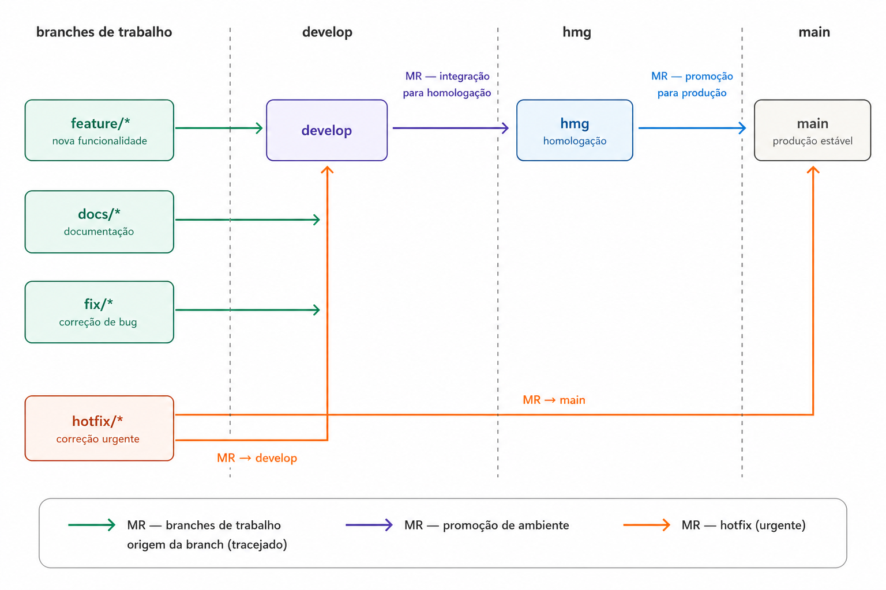

<p align='center'>
  <a href='https://www.inteli.edu.br/'>
    
  </a>
</p>

# Projeto: Azum

## Integrantes

- [Ana Cristina Jardim](https://www.linkedin.com/in/ana-cristina-jardim/)
- [Felipe Simão](https://www.linkedin.com/in/felipefmsimao/)
- [Karol Barbosa Rocha](https://www.linkedin.com/in/karolbarbosarocha/)
- [Matheus Ferreira da Silva](https://www.linkedin.com/in/matheusferreirads-/)
- [Paulo Henrique Bueno Fernandes](https://www.linkedin.com/in/paulo-henrique0601/)
- [Rui Facó](https://www.linkedin.com/in/ruifac%C3%B3/)
- [Tobias Viana](https://www.linkedin.com/in/tobias-viana/)


# Gestão de Configuração

## Sumário

<details>
<summary><strong>1. Introdução</strong></summary>

- [1.1 Objetivo do documento](#11-objetivo-do-documento)
- [1.2 Princípios da gestão de configuração](#12-princípios-da-gestão-de-configuração)

</details>

<details>
<summary><strong>2. Fluxo Gitflow</strong></summary>

- [2.1 Visão geral](#21-visão-geral)
- [2.2 Estrutura de branches](#22-estrutura-de-branches)
- [2.3 Fluxo entre branches](#23-fluxo-entre-branches)

</details>

<details>
<summary><strong>3. Política de Criação de Branches</strong></summary>

- [3.1 Convenção de nomenclatura](#31-convenção-de-nomenclatura)
- [3.2 Procedimento de criação](#32-procedimento-de-criação)
- [3.3 Atualização de uma branch de trabalho](#33-atualização-de-uma-branch-de-trabalho)

</details>

<details>
<summary><strong>4. Política de Integração e Exclusão</strong></summary>

- [4.1 Merge Requests](#41-merge-requests)
- [4.2 Procedimento de merge](#42-procedimento-de-merge)
- [4.3 Exclusão de branches](#43-exclusão-de-branches)
- [4.4 Releases e hotfixes](#44-releases-e-hotfixes)
- [4.5 Proteção de branches e conflitos](#45-proteção-de-branches-e-conflitos)

</details>

<details>
<summary><strong>5. Rastreabilidade e Commits</strong></summary>

- [5.1 Vínculo com tasks](#51-vínculo-com-tasks)
- [5.2 Convenção de commits](#52-convenção-de-commits)
- [5.3 Evidências de aplicação](#53-evidências-de-aplicação)

</details>

<details>
<summary><strong>6. Exemplos Práticos</strong></summary>

- [6.1 Desenvolvimento de uma feature de documentação](#61-desenvolvimento-de-uma-feature-de-documentação)
- [6.2 Preparação de uma release](#62-preparação-de-uma-release)
- [6.3 Correção por hotfix](#63-correção-por-hotfix)

</details>

- [7. Checklist de Conformidade](#7-checklist-de-conformidade)


---

# 1. Introdução

## 1.1 Objetivo do documento

&emsp; Este documento define as políticas de gestão de configuração adotadas pela equipe no projeto Azum ao longo do Módulo 7 do Inteli. Estão registrados aqui o fluxo Gitflow adaptado ao módulo, as convenções de nomenclatura de branches, os procedimentos de criação, integração e exclusão de branches, a política de commits e os exemplos práticos que ilustram a aplicação dessas políticas no contexto do projeto. O documento é complementar ao [GestaoProjeto.md](./GestaoProjeto.md), que registra as políticas de processo de desenvolvimento, os acordos de convivência e a gestão das sprints.


## 1.2 Princípios da gestão de configuração

&emsp; A gestão de configuração do projeto Azum é orientada por quatro princípios fundamentais. O primeiro é a **rastreabilidade**: toda mudança autoral no repositório deve estar associada a uma issue do GitLab, de modo que seja possível identificar por que a alteração foi feita, quem a fez e em qual sprint. Commits de merge gerados pelo GitLab são exceção ao formato autoral, pois sua rastreabilidade decorre do próprio Merge Request. O segundo princípio é a **revisão por pares**: nenhuma alteração é integrada às branches estáveis sem aprovação de um integrante diferente do autor, garantindo qualidade e distribuição do conhecimento. O terceiro é a **proteção das branches estáveis**: `main`, `develop` e, quando configurada, `hmg` não recebem commits diretos; toda integração ocorre por Merge Request aprovado. O quarto é a **cadência distribuída**: o trabalho deve ser realizado ao longo da sprint, com commits frequentes e progressivos, evitando a concentração de entregas no último dia.

---

# 2. Fluxo Gitflow

## 2.1 Visão geral

&emsp; O projeto Azum adota um fluxo baseado no Gitflow, adaptado às exigências do Módulo 7 do Inteli. O Gitflow organiza o desenvolvimento em branches com responsabilidades bem definidas, separando o trabalho em andamento das versões estáveis e dos ambientes de validação. O fluxo documentado prevê a branch `hmg` como ambiente intermediário de homologação entre `develop` e `main`, além da promoção contínua das entregas ao longo da sprint. Entretanto, a inspeção das branches locais e remotas disponíveis não encontrou `hmg`; sua criação e proteção ainda precisam ser confirmadas antes que esse trecho possa ser tratado como prática evidenciada. O fluxo planejado é:

- fluxo regular: `feature/*`, `docs/*` e `fix/*` → `develop` → `hmg` → `main`;
- correção urgente: `hotfix/*` parte de `main` e retorna por MRs separados para `main` e `develop`.

## 2.2 Estrutura de branches


| Branch | Origem | Finalidade | Destino do merge | Permanência |
|---|---|---|---|---|
| `main` | — | Versões estáveis e entregáveis | — | Permanente |
| `develop` | `main` | Integração contínua do trabalho da sprint | `hmg`, por MR | Permanente |
| `hmg` | `develop` | Homologação da versão candidata antes de produção | `main`, por MR | Permanente |
| `feature/<descricao>` | `develop` | Nova funcionalidade ou artefato | `develop`, por MR | Temporária |
| `docs/<descricao>` | `develop` | Documentação | `develop`, por MR | Temporária |
| `fix/<descricao>` | `develop` | Correção de bug | `develop`, por MR | Temporária |
| `hotfix/<descricao>` | `main` | Correção urgente em produção | `main` e `develop`, por MR | Temporária |
| `release/<versao>` | `develop` | Estabilização antes da homologação | `develop` e `hmg`, por MRs separados; depois `hmg` → `main` (ou `develop` e `main`, se `hmg` não for adotada) | Temporária |

&emsp; [PENDENTE — o responsável pela gestão de configuração deve confirmar a criação da branch `hmg` no GitLab e anexar evidência de sua proteção. Se a equipe decidir não utilizá-la, o fluxo e o diagrama devem ser ajustados para promover releases diretamente a `main`.]

## 2.3 Fluxo entre branches

  <div align="center">
  <br>
  <sup>Fonte: Material produzido pelos autores, 2026.</sup>
</div>

---

# 3. Política de Criação de Branches

## 3.1 Convenção de nomenclatura

&emsp; Todo nome de branch deve seguir o padrão validado pelo dashboard do módulo:

    <prefixo>/<descricao-curta-em-kebab-case>


&emsp; O dashboard valida o nome contra o seguinte padrão:

    ^(feature|feat|fix|bugfix|hotfix|docs|doc|style|refactor|test|chore|perf|ci|build|release)/


| Prefixo | Quando usar |
|---|---|
| `feature/` ou `feat/` | Nova funcionalidade |
| `fix/` ou `bugfix/` | Correção de bug |
| `docs/` ou `doc/` | Apenas documentação |
| `style/` | Formatação sem alteração de comportamento |
| `refactor/` | Reescrita sem nova feature nem correção |
| `test/` | Adição ou correção de testes |
| `chore/` | Manutenção, dependências, configurações |
| `perf/` | Melhoria de desempenho |
| `ci/` | Pipelines de integração e entrega contínua |
| `build/` | Build, empacotamento e scripts de release |
| `hotfix/` | Correção urgente em produção |
| `release/` | Estabilização antes de promover para `hmg` e `main` |

**Regras:**
- Letras minúsculas, sem acentos, sem espaços — usar hífen como separador;
- Descrição curta e objetiva, que identifique a issue sem precisar abri-la;
- Nunca usar nome de pessoa, número de sprint isolado ou termos genéricos como `desenvolvimento`, `tarefa` ou `atualização`.

**Exemplos válidos:**

    docs/brainstorming-features
    feature/classificador-intencoes-pln
    fix/corrigir-retorno-consulta-projeto
    refactor/reorganizar-modulo-pln
    test/cobrir-deteccao-fora-catalogo


**Exemplos inválidos:**

    desenvolvimento-ana  / sem prefixo, com nome de pessoa
    sprint2-documentacao /  sem prefixo com barra
    docs / sem descrição
    feature/Atualização Pipeline  maiúsculas, acento e espaço


## 3.2 Procedimento de criação

```bash
git checkout develop
git pull origin develop
git checkout -b docs/brainstorming-features
git push -u origin docs/brainstorming-features
```

&emsp; Antes de iniciar o trabalho, a issue correspondente deve estar refinada com DoR atendido, labels, milestone e assignee preenchidos, e o card movido de open para backlog no Kanban do GitLab.

## 3.3 Atualização de uma branch de trabalho

&emsp; Antes de abrir ou atualizar um Merge Request, o autor deve incorporar à branch de trabalho o estado mais recente de `develop`. O projeto adota merge explícito para essa sincronização, coerente com a preservação do histórico definida na Seção 4.2:

```bash
git checkout develop
git pull --ff-only origin develop
git checkout docs/brainstorming-features
git merge develop
```

&emsp; Depois da sincronização, o autor executa as verificações aplicáveis à task e envia a branch com `git push`. Se houver conflitos, o merge permanece local e incompleto até que sejam resolvidos conforme a Seção 4.5. Não se deve usar `git push --force` nas branches compartilhadas ou protegidas.

---

# 4. Política de Integração e Exclusão

## 4.1 Merge Requests

| Critério | Regra da equipe |
|---|---|
| Branch de destino correta | Branches de trabalho apontam para `develop`; `develop` aponta para `hmg`; `hmg` aponta para `main` |
| Quantidade mínima de revisores | Um revisor, diferente do autor |
| Critérios de aprovação | Pelo menos um comentário de revisão real — aprovação sem comentário não conta |
| Tratamento de conflitos | O autor resolve os conflitos antes de solicitar a revisão |
| Evidências obrigatórias | `Closes #N` na descrição, seções `## O que foi feito` e `## Como testar`, labels e milestone preenchidos |

**Template mínimo de MR:**

```markdown
Closes #<número da issue>

## O que foi feito
- <ponto principal>
- <ponto secundário>

## Como testar
1. <passo>
2. <passo>
3. <resultado esperado>

## Checklist
- [ ] Sem warnings de lint
- [ ] Documentação atualizada (se aplicável)
- [ ] MR aprovado por 1 revisor
```

## 4.2 Procedimento de merge

1. Garantir que a branch de trabalho está atualizada em relação a `develop` e resolver eventuais conflitos antes de abrir o MR;
2. Abrir o MR no GitLab apontando para `develop`, preenchendo título descritivo, descrição com `Closes #N`, labels e milestone;
3. Designar o reviewer antes de solicitar o merge — o autor não revisa o próprio MR;
4. Aguardar a revisão com pelo menos um comentário registrado no MR e realizar os ajustes solicitados;
5. Após aprovação, realizar o merge pelo GitLab — a estratégia adotada é **merge commit** para preservar o histórico completo;
6. Excluir a branch de trabalho imediatamente após o merge.

As promoções de ambiente seguem o mesmo controle: um MR de `develop` para `hmg` e outro MR, separado, de `hmg` para `main`. Cada promoção exige revisão e aprovação próprias.

## 4.3 Exclusão de branches

&emsp; Branches de trabalho devem ser excluídas imediatamente após o merge, para manter o repositório organizado. A exclusão pode ser feita pelo GitLab no momento do merge (opção "Delete source branch") ou manualmente:

```bash
git push origin --delete docs/brainstorming-features
git branch -d docs/brainstorming-features
git checkout develop
git pull origin develop
```

## 4.4 Releases e hotfixes

**Release:**

```bash
git checkout develop && git pull origin develop
git checkout -b release/v1.0.0
# realizar e validar os ajustes de estabilização
git add <arquivos-alterados>
git commit -m "chore: preparar release v1.0.0 (#N)"
git push -u origin release/v1.0.0
```

&emsp; Após a estabilização, abrir dois MRs a partir de `release/*`: um para `develop`, devolvendo os ajustes de estabilização à linha de desenvolvimento, e outro para `hmg`, iniciando a homologação. Após a aprovação em `hmg`, abrir um MR separado de `hmg` para `main`. Se `hmg` não for adotada, o segundo MR da release deve apontar diretamente para `main`. Depois da integração em `main`, criar a tag e excluir a branch de release:

```bash
git checkout main && git pull origin main
git tag -a v1.0.0 -m "Release v1.0.0 — Sprint 01"
git push origin v1.0.0
git push origin --delete release/v1.0.0
```

**Hotfix:**

```bash
git checkout main && git pull origin main
git checkout -b hotfix/corrigir-falha-classificador
# realizar e validar a correção urgente
git add <arquivos-alterados>
git commit -m "fix(pln): corrigir falha na classificacao de intencao (#N)"
git push -u origin hotfix/corrigir-falha-classificador
```

&emsp; Após a correção, abrir MR para `main` e, depois do merge, abrir outro MR para sincronizar a alteração com `develop`. A atualização chegará a `hmg` na promoção seguinte de `develop` para homologação. Excluir a branch de hotfix ao final.

## 4.5 Proteção de branches e conflitos

### Proteção

&emsp; Commits e pushes diretos para `main`, `develop` e `hmg` são proibidos. A integração deve ocorrer por Merge Request, com pelo menos um revisor diferente do autor e com os critérios da Seção 4.1 atendidos. Somente integrantes autorizados pelo grupo podem concluir o merge; o autor pode realizá-lo apenas depois da aprovação registrada pelo revisor. A rotação de responsáveis pelas promoções para `main` está definida no Contrato de Convivência.

&emsp; [PENDENTE — o responsável pela gestão de configuração deve anexar captura de tela ou link acessível das regras de proteção configuradas no GitLab para `main`, `develop` e, se adotada, `hmg`. O documento define a política, mas a configuração efetiva não é verificável no repositório local.]

### Tratamento de conflitos

1. O autor atualiza `develop` e executa `git merge develop` em sua própria branch de trabalho;
2. identifica os arquivos marcados como conflitantes com `git status`;
3. consulta o autor do conteúdo afetado quando a escolha entre versões envolver decisão de negócio ou técnica;
4. resolve os marcadores de conflito nos arquivos e executa as verificações aplicáveis;
5. adiciona somente os arquivos resolvidos com `git add <arquivo>` e conclui o merge com `git commit`;
6. envia a branch atualizada e registra no Merge Request como o conflito foi resolvido;
7. solicita nova revisão caso a resolução tenha alterado conteúdo já aprovado.

&emsp; Conflitos nunca são resolvidos por commits diretos em `develop`, `hmg` ou `main`. Também não se utiliza `git reset --hard` ou push forçado como procedimento de resolução.

---

# 5. Rastreabilidade e Commits

## 5.1 Vínculo com tasks

&emsp; Toda branch de trabalho, todo commit autoral e todo Merge Request do projeto Azum devem estar associados a uma issue do GitLab. O vínculo é estabelecido de três formas: o nome da branch descreve a issue desenvolvida; cada commit autoral referencia a issue com `#N`; e o MR contém `Closes #N` na descrição, encerrando a issue automaticamente quando o merge é realizado. Commits de merge gerados pela plataforma são rastreados pelo MR correspondente e não precisam repetir o padrão de mensagem autoral.

## 5.2 Convenção de commits

&emsp; Os commits seguem o padrão Conventional Commits, padronizado em português. O formato adotado é:

    <tipo>(<escopo opcional>): <descrição curta em português> (#N)


**Regras:**
- Descrição no infinitivo (adicionar / correto — adicionei / incorreto);
- Máximo de 72 caracteres na primeira linha;
- Um commit = uma intenção — não misturar tipos diferentes;
- Referência à issue obrigatória com `#N`;
- Commits distribuídos ao longo da sprint — concentrar no último dia é anti-padrão penalizado pelo dashboard.

| Tipo | Quando usar |
|---|---|
| `feat` | Nova funcionalidade |
| `fix` | Correção de bug |
| `docs` | Apenas documentação |
| `style` | Formatação sem alteração de comportamento |
| `refactor` | Reescrita sem nova feature nem correção |
| `test` | Adicionar ou corrigir testes |
| `chore` | Manutenção, dependências, configurações |
| `perf` | Melhoria de performance |
| `ci` | Pipeline de CI/CD |
| `build` | Build, empacotamento, scripts de release |
| `revert` | Reverter um commit anterior |

**Exemplos válidos:**

    docs: adicionar brainstorming de features (#16)
    feat(pln): adicionar classificador de intencoes (#15)
    fix(api): corrigir retorno vazio em consulta de projeto (#23)
    test(intencoes): cobrir caso de solicitacao fora do catalogo (#19)


**Exemplos inválidos:**

    atualização documentação — sem tipo, sem #N
    docs: atualizei o brainstorming — verbo no passado
    feat: nova feature (#15) — descrição genérica


## 5.3 Evidências de aplicação

| Evidência | Link | O que demonstra |
|---|---|---|
| Issue | [Issue #16](https://git.inteli.edu.br/graduacao/2026-2a/t17/g01/-/issues/16) | Task refinada com DoR, DoD, labels, milestone e assignee |
| Branch | [docs/brainstorming-features](https://git.inteli.edu.br/graduacao/2026-2a/t17/g01/-/tree/docs/brainstorming-features) | Nomenclatura padronizada e origem em `develop` |
| Merge Request | [MR !11](https://git.inteli.edu.br/graduacao/2026-2a/t17/g01/-/merge_requests/11) | Vínculo com a issue, reviewer designado e revisão real |
| Histórico de commits | [Commits da branch](https://git.inteli.edu.br/graduacao/2026-2a/t17/g01/-/commits/docs/brainstorming-features) | Commits semânticos em português com `#N` distribuídos ao longo da sprint |

&emsp; Os links acima são evidências declaradas pela equipe. O histórico local confirma a existência de branches de trabalho com prefixos padronizados, commits autorais vinculados a issues e merges em `develop`. O conteúdo completo da issue e do Merge Request depende de acesso ao GitLab e, portanto, não pôde ser validado apenas com os arquivos locais. Não foram encontradas evidências locais de uso de `release/*`, `hotfix/*` ou `hmg`; as Seções 6.2 e 6.3 são exemplos de aplicação futura, não registros de execução.

---

# 6. Exemplos Práticos

## 6.1 Desenvolvimento de uma feature de documentação

**Contexto:** implementar a seção de brainstorming de features no Projeto.md (issue #16, Sprint 01).

```bash
git checkout develop && git pull origin develop
git checkout -b docs/brainstorming-features
git push -u origin docs/brainstorming-features

git commit -m "docs: adicionar introducao do brainstorming de features (#16)"
git commit -m "docs: adicionar tabela de priorizacao de features (#16)"
git commit -m "docs: adicionar analise das faixas de priorizacao (#16)"
git push -u origin docs/brainstorming-features
```

&emsp; O fluxo foi concluído pelo [Merge Request !11](https://git.inteli.edu.br/graduacao/2026-2a/t17/g01/-/merge_requests/11), aberto para `develop` com título descritivo, vínculo `Closes #16`, reviewer designado, labels e milestone da Sprint 01. Após a aprovação e o merge, a branch de trabalho deve ser excluída.

## 6.2 Preparação de uma release

**Contexto ilustrativo:** estabilizar as entregas de uma sprint antes de promover a versão para `main`. Este exemplo descreve a política; não constitui evidência de que uma branch de release já tenha sido utilizada.

```bash
git checkout develop && git pull origin develop
git checkout -b release/v1.0.0
# realizar e validar os ajustes de estabilização
git add <arquivos-alterados>
git commit -m "chore: preparar release v1.0.0 (#N)"
git push -u origin release/v1.0.0
```

&emsp; Abrir um MR da release para `develop` e outro para `hmg`. Depois da homologação, promover `hmg` para `main`. Se a branch `hmg` não for adotada, abrir o segundo MR diretamente da release para `main`. Por fim, criar a tag em `main`:

```bash
git checkout main && git pull origin main
git tag -a v1.0.0 -m "Release v1.0.0 — Sprint 01"
git push origin v1.0.0
git push origin --delete release/v1.0.0
```

## 6.3 Correção por hotfix

**Contexto ilustrativo:** corrigir uma falha crítica no classificador de intenções após integração em `main`. A issue `#34` é usada apenas para demonstrar a convenção e não é apresentada como evidência de hotfix executado.

```bash
git checkout main && git pull origin main
git checkout -b hotfix/corrigir-falha-classificador
git push -u origin hotfix/corrigir-falha-classificador

git commit -m "fix(pln): corrigir falha na classificacao de intencao (#34)"
git commit -m "test(pln): adicionar caso de teste para falha corrigida (#34)"
git push -u origin hotfix/corrigir-falha-classificador
```

&emsp; Abrir MR para `main`. Após o merge, abrir MR de sincronização para `develop`, promover normalmente para `hmg` no próximo ciclo de homologação e excluir a branch.

---

# 7. Checklist de Conformidade

- [ ] A issue tem DoR, DoD, labels, milestone e assignee preenchidos e está em backlog antes de ir para doing.
- [ ] A branch foi criada a partir de `develop` (ou de `main`, no caso de hotfix).
- [ ] O nome da branch segue a convenção: `<prefixo>/<descricao-em-kebab-case>`.
- [ ] Os commits seguem Conventional Commits em português com `#N` e estão distribuídos ao longo da sprint.
- [ ] O MR aponta para a branch correta e contém `Closes #N`, `## O que foi feito` e `## Como testar`.
- [ ] O reviewer foi designado antes do merge e registrou pelo menos um comentário real.
- [ ] Labels e milestone estão preenchidos no MR.
- [ ] O merge seguiu a estratégia definida (merge commit).
- [ ] A branch temporária foi excluída após o merge.
- [ ] O card no Kanban foi movido para closed após o merge.
