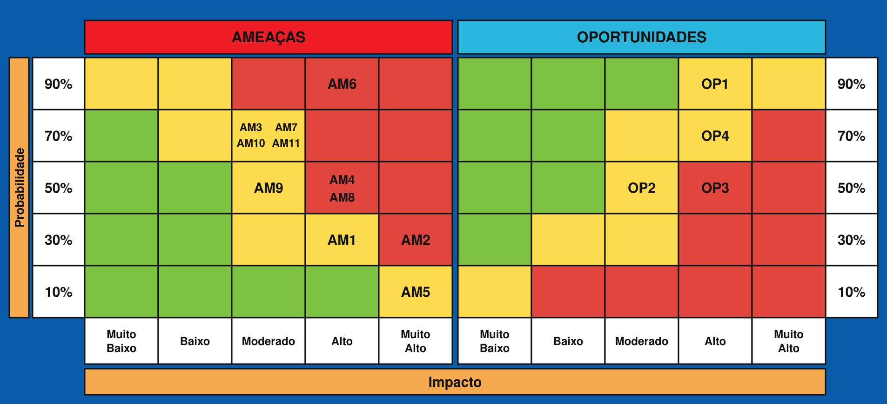
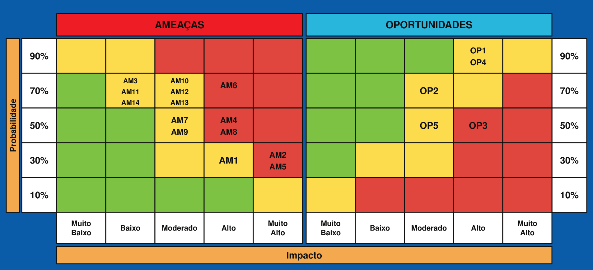

  

# Projeto: AZ1

## Integrantes

- [Ana Cristina Jardim](https://www.linkedin.com/in/ana-cristina-jardim/)
- [Felipe Simão](https://www.linkedin.com/in/felipefmsimao/)
- [Karol Barbosa Rocha](https://www.linkedin.com/in/karolbarbosarocha/)
- [Matheus Ferreira da Silva](https://www.linkedin.com/in/matheusferreirads-/)
- [Paulo Henrique Bueno Fernandes](https://www.linkedin.com/in/paulo-henrique0601/)
- [Rui Facó](https://www.linkedin.com/in/ruifac%C3%B3/)
- [Tobias Viana](https://www.linkedin.com/in/tobias-viana/)
---

# Gestão do Projeto

## Sumário

<strong>1. Introdução</strong>

- [1.1 Objetivo do documento](#11-objetivo-do-documento)
- [1.2 Organização evolutiva do documento](#12-organização-evolutiva-do-documento)

<strong>2. Acordos e Práticas Permanentes</strong>

- [2.1 Contrato de Convivência, SLA e Rituais](#21-contrato-de-convivência-sla-e-rituais)
  - [2.1.1 Regra de Ouro](#211-regra-de-ouro)
  - [2.1.2 Resolução de impasses](#212-resolução-de-impasses)
  - [2.1.3 Gestão de conflitos](#213-gestão-de-conflitos)
  - [2.1.4 Quadro Kanban](#214-quadro-kanban)
  - [2.1.5 Comunicação oficial](#215-comunicação-oficial)
  - [2.1.6 Dailies e demais rituais](#216-dailies-e-demais-rituais)
  - [2.1.7 Acordos adicionais](#217-acordos-adicionais)
  - [2.1.8 Histórico de revisões do contrato](#218-histórico-de-revisões-do-contrato)
- [2.2 Gestão do Processo de Desenvolvimento](#22-gestão-do-processo-de-desenvolvimento)
  - [2.2.1 Fluxo de trabalho](#221-fluxo-de-trabalho)
  - [2.2.2 Política de atualização do GitLab](#222-política-de-atualização-do-gitlab)
  - [2.2.3 Política de commits](#223-política-de-commits)
  - [2.2.4 Revisão e melhoria contínua](#224-revisão-e-melhoria-contínua)
  - [2.2.5 Critérios de início e conclusão](#225-critérios-de-início-e-conclusão)
  - [2.2.6 Atualização de branches e tratamento de conflitos](#226-atualização-de-branches-e-tratamento-de-conflitos)
- [2.3 Acompanhamento Contínuo dos Riscos](#23-acompanhamento-contínuo-dos-riscos)

<strong>3. Sprint 1</strong>

- [3.1 Visão geral da entrega](#31-visão-geral-da-entrega)
- [3.2 Análise e retrospectiva da Sprint 1](#32-análise-e-retrospectiva-da-sprint-1)
  - [3.2.1 Síntese da sprint](#321-síntese-da-sprint)
  - [3.2.2 Pontos fortes](#322-pontos-fortes)
  - [3.2.3 Pontos fracos](#323-pontos-fracos)
  - [3.2.4 Ações de melhoria para a Sprint 2](#324-ações-de-melhoria-para-a-sprint-2)
  - [3.2.5 Revisão dos riscos na Sprint 1](#325-revisão-dos-riscos-na-sprint-1)
  - [3.2.6 Alinhamento com o Escritório de Projetos](#326-alinhamento-com-o-escritório-de-projetos)
- [3.3 Matriz de Papéis e Responsabilidades](#33-matriz-de-papéis-e-responsabilidades)
- [3.4 Planejamento da Sprint 2](#34-planejamento-da-sprint-2)

<strong>4. Sprint 2</strong>

- [4.1 Visão geral da entrega](#41-visão-geral-da-entrega)
- [4.2 Análise e retrospectiva da Sprint 2](#42-análise-e-retrospectiva-da-sprint-2)
  - [4.2.1 Síntese da sprint](#421-síntese-da-sprint)
  - [4.2.2 Pontos fortes](#422-pontos-fortes)
  - [4.2.3 Pontos fracos](#423-pontos-fracos)
  - [4.2.4 Ações de melhoria](#424-ações-de-melhoria)
  - [4.2.5 Alinhamento com o Escritório de Projetos](#425-alinhamento-com-o-escritório-de-projetos)
- [4.3 Matriz de Risco do Projeto](#43-matriz-de-risco-do-projeto)
  - [4.3.1 Critério de severidade](#431-critério-de-severidade)
  - [4.3.2 Revisão das ameaças na Sprint 2](#432-revisão-das-ameaças-na-sprint-2)
  - [4.3.3 Revisão das oportunidades na Sprint 2](#433-revisão-das-oportunidades-na-sprint-2)
  - [4.3.4 Novos itens identificados na Sprint 2](#434-novos-itens-identificados-na-sprint-2)
  - [4.3.5 Efetividade das respostas aplicadas](#435-efetividade-das-respostas-aplicadas)
  - [4.3.6 Quadro consolidado e representação visual](#436-quadro-consolidado-e-representação-visual)
  - [4.3.7 Análise dos três itens mais críticos](#437-análise-dos-três-itens-mais-críticos)
  - [4.3.8 Histórico de acompanhamento](#438-histórico-de-acompanhamento)
- [4.4 Matriz de Papéis e Responsabilidades da Sprint 2](#44-matriz-de-papéis-e-responsabilidades-da-sprint-2)
  - [4.4.1 Papéis, responsabilidades e rotação](#441-papéis-responsabilidades-e-rotação)
  - [4.4.2 Critérios de distribuição](#442-critérios-de-distribuição)
  - [4.4.3 Evidência versionada da rotação](#443-evidência-versionada-da-rotação)
- [4.5 Revisão do Contrato de Convivência, SLA e Rituais](#45-revisão-do-contrato-de-convivência-sla-e-rituais)
- [4.6 Revisão da Gestão do Processo de Desenvolvimento](#46-revisão-da-gestão-do-processo-de-desenvolvimento)
- [4.7 Planejamento da Sprint 3](#47-planejamento-da-sprint-3)
  - [4.7.1 Objetivo da sprint](#471-objetivo-da-sprint)
  - [4.7.2 Priorização e sequenciamento](#472-priorização-e-sequenciamento)
  - [4.7.3 Escala de estimativas](#473-escala-de-estimativas)
  - [4.7.4 Lista de tasks estimadas](#474-lista-de-tasks-estimadas)
  - [4.7.5 Detalhamento das tasks](#475-detalhamento-das-tasks)
  - [4.7.6 Artefato, evidência e designação por task](#476-artefato-evidência-e-designação-por-task)
  - [4.7.7 Registro das tasks no Kanban](#477-registro-das-tasks-no-kanban)

<strong>5. Sprint 3</strong>

- [5.1 Visão geral da entrega](#51-visão-geral-da-entrega)
- [5.2 Análise e retrospectiva da Sprint 3](#52-análise-e-retrospectiva-da-sprint-3)
  - [5.2.1 Síntese da sprint](#521-síntese-da-sprint)
  - [5.2.2 Acompanhamento das ações da Sprint 2](#522-acompanhamento-das-ações-da-sprint-2)
  - [5.2.3 Pontos fortes](#523-pontos-fortes)
  - [5.2.4 Pontos fracos](#524-pontos-fracos)
  - [5.2.5 Ações de melhoria para a Sprint 4](#525-ações-de-melhoria-para-a-sprint-4)
  - [5.2.6 Alinhamento com o Escritório de Projetos](#526-alinhamento-com-o-escritório-de-projetos)
- [5.3 Matriz de Risco do Projeto](#53-matriz-de-risco-do-projeto)
  - [5.3.1 Critério de severidade](#531-critério-de-severidade)
  - [5.3.2 Revisão das ameaças na Sprint 3](#532-revisão-das-ameaças-na-sprint-3)
  - [5.3.3 Revisão das oportunidades na Sprint 3](#533-revisão-das-oportunidades-na-sprint-3)
  - [5.3.4 Novos itens identificados na Sprint 3](#534-novos-itens-identificados-na-sprint-3)
  - [5.3.5 Efetividade das respostas aplicadas](#535-efetividade-das-respostas-aplicadas)
  - [5.3.6 Quadro consolidado e representação visual](#536-quadro-consolidado-e-representação-visual)
  - [5.3.7 Análise dos três itens mais críticos](#537-análise-dos-três-itens-mais-críticos)
  - [5.3.8 Histórico de acompanhamento](#538-histórico-de-acompanhamento)
- [5.4 Matriz de Papéis e Responsabilidades da Sprint 3](#54-matriz-de-papéis-e-responsabilidades-da-sprint-3)
  - [5.4.1 Papéis, responsabilidades e rotação](#541-papéis-responsabilidades-e-rotação)
  - [5.4.2 Evidência versionada e colaborações efetivas](#542-evidência-versionada-e-colaborações-efetivas)
  - [5.4.3 Avaliação da distribuição](#543-avaliação-da-distribuição)
- [5.5 Revisão do Contrato de Convivência, SLA e Rituais](#55-revisão-do-contrato-de-convivência-sla-e-rituais)
- [5.6 Revisão da Gestão do Processo de Desenvolvimento](#56-revisão-da-gestão-do-processo-de-desenvolvimento)
  - [5.6.1 Aderência das políticas na Sprint 3](#561-aderência-das-políticas-na-sprint-3)
  - [5.6.2 Ferramenta pessoal de apoio ao backlog](#562-ferramenta-pessoal-de-apoio-ao-backlog)

- [5.7 Estratégia de planejamento da Sprint 4](#57-estratégia-de-planejamento-da-sprint-4)
  - [5.7.1 Objetivo e sequência das frentes](#571-objetivo-e-sequência-das-frentes)
  - [5.7.2 Planejamento e acompanhamento no Kanban](#572-planejamento-e-acompanhamento-no-kanban)

---

# 1. Introdução

## 1.1 Objetivo do documento

Este documento reúne as práticas permanentes de gestão adotadas pela equipe ao longo do módulo e os registros específicos de cada sprint. De um lado, consolida os acordos de convivência, os rituais, as políticas de processo e o mecanismo de acompanhamento dos riscos, que valem desde a Sprint 1 até o encerramento do projeto. De outro, preserva, sprint a sprint, a análise retrospectiva, a matriz de papéis e responsabilidades e o planejamento do ciclo seguinte, permitindo rastrear a evolução da equipe e das entregas ao longo do tempo. O objetivo é garantir que o grupo opere de forma organizada, transparente e coerente com os critérios do Escritório de Projetos, e que qualquer integrante ou avaliador consiga compreender o estado do projeto e as decisões tomadas em cada etapa.

## 1.2 Organização evolutiva do documento

O documento está dividido em duas grandes partes. A primeira, composta pela Seção 2, reúne os acordos e práticas permanentes que se aplicam a todo o módulo: o Contrato de Convivência, a Gestão do Processo de Desenvolvimento e o mecanismo de Acompanhamento Contínuo dos Riscos. Essas diretrizes não são reescritas a cada sprint, e eventuais ajustes são incorporados sem apagar o histórico dos acordos anteriores, de modo que a evolução dos combinados fique registrada. A segunda parte, composta pelas Seções 3 a 5, reúne os registros específicos de cada sprint: a síntese e a retrospectiva, a revisão dos riscos, a matriz de papéis e responsabilidades e o planejamento da sprint seguinte. Cada sprint preserva seus próprios registros, sem sobrescrever os das sprints anteriores, o que permite acompanhar a evolução da equipe ao longo do módulo. A gestão de configuração, por sua vez, está documentada em arquivo separado, o GestaoConfiguracao.md, que define o fluxo gitflow, as políticas de branches e os procedimentos de criação, mesclagem e exclusão.

---

# 2. Acordos e Práticas Permanentes

As diretrizes desta seção valem para todo o módulo. Alterações devem ser discutidas pela equipe e registradas, sem apagar o histórico dos acordos anteriores.

## 2.1 Contrato de Convivência, SLA e Rituais

### 2.1.1 Regra de Ouro

> **Nossa Regra de Ouro:** Toda entrega deve ser concluída até quinta-feira, respeitando o prazo definido pelo próprio grupo para cada tarefa, garantindo tempo hábil para revisão antes da Sprint Review.

### 2.1.2 Resolução de impasses

 Em caso de discordância técnica, os integrantes envolvidos apresentam seus argumentos e as alternativas são submetidas a votação por maioria simples. Se nenhuma alternativa alcançar a maioria ou se houver empate, realiza-se uma roleta apenas entre as opções empatadas. O resultado define a decisão a ser seguida pela equipe. A decisão e as alternativas consideradas devem ser registradas no canal oficial correspondente ao assunto, para que o histórico permaneça acessível.

### 2.1.3 Gestão de conflitos

| Etapa | Gatilho | Ação | Participantes | Prazo de resposta |
|---|---|---|---|---|
| 1 | Primeiro atraso, sinal de baixo engajamento ou descumprimento de um acordo | Realizar feedback direto e informal na Daily, ouvindo o integrante e combinando uma ação de correção | Integrante envolvido e equipe | Na primeira Daily após a identificação do problema |
| 2 | Persistência do problema após o feedback inicial | Realizar alinhamento formal na Retrospectiva da Sprint e registrar o problema, o compromisso assumido, o responsável e o prazo acordado | Integrante envolvido e equipe | Na retrospectiva da sprint em andamento |
| 3 | Descumprimento do acordo formal ou ausência de resolução | Acionar o orientador, apresentando o histórico dos alinhamentos e solicitando apoio para encaminhar a situação | Equipe, integrante envolvido e orientador | Imediatamente após a constatação de que o acordo formal não foi cumprido |

### 2.1.4 Quadro Kanban

- **Ferramenta:** GitLab.
- **Criação das tasks:** no início de cada sprint, durante a Sprint Planning, com todas as informações mínimas definidas pela equipe.
- **Atualização obrigatória:** continuamente, sempre que uma task mudar de estado, e obrigatoriamente antes de cada Daily.
- **Responsável pela atualização:** cada integrante é responsável pelos próprios cards, desde a criação ou atribuição até o encerramento.
- **Informações mínimas:** descrição, tipo, prioridade, estimativa, DoR, DoD, responsável e dependências.

 A gestão de um card não deve comprometer o fluxo de trabalho do revisor previamente designado. O responsável pela task deve disponibilizar a entrega com antecedência suficiente para uma revisão de qualidade e observar a Regra de Ouro, segundo a qual as entregas devem estar concluídas até quinta-feira. Impedimentos, mudanças de prazo ou dependências que possam afetar a revisão devem ser registrados no card e comunicados na Daily assim que forem identificados.

### 2.1.5 Comunicação oficial

- **Canal oficial interno:** grupo da equipe no WhatsApp, utilizado para comunicação cotidiana, alinhamentos operacionais e avisos entre os integrantes.
- **Canal oficial institucional:** grupo do Slack, utilizado para decisões, solicitações e alinhamentos que envolvam professores, docentes ou orientadores.
- **Registro das decisões:** decisões internas são registradas no WhatsApp; decisões relacionadas ao corpo docente ou à orientação são registradas no Slack. Decisões que alterem escopo, processo ou arquitetura também devem ser consolidadas na documentação ou na issue correspondente do GitLab.
- **SLA para mensagens comuns:** as mensagens devem ser respondidas até a próxima Daily ou, quando enviadas após o período de trabalho do grupo, até o início do período seguinte.
- **SLA para bloqueios urgentes:** impedimentos que interrompam o avanço de uma task devem ser sinalizados imediatamente no WhatsApp e receber uma primeira resposta durante o mesmo período de trabalho. Caso não sejam resolvidos, devem ser apresentados na Daily seguinte e registrados na issue relacionada.

### 2.1.6 Dailies e demais rituais

| Ritual | Formato | Frequência | Duração máxima | Participantes | Registro |
|---|---|---|---|---|---|
| Daily | Presencial, em pé; na impossibilidade de participação, atualização assíncrona em um dos canais oficiais | Diária, nos dias de trabalho do grupo | 15 minutos | Equipe | Impedimentos e decisões são registrados no canal oficial ou na issue relacionada |
| Sprint Planning | Presencial | No início de cada sprint | Conforme o tempo reservado no calendário acadêmico | Equipe | Issues, responsáveis, revisores, prioridades, estimativas e milestone no GitLab |
| Sprint Review | Presencial | Ao final de cada sprint | Conforme o tempo reservado no calendário acadêmico | Equipe, docentes, orientador e demais participantes convidados | Feedback recebido e ajustes necessários registrados nas issues ou na documentação |
| Retrospectiva | Presencial | Ao final de cada sprint | Conforme o tempo reservado no calendário acadêmico | Equipe | Pontos fortes, pontos fracos, riscos, conflitos e ações de melhoria registrados neste documento |

 Caso algum integrante não possa participar da Daily, deve avisar previamente e informar, por um dos canais oficiais, o que concluiu desde a última sincronização, o que pretende realizar naquele dia e quais impedimentos possui.

 As Dailies ocorrem nos primeiros 15 minutos de cada período de trabalho reservado ao projeto no calendário acadêmico. Mudanças excepcionais de horário são comunicadas previamente no WhatsApp, e quem não puder participar deve realizar a atualização assíncrona conforme o acordo acima.

### 2.1.7 Acordos adicionais

#### Postura geral

 Respeito mútuo e colaboração são requisitos mínimos e inegociáveis da convivência do grupo. Divergências devem se concentrar nas ideias e nas evidências, nunca em ataques pessoais. Todos os integrantes devem ter espaço para apresentar dúvidas, dificuldades e opiniões sem constrangimento, preservando a segurança psicológica da equipe.

#### Fluxo de revisão e merge

 Os revisores de cada Merge Request são atribuídos previamente durante a Sprint Planning. O integrante designado é responsável por revisar a entrega, registrar comentários quando necessário e aprovar o MR somente depois de verificar o respectivo DoD. A autoria e a revisão de uma mesma entrega não podem ficar com a mesma pessoa.

 A abertura dos Merge Requests de promoção para a branch `main` é revezada entre os integrantes, seguindo uma lógica semelhante à rotação de Scrum Master. Essa rotação distribui a responsabilidade, evita a centralização do processo e amplia o conhecimento da equipe sobre o fluxo de entrega. A promoção deve respeitar o fluxo de branches e os critérios de aprovação definidos no documento `GestaoConfiguracao.md`.

### 2.1.8 Histórico de revisões do contrato

 O contrato é revisado a cada retrospectiva, conforme a Seção 2.2.4. Esta tabela registra cada revisão e seu desfecho, de modo que a manutenção dos acordos permaneça rastreável ao longo do módulo, tenha havido alteração ou não.

| Sprint | Desfecho da revisão | Itens alterados | Registro da revisão |
|---|---|---|---|
| 1 | Contrato firmado | Não se aplica | Seção 3.2 |
| 2 | Revisado e mantido integralmente | Nenhum | Seção 4.5 |
| 3 | Revisado e mantido integralmente, com aceite coletivo registrado | Nenhum | Seção 5.5 e registro no canal oficial da equipe em 11/09/2026 |

 Como nenhuma regra do contrato foi alterada até aqui, a tabela de histórico por regra permanece sem linhas de alteração. Ela é mantida com a estrutura definida, para que a primeira mudança já entre no formato correto:

| Regra | Versão anterior | Versão atual | Motivo | Evidência de aceite |
|---|---|---|---|---|
| — | — | — | Nenhuma regra do contrato foi alterada nas Sprints 1, 2 e 3 | Não se aplica |

 **O que mudou fora do contrato.** A única regra efetivamente revisada na Sprint 2 não pertence ao contrato, e sim à tabela de ações: o critério de verificação da rotação de revisores. Ela está registrada com sua justificativa na Seção 4.2.4, e não aqui, para que a distinção entre acordo de convivência e critério de acompanhamento permaneça clara.

| Regra | Versão anterior | Versão atual | Motivo | Evidência de aceite |
|---|---|---|---|---|
| Critério de rotação de revisores (Seção 4.2.4, não pertence ao contrato) | Nenhum integrante revisa mais de dois MRs seguidos sem que outro assuma | Todos os integrantes revisam ao menos uma entrega de outra pessoa, e nenhuma entrega é revisada pelo próprio autor | A noção de entregas seguidas não é bem definida quando MRs de frentes distintas são integrados em ordens sobrepostas, e o critério anterior penalizava o arranjo que melhora a revisão | Decisão descrita na retrospectiva da Sprint 2 e na Seção 4.2.4, confirmada no aceite coletivo registrado no canal oficial em 11/09/2026 |

 **Sobre o aceite coletivo.** As Seções 4.5 e 4.6 registram que a revisão do contrato e das políticas ocorreu na retrospectiva desta sprint e que a conclusão foi mantê-los. Em 11/09/2026, antes da integração deste artefato em `develop`, a equipe registrou o aceite coletivo no canal oficial. O histórico do canal constitui a evidência identificável da concordância dos participantes; como nenhuma regra foi alterada, o aceite confirma a manutenção dos acordos vigentes.

---

## 2.2 Gestão do Processo de Desenvolvimento

### 2.2.1 Fluxo de trabalho

 O fluxo de trabalho da equipe segue o ciclo completo de uma task, desde sua concepção até o encerramento. Na Sprint Planning, realizada no início de cada sprint, as tasks são definidas coletivamente, estimadas em t-shirt (PP, P, M ou G) e distribuídas entre os integrantes, considerando o equilíbrio de carga, a rotação de responsabilidades e o desenvolvimento de habilidades multidisciplinares. Cada task nasce como uma issue no GitLab, criada na coluna open, com título no infinitivo, descrição, objetivo, DoR, DoD, labels, responsável e milestone da sprint preenchidos antes de ser movida para o backlog.

 Durante o desenvolvimento, o integrante responsável move a issue para doing ao iniciar o trabalho, abre uma branch no padrão definido em GestaoConfiguracao.md e realiza commits atômicos e frequentes, sempre referenciando a issue com #. Ao concluir o desenvolvimento, abre um Merge Request para a branch `develop`, move a issue para waiting review e aciona o revisor previamente definido na Sprint Planning. O revisor analisa o conteúdo, registra comentários e aprovações diretamente no MR. Após a aprovação e o merge, a issue é encerrada automaticamente pelo Closes e movida para closed, com o DoD verificado. Tasks maiores que G devem ser decompostas antes de entrar no backlog.

### 2.2.2 Política de atualização do GitLab

 O quadro Kanban no GitLab é o instrumento oficial de visibilidade do trabalho da equipe e deve refletir o estado real das tasks a qualquer momento. A movimentação dos cards é responsabilidade de cada integrante: ao iniciar, revisar ou concluir uma task, o próprio responsável atualiza a coluna correspondente, sem esperar a daily ou a planning para fazê-lo. A atualização obrigatória ocorre diariamente, antes da daily, de modo que a sincronização parta de um quadro já atualizado.

Issues sem milestone, sem assignee ou sem labels são consideradas não conformes e devem ser corrigidas antes de entrar em doing. Ao final da sprint, todas as issues abertas são revisadas na retrospectiva: as concluídas são encerradas, e as não concluídas são reavaliadas e replanejadas para a sprint seguinte.

 Cards em waiting review são de responsabilidade do autor da task. Cabe a ele acompanhar o prazo de revisão, verificar se o revisor foi corretamente designado e cobrar ativamente a revisão caso ela não ocorra dentro do prazo acordado. Cards parados em waiting review por mais de dois dias sem nenhuma interação no MR devem ser sinalizados pelo autor na daily seguinte, para que o impedimento seja resolvido sem comprometer a entrega da sprint.

### 2.2.3 Política de commits

 Os commits devem ser realizados com frequência ao longo de toda a sprint, distribuídos de forma consistente entre os dias de trabalho. A concentração de commits no último dia do sprint é considerada um anti-padrão e impacta negativamente a avaliação do dashboard ágil do módulo. Cada commit deve seguir o formato Conventional Commits, padronizado em português pela equipe, com tipo, escopo opcional e descrição curta no infinitivo, referenciando a issue correspondente com # em algum ponto da mensagem. Um commit representa uma única intenção de trabalho: funcionalidades, correções, documentação e refatorações não devem ser misturadas no mesmo commit. Os tipos aceitos são feat, fix, docs, style, refactor, test, chore, perf, ci, build e revert, e a descrição deve ter no máximo 72 caracteres na primeira linha. Commits sem referência à issue ou fora do formato Conventional Commits são considerados não conformes pelo dashboard e devem ser evitados desde o primeiro commit da sprint.

### 2.2.4 Revisão e melhoria contínua

 Toda entrega deve ser revisada por um integrante que não participou da execução da task, garantindo um olhar externo sobre o conteúdo produzido. Essa prática se aplica tanto ao código quanto à documentação: o autor abre o Merge Request, designa um revisor diferente de si mesmo e aguarda a aprovação antes do merge. O revisor é responsável por registrar comentários no MR, apontar inconsistências e aprovar formalmente a entrega, assegurando que o DoD foi atendido.

 As políticas registradas nesta seção são revisadas a cada retrospectiva de sprint. Durante esse ritual, a equipe avalia se as diretrizes estão sendo seguidas, se geraram os resultados esperados e se precisam de ajuste. Melhorias identificadas são incorporadas ao documento sem apagar o histórico dos acordos anteriores, de modo que a evolução das práticas fique registrada e rastreável. As ações de melhoria definidas na retrospectiva são formalizadas na tabela de ações da seção correspondente à sprint e acompanhadas na planning seguinte, com verificação do critério de conclusão estabelecido.

### 2.2.5 Critérios de início e conclusão

 Uma task está pronta para ser iniciada somente quando seu Definition of Ready (DoR) estiver atendido: objetivo e descrição compreensíveis, responsável e revisor definidos, prioridade e estimativa registradas, dependências identificadas e insumos necessários disponíveis. Se alguma dessas condições não estiver atendida, o card permanece em `open` ou `backlog` e não deve ser movido para `doing`.

 Uma task somente é considerada concluída quando seu Definition of Done (DoD) específico estiver comprovado: entrega produzida e versionada, critérios de aceitação verificados, revisão por pares registrada, ajustes solicitados resolvidos, Merge Request aprovado e integrado à branch de destino e documentação relacionada atualizada, quando aplicável. A issue deve conter ou apontar as evidências de conclusão antes de ser movida para `closed`.

### 2.2.6 Atualização de branches e tratamento de conflitos

 Antes de solicitar revisão, o autor sincroniza sua branch de trabalho com `develop`, verifica o resultado localmente e resolve eventuais conflitos. Conflitos não devem ser resolvidos diretamente nas branches protegidas. Quando a resolução alterar conteúdo produzido por outro integrante ou envolver decisão técnica, o autor consulta o responsável pelo conteúdo antes de concluir o ajuste e registra a decisão no Merge Request. Os comandos e o procedimento detalhado estão definidos no documento `GestaoConfiguracao.md`.

### 2.2.7 Quadro consolidado das políticas

O quadro reúne, em uma leitura só, as políticas descritas nas seções anteriores, com a regra que cada uma estabelece, quem responde por ela, a frequência ou o prazo de resposta acordado, a evidência que comprova o cumprimento e a consequência do descumprimento. Ele não substitui as seções: existe para que a verificação de aderência, feita a cada retrospectiva, tenha um instrumento objetivo.

| Política | Regra | Responsável | Frequência ou SLA | Evidência | Consequência do descumprimento |
|---|---|---|---|---|---|
| Criação de tasks (2.2.1) | Toda task nasce como issue com título no infinitivo, descrição, objetivo, DoR, DoD, labels, responsável e milestone preenchidos | Equipe, na Sprint Planning | Uma vez por sprint, no início do ciclo | Issues criadas com todos os campos no Kanban do GitLab | A issue não é movida para `backlog` e a task não pode ser iniciada |
| Estimativa (2.2.1) | Toda task é estimada em t-shirt; acima de G, deve ser decomposta antes de entrar no backlog | Equipe, na Sprint Planning | Uma vez por sprint | Campo de estimativa preenchido na issue | A task volta para refinamento antes de entrar no backlog |
| Atualização do Kanban (2.2.2) | Cada integrante move os próprios cards assim que o estado real muda | Cada integrante, pelos próprios cards | Continuamente, com atualização obrigatória antes de cada daily | Histórico de movimentação do card | Card sinalizado na daily seguinte; a task é tratada como bloqueada até ser atualizada |
| Cards em revisão (2.2.2) | O autor acompanha o prazo da revisão e cobra o revisor designado | Autor da task | Card parado mais de dois dias sem interação deve ser sinalizado | Comentário no MR ou registro na daily | O impedimento é levado à daily e, persistindo, à retrospectiva |
| Commits (2.2.3) | Conventional Commits em português, descrição no infinitivo, máximo de 72 caracteres, referência `#N`, uma intenção por commit, distribuídos ao longo da sprint | Cada integrante | A cada commit | Histórico do repositório e aferição registrada na Seção 5.3 do `GestaoConfiguracao.md` | Commit não conforme é apontado na revisão do MR; o histórico já integrado não é reescrito, e o desvio é registrado na retrospectiva |
| Branches (2.2.1) | Branch criada a partir de `develop`, com prefixo válido e descrição em kebab-case, vinculada a uma issue | Cada integrante | A cada nova task | Nome da branch no repositório | O MR não é aceito até a branch ser renomeada ou recriada |
| Revisão por pares (2.2.4) | Toda entrega é revisada por integrante diferente do autor, que registra ao menos um comentário e verifica o DoD | Revisor designado na Sprint Planning | Antes de cada merge | Comentário e aprovação registrados no MR | O merge não é realizado; o card permanece em `waiting review` |
| Merge Requests (4.1 do `GestaoConfiguracao.md`) | MR aponta para a branch correta e contém `Closes #N`, o que foi feito, como testar, labels e milestone | Autor do MR | A cada MR | Descrição do MR no GitLab | O revisor devolve o MR ao autor antes de revisar o conteúdo |
| Proteção de branches (4.5 do `GestaoConfiguracao.md`) | `main`, `hmg` e `develop` não recebem commit direto | Todos | Permanente | Ausência de commit direto no histórico das branches protegidas | O push é recusado pela proteção configurada no GitLab |
| Testes (2.2.5) | A entrega só é concluída com os critérios de aceitação verificados e, quando houver código, com a suíte passando | Autor da task | A cada entrega | Execução da suíte registrada na issue ou no MR | O DoD não é considerado atendido e o card não vai para `closed` |
| Documentação (2.2.5) | A documentação relacionada é atualizada junto da entrega, quando aplicável | Autor da task | A cada entrega | Alteração nos arquivos de `docs` no mesmo MR | O DoD não é considerado atendido |
| Critérios de início e conclusão (2.2.5) | DoR atendido para iniciar, DoD comprovado para encerrar | Autor da task, verificado pelo revisor | A cada transição de estado | Checklist da issue preenchido | O card retorna ao estado anterior |
| Registro de decisões (2.1.5) | Decisões internas ficam no canal interno; decisões com o corpo docente, no canal institucional; decisões de escopo, processo ou arquitetura são consolidadas na documentação ou na issue | Quem propõe a decisão | No momento da decisão | Mensagem no canal correspondente e registro no artefato | A decisão é retomada na daily seguinte para registro |
| Bloqueios (2.1.5) | Impedimento que interrompe uma task é sinalizado imediatamente e recebe primeira resposta no mesmo período de trabalho | Quem está bloqueado | Resposta dentro do período de trabalho corrente | Mensagem no canal e registro na issue | O bloqueio é escalado na daily seguinte e, persistindo, ao orientador |
| Atrasos (2.1.3) | Primeiro atraso gera feedback na daily; persistência gera alinhamento formal na retrospectiva; descumprimento do acordo formal aciona o orientador | Equipe | Conforme o gatilho de cada etapa | Registro na daily, na retrospectiva e, se necessário, no canal institucional | Escalonamento para a etapa seguinte do fluxo de conflitos |
| Rastreabilidade (5.1 do `GestaoConfiguracao.md`) | Branch, commit e MR vinculados a uma issue | Cada integrante | A cada alteração autoral | Referência `#N` no commit e `Closes #N` no MR | O MR não é aceito sem o vínculo |
| Revisão das políticas (2.2.4) | As políticas e o contrato são revisados a cada retrospectiva, com o desfecho registrado | Scrum Master da sprint | Uma vez por sprint | Seção de revisão da sprint neste documento e linha na Seção 2.1.8 | A revisão pendente é o primeiro item da retrospectiva seguinte |

**Como esta tabela deve ser lida.** Ela registra **política documentada**, e não prática comprovada. A aferição aparece nas seções de cada ciclo: Sprint 2 nas Seções 4.6 e 5.3 do `GestaoConfiguracao.md`; Sprint 3 nas Seções 5.6 deste documento e 7.4 do `GestaoConfiguracao.md`. Onde a prática não pôde ser verificada, isso é declarado, e não suprido por estimativa.

---

## 2.3 Acompanhamento Contínuo dos Riscos

 A matriz de riscos registrada no artefato de negócios é revisitada a cada sprint, de modo que o grupo mantenha uma visão atualizada das ameaças e oportunidades ao longo de todo o módulo. A revisão não ocorre apenas na entrega final: ela é um item fixo da retrospectiva de cada sprint, garantindo que riscos materializados sejam tratados e que novos riscos identificados ao longo do desenvolvimento sejam incorporados. A tabela a seguir define o mecanismo de acompanhamento adotado pela equipe:

| Elemento | Definição da equipe |
|---|---|
| Periodicidade da revisão | Uma vez por sprint, durante a retrospectiva |
| Responsável pelo acompanhamento | Scrum Master da sprint |
| Ritual de revisão | Retrospectiva de sprint, como item fixo de pauta |
| Local de registro das atualizações | Tabela de revisão de riscos na seção da sprint correspondente (ex.: 3.2.5 para a Sprint 1) |
| Critério para escalonamento | Risco materializado ou com probabilidade elevada para Alta e impacto Alto ou Muito Alto, com comunicação imediata à orientadora |

---

# 3. Sprint 1

## 3.1 Visão geral da entrega

Esta seção reúne todos os componentes do artefato de gestão entregues na Sprint 1: retrospectiva, revisão dos riscos, papéis e responsabilidades da equipe, contrato de convivência, planejamento da Sprint 2 e políticas do processo de desenvolvimento.

## 3.2 Análise e retrospectiva da Sprint 1

### 3.2.1 Síntese da sprint

| Aspecto | Registro |
|---|---|
| Objetivo da sprint | Estabelecer o entendimento inicial do projeto, consolidando a visão de negócio, a proposta de solução e a especificação técnica preliminar |
| Entregas planejadas | Artefato de entendimento de negócio (Projeto.md, parte de negócios), artefato de especificação técnica (Projeto.md, parte técnica) e artefato de gestão do projeto (GestaoProjeto.md) |
| Entregas concluídas | Artefato de entendimento de negócio, artefato de especificação técnica e artefato de gestão do projeto |
| Resultado geral | Sprint concluída com todas as entregas planejadas realizadas. A equipe demonstrou boa organização e comunicação ao longo do ciclo, com pontos de melhoria identificados para a Sprint 2 |

### 3.2.2 Pontos fortes

| Ponto forte | Evidência | Impacto no desempenho |
|---|---|---|
| Divisão equilibrada das tasks | Tasks distribuídas na planning com responsáveis definidos e estimativas t-shirt atribuídas, sem concentração de entregas em poucos integrantes | Reduziu a sobrecarga individual e permitiu que todas as frentes avançassem em paralelo ao longo da sprint |
| Comunicação assertiva da equipe | Decisões registradas no canal oficial, dúvidas resolvidas com agilidade e alinhamentos realizados nas dailies sem necessidade de escalação | Evitou retrabalho e manteve o grupo alinhado sobre o escopo e as prioridades de cada entrega |
| Encontros internos para discussão das tasks | Reuniões entre os membros para alinhar entendimento do problema, discutir decisões técnicas e revisar o conteúdo produzido antes da abertura dos MRs | Elevou a qualidade das entregas e garantiu coerência entre as seções dos artefatos produzidos por diferentes integrantes |

### 3.2.3 Pontos fracos

| Ponto fraco | Evidência | Impacto | Causa provável |
|---|---|---|---|
| Processo de correção e revisão com distribuição irregular | Algumas revisões de MR concentradas em poucos integrantes, sem rotação sistemática entre os membros | Sobrecarga de alguns revisores e menor distribuição do aprendizado sobre o conteúdo de todas as frentes | Ausência de uma política explícita de atribuição de revisores, com a designação ocorrendo de forma informal |
| Atualizações do Kanban com atrasos pontuais | Cards permaneceram em doing além do esperado sem movimentação para waiting review, dificultando a leitura do estado real da sprint | Redução da visibilidade do progresso e dificuldade de identificar impedimentos com antecedência | Falta de hábito consolidado de atualizar o quadro diariamente, com a movimentação ocorrendo em blocos ao final do dia ou da semana |

### 3.2.4 Ações de melhoria para a Sprint 2

| Ação | Problema tratado | Responsável | Prazo | Critério de verificação | Status |
|---|---|---|---|---|---|
| Definir na planning o revisor de cada MR, garantindo rotação entre os integrantes | Concentração de revisões em poucos membros | Scrum Master | Até o fim da Sprint Planning da Sprint 2 | Todos os MRs da sprint têm revisores distintos e nenhum integrante revisou mais de dois MRs seguidos sem que outro assumisse | Não iniciada |
| Atualizar o Kanban diariamente antes da daily, com movimentação dos cards para a coluna correspondente ao estado real da task | Atrasos na atualização do quadro e perda de visibilidade | Cada integrante, pelo próprio card | Ao longo de toda a Sprint 2 | Nenhum card permanece na mesma coluna por mais de dois dias sem comentário de atualização ou label BLOCK | Não iniciada |

### 3.2.5 Revisão dos riscos na Sprint 1

| ID | Risco | Situação na Sprint 1 | Probabilidade | Impacto | Resposta | Responsável | Próxima revisão | Status |
|---|---|---|---|---|---|---|---|---|
| AM1 | Comunicação interna do grupo | Não materializado. A comunicação foi assertiva e os acordos do grupo funcionaram bem durante a sprint | 30% | Alto | Manter as boas práticas de comunicação e revisar o documento de acordos na retrospectiva | Scrum Master | Sprint 2 | Em Monitoramento |
| AM2 | Baixa acurácia na identificação de intenções | Não materializado. O catálogo de intenções ainda está sendo definido, sem desenvolvimento de pipeline nesta sprint | 30% | Muito Alto | Iniciar a definição do catálogo de intenções na Sprint 2 com base nos exemplos do TAPI | Ana Cristina | Sprint 2 | Aberto |
| AM3 | Atraso na liberação de acesso ao ambiente Microsoft | Não materializado nesta sprint. Solicitação ainda não encaminhada formalmente | 70% | Moderado | Encaminhar solicitação formal com apoio da orientadora no início da Sprint 2 | Product Owner | Sprint 2 | Aberto |
| AM4 | Atraso no fornecimento de informações pelo Metrô | Não materializado. Primeiros materiais recebidos dentro do prazo esperado | 50% | Alto | Manter canal ativo com o parceiro e antecipar solicitações de artefatos para as próximas sprints | Karol Barbosa | Sprint 2 | Aberto |
| AM5 | Não conclusão do projeto dentro do prazo | Não materializado. Sprint 1 entregue com todas as entregas planejadas | 10% | Muito Alto | Manter o escopo priorizado e o ritmo de entregas incrementais | Scrum Master | Sprint 2 | Aberto |
| AM6 | Dados insuficientes ou inadequados para validação | Não materializado. A construção da base sintética ainda não foi iniciada | 70% | Alto | Definir critérios de composição da base sintética na Sprint 2 | Matheus Ferreira | Sprint 2 | Aberto |
| AM7 | Indisponibilidade ou sobrecarga de integrante | Não materializado. Todos os integrantes participaram ativamente da sprint | 50% | Moderado | Manter a distribuição equilibrada de tasks e documentar o conhecimento das frentes críticas | Scrum Master | Sprint 2 | Em Monitoramento |
| OP1 | Reutilização e evolução da solução | Em acompanhamento. Decisões de arquitetura iniciais consideram o desacoplamento do núcleo de PLN | 70% | Alto | Documentar as decisões de arquitetura que sustentam o desacoplamento desde a Sprint 2 | Felipe Simão | Sprint 2 | Em Monitoramento |
| OP2 | Expansão para novas funcionalidades | Não avaliado nesta sprint. Backlog complementar será revisado ao final de cada sprint | 50% | Moderado | Manter backlog priorizado e avaliar capacidade ao final de cada sprint | Product Owner | Sprint 2 | Aberto |
| OP3 | Validação com dados mais próximos da realidade | Em acompanhamento. Primeiros artefatos de exemplo recebidos do parceiro | 50% | Alto | Utilizar os materiais recebidos para calibrar a base sintética na Sprint 2 | Matheus Ferreira | Sprint 2 | Em Monitoramento |

 Na retrospectiva da Sprint 1, a equipe não identificou novos riscos nem mudanças que justificassem a reestimativa da probabilidade ou do impacto dos riscos já registrados. Por decisão do grupo, os valores da matriz inicial foram mantidos, e as respostas, os responsáveis e a próxima revisão foram atualizados na tabela acima para orientar o acompanhamento durante a Sprint 2.

### 3.2.6 Alinhamento com o Escritório de Projetos

A avaliação abaixo registra a situação dos critérios ao final da Sprint 1. O estado **Atendido** identifica itens já presentes e adequados; **Em construção** identifica itens iniciados que ainda exigem revisão; e **Próximas sprints** identifica entregas de implementação previstas para etapas posteriores do projeto.

| Categoria | Item | Critério | Situação | Evidência ou encaminhamento |
|---|---:|---|---|---|
| README | 1 | Nome do projeto presente? | Atendido | O título principal do README apresenta o nome AZ1. |
| README | 2 | Nome do grupo presente? | Atendido | O identificador G01 está apresentado logo abaixo do título do projeto. |
| README | 3 | Integrantes descritos? | Atendido | Os sete integrantes estão relacionados na seção Integrantes. |
| README | 4 | Links dos integrantes presentes e corretos? | Atendido | Cada integrante possui um link para seu perfil no LinkedIn. |
| README | 5 | Apresenta descrição curta do projeto? | Atendido | A seção Descrição apresenta o propósito do AZ1, suas funcionalidades, o público atendido e os limites do MVP. |
| README | 6 | Apresenta estrutura de pastas conforme o modelo (contrato, front-end e documentação)? | Atendido | A árvore representa a estrutura atual do repositório, incluindo `assets`, `docs`, `src` e os arquivos de configuração da raiz. |
| README | 8 | Apresenta histórico de lançamentos? | Atendido | A seção Histórico de lançamentos está presente. |
| README | 9 | Histórico de lançamentos adequado? | Atendido | A versão 0.1.0 registra a entrega da Sprint 1 em 14/08/2026, e as versões seguintes estão reservadas para os próximos ciclos de 2026. |
| README | 10 | Apresenta licença? | Atendido | A seção Licença está presente no final do arquivo. |
| README | 11 | Inteli consta na licença? | Atendido | O Inteli está citado na atribuição da licença. |
| README | 12 | Nome do grupo ou dos integrantes presentes na licença? | Atendido | A licença identifica nominalmente os sete integrantes responsáveis pelo projeto. |
| README | 13 | Links dos integrantes ou do grupo corretos na licença? | Atendido | Os nomes dos integrantes estão vinculados aos respectivos perfis do LinkedIn, e o nome do projeto aponta para o repositório oficial. |
| README | 15 | Não apresenta nenhuma outra imagem além da logo do Inteli? | Atendido | O README utiliza somente a logo institucional do Inteli. |
| README | 16 | Instruções iniciais removidas? | Atendido | As orientações e os caminhos genéricos do template foram substituídos por conteúdo específico do AZ1. |
| Documentação | 1 | Apresenta pasta `documentos`, `docs` ou `documents` na raiz do projeto? | Atendido | A pasta `docs` está presente na raiz. |
| Documentação | 2 | Apresenta arquivo `Index.md` preenchido que indexa todos os documentos da pasta `docs`? | Atendido | O `docs/Index.md` relaciona os quatro documentos existentes atualmente na pasta. |
| Documentação | 3 | Documentação encontrada? | Atendido | A documentação principal está disponível em `docs/Projeto.md` e nos arquivos de gestão. |
| Documentação | 4 | Sumário de todos os documentos `.md` navegáveis? | Atendido | Os documentos principais possuem sumários com links internos, e o `Index.md` centraliza a navegação. |
| Documentação | 5 | Instruções e observações dos documentos removidas? | Em construção | Ainda existem comentários de instrução e marcações de preenchimento nos documentos de projeto e gestão. |
| Documentação | 6 | Links acessíveis? | Atendido | Todas as imagens e referências internas do `Projeto.md` foram verificadas: os 18 assets referenciados existem no repositório e os links internos do sumário estão acessíveis. |
| Documentação | 7 | Não compartilha dados sensíveis? | Atendido | Não foram identificadas credenciais ou dados corporativos sensíveis na documentação. |
| Documentação | 8 | Possui referências bibliográficas, se for o caso? | Atendido | As fontes utilizadas no entendimento de negócio estão registradas em `Projeto.md`. |
| Documentação | 9 | Formatação adequada? | Atendido | A estrutura foi padronizada, os placeholders de instrução do template foram removidos e a numeração do sumário está coerente com o corpo do documento. |
| Documentação | 10 | Apresenta todas as seções preenchidas? | Atendido | Todas as seções dos artefatos da Sprint 1 estão preenchidas. A avaliação desta linha corresponde ao registro histórico da Sprint 1. |
| Documentação | 11 | Arquivos de instrução `.txt` ou não relevantes para o projeto foram removidos? | Atendido | A pasta `docs` contém apenas os quatro arquivos Markdown relevantes para a entrega atual. |
| Documentação | 12 | Links acessíveis sem solicitação de permissão? | Atendido | A navegação principal utiliza caminhos relativos dentro do próprio repositório. |
| Aplicação | 1 | Possui pasta `src`? | Atendido | A pasta `src` está presente na raiz do projeto. |
| Aplicação | 2 | Possui pasta para a lógica ou codificação da aplicação? | Próximas sprints | A estrutura da lógica da aplicação será criada quando começar a implementação do produto. |
| Aplicação | 3 | Possui arquivo `README.md` com informações sobre como executar a aplicação? | Próximas sprints | O guia de execução será produzido junto à primeira versão executável da aplicação. |

---
## 3.3 Matriz de Papéis e Responsabilidades

### 3.3.1 Papéis da Sprint 1

| Integrante | Papel principal | Artefato ou tarefa | Principais responsabilidades | Entregas esperadas |
|---|---|---|---|---|
| Ana Cristina Jardim | Gestão de riscos e requisitos funcionais | Matriz de Risco do Projeto e Requisitos Funcionais | Identificar, avaliar e definir respostas aos riscos; produzir a representação visual da matriz; escrever histórias de usuário e elaborar as modelagens estática e dinâmica; revisar a visão inicial da solução técnica e a seleção de tecnologias e ferramentas | Matriz de riscos completa, histórias de usuário, diagrama de classes e diagramas de sequência |
| Felipe Simão | Contexto da indústria e perfil do líder de projeto | Contexto da Indústria do Parceiro e persona/jornada do líder específico do projeto | Analisar o setor e o posicionamento do parceiro; caracterizar o líder específico do projeto e mapear suas necessidades, dores, expectativas e interações com a solução; revisar os Business Drivers e o conteúdo relacionado ao produto | Contexto da indústria documentado e persona e jornada do líder específico do projeto concluídas |
| Karol Barbosa Rocha | Perfil do diretor e requisitos não funcionais | Persona/jornada do diretor e Requisitos Não Funcionais | Caracterizar o diretor e mapear sua jornada; especificar RNFs derivados dos Business Drivers; revisar a Visão e o Objetivo do Produto | Persona e jornada do diretor e requisitos não funcionais documentados e revisados |
| Matheus Ferreira da Silva | Perfil do PMO e estratégia técnica inicial | Persona/jornada do PMO, Business Drivers e Visão Inicial da Solução Técnica | Caracterizar o profissional do PMO e mapear sua jornada; descrever os fluxos de negócio e indicadores computacionais; esboçar os componentes da solução; revisar o problema, o fluxo de negócio e os RNFs | Persona e jornada do PMO, Business Drivers e visão técnica inicial concluídos |
| Paulo Henrique Bueno Fernandes | Entendimento do problema e visão do produto | Problema, Matriz SWOT, Visão e Objetivo do Produto e Brainstorming de Features | Descrever o desafio e seu impacto; elaborar a SWOT; delimitar o escopo do produto; definir metas e priorizar funcionalidades; revisar personas, jornadas e matriz de riscos | Problema e SWOT, visão e objetivos do produto e brainstorming priorizado concluídos |
| Rui Facó | Definição do MVP e tecnologias | Canvas do MVP e Tecnologias e Ferramentas | Consolidar proposta de valor, segmentos e recorte do MVP; selecionar e justificar tecnologias; revisar brainstorming, requisitos funcionais e fluxo de negócio | Canvas do MVP e relação justificada de tecnologias e ferramentas concluídos |
| Tobias Viana | Modelagem do fluxo de negócio | Fluxo do Negócio e diagramas BPMN | Modelar a cadeia de valor e o fluxo principal em BPMN; descrever os processos; revisar o contexto da indústria e o Canvas do MVP | Fluxos AS-IS e TO-BE e respectivos diagramas BPMN concluídos |

### 3.3.2 Critérios de distribuição

 A distribuição foi definida durante a Sprint Planning considerando a complexidade e as dependências de cada entrega. Todos os integrantes receberam responsabilidade de autoria e também participaram da revisão de trabalhos conduzidos por outras pessoas. Essa separação entre autor e revisor reduziu a concentração das decisões, ampliou o contato de cada integrante com diferentes partes do projeto e criou verificação cruzada entre os artefatos de negócio e de especificação técnica.

 A carga foi acompanhada pelo Kanban e pelas dailies. Caso uma atividade apresentasse esforço superior ao estimado ou impedimento relevante, a equipe poderia redistribuir subtarefas sem retirar do responsável original a tutela e a prestação de contas sobre a entrega. Esse mecanismo preservou responsabilidades claras e, ao mesmo tempo, permitiu colaboração entre os integrantes.

---

## 3.4 Planejamento da Sprint 2

### 3.4.1 Objetivo da sprint

   O objetivo é aprofundar o entendimento do usuário e materializar a proposta de UX/UI da solução, definir a estratégia técnica e arquitetural do projeto e evoluir as práticas de gestão da equipe, entregando os artefatos de Design Compreensivo, Estratégia Técnica da Solução e Gestão de Projetos Evolutiva.

### 3.4.2 Priorização e sequenciamento

| Ordem | Task ou conjunto de tasks | Prioridade | Dependência | Justificativa |
|---|---|---|---|---|
| 1 | Estudo do usuário e definição das experiências desejadas | Alta | Entendimento de negócio e requisitos da Sprint 1 | Base para toda a proposta de UX/UI; sem o estudo do usuário não é possível definir experiências nem prototipar interfaces |
| 2 | Proposta de UX e projeto visual (wireframes e mockups) | Alta | Estudo do usuário concluído | A proposta de UI depende da proposta de UX para garantir coerência com as necessidades mapeadas |
| 3 | Definição do algoritmo de NLP e da pilha de tecnologias | Alta | Especificação técnica da Sprint 1 | As demais decisões técnicas (APIs, deploy, arquitetura) dependem da escolha do algoritmo e da pilha |
| 4 | Detalhamento das APIs de Speech to Text, Text to Speech e recebimento de áudios | Alta | Algoritmo e pilha definidos | As APIs precisam ser coerentes com as escolhas de tecnologia |
| 5 | Modelagem de dados e projeto arquitetural (UML) | Alta | APIs e algoritmo definidos | A modelagem e os diagramas UML consolidam as decisões técnicas e orientam o desenvolvimento |
| 6 | Processo de deploy em nuvem e estratégia de entrega para Sprints 3, 4 e 5 | Média | Projeto arquitetural definido | O deploy e a estratégia de entrega dependem da arquitetura estar estabilizada |
| 7 | Retrospectiva da Sprint 1, revisão dos riscos e atualização da matriz de papéis | Alta | Nenhuma | Entrega de gestão independente das demais frentes; deve ser iniciada no começo da sprint |
| 8 | Planejamento da Sprint 3 no Kanban | Alta | Retrospectiva e planejamento técnico concluídos | O planejamento da Sprint 3 depende das conclusões da retrospectiva e do estado técnico do projeto |

### 3.4.3 Escala de estimativas

| Tamanho | Esforço estimado |
|---|---|
| PP | Até 15 minutos |
| P | Até 30 minutos |
| M | De 30 a 60 minutos |
| G | De 60 a 120 minutos |

Tasks com esforço estimado acima de G devem ser decompostas antes de entrar no backlog.

### 3.4.4 Registro das tasks no Kanban

 A tabela da Seção 3.4.2 apresenta as macroatividades e sua ordem lógica. O detalhamento de cada task da Sprint 2, que abrange descrição, tipo, prioridade, estimativa t-shirt, responsável, revisor, dependências, DoR e DoD, está registrado individualmente nas issues do GitLab, que constituem a fonte oficial para o acompanhamento do planejamento e da execução conforme os critérios definidos na Seção 2.2.

---

# 4. Sprint 2

## 4.1 Visão geral da entrega

Esta seção reúne os componentes do artefato de gestão entregues na Sprint 2: a retrospectiva do ciclo, a verificação das ações de melhoria definidas na Sprint 1, a revisão dos riscos, a matriz de papéis e responsabilidades e o planejamento da Sprint 3. Os acordos permanentes registrados na Seção 2 continuam válidos e não foram reescritos; os ajustes decorrentes desta retrospectiva estão indicados nas seções correspondentes, preservando o histórico anterior conforme a convenção definida na Seção 1.2.

## 4.2 Análise e retrospectiva da Sprint 2

### 4.2.1 Síntese da sprint

| Aspecto | Registro |
|---|---|
| Objetivo da sprint | Aprofundar o entendimento do usuário e materializar a proposta de UX/UI, definir a estratégia técnica e arquitetural da solução e evoluir as práticas de gestão da equipe |
| Entregas planejadas | Artefato de Design Compreensivo, artefato de Estratégia Técnica da Solução e artefato de Gestão de Projetos Evolutiva |
| Entregas concluídas | Prototipação exploratória de design e UX (`Projeto.md`, Seção 4), definição técnica e arquitetural da solução (`Projeto.md`, Seção 3) e gestão de projetos evolutiva (esta seção e as atualizações do `GestaoConfiguracao.md`) |
| Entregas complementares | Primeira implementação executável do pipeline de PLN em `src/pln`, com 111 testes automatizados do módulo, comparativos de pré-processamento e ajuste fino registrados em `resultados/`, além do contrato, do schema e do endpoint da API de recebimento de áudio, do adaptador de Speech to Text e do endpoint de chat, que somam outros 45 testes, e de 4 testes da entrega única do pipeline. O diretório `tests/` contém 160 testes ao todo, apurados por contagem dos métodos iniciados por `test` |
| Volume de trabalho versionado | Commits autorais registrados por todos os sete integrantes ao longo do ciclo, distribuídos em vários dias de trabalho e integrados por Merge Request |
| Resultado geral | Sprint concluída com as entregas planejadas realizadas e com avanço além do escopo previsto na frente técnica. A rastreabilidade dos commits, apontada como lacuna na Sprint 1, foi corrigida integralmente, e a autoria distribuiu-se entre os sete integrantes. Permanecem pontos de melhoria na cadência do trabalho ao longo do ciclo e no preenchimento de quatro seções do artefato de solução técnica |

### 4.2.2 Pontos fortes

| Ponto forte | Evidência | Impacto no desempenho |
|---|---|---|
| Correção integral da rastreabilidade dos commits | Todos os commits autorais da sprint referenciam a issue correspondente com `#N` e seguem um tipo válido de Conventional Commits, sem exceção, ao contrário do que ocorreu na Sprint 1. Aferição registrada na Seção 5.3 do `GestaoConfiguracao.md` | Restabeleceu a rastreabilidade entre commit e task, que é o primeiro princípio de gestão de configuração definido pela equipe, e eliminou a não conformidade apontada na avaliação da Sprint 1 |
| Antecipação da frente de implementação | O pipeline de PLN foi implementado e versionado em `src/pln`, com 111 testes automatizados do módulo, varredura de 8.070 execuções distintas de pré-processamento e vetorização e ajuste fino sobre 3.000 candidatos, com os relatórios em `resultados/` | Transformou decisões técnicas que seriam apenas descritas em código executável e mensurável, reduzindo o risco de a Sprint 3 começar sem base técnica construída. A ressalva é que a medição resultante está saturada e não sustenta conclusão sobre desempenho, conforme a Seção 3.3.7 do `Projeto.md` |
| Adoção efetiva do fluxo de homologação | A promoção para `main` ocorreu por `develop` → `hmg` → `main`, com Merge Request e aprovação em cada etapa, conforme o fluxo oficial do módulo | Alinhou a prática ao fluxo institucional e permitiu corrigir o `GestaoConfiguracao.md`, que descrevia um fluxo sem a etapa de homologação |
| Uso consistente de branches vinculadas a issues | As 25 branches distintas da sprint usam os prefixos `docs/`, `feat/`, `feature/` e `fix/` com descrição em kebab-case, e todas correspondem a uma issue do Kanban. Verificação registrada na Seção 7.2 do `GestaoConfiguracao.md`, com um único desvio de forma: `docs/diario-de-construcao-prototipo-B` termina com letra maiúscula | Manteve a leitura do histórico compreensível e permitiu associar cada Merge Request à task que o originou sem consulta externa |

### 4.2.3 Pontos fracos

| Ponto fraco | Evidência | Impacto | Causa provável |
|---|---|---|---|
| Concentração do trabalho na reta final da sprint | Apuração sobre os 94 commits autorais únicos registrados entre 15/08 e 28/08: 27/08 concentrou 39 commits, ou **41,5% do total**, e os três dias de maior volume, 25, 26 e 27 de agosto, somaram 75 commits, ou **79,8%**. Os quatro primeiros dias do ciclo somaram 8 commits, ou 8,5%. Houve melhora em relação à Sprint 1, com registro em mais dias distintos, mas a distribuição permanece fortemente desigual | Concentra a revisão em uma janela curta e reduz a margem para tratar impedimentos descobertos tarde. O valor apurado já excede o limite de 40% fixado como critério para a Sprint 3 | Tasks de documentação extensas não decompostas antes de entrar em `doing`, com o commit ocorrendo apenas ao concluir a entrega inteira |
| Não conformidade de forma na mensagem dos commits | Na mesma apuração, **36,2% dos commits** começam a descrição no infinitivo, forma exigida pela Seção 5.2 do `GestaoConfiguracao.md`, e **83,0%** respeitam o limite de 72 caracteres na primeira linha. As duas outras regras, referência `#N` e tipo válido de Conventional Commits, são atendidas em 100% dos casos | Enfraquece uma convenção definida pela própria equipe, ainda que sem prejuízo à rastreabilidade, que depende da referência `#N` e está integralmente atendida | Ausência de verificação automática no momento do commit; a regra é conhecida, mas depende de atenção manual a cada mensagem |
| Entregas de gestão sem revisor designado | As entregas do `GestaoProjeto.md` e do `GestaoConfiguracao.md` foram atribuídas a um responsável na planning, mas ficaram sem revisor designado, ao contrário das demais entregas da sprint | Contraria a Seção 2.2.4, que exige revisão por integrante diferente do autor para toda entrega, e deixa os artefatos de gestão sem a verificação cruzada aplicada ao restante do trabalho | Atribuição das entregas de gestão feita fora do bloco em que os revisores das demais frentes foram definidos, sem retomada posterior |
| Seções do artefato de solução técnica sem preenchimento ao final do ciclo | Na conferência de 27/08, quatro seções do `Projeto.md` seguiam com o comentário de instrução do template no lugar do conteúdo: 3.2, sobre as APIs de voz; 3.5, sobre a pilha de tecnologias; 3.6, sobre a modelagem de dados; e 3.8, sobre a estratégia de entrega. As quatro foram preenchidas em 27 e 28/08, e a Seção 3.9, de Projeto Técnico e Arquitetural, foi criada na homologação | Comprometia os critérios de documentação preenchida e de remoção das instruções do template, ambos verificados pelo Escritório de Projetos. O conteúdo foi entregue, mas com margem nula para revisão por pares antes do encerramento | Concentração da produção documental na reta final, mesmo padrão do primeiro ponto fraco, agravado por quatro entregas que permaneceram sem responsável designado |

### 4.2.4 Ações de melhoria

**Verificação das ações definidas na Sprint 1**

A tabela retoma as ações registradas na Seção 3.2.4 e confronta cada uma com o respectivo critério de verificação, conforme previsto na Seção 2.2.4.

> **Nota de formato.** A partir da Sprint 2, a tabela de ações de melhoria passou a declarar também a evidência esperada de cada ação, conforme o formato exigido pelo Escritório de Projetos. As ações da Sprint 1, registradas na Seção 3.2.4, foram formuladas antes dessa padronização e são mantidas na forma original, para preservar o registro histórico; a verificação abaixo supre a coluna ausente ao apontar a evidência de cada uma.

| Ação da Sprint 1 | Critério de verificação estabelecido | Situação | Evidência |
|---|---|---|---|
| Definir na planning o revisor de cada MR, garantindo rotação entre os integrantes | Todos os MRs da sprint têm revisores distintos e nenhum integrante revisou mais de dois MRs seguidos sem que outro assumisse | **Atendida quanto ao objetivo; critério revisado** | O objetivo da ação foi cumprido, e a verificação agora é por dado da API do GitLab, e não por autodeclaração. Sobre os 28 MRs mesclados da sprint: todos têm revisor designado, em **nenhum** deles o revisor coincide com o autor, e os **sete integrantes revisaram ao menos uma entrega de outra pessoa** (Karol Barbosa 7, Felipe Simão 5, Matheus Silva 4, Tobias Viana 4, Paulo Fernandes 3, Rui Facó 3, Ana Jardim 2). A segunda metade do critério, que limitava a dois o número de revisões seguidas por integrante, não é atendida — a maior sequência do mesmo revisor é de três MRs — e foi substituída na retrospectiva pelos motivos registrados abaixo |
| Atualizar o Kanban diariamente antes da daily, com movimentação dos cards para a coluna correspondente ao estado real da task | Nenhum card permanece na mesma coluna por mais de dois dias sem comentário de atualização ou label BLOCK | **Atendida** | A equipe registra que nenhum card permaneceu mais de um dia na mesma coluna durante a sprint, e que o quadro foi atualizado antes das dailies conforme a política da Seção 2.2.2. O critério de dois dias foi cumprido com folga |

 **Revisão do critério de rotação de revisores.** O critério fixado na Sprint 1 limitava a dois o número de entregas seguidas revisadas pelo mesmo integrante. A retrospectiva concluiu que ele não mede o que pretendia medir, por duas razões. A primeira é que a noção de entregas seguidas não é bem definida no fluxo real da equipe: Merge Requests de frentes distintas são abertos e integrados em ordens sobrepostas, de modo que não existe uma sequência única contra a qual verificar o limite, e o resultado da aferição muda conforme a ordenação escolhida. A segunda é que o critério penaliza justamente o arranjo que melhora a revisão: quando uma frente encadeia decisões dependentes, como a questão de projeto, as alternativas divergentes e a escolha dos formatos de prototipação, o revisor que acompanhou a primeira decisão é quem tem contexto para avaliar as seguintes, e trocá-lo por obrigação normativa reduz a qualidade da revisão em nome de uma métrica.

 O objetivo original permanece válido e continua sendo distribuir o conhecimento entre os integrantes e garantir olhar externo sobre toda entrega. O que muda é a forma de verificá-lo: a cobertura das revisões substitui a sequência delas. O novo critério consta da primeira linha da tabela abaixo e, aferido sobre a Sprint 2, é atendido, enquanto o critério anterior não era. A equipe registra essa diferença de forma explícita, em vez de apresentar apenas o resultado favorável.

**Ações de melhoria para a Sprint 3**

A tabela segue o formato exigido pelo Escritório de Projetos: cada ação declara o problema que trata, quem acompanha, o prazo, a evidência que a comprova e o critério objetivo de verificação. As duas primeiras foram aprovadas na retrospectiva; as duas últimas foram propostas na homologação dos artefatos, em 28/08, e dependem de aprovação na Sprint Planning.

| Problema | Ação | Responsável pelo acompanhamento | Prazo | Evidência esperada | Critério de verificação | Status |
|---|---|---|---|---|---|---|
| Concentração dos commits e da produção documental nos últimos dias do ciclo, que originou também as seções não preenchidas do `Projeto.md`. Apuração da Sprint 2: 41,5% dos commits em um único dia | Distribuir o trabalho ao longo da sprint, com commit autoral diário por integrante e abertura do Merge Request assim que a primeira parte utilizável da entrega estiver pronta | Cada integrante, acompanhado pelo Scrum Master | Ao longo de toda a Sprint 3 | Histograma de commits por dia da sprint, extraído do histórico e anexado à issue da retrospectiva | Nenhum dia de trabalho do grupo concentra mais de 40% dos commits da sprint, e nenhum integrante fica mais de dois dias consecutivos sem commit autoral | Não iniciada |
| Documento descrevendo um estado do repositório já superado, como ocorreu com a branch `hmg` na Sprint 1 e com as seções técnicas do `Projeto.md` nesta sprint | Conferir os artefatos contra o estado real do repositório na data da entrega, e não na data da escrita, registrando a data da verificação | Scrum Master da Sprint 3 | No último dia da Sprint 3, antes da Sprint Review | Tabela de alinhamento com o Escritório de Projetos revisada e datada, anexada à issue de conferência | A tabela é revisada e datada no dia da entrega, e nenhuma afirmação sobre o repositório diverge do que ele contém naquele momento | Não iniciada |

 As demais constatações da Seção 4.2.3 não geraram ação própria porque já constam do planejamento como escopo da Sprint 3, e não como mudança de comportamento a acompanhar: o preenchimento das quatro seções técnicas do `Projeto.md` corresponde às tasks T03 a T08, e a instalação do hook que recusa mensagens de commit fora do padrão corresponde à task T37, ambas na Seção 4.7.4. A designação de revisor para as entregas de gestão, por sua vez, é tratada na Sprint Planning conforme a Seção 4.7.7.

### 4.2.5 Alinhamento com o Escritório de Projetos

Esta tabela registra a situação dos critérios aferida contra o repositório em **28/08/2026**, na homologação dos artefatos, e substitui a conferência de 27/08. A verificação deve ser repetida na data da entrega, conforme a segunda ação da Seção 4.2.4. Os estados seguem a mesma convenção da Seção 3.2.6: **Atendido** para itens presentes e adequados, **Em construção** para itens iniciados que ainda exigem revisão e **Próximas sprints** para entregas previstas para etapas posteriores.

Quatro itens mudaram de estado entre as duas conferências, todos por correção aplicada na homologação: o preenchimento das seções técnicas, a remoção dos comentários de instrução, a uniformização dos níveis de cabeçalho e a verificação dos links. O item do histórico de lançamentos permanece pendente por depender de alteração no `README.md`, que não foi objeto desta revisão.

| Categoria | Item | Critério | Situação | Evidência ou encaminhamento |
|---|---:|---|---|---|
| README | 1 | Nome do projeto presente? | Atendido | O título principal do README apresenta o nome AZ1. |
| README | 2 | Nome do grupo presente? | Atendido | O identificador G01 está apresentado logo abaixo do título do projeto. |
| README | 3 | Integrantes descritos? | Atendido | Os sete integrantes estão relacionados na seção Integrantes. |
| README | 4 | Links dos integrantes presentes e corretos? | Atendido | Cada integrante possui um link para seu perfil no LinkedIn. |
| README | 5 | Apresenta descrição curta do projeto? | Atendido | A seção Descrição apresenta o propósito do AZ1, suas funcionalidades, o público atendido e os limites do MVP. |
| README | 6 | Apresenta estrutura de pastas conforme o modelo? | Atendido | A árvore do README foi atualizada na Sprint 2 e representa a estrutura atual, incluindo `assets`, `docs`, `entregas`, `resultados`, `scripts`, `src`, `tests` e os arquivos de configuração da raiz. |
| README | 8 | Apresenta histórico de lançamentos? | Atendido | A seção Histórico de lançamentos está presente. |
| README | 9 | Histórico de lançamentos adequado? | **Em construção** | A versão 0.1.0 registra a Sprint 1 em 14/08/2026. A entrada 0.2.0 e as três seguintes permanecem com a data `DD/MM/2026`, e a de 0.2.0 deve ser preenchida com a data e os artefatos da Sprint 2 antes da entrega. Corresponde à task T02 do planejamento da Sprint 3. |
| README | 10 | Apresenta licença? | Atendido | A seção Licença está presente no final do arquivo. |
| README | 11 | Inteli consta na licença? | Atendido | O Inteli está citado na atribuição da licença. |
| README | 12 | Nome do grupo ou dos integrantes presentes na licença? | Atendido | A licença identifica nominalmente os sete integrantes responsáveis pelo projeto. |
| README | 13 | Links dos integrantes ou do grupo corretos na licença? | Atendido | Os nomes dos integrantes estão vinculados aos respectivos perfis do LinkedIn, e o nome do projeto aponta para o repositório oficial. |
| README | 15 | Não apresenta nenhuma outra imagem além da logo do Inteli? | Atendido | O README utiliza somente a logo institucional do Inteli. |
| README | 16 | Instruções iniciais removidas? | Atendido | As orientações e os caminhos genéricos do template foram substituídos por conteúdo específico do AZ1. |
| Documentação | 1 | Apresenta pasta `documentos`, `docs` ou `documents` na raiz do projeto? | Atendido | A pasta `docs` está presente na raiz. |
| Documentação | 2 | Apresenta arquivo `Index.md` preenchido que indexa todos os documentos da pasta `docs`? | Atendido | O `Index.md` relaciona os quatro documentos da pasta além de si próprio: `Projeto.md`, `GestaoProjeto.md`, `GestaoConfiguracao.md` e `RoteiroPrototipoA.md`. A árvore de estrutura e a relação de artefatos visuais foram atualizadas na mesma conferência. |
| Documentação | 3 | Documentação encontrada? | Atendido | A documentação principal está em `docs/Projeto.md`, com os documentos de gestão e o `RoteiroPrototipoA.md` como complementos. |
| Documentação | 4 | Sumário de todos os documentos `.md` navegáveis? | Atendido | Os documentos principais possuem sumários com links internos, e o `Index.md` centraliza a navegação. |
| Documentação | 5 | Instruções e observações dos documentos removidas? | **Atendido** | Verificação de 28/08: nenhum comentário de instrução do template permanece em qualquer arquivo da pasta `docs`. Os quatro que restavam no `Projeto.md` foram substituídos pelo conteúdo das respectivas seções. |
| Documentação | 6 | Links acessíveis? | Atendido | Verificação de 28/08: os 46 caminhos de assets referenciados nos documentos da pasta `docs` existem no repositório, e os 140 links com âncora, internos e entre documentos, resolvem para cabeçalhos existentes, conferidos pela mesma regra de geração de âncora usada pela plataforma. |
| Documentação | 7 | Não compartilha dados sensíveis? | Atendido | Não foram identificadas credenciais ou dados corporativos sensíveis na documentação. O arquivo `.env.example` contém apenas nomes de variáveis, sem valores reais. |
| Documentação | 8 | Possui referências bibliográficas, se for o caso? | Atendido | As fontes utilizadas estão registradas na seção Fontes do `Projeto.md`. |
| Documentação | 9 | Formatação adequada? | **Atendido** | O nível de cabeçalho das Seções 3 e 4 foi uniformizado para `#`, igualando-se às Seções 1, 2, 5 e 6, com as subseções promovidas na mesma proporção. As 207 tabelas dos documentos foram verificadas quanto à consistência de colunas e ao espaçamento exigido antes e depois, sem divergência. Corresponde à task T01, executada na homologação. |
| Documentação | 10 | Apresenta todas as seções preenchidas? | **Atendido** | As quatro seções pendentes em 27/08 — 3.2, 3.5, 3.6 e 3.8 — estão preenchidas, e a Seção 3.9, de Projeto Técnico e Arquitetural, foi criada com os diagramas de classes, de componentes e de sequência e a matriz de rastreabilidade técnica. Essa avaliação conserva o corte histórico da Sprint 2; a evolução executável está descrita na Seção 5 do `Projeto.md`. |
| Documentação | 11 | Arquivos de instrução `.txt` ou não relevantes para o projeto foram removidos? | Atendido | A pasta `docs` contém apenas os seis arquivos Markdown relevantes para a entrega atual: `Index.md`, `Projeto.md`, `GestaoProjeto.md`, `GestaoConfiguracao.md`, `PipelinePLN.md` e `RoteiroPrototipoA.md`. |
| Documentação | 12 | Links acessíveis sem solicitação de permissão? | Atendido | A navegação principal utiliza caminhos relativos dentro do próprio repositório. |
| Aplicação | 1 | Possui pasta `src`? | Atendido | A pasta `src` está presente na raiz do projeto. |
| Aplicação | 2 | Possui pasta para a lógica ou codificação da aplicação? | **Atendido** | A lógica está implementada em `src/pln`, com pré-processamento, vetorização, classificador, ajuste fino e experimento, além dos contratos de entrada em `src/schemas` e os scripts de banco em `src/database`. Item que estava marcado como *Próximas sprints* na Seção 3.2.6. |
| Aplicação | 3 | Possui arquivo `README.md` com informações sobre como executar a aplicação? | **Atendido** | O `README.md` da raiz documenta instalação e execução, o `src/pln/README.md` descreve o módulo e a Seção 3.3 do `Projeto.md` detalha o algoritmo, o espaço de busca, as bibliotecas, a execução e os testes. Item que estava marcado como *Próximas sprints* na Seção 3.2.6. |

---

## 4.3 Matriz de Risco do Projeto

 A partir desta sprint, a matriz de risco atualizada passa a ser registrada e mantida neste documento. O `Projeto.md` preserva, na Seção 1.9, a versão original produzida no artefato de entendimento de negócio, que permanece como registro histórico da identificação inicial e não é mais alterada. Toda revisão posterior, seja de status, de probabilidade e impacto, de inclusão de novos itens ou de avaliação da efetividade das respostas, passa a ocorrer aqui, na seção da sprint correspondente.

 Duas correções de escopo foram necessárias nesta migração. A primeira é que a revisão registrada na Seção 3.2.5, referente à Sprint 1, contemplou apenas dez dos doze itens da matriz original: as ameaças **AM8**, Alucinação do modelo de linguagem, e **AM9**, Degradação da qualidade da transcrição em ambiente ruidoso, não constavam daquela tabela. Ambas são retomadas aqui. A segunda é que a Seção 3.2.5 identificava os responsáveis por papel, como Scrum Master e Product Owner, enquanto a Seção 1.9.4 do `Projeto.md` os identificava nominalmente. Como o papel de Scrum Master é rotativo, a identificação nominal é a que preserva a rastreabilidade ao longo do módulo, e é a adotada a partir desta sprint.

### 4.3.1 Critério de severidade

 O critério permanece o definido na Seção 1.9.1 do `Projeto.md` e não foi alterado. A severidade combina probabilidade e impacto em uma escala única de 0 a 10:

$$
S = 10 \times \frac{P \times I - 0{,}1}{4{,}4}
$$

 Em que **P** é a probabilidade em formato decimal e **I** é o impacto convertido para a escala de 1 a 5, em que Muito Baixo vale 1, Baixo vale 2, Moderado vale 3, Alto vale 4 e Muito Alto vale 5. As faixas de criticidade são: 0,0 a 2,0 Muito Baixa; 2,01 a 4,0 Baixa; 4,01 a 6,0 Moderada; 6,01 a 8,0 Alta; e 8,01 a 10,0 Muito Alta.

 Os status adotados na revisão são **Aberto**, para itens identificados e ainda sem tratamento em curso; **Em Monitoramento**, para itens com resposta ativa e acompanhamento periódico; **Mitigado**, para itens cuja resposta reduziu a exposição de forma comprovada; **Materializado**, para itens que efetivamente ocorreram; e **Encerrado**, para itens que deixaram de ser aplicáveis ao projeto.

### 4.3.2 Revisão das ameaças na Sprint 2

| ID | Ameaça | Situação apurada na Sprint 2 | Probabilidade S1 → S2 | Impacto S1 → S2 | Sev. S1 → S2 | Criticidade | Responsável | Status |
|---|---|---|:--:|:--:|:--:|---|---|---|
| AM1 | Comunicação interna do grupo | Não materializado. Os canais e SLAs da Seção 2.1.5 permaneceram em uso, sem escalação ao orientador | 30% → 30% | Alto → Alto | 2,50 → 2,50 | Baixa | Tobias Viana | Em Monitoramento |
| AM2 | Baixa acurácia na identificação de intenções | Não materializado e ainda não submetido a condição realista. O catálogo foi definido e o classificador implementado, mas a medição de acurácia sobre linguagem espontânea depende da base ampliada prevista para a Sprint 3 | 30% → 30% | Muito Alto → Muito Alto | 3,18 → 3,18 | Baixa | Ana Cristina Jardim | Em Monitoramento |
| AM3 | Atraso na liberação de acesso ao ambiente Microsoft | **Mitigado.** A solicitação formal foi apresentada presencialmente na Sprint Review, com apoio da orientadora. O parceiro informou que a liberação pode demorar, e a equipe decidiu não condicionar o desenvolvimento a esse acesso, optando por construir ambiente próprio. O atraso continua provável, mas deixou de afetar o caminho crítico do projeto | 70% → 70% | Moderado → **Baixo** | 4,55 → **2,95** | Baixa | Rui Facó | **Mitigado** |
| AM4 | Atraso no fornecimento de informações pelo Metrô | Não materializado. O parceiro encaminhou quatro anexos durante a sprint, referentes a partida de portfólio, balanço de portfólio, relatório anual de fechamento de portfólio e relatório anual de fechamento de projeto ou programa | 50% → 50% | Alto → Alto | 4,32 → 4,32 | Moderada | Karol Barbosa Rocha | Em Monitoramento |
| AM5 | Não conclusão do projeto dentro do prazo | Não materializado. Sprint 2 entregue com as entregas planejadas realizadas e com antecipação da frente de implementação | 10% → 10% | Muito Alto → Muito Alto | 0,91 → 0,91 | Muito Baixa | Felipe Simão | Em Monitoramento |
| AM6 | Dados insuficientes ou inadequados para validação do agente | Não materializado, por decisão da equipe na retrospectiva. A base atual foi construída para validar o funcionamento do pipeline de ponta a ponta e cumpre esse papel. O que ela ainda não permite é comparar entre si as escolhas de preparação do texto, por ter sido gerada por gabarito e não oferecer variação suficiente para separar as configurações, ressalva já registrada na Seção 3.3 do `Projeto.md`. A base será reformulada na Sprint 3, e a reavaliação do risco fica para aquele ciclo | 70% → 70% | Alto → Alto | 6,14 → 6,14 | Alta | Matheus Ferreira | Em Monitoramento |
| AM7 | Indisponibilidade ou sobrecarga de um integrante da equipe | Não materializado. Todos os sete integrantes registraram commits autorais na sprint e assumiram tasks com responsável e revisor definidos, conforme a Seção 4.4.1 | 50% → 50% | Moderado → Moderado | 3,18 → 3,18 | Baixa | Paulo Henrique | Em Monitoramento |
| AM8 | Alucinação do modelo de linguagem | Não aplicável nesta sprint e não avaliado. A classificação de intenções foi implementada com regressão logística e Naive Bayes sobre vetorização clássica, sem modelo generativo no caminho. O risco volta a ser exposto quando houver geração de resposta em linguagem natural | 50% → 50% | Alto → Alto | 4,32 → 4,32 | Moderada | Ana Cristina Jardim | Aberto |
| AM9 | Degradação da qualidade da transcrição em ambiente ruidoso | Não avaliado. A definição da API de Speech to Text ficou sob responsabilidade de Matheus Ferreira e ainda não foi integrada à branch de destino, de modo que a transcrição não pôde ser exercitada nesta sprint | 50% → 50% | Moderado → Moderado | 3,18 → 3,18 | Baixa | Matheus Ferreira | Aberto |

### 4.3.3 Revisão das oportunidades na Sprint 2

| ID | Oportunidade | Situação apurada na Sprint 2 | Probabilidade S1 → S2 | Impacto S1 → S2 | Sev. S1 → S2 | Criticidade | Responsável | Status |
|---|---|---|:--:|:--:|:--:|---|---|---|
| OP1 | Reutilização e evolução da solução | **Materializado.** O núcleo de PLN foi implementado como módulo isolado em `src/pln`, sem dependência da camada de API, e `scripts/gerar_pln_completo.py` gera a entrega única a partir dele. O desacoplamento deixou de ser intenção de arquitetura e passou a ser verificável no código | 70% → **90%** | Alto → Alto | 6,14 → **7,95** | **Alta** | Felipe Simão | **Materializado** |
| OP2 | Expansão do agente para novas funcionalidades de gestão de portfólio | Em aproveitamento. O backlog complementar foi revisado ao final da sprint e a equipe definiu a estratégia de implementação para as Sprints 3, 4 e 5, registrada em Merge Request próprio, o que estabelece a capacidade disponível para novas funcionalidades em cada ciclo | 50% → 50% | Moderado → Moderado | 3,18 → 3,18 | Baixa | Paulo Henrique | Em Monitoramento |
| OP3 | Validação com dados e cenários mais próximos da realidade | Em acompanhamento. A prototipação exploratória registrada na Seção 4 do `Projeto.md` incluiu execução com participante externo, ampliando o repertório de situações reais consideradas no design. A calibração da base com material do parceiro fica para a Sprint 3, junto com a reformulação prevista em AM6 | 50% → 50% | Alto → Alto | 4,32 → 4,32 | Moderada | Matheus Ferreira | Em Monitoramento |

### 4.3.4 Novos itens identificados na Sprint 2

 Três itens novos foram identificados a partir da experiência desta sprint e aprovados na retrospectiva, com os responsáveis confirmados pela equipe. Os dois primeiros decorrem de fatos observados no próprio ciclo e já registrados na Seção 4.2.3; o terceiro decorre do avanço da frente técnica além do escopo previsto.

| ID | Item | Origem da identificação | Probabilidade | Impacto | Severidade | Criticidade | Responsável | Status |
|---|---|---|:--:|:--:|:--:|---|---|---|
| AM10 | Acúmulo de dívida documental por concentração de trabalho no fim da sprint | A produção concentrou-se nos últimos dias do ciclo, e a conferência de 27/08 encontrou quatro seções técnicas do `Projeto.md` (3.2, 3.5, 3.6 e 3.8) ainda com o comentário de instrução do template, além da ausência de uma seção que abrigue o projeto arquitetural | 70% | Moderado | 4,55 | Moderada | Karol Barbosa Rocha | Materializado |
| AM11 | Divergência entre a documentação e o estado real do repositório | A Seção 2.1 do `GestaoConfiguracao.md` afirmava que a branch `hmg` não existia; a branch passou a existir cerca de quinze minutos depois da escrita e tornou-se o caminho efetivo de promoção para `main`, sem que o documento fosse corrigido durante a Sprint 1 | 70% | Moderado | 4,55 | Moderada | Tobias Viana | Materializado |
| OP4 | Antecipação da frente de implementação | O pipeline de PLN foi implementado, testado e medido dentro da Sprint 2, com 111 testes automatizados do módulo e relatórios de varredura e ajuste fino, embora a implementação estivesse prevista para as sprints seguintes | 70% | Alto | 6,14 | Alta | Ana Cristina Jardim | Em Monitoramento |

### 4.3.5 Efetividade das respostas aplicadas

 A tabela avalia as respostas definidas na Seção 3.2.5 para a Sprint 1, conforme o que foi observado nesta sprint. A avaliação considera se a resposta foi executada e se produziu o efeito pretendido, que são coisas distintas.

| ID | Resposta definida na Sprint 1 | Executada? | Produziu o efeito pretendido? | Evidência |
|---|---|---|---|---|
| AM1 | Manter as boas práticas de comunicação e revisar o documento de acordos na retrospectiva | Sim | Sim | Nenhuma escalação ao orientador foi necessária; a revisão do contrato está registrada na Seção 4.5 |
| AM2 | Iniciar a definição do catálogo de intenções na Sprint 2 com base nos exemplos do TAPI | Sim | Parcialmente | O catálogo foi definido e refinado nas issues #131 e #154; a medição de acurácia em condição realista depende da base prevista para a Sprint 3 |
| AM3 | Encaminhar solicitação formal com apoio da orientadora no início da Sprint 2 | Sim | Sim, por caminho distinto do previsto | A solicitação foi apresentada presencialmente na Sprint Review, com apoio da orientadora. Diante da indicação de que a liberação pode demorar, a equipe eliminou a dependência em vez de aguardar o acesso, o que reduziu o impacto do risco de Moderado para Baixo |
| AM4 | Manter canal ativo com o parceiro e antecipar solicitações de artefatos | Sim | Sim | Quatro anexos recebidos do parceiro durante a sprint, referentes a partida de portfólio, balanço de portfólio, relatório anual de fechamento de portfólio e relatório anual de fechamento de projeto ou programa |
| AM5 | Manter o escopo priorizado e o ritmo de entregas incrementais | Sim | Sim | Sprint 2 entregue com as entregas planejadas realizadas |
| AM6 | Definir critérios de composição da base sintética na Sprint 2 | Sim | A verificar na Sprint 3 | A base foi construída e permitiu validar o funcionamento do pipeline de ponta a ponta. A equipe registra que o conjunto atende ao propósito de validação inicial e que sua adequação como instrumento de comparação será avaliada sobre a base reformulada na Sprint 3 |
| AM7 | Manter a distribuição equilibrada de tasks e documentar o conhecimento das frentes críticas | Sim | Sim | Todos os sete integrantes assumiram tasks com responsável e revisor definidos, conforme a Seção 4.4.1 |
| OP1 | Documentar as decisões de arquitetura que sustentam o desacoplamento desde a Sprint 2 | Parcialmente | Sim | O desacoplamento foi implementado e é verificável no código; o registro na Seção 3.8 do `Projeto.md`, destinada ao projeto arquitetural, fica para a Sprint 3 |
| OP2 | Manter backlog priorizado e avaliar capacidade ao final de cada sprint | Sim | Sim | Backlog revisado ao final da sprint e estratégia de implementação das Sprints 3, 4 e 5 definida em Merge Request próprio |
| OP3 | Utilizar os materiais recebidos para calibrar a base sintética | Não | Não | Os quatro anexos recebidos do parceiro ainda não foram incorporados à base, que permanece integralmente sintética. A calibração está prevista nas tasks da Seção 4.7.4 |

 A leitura conjunta mostra que as respostas de natureza processual e de relacionamento com o parceiro foram cumpridas e produziram efeito, com destaque para AM3, em que a equipe substituiu a espera pela eliminação da dependência. A exceção é OP3: os materiais chegaram, mas não foram usados para calibrar a base, e essa lacuna se conecta diretamente à reformulação prevista em AM6.

### 4.3.6 Quadro consolidado e representação visual

 O quadro reúne os quinze itens em acompanhamento ao final da Sprint 2, sendo onze ameaças e quatro oportunidades, ordenados por severidade decrescente:

| ID | Item | Categoria | Probabilidade | Impacto | Severidade | Criticidade | Responsável | Status |
|---|---|---|---:|---|---:|---|---|---|
| OP1 | Reutilização e evolução da solução | Arquitetura | 90% | Alto | 7,95 | Alta | Felipe Simão | Materializado |
| AM6 | Dados insuficientes ou inadequados para validação do agente | Dados | 70% | Alto | 6,14 | Alta | Matheus Ferreira | Em Monitoramento |
| OP4 | Antecipação da frente de implementação | Cronograma | 70% | Alto | 6,14 | Alta | Ana Cristina Jardim | Em Monitoramento |
| AM10 | Acúmulo de dívida documental por concentração no fim da sprint | Processo | 70% | Moderado | 4,55 | Moderada | Karol Barbosa Rocha | Materializado |
| AM11 | Divergência entre a documentação e o estado real do repositório | Processo | 70% | Moderado | 4,55 | Moderada | Tobias Viana | Materializado |
| AM4 | Atraso no fornecimento de informações pelo Metrô | Dados e Stakeholders | 50% | Alto | 4,32 | Moderada | Karol Barbosa Rocha | Em Monitoramento |
| AM8 | Alucinação do modelo de linguagem | Técnico | 50% | Alto | 4,32 | Moderada | Ana Cristina Jardim | Aberto |
| OP3 | Validação com dados e cenários mais próximos da realidade | Dados | 50% | Alto | 4,32 | Moderada | Matheus Ferreira | Em Monitoramento |
| AM2 | Baixa acurácia na identificação de intenções | Técnico | 30% | Muito Alto | 3,18 | Baixa | Ana Cristina Jardim | Em Monitoramento |
| AM7 | Indisponibilidade ou sobrecarga de um integrante da equipe | Equipe | 50% | Moderado | 3,18 | Baixa | Paulo Henrique | Em Monitoramento |
| AM9 | Degradação da qualidade da transcrição em ambiente ruidoso | Técnico | 50% | Moderado | 3,18 | Baixa | Matheus Ferreira | Aberto |
| OP2 | Expansão do agente para novas funcionalidades de gestão de portfólio | Escopo | 50% | Moderado | 3,18 | Baixa | Paulo Henrique | Em Monitoramento |
| AM3 | Atraso na liberação de acesso ao ambiente Microsoft | Stakeholders | 70% | Baixo | 2,95 | Baixa | Rui Facó | Mitigado |
| AM1 | Comunicação interna do grupo | Comunicação | 30% | Alto | 2,50 | Baixa | Tobias Viana | Em Monitoramento |
| AM5 | Não conclusão do projeto dentro do prazo | Cronograma | 10% | Muito Alto | 0,91 | Muito Baixa | Felipe Simão | Em Monitoramento |

  FIGURA 4.3 - Matriz de probabilidade e impacto atualizada na Sprint 2 
   
  Fonte: material produzido pelos autores (2026).

 Comparada à matriz da Sprint 1, a representação registra três movimentos. OP1 sobe para a faixa de 90% e passa a ser o item de maior severidade do projeto, invertendo a posição de topo, que na Sprint 1 era ocupada por uma ameaça. AM3 desce de Moderado para Baixo no eixo de impacto, efeito da decisão de eliminar a dependência do ambiente do parceiro. E surge um agrupamento novo na faixa de 70% com impacto Moderado, composto por AM10 e AM11, ambas de natureza processual e ambas materializadas nesta sprint.

### 4.3.7 Análise dos três itens mais críticos

 O critério de seleção permanece o da Seção 1.9.5 do `Projeto.md`: a ordenação por severidade, por ser a única medida que expressa probabilidade e impacto em escala comum e cuja regra de cálculo é reproduzível por qualquer leitor. Sob esse critério, os três itens de maior severidade ao final da Sprint 2 são:

| Item | Descrição resumida | Severidade | Criticidade | Variação desde a Sprint 1 |
|---|---|---:|---|---|
| OP1 | Reutilização e evolução da solução | 7,95 | Alta | 6,14 → 7,95 (+1,81) |
| AM6 | Dados insuficientes ou inadequados para validação do agente | 6,14 | Alta | 6,14 → 6,14 (estável) |
| OP4 | Antecipação da frente de implementação | 6,14 | Alta | Novo item |

 A **OP1** assume o topo da priorização porque deixou de ser uma intenção de arquitetura e passou a ser um fato verificável. O núcleo de PLN está implementado como módulo isolado, sem dependência da camada de API, e existe um script que gera a entrega única a partir dele. Isso responde diretamente à premissa registrada pelo parceiro de que a plataforma de gestão de portfólio pode ser substituída no futuro. Uma oportunidade no topo da ordenação indica prioridade de aproveitamento, e não de correção: o esforço da Sprint 3 é preservar essa separação à medida que a transcrição, a persistência e o frontend forem acoplados ao núcleo, e registrar as decisões de arquitetura que a sustentam na Seção 3.8 do `Projeto.md`, hoje a única lacuna dessa frente.

 A **AM6** permanece na faixa Alta sem alteração de nota, e essa estabilidade é deliberada. O que o risco descreve é a adequação do conjunto de dados como instrumento de validação, e não o desempenho do modelo, que foi medido e atende ao esperado para esta etapa. A base atual foi gerada por gabarito e serviu ao propósito para o qual foi construída, que era exercitar o pipeline de ponta a ponta; o que ela não oferece é variação suficiente para que a comparação entre escolhas de preparação do texto produza uma ordenação confiável. A ressalva está registrada em detalhe na Seção 3.3 do `Projeto.md`.

 A equipe optou por não elevar a probabilidade porque o conjunto nunca pretendeu ser instrumento definitivo de medição e será reformulado na Sprint 3. A consequência prática é delimitada: o desempenho do modelo permanece válido, e o que fica pendente de sustentação são as decisões de pré-processamento derivadas da varredura, até que a base contenha casos que o classificador erre. É por isso que a qualificação da base aparece entre as primeiras tasks da Seção 4.7.4.

 A **OP4** entra diretamente na faixa Alta por alterar a margem de manobra do projeto. Ter o pipeline implementado e medido uma sprint antes do previsto libera capacidade para a Sprint 3 atacar a integração ponta a ponta e a qualificação da base, em vez de começar a construção do zero. O aproveitamento dessa folga não é automático: depende de o planejamento alocar a capacidade liberada nas frentes que hoje representam risco, e não em escopo novo.

 Vale registrar o deslocamento em relação à Sprint 1. Naquela análise, os três itens mais críticos eram AM6, OP1 e AM3, e a conclusão apontava que dois decorriam de decisões internas e um dependia de terceiros. Nesta sprint, AM3 sai da lista por efeito de uma decisão deliberada da equipe, que eliminou a dependência externa em vez de aguardá-la, e os três itens de topo passam a ser integralmente internos, sendo dois deles oportunidades. A leitura prática é que a exposição do projeto migrou de fatores externos para a capacidade da equipe de aproveitar o que já construiu.

### 4.3.8 Histórico de acompanhamento

A tabela permite verificar a evolução de cada item desde sua identificação. Ela é acrescida de colunas a cada sprint, sem sobrescrever os registros anteriores, de modo que a trajetória de um risco fique legível em uma única leitura.

| ID | Identificado em | Severidade e status na Sprint 1 | Severidade e status na Sprint 2 | Tendência |
|---|---|---|---|---|
| AM1 | Sprint 1 | 2,50 / Em Monitoramento | 2,50 / Em Monitoramento | Estável |
| AM2 | Sprint 1 | 3,18 / Aberto | 3,18 / Em Monitoramento | Estável, com tratamento iniciado |
| AM3 | Sprint 1 | 4,55 / Aberto | **2,95 / Mitigado** | **Redução por eliminação da dependência** |
| AM4 | Sprint 1 | 4,32 / Aberto | 4,32 / Em Monitoramento | Estável, com resposta efetiva |
| AM5 | Sprint 1 | 0,91 / Aberto | 0,91 / Em Monitoramento | Estável |
| AM6 | Sprint 1 | 6,14 / Aberto | 6,14 / Em Monitoramento | Estável, com reavaliação suspensa até a Sprint 3 |
| AM7 | Sprint 1 | 3,18 / Em Monitoramento | 3,18 / Em Monitoramento | Estável |
| AM8 | Sprint 1 | Não revisado na Seção 3.2.5 | 4,32 / Aberto | Retomado no acompanhamento |
| AM9 | Sprint 1 | Não revisado na Seção 3.2.5 | 3,18 / Aberto | Retomado no acompanhamento |
| AM10 | **Sprint 2** | Não aplicável | 4,55 / Materializado | Novo item |
| AM11 | **Sprint 2** | Não aplicável | 4,55 / Materializado | Novo item |
| OP1 | Sprint 1 | 6,14 / Em Monitoramento | **7,95 / Materializado** | **Oportunidade concretizada** |
| OP2 | Sprint 1 | 3,18 / Aberto | 3,18 / Em Monitoramento | Estável, com tratamento iniciado |
| OP3 | Sprint 1 | 4,32 / Em Monitoramento | 4,32 / Em Monitoramento | Estável, resposta não executada |
| OP4 | **Sprint 2** | Não aplicável | 6,14 / Em Monitoramento | Novo item |

#### Registro das alterações de valor

A tabela acima mostra o estado de cada item por sprint; esta registra, item a item, **o que mudou de um ciclo para o outro e por quê**, incluindo os valores anteriores de probabilidade e impacto. Só constam aqui os itens cujos valores efetivamente se alteraram ou que entraram no acompanhamento nesta sprint. Os demais permanecem com os valores da Sprint 1, e a ausência de linha significa exatamente isso.

| ID | Sprint | P anterior | I anterior | Severidade anterior | Novo valor | Status | Motivo da alteração | Evidência |
|---|---|---:|---|---:|---:|---|---|---|
| AM3 | 2 | 70% | Moderado | 4,55 | **2,95** (70%, Baixo) | Mitigado | A equipe decidiu não condicionar o desenvolvimento ao acesso ao ambiente do parceiro e construir ambiente próprio. O atraso continua provável, mas deixou de afetar o caminho crítico, o que reduz o impacto e não a probabilidade | Solicitação apresentada na Sprint Review com apoio da orientadora; escolha do AWS Academy registrada na Seção 3.7.1 do `Projeto.md` |
| OP1 | 2 | 70% | Alto | 6,14 | **7,95** (90%, Alto) | Materializado | O desacoplamento deixou de ser intenção de arquitetura e passou a ser verificável no código, o que eleva a probabilidade de a oportunidade se concretizar | Módulo `src/pln` sem dependência da camada de API, e `scripts/gerar_pln_completo.py` gerando a entrega única a partir dele |
| AM8 | 2 | 50% | Alto | 4,32 | 4,32, sem alteração | Aberto | Não houve reavaliação de valor: o item apenas voltou ao acompanhamento, por não constar da revisão da Sprint 1 | Seção 1.9.2 do `Projeto.md` e Seção 4.3.2 deste documento |
| AM9 | 2 | 50% | Moderado | 3,18 | 3,18, sem alteração | Aberto | Mesmo caso de AM8: retomada de item ausente da revisão anterior, sem reavaliação | Seção 1.9.2 do `Projeto.md` e Seção 4.3.2 deste documento |
| AM10 | 2 | Não aplicável | Não aplicável | Não aplicável | 4,55 (70%, Moderado) | Materializado | Item novo, decorrente da concentração da produção no fim do ciclo | Conferência de 27/08, com quatro seções técnicas do `Projeto.md` sem preenchimento |
| AM11 | 2 | Não aplicável | Não aplicável | Não aplicável | 4,55 (70%, Moderado) | Materializado | Item novo, decorrente da divergência entre documentação e repositório na Sprint 1 | Seção 2.1 do `GestaoConfiguracao.md` e criação da branch `hmg` no mesmo dia |
| OP4 | 2 | Não aplicável | Não aplicável | Não aplicável | 6,14 (70%, Alto) | Em Monitoramento | Item novo, decorrente da antecipação da frente de implementação | Módulo de PLN implementado e medido dentro da Sprint 2, com relatórios em `resultados/` |

Duas leituras se destacam neste registro. A primeira é que **a única redução de exposição da sprint veio de uma decisão de projeto, e não da passagem do tempo**: em AM3, a equipe eliminou a dependência externa em vez de aguardá-la, e o efeito apareceu no eixo do impacto, não no da probabilidade. A segunda é que **as duas materializações da sprint são ambas de processo**, AM10 e AM11, e nenhuma delas é de natureza técnica ou de relacionamento com o parceiro. A exposição do projeto, nesta etapa, está mais no modo de trabalhar do que no problema a resolver.

---

## 4.4 Matriz de Papéis e Responsabilidades da Sprint 2

### 4.4.1 Papéis, responsabilidades e rotação

 A tabela registra o papel principal assumido por cada integrante nesta sprint, as responsabilidades exercidas e as entregas produzidas, confrontados com o papel exercido na Sprint 1 para evidenciar a rotação. As atribuições correspondem à distribuição aprovada na Sprint Planning, com responsável e revisor definidos por entrega.

| Integrante | Papel na Sprint 1 | Papel principal na Sprint 2 | Artefato ou task sob responsabilidade | Principais responsabilidades e entregas | Revisões que assumiu | Natureza da rotação |
|---|---|---|---|---|---|---|
| Ana Cristina Jardim | Gestão de riscos e requisitos funcionais | Algoritmo de PLN e artefatos de gestão | Algoritmo de NLP e implementação; `GestaoProjeto.md` e `GestaoConfiguracao.md` | Implementar o pipeline de pré-processamento configurável, a vetorização e o classificador; conduzir a varredura de configurações e o ajuste fino; produzir os artefatos de gestão de projeto e de configuração | API de Speech to Text e Text to Speech | De especificação de negócio para implementação técnica e gestão |
| Felipe Simão | Contexto da indústria e perfil do líder de projeto | Prototipação exploratória e modelagem de dados | Protótipos A e B, Seções 4.4 a 4.11 do `Projeto.md`; modelagem conceitual e lógica | Construir e executar os protótipos em conjunto com Karol, registrar o diário de construção, a comparação entre alternativas, o inventário de decisões em aberto e o repertório de situações; modelar entidades e relacionamentos com Rui Facó | Questão de projeto, alternativas divergentes e formatos de prototipação | De pesquisa de contexto para design, validação com usuário e modelagem |
| Karol Barbosa Rocha | Perfil do diretor e requisitos não funcionais | Prototipação exploratória e organização documental | Questão de projeto, alternativas divergentes, formatos, protótipo A, Seções 4.1 a 4.4 do `Projeto.md` | Formular a questão de projeto e as alternativas divergentes, definir os formatos de prototipação, construir e executar os protótipos, estruturar as seções e o sumário do documento | Modelagem de dados e processo de deploy | De especificação de requisitos para design e curadoria documental |
| Matheus Ferreira da Silva | Perfil do PMO, Business Drivers e visão técnica inicial | APIs de Speech to Text e Text to Speech | Seção 3.2 do `Projeto.md`; execução dos protótipos; correções na documentação do pipeline de PLN | Selecionar e detalhar as APIs de conversão de áudio em texto e de texto em áudio, com endpoints, autenticação, parâmetros, formatos e respostas; participar da execução dos dois protótipos; corrigir a documentação do pipeline | Algoritmo de NLP e implementação | De pesquisa de usuário e visão técnica para especificação de APIs de voz |
| Paulo Henrique Bueno Fernandes | Entendimento do problema e visão do produto | API de recebimento de áudios | Seção 3.4 do `Projeto.md` e endpoint da API, issues #131, #135 e #154 | Documentar o contrato da API, implementar o endpoint com validação de duração, formato e assinatura, e a persistência do áudio em bucket compatível com S3; revisar o backlog complementar e a estratégia de entrega | Pilha de tecnologias | De definição de produto para implementação de backend |
| Rui Facó | Definição do MVP e tecnologias | Pilha de tecnologias e contratos de entrada | Pilha de tecnologias; `src/schemas/audio.py`, issue #153; modelagem de dados | Selecionar e justificar as tecnologias de interface, backend, PLN, banco, armazenamento, infraestrutura e testes; definir o schema de validação da API de áudio; modelar os dados com Felipe Simão | API de recebimento de áudios | Continuidade na frente de tecnologias, com entrada em implementação de contratos e modelagem |
| Tobias Viana | Modelagem do fluxo de negócio | Processo de deploy em nuvem | Seção 3.7 do `Projeto.md`, issues #119, #122 e #129 | Definir a estratégia técnica de implantação, selecionar a plataforma, especificar os ambientes e produzir o guia reproduzível de deploy | Modelagem conceitual e lógica dos dados | De modelagem de processos para infraestrutura e implantação |

 A rotação está evidenciada para os sete integrantes: nenhum repetiu na Sprint 2 a entrega que fez na Sprint 1, e a mudança atravessou fronteiras de disciplina na maioria dos casos. Três integrantes migraram de frentes de negócio para implementação, dois migraram para design e validação com usuário, um migrou para infraestrutura e um assumiu os artefatos de gestão. O único caso de continuidade parcial é o de Rui Facó, cuja frente de tecnologias dá sequência ao trabalho de seleção iniciado na Sprint 1; a rotação, nesse caso, ocorreu pela natureza da entrega, que deixou de ser documental e passou a incluir a implementação do contrato de entrada da API e a modelagem de dados.

 Quatro entregas do artefato de solução técnica permaneceram sem responsável designado ao final da sprint: os três diagramas UML, de classes, de componentes e de sequência, e a revisão de coerência com a Sprint 1. Como consequência, a Seção 3 do `Projeto.md` não chegou a receber uma subseção de Projeto Técnico e Arquitetural que abrigasse esses diagramas. A definição dos responsáveis é a primeira providência da Sprint Planning da Sprint 3, e as tasks correspondentes constam da Seção 4.7.4.

### 4.4.2 Critérios de distribuição

 A distribuição da Sprint 2 seguiu os critérios definidos na Seção 3.3.2, que são complexidade, dependências entre entregas e separação entre autoria e revisão, acrescidos de um critério novo decorrente da abertura da frente de implementação: cada integrante recebeu ao menos uma entrega em disciplina distinta da que exerceu na Sprint 1, de modo que a rotação não fosse apenas de assunto, mas de tipo de trabalho. É o que a coluna de natureza da rotação registra.

 A distribuição por artefato ficou equilibrada, com todos os sete integrantes assumindo autoria de ao menos uma entrega e revisão de ao menos uma entrega de outro integrante. O histórico de commits confirma o equilíbrio, com registro autoral de todos os sete integrantes ao longo da sprint. O que a Seção 4.2.3 registra como ponto fraco não é a distribuição entre pessoas, e sim a distribuição ao longo do tempo.

### 4.4.3 Evidência versionada da rotação

 A Seção 4.4.1 registra a **atribuição** aprovada na Sprint Planning. Esta tabela registra o **trabalho versionado**, apurado sobre os commits autorais das 25 branches integradas na sprint. As duas informações são complementares e não medem a mesma coisa: a primeira diz de quem era a responsabilidade pela entrega, a segunda diz onde cada pessoa efetivamente escreveu. A comparação entre elas é o que torna a rotação verificável por terceiros, e não apenas declarada.

| Integrante | Commits autorais | Branches em que trabalhou | Merge Requests que originou | Issues referenciadas nos seus commits |
|---|---:|---:|---|---|
| Matheus Ferreira da Silva | 16 | 2 | `!37`, `!44` | #84, #100, #101, #102, #104, #132 |
| Karol Barbosa Rocha | 15 | 7 | `!25`, `!26`, `!27`, `!30`, `!34`, `!41`, `!49` | #86, #119, #126, #138, #145, #147, #149, #150 |
| Rui Facó | 14 | 5 | `!31`, `!35`, `!44`, `!45`, `!47` | #79, #116, #152, #153, #161 |
| Felipe Simão | 14 | 3 | `!33`, `!43`, `!48` | #105, #117, #137, #144 |
| Ana Cristina Jardim | 13 | 6 | `!29`, `!32`, `!36`, `!37`, `!40`, `!42` | #72, #108, #109, #124, #127, #130, #131, #140, #146 |
| Paulo Henrique Bueno Fernandes | 13 | 7 | `!28`, `!32`, `!35`, `!39`, `!46`, `!48`, `!50` | #90, #93, #111, #112, #117, #131, #135, #154 |
| Tobias Viana | 9 | 2 | `!30`, `!38`, `!49` | #85, #86, #119, #121, #122, #129 |

 A soma das colunas não fecha com o total de branches nem de MRs, e isso é informação, não erro: **sete branches tiveram mais de um autor**, e as pessoas aparecem em cada uma delas. O caso mais expressivo é a `feat/integrar-stt-tts`, com 18 commits de Matheus e Rui, seguido da `docs/modelo-logico-relacional`, da `feat/construir-api-de-audio` e da `docs/deploy`, todas com dois autores. Coautoria em branch é evidência direta de trabalho conjunto, distinta da revisão por pares, e nenhuma das duas substitui a outra.

**Correspondência com a atribuição declarada.** A apuração confirma a atribuição da Seção 4.4.1 em todos os sete casos: cada integrante tem commits nas issues da frente que lhe foi atribuída. O que ela acrescenta é que **a maioria trabalhou também fora da própria frente**. Paulo Henrique, atribuído à API de recebimento de áudios, tem commits em interface (#90, #112), integração do chat (#111), modelagem lógica (#117) e revisão de artefatos (#93). Ana Cristina, atribuída ao algoritmo de PLN e aos artefatos de gestão, tem commits em catálogo de intenções (#131), diagramas de casos críticos (#124) e estratégia de entrega (#127). Karol, atribuída à prototipação, tem commits em deploy (#119) e diagramas (#86). Essa dispersão não contradiz a matriz: a atribuição define quem responde pela entrega, não quem pode contribuir com ela.

**Equilíbrio.** A distribuição dos commits é homogênea: entre 9 e 16 registros por integrante, com a média em 13,4 e diferença de sete commits entre o extremo superior e o inferior. Nenhum integrante ficou sem entrega, e nenhum concentrou parcela desproporcional. A ressalva metodológica é a mesma da Seção 5.3 do `GestaoConfiguracao.md`: commit é medida grosseira de esforço, e a leitura válida desta coluna é a ausência de concentração, não a equivalência de carga.

**Centralização e sobrecarga.** Não há indício de centralização nas quatro dimensões apuradas. Na autoria, o integrante com mais commits responde por 17,0% do total. Na conclusão de merges, o mais ativo responde por 6 dos 26. Na abrangência, os sete integrantes trabalharam em pelo menos duas branches distintas. Na revisão, a consulta ao GitLab registrada na Seção 4.2.4 confirmou que todos os MRs examinados possuíam revisor diferente do autor e que os sete integrantes revisaram ao menos uma entrega de outra pessoa.

**Multidisciplinaridade.** Cinco dos sete integrantes têm commits em pelo menos duas naturezas distintas de trabalho: documentação e código, ou documentação e infraestrutura. As exceções são Matheus, concentrado na frente de voz e na documentação do pipeline, e Tobias, concentrado em deploy e diagramas. Nos dois casos, a frente atribuída era, ela própria, disciplina nova em relação à Sprint 1, de modo que a rotação ocorreu entre sprints, ainda que não dentro desta.

**Oportunidade de melhoria para a Sprint 3.** Duas providências decorrem desta apuração. A primeira é que a matriz de atribuição passe a registrar também as contribuições fora da frente principal, já que elas ocorreram em cinco dos sete casos e hoje ficam invisíveis no documento. A segunda é que a designação de revisores da Sprint 3 leve em conta a concentração de contexto: quem trabalhou em uma frente tem contexto para revisá-la, mas revisar apenas o que se conhece reduz a difusão de conhecimento que a rotação existe para produzir. O critério de cobertura registrado na Seção 4.2.4 já endereça isso, e a Seção 4.7.7 o aplica ao planejamento.

---

## 4.5 Revisão do Contrato de Convivência, SLA e Rituais

 O Contrato de Convivência registrado na Seção 2.1 foi revisado na retrospectiva desta sprint, conforme previsto na Seção 2.2.4. A revisão percorreu os sete itens do contrato e avaliou, para cada um, se a regra foi cumprida, se produziu o efeito esperado e se precisava de ajuste. **A conclusão da equipe foi manter o contrato integralmente, sem alteração de regras.** O registro da revisão consta da Seção 2.1.8.

| Item do contrato | Cumprido na Sprint 2? | Avaliação | Decisão |
|---|---|---|---|
| 2.1.1 Regra de Ouro | Sim | As entregas foram concluídas dentro do prazo acordado, com a Sprint Review realizada sem pendência de escopo | Mantida sem alteração |
| 2.1.2 Resolução de impasses | Não acionado | Não houve impasse que exigisse votação ou roleta nesta sprint | Mantida sem alteração |
| 2.1.3 Gestão de conflitos | Não acionado | Nenhuma etapa do fluxo de conflitos foi acionada | Mantida sem alteração |
| 2.1.4 Quadro Kanban | Sim | Nenhum card permaneceu mais de um dia na mesma coluna, resultado dentro do limite de dois dias fixado como critério na Sprint 1 | Mantida sem alteração |
| 2.1.5 Comunicação oficial | Sim | Canais e SLAs em uso, sem necessidade de escalação ao orientador | Mantida sem alteração |
| 2.1.6 Dailies e demais rituais | Sim | Os rituais ocorreram conforme o formato acordado, e a atualização do quadro precedeu as dailies | Mantida sem alteração |
| 2.1.7 Acordos adicionais | Sim | O fluxo de revisão e merge foi seguido, com revisor designado e distinto do autor em todas as entregas, e os sete integrantes revisaram ao menos uma entrega de outra pessoa | Mantida sem alteração |

 A equipe avaliou que os desvios observados nesta sprint não decorrem de lacuna nas regras, e sim de execução. A cadência de commits e a integração tempestiva das branches já estão previstas nas Seções 2.2.3 e 2.2.1 respectivamente, de modo que reescrever o contrato não alteraria o comportamento. A única regra efetivamente revisada nesta sprint foi o critério de verificação da rotação de revisores, que não pertence ao contrato e sim à tabela de ações da Seção 4.2.4, onde a mudança está registrada com sua justificativa. O tratamento adotado foi registrar cada desvio como ação de melhoria verificável na Seção 4.2.4, onde existe responsável, prazo e critério de conclusão, em vez de acrescentar texto normativo a um acordo que já cobre o caso.

---

## 4.6 Revisão da Gestão do Processo de Desenvolvimento

 As políticas registradas na Seção 2.2 foram revisadas nesta retrospectiva, em coerência com a decisão sobre o contrato registrada na Seção 4.5. A revisão observou o que os dados da sprint mostram sobre a aderência de cada política. **A conclusão foi manter as políticas sem alteração**, tratando os desvios por ação de melhoria.

| Política | Aderência observada na Sprint 2 | Evidência | Decisão |
|---|---|---|---|
| 2.2.1 Fluxo de trabalho | Alta | Todas as branches seguem os prefixos definidos e correspondem a uma issue, e as 26 integrações da sprint ocorreram por Merge Request. Na conferência de 27/08 parte das entregas concluídas ainda estava em branch não mesclada; em 28/08 todos os Merge Requests do ciclo foram integrados à `develop`, e a entrega percorreu `develop` → `hmg` → `main`. O commit de promoção de `hmg` para `main` foi registrado às 18h13 (BRT) de 28/08 | Mantida sem alteração; preservar a conferência final prevista na segunda ação da Seção 4.2.4 |
| 2.2.2 Política de atualização do GitLab | Alta | Nenhum card permaneceu mais de um dia na mesma coluna, e o quadro foi atualizado antes das dailies | Mantida sem alteração |
| 2.2.3 Política de commits | Parcial | Conformidade integral em referência à issue e tipo Conventional Commits; desvios recorrentes na descrição no infinitivo e no limite de 72 caracteres; commits concentrados nos últimos dias do ciclo | Mantida sem alteração; tratada pela segunda e pela quarta ações da Seção 4.2.4 |
| 2.2.4 Revisão e melhoria contínua | Alta | As ações da Sprint 1 foram retomadas e verificadas na Seção 4.2.4, e o contrato e as políticas foram revisados nesta retrospectiva | Mantida sem alteração |
| 2.2.5 Critérios de início e conclusão | Parcial | Quatro seções técnicas do `Projeto.md` seguiam sem preenchimento em 27/08, e quatro entregas do artefato de solução técnica ficaram sem responsável designado. As quatro seções foram preenchidas até 28/08 e a Seção 3.9 foi criada, mas o preenchimento ocorreu fora do fluxo normal de DoR e DoD, sem responsável designado na planning, que é exatamente o desvio que esta linha registra | Mantida sem alteração; tratada pela primeira ação da Seção 4.2.4 |
| 2.2.6 Atualização de branches e conflitos | Alta | Não foram observados commits diretos em branches protegidas nem resolução de conflito fora de branch de trabalho | Mantida sem alteração |

 O padrão que a revisão evidencia é consistente com o do contrato: onde houve desvio, a política já previa o comportamento correto. A política de commits, por exemplo, afirma na Seção 2.2.3 que a concentração de commits no último dia é anti-padrão, e a de fluxo de trabalho descreve na Seção 2.2.1 a abertura do Merge Request ao concluir o desenvolvimento. O que faltou foi cumprimento, não definição. Por isso o tratamento desta sprint concentra-se nas ações verificáveis da Seção 4.2.4, cujo resultado será aferido na retrospectiva da Sprint 3.

 As convenções de gestão de configuração correspondentes estão registradas no `GestaoConfiguracao.md`, cuja atualização desta sprint incorporou a branch `hmg` ao fluxo documentado e acrescentou os exemplos práticos das Seções 6.4 e 6.5.

---

## 4.7 Planejamento da Sprint 3

### 4.7.1 Objetivo da sprint

 A Sprint 3 compreende dois artefatos. O primeiro registra o desenvolvimento e a documentação técnica da solução, demonstrando a construção progressiva do sistema conforme a estratégia de entrega definida na Sprint 2, com backend, algoritmo de NLP, integrações, banco de dados, frontend e deploy articulados de forma funcional e coerente com o projeto arquitetural. O segundo planeja os testes funcionais e não funcionais que validam o comportamento esperado do sistema, cobrindo funcionalidade, requisitos não funcionais, integração e usabilidade.

 Dentro dessa moldura, o objetivo desta equipe na Sprint 3 é entregar o caminho completo da voz até a intenção classificada e persistida, com interface básica para exercitá-lo, e produzir o plano de testes que sustentará a validação nas sprints seguintes. Somam-se a esses dois objetivos a liquidação da dívida documental da Sprint 2 e a qualificação da base de dados, que condiciona a medição de acurácia tratada no risco AM6.

 As entregas previstas para a Sprint 3 no enunciado são a API de recebimento de áudios, o início da implementação do algoritmo de NLP com a conversão Speech to Text integrada, e o frontend básico. As entregas de banco de dados e deploy têm início nesta sprint e conclusão na Sprint 4; webhooks, mensageria e o frontend completo pertencem às Sprints 4 e 5.

### 4.7.2 Priorização e sequenciamento

 A ordem das frentes decorre de quatro critérios, nesta hierarquia: liquidar dívida antes de criar escopo novo, remover o bloqueio que impede medir o produto, resolver dependências técnicas antes das frentes que dependem delas, e iniciar cedo o que é independente.

| Ordem | Frente | Prioridade | Dependência | Justificativa |
|---|---|---|---|---|
| 1 | Liquidação da dívida documental da Sprint 2 | Alta | Nenhuma | As quatro seções técnicas pendentes em 27/08 e a Seção 3.9 foram concluídas na homologação de 28/08. Permanece nesta posição o que ficou dependente de decisão ou de evidência: a escolha do provedor de TTS, a política de tempo limite da transcrição, a reconciliação entre modelo e catálogo de intenções e as evidências do deploy. Risco AM10 materializado; acumular agrava e trava as frentes que dependem dessas definições |
| 2 | Qualificação da base de intenções | Alta | Nenhuma | Enquanto a base não oferecer dificuldade, nenhuma métrica do classificador sustenta conclusão. Trata AM6 e a lacuna de OP3, que os quatro anexos recebidos do parceiro permitem fechar |
| 3 | API de recebimento de áudios | Alta | Frente 1 | Entrega própria da Sprint 3 no enunciado; é a porta de entrada de todo o fluxo |
| 4 | Speech to Text e integração com o pipeline de NLP | Alta | Frentes 2 e 3 | Entrega própria da Sprint 3; fecha o caminho da voz até a intenção classificada, que é o núcleo da proposta |
| 5 | Banco de dados e persistência das interações | Média | Frente 4 | Início previsto para a Sprint 3 com conclusão na Sprint 4; sustenta auditoria e histórico |
| 6 | Frontend básico | Média | Frente 3 | Entrega própria da Sprint 3; depende do contrato da API estar estável, mas pode avançar em paralelo à frente 4 |
| 7 | Plano de testes funcionais, não funcionais, de integração e de usabilidade | Alta | Frentes 3 e 4 parcialmente estabilizadas | Segundo artefato da sprint; o roteiro de usabilidade exige recrutamento de cinco usuários externos e precisa começar cedo |
| 8 | Configuração de ambientes e deploy | Média | Frentes 4 e 5 | Início previsto para a Sprint 3 com conclusão na Sprint 4 |
| 9 | Gestão, configuração e conferência final | Alta | Nenhuma | Entrega independente; deve iniciar no começo da sprint, conforme a lição da Seção 4.2.3 |

### 4.7.3 Escala de estimativas

| Tamanho | Esforço estimado |
|---|---|
| PP | Até 15 minutos |
| P | Até 30 minutos |
| M | De 30 a 60 minutos |
| G | De 60 a 120 minutos |

 A escala permanece a definida na Seção 3.4.3 e não foi alterada. Tasks acima de G devem ser decompostas antes de entrar no backlog, regra que orientou a separação dos três diagramas UML, do plano de testes e das frentes de transcrição, persistência e frontend em tasks distintas.

### 4.7.4 Lista de tasks estimadas

| ID | Task | Tipo | Estimativa | Prioridade | Depende de |
|---|---|---|:--:|---|---|
| T01 | Uniformizar o nível de cabeçalho das Seções 3 e 4 do `Projeto.md` | docs | PP | Alta | Nenhuma |
| T02 | Preencher o histórico de lançamentos do `README.md` com a versão 0.2.0 da Sprint 2 | docs | P | Alta | Nenhuma |
| T03 | Preencher a Seção 3.5, sobre a Pilha de Tecnologias | docs | M | Alta | Nenhuma |
| T04 | Preencher a Seção 3.6, sobre a Modelagem Conceitual e Lógica dos Dados | docs | G | Alta | Nenhuma |
| T05 | Criar a seção de Projeto Técnico e Arquitetural no `Projeto.md` e nela atualizar o diagrama UML de classes | docs | G | Alta | T04 |
| T06 | Atualizar o diagrama UML de componentes na nova seção de Projeto Técnico e Arquitetural | docs | G | Alta | T05 |
| T07 | Atualizar os diagramas UML de sequência dos casos críticos na nova seção | docs | G | Alta | T05 |
| T08 | Preencher a Seção 3.8, sobre a Estratégia de Entrega para as Sprints 3, 4 e 5 | docs | M | Alta | Nenhuma |
| T09 | Revisar a coerência entre a definição técnica atualizada e os artefatos da Sprint 1 | docs | M | Alta | T03, T04, T08 |
| T10 | Definir os critérios de composição da base ampliada de intenções | docs | M | Alta | Nenhuma |
| T11 | Incorporar à base os quatro anexos de portfólio recebidos do parceiro | feat | G | Alta | T10 |
| T12 | Ampliar a base com variação linguística e casos ambíguos entre intenções | feat | G | Alta | T10 |
| T13 | Acrescentar à base exemplos fora do catálogo, para permitir rejeição | feat | M | Alta | T10 |
| T14 | Separar partição de teste que não participe do ajuste de hiperparâmetros | feat | M | Alta | T11, T12, T13 |
| T15 | Reexecutar a varredura e o ajuste fino sobre a base ampliada | test | G | Alta | T14 |
| T16 | Finalizar o endpoint de upload de áudio com os formatos especificados e tratamento de erros | feat | G | Alta | T01 |
| T17 | Documentar a API de recebimento de áudios com exemplos de requisição e códigos de resposta | docs | M | Alta | T16 |
| T18 | Implementar o adaptador de Speech to Text conforme a Seção 3.2 | feat | G | Alta | T01 |
| T19 | Cobrir o adaptador de Speech to Text com testes de sucesso e de falha | test | M | Alta | T18 |
| T20 | Integrar a saída da transcrição à entrada do pipeline de PLN | feat | G | Alta | T15, T18 |
| T21 | Integrar o pipeline de PLN à API de recebimento de áudios | feat | G | Alta | T16, T20 |
| T22 | Atualizar a discussão sobre a escolha do algoritmo de NLP, com vantagens e limitações | docs | M | Alta | T15 |
| T23 | Documentar a implementação e a integração do NLP com exemplos de entrada e saída | docs | M | Alta | T21 |
| T24 | Criar os scripts de criação do banco conforme a modelagem lógica | feat | M | Média | T04 |
| T25 | Popular o banco com dados pertinentes e validar leitura e escrita | feat | M | Média | T24 |
| T26 | Persistir as interações do fluxo de áudio no banco | feat | G | Média | T21, T25 |
| T27 | Implementar a interface básica de entrada de texto e de áudio | feat | G | Média | T17 |
| T28 | Integrar a interface às APIs do backend, com validações e feedback ao usuário | feat | G | Média | T27 |
| T29 | Documentar a estrutura, os componentes e as instruções de uso da interface | docs | M | Média | T28 |
| T30 | Planejar os testes de funcionalidade a partir dos requisitos funcionais | docs | G | Alta | T21 |
| T31 | Planejar os testes de requisitos não funcionais, incluindo desempenho | docs | G | Alta | T21 |
| T32 | Implementar o módulo VHS de caching das respostas da API externa | feat | G | Alta | T18 |
| T33 | Planejar os testes de integração entre componentes internos e serviços externos | docs | G | Alta | T32 |
| T34 | Elaborar o roteiro de teste de usabilidade com SUS para cinco usuários externos | docs | G | Alta | T28 |
| T35 | Registrar as ferramentas e bibliotecas escolhidas para os testes | docs | P | Alta | T30, T31, T33 |
| T36 | Configurar os ambientes de desenvolvimento e produção | ci | G | Média | T26 |
| T37 | Instalar o hook local de `commit-msg` e documentá-lo no `GestaoConfiguracao.md` | chore | P | Alta | Nenhuma |
| T38 | Registrar a retrospectiva da Sprint 3, a revisão dos riscos e a matriz de papéis | docs | G | Alta | Nenhuma |
| T39 | Conferir os artefatos contra o repositório na data da entrega | docs | M | Alta | T38 |
| T40 | Planejar a Sprint 4 no Kanban | docs | M | Alta | T38 |

### 4.7.5 Detalhamento das tasks

| ID | Descrição | DoR | DoD |
|---|---|---|---|
| T01 | Elevar as Seções 3 e 4 do `Projeto.md` de `##` para `#`, alinhando-as às Seções 1, 2, 5 e 6, e ajustar o sumário conforme necessário | Nenhum | Níveis de cabeçalho uniformes entre seções de mesmo grau e todas as âncoras internas resolvendo |
| T02 | Substituir a entrada `0.2.0 - DD/MM/2026` do histórico de lançamentos pelos artefatos e pela data efetiva da Sprint 2 | Data da entrega definida | Histórico de lançamentos sem data ou artefato genérico do template |
| T03 | Consolidar as tecnologias de interface, backend, NLP, banco, armazenamento, infraestrutura, testes e monitoramento, com justificativa de confiabilidade e escalabilidade | Decisões de tecnologia da Sprint 2 registradas nas issues | Seção 3.5 preenchida, sem comentário de template, coerente com `pyproject.toml` e `requirements.txt` |
| T04 | Identificar entidades e relacionamentos, definir tabelas, atributos, chaves e cardinalidades, e descrever a implementação na tecnologia escolhida | Requisitos funcionais da Seção 2.2 revisados | Seção 3.6 preenchida com os modelos conceitual, lógico e físico |
| T05 | Criar a seção de Projeto Técnico e Arquitetural, que a Seção 3 do `Projeto.md` não possui, e nela representar as principais classes do sistema com atributos, métodos, cardinalidades e relacionamentos | T04 concluída e responsável designado | Seção criada, diagrama versionado em `assets` e explicado no texto |
| T06 | Representar a estrutura da solução e as interações entre frontend, backend, banco, NLP, APIs de voz e sistemas do parceiro, atualizando o diagrama de componentes da Sprint 1 | T05 concluída | Diagrama versionado em `assets` e explicado na nova seção |
| T07 | Representar a ordem das interações nos casos críticos: consulta por texto, consulta por voz, tratamento de ambiguidade e notificação de pendências | T05 concluída | Diagramas versionados em `assets` e explicados na nova seção |
| T08 | Definir funcionalidades, integrações, testes, validações, implantações, dependências e resultados esperados para cada uma das Sprints 3, 4 e 5 | Planejamento desta seção aprovado na planning | Seção 3.8 preenchida, com marcos por sprint e critérios de transição |
| T09 | Verificar o alinhamento entre business drivers, requisitos funcionais e não funcionais, arquitetura inicial, tecnologias previstas e definição técnica atualizada | T03, T04 e T08 concluídas | Divergências corrigidas ou registradas, com responsável designado |
| T10 | Definir por escrito o que torna a base um instrumento válido de avaliação: variação linguística mínima, proporção de casos ambíguos e presença de exemplos fora do catálogo | Materialização de AM6 compreendida pela equipe e anexos do parceiro disponíveis | Critérios registrados na Seção 3.3 do `Projeto.md` e aprovados em revisão por par |
| T11 | Extrair dos quatro anexos de portfólio recebidos do Metrô as situações e o vocabulário reais a incorporar à base, tratando a lacuna registrada em OP3 | T10 concluída e anexos catalogados | Base contendo exemplos derivados de material real, com a origem de cada bloco identificada |
| T12 | Ampliar `intencoes_exemplos.csv` com paráfrases, variação de registro e casos limítrofes entre as três intenções | T10 concluída | Base ampliada e versionada, com a proporção de casos ambíguos declarada e a varredura de configurações deixando de empatar no topo |
| T13 | Acrescentar exemplos que não pertencem a nenhuma intenção do catálogo, para permitir a rejeição | T10 concluída | Base contendo a classe de rejeição e o classificador avaliado também sobre ela |
| T14 | Reservar uma partição de teste isolada, que não participe da varredura nem do ajuste de hiperparâmetros | T11, T12 e T13 concluídas | Partição separada por semente fixa e documentada; scripts de experimento e ajuste fino sem acesso a ela |
| T15 | Reexecutar `experimento.py` e `ajuste_fino.py` sobre a base ampliada e atualizar os relatórios de `resultados/` | T14 concluída | Relatórios regenerados, com métricas distintas entre configurações e recomendação justificada |
| T16 | Concluir o endpoint de upload com suporte aos formatos especificados, validações e tratamento de erros | Contrato da Seção 3.4 estável | Endpoint aceitando os formatos previstos, com respostas de erro cobertas por teste |
| T17 | Documentar endpoints, parâmetros de entrada, formatos aceitos, exemplos de requisição com headers e payloads, códigos de resposta e estrutura da resposta | T16 concluída | Seção do `Projeto.md` preenchida, com exemplos reproduzíveis de sucesso e de erro |
| T18 | Implementar o adaptador que encapsula o serviço de transcrição atrás de uma interface própria, conforme a API definida na Seção 3.2 | Seção 3.2 publicada na `develop` e credenciais disponíveis | Adaptador implementado sem acoplar o sistema ao fornecedor, com o contrato documentado |
| T19 | Escrever os testes do adaptador, incluindo falha do serviço e áudio inválido | T18 concluída | Testes passando na suíte, cobrindo caminho feliz e ao menos dois casos de erro |
| T20 | Encadear transcrição e classificação, de modo que um áudio produza uma intenção | T15 e T18 concluídas | Fluxo áudio para texto para intenção funcionando, coberto por teste de integração |
| T21 | Conectar o pipeline ao endpoint de recebimento, com contrato de entrada e saída definido | T16 e T20 concluídas | Requisição de ponta a ponta retornando a intenção classificada, coberta por teste de integração |
| T22 | Atualizar a discussão sobre o algoritmo escolhido, com características, vantagens e limitações medidas sobre a base ampliada | T15 concluída | Seção atualizada e coerente com os relatórios de `resultados/` |
| T23 | Documentar bibliotecas, frameworks, processo de integração e exemplos de dados de entrada e saída, com casos de sucesso e de falha | T21 concluída | Documentação reproduzível por quem não participou da implementação |
| T24 | Escrever os scripts de criação de tabelas, índices e tipos em `src/database` | T04 concluída | Scripts versionados e executáveis em ambiente limpo |
| T25 | Popular o banco com dados pertinentes e validar operações de leitura e escrita | T24 concluída | Banco populado, com consultas de verificação documentadas |
| T26 | Gravar as interações do fluxo: áudio recebido, transcrição, intenção classificada e resposta | T21 e T25 concluídas | Interações persistidas e recuperáveis, com teste cobrindo gravação e leitura |
| T27 | Construir a interface básica para entrada de texto ou áudio, envio e exibição de resultados | Contrato da API estável e decisão de design da Sprint 2 registrada | Interface renderizando, enviando e exibindo o resultado do processamento |
| T28 | Conectar a interface às APIs do backend, com validações de entrada e feedback ao usuário | T27 concluída | Estados de carregamento, sucesso e erro implementados e verificados |
| T29 | Descrever estrutura e componentes da interface, a integração com as APIs e as instruções de uso e teste | T28 concluída | Documentação permitindo que outro integrante execute a interface sem apoio |
| T30 | Derivar dos requisitos funcionais os testes correspondentes, com propósito, instruções de execução e cenários positivos e negativos | T21 concluída e requisitos da Seção 2.2 revisados | Plano cobrindo os RFs definidos, com discussão explícita da abrangência |
| T31 | Derivar dos requisitos não funcionais os testes correspondentes, sendo obrigatório o de desempenho | T21 concluída e requisitos da Seção 2.3 revisados | Plano cobrindo os RNFs, com teste de desempenho detalhado e abrangência justificada |
| T32 | Implementar o mecanismo de caching que armazena temporariamente as respostas da API externa, evitando requisições repetidas | T18 concluída | Módulo funcionando, com política de expiração definida e coberto por teste |
| T33 | Planejar a validação entre componentes internos e serviços externos, descrevendo interações, reação a erros, ferramentas e validação de resultados | T32 concluída | Plano de integração cobrindo cenários positivos e negativos, com o uso do módulo VHS descrito |
| T34 | Elaborar o roteiro de usabilidade com cenários, perfis de participantes e método de avaliação, para ao menos cinco usuários externos à turma | T28 concluída e método aprovado pelo professor | Roteiro completo, com questionário SUS e critérios de recrutamento e diversidade definidos |
| T35 | Registrar as ferramentas e bibliotecas escolhidas para cada categoria de teste, com justificativa | T30, T31 e T33 concluídas | Relação registrada no `Projeto.md` e coerente com as dependências do repositório |
| T36 | Configurar os ambientes de desenvolvimento e produção e documentar variáveis, credenciais e publicação | T26 concluída e guia da Sprint 2 disponível | Ambientes configurados, guia corrigido onde divergiu da prática e evidência registrada na issue |
| T37 | Criar o hook que valida tipo, infinitivo, limite de 72 caracteres e referência `#N`, e documentar a instalação | Convenção da Seção 5.2 do `GestaoConfiguracao.md` revisada | Hook funcionando localmente, instruções documentadas e verificadas por outro integrante |
| T38 | Produzir a Seção 5 do `GestaoProjeto.md` com retrospectiva, riscos, papéis e planejamento da Sprint 4 | Sprint 3 em fase de encerramento | Seção 5 completa, com ações verificáveis, matriz de risco atualizada e rotação de papéis evidenciada |
| T39 | Conferir a tabela de alinhamento com o Escritório de Projetos contra o repositório, na data da entrega | T38 concluída | Tabela revisada e datada no dia da entrega, com as divergências corrigidas ou registradas |
| T40 | Registrar as tasks da Sprint 4 no Kanban, com estimativa, responsável, revisor, DoR e DoD | T38 concluída | Todas as issues da Sprint 4 criadas com milestone, labels, assignee e revisor definidos |

### 4.7.6 Artefato, evidência e designação por task

As Seções 4.7.4 e 4.7.5 declaram, para cada task, o título, o tipo, a prioridade, a estimativa, as dependências, o DoR e o DoD — sendo o DoD o critério de aceite verificado no encerramento. Esta tabela completa o registro com os três elementos restantes exigidos pelo Escritório de Projetos: **em que artefato a task incide**, **qual evidência comprova a conclusão** e **quem responde por ela**.

A coluna de designação está deliberadamente em branco. A distribuição de responsáveis e revisores é decidida na Sprint Planning, e preenchê-la aqui, antes da reunião, seria registrar como acordado algo que a equipe ainda não acordou. A Seção 4.7.7 define o critério que a designação deve observar.

| ID | Artefato relacionado | Evidência esperada de conclusão | Responsável | Revisor |
|---|---|---|---|---|
| T01 | `docs/Projeto.md` | Diff do MR mostrando os cabeçalhos uniformizados e o sumário navegando sem âncora quebrada | A designar na planning | A designar na planning |
| T02 | `README.md` | Seção de histórico de lançamentos com a data e os artefatos da Sprint 2 | A designar na planning | A designar na planning |
| T03 | `docs/Projeto.md`, Seção 3.5 | Seção preenchida e coerente com `pyproject.toml` e `requirements.txt` | A designar na planning | A designar na planning |
| T04 | `docs/Projeto.md`, Seção 3.6 | Modelos conceitual, lógico e físico publicados, com diagramas em `assets` | A designar na planning | A designar na planning |
| T05 | `docs/Projeto.md`, Seção 3.9.1, e `assets/` | Diagrama de classes versionado e explicado no texto | A designar na planning | A designar na planning |
| T06 | `docs/Projeto.md`, Seção 3.9.3, e `assets/` | Diagrama de componentes versionado e explicado no texto | A designar na planning | A designar na planning |
| T07 | `docs/Projeto.md`, Seção 3.9.4, e `assets/` | Diagramas de sequência dos casos críticos versionados e explicados | A designar na planning | A designar na planning |
| T08 | `docs/Projeto.md`, Seção 3.8 | Seção com marcos por sprint e critérios de transição | A designar na planning | A designar na planning |
| T09 | `docs/Projeto.md`, Seções 1, 2 e 3 | Registro das divergências encontradas, corrigidas ou com responsável designado | A designar na planning | A designar na planning |
| T10 | `docs/Projeto.md`, Seção 3.3, e `src/pln/dados/` | Critérios de composição da base escritos e aprovados em revisão por par | A designar na planning | A designar na planning |
| T11 | `src/pln/dados/intencoes_exemplos.csv` | Base com exemplos derivados dos quatro anexos do parceiro, com a origem de cada bloco identificada | A designar na planning | A designar na planning |
| T12 | `src/pln/dados/intencoes_exemplos.csv` | Base ampliada com a proporção de casos ambíguos declarada, e varredura deixando de empatar no topo | A designar na planning | A designar na planning |
| T13 | `src/pln/dados/intencoes_exemplos.csv` | Base contendo a classe de rejeição, com o classificador avaliado também sobre ela | A designar na planning | A designar na planning |
| T14 | `src/pln/` e `tests/` | Partição de teste separada por semente fixa e documentada, inacessível aos scripts de busca | A designar na planning | A designar na planning |
| T15 | `resultados/` | Relatórios regenerados, com métricas distintas entre configurações e recomendação justificada | A designar na planning | A designar na planning |
| T16 | `src/routes/audio.py` e `src/services/audio_service.py` | Endpoint aceitando os formatos previstos, com respostas de erro cobertas por teste | A designar na planning | A designar na planning |
| T17 | `docs/Projeto.md`, Seção 3.4 | Exemplos reproduzíveis de sucesso e de erro publicados na seção | A designar na planning | A designar na planning |
| T18 | `src/services/transcription_service.py` | Adaptador implementado sem acoplar o sistema ao fornecedor, com o contrato documentado | A designar na planning | A designar na planning |
| T19 | `tests/test_transcription_service.py` | Testes passando, cobrindo caminho feliz e ao menos dois casos de erro | A designar na planning | A designar na planning |
| T20 | `src/services/analysis_service.py` | Fluxo de áudio para texto para intenção coberto por teste de integração | A designar na planning | A designar na planning |
| T21 | `src/routes/` e `src/services/` | Requisição de ponta a ponta devolvendo a intenção classificada, coberta por teste | A designar na planning | A designar na planning |
| T22 | `docs/Projeto.md`, Seção 3.3 | Seção atualizada e coerente com os relatórios de `resultados/` | A designar na planning | A designar na planning |
| T23 | `docs/Projeto.md`, Seção 3.3, e `src/pln/README.md` | Documentação reproduzível por quem não participou da implementação | A designar na planning | A designar na planning |
| T24 | `src/database/` | Scripts versionados e executáveis em ambiente limpo | A designar na planning | A designar na planning |
| T25 | `src/database/` | Banco populado, com consultas de verificação documentadas | A designar na planning | A designar na planning |
| T26 | `src/services/` e `src/database/` | Interações persistidas e recuperáveis, com teste cobrindo gravação e leitura | A designar na planning | A designar na planning |
| T27 | `frontend/` | Interface renderizando, enviando e exibindo o resultado do processamento | A designar na planning | A designar na planning |
| T28 | `frontend/` | Estados de carregamento, sucesso e erro implementados e verificados | A designar na planning | A designar na planning |
| T29 | `docs/` e `frontend/README` | Documentação permitindo que outro integrante execute a interface sem apoio | A designar na planning | A designar na planning |
| T30 | Artefato de testes da Sprint 3 | Plano cobrindo os requisitos funcionais, com discussão explícita da abrangência | A designar na planning | A designar na planning |
| T31 | Artefato de testes da Sprint 3 | Plano cobrindo os requisitos não funcionais, com o teste de desempenho detalhado | A designar na planning | A designar na planning |
| T32 | `src/` e `tests/` | Módulo funcionando, com política de expiração definida e coberto por teste | A designar na planning | A designar na planning |
| T33 | Artefato de testes da Sprint 3 | Plano de integração com cenários positivos e negativos, descrevendo o uso do módulo de caching | A designar na planning | A designar na planning |
| T34 | Artefato de testes da Sprint 3 | Roteiro completo, com questionário SUS e critérios de recrutamento e diversidade | A designar na planning | A designar na planning |
| T35 | `docs/Projeto.md` | Relação registrada e coerente com as dependências do repositório | A designar na planning | A designar na planning |
| T36 | `infra/` e configuração de CI | Ambientes configurados, guia corrigido onde divergiu da prática e evidência na issue | A designar na planning | A designar na planning |
| T37 | `docs/GestaoConfiguracao.md`, Seção 6.5 | Hook funcionando localmente, com instruções verificadas por outro integrante | A designar na planning | A designar na planning |
| T38 | `docs/GestaoProjeto.md`, Seção 5 | Seção completa, com ações verificáveis, riscos atualizados e rotação evidenciada | A designar na planning | A designar na planning |
| T39 | `docs/GestaoProjeto.md` e `README.md` | Tabela de alinhamento revisada e datada no dia da entrega | A designar na planning | A designar na planning |
| T40 | Kanban do GitLab | Issues da Sprint 4 criadas com milestone, labels, assignee e revisor definidos | A designar na planning | A designar na planning |

### 4.7.7 Registro das tasks no Kanban

 As tabelas das Seções 4.7.4, 4.7.5 e 4.7.6 preservam a decomposição documental inicialmente proposta. O backlog executado foi refinado no GitLab e não possui correspondência individual com T01 a T40: as issues não utilizam esses identificadores. O quadro contém itens adicionais, como a validação da baseline, e não reproduz todas as tasks documentais ou de qualificação da base. Por isso, as tabelas são um registro histórico da proposta, não um espelho dos cards executados. A designação de responsável e revisor observa o critério de cobertura registrado na Seção 4.2.4, segundo o qual nenhuma entrega é revisada por seu próprio autor, todos os integrantes revisam ao menos uma entrega e toda frente com mais de três entregas conta com ao menos dois revisores distintos. A designação contempla também as quatro entregas que ficaram sem responsável na Sprint 2, conforme a Seção 4.4.1.

 O quadro Kanban do GitLab permanece a fonte oficial para o acompanhamento da execução, nos termos da Seção 2.2.2, e este documento preserva a estratégia e as diferenças entre a proposta inicial e a execução, analisadas na retrospectiva da Sprint 3.

---

# 5. Sprint 3

## 5.1 Visão geral da entrega

Esta seção consolida a análise da Sprint 3, a evolução dos riscos, os papéis e as colaborações da equipe, a revisão dos acordos e processos de trabalho e a estratégia de planejamento da Sprint 4.

Os indicadores foram reconferidos em **11/09/2026, às 23h21 (BRT)**. A apuração do Git está fixada no commit `2993257`, então permanece reproduzível mesmo que o documento receba uma correção posterior; os números do GitLab registram o estado da milestone `Sprint 03` no mesmo horário. O retrato intermediário de 09/09 é mantido apenas quando necessário para explicar a evolução durante o ciclo.

## 5.2 Análise e retrospectiva da Sprint 3

### 5.2.1 Síntese da sprint

| Aspecto | Registro final em 11/09/2026 |
|---|---|
| Objetivo da sprint | Desenvolver e documentar a evolução técnica da solução, com integrações de frontend e backend, voz, webhooks, persistência e recuperação de conhecimento, e produzir o planejamento dos testes sistêmicos |
| Entregas observadas | Integração de áudio e histórico no frontend; TTS; Docker e CI; pipeline RAG e sua integração ao chat; webhooks do Google Drive e Microsoft Graph; autenticação SSO; banco relacional; planos de testes funcionais, não funcionais, de integração, desempenho e usabilidade; e atualização dos artefatos de gestão |
| Volume versionado | **92 commits autorais**, realizados pelos sete integrantes, e **24 MRs** vinculados à Sprint 03, todos mesclados em `develop` |
| Revisão dos MRs | Os 24 MRs possuem revisor designado diferente do autor e os sete integrantes participaram de revisões |
| Resultado | O incremento técnico e a documentação foram integrados, com rastreabilidade integral entre os commits autorais e suas issues. O principal desvio observado foi a forte concentração do trabalho nos quatro últimos dias úteis |

A leitura combina Git, GitLab e arquivos alterados. O estado operacional dos cards pode continuar sendo atualizado até a promoção da entrega; para avaliar a Sprint 3, foram priorizadas as evidências de implementação, revisão e integração registradas nos 24 MRs já mesclados.

**Reconciliação técnica em 11/09/2026.** O checkout local atualizado de `develop`, em `2993257`, incorpora a integração relacional (`024a5bf`), a apresentação de fontes (`b23f276`) e a integração final do algoritmo com o frontend (`fbb0e9a`). No código integrado, falha ou ausência de fundamento no RAG produz resposta canônica sem geração. Isso atualiza o estado técnico de AM8 em relação ao retrato anterior, sem reestimar sua severidade nem afirmar validação factual completa. As datas do histórico de riscos continuam sendo datas comprovadas de versionamento, não datas presumidas da decisão da equipe.

### 5.2.2 Acompanhamento das ações da Sprint 2

| Ação definida na Sprint 2 | Critério de verificação | Resultado final na Sprint 3 | Situação |
|---|---|---|---|
| Distribuir os commits ao longo da sprint | Nenhum dia concentra mais de 40% dos commits e nenhum integrante fica mais de dois dias consecutivos de trabalho sem commit autoral | O pico foi 10/09, com 33 de 92 commits (35,9%), portanto o limite coletivo foi atendido. Ainda assim, não houve commit autoral entre 05 e 07/09 e 68 dos 92 commits (73,9%) ocorreram de 09 a 11/09; a constância individual não foi atingida | **Parcialmente atendida** |
| Conferir os artefatos contra o repositório na data da entrega | Tabela revisada e datada no último dia da sprint, sem afirmações divergentes do estado observado | A conferência foi repetida em 11/09 às 23h21, após os 24 MRs da milestone estarem mesclados, e ficou vinculada ao commit `2993257` | **Atendida no corte auditado** |
| Corrigir as mensagens de commit com verificação automática | 100% das mensagens no infinitivo, com até 72 caracteres e referência à issue | Os 92 commits mantiveram 100% de referência `#N` e de tipo válido. O limite de 72 caracteres foi atendido em 70 (76,1%) e o infinitivo em 74 (80,4%); não há mecanismo compartilhado que impeça os desvios antes do commit | **Não atendida** |
| Distribuir as revisões entre os integrantes | Nenhuma entrega revisada pelo próprio autor, todos revisando ao menos uma entrega e frentes extensas com mais de um revisor | Todos os 24 MRs tiveram revisor diferente do autor e os sete integrantes revisaram. As contagens foram: Ana 3, Felipe 4, Karol 6, Matheus 2, Paulo 3, Rui 3 e Tobias 3 | **Atendida** |

A primeira ação confirma que o critério numérico não deve ser lido isoladamente. O teto de 40% foi respeitado, mas a ausência de atividade entre 05 e 07/09 e a concentração de 73,9% dos commits nos três dias finais mostram que a cadência ainda precisa evoluir. Na Sprint 4, o acompanhamento deve observar também a idade dos cards e a data da primeira solicitação de revisão.

### 5.2.3 Pontos fortes

| Ponto forte | Evidência | Impacto no desempenho |
|---|---|---|
| Entregas técnicas distribuídas por diferentes frentes | Os MRs `!58` a `!81` cobrem frontend, voz, testes, Docker/CI, RAG, banco, SSO, webhooks, auditoria e gestão; todos foram integrados | Permitiu avanço paralelo sem concentrar o incremento em uma única disciplina |
| Participação autoral dos sete integrantes | Os 92 commits distribuem-se entre Ana (13), Felipe (16), Karol (11), Matheus (14), Paulo (16), Rui (6) e Tobias (16) | Nenhum integrante ficou sem contribuição versionada; a matriz da Seção 5.4 relaciona autoria a responsabilidades e colaborações concretas |
| Rastreabilidade dos commits | 92 de 92 commits autorais referenciam `#N` e usam tipo Conventional Commits válido | Preservou integralmente a melhoria conquistada depois da Sprint 1 |
| Cobertura de revisão | Os 24 MRs têm revisor diferente do autor e todos os integrantes revisaram trabalho de outra pessoa | Distribuiu o controle de qualidade e tornou verificável a rotação de revisão |
| Integração do caminho funcional | O RAG passou a fornecer contexto ao Gemini no MR `!78`; banco, SSO, webhooks, áudio e TTS também foram integrados e acompanhados por testes/planos | Reduziu a distância entre componentes isolados e o fluxo utilizável pelo usuário |

### 5.2.4 Pontos fracos

| Ponto fraco | Evidência | Impacto | Causa provável |
|---|---|---|---|
| Trabalho sem cadência constante ao longo do ciclo | Não houve commit entre 05 e 07/09 e 73,9% dos 92 commits ocorreram nos três dias finais | Reduziu a janela para revisão e correção, embora todos os MRs tenham sido integrados | Acompanhamento focado na conclusão individual da task, sem gatilhos intermediários para incrementos menores |
| Backlog inicialmente superdimensionado | Em 09/09 havia 50 issues; após o refinamento, a milestone foi reduzida para 46, com remoção de duplicidades | Gerou esforço administrativo e exigiu correção do planejamento durante a sprint | Criação de cards antes da validação coletiva do escopo e da aderência às entregas |
| Tasks redundantes ou desalinhadas | As issues `#166`, `#206` e `#211` possuem o mesmo objetivo de realizar a Planning da Sprint 3. As issues `#199`, `#200` e `#202` a `#205` fragmentam partes da gestão que, na execução, foram consolidadas na `#207` | Gera trabalho administrativo sem valor adicional, duplica acompanhamento e impede uma comparação confiável entre plano e execução | Ausência de uma revisão coletiva do backlog antes de publicá-lo e uso de uma decomposição documental que não foi reconciliada com o plano efetivamente adotado no GitLab |
| Acúmulo de revisão no encerramento | Em 09/09, 14 issues aguardavam revisão e 5 dos 11 MRs existentes estavam abertos; outros 13 MRs ainda seriam abertos e mesclados até 11/09 | Concentrou decisões de revisão e integração no encerramento | MRs abertos depois de blocos grandes e ausência de limite de trabalho simultâneo em revisão |
| Regras de forma dos commits ainda não incorporadas ao hábito | 22, ou 23,9%, das mensagens ultrapassam 72 caracteres e 18, ou 19,6%, não começam no infinitivo | Mantém convenções declaradas sem cumprimento integral, embora a rastreabilidade esteja preservada | Ausência de validação compartilhada antes de o commit entrar no histórico |

O problema de definição das tasks não é atribuído ao GitLab nem à ferramenta pessoal usada por Rui para apoiar o cadastro. O desvio ocorreu no refinamento anterior à criação. A issue `#207`, depois robustecida com descrição, DoR, DoD e vínculo com o MR `!72`, demonstra que a qualidade do card podia ser corrigida durante o próprio ciclo.

### 5.2.5 Ações de melhoria para a Sprint 4

| Problema de origem | Ação | Responsável pelo acompanhamento | Prazo | Evidência esperada | Critério verificável |
|---|---|---|---|---|---|
| Backlog superdimensionado e tasks sem aderência clara à entrega | Realizar uma etapa de refinamento antes da criação das issues: eliminar duplicatas, confirmar aderência ao artefato, dependências e valor da task, e só então publicar o backlog | Scrum Master da Sprint 4, com validação da equipe | Durante a Planning de 11/09/2026 | Registro da revisão na issue da Planning e quadro da Sprint 4 | Nenhuma issue duplicada; 100% das issues têm vínculo explícito com um entregável ou ação de melhoria |
| Cards iniciados sem definição operacional suficiente | Antes de mover um card para `Doing`, confirmar responsável, estimativa, prioridade, DoR e DoD verificáveis | Scrum Master e responsável por cada task | No início da execução de cada card | Histórico do quadro e conteúdo da issue | Nenhum card entra em `Doing` sem responsável e sem os campos mínimos necessários à execução |
| Cadência irregular e revisão tardia | Decompor entregas G em incrementos revisáveis e abrir o MR quando existir a primeira parte útil, limitando a dois itens simultâneos em `Waiting Review` por revisor | Cada autor, acompanhado pelo Scrum Master | Ao longo da Sprint 4 | Histórico das issues e dos MRs | Nenhum MR recebe sua primeira solicitação de revisão apenas no último dia; nenhum revisor acumula mais de dois itens simultaneamente |
| Mensagens de commit fora do padrão | Instalar no repositório um mecanismo compartilhado de validação de mensagem e documentar a instalação, em vez de depender de um hook presente apenas em cópias locais | Responsável por gestão de configuração da Sprint 4 | Primeiro dia da Sprint 4 | Script versionado e execução demonstrada em MR | 100% dos commits autorais no infinitivo, com até 72 caracteres, tipo válido e referência `#N` |
| Risco de o documento envelhecer antes da entrega | Repetir a aferição de Git, GitLab e documentação depois do último merge e registrar data, horário e responsável | Scrum Master da Sprint 3 e da Sprint 4 | Antes de cada Sprint Review | Checklist de encerramento preenchido e tabela de alinhamento datada | Nenhuma afirmação sobre commits, MRs, branches ou issues diverge do estado final consultado |

### 5.2.6 Alinhamento com o Escritório de Projetos

A conferência abaixo foi realizada por Rui Facó em **11/09/2026, às 23h21 (BRT)**, contra o commit `2993257` e a milestone `Sprint 03` do GitLab.

| Critério do artefato | Situação | Evidência de atendimento |
|---|---|---|
| Análise crítica e ações verificáveis | **Atendido** | Seções 5.2.1 a 5.2.5, com causa provável, responsável, prazo, evidência e critério de verificação |
| Evolução completa da matriz de risco | **Atendido** | Seções 5.3.2 a 5.3.8 e Figura 5.3 registram status, valores, novos itens, efetividade, três críticos e histórico datado |
| Papéis, rotação e equilíbrio | **Atendido** | Seção 5.4 separa Planning, redistribuição e execução, inclui colaborações cruzadas e registra os 24 pares autor–revisor |
| Revisão do contrato, SLA e rituais | **Atendido** | Seção 5.5 percorre os sete acordos e registra a decisão de mantê-los sem alteração |
| Planejamento utilizável da Sprint 4 | **Atendido** | Há 45 cards no GitLab, todos com prioridade e tamanho, além de descrição, tipo, DoR e DoD no modelo conferido; a atribuição operacional ocorre quando cada item é puxado para execução |
| Processo e gestão de configuração atualizados | **Atendido** | Seções 5.6 e 5.7 deste documento e Seção 7.4 do `GestaoConfiguracao.md` registram prática, desvios e evolução na Sprint 3 |

Os responsáveis e revisores são definidos operacionalmente antes do início de cada card. Como essa atribuição não é obrigatória para representar o backlog estratégico no GitLab, sua ausência no corte não é classificada como pendência do planejamento.

---

## 5.3 Matriz de Risco do Projeto

 A revisão desta sprint segue o mecanismo adotado desde a Seção 4.3: o `Projeto.md` preserva a versão original da matriz na Seção 1.9 como registro histórico, e toda atualização de status, probabilidade, impacto e severidade é registrada aqui. A situação dos itens foi reconferida no fechamento de **11/09/2026, às 23h21 (BRT)**; quando um risco se materializou antes desse horário, a evidência intermediária é preservada para mostrar a evolução durante o ciclo.

### 5.3.1 Critério de severidade

 O critério permanece o definido na Seção 4.3.1 e não foi alterado: a severidade combina probabilidade e impacto pela mesma fórmula, com as mesmas faixas de criticidade e os mesmos cinco status de acompanhamento (Aberto, Em Monitoramento, Mitigado, Materializado e Encerrado).

### 5.3.2 Revisão das ameaças na Sprint 3

| ID | Ameaça | Situação apurada na Sprint 3 | Probabilidade S2 → S3 | Impacto S2 → S3 | Sev. S2 → S3 | Criticidade | Responsável | Status |
|---|---|---|:--:|:--:|:--:|---|---|---|
| AM1 | Comunicação interna do grupo | Não materializado. Os canais e SLAs da Seção 2.1.5 permaneceram em uso, e a revisão do contrato na Seção 5.5 não registrou descumprimento de SLA nem necessidade de escalonamento | 30% → 30% | Alto → Alto | 2,50 → 2,50 | Baixa | Tobias Viana | Em Monitoramento |
| AM2 | Baixa acurácia na identificação de intenções | A frente voltou a evoluir: o MR `!69` incorporou medições de latência, memória e treino, correções do pipeline e documentação do PLN. A suíte automatizada passou a executar na CI, mas a medição sobre linguagem espontânea e dados representativos do parceiro continua pendente; por isso, a severidade não é reduzida | 30% → 30% | Muito Alto → Muito Alto | 3,18 → 3,18 | Baixa | Ana Cristina Jardim | Em Monitoramento |
| AM3 | Atraso na liberação de acesso ao ambiente Microsoft | Mitigação sustentada, com o bloqueio original ainda presente em escopo reduzido. O adaptador do Microsoft Graph foi implementado (`src/services/graph_push_service.py`, `graph_subscription_service.py`), mas a demonstração ao vivo permanece inviável por indisponibilidade do tenant do Entra ID, conforme registrado na Seção 5.1.1 do `Projeto.md`. O caminho crítico não está bloqueado porque a validação ao vivo foi feita pelo adaptador do Google Drive | 70% → 70% | Baixo → Baixo | 2,95 → 2,95 | Baixa | Rui Facó | Mitigado |
| AM4 | Atraso no fornecimento de informações pelo Metrô | Sem novo registro de troca de arquivos com o parceiro no período coberto pelo repositório. Como essa interação ocorre fora do Git, a manutenção do valor depende de confirmação direta da equipe | 50% → 50% | Alto → Alto | 4,32 → 4,32 | Moderada | Karol Barbosa Rocha | Em Monitoramento |
| AM5 | Não conclusão do projeto dentro do prazo | A exposição aumentou durante a sprint: em 09/09, 5 dos 11 MRs existentes ainda estavam abertos. No fechamento, os 24 MRs da milestone estavam mesclados, mas a integração ocorreu majoritariamente na reta final. O prazo da Sprint 3 foi cumprido, porém a pequena margem justifica manter a probabilidade elevada para o projeto | 10% → 30% | Muito Alto → Muito Alto | 0,91 → 3,18 | Muito Baixa → Baixa | Felipe Simão | Em Monitoramento |
| AM6 | Dados insuficientes ou inadequados para validação do agente | Resposta pendente não executada. A reformulação da base prevista para esta sprint (Seção 4.3.2) não ocorreu: não há commit em `src/pln/dados` desde 29/08, e `intencoes_exemplos.csv` permanece com o mesmo conteúdo. O MR `!69` acrescentou novas medições em `resultados/`, mas medir novamente a mesma base não a torna mais representativa. É a segunda sprint consecutiva em que a qualificação dos dados fica suspensa | 70% → 70% | Alto → Alto | 6,14 → 6,14 | Alta | Matheus Ferreira | Em Monitoramento |
| AM7 | Indisponibilidade ou sobrecarga de um integrante da equipe | Não materializado como ausência, mas com redistribuição relevante: a matriz de papéis da Seção 5.4.1 mostra ao menos três integrantes assumindo frentes fora da responsabilidade planejada na Planning, o que indica pressão sobre a distribuição original sem chegar a configurar indisponibilidade | 50% → 50% | Moderado → Moderado | 3,18 → 3,18 | Baixa | Paulo Henrique | Em Monitoramento |
| AM8 | Alucinação do modelo de linguagem | **Risco reaberto e mitigado no mesmo ciclo.** O MR `!78` colocou o modelo generativo no fluxo real com contexto do RAG. As integrações finais `!80` e `!81` acrescentaram limiar mínimo de similaridade, resposta canônica sem geração quando não há fundamento ou a base falha, apresentação apenas das fontes citadas e persistência da relação resposta–fonte. Como a efetividade ainda não foi medida sobre uma amostra representativa, o risco permanece em acompanhamento, mas a probabilidade final retorna ao patamar de 50% | 50% → 50% | Alto → Alto | 4,32 → 4,32 | Moderada → Moderada | Paulo Henrique | Aberto → Mitigado |
| AM9 | Degradação da qualidade da transcrição em ambiente ruidoso | Integração concluída, com mitigação parcial. `src/services/transcription_service.py` usa o modelo Deepgram `nova-3` com lista de termos de domínio (`_DOMAIN_KEYTERMS`), o que favorece o vocabulário do PMO, e o frontend passou a aguardar confirmação do usuário antes de enviar a transcrição ao chat (issue `#170`), reduzindo o impacto de um erro não detectado. O campo `confidence` devolvido pelo Deepgram é repassado pela API (`src/routes/transcription.py`), mas não é comparado a nenhum limiar, de modo que uma transcrição de baixa confiança ainda não gera alerta automático | 50% → 50% | Moderado → Moderado | 3,18 → 3,18 | Baixa | Matheus Ferreira | Aberto → Em Monitoramento |
| AM10 | Acúmulo de dívida documental por concentração de trabalho no fim da sprint | **Materialização da Sprint 2 encerrada.** As quatro seções do `Projeto.md` pendentes em 27/08 foram preenchidas até a homologação, conforme a Seção 4.2.5, e a verificação desta sprint não encontrou novo comentário de instrução do template pendente por esse motivo. O padrão de concentração em si não desapareceu: ele reaparece sob outra forma no item AM13 | 70% → 70% | Moderado → Moderado | 4,55 → 4,55 | Moderada | Karol Barbosa Rocha | Materializado → Encerrado |
| AM11 | Divergência entre a documentação e o estado real do repositório | Mitigado por mudança de prática. A equipe preservou o retrato intermediário, repetiu a auditoria em 11/09 e vinculou os números finais ao commit `2993257` e à milestone consultada. A incorporação dos MRs `!80` e `!81` nesta reconferência demonstra a aplicação da resposta | 70% → 70% | Moderado → Baixo | 4,55 → 2,95 | Moderada → Baixa | Tobias Viana | Materializado → Mitigado |

### 5.3.3 Revisão das oportunidades na Sprint 3

| ID | Oportunidade | Situação apurada na Sprint 3 | Probabilidade S2 → S3 | Impacto S2 → S3 | Sev. S2 → S3 | Criticidade | Responsável | Status |
|---|---|---|:--:|:--:|:--:|---|---|---|
| OP1 | Reutilização e evolução da solução | Padrão reforçado. O pipeline RAG permanece isolado em `src/rag`, expõe endpoint próprio e foi integrado ao Gemini por injeção de dependência no MR `!78`. A arquitetura e as fronteiras da integração estão documentadas na Seção 5.2 do `Projeto.md`, permitindo evolução sem fundir recuperação, geração e interface em um único componente | 90% → 90% | Alto → Alto | 7,95 → 7,95 | Alta | Felipe Simão | Materializado |
| OP2 | Expansão do agente para novas funcionalidades de gestão de portfólio | Em aproveitamento acelerado. A sprint entregou RAG, síntese de voz, recepção de webhooks e estrutura Docker, quatro funcionalidades novas dentro do backlog complementar estimado na Sprint 2, o que eleva a probabilidade de a expansão planejada se concretizar dentro do cronograma | 50% → 70% | Moderado → Moderado | 3,18 → 4,55 | Baixa → Moderada | Paulo Henrique | Em Monitoramento |
| OP3 | Validação com dados e cenários mais próximos da realidade | Resposta pendente não executada, pela segunda sprint consecutiva. Não há commit relacionado à calibração da base sintética com os anexos recebidos do Metrô, e a base permanece integralmente sintética | 50% → 50% | Alto → Alto | 4,32 → 4,32 | Moderada | Matheus Ferreira | Em Monitoramento |
| OP4 | Antecipação da frente de implementação | Reforçada nesta sprint. Além do que já havia sido antecipado na Sprint 2, a equipe entregou RAG, TTS, webhooks e infraestrutura Docker antes do previsto pelo roteiro da Seção 4.2.4, que alocava essas frentes entre as Sprints 3 e 5. A integração final também ampliou a suíte automatizada e manteve o pipeline aprovado | 70% → 90% | Alto → Alto | 6,14 → 7,95 | Alta | Ana Cristina Jardim | Materializado |

### 5.3.4 Novos itens identificados na Sprint 3

 Quatro itens novos foram identificados a partir da experiência desta sprint. Os três primeiros correspondem a problemas já registrados nos pontos fracos da Seção 5.2.4 e na tabela de ações da Seção 5.2.5, e o quarto decorre de um recurso novo descrito na Seção 5.6.2.

| ID | Item | Origem da identificação | Probabilidade | Impacto | Severidade | Criticidade | Responsável | Status |
|---|---|---|:--:|:--:|:--:|---|---|---|
| AM12 | Backlog superdimensionado e desalinhado da capacidade real da equipe | Em 09/09 havia 50 issues, incluindo duplicidades e decomposições sem aderência clara às entregas. O refinamento reduziu a milestone para 46 cards, mas ocorreu somente depois de parte do esforço administrativo já ter sido realizado | 70% | Moderado | 4,55 | Moderada | Scrum Master da Sprint 3 | Materializado |
| AM13 | Cadência irregular com acúmulo de revisão no encerramento do ciclo | Não houve commit autoral entre 05 e 07/09; 68 de 92 commits ocorreram de 09 a 11/09 e 12 dos 24 MRs da sprint foram integrados somente em 11/09 | 70% | Moderado | 4,55 | Moderada | Scrum Master da Sprint 3 | Materializado |
| AM14 | Regras de forma dos commits ainda não incorporadas ao hábito da equipe | Dos 92 commits, 74 (80,4%) começam no infinitivo e 70 (76,1%) respeitam 72 caracteres. A rastreabilidade e o tipo atingiram 100%, mas as duas regras formais continuam sem prevenção compartilhada | 70% | Baixo | 2,95 | Baixa | Scrum Master da Sprint 3 | Aberto |
| OP5 | Ferramenta pessoal de apoio ao backlog | Uma ferramenta desenvolvida por Rui Facó apoiou a criação das issues no GitLab nesta sprint (Seção 5.6.2), reduzindo o cadastro manual. O ciclo mostrou que a automação não substitui o refinamento coletivo, condição necessária para produzir ganho líquido | 50% | Moderado | 3,18 | Baixa | Scrum Master da Sprint 3 | Em Monitoramento |

### 5.3.5 Efetividade das respostas aplicadas

 Diferente da transição da Sprint 1 para a Sprint 2, a revisão de riscos da Sprint 2 (Seções 4.3.2 a 4.3.4) não manteve uma tabela dedicada de respostas planejadas item a item: os compromissos ficaram registrados no texto da situação apurada de cada item. Esta seção retoma os três compromissos textuais cuja execução podia ser verificada nesta sprint.

| ID | Resposta definida no texto da Sprint 2 | Executada? | Produziu o efeito pretendido? | Evidência |
|---|---|---|---|---|
| AM6 | Definir critérios de composição da base sintética e reformulá-la na Sprint 3 | Não | Não | No retrato de 09/09, a reformulação não estava registrada; em 11/09, a base de intenções integrada continuava inalterada, embora houvesse novas medições em `resultados/` |
| OP1 | Registrar as decisões de arquitetura que sustentam o desacoplamento no `Projeto.md` | Sim | Sim | A Seção 5.2 do `Projeto.md` documenta componentes, fluxo e fronteiras; o MR `!78` integra RAG e Gemini preservando módulos separados |
| OP3 | Utilizar os materiais recebidos do Metrô para calibrar a base sintética | Não | Não | Mesma evidência de AM6: nenhuma alteração em `src/pln/dados` |

 AM6 e OP3 continuam dependendo da qualificação dos dados. OP1, por sua vez, recebeu resposta efetiva por documentação e implementação, sem ser confundido com os dois itens ainda pendentes.

**Evolução das respostas até 11/09, às 23h21.** Os commits `307bf260` e `337ff08d`, de Tobias, acrescentaram medições ao PLN; portanto, o retrato de 09/09 não deve ser interpretado como ausência de trabalho nessa frente durante toda a sprint. A base `src/pln/dados/intencoes_exemplos.csv` permaneceu sem alteração no conteúdo integrado, mantendo a distinção entre medir o modelo e qualificar os dados. A documentação arquitetural já existe em `Projeto.md`; sua existência não depende de um commit novo em cada sprint.

Para AM8, o MR `!78` integrou a busca de contexto antes da geração. Até 23h08, os MRs `!80` e `!81` passaram a impedir geração quando a recuperação falha ou não encontra fundamento acima do limiar, devolver fontes citadas ao frontend e persistir a relação entre mensagem e fonte. A resposta foi executada e reduziu caminhos conhecidos de alucinação; a ausência de avaliação sobre amostra representativa impede declarar o risco encerrado.

| Item materializado | Resposta e efeito observado | Efetividade |
|---|---|---|
| AM10 | As seções documentais pendentes foram preenchidas na homologação anterior, conforme 4.2.5 | A ocorrência documental foi remediada; o padrão de concentração continua acompanhado em AM13 |
| AM11 | Registro explícito de corte e reconciliação dos fatos com o conteúdo versionado | Melhora a rastreabilidade da informação; exige nova conferência no fechamento, pois a data sozinha não elimina divergências |
| AM12 | Refinamento do backlog e eliminação de duplicidades foram definidos como ações para S4 em 5.2.5 | O efeito depende da execução dessas ações no Kanban; não se considera o problema resolvido apenas pela proposta |
| OP1 e OP4 | Módulos e integrações de RAG, voz, banco e infraestrutura foram versionados | A construção está evidenciada; reutilização externa e ganho de capacidade não são medidos apenas pelo número de entregas |

### 5.3.6 Quadro consolidado e representação visual

 O quadro reúne os dezenove itens em acompanhamento ao final da Sprint 3, sendo quatorze ameaças e cinco oportunidades, ordenados por severidade decrescente:

| ID | Item | Categoria | Probabilidade | Impacto | Severidade | Criticidade | Responsável | Status |
|---|---|---|---:|---|---:|---|---|---|
| OP1 | Reutilização e evolução da solução | Arquitetura | 90% | Alto | 7,95 | Alta | Felipe Simão | Materializado |
| OP4 | Antecipação da frente de implementação | Cronograma | 90% | Alto | 7,95 | Alta | Ana Cristina Jardim | Materializado |
| AM6 | Dados insuficientes ou inadequados para validação do agente | Dados | 70% | Alto | 6,14 | Alta | Matheus Ferreira | Em Monitoramento |
| AM8 | Alucinação do modelo de linguagem | Técnico | 50% | Alto | 4,32 | Moderada | Paulo Henrique | Mitigado |
| AM10 | Acúmulo de dívida documental por concentração no fim da sprint | Processo | 70% | Moderado | 4,55 | Moderada | Karol Barbosa Rocha | Encerrado |
| AM12 | Backlog superdimensionado e desalinhado da capacidade real | Processo | 70% | Moderado | 4,55 | Moderada | Scrum Master da Sprint 3 | Materializado |
| AM13 | Cadência irregular com acúmulo de revisão no encerramento | Processo | 70% | Moderado | 4,55 | Moderada | Scrum Master da Sprint 3 | Materializado |
| OP2 | Expansão do agente para novas funcionalidades de gestão de portfólio | Escopo | 70% | Moderado | 4,55 | Moderada | Paulo Henrique | Em Monitoramento |
| AM4 | Atraso no fornecimento de informações pelo Metrô | Dados e Stakeholders | 50% | Alto | 4,32 | Moderada | Karol Barbosa Rocha | Em Monitoramento |
| OP3 | Validação com dados e cenários mais próximos da realidade | Dados | 50% | Alto | 4,32 | Moderada | Matheus Ferreira | Em Monitoramento |
| AM2 | Baixa acurácia na identificação de intenções | Técnico | 30% | Muito Alto | 3,18 | Baixa | Ana Cristina Jardim | Em Monitoramento |
| AM5 | Não conclusão do projeto dentro do prazo | Cronograma | 30% | Muito Alto | 3,18 | Baixa | Felipe Simão | Em Monitoramento |
| AM7 | Indisponibilidade ou sobrecarga de um integrante da equipe | Equipe | 50% | Moderado | 3,18 | Baixa | Paulo Henrique | Em Monitoramento |
| AM9 | Degradação da qualidade da transcrição em ambiente ruidoso | Técnico | 50% | Moderado | 3,18 | Baixa | Matheus Ferreira | Em Monitoramento |
| OP5 | Ferramenta pessoal de apoio ao backlog | Processo | 50% | Moderado | 3,18 | Baixa | Scrum Master da Sprint 3 | Em Monitoramento |
| AM3 | Atraso na liberação de acesso ao ambiente Microsoft | Stakeholders | 70% | Baixo | 2,95 | Baixa | Rui Facó | Mitigado |
| AM11 | Divergência entre a documentação e o estado real do repositório | Processo | 70% | Baixo | 2,95 | Baixa | Tobias Viana | Mitigado |
| AM14 | Regras de forma dos commits ainda não incorporadas ao hábito | Processo | 70% | Baixo | 2,95 | Baixa | Scrum Master da Sprint 3 | Aberto |
| AM1 | Comunicação interna do grupo | Comunicação | 30% | Alto | 2,50 | Baixa | Tobias Viana | Em Monitoramento |

  FIGURA 5.3 - Matriz de probabilidade e impacto atualizada na Sprint 3 
   
  Fonte: material produzido pelos autores (2026).

 Comparada à matriz da Sprint 2, a representação registra quatro movimentos. OP4 sobe para 90% e empata com OP1 no topo da severidade, os dois na faixa Alta. **AM8 chegou à faixa Alta quando o modelo entrou no fluxo e retornou à Moderada após os controles finais**, sem ser encerrado. AM10 encerra, e AM11 desce de Moderado para Baixo no eixo de impacto. Surge também um agrupamento de três itens na célula de 70% com impacto Moderado: AM10, AM12 e AM13, todos de natureza processual, o que reforça a leitura de que o backlog e a cadência de revisão continuam sendo o ponto mais recorrente de exposição da equipe.

### 5.3.7 Análise dos três itens mais críticos

 O critério de seleção permanece o da Seção 4.3.7: a ordenação por severidade. Sob esse critério, os dois primeiros itens empatam, seguidos pela ameaça AM6:

| Item | Descrição resumida | Severidade | Criticidade | Variação desde a Sprint 2 |
|---|---|---:|---|---|
| OP1 | Reutilização e evolução da solução | 7,95 | Alta | 7,95 → 7,95 (estável) |
| OP4 | Antecipação da frente de implementação | 7,95 | Alta | 6,14 → 7,95 (+1,81) |
| AM6 | Dados insuficientes ou inadequados para validação do agente | 6,14 | Alta | 6,14 → 6,14 (estável) |

 **OP1 e OP4** empatam no topo, e ambas continuam a ser oportunidades: a arquitetura desacoplada resistiu a mais uma sprint de crescimento: RAG, TTS e webhooks entraram como módulos e adaptadores adicionais, sem forçar a API a conhecer detalhes de cada provedor, e a equipe seguiu entregando escopo à frente do roteiro original. O aproveitamento depende de manter as decisões arquiteturais das Seções 3.8/3.9 do `Projeto.md` coerentes com as integrações e de usar a capacidade antecipada para validação, sem confundir construção com homologação.

 A terceira posição é ocupada por **AM6** (6,14, estável desde a Sprint 1). A base de intenções continua sem qualificação com dados representativos do parceiro pela segunda sprint consecutiva, de modo que as medições existentes ainda não sustentam generalização para linguagem espontânea. AM8 deixou o grupo dos três mais críticos porque as integrações finais passaram a recusar respostas sem fundamento e a preservar as fontes citadas, embora continue acompanhado até haver avaliação representativa.

 Vale registrar o deslocamento em relação à Sprint 2. Os três identificadores mais críticos continuam sendo OP1, OP4 e AM6, mas OP4 aumentou e se materializou. A leitura permanece centrada na capacidade de aproveitar e validar o que a equipe já construiu; AM8 chegou a figurar entre os mais críticos durante o ciclo, mas os controles integrados no encerramento reduziram sua exposição final.

| Item prioritário | Responsável registrado | Acompanhamento e resposta para a Sprint 4 | Gatilho de contingência proposto |
|---|---|---|---|
| OP1 | Felipe Simão | Conferir contratos e decisões arquiteturais a cada integração, preservando a separação entre módulos | Integração exige acoplamento ao fornecedor: revisar o adaptador antes de ampliar a funcionalidade |
| OP4 | Ana Cristina Jardim | Confrontar antecipação de escopo com capacidade e resultados dos testes | Incremento sem validação suficiente: priorizar estabilização e testes antes de expandir o escopo |
| AM6 | Matheus Ferreira | Qualificar a base com exemplos representativos e repetir as métricas sobre dados separados de treino | Desempenho abaixo do critério definido: revisar dados, pré-processamento e modelo antes da homologação |

Esses gatilhos orientam o planejamento das respostas; não representam contingências já executadas.

### 5.3.8 Histórico de acompanhamento

 A tabela acrescenta a coluna da Sprint 3 sem sobrescrever os registros anteriores.

| ID | Identificado em | Severidade e status na Sprint 1 | Severidade e status na Sprint 2 | Severidade e status na Sprint 3 | Tendência |
|---|---|---|---|---|---|
| AM1 | Sprint 1 | 2,50 / Em Monitoramento | 2,50 / Em Monitoramento | 2,50 / Em Monitoramento | Estável |
| AM2 | Sprint 1 | 3,18 / Aberto | 3,18 / Em Monitoramento | 3,18 / Em Monitoramento | Estável, sem nova evidência |
| AM3 | Sprint 1 | 4,55 / Aberto | 2,95 / Mitigado | 2,95 / Mitigado | Estável, mitigação sustentada |
| AM4 | Sprint 1 | 4,32 / Aberto | 4,32 / Em Monitoramento | 4,32 / Em Monitoramento | Estável, pendente de confirmação da equipe |
| AM5 | Sprint 1 | 0,91 / Aberto | 0,91 / Em Monitoramento | **3,18 / Em Monitoramento** | **Elevado por margem de prazo reduzida** |
| AM6 | Sprint 1 | 6,14 / Aberto | 6,14 / Em Monitoramento | 6,14 / Em Monitoramento | Estável, resposta não executada pela 2ª vez |
| AM7 | Sprint 1 | 3,18 / Em Monitoramento | 3,18 / Em Monitoramento | 3,18 / Em Monitoramento | Estável |
| AM8 | Sprint 1 | Não revisado | 4,32 / Aberto | **4,32 / Mitigado** | **Exposição confirmada e reduzida por recusa sem fundamento e rastreabilidade das fontes** |
| AM9 | Sprint 1 | Não revisado | 3,18 / Aberto | 3,18 / Em Monitoramento | Estável, com mitigação parcial iniciada |
| AM10 | Sprint 2 | Não aplicável | 4,55 / Materializado | **4,55 / Encerrado** | **Materialização remediada** |
| AM11 | Sprint 2 | Não aplicável | 4,55 / Materializado | **2,95 / Mitigado** | **Redução por mudança de prática** |
| AM12 | **Sprint 3** | Não aplicável | Não aplicável | 4,55 / Materializado | Novo item |
| AM13 | **Sprint 3** | Não aplicável | Não aplicável | 4,55 / Materializado | Novo item materializado |
| AM14 | **Sprint 3** | Não aplicável | Não aplicável | 2,95 / Aberto | Novo item |
| OP1 | Sprint 1 | 6,14 / Em Monitoramento | 7,95 / Materializado | 7,95 / Materializado | Estável |
| OP2 | Sprint 1 | 3,18 / Aberto | 3,18 / Em Monitoramento | **4,55 / Em Monitoramento** | **Aumento por entregas concretas** |
| OP3 | Sprint 1 | 4,32 / Em Monitoramento | 4,32 / Em Monitoramento | 4,32 / Em Monitoramento | Estável, resposta não executada pela 2ª vez |
| OP4 | Sprint 2 | Não aplicável | 6,14 / Em Monitoramento | **7,95 / Materializado** | **Reforçado e materializado** |
| OP5 | **Sprint 3** | Não aplicável | Não aplicável | 3,18 / Em Monitoramento | Novo item |

#### Registro das alterações de valor

As alterações foram inicialmente versionadas em **11/09/2026**, no commit [`7720fff`](https://git.inteli.edu.br/graduacao/2026-2a/t17/g01/-/commit/7720fff446c9b3cbf60123347048b04c447c1d45), e reconciliadas depois dos MRs `!80` e `!81`. A coluna de data prioriza o horário comprovado do evento ou da integração; quando não existe registro independente da decisão, identifica explicitamente a data da aferição, sem atribuir datas retroativas.

 Assim como na Seção 4.3.8, só constam aqui os itens cujos valores ou status efetivamente se alteraram nesta transição, ou que entraram no acompanhamento nesta sprint. Os demais permanecem com os valores da Sprint 2.

| ID | Sprint | Data comprovada ou da aferição | P anterior | I anterior | Severidade anterior | Novo valor | Status | Motivo da alteração | Evidência |
|---|---|---|---:|---|---:|---:|---|---|---|
| AM5 | 3 | 11/09/2026, 23h21 (aferição) | 10% | Muito Alto | 0,91 | **3,18** (30%, Muito Alto) | Em Monitoramento | Em 09/09, 5 dos 11 MRs existentes ainda estavam abertos; no fechamento, os 24 MRs estavam mesclados, mas a integração seguiu concentrada no fim do ciclo | Seções 5.2.1 e 5.2.2 deste documento, conferidas em 11/09/2026 |
| AM8 | 3 | 11/09/2026, 15h45 | 50% | Alto | 4,32 | **6,14** (70%, Alto) | Em Monitoramento | O modelo generativo entrou no fluxo real e o MR `!78` passou a injetar contexto do RAG, aumentando a exposição antes da aplicação dos controles finais | MR `!78`, integrado em 11/09/2026 às 15h45 |
| AM8 | 3 | 11/09/2026, 23h08 | 70% | Alto | 6,14 | **4,32** (50%, Alto) | Mitigado | A integração passou a recusar geração sem fundamento ou com falha da base, exibir apenas fontes citadas e persistir a relação resposta–fonte; falta medir a efetividade em amostra representativa | `src/services/gemini_service.py`, `src/routes/chat.py` e MRs `!80`/`!81`, último integrado às 23h08 |
| AM9 | 3 | 10/09/2026, 15h56 (integração) | 50% | Moderado | 3,18 | 3,18, sem alteração numérica | Em Monitoramento | A transcrição foi integrada com Deepgram e ganhou mitigação parcial (termos de domínio e confirmação do usuário antes do envio ao chat), o que justifica sair de Aberto sem ainda justificar reduzir a severidade, já que o `confidence` retornado não é usado para alertar sobre baixa qualidade | `src/services/transcription_service.py`, `src/routes/transcription.py`, issue `#170` e MR `!64` |
| AM10 | 3 | 28/08/2026 (ocorrência) | 70% | Moderado | 4,55 | 4,55, sem alteração numérica | Encerrado | A materialização registrada na Sprint 2 foi remediada: as quatro seções do `Projeto.md` foram preenchidas na homologação de 28/08, conforme a Seção 4.2.5 | Seção 4.2.5 deste documento |
| AM11 | 3 | 11/09/2026, 23h21 (aferição) | 70% | Moderado | 4,55 | **2,95** (70%, Baixo) | Mitigado | O documento passou a registrar o corte consultado e a auditoria foi repetida após os merges, corrigindo números e estados provisórios | Seções 5.1 e 5.2.6 deste documento |
| OP2 | 3 | 11/09/2026, 23h21 (aferição) | 50% | Moderado | 3,18 | **4,55** (70%, Moderado) | Em Monitoramento | Quatro funcionalidades novas do backlog complementar foram entregues nesta sprint (RAG, TTS, webhooks e Docker), o que eleva a probabilidade de a expansão planejada se concretizar no cronograma | `src/rag`, `src/services/webhook_service.py`, `src/services/gemini_speech_service.py`, `docker-compose.yml` |
| OP4 | 3 | 11/09/2026, 23h21 (aferição) | 70% | Alto | 6,14 | **7,95** (90%, Alto) | Materializado | A antecipação de escopo se repetiu e se ampliou: RAG, TTS, webhooks e Docker foram entregues antes do previsto pelo roteiro da Seção 4.2.4, acompanhados pela ampliação da suíte automatizada e por pipeline aprovado | Seções 5.2.1 e 4.2.4 deste documento; pipeline de `develop@2993257` |
| AM12 | 3 | 09/09/2026, 23h05 (observação) | Não aplicável | Não aplicável | Não aplicável | 4,55 (70%, Moderado) | Materializado | Item novo, decorrente do backlog inicialmente superdimensionado e de issues duplicadas ou sem aderência clara às entregas, corrigidas apenas durante a sprint | Seções 5.2.1 e 5.2.4 deste documento |
| AM13 | 3 | 11/09/2026, 23h21 (aferição) | Não aplicável | Não aplicável | Não aplicável | 4,55 (70%, Moderado) | Materializado | Item novo, decorrente de 73,9% dos commits ocorrerem de 09 a 11/09 e 12 dos 24 merges ocorrerem no último dia | Seções 5.2.1 e 5.2.4 deste documento |
| AM14 | 3 | 11/09/2026, 23h21 (aferição) | Não aplicável | Não aplicável | Não aplicável | 2,95 (70%, Baixo) | Aberto | Item novo: 22 commits ultrapassam 72 caracteres e 18 não começam no infinitivo | Seção 5.2.2 deste documento |
| OP5 | 3 | 11/09/2026 (registro) | Não aplicável | Não aplicável | Não aplicável | 3,18 (50%, Moderado) | Em Monitoramento | Item novo, decorrente da ferramenta pessoal desenvolvida por Rui e usada para apoiar o cadastro das issues | Seção 5.6.2 deste documento |

 Três leituras se destacam. Primeiro, **a exposição técnica de AM8 cresceu quando o modelo entrou no fluxo e caiu após os controles integrados no fechamento**, mantendo o histórico das duas mudanças. Segundo, AM11 caiu por mudança de prática e AM10 fechou pela quitação da dívida documental. Terceiro, **AM6 e OP3 compartilham a qualificação da base**, enquanto OP1 recebeu resposta por documentação arquitetural e integração modular; logo, dados representativos e validação da efetividade dos controles são as prioridades remanescentes para a Sprint 4.

---

## 5.4 Matriz de Papéis e Responsabilidades da Sprint 3

### 5.4.1 Papéis, responsabilidades e rotação

A matriz separa dois planos de análise, seguindo o padrão elogiado na avaliação da Sprint 2. O primeiro é a **atribuição aprovada na Planning**, recuperada do registro produzido pela equipe no início da Sprint 3. O segundo é a **execução efetivamente observada**, apurada por meio das issues, dos commits e dos MRs. A comparação permite identificar continuidade, colaboração e redistribuição sem transformar uma mudança ocorrida durante a sprint em algo que teria sido planejado desde o início.

O registro original possuía campos de responsável e revisor ainda vazios. Esses campos são preservados como “não definido na Planning”; quem posteriormente assumiu ou revisou aparece somente nas colunas de execução. Essa distinção evita fabricar retrospectivamente um acordo. A coluna de colaborações atende ao feedback da Sprint 2, e a execução foi reconciliada com os 24 MRs da milestone em 11/09 às 23h21.

| Integrante | Papel na Sprint 1 | Papel principal na Sprint 2 | Responsabilidades planejadas na Sprint 3 | Revisões planejadas | Execução e colaborações observadas | Revisões efetivas na Sprint 3 | Comparação e natureza da rotação |
|---|---|---|---|---|---|---|---|
| Ana Cristina Jardim | Gestão de riscos e requisitos funcionais | Algoritmo de PLN e artefatos de gestão | Planejamento dos testes de integração | Implementação e integração do algoritmo de NLP | Planejou integração (`!61`), implementou e documentou webhooks Graph/Drive (`!67`) e SSO (`!74`, `!76`) | `!62`, `!75` e `!79` | Rotação para validação sistêmica; absorveu webhooks e autenticação como redistribuição explícita |
| Felipe Simão | Contexto da indústria e perfil do líder | Prototipação exploratória e modelagem de dados | Integração com banco, em conjunto com Matheus | Não definida na Planning | Planejou testes funcionais (`!62`), colaborou no RAG (`!66`) e implementou banco, carga e documentação (`!70`) | `!58`, `!66`, `!74` e `!76` | A responsabilidade planejada de banco foi cumprida; testes funcionais e RAG foram colaborações adicionais |
| Karol Barbosa Rocha | Perfil do diretor e requisitos não funcionais | Prototipação exploratória e organização documental | TTS, validação técnica e piloto de desempenho | Não definida na Planning | Implementou/documentou TTS (`!60`), planejou desempenho (`!71`), revisou o plano sistêmico (`!75`) e consolidou gestão/planejamento (`!79`) | `!59`, `!63`, `!65`, `!68`, `!70` e `!77` | Rotação de design para voz, desempenho e validação técnica; responsabilidade planejada cumprida |
| Matheus Ferreira da Silva | Perfil do PMO e estratégia técnica inicial | APIs de STT e TTS | Webhooks e banco com Felipe | TTS | Conduziu o pipeline RAG (`!66`) e implementou contratos, alertas e auditoria de webhooks (`!73`), além do histórico de conversa | `!60` e `!69` | Manteve webhooks e a revisão de TTS; sua parcela de banco foi redistribuída para Felipe enquanto assumia RAG |
| Paulo Henrique Bueno Fernandes | Entendimento do problema e visão do produto | API de recebimento de áudios | Frontend integrado, documentação do frontend e usabilidade | Não definida na Planning | Reorganizou e integrou frontend/áudio (`!58`, `!64`), planejou usabilidade (`!68`), atualizou riscos (`!77`) e integrou RAG ao chat (`!78`) | `!61`, `!71` e `!72` | Responsabilidade principal cumprida, com colaboração adicional em riscos e RAG |
| Rui Facó | Definição do MVP e tecnologias | Pilha de tecnologias e contratos de entrada | Testes não funcionais e Gestão de Projetos Evolutiva | Frontend integrado | Estruturou a documentação (`!59`), planejou RNFs (`!63`), produziu a análise e a matriz de papéis (`!72`) e corrigiu a integração e a documentação na auditoria final (`!81`) | `!64`, `!67` e `!80` | Rotação para gestão e qualidade; revisão planejada do frontend cumprida e apoios adicionais em webhooks e banco |
| Tobias Viana | Modelagem do fluxo de negócio | Processo de deploy em nuvem | Implementação e integração do algoritmo de NLP | Webhooks | Implementou Docker/CI (`!65`), melhorou, mediu e documentou o PLN (`!69`), integrou o banco relacional (`!80`) e colaborou na integração final do algoritmo com o frontend no MR `!81` | `!73`, `!78` e `!81` | Responsabilidade principal de PLN cumprida; também ampliou a atuação para banco e revisou webhooks e a auditoria final |

**Reconciliação das frentes definidas no início da sprint**

| Frente da Planning | Responsável/revisor inicialmente registrados | Responsável/revisor efetivos | Resultado da comparação |
|---|---|---|---|
| Text-to-Speech | Karol / Matheus | Karol / Matheus (`!60`) | Coincidente |
| Webhooks | Matheus / Tobias | Matheus / Tobias em alertas e auditoria (`!73`); Ana / Rui nos adaptadores Graph/Drive (`!67`) | Par inicial preservado em um incremento e escopo ampliado por redistribuição |
| Algoritmo de NLP | Tobias / Ana | Tobias / Matheus (`!69`) | Responsável coincidente; reviewer redistribuído |
| Frontend básico e documentação | Paulo / Rui | Paulo / Rui (`!64`) | Coincidente |
| Banco de dados | Matheus e Felipe / não definido | Felipe / Karol (`!70`) e Tobias / Rui (`!80`); Matheus realocado para RAG | Implementação iniciada por Felipe e integração relacional concluída por Tobias, com revisores definidos durante a sprint |
| Validação técnica e coerência | Karol / não definido | Karol, com revisão final de Ana em `!79` | Responsabilidade coincidente; reviewer definido na execução |
| Testes funcionais | Não definido / não definido | Felipe / Ana (`!62`) | Lacuna da Planning preenchida durante a sprint |
| Testes não funcionais | Rui / não definido | Rui / Karol (`!63`) | Responsável coincidente; reviewer definido na execução |
| Desempenho e escalabilidade | Karol / não definido | Karol / Paulo (`!71`) | Responsável coincidente; reviewer definido na execução |
| Testes de integração | Ana / não definido | Ana / Paulo (`!61`) | Responsável coincidente; reviewer definido na execução |
| Testes de usabilidade | Paulo / não definido | Paulo / Karol (`!68`) | Responsável coincidente; reviewer definido na execução |
| Gestão de Projetos Evolutiva | Rui / não definido | Rui / Paulo (`!72`) | Responsável coincidente; reviewer definido na execução |

As frentes adicionais de Docker/CI, RAG, SSO, atualização visual dos riscos e auditoria final foram incorporadas respectivamente por Tobias/Karol, Matheus/Felipe e Paulo/Tobias, Ana/Felipe, Paulo/Karol e Rui/Tobias. Elas aparecem como colaborações e ampliação de escopo, não como substituição silenciosa do planejamento original.

### 5.4.2 Evidência versionada e colaborações efetivas

| Integrante | Commits autorais | MRs de autoria | MRs revisados | Resultado final |
|---|---:|---|---|---|
| Ana Cristina Jardim | 13 | `!61`, `!67`, `!74`, `!76` | `!62`, `!75`, `!79` | Integração, webhooks e SSO integrados |
| Felipe Simão | 16 | `!62`, `!70` | `!58`, `!66`, `!74`, `!76` | Testes funcionais e banco integrados; colaboração no RAG |
| Karol Barbosa Rocha | 11 | `!60`, `!71`, `!75`, `!79` | `!59`, `!63`, `!65`, `!68`, `!70`, `!77` | TTS, desempenho, revisão sistêmica e gestão integrados |
| Matheus Ferreira da Silva | 14 | `!66`, `!73` | `!60`, `!69` | RAG, webhooks, alertas e auditoria integrados |
| Paulo Henrique Bueno Fernandes | 16 | `!58`, `!64`, `!68`, `!77`, `!78` | `!61`, `!71`, `!72` | Frontend, áudio, usabilidade, riscos e integração RAG integrados |
| Rui Facó | 6 | `!59`, `!63`, `!72`, `!81` | `!64`, `!67`, `!80` | Estrutura documental, RNFs, gestão e auditoria final integradas |
| Tobias Viana | 16 | `!65`, `!69`, `!80` | `!73`, `!78`, `!81` | Docker/CI, PLN, banco e integração final incorporados |

**Método da apuração.** Foram considerados 92 commits autorais únicos, alcançáveis a partir de `develop` no commit `2993257`, com data entre 31/08 e 11/09/2026; commits de merge foram excluídos e os nomes equivalentes foram consolidados. Autoria, reviewer e estado dos 24 MRs da milestone foram conferidos no GitLab em 11/09 às 23h21.

**Correspondência entre atribuição e execução.** A responsabilidade principal planejada foi cumprida diretamente por Karol (TTS/desempenho), Paulo (frontend/usabilidade), Rui (RNFs/gestão), Tobias (PLN), Ana (integração) e Felipe (banco). A frente de webhooks foi dividida: Matheus manteve alertas/auditoria e Ana absorveu os adaptadores Graph/Drive. Matheus cedeu sua parcela operacional de banco a Felipe enquanto assumia RAG. As alterações são tratadas como redistribuições registradas, não como se já constassem da Planning.

No RAG houve colaboração cruzada: Matheus conduziu `!66`, Felipe contribuiu em código e revisou o MR, e Paulo integrou o resultado ao chat em `!78`, revisado por Tobias. A contribuição em uma branch e a aprovação final são registros distintos; esta matriz não usa a contagem de commits como medida direta de esforço.

### 5.4.3 Avaliação da distribuição

A autoria e a revisão alcançam os sete integrantes. A autoria varia de 6 a 16 commits e a revisão de 2 a 6 MRs; nenhuma pessoa ficou sem entrega ou sem revisão de outra pessoa. Karol concentrou 6 das 24 revisões (25,0%), mas os 18 MRs restantes foram distribuídos entre os outros seis integrantes, o que não caracteriza centralização da função.

Das quatro revisões nominalmente definidas na Planning, três foram cumpridas: Matheus revisou TTS (`!60`), Rui revisou frontend (`!64`) e Tobias revisou a entrega de webhooks de Matheus (`!73`). A revisão do PLN passou de Ana para Matheus (`!69`). O segundo conjunto de webhooks, conduzido por Ana, foi revisado por Rui (`!67`). Nos casos originalmente em branco, o reviewer efetivo foi recuperado do MR, sem retroagir seu nome para o planejamento.

Assim, a congruência não decorre de apagar desvios: ela é demonstrada pela correspondência das responsabilidades principais e pelo registro explícito das redistribuições. Todos os 24 pares autor–revisor são distintos, e a matriz utiliza a designação do reviewer e os registros de revisão como evidência da distribuição desse papel.

---

## 5.5 Revisão do Contrato de Convivência, SLA e Rituais

Conforme o registro da equipe, o contrato foi revisado na Sprint 3 e mantido integralmente, sem alteração de regras. O aceite coletivo dessa decisão foi registrado no canal oficial em 11/09/2026, antes da integração deste artefato em `develop`. As fragilidades observadas (especialmente a cadência irregular, alguns atrasos na atualização do Kanban e a concentração de revisões no encerramento) já são cobertas pelo contrato e pelas políticas permanentes. Por isso, exigem melhoria na execução, e não a criação de novas regras.

| Item do contrato | Aderência observada na Sprint 3 | Evidência e avaliação | Decisão |
|---|---|---|---|
| 2.1.1 Regra de Ouro | Parcial | Doze dos 24 MRs da milestone foram mesclados em 11/09, sexta-feira, fora da meta interna de conclusão até quinta-feira. Todos foram integrados antes do fechamento, mas com janela reduzida para correções | Mantida sem alteração; tratar pela ação de antecipação das revisões da Seção 5.2.5 |
| 2.1.2 Resolução de impasses | Não acionada | A equipe informou que não ocorreu impasse que exigisse votação ou roleta | Mantida sem alteração |
| 2.1.3 Gestão de conflitos | Não acionada | Não houve conflito, descumprimento reiterado ou situação que exigisse escalonamento ao orientador | Mantida sem alteração |
| 2.1.4 Quadro Kanban | Atendida | O quadro refletiu o trabalho executado na maior parte do ciclo e apoiou o acompanhamento nas dailies; atrasos pontuais de atualização foram corrigidos durante o fluxo | Mantida sem alteração |
| 2.1.5 Comunicação oficial e SLA | Atendida | Não houve descumprimento de SLA, bloqueio sem resposta ou necessidade de acionar docentes e orientadores | Mantida sem alteração |
| 2.1.6 Dailies e demais rituais | Atendida | Conforme registro da equipe, as dailies ocorreram normalmente; os atrasos pontuais do Kanban não impediram a sincronização cotidiana | Mantida sem alteração |
| 2.1.7 Acordos adicionais | Atendida | Todos os 24 MRs tiveram reviewer diferente do autor e os sete integrantes revisaram. As redistribuições em relação à Planning estão registradas na Seção 5.4 | Mantida sem alteração |

O resultado não indica que todos os acordos foram executados sem desvio. Ele indica que as regras continuam adequadas para tratar os problemas encontrados. A Sprint 4 deve verificar a efetividade das ações da Seção 5.2.5 antes de considerar qualquer alteração normativa. O histórico desta decisão foi acrescentado à Seção 2.1.8; como não houve mudança de texto no contrato, não houve nova versão contratual nesta sprint.

---

## 5.6 Revisão da Gestão do Processo de Desenvolvimento

### 5.6.1 Aderência das políticas na Sprint 3

As políticas da Seção 2.2 também foram revisadas e permanecem vigentes. A tabela registra a aderência final conferida em 11/09 às 23h21.

| Política | Aderência observada na Sprint 3 | Evidência | Decisão |
|---|---|---|---|
| 2.2.1 Fluxo de trabalho | Parcial | Os 24 MRs partiram de branches de trabalho e retornaram para `develop`, mas o planejamento inicial gerou duplicidades e cards desalinhados antes do refinamento | Manter o fluxo; aplicar refinamento coletivo antes da publicação do backlog |
| 2.2.2 Política de atualização do GitLab | Atendida | O Kanban apoiou as dailies e refletiu a maior parte do trabalho; os poucos atrasos de atualização informados pela equipe foram pontuais e não comprometeram o acompanhamento | Manter a política |
| 2.2.3 Política de commits | Parcial | Dos 92 commits, 100% têm `#N` e tipo válido, 80,4% começam no infinitivo e 76,1% respeitam 72 caracteres. Houve intervalo sem commits entre 05 e 07/09 | Manter as regras e adotar validação compartilhada antes do commit |
| 2.2.4 Revisão e melhoria contínua | Parcial | Todos os 24 MRs tiveram reviewer diferente e os sete integrantes revisaram, mas 12 merges ocorreram em 11/09, reduzindo a janela disponível para ajustes | Manter revisão obrigatória e abrir MRs mais cedo |
| 2.2.5 Critérios de início e conclusão | Parcial | A issue `#207` demonstra DoR e DoD robustos; ainda assim, houve duplicidades e cards sem aderência clara no planejamento inicial | Manter os critérios e aplicar refinamento coletivo antes da publicação do backlog |
| 2.2.6 Atualização de branches e conflitos | Alta | O histórico dos 24 merges confirma destino `develop`; merges de atualização com a base foram usados e não houve conflito que exigisse escalonamento | Manter; a nomenclatura e a exclusão são auditadas no `GestaoConfiguracao.md` |

As ações correspondentes já estão registradas na Seção 5.2.5 com responsáveis, prazos, evidências e critérios verificáveis. Assim, a revisão não cria regras paralelas: ela liga cada desvio observado ao mecanismo de correção que será acompanhado na Sprint 4.

### 5.6.2 Ferramenta pessoal de apoio ao backlog

Na Sprint 3, Rui Facó utilizou uma ferramenta pessoal, desenvolvida por ele com apoio de programação assistida por IA, para cadastrar as tasks no GitLab. Essa ferramenta não é o `gitlab-issue-kit` presente no repositório e não deve ser confundida com ele.

A ferramenta reduziu o trabalho repetitivo de cadastro, mas não definiu prioridade, capacidade, responsabilidade ou pertinência dos cards. As duplicidades observadas mostram que automação de publicação não substitui refinamento. Para a Sprint 4, o fluxo acordado é: revisar o backlog em equipe, eliminar duplicatas, validar escopo e dependências e somente então automatizar o cadastro. O GitLab permanece a fonte oficial do planejamento e do acompanhamento.

## 5.7 Estratégia de planejamento da Sprint 4

### 5.7.1 Objetivo e sequência das frentes

A Sprint 4, prevista na estratégia de entrega para **14 a 25/09/2026**, concentra a consolidação da persistência e das integrações, a implantação em nuvem e a execução dos testes planejados. O refinamento considera banco, webhooks, autenticação e CI já integrados em S3, evitando cadastrá-los novamente como construção do zero.

| Ordem | Frente | Prioridade | Dependência e resultado esperado |
|---|---|---|---|
| 1 | Refinamento do backlog e capacidade | Alta | Retrospectiva de S3; eliminar duplicidades, distinguir incremento restante e confrontar estimativas com disponibilidade |
| 2 | Qualificação de dados e preparação dos testes | Alta | Critérios de AM6 e OP3; preparar dados e cenários representativos e separar os casos de avaliação |
| 3 | Consolidação da persistência e das respostas com fonte | Alta | Contratos e dados disponíveis; validar o incremento de banco e RAG, inclusive ausência de fonte e falhas de recuperação |
| 4 | Integração e implantação em nuvem | Alta | Incremento funcional; verificar frontend, backend, webhooks, banco e ambiente de implantação em conjunto |
| 5 | Execução dos testes funcionais, não funcionais e de usabilidade | Alta | Ambiente e casos aplicáveis preparados; registrar resultados, defeitos e limites por cenário |
| 6 | Documentação, revisão e homologação | Alta | Evidências do incremento; atualizar os artefatos junto das entregas, revisar por pares e homologar antes da promoção |

As frentes indicam precedência, não execução estritamente serial: a preparação dos testes começa cedo e a documentação acompanha a implementação. A prioridade de aproveitamento de OP1/OP4 não deve retirar capacidade da validação dos riscos AM6/AM8.

### 5.7.2 Planejamento e acompanhamento no Kanban

O planejamento detalhado da Sprint 4 está no [Kanban do GitLab](https://git.inteli.edu.br/graduacao/2026-2a/t17/g01/-/boards), que é a fonte de verdade. Na conferência de 11/09 havia **45 issues abertas**, todas com prioridade e estimativa: 30 `P_ALTA`, 15 `P_MEDIA`; 1 `SIZE_PP`, 2 `SIZE_P`, 21 `SIZE_M` e 21 `SIZE_G`. Os cards seguem o modelo com descrição, tipo, DoR e DoD; a issue `#297` foi conferida como amostra do preenchimento. O documento registra somente a estratégia, evitando manter uma segunda lista detalhada que possa divergir do quadro.

Os cards representam o backlog estratégico e, por orientação da professora, não precisam ter responsável definido nesta etapa. Responsável e revisor são atribuídos quando o item é selecionado para execução, antes de sua movimentação para `Doing`, sem que a ausência desses campos no backlog seja tratada como pendência do artefato.

Cada card deve apresentar título, descrição, tipo, prioridade, dependências, estimativa, DoR e DoD. Quando o trabalho for iniciado, também deve registrar responsável e revisor. A equipe compara a carga estimada com a disponibilidade de cada integrante e preserva a rotação, sem usar apenas quantidade de cards ou commits como medida de contribuição.

| Tamanho | Esforço estimado |
|---|---|
| PP | Até 15 minutos, para microtarefas |
| P | Até 30 minutos |
| M | De 30 a 60 minutos |
| G | De 60 a 120 minutos |

Itens maiores que 120 minutos são decompostos antes da execução. O **DoR** exige objetivo compreensível, insumos disponíveis, dependências identificadas, estimativa e responsáveis definidos. O **DoD** específico de cada task descreve um resultado observável, com evidência de teste ou revisão, ajustes resolvidos e integração concluída quando aplicável. A issue não é encerrada apenas pela existência de um commit.

O quadro deve refletir cada mudança de estado e ser atualizado antes da Daily. A revisão do backlog verifica duplicidades, bloqueios, carga de revisão e aderência ao entregável; as ações da Seção 5.2.5 orientam esse acompanhamento.
