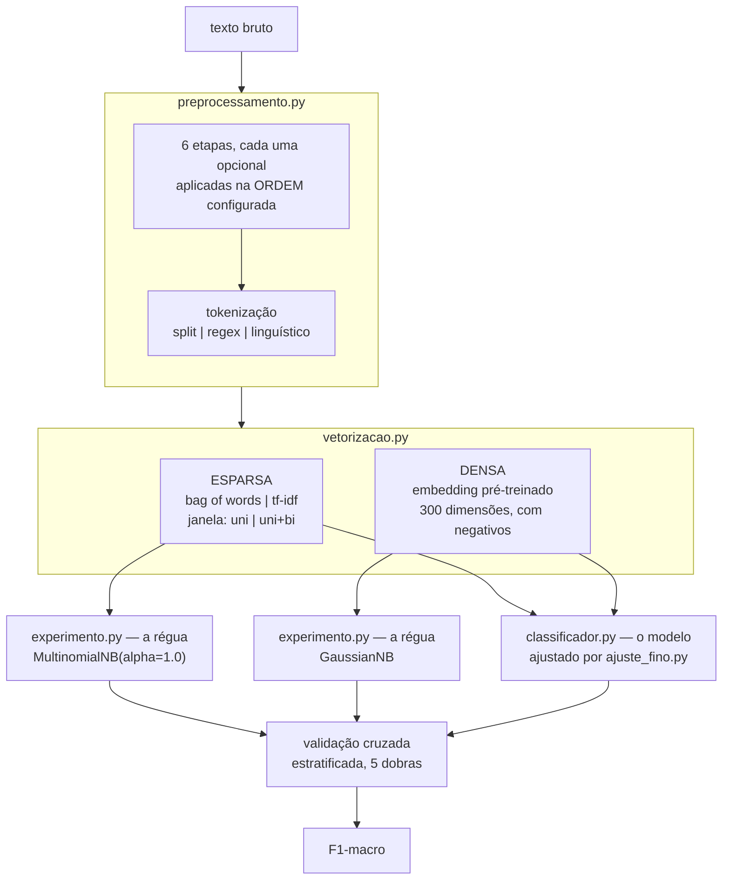

# Pipeline de PLN — como funciona

Documentação técnica do módulo `src/pln`, que decide **como preparar texto** antes de classificar
intenções. O dataset é intercambiável; o método e a estrutura descritos aqui não mudam com ele.

---

## 1. O problema que o módulo resolve

Antes de classificar uma frase, é preciso transformá-la: minusculizar, tirar acento, remover pontuação,
descartar stopwords, reduzir palavras à forma base, separar em tokens. Cada uma dessas decisões parece
óbvia isoladamente, e **nenhuma delas tem resposta universal**. Remover stopwords ajuda a classificar
assunto e atrapalha a classificar intenção. Stemming aproxima palavras relacionadas e junta palavras
sem relação. O que vale num corpus não vale noutro.

A consequência de projeto: o módulo **não assume nada**. Toda decisão é uma opção configurável, e um
experimento mede todas as combinações no dataset real, escolhendo por número.

---

## 2. Estrutura de arquivos

```text
src/pln/                  o pacote — código-fonte e dados de entrada
├── caminhos.py           onde ficam os dados, para onde vão os resultados
├── preprocessamento.py   texto  → tokens
├── vetorizacao.py        tokens → matriz numérica
├── classificador.py      o modelo do produto (Naive Bayes)
├── experimento.py        a busca do TEXTO — pré-processamento x vetorização
├── ajuste_fino.py        a busca do MODELO — variante x suavização x priori
├── dados/                datasets rotulados, versionados
│   └── intencoes_exemplos.csv
└── README.md             referência rápida

resultados/               SAÍDA GERADA, na raiz do repositório
├── comparativo_preprocessamento.csv
├── comparativo_preprocessamento.md
├── ajuste_fino.md
└── classificador.joblib

entregas/                 SAÍDA GERADA — o pipeline em um arquivo só
└── pln_completo.py

scripts/
└── gerar_pln_completo.py gera entregas/pln_completo.py a partir de src/pln/

tests/
├── test_preprocessamento.py   34 testes
├── test_vetorizacao.py        21 testes
├── test_classificador.py      23 testes
├── test_ajuste_fino.py        24 testes
└── test_entrega_unica.py       4 testes
```

**Entrada e saída não moram juntas.** `dados/` é parte do pacote: versionado, pequeno, alterado por
pessoas, e sem ele o código não roda — por isso viaja dentro do wheel e continua funcionando depois de
um `pip install`. `resultados/` e `entregas/` são o oposto: gerados por máquina, sobrescritos a cada
rodada, e o código roda perfeitamente sem eles. Ficam fora de `src/`, que é o que evita um `.joblib`
binário aparecer no diff de um módulo Python.

Quem resolve os dois caminhos é `caminhos.py`, num lugar só. Antes dele cada módulo montava o seu com
`Path(__file__)...`, repetido em três arquivos — e o nome do dataset estava escrito errado nos três ao
mesmo tempo.

A separação segue o fluxo dos dados. Cada arquivo tem uma responsabilidade e não conhece a do outro:
`preprocessamento.py` não sabe que existe vetorização; `vetorizacao.py` não sabe que existe stemming;
`experimento.py` e `classificador.py` compõem os dois primeiros e não implementam nenhum deles.

---

## 3. O fluxo



---

## 4. O pré-processamento em detalhe

### 4.1 As seis etapas

Declaradas na constante `ETAPAS`, que também define a **ordem padrão**:

| # | Etapa | O que faz |
|---|---|---|
| 1 | `minusculas` | "Prazo" e "prazo" viram o mesmo token |
| 2 | `remover_acentos` | "está" e "esta" viram o mesmo token |
| 3 | `remover_pontuacao` | Substitui por **espaço**, não por vazio — senão "prazo,marco" viraria "prazomarco" |
| 4 | `remover_numeros` | Decide se "RF01" e "RF02" são o mesmo conceito |
| 5 | `stopwords` | Descarta palavras muito frequentes — em três modos, ver 4.2 |
| 6 | `morfologia` | Reduz à forma base — em três modos, ver 4.3 |

As quatro primeiras são booleanas. As duas últimas são campos de múltipla escolha.

### 4.2 Tratamento de stopwords — `ModoStopwords`

| Modo | Comportamento |
|---|---|
| `manter` | Não remove nada |
| `remover_tudo` | Remove a lista do NLTK inteira |
| `preservar_negacoes` | Remove a lista do NLTK **menos** as negações |

O terceiro modo existe por uma razão de domínio. A lista do NLTK inclui `não`, `nem`, `sem`, `nunca`.
Em classificação de **assunto** isso é inofensivo; na nossa, de **intenção**, essas palavras carregam o
sinal — "não atualizou o status" (alerta) e "atualizou o status" (transação) viram a mesma frase se a
negação sair. A constante `NEGACOES` lista as palavras protegidas.

### 4.3 Normalização morfológica — `ModoMorfologia`

| Modo | Ferramenta | Exemplo |
|---|---|---|
| `nenhuma` | — | "vencendo" |
| `stemming` | RSLP do NLTK | "vencendo" → **"venc"** |
| `lematizacao` | spaCy `pt_core_news_sm` | "vencendo" → **"vencer"** |

**Stemming** corta sufixos por regras mecânicas, sem dicionário e sem contexto. Rápido e independente de
modelo; produz radicais que muitas vezes não são palavras e junta demais.

**Lematização** mapeia para a forma de dicionário usando classe gramatical. Resultado sempre é palavra
real e o agrupamento é mais preciso; exige modelo treinado e é uma ordem de grandeza mais lenta.

São **valores de um mesmo campo, não duas flags** — aplicar os dois seria redundante e destrutivo,
porque lematizar um radical não faz sentido. A exclusividade é garantida por construção.

### 4.4 Tokenização — `Tokenizacao`

Na frase `O contrato R$1.500,00 do Sr. Silva venceu, sem aditivo!`:

| Modo | Tokens | Comportamento |
|---|---|---|
| `split` | 13 | `str.split()`. Corta em espaço e nada mais: `venceu,` é um token |
| `regex` | 22 | `wordpunct_tokenize` do NLTK (`\w+\|[^\w\s]+`). Separa pontuação, mas estilhaça `R$1.500,00` em sete pedaços |
| `linguistico` | 16 | Tokenizador do spaCy para português. Mantém `R$` e `1.500,00` inteiros, reconhece `Sr.` como abreviatura |

**A tokenização não entra na permutação de ordem.** Ela não é uma etapa que se intercala entre as
outras: é a operação que converte texto em tokens. É usada toda vez que o pipeline precisa de tokens —
no filtro de stopwords, no stemming — e uma vez na materialização final. Se fosse aplicada só no último
passo, a escolha seria quase decorativa.

### 4.5 A ordem

A ordem é campo da configuração (`ConfigPreprocessamento.ordem`), não decisão embutida na função.
`preprocessar` percorre `config.etapas_ativas_na_ordem()`, que já vem ordenada, e registra o que aplicou.

Ela importa porque algumas etapas dependem do que veio antes. O caso mais claro é o filtro de
stopwords: a lista do NLTK é um recurso lexical fixo — minúsculas, com acento, palavras inteiras. Se o
texto já perdeu os acentos ou já virou radicais, os tokens não casam mais com a lista crua. A função
`montar_lista_de_stopwords_comparavel` aplica à lista as mesmas transformações já aplicadas ao texto, e é justamente
essa dependência que torna a etapa sensível à ordem.

O que **não** é compensado, de propósito: pontuação. Não há como acrescentar `"o,"` à lista. Se
`stopwords` vier antes de `remover_pontuacao`, tokens grudados em vírgula escapam do filtro — e essa
perda é um efeito real de ordem, que o experimento deve enxergar em vez de esconder.

---

## 5. A vetorização

O pré-processamento decide **quais tokens existem**; a vetorização decide **como cada token vira
número**. São duas famílias, diferentes em espécie e não em grau.

| | Esparsas (`bow`, `tfidf`) | Densa (`embedding`) |
|---|---|---|
| Colunas | uma por termo do corpus | 300 fixas, do modelo pré-treinado |
| O que o número diz | quantas vezes o termo apareceu | a posição do documento num espaço |
| Sabe algo da língua? | não — "prazo" e "cronograma" são colunas tão distintas quanto "prazo" e "banana" | sim — "prazo" e "cronograma" ficam perto |
| Valores negativos | nunca | sempre |
| Janela de n-grama | sim, unigrama ou uni+bigrama | não se aplica |

### 5.1 As esparsas

**Bag of words** conta. Simples e literal, e trata "projeto" — que aparece em quase toda frase — com o
mesmo prestígio de "desapropriação", que aparece numa só. **TF-IDF** multiplica a contagem pelo IDF,
fator que cresce quanto mais raro o termo é no corpus: é o conserto exato dessa fraqueza. Em corpus
pequeno, porém, o IDF fica instável, calculado sobre poucas ocorrências, e nem sempre ganha.

### 5.2 A densa, e o que ela não é

O documento vira a **média dos vetores pré-treinados dos seus tokens**. A aposta é trazer conhecimento
de fora do nosso corpus: o modelo sabe que "prazo" e "cronograma" são parentes sem nunca ter visto
nossas 300 frases. O preço é que a média destrói a ordem e dilui — uma frase longa vira um ponto no
meio de tudo que ela contém, e **a negação some**: "não venceu" e "venceu" ficam quase no mesmo lugar.

> **Isto não é Word2Vec skip-gram.** Os vetores do `pt_core_news_md` são **fastText treinado com CBOW**
> sobre OSCAR Common Crawl + Wikipédia — está na metadata do próprio modelo (`nlp.meta["sources"]`).
>
> CBOW e skip-gram são os dois objetivos de treino do Word2Vec, e são inversos: CBOW prevê a palavra a
> partir do contexto, skip-gram prevê o contexto a partir da palavra. Skip-gram costuma representar
> melhor palavra rara — exatamente o caso de "desapropriação" no nosso domínio. fastText acrescenta uma
> terceira coisa: compõe o vetor a partir de pedaços da palavra, e por isso tem vetor até para palavra
> nunca vista.
>
> Para usar skip-gram de verdade seria preciso um arquivo de vetores treinado assim — os do NILC/USP são
> a referência em português, na casa das centenas de MB — e trocar `MODELO_DE_VETORES` por um carregador
> daquele formato. O modo se chama `embedding`, e não `w2v_skipgram`, porque nomear errado é a forma
> mais barata de mentir num relatório.

### 5.3 A armadilha da retokenização, nas duas famílias

O caminho óbvio para vetorizar com spaCy é `nlp(texto).vector`, que já devolve a média. É o caminho
**errado**, e erra em silêncio: `nlp(texto)` **tokeniza de novo**, jogando fora a tokenização que o
pré-processamento escolheu. As três estratégias de tokenização passariam a dar resultado idêntico, e o
experimento reportaria "não faz diferença" com toda a confiança.

É o mesmo problema que `token_pattern` e `lowercase=True` causam nos vetorizadores do scikit-learn. Por
isso, nas duas famílias, os tokens já vêm prontos do pré-processamento e a vetorização só os consome:
`tokenizer=str.split` nas esparsas, `texto.split()` na densa. Há testes que quebram se isso for
revertido.

---

## 6. O classificador

`classificador.py` é o **modelo do produto**. O `MultinomialNB` que aparece em `vetorizacao.py` é outra
coisa: a régua do experimento, escolhida por ser determinística e rápida, porque roda milhares de vezes.

O pipeline completo é um único objeto do scikit-learn:

```text
texto bruto → PreprocessadorDeTexto → Vetorizador → Naive Bayes
```

Isso importa na prática: treinar, avaliar, salvar e prever passam a operar sobre **texto bruto**. Não
existe a possibilidade de alguém treinar com um pré-processamento e prever com outro — o erro mais comum
e mais difícil de diagnosticar em PLN, porque não levanta exceção: o modelo simplesmente erra mais.

### 6.1 Por que Naive Bayes — e o que se perdeu na troca

O módulo usava regressão logística. A troca foi feita por medição, e o que se perdeu continua valendo a
pena registrar.

**A favor:**

| Motivo | Consequência para o AZ1 |
|---|---|
| Aprende com pouquíssimo dado | Não há otimização iterativa que precise de exemplos para convergir — com poucas centenas de frases isso deixa de ser detalhe |
| É determinístico | Sem sorteio interno, sem `random_state`. Duas execuções dão exatamente o mesmo modelo |
| Mesma família da régua do experimento | A ressalva de que "a régua é Naive Bayes mas o produto é outro modelo" deixa de existir |
| Pesos legíveis por contraste | `listar_palavras_de_maior_peso_por_intencao` mostra quais palavras levaram a cada decisão |

**Contra — e continua verdade:**

A **calibração da confiança piorou**. Naive Bayes multiplica probabilidades assumindo termos
independentes; como não são, a evidência é contada mais de uma vez e a saída satura perto de 0 e 1.
`prever_intencao` devolve um número entre 0 e 1 que **ordena bem e calibra mal**: serve para comparar
duas frases entre si, não para ser lido como "92% de chance de estar certo". Um limiar de recusa fixado
sobre esse número recusa de menos. A regressão logística calibrava melhor; foi o que se perdeu.

A suposição de independência também continua falsa: "material rodante" e "estrutura analítica" são
contados como duas evidências separadas. É o preço do modelo e não some com ajuste.

### 6.2 Os parâmetros

| Parâmetro | Valor | Por quê |
|---|---|---|
| variante | `MultinomialNB` | Assume **contagem**: modela cada classe como um sorteio de palavras com reposição. É o padrão da área para texto, e foi o vencedor medido |
| `alpha` | `1.0` | Suavização de Laplace/Lidstone: a contagem fictícia somada a todo par (termo, classe). Sem ela um termo nunca visto numa classe tem probabilidade zero, e **um único zero zera o produto inteiro** — uma palavra desconhecida bastaria para eliminar uma intenção. Faz aqui o papel que `C` fazia na regressão logística, com o sentido invertido: `C` alto = menos regularização, `alpha` alto = mais |
| `fit_prior` | `True` | Aprende as probabilidades a priori da frequência no treino. `False` é o análogo mais próximo do antigo `class_weight="balanced"` — Naive Bayes não tem `class_weight` |
| — | sem `random_state` | Naive Bayes é determinístico: não há nada a semear |

**Estes três vêm de `ajuste_fino.py`**, não do experimento — ver 6.5. Na última rodada, 3000
candidatos:

| Eixo | Resultado |
|---|---|
| variante | `multinomial` 0,9989 · `bernoulli` 0,9978 · `complement` 0,9947 |
| `alpha` | praticamente plano entre 0,01 e 1,0; só piora em 2,0 (−0,0026) |
| `fit_prior` | **nenhuma diferença** — 0,9971 nos dois, coerente com as três classes terem o mesmo tamanho |

`bernoulli` já foi o padrão daqui, pelo argumento de que binarizar vence em frase curta. O argumento era
plausível; a medição o pôs em segundo. É o tipo de troca que o módulo existe para fazer.

### 6.3 A configuração padrão veio do experimento — com uma ressalva grande

`CONFIG_PRE_PADRAO` e `CONFIG_VET_PADRAO` são a primeira colocada da última varredura exaustiva:
`bow n=1` com `[tok:split] (texto cru)` — nenhuma etapa de pré-processamento ligada.

**Leia a ressalva antes de confiar nesses dois.** No dataset de exemplo atual a varredura devolve
F1-macro **1,0000 com desvio 0,0000** — e não devolve isso para a vencedora, devolve para milhares de
configurações. A medição não está errada; está **saturada**, e medição saturada não ordena nada. O
ajuste fino sofre do mesmo: **2010 dos 3000** candidatos empatam. Ver a seção 7.1.

Entre as empatadas, o critério que sobrou foi **simplicidade**: a configuração que não faz nada com o
texto vence porque nenhuma etapa se mostrou capaz de melhorar o que já está em 1,0000. É defensável
— não se mantém etapa que não paga por si —, mas é diferente de "esta é a melhor forma de preparar o
texto".

### 6.4 Variante e vetorização não são escolhas independentes

Não dá para combinar qualquer variante com qualquer vetorização, e a restrição não é de gosto — é de
execução.

| Vetorização | Variantes possíveis | Por quê |
|---|---|---|
| `bow`, `tfidf` | `multinomial`, `complement`, `bernoulli` | Estimam P(termo\|classe) somando colunas. Soma negativa não é probabilidade de nada, e o scikit-learn recusa a entrada |
| `embedding` | `gaussiano` | Vetores densos têm coordenadas negativas por construção. `GaussianNB` assume normal por dimensão, que é a leitura certa de coordenada contínua — e é péssima em matriz esparsa quase toda zero |

`variantes_compativeis()` devolve as válidas, e `construir_classificador` recusa a combinação errada com
uma mensagem que diz o que usar. Sem isso, o erro apareceria lá no fundo do scikit-learn como
`ValueError: Negative values in data`, que não menciona nem embeddings nem Naive Bayes.

**A consequência metodológica está declarada:** quando o relatório compara `embedding` com `tfidf`, ele
compara **dois pipelines inteiros**, não duas representações com o resto constante. Parte da diferença
vem da representação e parte vem do classificador, e a medição não separa as duas. Isso não invalida o
número para a decisão prática — o que vai para produção é o pipeline inteiro. Invalida a frase
"embeddings são piores que TF-IDF", que a medição não sustenta na forma isolada. A comparação entre
`bow` e `tfidf` continua limpa: mesma régua nos dois lados.

### 6.5 Duas buscas, duas perguntas

| Script | Varia | Fixa |
|---|---|---|
| `experimento.py` | o **texto** — pré-processamento × vetorização | o modelo: `MultinomialNB(alpha=1.0)`, a régua |
| `ajuste_fino.py` | o **modelo** — variante × suavização × priori | o texto: os melhores do experimento |

Rodar na ordem importa, porque o segundo lê o relatório do primeiro:

```bash
python -m pln.experimento
python -m pln.ajuste_fino
```

**Isto é uma busca em estágios, e estágio não acha ótimo global** — a mesma objeção que fez a opção
`--duas-fases` ser removida do experimento. A diferença que justifica manter aqui é de tamanho, não de
método: o produto cartesiano completo seria 432 pré-processamentos × 5 vetorizações × variantes × 6
suavizações × 2 prioris, dezenas de milhares de validações cruzadas. O corte está declarado e é
ajustável em uma flag — `--top-pre`, e `--top-pre 0` varre todos os pré-processamentos do relatório.

### 6.6 A confiança não resolve o fora-do-catálogo

Testando o modelo treinado com uma pergunta sem relação nenhuma com o portfólio:

```text
'Qual a receita de bolo de cenoura?'  ->  consulta  (confiança 92,1%)
```

O modelo conhece três classes e é obrigado a escolher uma. `Qual` e `?` são evidências fortes de
consulta, então ele decide com convicção — e erra. **Limiar de confiança não corrige isso**, porque a
confiança é alta justamente onde deveria ser baixa.

A solução é o dataset: o enum `Intencao` já prevê `FORA_DO_CATALOGO`, mas o classificador só aprende a
reconhecer a categoria se houver exemplos rotulados dela no treino.

---

## 7. A metodologia de avaliação

Cinco decisões sustentam a validade da comparação. Mexer em qualquer uma invalida os números.

**O classificador é fixo.** `MultinomialNB(alpha=1.0)`, sempre. Para comparar formas de preparar texto,
tudo o que vem depois precisa ser idêntico — senão não há como saber se a diferença veio do texto ou do
modelo. Naive Bayes serve porque é determinístico, rápido e funciona com poucos dados. **Ele não é o
modelo final do produto; é o instrumento de medida.**

**A semente é fixa** (`SEMENTE = 42`). Sem ela, as dobras mudariam a cada execução e parte da diferença
entre duas configurações seria sorteio, não pré-processamento.

**Validação cruzada estratificada de 5 dobras.** Com poucas centenas de exemplos, uma divisão única
daria uma nota dependente demais de quais frases caíram no teste. Estratificada garante que cada dobra
tenha todas as classes na mesma proporção.

**O `Pipeline` do scikit-learn evita vazamento de dados.** Dentro da validação cruzada ele garante que o
vocabulário e o IDF sejam aprendidos **apenas nas dobras de treino**. Aprender sobre o dataset inteiro
faria a nota subir mentindo.

**A métrica é F1-macro, não acurácia.** Acurácia engana com classes desbalanceadas: se 80% das mensagens
fossem consulta, responder "consulta" para tudo daria 80% e seria inútil. O macro tira média por classe.

### 7.1 A ressalva atual: o benchmark está saturado

As cinco decisões acima garantem que a comparação seja **válida**. Elas não garantem que ela seja
**útil** — para isso o dataset precisa conter casos que o modelo erre, e o de exemplo não contém.

Na última varredura exaustiva:

| Sintoma | Número |
|---|---|
| F1-macro da melhor configuração | 1,0000, desvio 0,0000 |
| Configurações empatadas dentro de 1 desvio | 2261 de 6456 |
| Amplitude média de F1 ao variar a ordem das etapas | 0,0064 |

A causa está no dataset, não no pipeline:

- são **300 frases geradas por gabarito**, 100 por classe;
- há apenas **16 primeiras palavras distintas** entre as 300, e **77% dos exemplos são decididos pela
  primeira palavra sozinha** — `Registra`/`Atualiza`/`Cria` abrem transação, `Qual`/`Quem`/`Resuma`
  abrem consulta, `Existe`/`Há`/`Tem` abrem alerta;
- o vocabulário de cada classe cabe em 71 a 91 palavras;
- **20 exemplos por classe já bastam** para F1 0,9366. Os outros 80 por classe não acrescentam
  dificuldade, só repetição — e a validação cruzada acaba colocando frases quase idênticas no treino e
  no teste ao mesmo tempo.

**O que isso invalida e o que não invalida.** Não invalida o método nem o código: as conclusões
qualitativas se mantiveram nas duas rodadas — remover pontuação atrapalha, remover stopwords atrapalha,
a ordem das etapas muda o texto em cerca de 60% dos grupos. O que se perdeu é a capacidade de **ordenar
o topo**: qualquer escolha entre as 2261 empatadas é arbitrária do ponto de vista da medida.

**O conserto é o dataset**, não o experimento. Frases escritas por pessoas diferentes, com vocabulário
livre, sinônimos, erros de digitação e formas indiretas de pedir a mesma coisa ("e o cronograma da 6,
como está?"). Enquanto o corpus for gabarito, o número vai continuar dizendo 1,0000 e não vai continuar
querendo dizer nada.

### 7.2 Deduplicação por texto resultante

Etapas que não interagem comutam, então muitas permutações de ordem produzem **texto idêntico**. Ordem
que gera o mesmo texto é o mesmo experimento. O experimento agrupa por hash do corpus e treina só os
distintos — na prática, ~95% do trabalho some.

### 7.3 Comparação pareada

Para os campos de múltipla escolha, a média simples seria enviesada: quando stopwords é `manter` ou
morfologia é `nenhuma`, a etapa não entra na lista de ativas, a configuração fica com uma etapa a menos
e gera menos permutações. A média bruta misturaria "efeito do tratamento" com "efeito de ter menos
etapas".

O pareamento resolve: para cada conjunto idêntico das demais escolhas, todos os valores do campo são
comparados entre si. Tudo o mais constante — a diferença só pode vir do campo em questão.

### 7.4 Regra da parcimônia

Entre as configurações empatadas com a primeira (dentro de um desvio padrão), o experimento recomenda a
**mais simples**. Uma etapa a mais que não paga o próprio custo é complexidade sem retorno.

---

## 8. Como rodar

Instalação, uma vez:

```bash
python3 -m venv .venv && source .venv/bin/activate
pip install -e .
python -m nltk.downloader stopwords rslp
python -m spacy download pt_core_news_sm   # lematização e tokenização linguística
python -m spacy download pt_core_news_md   # vetores da vetorização densa
```

Execução:

```bash
python -m pln.experimento                    # varredura exaustiva (padrão)
python -m pln.experimento --sem-ordem        # só a ordem padrão, execução rápida
python -m pln.experimento --dataset caminho/seus_dados.csv --k 10
```

Ajustar o modelo, **depois** do experimento — ele lê o relatório que o experimento grava:

```bash
python -m pln.ajuste_fino                    # sobre os 5 melhores pré-processamentos
python -m pln.ajuste_fino --top-pre 20       # sobre os 20 melhores
python -m pln.ajuste_fino --top-pre 0        # sobre todos do relatório
```

Treinar e avaliar o classificador:

```bash
python -m pln.classificador                                       # treina, avalia e salva
python -m pln.classificador --prever "Quais prazos vencem hoje?"  # usa o modelo salvo
python -m pln.classificador --variante complement --alpha 0.5 --k 10
```

O arquivo único de entrega, que roda sem instalar o pacote:

```bash
python scripts/gerar_pln_completo.py         # regera a partir de src/pln/
python entregas/pln_completo.py treinar
python entregas/pln_completo.py prever "Quais prazos vencem esta semana?"
python entregas/pln_completo.py experimento --sem-ordem
python entregas/pln_completo.py ajuste
```

`entregas/pln_completo.py` **nunca é editado à mão** — a fonte é `src/pln/`, e
`tests/test_entrega_unica.py` falha se os dois divergirem.

| Flag | Efeito |
|---|---|
| `--dataset` | CSV a usar |
| `--k` | Dobras da validação cruzada (padrão 5) |
| `--top` | Linhas mostradas no ranking (padrão 10) |
| `--sem-ordem` | Não permuta a ordem das etapas |
| `--top-pre` | Só no ajuste fino: quantos pré-processamentos entram na busca (0 = todos) |

O tempo cresce com o tamanho do dataset e com o número de dobras.

### 8.1 Só existe a varredura exaustiva

Havia aqui uma opção `--duas-fases`, que varria o pré-processamento com a vetorização fixa e só depois
varria a vetorização sobre as melhores. Custava 1/4 das avaliações e **foi removida**: busca em estágios
não garante o ótimo global e neste dataset comprovadamente não o encontrava — o melhor pré-processamento
sob TF-IDF não era o melhor sob bag of words, e a combinação vencedora se perdia por 0,0078 de F1.

Manter os dois caminhos custava um parâmetro atravessando seis funções e dois formatos de relatório,
para oferecer um resultado que a própria documentação desaconselhava usar. Se um dia a varredura
completa ficar cara demais, o caminho é **reduzir o espaço de busca de propósito** — não voltar a um
método que erra de um jeito difícil de perceber.

### 8.2 Saída

Além do relatório no terminal, os dois scripts gravam em `resultados/`:

| Arquivo | De quem | O quê |
|---|---|---|
| `comparativo_preprocessamento.csv` | `experimento.py` | O ranking completo, uma linha por execução, com todas as colunas de configuração — é este que `ajuste_fino.py` lê de volta |
| `comparativo_preprocessamento.md` | `experimento.py` | As tabelas de análise e o top 30, para colar no MR |
| `ajuste_fino.md` | `ajuste_fino.py` | Os eixos do modelo e os valores prontos para colar em `classificador.py` |

---

## 9. Como testar

```bash
python -m unittest discover tests -v     # 106 testes
python -m unittest tests.test_vetorizacao -v
```

### 9.1 O que cada grupo de testes cobre

`tests/test_preprocessamento.py`:

| Classe | Garante |
|---|---|
| `TesteEtapasIsoladas` | Cada etapa ligada sozinha faz exatamente o que promete |
| `TesteMorfologia` | Os três modos produzem saídas distintas; lema é palavra real, radical não |
| `TesteTokenizacao` | As três estratégias tokenizam de formas realmente diferentes |
| `TesteModosDeStopwords` | Negações sobrevivem em `preservar_negacoes`, com e sem acento |
| `TesteOrdem` | A ordem tem efeito observável; ordem inválida é rejeitada |
| `TesteInvariantes` | Determinismo, ausência de espaço duplicado, config hasheável |

`tests/test_vetorizacao.py`:

| Classe | Garante |
|---|---|
| `TesteEspacoDeVetorizacao` | São 4 opções, sem duplicata, e a régua está entre elas |
| `TesteNaoRetokeniza` | **O teste mais importante do módulo** — ver abaixo |
| `TesteModosEJanelas` | bow devolve contagens, tfidf devolve pesos normalizados |
| `TestePipeline` | Treina, prediz e é determinístico |

`tests/test_classificador.py`:

| Classe | Garante |
|---|---|
| `TestePreprocessadorDeTexto` | O transformador respeita o contrato do sklearn e sobrevive ao `clone()` |
| `TesteConstrucao` | As três etapas na ordem certa; treina a partir de texto bruto |
| `TestePrevisao` | Confiança em [0, 1] e probabilidades somando 1 |
| `TesteExplicacao` | Termos ordenados por peso, um conjunto por classe |
| `TesteConfiguracaoViajaComOModelo` | **O modelo salvo carrega o próprio pré-processamento** |
| `TesteAvaliacao` | F1, relatório e matriz de confusão coerentes |

### 9.2 Por que `TesteNaoRetokeniza` é o mais importante

Por padrão, `CountVectorizer` e `TfidfVectorizer` fazem três coisas por conta própria: `lowercase=True`,
um `token_pattern` que descarta pontuação e palavras de uma letra, e a retokenização implícita que
substitui qualquer tokenização feita antes.

Com esses padrões ligados, **três decisões do experimento virariam enfeite**: `minusculas` não teria
efeito, `remover_pontuacao` também não, e as três estratégias de tokenização dariam resultados
idênticos. O experimento reportaria "não faz diferença" para as três — medindo errado, sem falhar em
lugar nenhum.

Por isso `construir_vetorizador` passa `lowercase=False`, `tokenizer=str.split` e `token_pattern=None`,
e há testes que quebram se alguém reverter isso.

### 9.3 Convenção ao escrever testes novos

Cada etapa é testada **isolada** — ligada sozinha, com todas as outras desligadas. É o que garante que
as etapas são independentes: se um teste de etapa isolada quebrar quando outra etapa mudar, houve
acoplamento indevido.

---

## 10. Como trocar o dataset

O CSV precisa de duas colunas:

| Coluna | Conteúdo |
|---|---|
| `texto` | A frase do usuário, como ele escreveria |
| `intencao` | O rótulo — hoje `consulta`, `transacao` ou `alerta` |

```bash
python -m pln.experimento --dataset caminho/para/seu.csv
```

Recomendações ao montar o dataset novo:

- **Classes equilibradas.** Proporções muito desiguais tornam o F1-macro instável.
- **Pelo menos algumas centenas de exemplos.** Com 120, o desvio padrão entre dobras fica em torno de
  ±0,07 — grande o bastante para que diferenças pequenas entre configurações sejam ruído.
- **Frases como o usuário escreveria**, com a pontuação e as abreviaturas reais. O corpus de exemplo
  atual não tem valores monetários nem siglas, e por isso não consegue distinguir o tokenizador
  linguístico do baseado em regex.
- **Se houver intenção fora do catálogo**, inclua exemplos dela. O enum `Intencao` prevê a categoria,
  mas o classificador só aprende a reconhecê-la se houver exemplos rotulados.

Os números do `resultados/` valem para o dataset que os gerou. Trocar o dataset exige rodar de novo — as
conclusões podem mudar, e é para isso que o experimento existe.

---

## 11. Como estender

**Uma etapa nova de pré-processamento:** acrescente o nome em `ETAPAS`, um campo em
`ConfigPreprocessamento`, o tratamento em `etapa_ligada` se não for booleana, e o ramo correspondente no
laço de `preprocessar`. O espaço de busca do experimento se ajusta sozinho.

**Uma tokenização nova:** um valor em `Tokenizacao` e um ramo em `tokenizar`.

**Um modo de vetorização novo:** um valor em `ModoVetorizacao` e um ramo em `construir_vetorizador`.

**Outro classificador do produto:** troque em `construir_classificador`, em `classificador.py`.

**Outra régua para o experimento:** troque em `construir_pipeline_de_medicao`, em `vetorizacao.py`. Lembre que ela é
o instrumento de medida — trocar muda todos os números, e comparações com execuções anteriores deixam de
valer.

### Convenção de estilo

O módulo documenta com **comentários `#`**, não docstrings, e prefere **nomes de função
autoexplicativos** a nomes curtos com explicação anexa — `reduzir_palavra_ao_radical` em vez de
`radical`, `avaliar_com_validacao_cruzada` em vez de `avaliar`. O comentário fica acima do que explica e
diz o **porquê**; o **o quê** deve estar no nome.

Ao acrescentar qualquer dimensão, confira o custo: o espaço cresce multiplicativamente, e as
permutações de ordem crescem fatorialmente com o número de etapas ativas.

---

## 12. Armadilhas conhecidas

| Armadilha | Consequência | Onde está tratada |
|---|---|---|
| Padrões do scikit-learn | Três decisões do experimento viram enfeite, em silêncio | `construir_vetorizador`, travado por teste |
| Lista de stopwords não normalizada | A etapa roda sem erro e não remove nada | `montar_lista_de_stopwords_comparavel` |
| Negações na lista do NLTK | Alerta e transação viram a mesma frase | `ModoStopwords.PRESERVAR_NEGACOES` |
| Lematização depende de contexto | Frase sem sintaxe recebe etiqueta errada e lema inventado | Documentado em `TesteMorfologia.test_lematizacao_depende_do_contexto` |
| Vazamento de dados na validação | A nota sobe mentindo | `Pipeline` dentro do `cross_validate` |
| Busca em estágios | Perde o ótimo global quando há interação entre escolhas | Por isso o padrão é exaustivo |
| Confiança alta em pergunta fora do escopo | O agente responde bobagem com cara de certeza | Só o dataset resolve — ver 6.4 |
| Treino e previsão com pré-processamentos diferentes | O modelo erra mais, sem levantar exceção | Pipeline único, travado por teste |
| Dataset fácil demais | Todas as configurações empatam e o experimento deixa de ordenar | Ver 7.1 — só um dataset mais difícil resolve |
| Retokenização na vetorização densa | `nlp(texto).vector` refaz a tokenização e as três estratégias passam a empatar | Média feita à mão sobre `texto.split()`, travado por teste |
| Variante de NB incompatível com a vetorização | `ValueError` do sklearn que não menciona nem embeddings nem NB | `variantes_compativeis`, recusa com mensagem útil |
| Tamanho de grade escrito à mão na comparação pareada | Nenhum grupo fica completo e a tabela **some** do relatório sem erro | Derivado de `todas_as_vetorizacoes()`; comparação por família, travado por teste |
| Cópia do pipeline mantida à mão | As duas divergem e todo conserto precisa ser feito duas vezes | `entregas/pln_completo.py` é gerado, travado por teste |

---

## 13. Dependências

| Biblioteca | Para quê |
|---|---|
| `scikit-learn` | Vetorizadores, Naive Bayes, validação cruzada, métricas |
| `nltk` | Lista de stopwords, stemmer RSLP, tokenizador regex |
| `spacy` + `pt_core_news_sm` | Lematizador e tokenizador linguístico de português |
| `spacy` + `pt_core_news_md` | Vetores pré-treinados da vetorização densa (fastText CBOW, 20 mil chaves × 300 dimensões) |

O `spacy.blank("pt")` usado na tokenização **não** exige modelo nenhum — só as regras do idioma, que vêm
com o pacote. Os dois modelos são necessários apenas para o que a tabela diz: `_sm` para a lematização,
`_md` para os vetores. Sem eles, as funções que os carregam levantam `RuntimeError` com o comando de
download, em vez de um erro de biblioteca.
