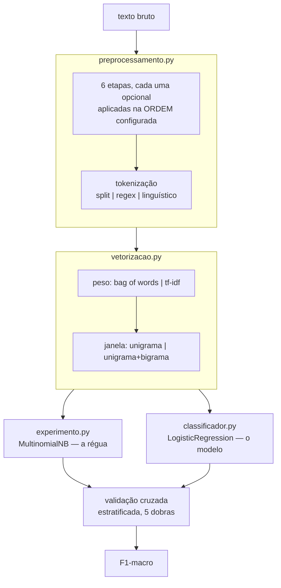

# Pipeline de PLN — como funciona

Documentação técnica do módulo `src/az1/pln`, que decide **como preparar texto** antes de classificar
intenções. O dataset é intercambiável; o método e a estrutura descritos aqui não mudam com ele.

---

## 1. O problema que o módulo resolve

Antes de classificar uma frase, é preciso transformá-la: minusculizar, tirar acento, remover pontuação,
descartar stopwords, reduzir palavras à forma base, separar em tokens. Cada uma dessas decisões parece
óbvia isoladamente, e **nenhuma delas tem resposta universal**. Remover stopwords ajuda a classificar
assunto e atrapalha a classificar intenção. Stemming aproxima palavras relacionadas e junta palavras
sem relação. O que vale num corpus não vale noutro.

A consequência de projeto: o módulo **não assume nada**. Toda decisão é uma opção configurável, e um
experimento mede todas as combinações no dataset real, escolhendo por número.

---

## 2. Estrutura de arquivos

```text
src/az1/pln/
├── preprocessamento.py   texto  → tokens
├── vetorizacao.py        tokens → matriz numérica
├── classificador.py      o modelo do produto (regressão logística)
├── experimento.py        a busca e as análises
├── dados/                datasets rotulados
│   └── intencoes_exemplo.csv
├── resultados/           comparativos gerados (versionados)
│   ├── comparativo_preprocessamento.csv
│   ├── comparativo_preprocessamento.md
│   └── classificador.joblib
└── README.md             referência rápida

tests/
├── test_preprocessamento.py   34 testes
├── test_vetorizacao.py        13 testes
└── test_classificador.py      17 testes
```

A separação segue o fluxo dos dados. Cada arquivo tem uma responsabilidade e não conhece a do outro:
`preprocessamento.py` não sabe que existe vetorização; `vetorizacao.py` não sabe que existe stemming;
`experimento.py` e `classificador.py` compõem os dois primeiros e não implementam nenhum deles.

---

## 3. O fluxo



---

## 4. O pré-processamento em detalhe

### 4.1 As seis etapas

Declaradas na constante `ETAPAS`, que também define a **ordem padrão**:

| # | Etapa | O que faz |
|---|---|---|
| 1 | `minusculas` | "Prazo" e "prazo" viram o mesmo token |
| 2 | `remover_acentos` | "está" e "esta" viram o mesmo token |
| 3 | `remover_pontuacao` | Substitui por **espaço**, não por vazio — senão "prazo,marco" viraria "prazomarco" |
| 4 | `remover_numeros` | Decide se "RF01" e "RF02" são o mesmo conceito |
| 5 | `stopwords` | Descarta palavras muito frequentes — em três modos, ver 4.2 |
| 6 | `morfologia` | Reduz à forma base — em três modos, ver 4.3 |

As quatro primeiras são booleanas. As duas últimas são campos de múltipla escolha.

### 4.2 Tratamento de stopwords — `ModoStopwords`

| Modo | Comportamento |
|---|---|
| `manter` | Não remove nada |
| `remover_tudo` | Remove a lista do NLTK inteira |
| `preservar_negacoes` | Remove a lista do NLTK **menos** as negações |

O terceiro modo existe por uma razão de domínio. A lista do NLTK inclui `não`, `nem`, `sem`, `nunca`.
Em classificação de **assunto** isso é inofensivo; na nossa, de **intenção**, essas palavras carregam o
sinal — "não atualizou o status" (alerta) e "atualizou o status" (transação) viram a mesma frase se a
negação sair. A constante `NEGACOES` lista as palavras protegidas.

### 4.3 Normalização morfológica — `ModoMorfologia`

| Modo | Ferramenta | Exemplo |
|---|---|---|
| `nenhuma` | — | "vencendo" |
| `stemming` | RSLP do NLTK | "vencendo" → **"venc"** |
| `lematizacao` | spaCy `pt_core_news_sm` | "vencendo" → **"vencer"** |

**Stemming** corta sufixos por regras mecânicas, sem dicionário e sem contexto. Rápido e independente de
modelo; produz radicais que muitas vezes não são palavras e junta demais.

**Lematização** mapeia para a forma de dicionário usando classe gramatical. Resultado sempre é palavra
real e o agrupamento é mais preciso; exige modelo treinado e é uma ordem de grandeza mais lenta.

São **valores de um mesmo campo, não duas flags** — aplicar os dois seria redundante e destrutivo,
porque lematizar um radical não faz sentido. A exclusividade é garantida por construção.

### 4.4 Tokenização — `Tokenizacao`

Na frase `O contrato R$1.500,00 do Sr. Silva venceu, sem aditivo!`:

| Modo | Tokens | Comportamento |
|---|---|---|
| `split` | 13 | `str.split()`. Corta em espaço e nada mais: `venceu,` é um token |
| `regex` | 22 | `wordpunct_tokenize` do NLTK (`\w+\|[^\w\s]+`). Separa pontuação, mas estilhaça `R$1.500,00` em sete pedaços |
| `linguistico` | 16 | Tokenizador do spaCy para português. Mantém `R$` e `1.500,00` inteiros, reconhece `Sr.` como abreviatura |

**A tokenização não entra na permutação de ordem.** Ela não é uma etapa que se intercala entre as
outras: é a operação que converte texto em tokens. É usada toda vez que o pipeline precisa de tokens —
no filtro de stopwords, no stemming — e uma vez na materialização final. Se fosse aplicada só no último
passo, a escolha seria quase decorativa.

### 4.5 A ordem

A ordem é campo da configuração (`ConfigPreprocessamento.ordem`), não decisão embutida na função.
`preprocessar` percorre `config.etapas_ativas_na_ordem()`, que já vem ordenada, e registra o que aplicou.

Ela importa porque algumas etapas dependem do que veio antes. O caso mais claro é o filtro de
stopwords: a lista do NLTK é um recurso lexical fixo — minúsculas, com acento, palavras inteiras. Se o
texto já perdeu os acentos ou já virou radicais, os tokens não casam mais com a lista crua. A função
`montar_lista_de_stopwords_comparavel` aplica à lista as mesmas transformações já aplicadas ao texto, e é justamente
essa dependência que torna a etapa sensível à ordem.

O que **não** é compensado, de propósito: pontuação. Não há como acrescentar `"o,"` à lista. Se
`stopwords` vier antes de `remover_pontuacao`, tokens grudados em vírgula escapam do filtro — e essa
perda é um efeito real de ordem, que o experimento deve enxergar em vez de esconder.

---

## 5. A vetorização

`vetorizacao.py` converte tokens em matriz. Duas escolhas independentes:

| Campo | Opções | Diferença |
|---|---|---|
| `modo` | `bow` / `tfidf` | **bow**: peso é a contagem bruta. **tfidf**: contagem × fator que cresce quanto mais raro o termo — termo presente em todo documento é achatado |
| `n_max` | `1` / `2` | **1**: só palavras isoladas. **2**: acrescenta pares vizinhos, capturando "não atualizou" como unidade — ao custo de inflar o vocabulário |

`VETORIZACAO_REFERENCIA` (`tfidf n=1`) é a régua usada pelo modo `--duas-fases`.

---

## 6. O classificador

`classificador.py` é o **modelo do produto**. O `MultinomialNB` que aparece em `vetorizacao.py` é outra
coisa: a régua do experimento, escolhida por ser determinística e rápida, porque roda milhares de vezes.

O pipeline completo é um único objeto do scikit-learn:

```text
texto bruto → PreprocessadorDeTexto → Vetorizador → LogisticRegression
```

Isso importa na prática: treinar, avaliar, salvar e prever passam a operar sobre **texto bruto**. Não
existe a possibilidade de alguém treinar com um pré-processamento e prever com outro — o erro mais comum
e mais difícil de diagnosticar em PLN, porque não levanta exceção: o modelo simplesmente erra mais.

### 6.1 Por que regressão logística

| Motivo | Consequência para o AZ1 |
|---|---|
| Devolve **probabilidade** por classe | O agente pode dizer "não entendi" em vez de chutar |
| Pesos **interpretáveis** | Dá para mostrar quais palavras levaram a cada decisão (`listar_palavras_de_maior_peso_por_intencao`) |
| Não assume independência entre palavras | Lida melhor com termos que sempre aparecem juntos, como "material rodante" |

Naive Bayes também expõe `predict_proba`, mas seus valores são mal calibrados: saturam perto de 0 e 1
mesmo quando o modelo está incerto. Para um limiar de confiança valer alguma coisa, o número precisa
significar algo.

### 6.2 Os parâmetros

| Parâmetro | Valor | Por quê |
|---|---|---|
| `C` | `1.0` | Inverso da regularização. Alto deixa o modelo decorar; baixo o força a soluções simples. Com mais palavras do que frases, regularizar importa |
| `class_weight` | `"balanced"` | Pesa cada classe pelo inverso da frequência. Nulo com classes iguais, essencial quando o dataset real for desequilibrado |
| `max_iter` | `1000` | O padrão 100 não converge em matrizes esparsas de texto, e o aviso do sklearn significa "parou antes de terminar" |
| `random_state` | `42` | Reprodutibilidade, mesma razão da semente do experimento |

### 6.3 A configuração padrão veio do experimento

`CONFIG_PRE_PADRAO` e `CONFIG_VET_PADRAO` são a recomendação da última execução do experimento. **Duas
coisas as invalidam:** trocar o dataset, e o fato de terem sido escolhidas medindo com Naive Bayes como
régua — a regressão logística pode preferir outro pré-processamento.

O caminho rigoroso é rodar o experimento de novo com este classificador no lugar da régua. Enquanto isso
não é feito, os valores são o melhor palpite disponível — e são um palpite medido, não arbitrário.

### 6.4 A confiança não resolve o fora-do-catálogo

Testando o modelo treinado com uma pergunta sem relação nenhuma com o portfólio:

```text
'Qual a receita de bolo de cenoura?'  ->  consulta  (confiança 92,1%)
```

O modelo conhece três classes e é obrigado a escolher uma. `Qual` e `?` são evidências fortes de
consulta, então ele decide com convicção — e erra. **Limiar de confiança não corrige isso**, porque a
confiança é alta justamente onde deveria ser baixa.

A solução é o dataset: o enum `Intencao` já prevê `FORA_DO_CATALOGO`, mas o classificador só aprende a
reconhecer a categoria se houver exemplos rotulados dela no treino.

---

## 7. A metodologia de avaliação

Cinco decisões sustentam a validade da comparação. Mexer em qualquer uma invalida os números.

**O classificador é fixo.** `MultinomialNB(alpha=1.0)`, sempre. Para comparar formas de preparar texto,
tudo o que vem depois precisa ser idêntico — senão não há como saber se a diferença veio do texto ou do
modelo. Naive Bayes serve porque é determinístico, rápido e funciona com poucos dados. **Ele não é o
modelo final do produto; é o instrumento de medida.**

**A semente é fixa** (`SEMENTE = 42`). Sem ela, as dobras mudariam a cada execução e parte da diferença
entre duas configurações seria sorteio, não pré-processamento.

**Validação cruzada estratificada de 5 dobras.** Com poucas centenas de exemplos, uma divisão única
daria uma nota dependente demais de quais frases caíram no teste. Estratificada garante que cada dobra
tenha todas as classes na mesma proporção.

**O `Pipeline` do scikit-learn evita vazamento de dados.** Dentro da validação cruzada ele garante que o
vocabulário e o IDF sejam aprendidos **apenas nas dobras de treino**. Aprender sobre o dataset inteiro
faria a nota subir mentindo.

**A métrica é F1-macro, não acurácia.** Acurácia engana com classes desbalanceadas: se 80% das mensagens
fossem consulta, responder "consulta" para tudo daria 80% e seria inútil. O macro tira média por classe.

### 7.1 Deduplicação por texto resultante

Etapas que não interagem comutam, então muitas permutações de ordem produzem **texto idêntico**. Ordem
que gera o mesmo texto é o mesmo experimento. O experimento agrupa por hash do corpus e treina só os
distintos — na prática, ~95% do trabalho some.

### 7.2 Comparação pareada

Para os campos de múltipla escolha, a média simples seria enviesada: quando stopwords é `manter` ou
morfologia é `nenhuma`, a etapa não entra na lista de ativas, a configuração fica com uma etapa a menos
e gera menos permutações. A média bruta misturaria "efeito do tratamento" com "efeito de ter menos
etapas".

O pareamento resolve: para cada conjunto idêntico das demais escolhas, todos os valores do campo são
comparados entre si. Tudo o mais constante — a diferença só pode vir do campo em questão.

### 7.3 Regra da parcimônia

Entre as configurações empatadas com a primeira (dentro de um desvio padrão), o experimento recomenda a
**mais simples**. Uma etapa a mais que não paga o próprio custo é complexidade sem retorno.

---

## 8. Como rodar

Instalação, uma vez:

```bash
python3 -m venv .venv && source .venv/bin/activate
pip install -e .
python -m nltk.downloader stopwords rslp
python -m spacy download pt_core_news_sm
```

Execução:

```bash
python -m az1.pln.experimento                    # varredura exaustiva (padrão)
python -m az1.pln.experimento --sem-ordem        # só a ordem padrão, execução rápida
python -m az1.pln.experimento --duas-fases       # busca em estágios, 1/4 das avaliações
python -m az1.pln.experimento --dataset caminho/seus_dados.csv --k 10
```

Treinar e avaliar o classificador:

```bash
python -m az1.pln.classificador                                       # treina, avalia e salva
python -m az1.pln.classificador --prever "Quais prazos vencem hoje?"  # usa o modelo salvo
python -m az1.pln.classificador --C 0.5 --k 10
```

| Flag | Efeito |
|---|---|
| `--dataset` | CSV a usar |
| `--k` | Dobras da validação cruzada (padrão 5) |
| `--top` | Linhas mostradas no ranking (padrão 10) |
| `--sem-ordem` | Não permuta a ordem das etapas |
| `--duas-fases` | Busca em estágios em vez do produto cartesiano |
| `--top-fase1` | Com `--duas-fases`: quantas configurações passam à Fase 2 |

A varredura exaustiva leva **cerca de 4 minutos** com 120 exemplos e 5 dobras. O tempo cresce com o
tamanho do dataset e com o número de dobras.

### 8.1 Exaustivo contra duas fases

O padrão testa o produto cartesiano completo — cada pré-processamento contra cada vetorização. É o
único método que encontra o ótimo global.

`--duas-fases` varre o pré-processamento com a vetorização fixa, seleciona as melhores configurações e
só então varre a vetorização sobre elas. Custa 1/4 das avaliações, **mas não garante o ótimo global**:
no dataset de exemplo ele erra o alvo, porque `remover_numeros` é medíocre sob a régua TF-IDF (79º
lugar) e é a melhor configuração sob bag of words. É a alternativa para quando a varredura completa
ficar cara demais; nesse caso, use `--top-fase1` alto.

### 8.2 Saída

Além do relatório no terminal, o experimento grava em `resultados/`:

- **`.csv`** — o ranking completo, uma linha por execução, com todas as colunas de configuração
- **`.md`** — as tabelas de análise e o top 30, para colar no MR ou na apresentação

---

## 9. Como testar

```bash
python -m unittest discover tests -v     # 64 testes
python -m unittest tests.test_vetorizacao -v
```

### 9.1 O que cada grupo de testes cobre

`tests/test_preprocessamento.py`:

| Classe | Garante |
|---|---|
| `TesteEtapasIsoladas` | Cada etapa ligada sozinha faz exatamente o que promete |
| `TesteMorfologia` | Os três modos produzem saídas distintas; lema é palavra real, radical não |
| `TesteTokenizacao` | As três estratégias tokenizam de formas realmente diferentes |
| `TesteModosDeStopwords` | Negações sobrevivem em `preservar_negacoes`, com e sem acento |
| `TesteOrdem` | A ordem tem efeito observável; ordem inválida é rejeitada |
| `TesteInvariantes` | Determinismo, ausência de espaço duplicado, config hasheável |

`tests/test_vetorizacao.py`:

| Classe | Garante |
|---|---|
| `TesteEspacoDeVetorizacao` | São 4 opções, sem duplicata, e a régua está entre elas |
| `TesteNaoRetokeniza` | **O teste mais importante do módulo** — ver abaixo |
| `TesteModosEJanelas` | bow devolve contagens, tfidf devolve pesos normalizados |
| `TestePipeline` | Treina, prediz e é determinístico |

`tests/test_classificador.py`:

| Classe | Garante |
|---|---|
| `TestePreprocessadorDeTexto` | O transformador respeita o contrato do sklearn e sobrevive ao `clone()` |
| `TesteConstrucao` | As três etapas na ordem certa; treina a partir de texto bruto |
| `TestePrevisao` | Confiança em [0, 1] e probabilidades somando 1 |
| `TesteExplicacao` | Termos ordenados por peso, um conjunto por classe |
| `TesteConfiguracaoViajaComOModelo` | **O modelo salvo carrega o próprio pré-processamento** |
| `TesteAvaliacao` | F1, relatório e matriz de confusão coerentes |

### 9.2 Por que `TesteNaoRetokeniza` é o mais importante

Por padrão, `CountVectorizer` e `TfidfVectorizer` fazem três coisas por conta própria: `lowercase=True`,
um `token_pattern` que descarta pontuação e palavras de uma letra, e a retokenização implícita que
substitui qualquer tokenização feita antes.

Com esses padrões ligados, **três decisões do experimento virariam enfeite**: `minusculas` não teria
efeito, `remover_pontuacao` também não, e as três estratégias de tokenização dariam resultados
idênticos. O experimento reportaria "não faz diferença" para as três — medindo errado, sem falhar em
lugar nenhum.

Por isso `construir_vetorizador` passa `lowercase=False`, `tokenizer=str.split` e `token_pattern=None`,
e há testes que quebram se alguém reverter isso.

### 9.3 Convenção ao escrever testes novos

Cada etapa é testada **isolada** — ligada sozinha, com todas as outras desligadas. É o que garante que
as etapas são independentes: se um teste de etapa isolada quebrar quando outra etapa mudar, houve
acoplamento indevido.

---

## 10. Como trocar o dataset

O CSV precisa de duas colunas:

| Coluna | Conteúdo |
|---|---|
| `texto` | A frase do usuário, como ele escreveria |
| `intencao` | O rótulo — hoje `consulta`, `transacao` ou `alerta` |

```bash
python -m az1.pln.experimento --dataset caminho/para/seu.csv
```

Recomendações ao montar o dataset novo:

- **Classes equilibradas.** Proporções muito desiguais tornam o F1-macro instável.
- **Pelo menos algumas centenas de exemplos.** Com 120, o desvio padrão entre dobras fica em torno de
  ±0,07 — grande o bastante para que diferenças pequenas entre configurações sejam ruído.
- **Frases como o usuário escreveria**, com a pontuação e as abreviaturas reais. O corpus de exemplo
  atual não tem valores monetários nem siglas, e por isso não consegue distinguir o tokenizador
  linguístico do baseado em regex.
- **Se houver intenção fora do catálogo**, inclua exemplos dela. O enum `Intencao` prevê a categoria,
  mas o classificador só aprende a reconhecê-la se houver exemplos rotulados.

Os números do `resultados/` valem para o dataset que os gerou. Trocar o dataset exige rodar de novo — as
conclusões podem mudar, e é para isso que o experimento existe.

---

## 11. Como estender

**Uma etapa nova de pré-processamento:** acrescente o nome em `ETAPAS`, um campo em
`ConfigPreprocessamento`, o tratamento em `etapa_ligada` se não for booleana, e o ramo correspondente no
laço de `preprocessar`. O espaço de busca do experimento se ajusta sozinho.

**Uma tokenização nova:** um valor em `Tokenizacao` e um ramo em `tokenizar`.

**Um modo de vetorização novo:** um valor em `ModoVetorizacao` e um ramo em `construir_vetorizador`.

**Outro classificador do produto:** troque em `construir_classificador`, em `classificador.py`.

**Outra régua para o experimento:** troque em `construir_pipeline_de_medicao`, em `vetorizacao.py`. Lembre que ela é
o instrumento de medida — trocar muda todos os números, e comparações com execuções anteriores deixam de
valer.

### Convenção de estilo

O módulo documenta com **comentários `#`**, não docstrings, e prefere **nomes de função
autoexplicativos** a nomes curtos com explicação anexa — `reduzir_palavra_ao_radical` em vez de
`radical`, `avaliar_com_validacao_cruzada` em vez de `avaliar`. O comentário fica acima do que explica e
diz o **porquê**; o **o quê** deve estar no nome.

Ao acrescentar qualquer dimensão, confira o custo: o espaço cresce multiplicativamente, e as
permutações de ordem crescem fatorialmente com o número de etapas ativas.

---

## 12. Armadilhas conhecidas

| Armadilha | Consequência | Onde está tratada |
|---|---|---|
| Padrões do scikit-learn | Três decisões do experimento viram enfeite, em silêncio | `construir_vetorizador`, travado por teste |
| Lista de stopwords não normalizada | A etapa roda sem erro e não remove nada | `montar_lista_de_stopwords_comparavel` |
| Negações na lista do NLTK | Alerta e transação viram a mesma frase | `ModoStopwords.PRESERVAR_NEGACOES` |
| Lematização depende de contexto | Frase sem sintaxe recebe etiqueta errada e lema inventado | Documentado em `TesteMorfologia.test_lematizacao_depende_do_contexto` |
| Vazamento de dados na validação | A nota sobe mentindo | `Pipeline` dentro do `cross_validate` |
| Busca em estágios | Perde o ótimo global quando há interação entre escolhas | Por isso o padrão é exaustivo |
| Confiança alta em pergunta fora do escopo | O agente responde bobagem com cara de certeza | Só o dataset resolve — ver 6.4 |
| Treino e previsão com pré-processamentos diferentes | O modelo erra mais, sem levantar exceção | Pipeline único, travado por teste |

---

## 13. Dependências

| Biblioteca | Para quê |
|---|---|
| `scikit-learn` | Vetorizadores, Naive Bayes, regressão logística, validação cruzada, métricas |
| `nltk` | Lista de stopwords, stemmer RSLP, tokenizador regex |
| `spacy` + `pt_core_news_sm` | Lematizador e tokenizador linguístico de português |

O `spacy.blank("pt")` usado na tokenização **não** exige o modelo — só as regras do idioma, que vêm com
o pacote. O modelo `pt_core_news_sm` é necessário apenas para a lematização.
