<p align='center'>
  <a href='https://www.inteli.edu.br/'>
    
  </a>
</p>

---

## Projeto: AZ1

## Sumário

<details>
<summary><strong>1. Entendimento de Negócio</strong></summary>

- [1.1 Problema](#11-problema)
- [1.2 Contexto da Indústria do Parceiro](#12-contexto-da-indústria-do-parceiro)
- [1.3 Visão do Produto](#13-visão-do-produto)
- [1.4 Objetivo do Produto](#14-objetivo-do-produto)
- [1.5 Personas e Jornada do Usuário](#15-personas-e-jornada-do-usuário)
- [1.6 Fluxo do Negócio](#16-fluxo-do-negócio)
- [1.7 Brainstorming de Features](#17-brainstorming-de-features)
- [1.8 Canvas do MVP](#18-canvas-do-mvp)
- [1.9 Matriz de Risco do Projeto](#19-matriz-de-risco-do-projeto)

</details>
<details>
<summary><strong>2. Especificação de Requisitos de Software</strong></summary>

- [2.1 Business Drivers](#21-business-drivers)
- [2.2 Requisitos Funcionais](#22-requisitos-funcionais)
- [2.3 Requisitos Não Funcionais](#23-requisitos-não-funcionais)
- [2.4 Visão Inicial da Solução Técnica](#24-visão-inicial-da-solução-técnica)
- [2.5 Tecnologias e Ferramentas](#25-tecnologias-e-ferramentas)
- [2.6 Rastreabilidade Consolidada](#26-rastreabilidade-consolidada)

</details>

<details>
<summary><strong>3. Definição Técnica e Arquitetural da Solução</strong></summary>

- [3.1 Catálogo de Intenções e Contrato de Classificação](#31-catálogo-de-intenções-e-contrato-de-classificação)
- [3.2 API de Speech to Text e Text to Speech](#32-api-de-speech-to-text-e-text-to-speech)
- [3.3 Algoritmo de NLP e Implementação](#33-algoritmo-de-nlp-e-implementação)
- [3.4 API para Recebimento de Áudios](#34-api-para-recebimento-de-áudios)
- [3.5 Pilha de Tecnologias](#35-pilha-de-tecnologias)
- [3.6 Modelagem Conceitual e Lógica dos Dados](#36-modelagem-conceitual-e-lógica-dos-dados)
- [3.7 Processo de Deploy em Nuvem](#37-processo-de-deploy-em-nuvem)
- [3.8 Estratégia de Entrega para as Sprints 3, 4 e 5](#38-estratégia-de-entrega-para-as-sprints-3-4-e-5)
- [3.9 Projeto Técnico e Arquitetural](#39-projeto-técnico-e-arquitetural)

</details>

<details>
<summary><strong>4. Prototipação Exploratória — Design e UX</strong></summary>

- [4.1 Questão de Projeto](#41-questão-de-projeto)
- [4.2 Alternativas Divergentes](#42-alternativas-divergentes)
- [4.3 Formatos de Prototipação](#43-formatos-de-prototipação)
- [4.4 Construção dos Protótipos](#44-construção-dos-protótipos)
- [4.5 Diário de Construção dos Dois Protótipos](#45-diário-de-construção-dos-dois-protótipos)
- [4.6 Execução dos Protótipos](#46-execução-dos-protótipos)
- [4.7 Comparação entre as Alternativas](#47-comparação-entre-as-alternativas)
- [4.8 Limites da Exploração](#48-limites-da-exploração)
- [4.9 Inventário de Decisões em Aberto](#49-inventário-de-decisões-em-aberto)
- [4.10 Repertório de Situações](#410-repertório-de-situações)
- [4.11 Aprendizados da Exploração](#411-aprendizados-da-exploração)
- [4.12 Próximos Passos](#412-próximos-passos)
- [4.13 Registros Visuais](#413-registros-visuais)
- [4.14 Próximos Passos para uma Interface Funcional](#414-próximos-passos-para-uma-interface-funcional)

</details>

<details>
<summary><strong>5. Desenvolvimento e Documentação Técnica do Projeto</strong></summary>

- [5.1 Webhooks](#51-webhooks)
- [5.2 Módulo VHS](#52-módulo-vhs)
- [5.3 Sistema de Troca de Mensagens](#53-sistema-de-troca-de-mensagens)
- [5.4 Integração entre Frontend e Backend](#54-integração-entre-frontend-e-backend)

</details>

<details>
<summary><strong>6. Planejamento de Testes Sistêmicos</strong></summary>

- [6.1 Estratégia, Ferramentas e Bibliotecas Planejadas](#61-estratégia-ferramentas-e-bibliotecas-planejadas)
- [6.2 Planejamento dos Testes de Funcionalidade](#62-planejamento-dos-testes-de-funcionalidade)
- [6.3 Planejamento dos Testes de Requisitos Não Funcionais](#63-planejamento-dos-testes-de-requisitos-não-funcionais)
- [6.4 Planejamento dos Testes de Integração](#64-planejamento-dos-testes-de-integração)
- [6.5 Planejamento dos Testes de Usabilidade](#65-planejamento-dos-testes-de-usabilidade)
- [6.6 Matriz de Cobertura Planejada](#66-matriz-de-cobertura-planejada)

</details>

- [7. Registro de Decisões](#7-registro-de-decisões)
- [8. Fontes](#8-fontes)

---

# 1. Entendimento de Negócio

## 1.1 Problema

 O Metrô de São Paulo gerencia empreendimentos de elevada complexidade técnica, financeira e administrativa. Esses projetos podem durar entre oito e dez anos, envolver investimentos bilionários, mais de uma centena de contratos e produzir dezenas de milhares de documentos. Nesse cenário, o PMO Corporativo é responsável pela governança da estratégia, dos portfólios, dos programas e dos projetos da companhia, acompanhando cronogramas, marcos, riscos, problemas, indicadores, benefícios e mudanças.

 Atualmente, o Metrô já possui processos, ferramentas e práticas estabelecidas para a gestão e o armazenamento desses documentos e informações. Portanto, o desafio não está na ausência de uma estrutura de gestão documental, mas na necessidade de tornar a interação com esse grande volume de conteúdo mais simples, ágil e acessível.

 Mesmo com os documentos organizados, a localização de uma informação específica pode exigir que o profissional navegue por diferentes arquivos, listas, relatórios ou sistemas, aplique filtros e analise manualmente os resultados. Além disso, o registro de novas informações e documentos depende do acesso às ferramentas utilizadas e do preenchimento correto dos campos necessários. Essas atividades podem demandar tempo e aumentar a carga operacional das equipes, principalmente diante da quantidade e da complexidade dos projetos administrados.

 Dessa forma, o desafio consiste em oferecer uma maneira mais rápida e intuitiva de consultar e adicionar informações à estrutura de gestão já existente. Por meio de uma interação em linguagem natural, tanto por texto quanto por áudio, o usuário poderá solicitar dados sobre determinado projeto, localizar documentos, verificar riscos, marcos e pendências ou registrar novas informações sem precisar navegar manualmente por diferentes interfaces. As inclusões realizadas com o auxílio do agente, entretanto, deverão passar por validações, respeitar os campos obrigatórios e as permissões de cada usuário, além de manter a rastreabilidade das alterações.

 A dificuldade de acessar e registrar informações com agilidade pode atrasar análises, aumentar o esforço necessário para elaborar relatórios e limitar a capacidade do PMO de identificar riscos, pendências e desvios de maneira preventiva. No setor metroferroviário, em que os empreendimentos envolvem recursos públicos e afetam diretamente a mobilidade da população, a rapidez, a integridade e a confiabilidade dessas informações são fundamentais para apoiar decisões e acompanhar a entrega dos benefícios planejados.

 Portanto, o problema central que o projeto busca resolver é a necessidade de tornar mais ágil, simples e intuitiva a consulta e a adição de informações na estrutura de gestão documental já utilizada pelo Metrô. O objetivo não é substituir os processos, as ferramentas ou os profissionais responsáveis, mas reduzir o esforço manual necessário para localizar, interpretar e registrar informações relacionadas aos empreendimentos.

 Como resposta a esse desafio, o projeto considera o desenvolvimento de um agente de Inteligência Artificial capaz de compreender solicitações em linguagem natural e, por meio de integrações com o ambiente Microsoft homologado do Metrô, consultar ou registrar informações autorizadas. A solução deverá preservar os processos existentes, as regras de negócio, as permissões de acesso, a segurança e a rastreabilidade, funcionando como uma nova camada de interação com o ambiente já administrado pelo Metrô e apoiando, sem substituir, a análise e a tomada de decisão dos profissionais responsáveis.

### Matriz SWOT

 Para aprofundar a compreensão do problema e do contexto em que a solução será inserida, foi elaborada uma Matriz SWOT, ferramenta de análise estratégica que organiza os fatores internos (forças e fraquezas) e externos (oportunidades e ameaças) que influenciam o negócio. A imagem 1 apresenta a matriz elaborada para o Metrô de São Paulo, com foco na atuação do PMO Corporativo e na gestão de informações de seus empreendimentos, e os quadrantes são analisados em detalhe na sequência.

<div align="center">
<sub>Imagem 01 - Matriz SWOT </sub><br>
  <br>
  <sup>Fonte: Material produzido pelos autores, 2026.</sup>
</div>

 A Matriz SWOT foi elaborada para analisar o contexto interno e externo do Metrô de São Paulo, com foco na atuação do PMO Corporativo e na gestão de informações relacionadas aos seus empreendimentos. As forças e fraquezas representam características internas da organização, enquanto as oportunidades e ameaças correspondem a fatores externos que podem influenciar suas atividades.

 Entre as principais forças do Metrô, destacam-se sua ampla experiência na gestão de empreendimentos de grande porte, a presença de profissionais especializados e a existência de processos consolidados de governança e gestão documental. A organização também conta com um PMO Corporativo estruturado, responsável por apoiar o acompanhamento da estratégia, dos portfólios, dos programas, dos projetos e dos indicadores. Esses elementos favorecem o controle das iniciativas e o alinhamento dos empreendimentos aos objetivos estratégicos da companhia.

 Em relação às fraquezas, a própria dimensão e complexidade das operações representam desafios internos. Os empreendimentos podem envolver longos períodos de execução, investimentos elevados, numerosos contratos e a produção de milhares de documentos. Embora o Metrô já possua ferramentas e processos para administrar essas informações, o grande volume de conteúdo pode tornar a localização, a consulta e a consolidação dos dados mais demoradas, aumentando o esforço operacional, a dependência de ações manuais de consolidação e verificação da qualidade das informações e o risco de inconsistências nos dados, o que dificulta a obtenção rápida de uma visão integrada dos projetos.

 No ambiente externo, a evolução contínua da Inteligência Artificial, do Processamento de Linguagem Natural e das tecnologias de integração de dados representa uma oportunidade relevante para o Metrô. A organização já possui iniciativas relacionadas à IA, incluindo o uso de agentes, o que demonstra abertura institucional e experiência inicial com essas tecnologias. A oportunidade, portanto, não está simplesmente em iniciar sua adoção, mas em ampliar e especializar suas aplicações de acordo com as necessidades do PMO Corporativo. Nesse contexto, essas tecnologias podem ser utilizadas para tornar a consulta às informações mais intuitiva, apoiar a identificação de prazos e pendências, comparar dados dos empreendimentos e propor conteúdos para campos que deverão ser avaliados pelos profissionais responsáveis. Essa evolução pode reduzir o esforço operacional e fortalecer a capacidade de acompanhamento e análise dos projetos, desde que seja integrada aos processos, às permissões e às regras de segurança já estabelecidos pelo Metrô.

 Entretanto, o Metrô também está exposto a ameaças externas que podem afetar a continuidade e os resultados de seus empreendimentos. Entre elas estão restrições orçamentárias, mudanças regulatórias, dependência de fornecedores, riscos relacionados à segurança da informação, atrasos em grandes obras e possíveis mudanças ou substituições na plataforma de gestão de portfólio, o que exige que novas soluções sejam flexíveis e desacopladas das ferramentas atuais. Por prestar um serviço público essencial e administrar empreendimentos financiados com recursos públicos, eventuais falhas, atrasos ou problemas de segurança podem produzir impactos financeiros, institucionais e sociais relevantes.

 A análise demonstra que o Metrô possui uma base organizacional sólida para aproveitar as oportunidades proporcionadas pela transformação digital. Sua experiência, seus profissionais especializados, seus processos consolidados e seu PMO estruturado oferecem condições favoráveis para a incorporação gradual de novas tecnologias. Ao mesmo tempo, qualquer iniciativa deve considerar a complexidade interna da organização e as ameaças existentes no ambiente externo.

Nesse contexto, o projeto pode aproveitar as forças já existentes no Metrô para facilitar o acesso e o registro de informações, sem substituir os processos e mecanismos atuais de gestão. A implementação de uma nova camada de interação deve ocorrer de forma segura, integrada e alinhada às regras da organização, contribuindo para reduzir o esforço operacional e melhorar o apoio à tomada de decisão.

---

## 1.2 Contexto da Indústria do Parceiro

### Visão geral do setor

 O setor metroferroviário compreende o transporte público de passageiros sobre trilhos em ambientes urbanos e metropolitanos — metrôs, trens metropolitanos, monotrilhos e veículos leves sobre trilhos (VLTs). É um modal estruturante da mobilidade urbana, marcado pela alta capacidade, pela previsibilidade e pelo menor impacto ambiental por passageiro transportado. No Brasil, segundo o Balanço do Setor Metroferroviário 2024 da ANPTrilhos, a malha soma cerca de 1.137,5 km e transportou 2,57 bilhões de passageiros em 2024 (média de aproximadamente 8,6 milhões por dia), distribuídos por cerca de 49 linhas em 21 sistemas de 73 municípios — um crescimento de 3,6% em relação a 2023.

 Além do papel na mobilidade, o setor gera benefícios econômicos e ambientais expressivos: a ANPTrilhos estima, para 2024, uma economia de R$ 11,7 bilhões com a redução de congestionamentos e a emissão evitada de 2,4 milhões de toneladas de poluentes. Trata-se de uma indústria intensiva em capital, sustentada por obras de infraestrutura de longo prazo — empreendimentos plurianuais e bilionários —, que exigem forte governança de projetos e articulação entre o poder público, os operadores e a iniciativa privada.

### Tendências e desafios

 Entre as principais tendências, destaca-se a ampliação da participação privada por meio de concessões e parcerias público-privadas (PPPs) — das 16 empresas operadoras do país, 9 já são privadas —, modelo apontado pela ANPTrilhos como instrumento essencial para viabilizar a expansão da malha, a exemplo da concessão do Trem Intercidades São Paulo–Campinas, firmada em 2024. Somam-se a isso a modernização tecnológica, com sistemas de sinalização CBTC e operação automatizada (sem condutor), a adoção de monotrilhos e VLTs e a digitalização da experiência do usuário, com bilhetagem eletrônica e pagamento por aproximação e QR Code.

 Do lado dos desafios, a própria ANPTrilhos aponta a necessidade de mais incentivos regulatórios e de maior priorização de investimentos para sustentar a expansão e a modernização do setor. A esses fatores somam-se o financiamento de obras de grande porte com recursos públicos, a recuperação da demanda após a pandemia (ainda pressionada pelo teletrabalho), a complexidade de coordenar múltiplos operadores em uma mesma rede, o envelhecimento de ativos nas linhas mais antigas e a gestão de empreendimentos longos — com milhares de contratos e documentos —, que demanda controle rigoroso de prazos, custos e riscos.

### Posicionamento do parceiro no mercado

 A Companhia do Metropolitano de São Paulo (Metrô/SP), fundada em 1968, é uma sociedade de economia mista controlada pelo Governo do Estado de São Paulo e vinculada à Secretaria dos Transportes Metropolitanos. Seu papel vai além da operação: a companhia é responsável pelo planejamento, projeto, construção e operação do sistema metroviário da Região Metropolitana de São Paulo, atuando como principal articuladora da expansão da rede sobre trilhos da capital.

 Em termos de participação, o Metrô opera diretamente as Linhas 1-Azul, 2-Verde, 3-Vermelha e 15-Prata (além da 17-Ouro), que juntas transportaram mais de 821 milhões de passageiros em 2025, dentro de um sistema metroviário de cerca de 116 km e mais de 100 estações. Historicamente a espinha dorsal do transporte de alta capacidade da cidade, o Metrô hoje divide a operação da rede com concessionárias privadas — como a Linha 4-Amarela (primeira PPP metroviária do país, operada pela ViaQuatro) e as Linhas 5-Lilás, 8 e 9 (ViaMobilidade) —, mantendo, porém, o papel central de planejador e executor dos grandes empreendimentos de expansão do sistema.

---

## 1.3 Visão do Produto

### Descrição geral

 O produto consiste em um agente inteligente de apoio à gestão do portfólio de projetos, desenvolvido para auxiliar os profissionais do Metrô de São Paulo no acompanhamento dos empreendimentos administrados pelo PMO Corporativo. Sua finalidade é facilitar a consulta, a interpretação e o acompanhamento das informações dos projetos, proporcionando uma interação mais simples e intuitiva por meio de linguagem natural.
 No MVP, o agente utilizará um pipeline de Processamento de Linguagem Natural desenvolvido e avaliado pela equipe. Esse pipeline será responsável por interpretar as solicitações dos usuários, identificar suas intenções e classificá-las de acordo com os tipos de interação definidos, como consultas, transações ou alertas. As intenções serão controladas por um catálogo aceitável de interações sobre os projetos da empresa: solicitações genéricas ou sem relação com o contexto do portfólio deverão ser detectadas, e o usuário será orientado sobre as interações possíveis, evitando respostas fora do escopo do agente.
  Por meio de uma interface conversacional, o profissional poderá fazer perguntas relacionadas aos projetos, incluindo dúvidas sobre documentos, prazos, marcos, riscos, pendências, avanço e situação dos empreendimentos, além de dúvidas sobre conceitos e normativos relativos à gestão de portfólio, programas e projetos. O agente consultará as fontes integradas e apresentará respostas estruturadas com base nas informações disponíveis. Também poderá comparar projetos, apoiar análises relacionadas ao acompanhamento do portfólio e à aderência aos normativos aplicáveis e gerar prévias de relatórios de status e de apresentações para a diretoria a partir dos dados disponíveis.
 A interação com o agente ocorrerá primariamente por linguagem natural escrita, e a solicitação por voz também integra o escopo do produto: por meio da conversão de áudio em texto, as mensagens faladas serão encaminhadas ao mesmo pipeline de PLN, permitindo que o profissional interaja com o agente da forma que lhe for mais conveniente.
  Além de responder às solicitações, o agente poderá oferecer apoio proativo aos profissionais. A partir dos dados disponíveis, poderá identificar e comunicar situações que mereçam atenção, como a proximidade ou o vencimento de prazos, a ausência de documentos esperados, a existência de campos incompletos e outras pendências relacionadas aos projetos. Esses alertas terão caráter informativo e servirão como apoio ao acompanhamento realizado pelo PMO.
  O agente também poderá apoiar a entrada de dados. Ao identificar uma solicitação de transação, como o registro de uma nova informação ou a criação de um projeto, o agente analisará os dados disponíveis e apresentará, na própria conversa, uma sugestão estruturada de preenchimento dos campos correspondentes. No MVP, entretanto, essas propostas terão caráter exclusivamente sugestivo: o agente não preencherá, alterará ou salvará informações em nenhuma base, cabendo ao profissional avaliar a sugestão e, se desejar, efetuar o registro por meio das ferramentas oficiais. Dessa forma, a categoria de transação é contemplada na identificação de intenções e no apoio ao preenchimento, preservando integralmente a responsabilidade humana sobre as informações registradas.
  Para desenvolver e validar o MVP de maneira segura, serão utilizados dados sintéticos que representem situações e informações do contexto do PMO. Portanto, o produto não será integrado ao portfólio real do Metrô nesta etapa, não utilizará dados corporativos sensíveis e não será implantado em ambiente de produção. A integração com os sistemas reais poderá ser considerada como uma evolução posterior do projeto.
 A solução deverá considerar o ecossistema tecnológico da Microsoft, especialmente ferramentas como o Microsoft Copilot Studio e a Power Platform, que atuarão como camada de orquestração e integração do agente, assegurando aderência ao ambiente homologado pelo Metrô e a possibilidade de sustentação e evolução da solução pela própria equipe interna.
 O produto funcionará como uma camada inteligente de consulta, orientação e apoio ao acompanhamento dos projetos. Ele não substituirá os sistemas corporativos, os processos de governança nem a avaliação dos profissionais do Metrô. Seu papel será auxiliar o profissional a encontrar, compreender e analisar informações, preservando as regras de acesso, a confidencialidade e a rastreabilidade das interações.

### O que o produto FAZ (escopo)

| #   | Funcionalidade                             | Descrição                                                                                                                                                                                       |
| --- | ------------------------------------------ | ----------------------------------------------------------------------------------------------------------------------------------------------------------------------------------------------- |
| 1   | Interação em linguagem natural por texto   | Recebe solicitações escritas em linguagem natural por meio de uma interface conversacional.                                                                                                     |
| 2   | Interação por voz                          | Aceita solicitações faladas, convertendo o áudio em texto e encaminhando-o ao mesmo pipeline de processamento.                                                                                  |
| 3   | Interpretação e classificação de intenções | Interpreta as solicitações por meio de um pipeline de PLN desenvolvido pela equipe, identifica a intenção do usuário e a classifica como consulta, transação ou alerta.                         |
| 4   | Controle do catálogo de intenções          | Detecta solicitações genéricas ou fora do contexto do portfólio e orienta o usuário sobre o catálogo de interações aceitáveis, recusando interações fora de escopo.                             |
| 5   | Consulta a informações dos projetos        | Responde a dúvidas sobre documentos, prazos, marcos, riscos, pendências, avanço e situação dos projetos, utilizando dados sintéticos.                                                           |
| 6   | Esclarecimento de conceitos e normativos   | Responde a dúvidas sobre conceitos e normativos relativos à gestão de portfólio, programas e projetos.                                                                                          |
| 7   | Apoio à análise dos projetos              | Apresenta dados estruturados de um projeto para apoiar a análise humana de status, prazos, riscos e aderência a normativos.                                                                      |
| 8   | Estruturação de respostas                 | Organiza a resposta e suas referências em formato que possa subsidiar relatórios produzidos pelos profissionais; a geração de prévias completas permanece como evolução futura.                 |
| 9   | Respostas estruturadas com referências     | Apresenta respostas claras e estruturadas, indicando as fontes ou referências utilizadas quando disponíveis, e informa quando não existem dados suficientes para uma resposta confiável.        |
| 10  | Alertas e apoio proativo                   | Alerta sobre prazos próximos ou vencidos, sinaliza documentos esperados ausentes, identifica campos incompletos e demais pendências, e oferece ajuda proativa conforme o contexto identificado. |
| 11  | Sugestões de preenchimento                 | Identifica solicitações de transação e apresenta, no chat, sugestões estruturadas de preenchimento de campos e registros, permitindo que o profissional as avalie antes de qualquer registro.   |
| 12  | Segurança e governança das interações      | Exige autenticação por SSO, preserva a confidencialidade das informações e mantém a rastreabilidade das interações.                                                                              |

### O que o produto NÃO FAZ (fora de escopo)

| #   | Item fora do escopo                                                                                                        | Justificativa                                                                                                                                                                  |
| --- | -------------------------------------------------------------------------------------------------------------------------- | ------------------------------------------------------------------------------------------------------------------------------------------------------------------------------ |
| 1   | Utilizar dados reais ou sensíveis do Metrô                                                                                 | Restrição de confidencialidade do parceiro: nenhum dado sensível pode ser processado fora de ambientes homologados; o MVP é validado exclusivamente sobre dados sintéticos.    |
| 2   | Integrar-se ao portfólio real ou ser implantado em produção                                                                | O TAPI delimita a integração com o portfólio real como evolução posterior ("Ir Além"); o MVP é uma prova de conceito em ambiente controlado.                                   |
| 3   | Preencher, alterar, salvar ou excluir informações automaticamente em qualquer base ou sistema                              | Decisão de projeto para preservar a responsabilidade humana: as transações geram apenas sugestões no chat, e o registro é efetuado pelo profissional nas ferramentas oficiais. |
| 4   | Executar automaticamente as sugestões apresentadas                                                                         | O profissional deve avaliar e decidir sobre cada sugestão, mantendo-se como responsável final pelas informações registradas.                                                   |
| 5   | Tomar decisões técnicas, administrativas ou estratégicas, ou aprovar documentos, riscos, prazos e ações de governança      | O agente tem caráter de apoio: decisões e aprovações permanecem sob responsabilidade dos profissionais e dos processos de governança do Metrô.                                 |
| 6   | Substituir os sistemas, processos ou profissionais do Metrô                                                                | O produto é uma camada adicional de interação sobre a estrutura existente, e não um substituto dela.                                                                           |
| 7   | Permitir o uso das funcionalidades protegidas sem autenticação válida                                                       | Exigência de identificação do usuário e confidencialidade das interações.                                                                                                      |
| 8   | Responder a solicitações fora do catálogo de intenções                                                                     | O TAPI determina que interações genéricas ou sem contexto sejam detectadas, orientadas e descartadas.                                                                          |
| 9   | Garantir respostas conclusivas com dados ausentes, incompletos ou desatualizados, ou prever com certeza resultados futuros | Limitação inerente à natureza da solução: as respostas dependem da qualidade dos dados disponíveis, e o agente sinaliza incertezas em vez de ocultá-las.                       |
| 10  | Contemplar todos os documentos, processos e possibilidades do ambiente corporativo                                         | Delimitação necessária de escopo para um MVP acadêmico com prazo definido; a cobertura completa é evolução futura.                                                             |

#### Delimitação do MVP

  O MVP será destinado à validação do pipeline de PLN e das principais formas de interação do agente em um ambiente controlado, utilizando dados sintéticos. O foco estará na capacidade de compreender solicitações por texto e por voz, responder a consultas, apoiar comparações, emitir alertas e sugerir o preenchimento de campos, sempre mantendo o profissional como responsável pela avaliação, pelo registro das informações e pela decisão final.
 Em síntese: no MVP, o agente consulta, interpreta, compara, responde, alerta e sugere preenchimentos utilizando dados sintéticos. O profissional analisa, registra e decide. A integração com o portfólio real, o preenchimento automático de qualquer base, o uso de dados sensíveis e a implantação em produção ficam fora do escopo.

## 1.4 Objetivo do Produto

 O objetivo geral do produto é reduzir o esforço manual necessário para consultar, interpretar e registrar informações dos projetos administrados pelo PMO Corporativo do Metrô de São Paulo, por meio de um agente de Inteligência Artificial capaz de compreender solicitações em linguagem natural, escrita e por voz, e de responder com informações estruturadas, alertas e sugestões de preenchimento, preservando os processos, a autenticação e a rastreabilidade estabelecidos para a solução.

 Esse objetivo foi formulado a partir da conclusão central da análise do problema: o desafio do Metrô não está na ausência de uma estrutura de gestão, mas no custo operacional de interagir com ela. Por essa razão, o objetivo não propõe a substituição de sistemas, processos ou profissionais, e sim a redução do atrito entre o profissional e a informação, atuando exatamente sobre os pontos em que a análise identificou esforço manual: a localização de informações dispersas em diferentes arquivos, listas e sistemas, a consolidação de análises e o registro de novos dados. O objetivo geral desdobra-se nas seguintes metas específicas, alinhadas ao problema identificado e às necessidades do negócio:

- **Agilizar o acesso à informação:** permitir que o profissional obtenha dados sobre documentos, prazos, marcos, riscos, pendências e avanço dos projetos por meio de uma única interface conversacional. O atendimento será verificado pelo RNF01: pelo menos 80% das consultas textuais deverão produzir resposta em até 15 segundos e todas deverão receber um desfecho em até 60 segundos;
- **Compreender corretamente as solicitações dos usuários:** desenvolver e avaliar um pipeline de Processamento de Linguagem Natural capaz de identificar as intenções dos usuários e classificá-las como consultas, transações sugestivas ou alertas. O atendimento será verificado pelo RNF03, que estabelece F1-macro mínimo de 0,85 e critérios próprios para cobertura e rejeição;
- **Apoiar a análise dos projetos:** oferecer respostas estruturadas sobre os projetos do portfólio, com fonte e data da informação. O atendimento será verificado pelos RF02 e RF03, pelo RNF08, segundo o qual pelo menos 80% dos participantes deverão compreender a resposta sem auxílio, e pelo RNF12, que mede se as afirmações são sustentadas pelas fontes;
- **Fortalecer o acompanhamento preventivo do portfólio:** identificar e comunicar proativamente prazos próximos ou vencidos, documentos ausentes, campos incompletos e demais pendências. O atendimento será verificado pelos critérios de aceitação do RF05 e pelo conjunto de casos de teste de alertas definido na seção 2.1;
- **Apoiar a qualidade da entrada de dados:** apresentar sugestões estruturadas para campos pendentes, sem alterar a fonte original. O atendimento será verificado pelos critérios de aceitação do RF04 e pelo RNF11, que exige referências válidas e justificativa compreensível em pelo menos 85% das sugestões;
- **Garantir conformidade com as restrições do parceiro:** validar a solução exclusivamente com dados sintéticos, exigir autenticação por SSO e proteger os registros das interações. O atendimento será verificado pelo RNF02, pela correlação dos elementos definida no RNF04 e pelos controles definidos no RNF09;
- **Assegurar aderência e sustentabilidade tecnológica:** manter o núcleo do agente desacoplado das aplicações clientes e exposto por interfaces padronizadas. O atendimento será verificado pelo RNF05, mediante o consumo das funcionalidades principais por pelo menos duas aplicações clientes sem duplicação das regras de negócio.

 Para evidenciar o alinhamento entre as metas, o problema identificado e as necessidades do negócio, a tabela a seguir apresenta a rastreabilidade de cada meta em relação ao aspecto do problema que a origina e ao benefício esperado pelo parceiro que ela atende, conforme registrado no TAPI:

<div align="center">
<sub>Tabela 1.4 — Rastreabilidade entre metas, problema e benefícios esperados pelo parceiro</sub>
</div>

| Meta                                               | Origem no problema                                                             | Benefício esperado pelo parceiro                                           |
| -------------------------------------------------- | ------------------------------------------------------------------------------ | -------------------------------------------------------------------------- |
| Agilizar o acesso à informação                     | Navegação manual por diferentes arquivos, listas, relatórios e sistemas        | Eficiência; Transparência                                                  |
| Compreender as solicitações dos usuários           | Viabilizador técnico da interação em linguagem natural (núcleo do MVP)         | Precisão                                                                   |
| Apoiar a análise dos projetos                      | Consolidação manual de documentos e análises                                   | Capacidade analítica e suporte à decisão; Relatórios automatizados         |
| Fortalecer o acompanhamento preventivo             | Limitação da capacidade do PMO de identificar riscos e desvios preventivamente | Proatividade                                                               |
| Apoiar a qualidade da entrada de dados             | Registro de informações trabalhoso e suscetível a erros e inconsistências      | Precisão                                                                   |
| Garantir conformidade com as restrições            | Exigências de confidencialidade, autenticação e rastreabilidade                | Confidencialidade; Rastreabilidade                                         |
| Assegurar aderência e sustentabilidade tecnológica | Premissa de possível troca da plataforma de portfólio                          | Interoperabilidade e integração; Sustentação e autonomia da equipe interna |

<div align="center">
<sup>Fonte: Material produzido pelos autores, 2026.</sup>
</div>

 Em conjunto, essas metas respondem diretamente ao problema central identificado: tornar mais ágil, simples e intuitiva a interação com a estrutura de gestão de portfólio já existente. Ao permitir que a informação seja consultada, analisada e sugerida por meio de linguagem natural, o produto atua sobre o esforço manual que hoje consome o tempo das equipes, gerando eficiência, precisão e apoio à tomada de decisão, ao mesmo tempo em que preserva a autenticação, a confidencialidade e a rastreabilidade exigidas para a solução. Alcançar esse objetivo significa, portanto, entregar ao PMO Corporativo não um substituto de seus sistemas, processos ou profissionais, mas uma camada de interação que amplia a capacidade da estrutura já existente, liberando as equipes para as atividades analíticas e estratégicas que efetivamente dependem do julgamento humano.

## 1.5 Personas e Jornada do Usuário

### Persona 1: Robson Oliveira — Diretor

<div align="center">
<sub>Imagem 1.5 - Persona 1: Robson Oliveira — Diretor</sub><br>
  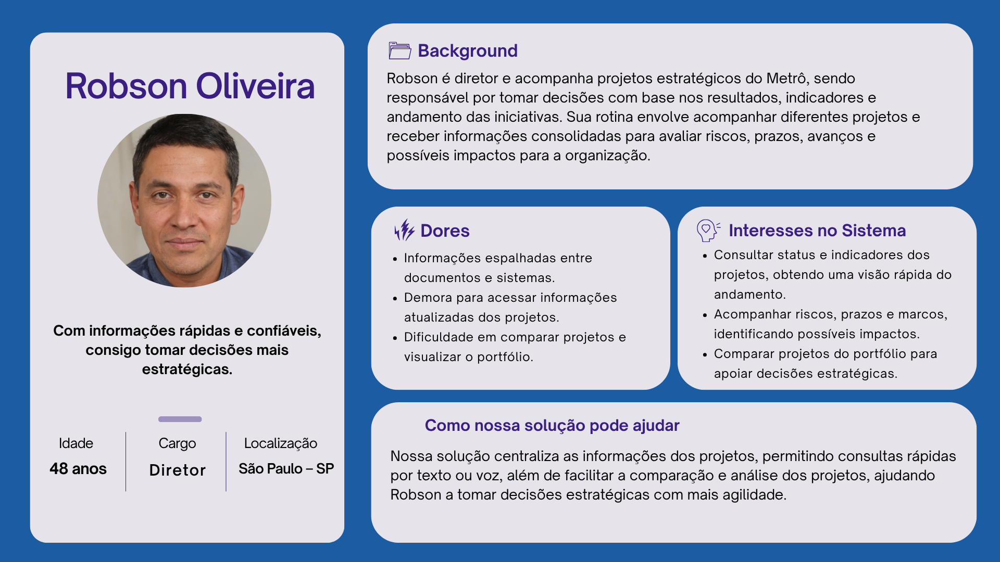<br>
  <sup>Fonte: Material produzido pelos autores, 2026.</sup>
</div>

### Caracterização

Robson Oliveira é diretor e acompanha projetos estratégicos do Metrô, tendo como uma de suas principais responsabilidades tomar decisões relacionadas ao andamento e aos resultados das iniciativas sob sua gestão. Para isso, precisa ter uma visão ampla dos projetos, acompanhando informações como status, indicadores, riscos, prazos e marcos.

Sua rotina envolve lidar com informações provenientes de diferentes projetos, documentos e sistemas. Nesse contexto, o acesso rápido e confiável aos dados é importante para que consiga compreender a situação dos projetos e identificar possíveis impactos para a organização.

### Dores

Uma das principais dificuldades de Robson é encontrar informações distribuídas entre diferentes documentos e sistemas. A necessidade de consultar diferentes fontes pode tornar a busca por informações atualizadas mais demorada, principalmente quando é necessário obter uma visão geral do portfólio.

Outra dificuldade está na comparação entre projetos. Sem uma forma centralizada de consultar e relacionar as informações, pode ser mais difícil identificar semelhanças, diferenças, riscos e situações que mereçam atenção.

### Interesses no Sistema

Robson tem interesse em consultar rapidamente o status e os indicadores dos projetos, obtendo uma visão geral do andamento das iniciativas. Também busca acompanhar riscos, prazos e marcos, de forma a identificar possíveis impactos para a organização com antecedência.

Além disso, tem interesse em comparar diferentes projetos do portfólio, utilizando essas informações como apoio para suas decisões estratégicas. Por ocupar uma posição de nível executivo, seu foco está menos nos detalhes operacionais de cada projeto e mais em uma visão consolidada e confiável que oriente suas decisões.

### Expectativas em relação à solução

Robson espera conseguir consultar as informações dos projetos de maneira simples e rápida, sem precisar realizar buscas manuais em diferentes documentos e sistemas. Também espera que as informações apresentadas sejam organizadas e contextualizadas de acordo com o projeto consultado.

A possibilidade de realizar consultas utilizando linguagem natural, por texto ou voz, facilita a interação com a solução e permite que o usuário formule perguntas de acordo com a necessidade do momento.

### Relação da persona com o produto

A persona de Robson representa o **Diretor**, que utiliza o agente para obter uma visão estratégica e consolidada do portfólio de projetos. Seu papel é acompanhar o desempenho geral das iniciativas, identificar riscos, avanços e possíveis impactos para a organização, utilizando essas informações como apoio à tomada de decisões. O Diretor utiliza a solução principalmente para **obter uma visão estratégica do conjunto de projetos e apoiar decisões de nível executivo**.

### Jornada do Usuário 1.5.1 — [Robson Oliveira - Diretor]

<div align="center">
<sub>Imagem 1.5.1 - Jornada do Usuário — Robson Oliveira - Diretor</sub><br>
  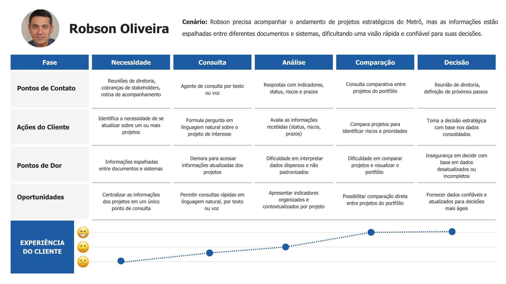<br>
  <sup>Fonte: Material produzido pelos autores, 2026.</sup>
</div>

### Cenário

Robson precisa acompanhar o andamento de projetos estratégicos do Metrô, mas as informações estão espalhadas entre diferentes documentos e sistemas, dificultando uma visão rápida e confiável para suas decisões.

### Necessidade

A jornada de Robson começa com a identificação da necessidade de se atualizar sobre um ou mais projetos, geralmente motivada por reuniões de diretoria, cobranças de stakeholders ou pela própria rotina de acompanhamento. Nesse momento, sua principal dificuldade é lidar com informações espalhadas entre documentos e sistemas, o que representa uma oportunidade para a solução centralizar essas informações em um único ponto de consulta.

### Consulta

Em seguida, Robson formula uma pergunta em linguagem natural, por texto ou voz, sobre o projeto de seu interesse. Nessa etapa, a principal dor está na demora para acessar informações atualizadas dos projetos, o que a solução busca resolver ao permitir consultas rápidas e diretas por meio do agente.

### Análise

Com a resposta em mãos, Robson avalia as informações recebidas, como status, riscos e prazos dos projetos. Nessa etapa, sua principal necessidade é compreender as informações de forma clara e organizada, facilitando a identificação de pontos que possam exigir sua atenção ou influenciar suas decisões.

### Comparação

Quando necessário, Robson compara diferentes projetos do portfólio para identificar riscos e prioridades. Essa etapa representa o ponto de maior satisfação na jornada, já que a possibilidade de comparação direta entre projetos supera uma das principais dores relatadas por Robson: a dificuldade em comparar projetos e visualizar o portfólio como um todo.

### Decisão

Por fim, com base nos dados consolidados, Robson toma sua decisão estratégica, geralmente no contexto de uma reunião de diretoria ou na definição de próximos passos. Ao contar com dados confiáveis e atualizados, a insegurança de decidir com base em informações incompletas é reduzida, tornando o processo mais ágil e permitindo que Robson utilize o agente como apoio, mantendo a decisão sob sua responsabilidade.

### Experiência do cliente ao longo da jornada

A experiência de Robson evolui de forma crescente ao longo da jornada: parte de um sentimento mais neutro/insatisfeito nas etapas iniciais, quando ainda lida com a dispersão das informações, e cresce progressivamente até atingir o pico de satisfação nas etapas de Comparação e Decisão, momento em que consegue consolidar as informações e tomar decisões estratégicas com mais confiança e agilidade.

---

### Persona 2: Maria Eduarda Santos — Analista de PMO

<div align="center">
<sub>Imagem 1.5.2 - Persona 2: Maria Eduarda Santos — Analista de PMO</sub><br>
  <br>
  <sup>Fonte: Material produzido pelos autores, 2026.</sup>
</div>

### Caracterização

Maria Eduarda Santos é analista do PMO Corporativo do Metrô e atua diretamente na gestão do portfólio de projetos, sendo responsável por manter os dados atualizados, cobrar os responsáveis por pendências de preenchimento e consolidar informações para relatórios e apresentações destinadas à diretoria. Diferentemente de uma visão puramente estratégica, seu trabalho está concentrado na operação diária da governança do portfólio, servindo como elo entre os líderes de projeto e os níveis mais altos da organização.

Sua rotina envolve acompanhar o cumprimento dos prazos mensais de atualização de status, verificar a qualidade dos dados registrados pelas equipes de projeto e apoiar a elaboração de relatórios consolidados. Nesse contexto, ter acesso rápido a informações atualizadas e confiáveis é essencial para que consiga cumprir suas próprias entregas sem depender inteiramente da boa vontade e da disponibilidade dos responsáveis por cada projeto.

### Dores

Uma das principais dificuldades de Maria Eduarda é a necessidade de cobrar manualmente, um a um, os responsáveis por atualizações pendentes, especialmente próximo ao prazo mensal de registro de status. Essa cobrança repetitiva consome tempo que poderia ser dedicado a atividades de maior valor analítico.

Outra dificuldade está na consolidação de dados espalhados entre diferentes sistemas e documentos, como listas do SharePoint, planilhas de Excel e arquivos de Word, processo necessário para a elaboração de relatórios de status e apresentações mensais. A ausência de um mecanismo proativo que sinalize riscos, marcos e pendências antes que se tornem problemas também obriga Maria Eduarda a atuar de forma reativa, identificando falhas apenas quando já se tornaram visíveis.

### Interesses no Sistema

Maria Eduarda tem interesse em consultar e comparar projetos do portfólio sem precisar navegar manualmente pelas listas do SharePoint, obtendo respostas rápidas e organizadas conforme sua necessidade do momento.

Além disso, busca receber alertas proativos sobre marcos, riscos e pendências de preenchimento, de modo a agir antes do prazo, em vez de depender inteiramente da própria iniciativa para lembrar cada responsável. Também tem interesse em contar com apoio na elaboração de relatórios de status e de apresentações mensais para a diretoria, a partir de templates já utilizados pela equipe, e em receber sugestões de conteúdo para campos pendentes, mantendo o controle final sobre o que é efetivamente registrado.

### Expectativas em relação à solução

Maria Eduarda espera que a solução reduza o esforço manual envolvido na cobrança de atualizações e na consolidação de dados, permitindo que ela dedique mais tempo à análise da qualidade das informações e menos à busca e à repetição de tarefas operacionais.

A possibilidade de interagir por linguagem natural, por texto ou voz, aliada a alertas proativos e sugestões de preenchimento, é vista como um fator que aumenta sua produtividade e reduz o risco de pendências passarem despercebidas até próximo do prazo.

### Relação da persona com o produto

A persona de Maria Eduarda representa o **Analista de PMO**, responsável pela operação diária da governança do portfólio. Ela utiliza o agente tanto para **consultar e comparar o andamento dos projetos** quanto para **cobrar, apoiar o preenchimento e consolidar informações** que alimentam os relatórios e as apresentações destinadas à diretoria. O Analista de PMO utiliza a solução principalmente para **reduzir o esforço manual de acompanhamento e cobrança, ganhando tempo para atividades de maior valor analítico dentro do portfólio**.

### Jornada do Usuário 1.5.2 — Maria Eduarda Santos - Analista de PMO

<div align="center">
<sub>Imagem 1.5.2.1 - Jornada do Usuário — Maria Eduarda Santos - Analista de PMO</sub><br>
  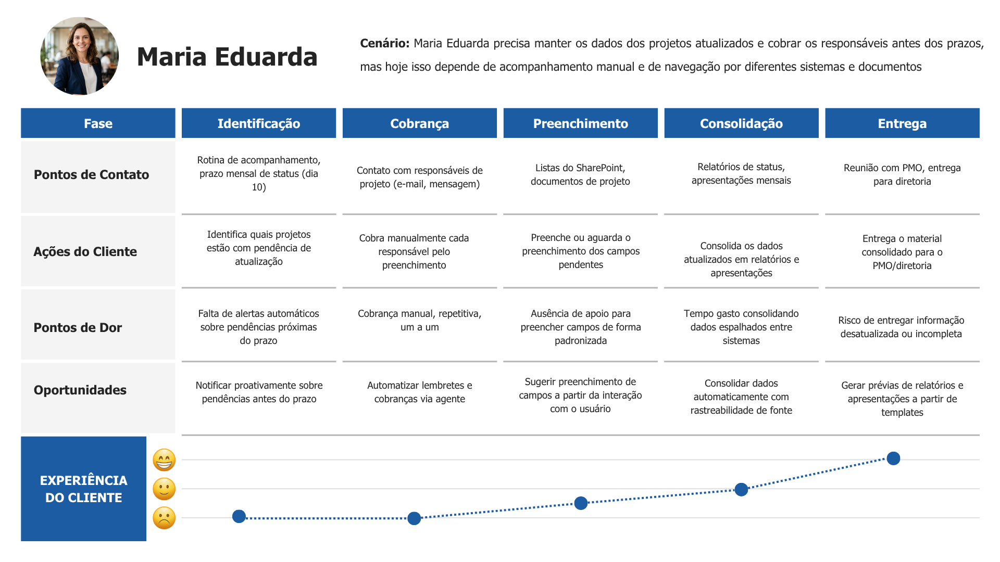<br>
  <sup>Fonte: Material produzido pelos autores, 2026.</sup>
</div>

### Cenário

Maria Eduarda precisa manter os dados dos projetos atualizados e cobrar os responsáveis antes dos prazos mensais, mas hoje isso depende de acompanhamento manual e de navegação por diferentes sistemas e documentos, consumindo tempo que faltaria à análise e à consolidação das informações.

### Identificação

A jornada de Maria Eduarda começa com a identificação de quais projetos estão com pendência de atualização, geralmente próximo ao prazo mensal de registro de status, fixado até o dia 10 de cada mês. Nessa etapa, sua principal dificuldade está na falta de alertas automáticos que sinalizem pendências antes do prazo, o que representa uma oportunidade para a solução notificar proativamente Maria Eduarda sobre o que precisa ser atualizado.

### Cobrança

Em seguida, Maria Eduarda cobra manualmente cada responsável pelo preenchimento das informações pendentes, geralmente por e-mail ou mensagem. Nessa etapa, a principal dor está na cobrança repetitiva, feita um a um, o que a solução busca resolver ao automatizar lembretes e cobranças por meio do agente.

### Preenchimento

Com os responsáveis notificados, Maria Eduarda acompanha o preenchimento dos campos pendentes nas listas do SharePoint e nos documentos de projeto, muitas vezes precisando orientar os responsáveis sobre o que e como preencher. Nessa etapa, sua principal dificuldade é a ausência de apoio para preencher campos de forma padronizada, o que a solução busca resolver ao sugerir conteúdo para os campos pendentes a partir da interação com o usuário responsável.

### Consolidação

Na sequência, Maria Eduarda consolida os dados atualizados em relatórios de status e apresentações mensais para a diretoria. Sua principal dificuldade é o tempo gasto reunindo informações espalhadas entre diferentes sistemas e documentos. Nessa etapa, a solução pode consolidar automaticamente os dados com rastreabilidade de fonte, reduzindo o esforço manual de montagem dos relatórios.

### Entrega

Por fim, Maria Eduarda entrega o material consolidado ao PMO e à diretoria, respondendo a questionamentos sobre o andamento do portfólio. Essa etapa representa o ponto de maior satisfação na jornada, pois, ao contar com dados atualizados e rastreáveis, reduz-se o risco de entregar informação desatualizada ou incompleta, tornando a entrega mais segura e ágil.

### Experiência do cliente ao longo da jornada

A experiência de Maria Eduarda evolui de forma crescente ao longo da jornada: parte de um sentimento mais neutro/insatisfeito nas etapas iniciais, quando ainda lida com a falta de alertas e a cobrança manual e repetitiva, e cresce progressivamente até atingir o pico de satisfação na etapa de Entrega, momento em que consegue reportar o andamento do portfólio com mais confiança, agilidade e rastreabilidade.

---

### Persona 3: Rafael Antunes — Líder de Projeto

<div align="center">
<sub>Imagem 1.5.3 - Persona 3: Rafael Antunes — Líder de Projeto</sub><br>
  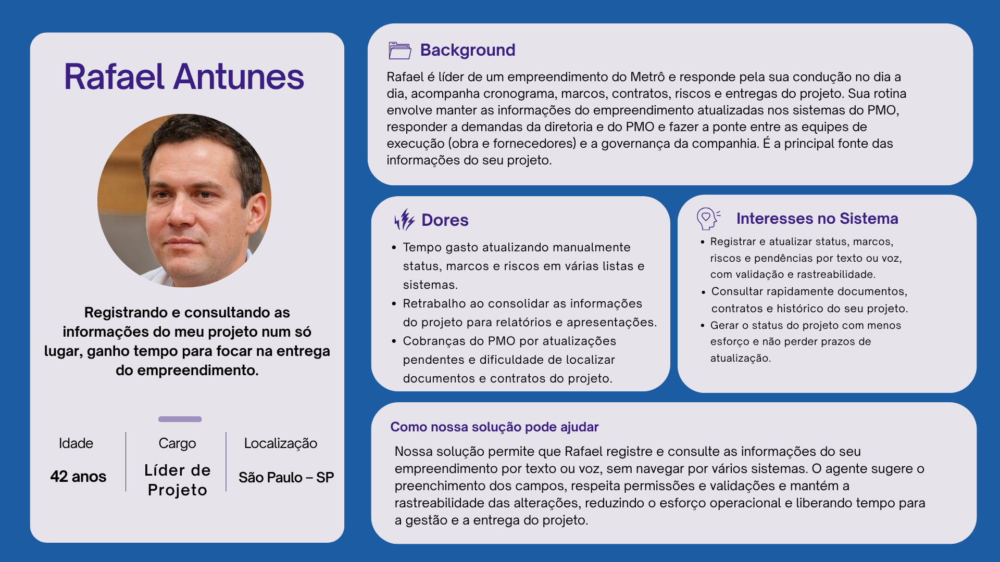<br>
  <sup>Fonte: Material produzido pelos autores, 2026.</sup>
</div>

### Caracterização

Rafael Antunes é líder de um empreendimento específico do Metrô e responde pela sua condução no dia a dia, sendo responsável por acompanhar o cronograma, os marcos, os contratos, os riscos e as entregas do projeto sob sua gestão. Diferentemente de uma visão ampla de portfólio, seu foco está na profundidade de um único empreendimento, do qual é a principal fonte de informações.

Sua rotina envolve manter as informações do projeto atualizadas nos sistemas do PMO, responder a demandas da diretoria e do próprio PMO e fazer a ponte entre as equipes de execução — como obra e fornecedores — e a governança da companhia. Nesse contexto, registrar e localizar rapidamente as informações do empreendimento é essencial para acompanhar o andamento e responder com agilidade às demandas.

### Dores

Uma das principais dificuldades de Rafael é o tempo gasto atualizando manualmente status, marcos e riscos em diferentes listas e sistemas. Essa atividade operacional, somada ao retrabalho necessário para consolidar as informações do projeto em relatórios e apresentações, reduz o tempo disponível para a gestão do empreendimento.

Além disso, Rafael lida frequentemente com cobranças do PMO por atualizações pendentes e com a dificuldade de localizar documentos e contratos específicos do seu projeto em meio ao grande volume de informações.

### Interesses no Sistema

Rafael tem interesse em registrar e atualizar status, marcos, riscos e pendências do seu projeto por meio de linguagem natural, por texto ou voz, contando com validação dos campos e rastreabilidade das alterações. Também busca consultar rapidamente documentos, contratos e o histórico do empreendimento sob sua responsabilidade.

Ademais, tem interesse em gerar o status do projeto com menos esforço e em não perder prazos de atualização, mantendo as informações sempre consistentes e disponíveis para o PMO e a diretoria.

### Expectativas em relação à solução

Rafael espera conseguir registrar e consultar as informações do seu empreendimento de maneira simples e rápida, sem precisar navegar manualmente por diversos sistemas e documentos. Também espera que o preenchimento das informações seja apoiado pela solução, com sugestões de conteúdo que ele possa validar, respeitando as permissões de acesso e os campos obrigatórios.

A possibilidade de interagir por linguagem natural, aliada à manutenção da rastreabilidade das alterações, é vista como um fator que reduz o esforço operacional e aumenta a confiabilidade das informações registradas.

### Relação da persona com o produto

A persona de Rafael representa o **Líder de Projeto**, responsável por um empreendimento específico do Metrô. Ele utiliza o agente tanto para **registrar e manter atualizadas as informações do seu projeto** quanto para consultá-las rapidamente, sendo a principal fonte dos dados que alimentam a governança do PMO e as decisões da diretoria. O Líder de Projeto utiliza a solução principalmente para **reduzir o esforço operacional de registro e consulta das informações do seu empreendimento, dedicando mais tempo à gestão e à entrega do projeto**.

### Jornada do Usuário 1.5.3 — Rafael Antunes - Líder de Projeto

<div align="center">
<sub>Imagem 1.5.3.1 - Jornada do Usuário — Rafael Antunes - Líder de Projeto</sub><br>
  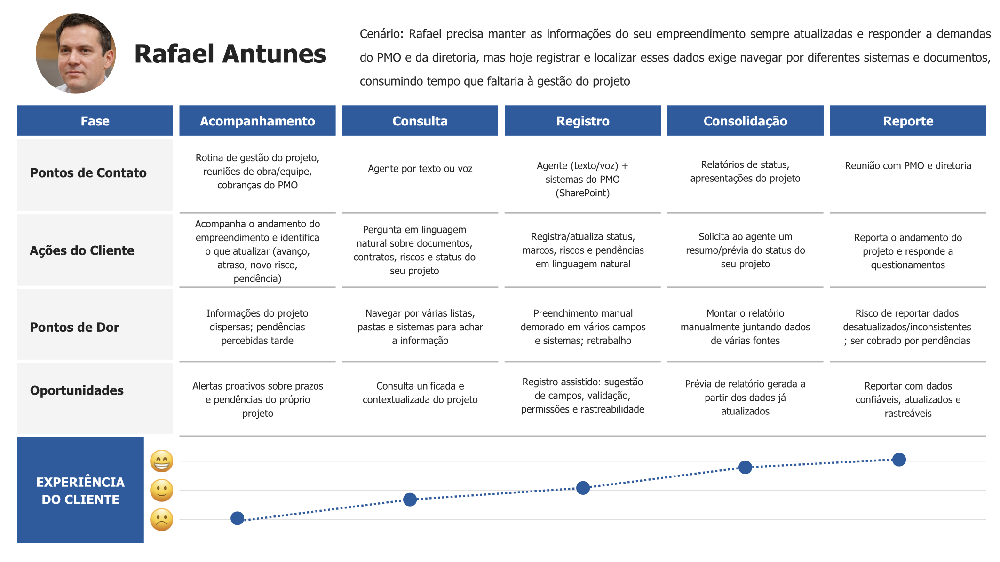<br>
  <sup>Fonte: Material produzido pelos autores, 2026.</sup>
</div>

### Cenário

Rafael precisa manter as informações do seu empreendimento sempre atualizadas e responder a demandas do PMO e da diretoria, mas registrar e localizar esses dados exige navegar por diferentes sistemas e documentos, consumindo tempo que faltaria à gestão do projeto.

### Acompanhamento

A jornada de Rafael começa com o acompanhamento contínuo do andamento do seu empreendimento, momento em que identifica o que precisa ser registrado ou atualizado, como um avanço, um atraso, um novo risco ou uma pendência. Nessa etapa, sua principal dificuldade está nas informações do projeto dispersas entre documentos e sistemas, o que representa uma oportunidade para a solução oferecer alertas proativos sobre prazos e pendências do próprio projeto.

### Consulta

Em seguida, Rafael consulta rapidamente documentos, contratos, riscos e o status atual do seu projeto, formulando perguntas em linguagem natural, por texto ou voz. Nessa etapa, a principal dor está na necessidade de navegar por várias listas, pastas e sistemas para localizar a informação, o que a solução busca resolver ao oferecer uma consulta unificada e contextualizada do empreendimento.

### Registro

Com as informações em mãos, Rafael registra ou atualiza o status, os marcos, os riscos e as pendências do projeto em linguagem natural. Nessa etapa, sua principal dor é o preenchimento manual e demorado em diversos campos e sistemas, além do retrabalho envolvido. A solução atua nesse ponto ao oferecer um registro assistido, com sugestão de campos, validação, respeito às permissões e rastreabilidade das alterações.

### Consolidação

Na sequência, Rafael consolida as informações do projeto para gerar relatórios e apresentações de status. Sua principal dificuldade é montar o relatório manualmente, reunindo dados espalhados em diferentes fontes. Nessa etapa, a solução pode gerar prévias de relatório a partir dos dados já atualizados e rastreáveis, reduzindo o esforço de consolidação.

### Reporte

Por fim, Rafael reporta o andamento do projeto ao PMO e à diretoria, respondendo a questionamentos sobre o empreendimento. Essa etapa representa o ponto de maior satisfação da jornada, pois, ao contar com dados confiáveis, atualizados e rastreáveis, reduz-se o risco de reportar informações desatualizadas ou inconsistentes, tornando o reporte mais seguro e ágil.

### Experiência do cliente ao longo da jornada

A experiência de Rafael evolui de forma crescente ao longo da jornada: parte de um sentimento mais neutro/insatisfeito nas etapas iniciais, quando ainda lida com a dispersão das informações e o esforço manual de registro, e cresce progressivamente até atingir o pico de satisfação na etapa de Reporte, momento em que consegue reportar o andamento do projeto com mais confiança, agilidade e rastreabilidade.

---

## 1.6 Fluxo do Negócio

### Cadeia de valor

<div align="center">
<sub>Figura 1.6.1 — Cadeia de valor relacionada à gestão do portfólio de projetos</sub><br>
  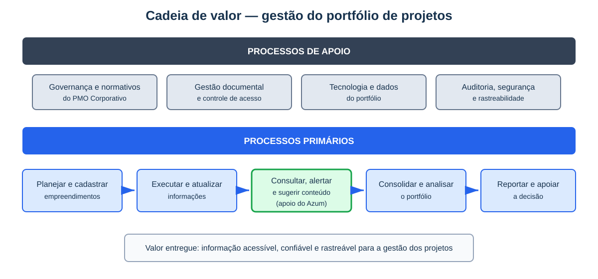<br>
  <sup>Fonte: material produzido pelos autores (2026).</sup>
</div>

A cadeia de valor separa os processos primários, que produzem diretamente informação para o acompanhamento e a tomada de decisão, dos processos de apoio que sustentam sua execução. O fluxo primário começa no planejamento e no cadastro dos empreendimentos, passa pela execução e pela atualização das informações, segue para a consulta e a identificação de pendências, alcança a consolidação e a análise do portfólio e termina no reporte e no apoio à decisão. A governança e os normativos do PMO, a gestão documental e o controle de acesso, a infraestrutura tecnológica e os dados, além da auditoria, da segurança e da rastreabilidade, apoiam todas essas etapas.

O AZ1 atua na etapa de consulta e acompanhamento: interpreta solicitações em linguagem natural, recupera dados autorizados, sinaliza pendências e sugere conteúdo para campos. No MVP, o agente não substitui o cadastro oficial nem grava alterações nas fontes corporativas; o profissional continua responsável por avaliar a sugestão e registrar a informação. Assim, o valor entregue é a redução do esforço de acesso e consolidação sem retirar dos profissionais e dos sistemas oficiais a responsabilidade pela governança dos dados.

### Fluxo do Business Process Model and Notation (BPMN)

 Esta seção modela, em notação BPMN, o fluxo de consulta e registro de informações do portfólio de projetos do Metrô de São Paulo em dois momentos: o processo como ocorre atualmente (AS-IS) e o processo com a solução proposta incorporada (TO-BE). É a comparação entre os dois diagramas que evidencia a contribuição do produto — não pela substituição das atividades ou dos responsáveis, que permanecem os mesmos, mas pela redução do atrito na interação com a informação, preservando os processos, as permissões e a rastreabilidade já estabelecidos pela companhia.

O primeiro diagrama representa o fluxo atual. Suas atividades e decisões são:

1. o usuário identifica uma necessidade de informação ou de ação sobre o portfólio;
2. acessa o agente de inteligência artificial disponível no Microsoft Studio;
3. consulta os dados dos projetos que serão planejados;
4. seleciona blocos de texto predefinidos ou envia uma mensagem de texto;
5. o agente filtra os dados de acordo com a pergunta e consulta o catálogo de portfólios;
6. a plataforma exibe as informações localizadas, e o usuário aguarda a resposta;
7. no gateway **“Conseguiu a resposta?”**, o caminho **Sim** permite que o usuário acesse a informação e encerre o fluxo; no caminho **Não**, o usuário retorna à formulação da consulta e repete o ciclo.

<div align="center">
  <sub>FIGURA 1.6.1 - Fluxo de gestão de portfólio de projetos (AS-IS)</sub><br>
  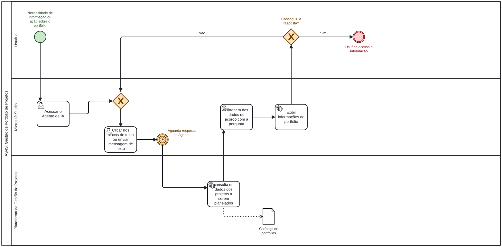<br>
  <sup>Fonte: material produzido pelos autores (2026).</sup>
</div>

O agente de inteligência artificial do passo 2, disponível no Microsoft Studio, corresponde às iniciativas de IA que o Metrô já mantém e que a Matriz SWOT registra como força e oportunidade a especializar (seção 1.1). No fluxo TO-BE a seguir, esse agente é substituído pela Interface de PLN desenvolvida pela equipe, que passa a interpretar a solicitação em linguagem natural e a classificar sua intenção.

O segundo diagrama representa o mesmo fluxo com a solução incorporada. Suas atividades e decisões são:

1. o usuário identifica uma necessidade de informação ou de apoio a uma ação sobre o portfólio e envia um comando em linguagem natural;
2. no gateway **“Tipo de entrada?”**, o caminho **Áudio** aciona a transcrição; o caminho **Texto** segue diretamente ao pré-processamento;
3. a interface pré-processa e normaliza o texto, compreende a solicitação e classifica sua intenção;
4. no gateway **“Compreendeu a intenção do usuário?”**, o caminho **Sim** prossegue para o tipo de intenção; o caminho **Não** leva ao envio de uma pergunta de esclarecimento;
5. no gateway **“Usuário respondeu?”**, o caminho **Sim** retorna à compreensão da intenção; o caminho **Não** encerra a sessão;
6. no gateway **“Tipo de intenção”**, uma consulta aciona a filtragem e a apresentação dos dados, enquanto um pedido de apoio ao preenchimento gera somente uma sugestão para avaliação humana;
7. a plataforma apresenta a resposta ou a sugestão, e a sessão é encerrada sem alteração automática das fontes de dados.


<div align="center">
  <sub>FIGURA 1.6.2 - Fluxo de gestão de portfólio de projetos (TO-BE)</sub><br>
  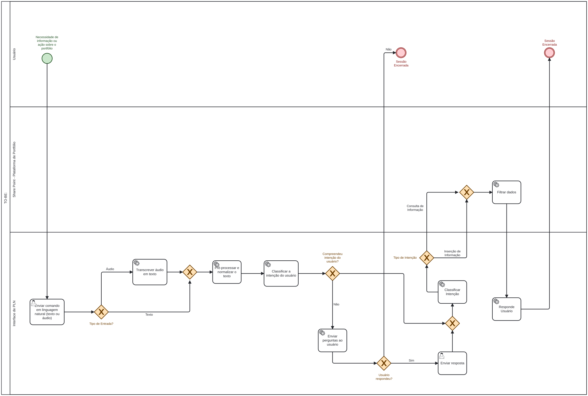<br>
  <sup>Fonte: material produzido pelos autores (2026).</sup>
</div>

**Nota de escopo:** no diagrama original, o caminho denominado “Inserção de Informação” representa, para o MVP, apenas a geração de uma sugestão de preenchimento. Nenhuma informação é gravada nas fontes oficiais. A execução efetiva de transações permanece registrada como evolução futura na seção 1.7.

**Nota sobre os tipos de intenção:** o gateway “Tipo de intenção” representa apenas os caminhos acionados por uma solicitação síncrona do usuário — consulta e apoio ao preenchimento (a transação sugestiva das seções 1.3 e 1.4). O terceiro tipo definido nessas seções, o alerta, corresponde a uma notificação proativa disparada pelo sistema a partir de prazos, riscos e pendências identificados, e não a uma resposta a uma solicitação do usuário; por isso não aparece como um caminho deste gateway específico, embora seja tratado pelo mesmo classificador de intenções.

**Principais diferenças entre os fluxos:**

| Aspecto | AS-IS | TO-BE |
| --- | --- | --- |
| Forma de entrada | Blocos de texto predefinidos ou mensagem escrita | Linguagem natural, por texto ou áudio |
| Interpretação da demanda | Filtragem direta a partir da pergunta | Pré-processamento, normalização e classificação da intenção |
| Demanda não compreendida | Usuário retorna ao início e reformula por conta própria | Agente devolve perguntas de esclarecimento antes de encerrar |
| Operações suportadas | Consulta de informação | Consulta de informação e sugestão de preenchimento, sem gravação automática |
| Encerramento | Depende de o usuário obter a resposta por tentativa e erro | Sessão encerrada explicitamente, com resposta ou por ausência de retorno |

 A leitura conjunta dos dois diagramas mostra que o ganho não está em acrescentar etapas ao processo, e sim em deslocar para o agente o esforço que hoje recai sobre o usuário: interpretar a demanda, reformular a pergunta quando o resultado não satisfaz e navegar pela estrutura até localizar a informação. As atividades de negócio e a decisão final permanecem sob responsabilidade dos profissionais do Metrô, conforme delimitado na seção 1.3.

---

## 1.7 Brainstorming de Features

 O brainstorming de features é uma técnica de levantamento de ideias na qual as funcionalidades possíveis para um produto são registradas de forma ampla, antes de qualquer filtro de escopo, para em seguida serem avaliadas e priorizadas. Essa prática permite que o grupo visualize o universo completo de possibilidades da solução, das capacidades essenciais ao MVP até os desejos de longo prazo do parceiro, e tome decisões de sequenciamento fundamentadas, em vez de definir o escopo de maneira implícita ou arbitrária. Nesta seção, são apresentados o registro das ideias levantadas, os critérios adotados para a priorização e a classificação de cada feature quanto ao seu planejamento no projeto.

 A partir da análise do TAPI (Termo de Abertura de Projeto Inteli), das discussões internas do grupo e dos desejos manifestados pelo parceiro, foi realizado um brainstorming de funcionalidades para o agente de IA. Nessa etapa, todas as ideias foram registradas, incluindo aquelas que extrapolam o escopo do MVP, como as funcionalidades que dependem da integração com o portfólio real do Metrô ou de aprovações de compliance da companhia. O objetivo desse registro é duplo: sequenciar o desenvolvimento das features viáveis dentro do módulo e preservar, para o parceiro, as ideias que podem orientar evoluções futuras da solução, ainda que não sejam satisfeitas nesta etapa.

Cada feature foi avaliada em dois critérios. A importância expressa o valor para o problema e para os benefícios esperados pelo parceiro; a viabilidade representa a capacidade de entrega dentro do módulo, considerando esforço técnico, dependências externas e restrições de confidencialidade. Para tornar a priorização reproduzível, adotou-se a escala Baixa = 1, Média = 2 e Alta = 3; níveis intermediários correspondem à média dos níveis adjacentes. O score é a soma de importância e viabilidade, variando de 2 a 6. Empates são resolvidos, nesta ordem, pela maior importância e pela precedência técnica. Por isso, as funcionalidades do pipeline de Processamento de Linguagem Natural antecedem as que dependem dele. A coluna de planejamento registra o recorte do projeto, mas não altera o score.

**Critério de origem:** cada feature foi classificada em uma de cinco origens — **TAPI** (descrita explicitamente no termo de abertura), **Parceiro** (solicitada verbalmente em reunião ou entrevista), **Problema identificado** (deduzida diretamente da dor mapeada na seção 1.1 ou nas personas da seção 1.5), **Equipe (produto)** (proposta pelo grupo para melhorar a experiência) ou **Equipe (técnica)** (decorrente de necessidade de arquitetura, do pipeline de PLN ou de segurança). Para as features das faixas Simulação no MVP, Registro para o futuro (Ir Além) e Registro para o futuro (desejo do parceiro), a origem estava registrada em prosa nos parágrafos que seguem a tabela; para as demais, a classificação foi reconstruída a partir do restante do documento — descrição do produto (seção 1.3), problema (seção 1.1) e personas (seção 1.5) — na ausência de um registro contemporâneo ao brainstorming, e deve ser conferida pela equipe.

<div align="center">
<sub>Tabela 1.7 — Brainstorming e priorização de features</sub>
</div>

| Prioridade | Feature                                                                           | Importância | Viabilidade | Score | Planejamento                                  | Origem |
| :--------: | --------------------------------------------------------------------------------- | :---------: | :---------: | :---: | --------------------------------------------- | ------ |
| 1 | Consulta em linguagem natural por voz e texto | Alta | Alta | 6,0 | MVP | TAPI |
| 2 | Identificação e classificação de intenções | Alta | Alta | 6,0 | MVP | Equipe (técnica) |
| 3 | Detecção de solicitações fora do catálogo de intenções | Alta | Alta | 6,0 | MVP | TAPI |
| 4 | Consulta a informações estruturadas dos projetos (prazos, marcos, riscos, avanço) | Alta | Alta | 6,0 | MVP | Problema identificado |
| 5 | Respostas estruturadas | Alta | Alta | 6,0 | MVP | Equipe (produto) |
| 6 | Aviso de dados insuficientes para resposta confiável | Alta | Alta | 6,0 | MVP | Equipe (técnica) |
| 7 | Localização e consulta de documentos dos projetos | Alta | Média | 5,0 | MVP | Problema identificado |
| 8 | Indicação das fontes | Alta | Média | 5,0 | MVP | TAPI |
| 9 | Alertas de prazos e documentos faltantes | Alta | Média | 5,0 | MVP | Problema identificado |
| 10 | Identificação de campos incompletos | Alta | Média | 5,0 | MVP | Problema identificado |
| 11 | Sugestão de conteúdo para campos | Alta | Média | 5,0 | MVP | Problema identificado |
| 12 | Esclarecimento de dúvidas sobre conceitos e normativos de gestão de portfólio | Média/Alta | Média | 4,5 | MVP | Equipe (produto) |
| 13 | Sugestões proativas de consultas e perguntas sugeridas | Média | Média | 4,0 | MVP | Equipe (produto) |
| 14 | Registro de feedback do usuário sobre as respostas | Média | Média | 4,0 | MVP | Equipe (técnica) |
| 15 | Rastreabilidade das interações | Alta | Média | 5,0 | Simulação no MVP | TAPI |
| 16 | Autenticação por SSO | Alta | Média/Baixa | 4,5 | Simulação no MVP | TAPI |
| 17 | Análises comparativas entre projetos | Alta | Média/Baixa | 4,5 | Evolução futura | TAPI |
| 18 | Prévia de relatório de status | Média/Alta | Média | 4,5 | Evolução futura | TAPI |
| 19 | Painel de alertas e pendências | Média | Média | 4,0 | Evolução futura | Equipe (produto) |
| 20 | Fluxo guiado de criação de projetos (sugestões por etapas) | Média | Baixa | 3,0 | Evolução futura | Equipe (produto) |
| 21 | Notificações automáticas | Média | Baixa | 3,0 | Evolução futura | Equipe (técnica) |
| 22 | Integração com o portfólio real do Metrô (SharePoint, Listas, Power BI) | Alta | Baixa | 4,0 | Registro para o futuro (Ir Além) | TAPI |
| 23 | Execução efetiva de transações com confirmação do usuário | Alta | Baixa | 4,0 | Registro para o futuro (Ir Além) | TAPI |
| 24 | Prévia de apresentação mensal para a diretoria | Média | Baixa | 3,0 | Registro para o futuro (desejo do parceiro) | Parceiro |
| 25 | Prévia do relatório de fechamento do portfólio e dos projetos | Média | Baixa | 3,0 | Registro para o futuro (desejo do parceiro) | Parceiro |
| 26 | Identificação de conexões com estratégia e indicadores | Média | Baixa | 3,0 | Registro para o futuro (desejo do parceiro) | Parceiro |
| 27 | Consultas sobre faturas e pagamentos dos projetos | Média | Baixa | 3,0 | Registro para o futuro (desejo do parceiro) | Parceiro |
| 28 | Adoção de serviços de IA generativa homologados | Média | Baixa | 3,0 | Registro para o futuro (evolução tecnológica) | Equipe (técnica) |

<div align="center">
<sup>Fonte: Material produzido pelos autores, 2026.</sup>
</div>

 O MVP reúne as funcionalidades que serão efetivamente desenvolvidas e validadas ao longo do módulo, sobre a base de dados sintéticos, e representa a resposta mínima e completa ao problema identificado. As primeiras posições da priorização foram ocupadas pelas capacidades de interpretação em linguagem natural, de classificação de intenções e de controle do catálogo de interações, porque nenhuma outra funcionalidade do agente existe sem elas: o pipeline de Processamento de Linguagem Natural é o fundamento técnico sobre o qual toda a solução se apoia. A entrada por voz foi incluída nesse mesmo núcleo por ser um requisito central do módulo e por reutilizar integralmente o processamento de texto, uma vez que o áudio é convertido em texto antes de seguir para o pipeline. Na sequência, foram priorizadas as consultas, as respostas estruturadas e o aviso de dados insuficientes, que juntas entregam o valor mais imediato ao usuário: obter informação confiável de forma rápida. Por fim, os alertas, o apoio ao preenchimento de campos, o esclarecimento de dúvidas e o registro de feedback completam o escopo, agregando a dimensão proativa da solução e gerando insumos para a melhoria contínua do próprio pipeline. Essa ordenação também funciona como instrumento de gestão do risco de prazo registrado na matriz de riscos: caso o cronograma exija replanejamento, o corte de escopo ocorre das últimas para as primeiras posições, preservando sempre as funcionalidades das quais as demais dependem.

 A categoria de simulação no MVP foi criada para as funcionalidades que dependem da infraestrutura corporativa real do Metrô, à qual o grupo não terá acesso nesta etapa. É o caso da autenticação por SSO e da rastreabilidade das interações. Em vez de adiar sua especificação, o grupo optou por planejar a validação com identidade e dados sintéticos, sem definir diferenças de acesso por cargo. Essa escolha permite validar o contrato de autenticação independentemente da futura seleção entre Microsoft e Google e facilita a implantação posterior no ambiente da companhia.

 A evolução futura reúne as funcionalidades que agregariam valor ao produto, mas que dependem da maturidade consolidada do núcleo para serem bem executadas, razão pela qual não integram o compromisso inicial do MVP. As análises comparativas entre projetos e a prévia de relatório de status, embora presentes no escopo macro do TAPI, exigem uma base sintética com múltiplos projetos suficientemente ricos e um mecanismo de consulta já estável, condições que só se confirmam ao longo das sprints. Por isso, essa faixa funciona como um backlog complementar, alinhado à estratégia de aproveitamento da oportunidade de expansão registrada na matriz de riscos: ao final de cada sprint, o grupo avalia se há capacidade de incorporar algum desses itens, priorizando os de maior importância. As funcionalidades que não forem desenvolvidas não se perdem, pois serão registradas nas orientações de evolução entregues ao parceiro.

 O registro para o futuro, por fim, preserva os desejos do parceiro e as possibilidades de evolução que não serão satisfeitos nesta etapa, atendendo ao propósito do brainstorming de não descartar nenhuma ideia relevante. A integração com o portfólio real do Metrô e a execução efetiva de transações correspondem ao caminho de evolução que o próprio TAPI denomina "Ir Além", e dependem do acesso ao ambiente corporativo e de aprovações das áreas de TI e compliance da companhia, fatores fora do controle do grupo. As prévias de apresentações e relatórios de fechamento, as conexões com estratégia e indicadores e as consultas financeiras são desejos manifestados pelo parceiro que pressupõem essa integração para gerar valor efetivo. Já a adoção de serviços de IA generativa aguarda homologação pela companhia e está prevista nos entregáveis do projeto como estudo inicial. Vale destacar que a importância de várias dessas funcionalidades é alta, e sua posição na priorização decorre exclusivamente da viabilidade no contexto do módulo. O registro formal dessas ideias integra os entregáveis do projeto e oferece à equipe do Metrô um backlog priorizado para dar continuidade à solução após o encerramento do módulo.

## 1.8 Canvas do MVP

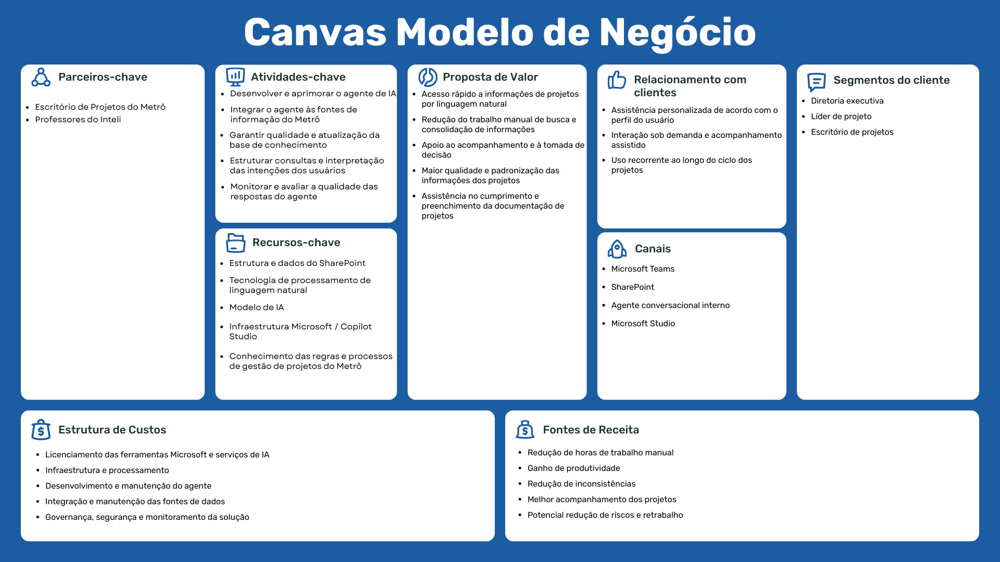

### Visão geral

O Business Model Canvas (BMC) foi utilizado para estruturar os principais elementos relacionados à proposta de valor, aos usuários, aos recursos e às atividades necessárias para o desenvolvimento do agente de Inteligência Artificial voltado à gestão de projetos do Metrô de São Paulo. Diferentemente de um produto comercial tradicional, a solução proposta possui caráter interno e tem como principal objetivo gerar ganhos de eficiência operacional, facilitar o acesso às informações dos projetos e apoiar os diferentes perfis envolvidos na gestão e no acompanhamento do portfólio de projetos do Metrô. O Canvas considera o agente de IA como uma interface conversacional capaz de consultar informações organizacionais, auxiliar usuários durante atividades relacionadas à documentação dos projetos e facilitar o acesso ao conhecimento existente nos sistemas internos da organização.

### Parceiros-chave

Os parceiros-chave representam os atores necessários para o desenvolvimento, validação e evolução da solução.

**Escritório de Projetos do Metrô**

O Escritório de Projetos possui conhecimento sobre os processos, documentos e regras de gestão utilizados dentro da organização. Sua participação é fundamental para fornecer contexto de negócio, validar os comportamentos esperados do agente e verificar se as respostas e funcionalidades desenvolvidas estão alinhadas às necessidades reais dos usuários.

**Inteli / equipe acadêmica**

O Inteli participa do desenvolvimento do projeto por meio da equipe de estudantes e professores responsáveis pelo acompanhamento técnico e metodológico da solução.

### Atividades-chave

As atividades-chave correspondem às ações necessárias para construir, manter e melhorar continuamente o agente.

**Desenvolvimento e aprimoramento do agente de IA**

Implementar as funcionalidades do agente e realizar melhorias com base nos resultados obtidos durante testes e validações com os stakeholders.

**Integração com as fontes de informação do Metrô**

Permitir que o agente consulte as fontes de dados relevantes para responder às solicitações dos usuários e fornecer informações relacionadas aos projetos.

**Manutenção da base de conhecimento**

Garantir que documentos, informações e demais fontes utilizadas pelo agente estejam organizados e atualizados, reduzindo a possibilidade de respostas baseadas em informações desatualizadas ou inconsistentes.

**Interpretação das intenções dos usuários**

Estruturar os fluxos necessários para que o agente consiga compreender diferentes tipos de solicitação realizados em linguagem natural e identificar corretamente as ações ou informações esperadas pelo usuário.

**Monitoramento da qualidade das respostas**

Avaliar continuamente as respostas produzidas pelo agente, identificando erros, limitações e oportunidades de melhoria.

### Recursos-chave

Os recursos-chave representam os elementos necessários para que a solução consiga operar adequadamente.

**Estrutura e dados do SharePoint**

O SharePoint constitui uma das principais fontes de informação consideradas para a solução, concentrando documentos e dados relacionados à gestão dos projetos.

**Tecnologias de Processamento de Linguagem Natural**

Permitem que os usuários interajam com o sistema utilizando linguagem natural, sem a necessidade de conhecer estruturas específicas de consulta ou navegar manualmente pelas diferentes fontes de informação.

**Modelo de Inteligência Artificial**

O modelo de IA é responsável pela interpretação das solicitações, geração das respostas e apoio às interações realizadas pelo agente.

**Infraestrutura tecnológica da aplicação**

A solução depende da infraestrutura necessária para disponibilizar a interface desenvolvida pela equipe, executar o agente e realizar o processamento e a consulta das informações utilizadas durante as interações.

**Conhecimento sobre os processos de gestão de projetos**

Além da tecnologia, a solução depende do conhecimento das regras, documentos e processos utilizados pelo Metrô para que as respostas estejam alinhadas ao contexto real da organização.

### Propostas de valor

A principal proposta de valor da solução consiste em facilitar a interação dos usuários com as informações relacionadas aos projetos do Metrô.

**Acesso rápido às informações por linguagem natural**

O agente elimina a navegação manual por diferentes documentos e estruturas de dados: o usuário formula a pergunta diretamente em linguagem natural e recebe resposta em até 15 segundos em pelo menos 80% das consultas, conforme o RNF01.

**Redução do trabalho manual**

A solução reduz o tempo empregado na busca, na interpretação e na consolidação manual de informações dos projetos, substituindo a navegação por múltiplas fontes por uma única interação conversacional.

**Apoio ao acompanhamento e à tomada de decisão**

Ao estruturar as informações relevantes em respostas claras, o agente apoia líderes, Escritório de Projetos e diretoria no acompanhamento dos projetos e na tomada de decisões: pelo menos 80% dos participantes dos testes de usabilidade compreendem a resposta e identificam a informação solicitada sem auxílio externo, conforme o RNF08.

**Maior qualidade e padronização das informações**

O agente eleva a consistência das informações registradas ao sugerir conteúdo padronizado para os campos dos documentos: pelo menos 85% das sugestões vêm acompanhadas de referência válida e justificativa compreensível, conforme o RNF11.

**Assistência no cumprimento da documentação de projetos**

A solução apoia os responsáveis pelos projetos no preenchimento dos documentos exigidos ao longo do ciclo de vida do empreendimento, apresentando uma sugestão de texto para cada campo pendente sem alterar o documento de origem, conforme os critérios de aceitação do RF04.

### Relacionamento com os usuários

A relação entre o agente e seus usuários ocorre predominantemente por meio de autoatendimento assistido.

**Assistência personalizada**

As respostas e informações apresentadas podem variar de acordo com o perfil, a solicitação e o contexto do usuário.

**Interação sob demanda**

Os usuários podem consultar o agente sempre que necessitarem localizar informações, esclarecer dúvidas ou obter suporte relacionado aos processos de gestão.

**Uso recorrente**

Por estar relacionado às atividades de acompanhamento e atualização dos projetos, espera-se que o agente seja utilizado de maneira recorrente durante o ciclo de vida dos projetos.

### Segmentos de usuários

A solução atende diferentes perfis envolvidos na gestão de projetos do Metrô.

**Diretoria Executiva**

Necessita principalmente de informações consolidadas que permitam acompanhar a situação dos projetos e apoiar processos de tomada de decisão.

**Líderes de Projeto**

São responsáveis pelo acompanhamento e atualização dos projetos e podem utilizar o agente tanto para consultar informações quanto para receber assistência durante atividades relacionadas à documentação.

**Escritório de Projetos**

Possui uma visão mais ampla do portfólio e dos processos de gestão, utilizando a solução para acessar informações e acompanhar o cumprimento das práticas estabelecidas pela organização.

### Canais

O principal canal de interação previsto para o MVP é uma **interface própria desenvolvida pela equipe**, por meio da qual os usuários poderão se comunicar diretamente com o agente conversacional. Essa abordagem permite que as funcionalidades centrais da solução sejam desenvolvidas e validadas sem depender, durante o projeto, de uma implantação direta no ambiente corporativo da Microsoft utilizado pelo Metrô. Como possibilidade de evolução após a conclusão do MVP, a solução poderá ser integrada às ferramentas já utilizadas pela organização, de forma a aproximar o agente do fluxo de trabalho cotidiano dos usuários.

**Interface própria do agente**

Representa o canal efetivamente implementado durante o desenvolvimento do MVP e será responsável por disponibilizar a interação entre os usuários e o agente de IA.

**Microsoft Teams — integração futura**

O Microsoft Teams é considerado um possível canal futuro para disponibilização do agente dentro do ambiente corporativo do Metrô. Essa integração não faz parte da implementação atual e exigirá adequações técnicas e de infraestrutura para implantação no ambiente da organização.

**Microsoft Copilot Studio — integração futura**

O Microsoft Copilot Studio também é considerado como uma possibilidade de integração e disponibilização futura da solução dentro do ecossistema Microsoft. Sua utilização não faz parte do escopo de implementação do MVP, mas poderá ser indicada ao parceiro como uma alternativa para continuidade e integração da solução após a entrega do projeto.

**SharePoint / Microsoft 365**

O SharePoint possui papel relevante principalmente como fonte de informações e documentos utilizados pelo agente. Em uma implantação futura no ambiente do Metrô, a integração com o ecossistema Microsoft 365 poderá ampliar a disponibilidade e o acesso à solução.

### Estrutura de custos

Como a solução depende de infraestrutura tecnológica e de manutenção contínua, os principais custos considerados são:

* licenciamento de ferramentas e serviços de Inteligência Artificial;
* infraestrutura computacional e processamento;
* desenvolvimento e manutenção do agente;
* integração e manutenção das fontes de dados;
* atividades de governança, segurança e monitoramento da solução.

Em uma futura implantação dentro do ecossistema Microsoft do Metrô, também poderão existir custos associados ao licenciamento e à utilização de ferramentas necessárias para integrar o agente a serviços como Microsoft Teams, SharePoint, Microsoft 365 e Copilot Studio.

Os custos podem variar de acordo com a arquitetura adotada, o número de usuários, o volume de consultas e os serviços utilizados durante a operação.

### Retorno gerado

Por se tratar de uma solução interna desenvolvida para o Metrô de São Paulo, **não existe uma fonte de receita direta associada ao agente**.

O retorno esperado ocorre principalmente por meio de ganhos operacionais e redução de custos indiretos, incluindo:

* redução das horas dedicadas a atividades manuais;
* aumento da produtividade dos profissionais;
* redução de inconsistências nas informações dos projetos;
* melhoria do acompanhamento dos projetos;
* redução potencial de retrabalho e de riscos decorrentes de informações incompletas ou de difícil acesso.

Dessa forma, o valor econômico da solução está associado principalmente à eficiência obtida com a utilização do agente e à melhoria da qualidade dos processos de gestão.

---

## 1.9 Matriz de Risco do Projeto

A matriz de riscos é uma ferramenta amplamente utilizada na gestão de projetos para identificar e monitorar os riscos de um projeto. Nesse contexto, os riscos podem representar tanto ameaças, associadas a possíveis efeitos negativos sobre o projeto, quanto oportunidades, relacionadas a eventos que podem gerar impactos positivos.

 > **Nota de versionamento (Sprint 2).** Esta seção preserva a matriz de risco tal como produzida no artefato de entendimento de negócio da Sprint 1 e não é mais alterada. A partir da Sprint 2, o acompanhamento da matriz, que abrange revisão de status, reavaliação de probabilidade, impacto e severidade, inclusão de novos itens, avaliação da efetividade das respostas e análise dos itens mais críticos, passa a ser registrado e mantido no [GestaoProjeto.md](./GestaoProjeto.md#43-matriz-de-risco-do-projeto), na seção da sprint correspondente.

No contexto deste projeto, foram identificados e analisados 12 riscos, sendo 9 ameaças e 3 oportunidades. Cada risco foi avaliado considerando dois fatores principais, probabilidade de ocorrência e impacto, os quais constituem os dois eixos da matriz de riscos apresentada a seguir. Para facilitar sua identificação, as ameaças foram representadas pela nomenclatura AMnº, enquanto as oportunidades foram identificadas como OPnº. Cada risco é detalhado individualmente nas subseções seguintes, e o conjunto é consolidado ao final em um quadro resumo acompanhado da representação visual da matriz.

### 1.9.1. Critério de severidade

Além da classificação por probabilidade e impacto, foi atribuída a cada risco uma pontuação de severidade, com o objetivo de representar numericamente a combinação desses dois fatores e facilitar a priorização dos riscos. A severidade é calculada por meio da seguinte expressão:

$$
S = 10 \times \frac{P \times I - 0{,}1}{4{,}4}
$$

Em que:

- **S** representa a severidade do risco, em uma escala de 0 a 10;
- **P** representa a probabilidade de ocorrência, expressa em formato decimal;
- **I** representa o impacto, convertido para uma escala numérica de 1 a 5.

Para a quantificação do impacto, foi adotada a seguinte escala:

| Impacto     | Valor |
| ----------- | :---: |
| Muito Baixo |   1   |
| Baixo       |   2   |
| Moderado    |   3   |
| Alto        |   4   |
| Muito Alto  |   5   |

A utilização dessa escala permite converter as classificações qualitativas de impacto em valores numéricos, possibilitando sua combinação com a probabilidade no cálculo da severidade.

A fórmula foi normalizada em relação às faixas efetivamente adotadas neste registro, nas quais a probabilidade varia de 10% a 90% e o impacto assume valores de 1 a 5. Dentro desses limites, a menor combinação possível, correspondente a uma probabilidade de 10% associada a impacto Muito Baixo, resulta em severidade 0, enquanto a maior combinação, correspondente a uma probabilidade de 90% associada a impacto Muito Alto, resulta em severidade 10. Dessa forma, quanto maior o valor de severidade, maior é a prioridade atribuída ao risco em relação aos demais riscos identificados.

As faixas de criticidade adotadas são apresentadas a seguir:

|  Severidade | Criticidade |
| ----------: | ----------- |
|   0,0 a 2,0 | Muito Baixa |
|  2,01 a 4,0 | Baixa       |
|  4,01 a 6,0 | Moderada    |
|  6,01 a 8,0 | Alta        |
| 8,01 a 10,0 | Muito Alta  |

### 1.9.2. Ameaças

#### AM1. Comunicação interna do grupo

- **Categoria:** Comunicação
- **Probabilidade:** 30%
- **Impacto:** Alto
- **Severidade:** 2,50 (Baixa)
- **Responsável nominal:** Tobias Viana
- **Status:** Em Monitoramento
- **Descrição:** Este risco se refere à possibilidade de falhas na comunicação interna entre os integrantes do grupo, como ruídos no repasse de informações, ausência de clareza sobre a responsabilidade de cada tarefa ou decisões técnicas tomadas sem o conhecimento de todos. A probabilidade foi estimada em 30%, valor considerado baixo, uma vez que o grupo formalizou ainda na primeira semana de desenvolvimento um documento de boas práticas de comunicação, que têm funcionado até o momento e que reduz de forma significativa a chance de ocorrências recorrentes. Ainda assim, a probabilidade não é nula, pois o projeto envolve a interação com um parceiro externo e entre os membros do grupo. O impacto foi classificado como Alto porque uma falha de comunicação não permaneceria restrita ao ambiente interno do grupo, podendo gerar retrabalho em componentes já desenvolvidos do pipeline de PLN, decisões técnicas desalinhadas entre os integrantes e o repasse de informações inconsistentes a equipe do Metrô, situações que atrapalham o desenvolvimento do projeto.
- **Mitigação:** Manter e revisar periodicamente o documento de boas práticas de comunicação, ajustando os acordos da equipe conforme os aprendizados ao longo das sprints.
- **Contingência:** Em caso de conflito ou desalinhamento, o responsável nominal deve realizar uma reunião com os membros envolvidos no conflito para resolver a situação antes que ela comprometa a sprint em andamento e sugerir formas de evitar conflitos futuros.

#### AM2. Baixa acurácia na identificação de intenções

- **Categoria:** Técnico
- **Probabilidade:** 30%
- **Impacto:** Muito Alto
- **Severidade:** 3,18 (Baixa)
- **Responsável nominal:** Ana Cristina, desenvolvedora técnica da pipeline
- **Status:** Aberto
- **Descrição:** Este risco se refere à possibilidade de o pipeline de PLN desenvolvido pela equipe não atingir um nível satisfatório de acurácia na classificação das intenções do usuário, confundindo solicitações de naturezas distintas, como consulta, transação e alerta, ou deixando de rejeitar interações genéricas e fora do contexto do portfólio. A probabilidade foi estimada em 30%, valor considerado baixo, porque a classificação opera sobre um catálogo fechado de intenções, definido e validado junto ao parceiro antes do desenvolvimento, e porque se trata de uma tarefa consolidada no campo do processamento de linguagem natural, com técnicas maduras e amplamente documentadas. O acompanhamento das métricas desde a primeira versão do pipeline também permite corrigir o rumo a cada iteração, o que reduz a chance de o problema ser percebido apenas ao final. Ainda assim, a probabilidade não é desprezível, pois a avaliação ocorre exclusivamente sobre dados sintéticos construídos pela própria equipe, a entrada por voz agrega ruído ao texto processado e o catálogo abrange o ciclo de vida completo do projeto dentro do portfólio, o que amplia a variedade de formulações que o modelo precisa distinguir. O impacto foi classificado como Muito Alto porque a identificação de intenções constitui o núcleo do MVP, de modo que uma acurácia insuficiente comprometeria todas as capacidades construídas sobre ela, incluindo o roteamento das solicitações, a geração de respostas estruturadas e o atendimento aos requisitos não funcionais de precisão acordados com o parceiro.
- **Mitigação:** Definir o catálogo de intenções aceitáveis logo nas primeiras sprints, tomando como base os exemplos de interação em linguagem natural apresentados pelo parceiro, e submeter esse catálogo à validação do Metrô antes do início do desenvolvimento. Em paralelo, estabelecer desde a primeira versão do pipeline um conjunto de métricas de avaliação, como acurácia, F1 por classe e matriz de confusão, acompanhadas a cada iteração para identificar precocemente as intenções com pior desempenho.
- **Contingência:** Caso a acurácia permaneça abaixo do patamar acordado, reduzir o escopo do catálogo para o subconjunto de intenções com melhor desempenho comprovado e introduzir um mecanismo de confirmação explícita da intenção junto ao usuário sempre que a confiança da classificação ficar abaixo de um limiar definido, de forma que a solicitação seja esclarecida antes de qualquer execução. As limitações observadas devem ser registradas na documentação do pipeline e incorporadas às orientações de evolução futura previstas nos entregáveis do projeto.

#### AM3. Atraso na liberação de acesso ao ambiente Microsoft pelo parceiro

- **Categoria:** Stakeholders
- **Probabilidade:** 70%
- **Impacto:** Moderado
- **Severidade:** 4,55 (Moderada)
- **Responsável nominal:** Rui Facó
- **Status:** Aberto
- **Descrição:** Este risco se refere à possibilidade de a equipe não obter acesso ao ambiente Microsoft do parceiro, composto por Copilot Studio e demais serviços da Power Platform, ou de esse acesso ser concedido tardiamente. A probabilidade foi estimada em 70%, valor considerado alto, porque a liberação depende da aprovação das áreas de TI e de compliance do Metrô e implica conceder credenciais de um ambiente corporativo a integrantes externos à companhia, situação que costuma exigir análise formal e etapas de autorização cujo prazo o grupo não controla nem consegue antecipar. As restrições de confidencialidade que orientam o projeto tornam esse tipo de concessão ainda mais criteriosa, o que reforça a expectativa de demora. O impacto foi classificado como Moderado porque a arquitetura da solução não depende do ecossistema Microsoft, já que o grupo tem liberdade para desenvolver o pipeline de PLN na tecnologia que considerar mais adequada. A consequência recai sobre o material de correspondência entre a solução construída e sua equivalente no ecossistema Microsoft, entregável solicitado pelo parceiro, que ficaria restrito a um mapeamento conceitual sem verificação prática na plataforma.
- **Mitigação:** Solicitar o acesso de forma antecipada e formal com apoio dos professores orientadores, registrando o pedido e acordando um prazo de retorno. Enquanto a liberação não ocorre, estruturar a correspondência entre as duas soluções a partir da documentação oficial do Copilot Studio e da Power Platform e avaliar o uso de um ambiente gratuito de desenvolvimento da própria Microsoft, que permite experimentação sem qualquer exposição de dados do parceiro.
- **Contingência:** Caso o acesso não seja concedido, elaborar o material de correspondência exclusivamente com base na documentação oficial e em experimentação realizada em ambiente próprio, explicitando na documentação que o mapeamento não foi verificado no ambiente do Metrô. Como complemento, submeter o material à revisão da equipe de TI e do PMO do parceiro, de modo que a validação conceitual seja obtida mesmo sem o acesso técnico.

#### AM4. Atraso no fornecimento de informações pelo Metrô

- **Categoria:** Dados e Stakeholders
- **Probabilidade:** 50%
- **Impacto:** Alto
- **Severidade:** 4,32 (Moderada)
- **Responsável nominal:** Karol Barbosa
- **Status:** Aberto
- **Descrição:** Este risco se refere à possibilidade de o Metrô demorar a fornecer as informações e os artefatos de referência necessários ao desenvolvimento da solução. Como o MVP é validado sobre dados sintéticos, o grupo depende do envio de arquivos de exemplo pelo parceiro, tais como termo de abertura de projeto, mapa de benefícios, relatório de status, cronograma e normativos de gestão, para que o conjunto sintético reproduza a estrutura, a terminologia e o nível de detalhe dos documentos realmente utilizados pelo parceiro. A probabilidade foi estimada em 50% porque, embora exista um canal formal de comunicação com o parceiro, o material precisa passar por anonimização ou adaptação antes de ser compartilhado, em razão das restrições de confidencialidade, o que representa esforço adicional para uma equipe que possui suas próprias prioridades operacionais. O impacto foi classificado como Alto porque a ausência desses exemplos obrigaria o grupo a construir o conjunto sintético a partir de suposições sobre o formato dos documentos, reduzindo a representatividade do dataset e, por consequência, a confiabilidade de toda a avaliação do pipeline de PLN.
- **Mitigação:** Encaminhar, logo na primeira sprint, uma solicitação objetiva com a relação exata dos artefatos desejados e a finalidade de cada um. Para reduzir o esforço do parceiro, a solicitação deve deixar claro que os arquivos podem ser fictícios ou anonimizados e que interessa ao grupo a estrutura dos documentos, e não o conteúdo real dos projetos. O acompanhamento do pedido deve ocorrer nos encontros periódicos com o parceiro, de modo que eventuais atrasos sejam percebidos com antecedência.
- **Contingência:** Caso os arquivos não sejam disponibilizados no prazo acordado, iniciar a construção do conjunto sintético a partir dos exemplos de interação em linguagem natural presentes no apêndice do TAPI e de modelos públicos de artefatos de gestão de projetos, mantendo o desenvolvimento em andamento. Quando o material oficial for recebido, o conjunto deve ser revisado e ajustado para incorporar a estrutura real dos documentos, e a limitação enfrentada precisa ser registrada na documentação do pipeline.

#### AM5. Não conclusão do projeto dentro do prazo

- **Categoria:** Cronograma
- **Probabilidade:** 10%
- **Impacto:** Muito Alto
- **Severidade:** 0,91 (Muito Baixa)
- **Responsável nominal:** Felipe Simão
- **Status:** Aberto
- **Descrição:** Este risco se refere à possibilidade de o grupo não concluir o escopo acordado do MVP até a data de encerramento do projeto, entregando uma solução incompleta ou sem o nível de maturidade necessário para demonstração ao parceiro. A probabilidade foi estimada em 10%, valor considerado muito baixo, uma vez que o projeto é conduzido dentro de uma estrutura formal de sprints, com cerimônias definidas, entregas incrementais avaliadas ao longo do módulo e acompanhamento contínuo dos professores orientadores. Esse formato obriga o grupo a produzir resultado demonstrável em cada ciclo e permite identificar desvios de ritmo enquanto ainda há tempo de correção, o que torna improvável um atraso capaz de comprometer a entrega final. A probabilidade não é nula porque o escopo abrange desde a construção do pipeline de PLN até a interação por voz e o material de correspondência com o ecossistema Microsoft, e parte do trabalho depende de insumos fornecidos pelo parceiro. O impacto foi classificado como Muito Alto porque a data de encerramento é definida pelo calendário acadêmico e não admite prorrogação, de modo que um atraso não pode ser compensado com tempo adicional e resultaria na entrega de uma solução parcial ao Metrô, comprometendo tanto a avaliação do módulo quanto o valor percebido pelo parceiro.
- **Mitigação:** Manter o escopo priorizado de forma explícita, distinguindo as funcionalidades essenciais ao MVP daquelas classificadas como desejáveis, e planejar cada sprint de modo que produza um incremento funcional demonstrável, e não apenas trabalho parcial acumulado. O ritmo de execução deve ser acompanhado durante as cerimônias, com comparação entre o previsto e o realizado a cada sprint, de forma que qualquer desvio seja tratado no ciclo seguinte. Sempre que possível, as funcionalidades que constituem o núcleo da solução devem ser concluídas antes das que representam diferenciais.
- **Contingência:** Caso o atraso se materialize, replanejar o escopo restante em conjunto com o Product Owner e os professores orientadores, concentrando o esforço da equipe no núcleo do MVP e reclassificando as funcionalidades desejáveis como evolução futura, devidamente registradas nas orientações de continuidade entregues ao parceiro. Em paralelo, redistribuir as tarefas entre os integrantes de modo a reforçar as frentes críticas para a entrega final.

#### AM6. Dados insuficientes ou inadequados para validação do agente

- **Categoria:** Dados
- **Probabilidade:** 70%
- **Impacto:** Alto
- **Severidade:** 6,14 (Alta)
- **Responsável nominal:** Matheus Ferreira, responsável pela avaliação do pipeline
- **Status:** Aberto
- **Descrição:** Este risco se refere à possibilidade de o conjunto de dados sintéticos construído pelo grupo não possuir volume, diversidade ou aderência suficientes para validar o agente de forma confiável. Diferentemente do risco associado ao atraso no fornecimento de insumos pelo parceiro, o problema aqui recai sobre a qualidade do próprio conjunto, ainda que ele seja produzido dentro do prazo. A probabilidade foi estimada em 70%, valor considerado alto, porque o dataset é elaborado pelos mesmos integrantes que desenvolvem o pipeline, o que favorece a criação de exemplos alinhados às soluções já implementadas e tende a produzir uma avaliação otimista. Além disso, a cobertura de situações críticas, como solicitações ambíguas, pedidos fora do contexto do portfólio que devem ser rejeitados e transcrições imperfeitas provenientes da entrada por voz, exige construção deliberada de casos e dificilmente ocorre de forma espontânea. O impacto foi classificado como Alto porque uma base de validação inadequada compromete a credibilidade das métricas apresentadas, podendo levar o grupo a concluir que o agente atende aos requisitos quando, na prática, apenas reproduz bem os poucos padrões que conhece, o que afeta diretamente a avaliação de desempenho prevista entre os entregáveis do projeto.
- **Mitigação:** Definir previamente os critérios de composição do conjunto de dados, estabelecendo cobertura mínima de exemplos por intenção e a inclusão obrigatória de casos ambíguos, fora de contexto e com ruído de transcrição. Como medida adicional, o conjunto reservado para teste deve ser elaborado por integrantes que não participaram da construção do conjunto de treinamento, de modo a reduzir a circularidade entre quem cria os dados e quem desenvolve o modelo. Sempre que possível, uma amostra do conjunto deve ser apresentada ao PMO do Metrô para confirmação de que as formulações refletem a linguagem efetivamente usada na gestão do portfólio.
- **Contingência:** Caso a avaliação evidencie que o conjunto é insuficiente, ampliar a base com novos casos concentrados nas classes de pior desempenho e nas situações de rejeição, repetindo a avaliação em seguida. Se não houver condição de ampliar o conjunto de forma adequada, delimitar formalmente o alcance das conclusões na documentação, explicitando sobre quais tipos de solicitação as métricas obtidas são válidas e quais aspectos permanecem sem verificação.

#### AM7. Indisponibilidade ou sobrecarga de um integrante da equipe

- **Categoria:** Equipe
- **Probabilidade:** 50%
- **Impacto:** Moderado
- **Severidade:** 3,18 (Baixa)
- **Responsável nominal:** Paulo Henrique
- **Status:** Em Monitoramento
- **Descrição:** Este risco se refere à possibilidade de um integrante ficar temporariamente indisponível ou sobrecarregado durante o projeto, seja por demandas simultâneas de outras disciplinas, seja por imprevistos pessoais ou de saúde. A probabilidade foi estimada em 50% porque a equipe conduz o projeto em paralelo às demais atividades acadêmicas, cujos períodos de avaliação se concentram em momentos específicos e afetam todos os integrantes ao mesmo tempo, o que torna a ocorrência plausível ao longo das sprints. O impacto foi classificado como Moderado porque o grupo consegue redistribuir tarefas entre os demais integrantes, de forma que a entrega não fica bloqueada, ainda que o ritmo de execução seja reduzido. O efeito se agrava quando a ausência atinge a pessoa responsável por uma frente técnica específica do pipeline, situação em que o conhecimento concentrado em um único integrante retarda a retomada do trabalho.
- **Mitigação:** Distribuir o conhecimento das frentes críticas entre mais de um integrante, evitando que qualquer componente da solução dependa exclusivamente de uma pessoa, e manter a documentação técnica atualizada a cada entrega, de modo que outro integrante consiga assumir a frente sem retrabalho. O planejamento das sprints deve considerar os períodos de maior carga acadêmica, distribuindo as tarefas mais exigentes fora desses intervalos.
- **Contingência:** Caso a indisponibilidade ocorra, redistribuir as tarefas do integrante afetado entre os demais na daily seguinte, priorizando as frentes essenciais ao MVP, de modo que nenhuma atividade fique parada à espera do próximo ciclo de planejamento. Se a ausência se prolongar por mais de uma sprint e comprometer o escopo acordado, o replanejamento deve ser conduzido na planning seguinte, em conjunto com o Product Owner, e comunicado aos professores orientadores.

#### AM8. Alucinação do modelo de linguagem

- **Categoria:** Técnico
- **Probabilidade:** 50%
- **Impacto:** Alto
- **Severidade:** 4,32 (Moderada)
- **Responsável nominal:** Ana Cristina Jardim
- **Status:** Aberto
- **Descrição:** Este risco se refere à possibilidade de o modelo de linguagem utilizado no pipeline de PLN gerar respostas que não estejam fundamentadas nas fontes consultadas, produzindo informações plausíveis mas incorretas sobre os projetos do portfólio — fenômeno conhecido como alucinação. A probabilidade foi estimada em 50% porque a geração de texto por modelos de linguagem de grande porte é suscetível a esse problema em domínios especializados, especialmente quando as fontes disponíveis não cobrem todos os cenários de consulta ou quando a pergunta é ambígua. O risco é especialmente relevante no contexto do MVP, cujas fontes são dados sintéticos com cobertura limitada. O impacto foi classificado como Alto porque uma resposta incorreta apresentada como confiável pode induzir o profissional a tomar uma decisão baseada em informação falsa, comprometendo tanto a credibilidade do agente quanto a qualidade da gestão do portfólio. Esse risco está diretamente relacionado ao RF03, que exige a indicação de fonte, ao RNF11, que exige explicabilidade das sugestões, e ao RNF12, que mede se as fontes sustentam as afirmações das respostas de consulta.
- **Mitigação:** Adotar a abordagem de Retrieval-Augmented Generation (RAG), ancorando todas as respostas em trechos recuperados das fontes disponíveis antes da geração de texto. Exibir obrigatoriamente a fonte e o trecho de origem em cada resposta, de modo que o usuário possa verificar a informação. Construir casos de teste específicos para avaliar a taxa de respostas fundamentadas versus respostas sem suporte nas fontes.
- **Contingência:** Caso respostas sem fundamentação sejam identificadas nos testes, adicionar um mecanismo de filtragem que bloqueie a exibição de respostas cuja confiança de recuperação esteja abaixo de um limiar definido. Nesses casos, o agente deve informar ao usuário que não há dados suficientes para uma resposta confiável, conforme previsto no critério de aceitação do RF02.

#### AM9. Degradação da qualidade da transcrição em ambiente ruidoso

- **Categoria:** Técnico
- **Probabilidade:** 50%
- **Impacto:** Moderado
- **Severidade:** 3,18 (Baixa)
- **Responsável nominal:** Matheus Ferreira da Silva
- **Status:** Aberto
- **Descrição:** Este risco se refere à possibilidade de o serviço de conversão de áudio em texto (Speech-to-Text) produzir transcrições com taxa de erro de palavras acima do limite de 15% definido no RNF06, especialmente em cenários com ruído de fundo, sotaque regional, vocabulário técnico de gestão de projetos ou microfone de baixa qualidade. A probabilidade foi estimada em 50% porque, embora os serviços de STT disponíveis no mercado sejam maduros para português brasileiro em condições controladas, a qualidade degrada de forma relevante em ambientes corporativos com interferência de som ou quando o usuário utiliza terminologia específica do setor metroferroviário não contemplada no modelo base. O impacto foi classificado como Moderado porque uma transcrição imprecisa pode levar o pipeline a classificar incorretamente a intenção da solicitação ou a extrair entidades erradas, comprometendo a qualidade da resposta, mas sem causar dano irreversível — o usuário pode reformular a solicitação por texto se perceber o erro na transcrição exibida.
- **Mitigação:** Exibir a transcrição gerada ao usuário antes do processamento da solicitação, conforme definido no RF01, para que o profissional possa identificar e reportar erros antes de receber uma resposta incorreta. Avaliar o serviço de STT com um conjunto de áudios representativo do vocabulário do portfólio, incluindo termos técnicos de gestão de projetos e empreendimentos, medindo o WER contra transcrições de referência conforme o RNF06.
- **Contingência:** Caso a taxa de erro de palavras supere o limite em testes com o vocabulário do portfólio, avaliar a possibilidade de fine-tuning do modelo de STT com exemplos do domínio ou de substituição por outro serviço. Como alternativa imediata, oferecer ao usuário a opção de editar a transcrição antes da confirmação, reduzindo o impacto de transcrições imprecisas sem eliminar a funcionalidade de entrada por voz.

### 1.9.3. Oportunidades

#### OP1. Reutilização e evolução da solução

- **Categoria:** Arquitetura
- **Probabilidade:** 70%
- **Impacto:** Alto
- **Severidade:** 6,14 (Alta)
- **Responsável nominal:** Felipe Simão, responsável pela arquitetura da solução
- **Status:** Em Monitoramento
- **Descrição:** Esta oportunidade se refere ao ganho obtido ao desenvolver o núcleo do agente de forma desacoplada das camadas de interface, de orquestração e de acesso aos dados, de modo que o pipeline de PLN não dependa de nenhuma plataforma específica para funcionar. A probabilidade foi estimada em 70%, valor considerado alto, porque a concretização desse cenário depende essencialmente de decisões de projeto que estão sob o controle do grupo, ainda que exija disciplina para preservar as fronteiras entre as camadas ao longo de todas as sprints. O impacto foi classificado como Alto porque essa característica atende diretamente a uma premissa segundo a qual a plataforma de gestão de portfólio do Metrô pode ser modificada ou substituída no futuro por outras soluções, cabendo à solução de inteligência artificial permanecer funcional mesmo diante dessa troca. Um núcleo desacoplado também viabiliza a construção do material de correspondência com o ecossistema Microsoft, torna mais simples a evolução prevista para a integração com o portfólio real e reduz o custo de sustentação da solução pela equipe interna do parceiro.
- **Estratégia de aproveitamento:** Estabelecer desde o início do desenvolvimento uma separação explícita entre o núcleo de processamento de linguagem natural e as demais camadas da solução, expondo esse núcleo por meio de uma interface de comunicação bem definida e independente de tecnologia, de forma que qualquer plataforma de orquestração possa consumir suas funcionalidades sem alteração da lógica interna. As decisões de arquitetura que sustentam esse desacoplamento devem ser registradas na documentação técnica do projeto, incluindo a justificativa de cada escolha, e utilizadas como base tanto para o material de correspondência com o ecossistema Microsoft quanto para as orientações de evolução futura entregues ao Metrô.

#### OP2. Expansão do agente para novas funcionalidades de gestão de portfólio

- **Categoria:** Escopo
- **Probabilidade:** 50%
- **Impacto:** Moderado
- **Severidade:** 3,18 (Baixa)
- **Responsável nominal:** Paulo Henrique
- **Status:** Aberto
- **Descrição:** Esta oportunidade se refere à possibilidade de o agente incorporar, ao longo do projeto, funcionalidades de gestão de portfólio que não integram o recorte inicial do MVP, ampliando o valor entregue ao parceiro. O escopo macro descrito no TAPI reúne um conjunto extenso de capacidades, como o apoio ao preenchimento de dados de projeto, o esclarecimento de dúvidas sobre normativos, a geração de prévias de relatórios e apresentações e o alerta proativo de pendências, das quais o MVP contempla apenas uma parte. A probabilidade foi estimada em 50% porque a concretização desse cenário depende de o núcleo do pipeline atingir maturidade antes do previsto e de haver folga real de esforço nas sprints finais, condições plausíveis, mas não asseguradas. O impacto foi classificado como Moderado porque a incorporação de novas funcionalidades amplia o alcance da demonstração e aproxima a entrega da visão de produto desejada pelo Metrô, sem, contudo, alterar a natureza do resultado central do projeto, que permanece sendo o pipeline de processamento de linguagem natural validado sobre dados sintéticos.
- **Estratégia de aproveitamento:** Manter um backlog complementar com as funcionalidades do escopo macro que não integram o MVP, já priorizado segundo o valor percebido pelo parceiro e o esforço estimado pelo grupo, de modo que exista uma decisão previamente tomada sobre o que incorporar caso surja capacidade adicional de trabalho. Para viabilizar essa expansão sem retrabalho, o catálogo de intenções e a estrutura do pipeline devem ser projetados de forma extensível, permitindo a inclusão de novas intenções sem alteração da arquitetura. Ao final de cada sprint, o grupo deve avaliar se há condição de puxar um item desse backlog, e as funcionalidades que permanecerem fora do escopo precisam ser registradas nas orientações de evolução futura entregues ao Metrô.

#### OP3. Validação com dados e cenários mais próximos da realidade

- **Categoria:** Dados
- **Probabilidade:** 50%
- **Impacto:** Alto
- **Severidade:** 4,32 (Moderada)
- **Responsável nominal:** Matheus Ferreira, responsável pela avaliação do pipeline
- **Status:** Em Monitoramento
- **Descrição:** Esta oportunidade consiste na possibilidade de a base sintética utilizada na validação do MVP se tornar progressivamente mais representativa dos projetos do Metrô, incorporando a estrutura, a terminologia e as situações efetivamente encontradas na rotina do PMO. A probabilidade foi estimada em 50% porque a concretização desse cenário depende de dois fatores de peso semelhante, o envio de artefatos de exemplo pelo parceiro, que permitem calibrar o conjunto conforme os documentos reais, e o esforço contínuo do próprio grupo em enriquecer a base ao longo das sprints, ambos plausíveis, mas nenhum deles assegurado. O impacto foi classificado como Alto porque a representatividade do conjunto sintético determina diretamente a credibilidade das métricas obtidas na avaliação do pipeline de PLN, que constitui um dos entregáveis formais do projeto. Uma base mais próxima da realidade também qualifica a demonstração da solução ao parceiro, que passa a reconhecer nos exemplos apresentados o vocabulário e os cenários do seu próprio portfólio, o que fortalece a percepção de valor da entrega.
- **Estratégia de aproveitamento:** Ampliar de forma progressiva os cenários e exemplos presentes na base sintética, contemplando diferentes tipos de consulta, projetos, riscos, marcos e demais situações previstas no escopo do agente, e priorizar aquelas que correspondem às atividades mais frequentes na gestão do portfólio. Sempre que o parceiro disponibilizar artefatos de exemplo, esses materiais devem ser utilizados para ajustar a estrutura e a terminologia do conjunto já construído. A base deve ser versionada, de modo que as métricas obtidas em cada versão sejam comparáveis entre si e evidenciem o ganho de qualidade da avaliação ao longo do projeto, e uma amostra dos cenários deve ser apresentada ao PMO do Metrô para confirmação de aderência.

### 1.9.4. Representação visual

O quadro a seguir consolida os dez itens registrados, reunindo a avaliação atribuída a cada um, o responsável pelo acompanhamento e o status atual:

| ID  | Risco                                                                | Categoria            | Probabilidade | Impacto    | Severidade | Criticidade | Responsável          | Status           |
| --- | -------------------------------------------------------------------- | -------------------- | ------------: | ---------- | ---------: | ----------- | -------------------- | ---------------- |
| AM1 | Comunicação interna do grupo                                         | Comunicação          |           30% | Alto       |       2,50 | Baixa       | Tobias Viana         | Em Monitoramento |
| AM2 | Baixa acurácia na identificação de intenções                         | Técnico              |           30% | Muito Alto |       3,18 | Baixa       | Ana Cristina Jardim  | Aberto           |
| AM3 | Atraso na liberação de acesso ao ambiente Microsoft pelo parceiro    | Stakeholders         |           70% | Moderado   |       4,55 | Moderada    | Rui Facó             | Aberto           |
| AM4 | Atraso no fornecimento de informações pelo Metrô                     | Dados e Stakeholders |           50% | Alto       |       4,32 | Moderada    | Karol Barbosa Rocha  | Aberto           |
| AM5 | Não conclusão do projeto dentro do prazo                             | Cronograma           |           10% | Muito Alto |       0,91 | Muito Baixa | Felipe Simão         | Aberto           |
| AM6 | Dados insuficientes ou inadequados para validação do agente          | Dados                |           70% | Alto       |       6,14 | Alta        | Matheus Ferreira     | Aberto           |
| AM7 | Indisponibilidade ou sobrecarga de um integrante da equipe           | Equipe               |           50% | Moderado   |       3,18 | Baixa       | Paulo Henrique       | Em Monitoramento |
| AM8 | Alucinação do modelo de linguagem                                    | Técnico              |           50% | Alto       |       4,32 | Moderada    | Ana Cristina Jardim  | Aberto           |
| AM9 | Degradação da qualidade da transcrição em ambiente ruidoso           | Técnico              |           50% | Moderado   |       3,18 | Baixa       | Matheus Ferreira     | Aberto           |
| OP1 | Reutilização e evolução da solução                                   | Arquitetura          |           70% | Alto       |       6,14 | Alta        | Felipe Simão         | Em Monitoramento |
| OP2 | Expansão do agente para novas funcionalidades de gestão de portfólio | Escopo               |           50% | Moderado   |       3,18 | Baixa       | Paulo Henrique       | Aberto           |
| OP3 | Validação com dados e cenários mais próximos da realidade            | Dados                |           50% | Alto       |       4,32 | Moderada    | Matheus Ferreira     | Em Monitoramento |

A figura a seguir posiciona esses itens na matriz de probabilidade e impacto, com as ameaças representadas à esquerda e as oportunidades à direita:

<div align="center">
  <sub>FIGURA 1.9 - Matriz de probabilidade e impacto</sub><br>
  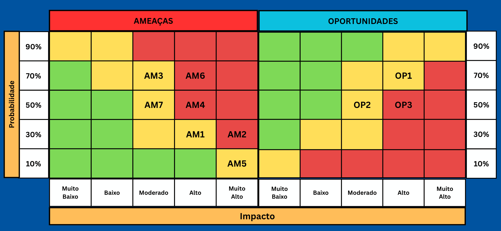<br>
  <sup>Fonte: material produzido pelos autores (2026).</sup>
</div>

### 1.9.5. Análise dos itens mais críticos

A seleção dos itens mais críticos tomou como critério a severidade calculada, e não a leitura isolada da probabilidade ou do impacto. A escolha se deve ao fato de que a severidade é a única medida do registro que expressa os dois fatores simultaneamente em uma escala comum, o que permite comparar itens de naturezas muito distintas, como uma ameaça provável de consequência moderada e outra improvável de consequência severa, sob o mesmo parâmetro. Ordenar por probabilidade privilegiaria eventos frequentes ainda que inofensivos, enquanto ordenar por impacto destacaria cenários graves porém remotos, e nenhum dos dois recortes indicaria corretamente onde a equipe deve concentrar esforço.

O uso da severidade também torna a priorização verificável, uma vez que a regra de cálculo é explícita e qualquer leitor pode reproduzir o resultado a partir dos valores declarados para cada item, o que afasta a seleção arbitrária dos riscos que o grupo considera mais relevantes. Como a mesma regra se aplica a ameaças e a oportunidades, os dez itens compõem uma ordenação única, na qual uma oportunidade bem posicionada indica prioridade de aproveitamento, e não de correção. A partir desse critério, três itens se destacam dos demais:

| Item | Descrição resumida                                                | Severidade | Criticidade |
| ---- | ----------------------------------------------------------------- | ---------: | ----------- |
| AM6  | Dados insuficientes ou inadequados para validação do agente       |       6,14 | Alta        |
| OP1  | Reutilização e evolução da solução                                |       6,14 | Alta        |
| AM3  | Atraso na liberação de acesso ao ambiente Microsoft pelo parceiro |       4,55 | Moderada    |

A **AM6** ocupa o topo da priorização por combinar a maior probabilidade atribuída entre as ameaças com um impacto que atinge a própria evidência de qualidade do projeto. Como o agente é validado exclusivamente sobre dados sintéticos, o conjunto de validação é o único instrumento capaz de demonstrar que a solução funciona, de modo que sua inadequação não degrada apenas uma métrica isolada, mas retira a sustentação de todas as conclusões apresentadas ao parceiro. Trata se, além disso, de um risco cuja causa está inteiramente sob controle do grupo, o que torna o esforço preventivo especialmente eficaz.

A **OP1** alcança a mesma severidade da AM6, porém com sentido oposto, uma vez que a pontuação elevada em um risco positivo indica prioridade de aproveitamento, e não de correção. Sua posição se justifica porque o desacoplamento do núcleo do agente responde diretamente a uma premissa registrada pelo parceiro, segundo a qual a plataforma de gestão de portfólio pode ser substituída no futuro, e porque se trata de uma decisão de arquitetura tomada logo no início do desenvolvimento, cujo custo cresce de forma significativa caso o grupo opte por adiá-la.

A **AM3** completa a priorização por ser a ameaça de maior probabilidade cuja causa está fora do alcance do grupo, já que a liberação de acesso depende de aprovação das áreas de TI e de compliance do Metrô. Ainda que seu impacto seja moderado, por não comprometer a arquitetura da solução, a mitigação só produz efeito se iniciada com antecedência, o que a coloca entre os itens que exigem ação imediata mesmo sem figurar na faixa de criticidade mais elevada.

Observa-se que os dois itens de maior severidade decorrem de decisões internas do grupo, enquanto o terceiro depende de terceiros, o que orienta tratamentos distintos: nos dois primeiros, a prioridade recai sobre a disciplina de execução da equipe, e, no terceiro, sobre a antecipação da solicitação e a preparação de um caminho alternativo.

---

# 2. Especificação de Requisitos de Software (Sprint 1)

## 2.1 Business Drivers

### Contexto da aplicação

Conforme detalhado na seção 1.1, a gestão do portfólio do Metrô depende hoje de ações manuais para a obtenção de status, a consolidação de documentos e o acompanhamento de pendências. Do ponto de vista computacional, a aplicação de Processamento de Linguagem Natural transforma esse cenário ao substituir a navegação manual por listas e documentos por uma interação direta em linguagem natural, na qual o usuário formula sua solicitação por texto ou por voz e recebe uma resposta já estruturada, rastreável até sua fonte original e adequada ao seu nível de permissão.

Essa transformação depende de duas capacidades transversais, exigidas por ambos os fluxos descritos a seguir: um canal de entrada que processe texto e áudio de forma equivalente, exibindo a transcrição para conferência quando a entrada ocorrer por voz e um mecanismo de classificação capaz de reconhecer toda solicitação dentro de um catálogo de intenções definido com o parceiro, recusando pedidos fora do escopo do portfólio antes mesmo de consultar as fontes de dados.

### Fluxo de negócio 1: Consulta e análise comparativa de projetos

- **Situação atual (AS-IS):** conforme mapeado no fluxo de negócio (seção 1.6), a consulta e a comparação entre projetos hoje dependem de navegação manual pelas listas do SharePoint e de consolidação visual dos dados, processo sujeito a erros de interpretação e que se torna mais custoso quando envolve cruzar informações de portfólio com indicadores estratégicos.

- **Situação proposta (TO-BE):** o usuário formula sua solicitação diretamente em linguagem natural, como por exemplo: "qual o status do projeto X?" ou "compare os projetos X e Y em relação a prazo e riscos", e o sistema retorna os indicadores solicitados já filtrados conforme seu nível de permissão, acompanhados da fonte e da data de apuração de cada dado. Quando a solicitação for ambígua, o sistema solicita esclarecimento apenas sobre o dado faltante, preservando o que já foi informado.

- **Indicadores computacionais:**
  - **Qualidade da classificação de intenção:** F1-macro entre as dez classes, com valor-alvo mínimo de 0,85, acompanhado de cobertura mínima de 90% sobre as intenções conhecidas e aceitação indevida máxima de 15% para `fora_do_catalogo`, conforme o RNF03.
  - **Taxa de acerto na extração de entidades:** número de entidades corretamente extraídas dividido pelo total de entidades presentes no conjunto de teste, para a extração de nome do projeto, período de referência e indicador solicitado. O valor-alvo é de pelo menos 85%; essa métrica pertence à extração e não substitui o F1-macro definido para a classificação no RNF03.
  - **Taxa de correspondência entre entidade e registro:** número de consultas em que a entidade extraída foi associada ao registro correto dividido pelo total de consultas do conjunto de teste. O valor-alvo é de pelo menos 90%, por se tratar de uma correspondência determinística executada após a extração.

### Fluxo de negócio 2: Apoio proativo ao preenchimento e acompanhamento de pendências

- **Situação atual (AS-IS):** conforme mapeado no fluxo de negócio (seção 1.6), o acompanhamento de pendências depende hoje da cobrança manual do PMO junto a cada responsável antes do prazo mensal, sem qualquer apoio automatizado ao preenchimento de documentos como termo de abertura, cronograma e mapa de benefícios.

- **Situação proposta (TO-BE):** o sistema sugere textos para os campos pendentes a partir da interação com o usuário, mantendo o controle humano sobre o que é efetivamente registrado, e notifica proativamente o PMO sobre marcos, riscos e pendências conforme filtros configurados, sem repetir alertas já enviados.

- **Indicadores computacionais:**
  - **Taxa de acerto na extração de entidades:** número de entidades corretamente extraídas da fala ou do texto dividido pelo total de entidades presentes nas interações do conjunto de teste, para a extração do campo e do conteúdo sugerido. O valor-alvo é de pelo menos 85%; essa métrica é avaliada separadamente da classificação do RNF03.
  - **Precisão na detecção de alertas:** número de marcos, riscos e pendências corretamente identificados como elegíveis dividido pelo total de alertas gerados. O valor-alvo é de pelo menos 90%, por se tratar de uma verificação baseada em regras de prazo e status já estruturados; os filtros que comporão o conjunto de teste serão definidos na Sprint 3.
  - **Taxa de erro de palavras (Word Error Rate — WER):** soma de substituições, inserções e exclusões dividida pelo total de palavras do áudio de referência. A métrica adotada pelo RNF06 é WER de no máximo 15%; ela não é tratada como complemento exato de uma taxa de palavras corretas, pois inclui inserções e pode ultrapassar 100%.

---

## 2.2 Requisitos Funcionais

### Visão geral dos requisitos funcionais

| ID e título | User story | Critério de aceitação | Prioridade |
|---|---|---|---|
| RF01: Receber solicitações por áudio e texto e responder em texto | Como usuário do portfólio, quero enviar minhas solicitações por áudio ou texto e receber a resposta em formato textual, para consultar o portfólio de forma flexível conforme o contexto de uso. | Ao receber uma solicitação em áudio, o sistema deve convertê-la em texto e apresentar a transcrição ao usuário antes do processamento. Ao receber uma solicitação em texto, deve processá-la diretamente. Independentemente do formato da solicitação, a resposta do agente deve ser apresentada em texto na interface. | Alta |
| RF02: Consultar dados de projetos | Como PMO, quero consultar dados de um projeto, para obter informações sobre seu status e acompanhamento sem precisar consultar manualmente os documentos do portfólio. | Ao receber uma solicitação, o sistema deve identificar a que projeto e a que dado ela se refere, consultar as fontes disponíveis e retornar os dados solicitados. Quando a solicitação não permitir identificar o projeto ou o dado, o sistema deve solicitar o dado faltante antes de consultar as fontes. Quando a solicitação não corresponder a nenhuma consulta prevista sobre o portfólio, deve informar a limitação ao usuário sem consultar as fontes. | Alta |
| RF03: Apresentar a fonte da informação | Como diretor, quero saber de qual documento e de qual data veio cada resposta, para confiar na informação antes de tomar uma decisão. | Ao apresentar qualquer dado de negócio, o sistema deve exibir o documento de origem, a referência que permite localizá-lo no repositório e a data da sua última atualização, listando todas as fontes quando a resposta combinar mais de uma. | Alta |
| RF04: Sugerir o preenchimento de documentos | Como líder de projeto, quero receber sugestões de texto para os campos pendentes dos meus documentos, para preencher o portfólio mais rápido mantendo o controle sobre o que é efetivamente gravado. | Ao solicitar apoio no preenchimento de um documento, o sistema deve apresentar no chat uma sugestão de texto para cada campo pendente, permitindo a cópia individual das sugestões e sem alterar o documento de origem. | Média |
| RF05: Notificar proativamente o usuário de pendências | Como usuário do portfólio, quero ser notificado quando tiver pendências relacionadas aos projetos que acompanho, para tomar as providências necessárias dentro do prazo. | Ao identificar uma nova pendência relacionada a um projeto acompanhado pelo usuário, o sistema deve notificá-lo automaticamente, informando o projeto e a pendência, sem exigir uma solicitação prévia do usuário. | Média |
| RF06: Atualizar o cadastro de projetos a partir de instruções do usuário | Como líder de projeto, quero atualizar os dados de um projeto ditando ou escrevendo a alteração no chat, para manter o cadastro em dia sem abrir as planilhas e os documentos do portfólio. | Ao receber uma instrução de atualização, o sistema deve identificar o projeto e os campos afetados, apresentar ao usuário os valores que serão gravados e efetivar a alteração apenas após confirmação explícita, registrando o autor e a data da alteração. | Baixa |

### 2.2.1. Modelagem estática: classes e atributos do domínio

 A modelagem estática representa as entidades do domínio de gestão de portfólio do Metrô de São Paulo sobre as quais o agente atua. O modelo parte do Portfólio, que agrupa os projetos de um exercício, e desdobra cada projeto em três eixos: os artefatos que o documentam, as pendências que dele se originam e os usuários que o acompanham.

 O quarto eixo é a hierarquia de usuários. As três personas que aparecem nas histórias da seção anterior, o diretor do RF03, o PMO do RF02 e o líder de projeto do RF04 e do RF06, correspondem a três especializações da classe Usuário. Essa correspondência de um para um entre as personas das histórias e as classes do modelo é o que amarra a modelagem estática aos requisitos funcionais.

<div align="center">
  <sub>FIGURA 2.1: modelagem estática (classes e atributos do domínio)</sub><br>
  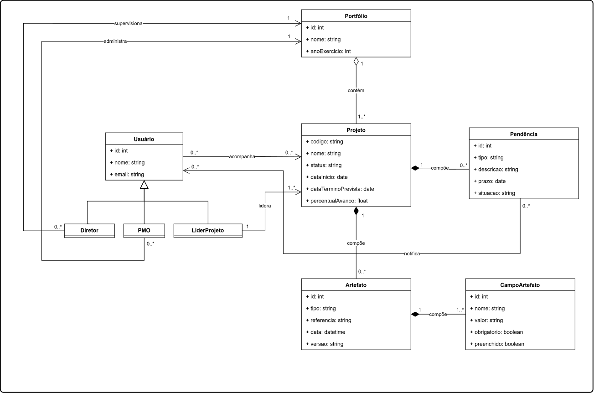<br>
  <sup>Fonte: material produzido pelos autores (2026).</sup>
</div>

**Descrição das classes:**

| Classe | Responsabilidade | RFs atendidos |
|---|---|---|
| Portfólio | Agrupa os projetos administrados pelo PMO Corporativo em um determinado exercício, delimitando tanto o conjunto percorrido na verificação periódica de pendências quanto o alcance de acesso dos perfis de âmbito consolidado | RF02, RF05 |
| Projeto | Representa o empreendimento acompanhado pelo PMO, concentrando os dados de identificação, situação e avanço consultados pelo agente | RF02, RF03, RF04, RF05, RF06 |
| Usuário | Superclasse que reúne os atributos comuns a todos os perfis e as relações que independem do papel exercido, como o acompanhamento de projetos e o recebimento de notificações | RF01, RF05 |
| Diretor | Especialização de Usuário com alcance de supervisão sobre o portfólio consolidado, perfil da história do RF03 | RF03 |
| PMO | Especialização de Usuário que administra o portfólio, com alcance sobre todos os projetos, perfil da história do RF02 | RF02 |
| LiderProjeto | Especialização de Usuário responsável por um subconjunto de projetos, único perfil com relação de responsabilidade formal e, por consequência, com permissão de alteração | RF04, RF06 |
| Pendência | Representa um item em aberto originado por um projeto, com prazo e situação, que fundamenta a notificação proativa | RF05 |
| Artefato | Representa o documento que integra a documentação do projeto, cujos metadados sustentam a indicação de fonte das respostas | RF03, RF04, RF05 |
| CampoArtefato | Representa um campo individual de um artefato, com o valor registrado e as marcações que identificam se ele está pendente de preenchimento | RF04, RF05 |

**Atributos por classe:**

| Classe | Atributo | Tipo | Finalidade no domínio |
|---|---|---|---|
| Portfólio | `id` | int | Identificador único do portfólio |
| Portfólio | `nome` | string | Denominação do portfólio |
| Portfólio | `anoExercicio` | int | Exercício ao qual o conjunto de projetos se refere |
| Projeto | `codigo` | string | Código institucional que identifica o empreendimento |
| Projeto | `nome` | string | Denominação do empreendimento |
| Projeto | `status` | string | Situação corrente do projeto, consultada no RF03 |
| Projeto | `dataInicio` | date | Data de início da execução |
| Projeto | `dataTerminoPrevista` | date | Data prevista de conclusão, base para a apuração de prazos |
| Projeto | `percentualAvanco` | float | Grau de execução física do projeto |
| Usuário | `id` | int | Identificador único do usuário |
| Usuário | `nome` | string | Nome do profissional |
| Usuário | `email` | string | Endereço corporativo utilizado no envio das notificações |
| Pendência | `id` | int | Identificador único da pendência |
| Pendência | `tipo` | string | Natureza da pendência, como prazo, documento ou aprovação |
| Pendência | `descricao` | string | Detalhamento do item em aberto |
| Pendência | `prazo` | date | Data limite para tratamento, base da notificação do RF05 |
| Pendência | `situacao` | string | Estado corrente da pendência |
| Artefato | `id` | int | Identificador único do artefato |
| Artefato | `tipo` | string | Natureza do documento, como ata, relatório ou contrato |
| Artefato | `referencia` | string | Localizador que permite recuperar o documento no repositório em que ele estiver hospedado, exibido como fonte da informação no RF03 |
| Artefato | `data` | datetime | Data da última atualização do documento, exibida junto à fonte no RF03 |
| Artefato | `versao` | string | Versão vigente do documento |
| CampoArtefato | `id` | int | Identificador único do campo |
| CampoArtefato | `nome` | string | Rótulo do campo dentro do artefato |
| CampoArtefato | `valor` | string | Conteúdo atualmente registrado no campo |
| CampoArtefato | `obrigatorio` | boolean | Indica se o preenchimento do campo é exigido |
| CampoArtefato | `preenchido` | boolean | Indica se o campo já possui conteúdo |

 A combinação dos atributos `obrigatorio` e `preenchido` da classe CampoArtefato é o que permite determinar quais campos de um artefato estão pendentes, insumo direto da sugestão de preenchimento prevista no RF04. Da mesma forma, os atributos `referencia` e `data` da classe Artefato são os que sustentam a exigência do RF03 de apresentar a origem e a data de cada informação devolvida pelo agente. Os dois recebem esses nomes para corresponder aos parâmetros homônimos que trafegam nas mensagens do cenário 1, de modo que o dado armazenado e o dado exibido sejam identificáveis como o mesmo ao longo das duas modelagens.

 As três especializações de Usuário não declaram atributos próprios. A diferença entre elas não é de dado armazenado, e sim de alcance de acesso, que é uma característica relacional e por isso está expressa nas associações descritas a seguir.

**Relacionamentos:**

| Origem | Relacionamento | Destino | Cardinalidade | Tipo |
|---|---|---|---|---|
| Portfólio | contém | Projeto | 1 para 1..* | Agregação |
| Projeto | compõe | Artefato | 1 para 0..* | Composição |
| Artefato | compõe | CampoArtefato | 1 para 1..* | Composição |
| Projeto | origina | Pendência | 1 para 0..* | Composição |
| Usuário | acompanha | Projeto | 0..* para 0..* | Associação |
| Pendência | notifica | Usuário | 0..* para 0..* | Associação |
| Diretor | supervisiona | Portfólio | 0..* para 1 | Associação |
| PMO | administra | Portfólio | 0..* para 1 | Associação |
| LiderProjeto | lidera | Projeto | 1 para 1..* | Associação |
| Diretor, PMO e LiderProjeto | especializa | Usuário | Não se aplica | Generalização |

 A distinção entre agregação e composição é intencional. O Portfólio agrega Projetos porque um projeto mantém identidade própria e pode ser reagrupado em outro exercício sem deixar de existir. Já o Artefato compõe o Projeto, o CampoArtefato compõe o Artefato e a Pendência é composta pelo Projeto, porque nenhum dos três faz sentido isoladamente: excluído o projeto, seus artefatos perdem o objeto que documentam e suas pendências perdem o objeto a que se referem.

 Os papéis do usuário são modelados por herança e não por um atributo de tipo. A razão é que cada perfil possui alcance de acesso distinto, e alcance de acesso é uma relação, não uma propriedade. É por isso que a distinção entre os três aparece nas associações e não em atributos: `Diretor` e `PMO` se ligam ao `Portfólio`, o que expressa alcance sobre o conjunto consolidado, enquanto `LiderProjeto` se liga diretamente a `Projeto`, o que restringe seu alcance aos empreendimentos sob sua responsabilidade. A granularidade da associação é a granularidade do acesso.

 A cardinalidade de `lidera`, de 1 para 1..*, reforça essa leitura. O `1` do lado do líder estabelece que cada projeto possui um único responsável, e é essa unicidade que delimita o conjunto ao qual o perfil tem acesso privilegiado e permissão de alteração, prevista no RF06.

 A associação `acompanha`, com cardinalidade de muitos para muitos entre Usuário e Projeto, é o que viabiliza a personalização da notificação prevista no RF05. Ela é deliberadamente distinta de `lidera`: acompanhar exprime interesse e define quem recebe notificação, ao passo que liderar exprime responsabilidade formal e define quem pode alterar. Um líder normalmente acompanha os projetos que lidera, mas as duas relações respondem a perguntas diferentes e por isso coexistem no modelo.

 A modelagem declara apenas classes e atributos, sem operações, por representar a estrutura de dados do domínio de portfólio. O comportamento do agente está representado na modelagem dinâmica desta seção e nos componentes da solução técnica descritos na seção 2.4.

### 2.2.2. Modelagem dinâmica: cenários e diagramas de sequência

 A modelagem dinâmica descreve como as classes declaradas na modelagem estática são percorridas durante a execução das solicitações previstas nos requisitos funcionais. Foram definidos três cenários. Os dois primeiros são iniciados pelo usuário em linguagem natural e compartilham a mesma cadeia de tratamento da entrada, enquanto o terceiro é iniciado pelo próprio sistema, sem interação conversacional.

| Cenário | Descrição | Iniciador | RFs cobertos |
|---|---|---|---|
| Cenário 1 | Consultar informações do projeto | Usuário | RF01, RF02, RF03 |
| Cenário 2 | Sugerir preenchimento de documento | Usuário | RF04 |
| Cenário 3 | Notificar pendências | Agendador (sistema) | RF05 |

 Os três cenários representam o fluxo principal de cada requisito, sem o tratamento de exceções, que fica previsto para a sprint seguinte. Os fluxos de exceção de dois desses cenários foram modelados na seção 2.2.3, como diagramas de sequência dos casos críticos. O RF06, de prioridade baixa e viabilidade ainda em avaliação, não recebeu cenário nesta sprint, conforme registrado na seção 2.2.4.

#### Linhas de vida adotadas

 Os três diagramas utilizam um conjunto comum de linhas de vida, de modo que a leitura de um cenário se aproveite do vocabulário do anterior. A tabela a seguir relaciona cada linha de vida ao seu papel e à sua correspondência na modelagem estática.

| Linha de vida | Papel nos cenários | Correspondência no modelo estático |
|---|---|---|
| Usuário | Ator que inicia a interação nos cenários 1 e 2 e recebe a notificação no cenário 3 | Classe `Usuário` e suas especializações |
| `: InterfaceDeChat` | Recebe solicitações por texto ou áudio e apresenta as respostas em formato textual | Componente de interface (seção 2.4) |
| `: ServicoDeVoz` | Converte áudio em texto na entrada (exclusivo do cenário 1) | Componente de serviços (seção 2.4) |
| `: PipelinePLN` | Conduz o tratamento da solicitação, extrai as entidades do texto e aciona os demais componentes | Componente de lógica de negócio (seção 2.4) |
| `: Intencao` | Detém o catálogo de intenções e classifica o texto contra ele, devolvendo a intenção reconhecida e os parâmetros que ela exige | Componente de lógica de negócio (seção 2.4) |
| `: Agente` | Orquestra a execução da intenção, consulta as fontes e compõe a resposta | Componente de lógica de negócio (seção 2.4) |
| `: FonteDeDados` | Encapsula o acesso às entidades persistidas do domínio | `Portfólio`, `Projeto`, `Artefato`, `CampoArtefato`, `Pendência`, `Usuário` |
| `: ServicoDeNotificacao` | Entrega a notificação ao usuário pelo canal corporativo (exclusivo do cenário 3) | Componente de serviços (seção 2.4) |
| `: Agendador` | Dispara a verificação periódica de pendências (exclusivo do cenário 3) | Componente de lógica de negócio (seção 2.4) |

 As linhas de vida de componente adotam a sintaxe UML de instância anônima, no formato `: Classe`, enquanto o Usuário é identificado pelo nome do papel, por ser um ator e não uma instância de componente.

**Nota:** apenas a linha de vida Usuário e a linha de vida `: FonteDeDados` possuem contrapartida direta na modelagem estática. As demais representam componentes da solução técnica, e não entidades do domínio. Isso vale inclusive para o `: Intencao`: intenção é conceito da camada de processamento de linguagem natural, que existiria de forma diferente se a interface não fosse conversacional, ao contrário de Projeto ou Artefato, que existem na gestão de portfólio independentemente da solução adotada. A separação entre os dois planos é deliberada e está detalhada na seção 2.4.

#### Convenções de notação adotadas

 Os três diagramas empregam três tipos de mensagem, distinguidos graficamente e aplicados de forma uniforme. A tabela a seguir registra a convenção, necessária para a leitura correta dos fluxos apresentados adiante.

| Tipo de mensagem | Traço | Ponta da seta | Rótulo | Quando é usada |
|---|---|---|---|---|
| Síncrona | Linha contínua | Cheia | Assinatura com parênteses | Chamada em que o remetente aguarda a conclusão, como `buscarDados(projeto, idUsuario)` |
| Assíncrona | Linha contínua | Vazada | Assinatura com parênteses | Envio em que o remetente não aguarda retorno, como `executarIntencao(intencao, entidades, idUsuario)` e a entrega da notificação no cenário 3 |
| Retorno | Linha tracejada | Vazada | Dados devolvidos, sem parênteses | Resposta a uma chamada anterior, como `camposPendentes, contextoDoProjeto` |

 A distinção importa para a leitura das mensagens dirigidas ao ator. Nos cenários 1 e 2, o que chega ao Usuário é sempre um retorno da solicitação que ele mesmo iniciou, representado por linha tracejada com os dados devolvidos. No cenário 3, em que o Usuário nunca formula uma solicitação, a notificação é um envio assíncrono genuíno e por isso aparece como linha contínua com ponta vazada.

 A passagem do `: PipelinePLN` ao `: Agente` é assíncrona nos cenários 1 e 2 porque o pipeline entrega a intenção reconhecida e não permanece bloqueado à espera do resultado. Quem devolve a resposta ao usuário é o `: Agente`, por meio da `: InterfaceDeChat`, e não o pipeline que originou a chamada. Já as consultas à `: FonteDeDados` são síncronas, porque o `: Agente` depende do dado retornado para compor a resposta.

#### Cenário 1: consultar informações do projeto

&emsp; O cenário representa o fluxo mais frequente do agente, no qual o usuário formula uma pergunta sobre um projeto e recebe a resposta acompanhada da indicação de origem. É o cenário de maior alcance, por percorrer a cadeia completa de consulta, do recebimento da solicitação em linguagem natural (RF01), passando pela consulta aos dados do projeto (RF02), até a devolução da resposta fundamentada com a indicação da fonte (RF03). O diagrama apresenta somente o fluxo principal; a recusa de pedidos fora do catálogo de intenções e o ciclo de esclarecimento diante de parâmetros faltantes, ambos previstos pelo RF02, não estão representados neste cenário. A recusa de pedidos fora do catálogo é modelada no caso crítico 1 da seção 2.2.3; o ciclo de esclarecimento diante de parâmetros faltantes não recebeu diagrama próprio.

<div align="center">
  <sub>FIGURA 2.2: diagrama de sequência do cenário 1 (consultar informações do projeto)</sub><br>
  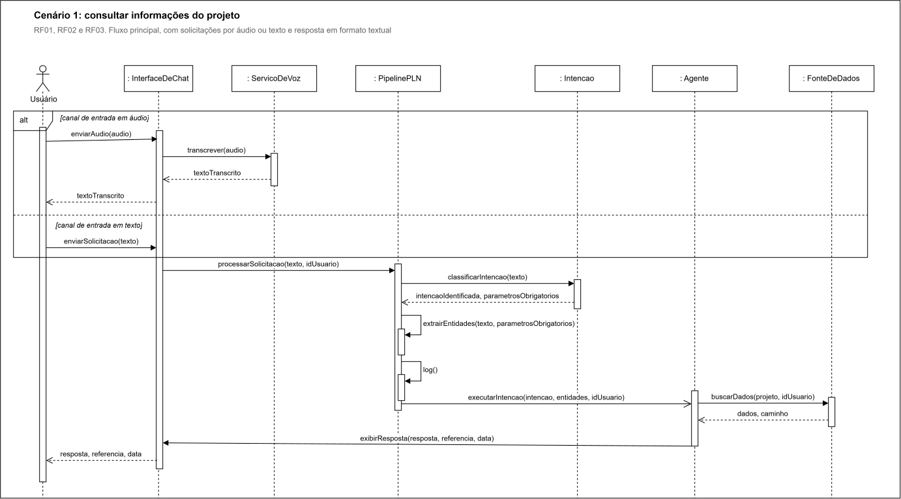<br>
  <sup>Fonte: material produzido pelos autores (2026).</sup>
</div>

**Fluxo do cenário:**

| # | Mensagem | Tipo | Origem | Destino | Requisito |
|---|---|---|---|---|---|
| 1 | `enviarAudio(audio)` | Síncrona | Usuário | `: InterfaceDeChat` | RF01 |
| 2 | `transcrever(audio)` | Síncrona | `: InterfaceDeChat` | `: ServicoDeVoz` | RF01 |
| 3 | `textoTranscrito` | Retorno | `: ServicoDeVoz` | `: InterfaceDeChat` | RF01 |
| 4 | `textoTranscrito` | Retorno | `: InterfaceDeChat` | Usuário | RF01 |
| 5 | `enviarSolicitacao(texto)` | Síncrona | Usuário | `: InterfaceDeChat` | RF01 |
| 6 | `processarSolicitacao(texto, idUsuario)` | Síncrona | `: InterfaceDeChat` | `: PipelinePLN` | RF02 |
| 7 | `classificarIntencao(texto)` | Síncrona | `: PipelinePLN` | `: Intencao` | RF02 |
| 8 | `intencaoIdentificada, parametrosObrigatorios` | Retorno | `: Intencao` | `: PipelinePLN` | RF02 |
| 9 | `extrairEntidades(texto, parametrosObrigatorios)` | Síncrona | `: PipelinePLN` | `: PipelinePLN` | RF02 |
| 10 | `log()` | Síncrona | `: PipelinePLN` | `: PipelinePLN` | Rastreabilidade |
| 11 | `executarIntencao(intencao, entidades, idUsuario)` | Assíncrona | `: PipelinePLN` | `: Agente` | RF02 |
| 12 | `buscarDados(projeto, idUsuario)` | Síncrona | `: Agente` | `: FonteDeDados` | RF02 |
| 13 | `dados, caminho` | Retorno | `: FonteDeDados` | `: Agente` | RF02, RF03 |
| 14 | `exibirResposta(resposta, referencia, data)` | Síncrona | `: Agente` | `: InterfaceDeChat` | RF03 |
| 15 | `resposta, referencia, data` | Retorno | `: InterfaceDeChat` | Usuário | RF01, RF03 |

**Fragmentos de interação:**

| Fragmento | Condição de guarda | Comportamento | Requisito |
|---|---|---|---|
| `alt` de entrada | `[canal de entrada em áudio]` | Passos 1 a 4: a solicitação chega em áudio, o `: ServicoDeVoz` a transcreve e a transcrição é devolvida ao usuário para conferência | RF01 |
| `alt` de entrada | `[canal de entrada em texto]` | Passo 5: a solicitação já chega em texto e segue direto para o tratamento | RF01 |

&emsp; O fragmento `alt` aplica-se somente à entrada, distinguindo as solicitações recebidas em áudio das recebidas em texto. Após a transcrição do áudio, ambas seguem pelo mesmo fluxo de processamento e resultam em uma resposta textual, independentemente do formato da solicitação original, conforme definido pelo RF01.

 O passo 4 devolve a transcrição ao próprio usuário antes de a solicitação seguir para o tratamento. Esse retorno atende à cláusula de conferência do RF01 e é o que permite ao usuário perceber um erro de transcrição antes de receber uma resposta construída sobre a interpretação errada.

 A classificação da intenção não é uma operação interna do `: PipelinePLN`, e sim uma chamada ao `: Intencao`, que detém o catálogo. A escolha segue o princípio de atribuir a responsabilidade a quem possui a informação necessária para cumpri-la: só quem conhece as intenções catalogadas consegue dizer a qual delas o texto corresponde. O retorno do passo 8 traz duas informações, a intenção reconhecida e os parâmetros que ela exige, e é o segundo deles que orienta a extração de entidades do passo 9.

&emsp; O passo 13 devolve, além dos dados do projeto, o caminho do artefato de origem. Esse retorno conjunto é o que permite ao passo 15 entregar conteúdo, referência e data em uma única exibição textual, atendendo ao RF03 sem uma consulta adicional às fontes.

#### Cenário 2: sugerir preenchimento de documento

 O cenário representa o apoio à documentação do portfólio, no qual o usuário solicita ajuda para preencher um artefato e recebe uma sugestão de texto para cada campo pendente. Reaproveita integralmente a cadeia de tratamento da entrada do cenário 1 (RF01 e RF02) e diverge a partir da execução da intenção, quando o agente passa a operar sobre os campos do artefato em vez dos dados de acompanhamento do projeto.

<div align="center">
  <sub>FIGURA 2.3: diagrama de sequência do cenário 2 (sugerir preenchimento de documento)</sub><br>
  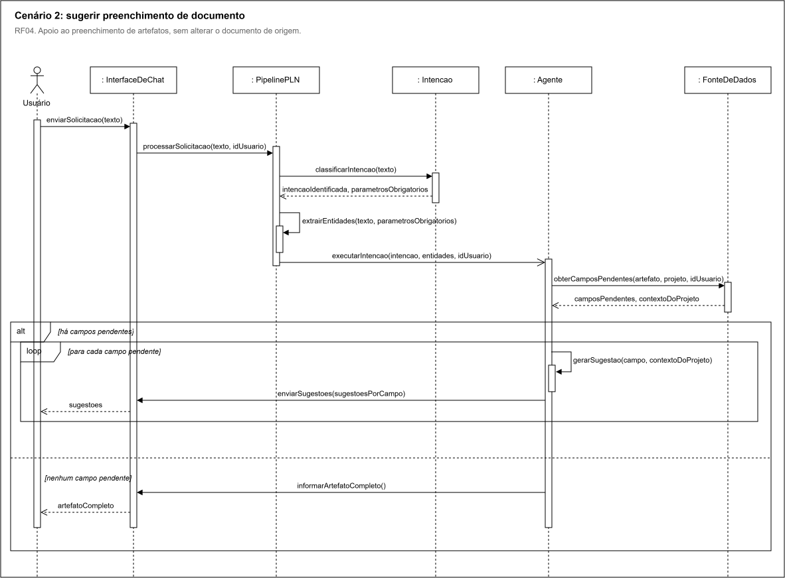<br>
  <sup>Fonte: material produzido pelos autores (2026).</sup>
</div>

**Fluxo do cenário:**

| # | Mensagem | Tipo | Origem | Destino | Requisito |
|---|---|---|---|---|---|
| 1 | `enviarSolicitacao(texto)` | Síncrona | Usuário | `: InterfaceDeChat` | RF04 |
| 2 | `processarSolicitacao(texto, idUsuario)` | Síncrona | `: InterfaceDeChat` | `: PipelinePLN` | RF04 |
| 3 | `classificarIntencao(texto)` | Síncrona | `: PipelinePLN` | `: Intencao` | RF04 |
| 4 | `intencaoIdentificada, parametrosObrigatorios` | Retorno | `: Intencao` | `: PipelinePLN` | RF04 |
| 5 | `extrairEntidades(texto, parametrosObrigatorios)` | Síncrona | `: PipelinePLN` | `: PipelinePLN` | RF04 |
| 6 | `executarIntencao(intencao, entidades, idUsuario)` | Assíncrona | `: PipelinePLN` | `: Agente` | RF04 |
| 7 | `obterCamposPendentes(artefato, projeto, idUsuario)` | Síncrona | `: Agente` | `: FonteDeDados` | RF04 |
| 8 | `camposPendentes, contextoDoProjeto` | Retorno | `: FonteDeDados` | `: Agente` | RF04 |
| 9 | `gerarSugestao(campo, contextoDoProjeto)` | Síncrona | `: Agente` | `: Agente` | RF04 |
| 10 | `enviarSugestoes(sugestoesPorCampo)` | Síncrona | `: Agente` | `: InterfaceDeChat` | RF04 |
| 11 | `sugestoes` | Retorno | `: InterfaceDeChat` | Usuário | RF04 |
| 12 | `informarArtefatoCompleto()` | Síncrona | `: Agente` | `: InterfaceDeChat` | RF04 |
| 13 | `artefatoCompleto` | Retorno | `: InterfaceDeChat` | Usuário | RF04 |

**Fragmentos de interação:**

| Fragmento | Condição de guarda | Comportamento | Requisito |
|---|---|---|---|
| `alt` | `[há campos pendentes]` | Passos 9 a 11: o `: Agente` gera as sugestões e a `: InterfaceDeChat` as devolve ao usuário | RF04 |
| `alt` | `[nenhum campo pendente]` | Passos 12 e 13: o `: Agente` emite `informarArtefatoCompleto()` e a `: InterfaceDeChat` devolve `artefatoCompleto`, sem gerar sugestões | RF04 |
| `loop` | `[para cada campo pendente]` | Passo 9: a sugestão é gerada campo a campo, o que garante a granularidade exigida pelo critério de aceitação do RF04 | RF04 |

 Os passos 1 a 6 reproduzem literalmente a cadeia de tratamento de entrada do cenário 1, incluindo a consulta ao catálogo de intenções e a extração de entidades orientada pelos parâmetros obrigatórios. Essa repetição é intencional e demonstra que o mesmo mecanismo de interpretação serve a requisitos distintos: o que muda é apenas a intenção reconhecida e, por consequência, a ação executada pelo `: Agente` a partir do passo 7.

 O `loop` envolve somente a geração da sugestão, e não o envio. A distinção importa: as sugestões são produzidas campo a campo, atendendo à granularidade exigida pelo RF04, mas entregues em uma única mensagem ao final, o que evita fragmentar a conversa em uma mensagem por campo.

 A mensagem `obterCamposPendentes` do passo 7 é a tradução direta da combinação dos atributos `obrigatorio` e `preenchido` da classe `CampoArtefato`, descrita na modelagem estática. É essa combinação que define o conjunto sobre o qual o fragmento `loop` itera.

 O `: Agente` devolve as sugestões ao usuário pela `: InterfaceDeChat` e não emite qualquer mensagem de escrita à `: FonteDeDados`. Essa ausência é deliberada e representa graficamente a restrição do RF04 de não alterar o documento de origem, mantendo com o usuário a decisão sobre o registro. O RF06 segue a mesma restrição no MVP e apresenta apenas uma proposta de atualização copiável.

#### Cenário 3: notificar pendências

 O cenário representa o único comportamento proativo da solução. Diferentemente dos anteriores, não é iniciado por uma solicitação em linguagem natural, mas por um agendador que dispara a verificação periódica do portfólio. O usuário aparece apenas ao final da sequência, como destinatário da notificação.

<div align="center">
  <sub>FIGURA 2.4: diagrama de sequência do cenário 3 (notificar pendências)</sub><br>
  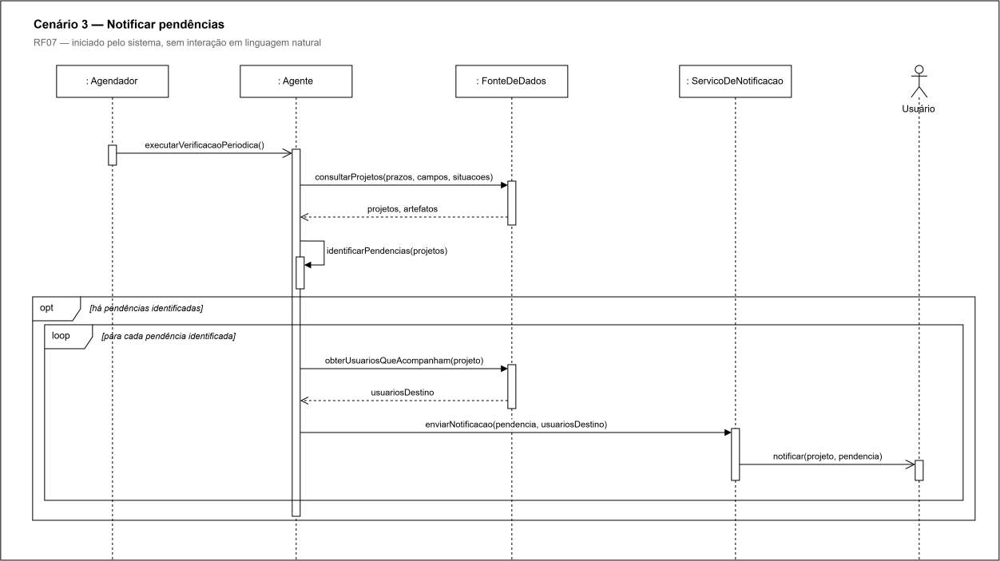<br>
  <sup>Fonte: material produzido pelos autores (2026).</sup>
</div>

**Fluxo do cenário:**

| # | Mensagem | Tipo | Origem | Destino | Requisito |
|---|---|---|---|---|---|
| 1 | `executarVerificacaoPeriodica()` | Assíncrona | `: Agendador` | `: Agente` | RF05 |
| 2 | `consultarProjetos(prazos, campos, situacoes)` | Síncrona | `: Agente` | `: FonteDeDados` | RF05 |
| 3 | `projetos, artefatos` | Retorno | `: FonteDeDados` | `: Agente` | RF05 |
| 4 | `identificarPendencias(projetos)` | Síncrona | `: Agente` | `: Agente` | RF05 |
| 5 | `obterUsuariosQueAcompanham(projeto)` | Síncrona | `: Agente` | `: FonteDeDados` | RF05 |
| 6 | `usuariosDestino` | Retorno | `: FonteDeDados` | `: Agente` | RF05 |
| 7 | `enviarNotificacao(pendencia, usuariosDestino)` | Síncrona | `: Agente` | `: ServicoDeNotificacao` | RF05 |
| 8 | `notificar(projeto, pendencia)` | Assíncrona | `: ServicoDeNotificacao` | Usuário | RF05 |

**Fragmentos de interação:**

| Fragmento | Condição de guarda | Comportamento | Requisito |
|---|---|---|---|
| `opt` | `[há pendências identificadas]` | Quando a verificação não encontra pendências, a sequência se encerra sem notificação, o que evita comunicação desnecessária ao usuário | RF05 |
| `loop` | `[para cada pendência identificada]` | O destinatário é resolvido por pendência, de modo que cada usuário receba apenas o que se refere aos projetos que acompanha | RF05 |

 A mensagem `obterUsuariosQueAcompanham` do passo 5 percorre a associação `acompanha` entre `Usuário` e `Projeto`, de cardinalidade muitos para muitos. É esse relacionamento que dispensa uma configuração paralela de assinatura de notificações, conforme observado na modelagem estática.

 A ausência da `: InterfaceDeChat` e do `: PipelinePLN` entre as linhas de vida é o traço que distingue este cenário dos demais. Ela expressa graficamente o critério de aceitação do RF05, segundo o qual a notificação ocorre sem exigir uma solicitação prévia do usuário.

 É também o único cenário em que uma mensagem assíncrona chega ao ator. O disparo do `: Agendador` e a entrega pelo `: ServicoDeNotificacao` não bloqueiam o remetente à espera de resposta, ao contrário das consultas à `: FonteDeDados`, que são síncronas porque o `: Agente` depende do resultado para prosseguir. A notação evita a leitura equivocada de que a notificação seria o retorno de alguma solicitação do usuário, que neste cenário não existe.

### 2.2.3. Casos críticos: diagramas de sequência dos fluxos de exceção

 Um caso crítico é o cenário cuja falha compromete o objetivo da solução, seja porque o usuário deixa de obter a informação de que precisa, seja porque passa a receber uma informação em que não pode confiar. O critério de seleção é o impacto, e não a frequência: uma situação rara pode ser crítica quando seu efeito é grave, e uma situação frequente pode não ser crítica quando o usuário a corrige sem prejuízo.

 Por esse critério, os casos críticos da solução são os próprios cenários modelados na seção anterior, que concentram o valor entregue pelo agente. Aqueles diagramas, porém, representam apenas o fluxo principal de cada um. Os dois diagramas apresentados a seguir completam essa modelagem, representando os fluxos de exceção que decidem o comportamento do agente quando o caminho principal não se confirma. Foram elaborados na Sprint 2 e estão posicionados aqui, e não no capítulo de definição técnica, para que cada cenário e sua contrapartida de exceção possam ser lidos em sequência.

 A escolha dos fluxos de exceção seguiu o impacto sobre a confiança do usuário na solução e a correspondência com riscos já mapeados na seção 1.9.

| Caso crítico | Fluxo de exceção representado | Cenário de origem | Requisitos | Risco tratado |
|---|---|---|---|---|
| Caso crítico 1 | A solicitação é compreendida, mas está fora do catálogo de intenções ou exige uma ação vedada ao MVP, e o agente recusa e orienta | Cenário 2 | RF02 | AM2 (baixa acurácia na identificação de intenções) |
| Caso crítico 2 | A fonte está indisponível ou não há evidência suficiente, e o agente informa o limite em vez de responder sem fundamento | Cenário 1 | RF02, RF03 | AM8 (alucinação do modelo de linguagem) |

 Os dois diagramas reutilizam integralmente as linhas de vida e as convenções de notação declaradas na seção 2.2.2, incluindo a distinção entre mensagem síncrona, assíncrona e retorno. Nenhuma linha de vida nova foi introduzida: os fluxos de exceção percorrem os mesmos componentes do fluxo principal, o que é, em si, um resultado do projeto arquitetural, pois demonstra que o tratamento de erro não exige uma estrutura paralela à da operação normal.

 Três termos aparecem nos diagramas e não constavam dos cenários anteriores. `confianca` é o grau de certeza devolvido pelo componente que produziu o resultado, no caso a classificação da intenção. `limiarScore` é a pontuação mínima abaixo da qual uma evidência não é aceita como fundamento de resposta. `backoff` é o intervalo de espera aplicado entre duas tentativas de acesso a uma fonte que falhou. Os valores desses parâmetros são tratados ao final desta seção.

#### Caso crítico 1: intenção fora do catálogo ou fora do limite de atuação

O caso representa a situação em que o agente compreende exatamente o que foi pedido e, ainda assim, não atende. Isso ocorre por dois motivos distintos, que o diagrama separa em fragmentos alternativos. No primeiro, o texto não corresponde a nenhuma das intenções catalogadas na seção 3.1 e é classificado como `fora_do_catalogo` (INT-10). No segundo, a intenção é reconhecida, mas sua execução exigiria uma ação vedada ao MVP pela delimitação central da seção 3.1, como gravar em um documento oficial ou acessar o portfólio real do Metrô.

<div align="center">
  <sub>FIGURA 2.5: diagrama de sequência do caso crítico 1 (intenção fora do catálogo ou fora do limite de atuação)</sub><br>
  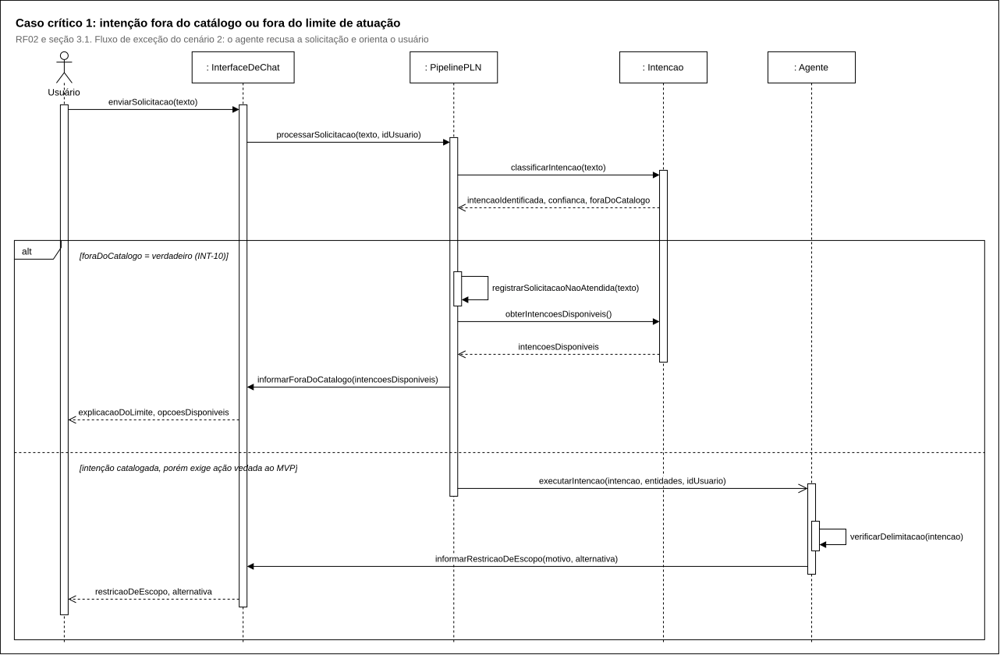<br>
  <sup>Fonte: material produzido pelos autores (2026).</sup>
</div>

**Fluxo do caso crítico:**

| # | Mensagem | Tipo | Origem | Destino | Requisito |
|---|---|---|---|---|---|
| 1 | `enviarSolicitacao(texto)` | Síncrona | Usuário | `: InterfaceDeChat` | RF01 |
| 2 | `processarSolicitacao(texto, idUsuario)` | Síncrona | `: InterfaceDeChat` | `: PipelinePLN` | RF02 |
| 3 | `classificarIntencao(texto)` | Síncrona | `: PipelinePLN` | `: Intencao` | RF02 |
| 4 | `intencaoIdentificada, confianca, foraDoCatalogo` | Retorno | `: Intencao` | `: PipelinePLN` | RF02 |
| 5 | `registrarSolicitacaoNaoAtendida(texto)` | Síncrona | `: PipelinePLN` | `: PipelinePLN` | RNF09 |
| 6 | `obterIntencoesDisponiveis()` | Síncrona | `: PipelinePLN` | `: Intencao` | RF02 |
| 7 | `intencoesDisponiveis` | Retorno | `: Intencao` | `: PipelinePLN` | RF02 |
| 8 | `informarForaDoCatalogo(intencoesDisponiveis)` | Síncrona | `: PipelinePLN` | `: InterfaceDeChat` | RF02 |
| 9 | `explicacaoDoLimite, opcoesDisponiveis` | Retorno | `: InterfaceDeChat` | Usuário | RF02, RNF08 |
| 10 | `executarIntencao(intencao, entidades, idUsuario)` | Assíncrona | `: PipelinePLN` | `: Agente` | RF02 |
| 11 | `verificarDelimitacao(intencao)` | Síncrona | `: Agente` | `: Agente` | RF02 |
| 12 | `informarRestricaoDeEscopo(motivo, alternativa)` | Síncrona | `: Agente` | `: InterfaceDeChat` | RF02 |
| 13 | `restricaoDeEscopo, alternativa` | Retorno | `: InterfaceDeChat` | Usuário | RF02, RNF08 |

**Fragmentos de interação:**

| Fragmento | Condição de guarda | Comportamento | Requisito |
|---|---|---|---|
| `alt` | `[foraDoCatalogo = verdadeiro (INT-10)]` | Passos 5 a 9: a solicitação é registrada, o catálogo é consultado e o usuário recebe a explicação do limite junto com as interações disponíveis | RF02 |
| `alt` | `[intenção catalogada, porém exige ação vedada ao MVP]` | Passos 10 a 13: o `: Agente` verifica a delimitação, interrompe a execução e devolve ao usuário o motivo da restrição e a alternativa disponível | RF02 |

As duas recusas ocorrem em pontos diferentes da arquitetura, e essa é a principal informação que o diagrama transmite. A primeira é resolvida pelo `: Intencao`, que decide apenas com o texto, porque a pergunta é se aquilo corresponde a alguma intenção catalogada. A segunda só pode ser resolvida pelo `: Agente`, no passo 11, porque depende do efeito que a execução produziria, e não da forma como a solicitação foi escrita. Uma mesma frase pode ser catalogada e ainda assim inadmissível, e a distinção não está disponível no momento da classificação.

Nenhum dos dois ramos emite mensagem à `: FonteDeDados`. A ausência é deliberada e expressa graficamente que uma solicitação recusada não produz efeito algum sobre os dados, do mesmo modo como o cenário 2 usou essa ausência para representar que o agente não altera o documento de origem. É a tradução, em notação de sequência, da delimitação central da seção 3.1.

A recusa nunca é silenciosa. Os passos 9 e 13 sempre acompanham a negativa de uma orientação, seja a lista de interações disponíveis, seja a alternativa admitida pelo escopo. Um agente que apenas informa não ser capaz de atender transfere ao usuário o encargo de descobrir o que pode ser pedido, o que contraria o critério de compreensibilidade do RNF08 e, na prática, leva ao abandono da ferramenta.

O registro do passo 5 tem uma função que ultrapassa a auditoria. O conjunto das solicitações classificadas como `fora_do_catalogo` é o insumo mais direto para decidir quais intenções incorporar ao catálogo nas próximas sprints, e sustenta a oportunidade OP2, de expansão do agente para novas funcionalidades de gestão de portfólio, registrada na seção 1.9.

Cabe observar que a existência da intenção INT-10 no catálogo faz com que a situação de "fora do catálogo" seja um resultado previsto da classificação, e não uma exceção não tratada. O agente não falha ao receber um pedido que não sabe atender: ele o classifica como tal e responde de acordo.

#### Caso crítico 2: fonte indisponível ou sem evidência suficiente

O caso representa a situação em que o agente compreende a solicitação e não consegue fundamentá-la. Dois problemas distintos levam a esse resultado e o diagrama os mantém separados: a fonte pode estar inacessível, por falha de comunicação ou tempo limite excedido, ou pode estar acessível e não conter evidência com pontuação suficiente para sustentar uma resposta. O primeiro é transitório e admite nova tentativa; o segundo não se resolve repetindo a consulta.

<div align="center">
  <sub>FIGURA 2.6: diagrama de sequência do caso crítico 2 (fonte indisponível ou sem evidência suficiente)</sub><br>
  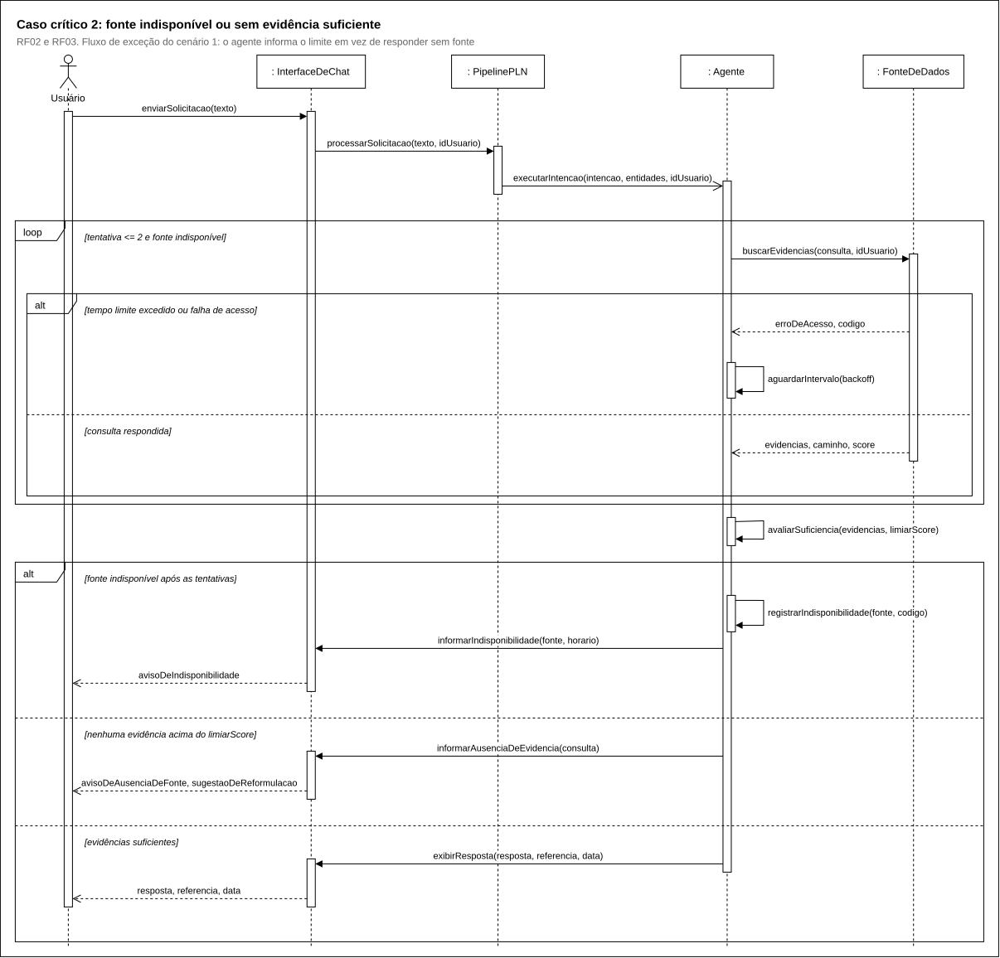<br>
  <sup>Fonte: material produzido pelos autores (2026).</sup>
</div>

**Fluxo do caso crítico:**

| # | Mensagem | Tipo | Origem | Destino | Requisito |
|---|---|---|---|---|---|
| 1 | `enviarSolicitacao(texto)` | Síncrona | Usuário | `: InterfaceDeChat` | RF01 |
| 2 | `processarSolicitacao(texto, idUsuario)` | Síncrona | `: InterfaceDeChat` | `: PipelinePLN` | RF02 |
| 3 | `executarIntencao(intencao, entidades, idUsuario)` | Assíncrona | `: PipelinePLN` | `: Agente` | RF02 |
| 4 | `buscarEvidencias(consulta, idUsuario)` | Síncrona | `: Agente` | `: FonteDeDados` | RF02, RNF02 |
| 5 | `erroDeAcesso, codigo` | Retorno | `: FonteDeDados` | `: Agente` | RF02 |
| 6 | `aguardarIntervalo(backoff)` | Síncrona | `: Agente` | `: Agente` | RNF07 |
| 7 | `evidencias, caminho, score` | Retorno | `: FonteDeDados` | `: Agente` | RF02, RF03 |
| 8 | `avaliarSuficiencia(evidencias, limiarScore)` | Síncrona | `: Agente` | `: Agente` | RF03 |
| 9 | `registrarIndisponibilidade(fonte, codigo)` | Síncrona | `: Agente` | `: Agente` | RNF09 |
| 10 | `informarIndisponibilidade(fonte, horario)` | Síncrona | `: Agente` | `: InterfaceDeChat` | RF03 |
| 11 | `avisoDeIndisponibilidade` | Retorno | `: InterfaceDeChat` | Usuário | RF03, RNF08 |
| 12 | `informarAusenciaDeEvidencia(consulta)` | Síncrona | `: Agente` | `: InterfaceDeChat` | RF03 |
| 13 | `avisoDeAusenciaDeFonte, sugestaoDeReformulacao` | Retorno | `: InterfaceDeChat` | Usuário | RF03, RNF08 |
| 14 | `exibirResposta(resposta, referencia, data)` | Síncrona | `: Agente` | `: InterfaceDeChat` | RF03 |
| 15 | `resposta, referencia, data` | Retorno | `: InterfaceDeChat` | Usuário | RF03 |

**Fragmentos de interação:**

| Fragmento | Condição de guarda | Comportamento | Requisito |
|---|---|---|---|
| `loop` | `[tentativa <= 2 e fonte indisponível]` | Passos 4 a 7: a consulta é repetida até o limite de duas tentativas enquanto a fonte não responder | RNF07 |
| `alt` de acesso | `[tempo limite excedido ou falha de acesso]` | Passos 5 e 6: o erro é devolvido ao `: Agente`, que aguarda o intervalo de espera antes da tentativa seguinte | RNF07 |
| `alt` de acesso | `[consulta respondida]` | Passo 7: a fonte devolve as evidências, o caminho de origem e a pontuação de cada uma | RF02, RF03 |
| `alt` de resultado | `[fonte indisponível após as tentativas]` | Passos 9 a 11: a indisponibilidade é registrada e o usuário é avisado de que a consulta não pôde ser realizada, com o horário da tentativa | RF03 |
| `alt` de resultado | `[nenhuma evidência acima do limiarScore]` | Passos 12 e 13: o usuário é avisado de que não há fonte que sustente a resposta e recebe uma sugestão de reformulação | RF03 |
| `alt` de resultado | `[evidências suficientes]` | Passos 14 e 15: o fluxo principal do cenário 1 se confirma e a resposta é devolvida com a referência e a data | RF03 |

O passo 8 é o que sustenta o caso crítico. Ao avaliar as evidências contra um limiar antes de compor a resposta, o `: Agente` transforma "não sei" em um resultado previsto do fluxo, e não em uma falha. Sem essa avaliação, o componente responderia com o que quer que tenha retornado da consulta, ainda que irrelevante, que é precisamente o comportamento descrito pelo risco AM8, de alucinação do modelo de linguagem. O diagrama torna a garantia verificável: não existe caminho, a partir dos dois primeiros ramos do `alt` de resultado, que alcance a mensagem `exibirResposta` do passo 14.

Os dois avisos ao usuário são distintos porque exigem condutas distintas. O aviso do passo 11 informa que a consulta não pôde ser realizada e é acompanhado do horário, para que o usuário saiba que vale tentar de novo mais tarde. O aviso do passo 13 informa que a consulta foi realizada e nada foi encontrado, situação em que repetir o pedido nas mesmas palavras não muda o resultado, e por isso é acompanhado de uma sugestão de reformulação. Reunir as duas situações sob uma mensagem única faria o usuário insistir quando deveria reformular, ou desistir quando deveria aguardar.

O número de tentativas é limitado a duas, e não é aberto, por causa do RNF01. Cada nova tentativa consome o orçamento de tempo da resposta, e um ciclo de repetições prolongado transformaria uma falha de fonte em uma espera indefinida, que é uma experiência pior do que a informação de indisponibilidade. O intervalo de espera do passo 6 existe para não sobrecarregar uma fonte que já está em dificuldade.

A inclusão do terceiro ramo, com o fluxo bem-sucedido, é intencional, ainda que ele não seja um fluxo de exceção. Sua presença mostra que os dois ramos anteriores são saídas de uma mesma decisão, tomada no passo 8, e não um fluxo paralelo ao do cenário 1. Os passos 14 e 15 reproduzem exatamente os passos finais daquele cenário.

#### Parâmetros fixados pelos diagramas

 Os dois diagramas introduzem parâmetros de decisão cujos valores determinam o comportamento do agente nas situações de exceção. Os valores registrados a seguir são pontos de partida do projeto e serão calibrados com dados reais durante a Sprint 3, sem que a estrutura das interações representadas seja alterada.

| Parâmetro | Valor de partida | Onde é aplicado | Base de calibração |
|---|---|---|---|
| `limiarScore` | A definir a partir do conjunto de consultas de referência | Caso crítico 2, passo 8 | Exigência de indicação de fonte do RF03 e de explicabilidade do RNF11 |
| Número de tentativas de acesso à fonte | 2 | Caso crítico 2, `loop` | Orçamento de tempo de resposta do RNF01 |
| `backoff` | A definir com base no tempo de resposta observado da fonte | Caso crítico 2, passo 6 | Disponibilidade exigida pelo RNF07 |

#### Rastreabilidade dos casos críticos

| Caso crítico | Completa o cenário | RFs | RNFs | Riscos | Seções relacionadas |
|---|---|---|---|---|---|
| Caso crítico 1 | Cenário 2 (seção 2.2.2) | RF02 | RNF08, RNF09 | AM2 | 3.1 (catálogo de intenções e delimitação central) |
| Caso crítico 2 | Cenário 1 (seção 2.2.2) | RF02, RF03 | RNF01, RNF02, RNF07, RNF08, RNF09, RNF11, RNF12 | AM8 | 3.3 (algoritmo de NLP), 3.6 (modelagem dos dados) |

### 2.2.4. Rastreabilidade entre requisitos, cenários e classes

 A rastreabilidade a seguir demonstra que cada requisito funcional está representado em ao menos um cenário e que cada cenário opera sobre classes efetivamente declaradas na modelagem estática. A verificação percorre os três eixos do artefato, ou seja, as histórias de usuário da seção 2.2, os diagramas de sequência e o diagrama de classes.

**Requisitos, cenários e classes:**

| RF | Persona da história | Cenário | Classes envolvidas | Atributos e relacionamentos determinantes | Mensagem que evidencia o atendimento |
|---|---|---|---|---|---|
| RF01: Receber solicitações por áudio e texto e responder em texto | Usuário do portfólio | Cenário 1 | `Usuário` | `id` | `enviarAudio(audio)`, `transcrever(audio)`, retorno `textoTranscrito` e apresentação da resposta em formato textual, independentemente do formato da solicitação |
| RF02: Consultar dados de projetos | PMO | Cenário 1 | `PMO`, `Portfólio`, `Projeto` | `codigo`, `status`, `percentualAvanco`, `dataTerminoPrevista`, relacionamento `administra` | `classificarIntencao(texto)`, `extrairEntidades(texto, parametrosObrigatorios)`, `executarIntencao(intencao, entidades, idUsuario)` e `buscarDados(projeto, idUsuario)` |
| RF03: Apresentar a fonte da informação | Diretor | Cenário 1 | `Diretor`, `Artefato`, `Projeto` | `referencia`, `data`, relacionamentos `compõe` e `supervisiona` | Retorno `dados, caminho`, chamada `exibirResposta(resposta, referencia, data)` e retorno textual `resposta, referencia, data` |
| RF04: Sugerir o preenchimento de documentos | Líder de projeto | Cenário 2 | `LiderProjeto`, `Artefato`, `CampoArtefato`, `Projeto` | `obrigatorio`, `preenchido`, `nome`, `valor`, relacionamentos `compõe` e `lidera` | `obterCamposPendentes(artefato, projeto, idUsuario)`, `gerarSugestao(campo, contextoDoProjeto)` e `enviarSugestoes(sugestoesPorCampo)` |
| RF05: Notificar proativamente o usuário de pendências | Usuário do portfólio | Cenário 3 | `Portfólio`, `Projeto`, `Artefato`, `CampoArtefato`, `Pendência`, `Usuário` | `prazo`, `situacao`, `preenchido`, `email`, relacionamentos `contém`, `origina`, `acompanha` e `notifica` | `consultarProjetos(prazos, campos, situacoes)`, `identificarPendencias(projetos)`, `obterUsuariosQueAcompanham(projeto)` e `enviarNotificacao(pendencia, usuariosDestino)` |
| RF06: Sugerir atualização do cadastro de projetos a partir de instruções do usuário | Líder de projeto | Variação do cenário 2 | `LiderProjeto`, `Projeto` | Relacionamento `lidera`, que delimita os projetos sobre os quais o líder pode receber sugestões | Mesmo fluxo sugestivo do cenário 2, sem escrita nas fontes |

 A coluna de persona evidencia a amarração direta entre as histórias de usuário e a modelagem estática. As três personas que aparecem nas histórias correspondem às três especializações de `Usuário`, de modo que cada requisito escrito na voz de um papel específico tem, no modelo, a classe correspondente entre as classes envolvidas.

**Cobertura das classes pelos cenários:**

| Classe | Cenário 1 | Cenário 2 | Cenário 3 | RFs atendidos |
|---|---|---|---|---|
| `Portfólio` | Sim | Não | Sim | RF02, RF05 |
| `Projeto` | Sim | Sim | Sim | RF02, RF03, RF04, RF05, RF06 |
| `Usuário` | Sim | Sim | Sim | RF01, RF05 |
| `Diretor` | Sim | Não | Não | RF03 |
| `PMO` | Sim | Não | Não | RF02 |
| `LiderProjeto` | Não | Sim | Não | RF04, RF06 |
| `Pendência` | Não | Não | Sim | RF05 |
| `Artefato` | Sim | Sim | Sim | RF03, RF04, RF05 |
| `CampoArtefato` | Não | Sim | Sim | RF04, RF05 |

 A verificação de cobertura confirma a coerência entre as três representações. Cinco dos seis requisitos funcionais aparecem em ao menos um cenário, e todas as nove classes do modelo estático são exercitadas por ao menos um cenário, o que indica que não há classe declarada sem uso previsto.

 A classe `Projeto` figura nos três cenários e concentra o maior número de requisitos, o que a confirma como entidade central do domínio, conforme antecipado na modelagem estática. Nas extremidades, `Pendência` se restringe ao cenário 3, por ser a entidade produzida pela verificação periódica, e `CampoArtefato` só aparece a partir do cenário 2, por ser a granularidade exigida exclusivamente pela sugestão de preenchimento.

 As especializações de `Usuário` distribuem-se conforme o perfil de cada história. `Diretor` e `PMO` aparecem no cenário 1 porque as histórias do RF02 e do RF03 são escritas nas suas vozes, e `LiderProjeto` aparece no cenário 2 pelo mesmo motivo em relação ao RF04. A superclasse `Usuário` figura nos três cenários por concentrar os atributos e as relações que independem de papel.

 As classes `Artefato` e `CampoArtefato` participam de mais de um cenário por cumprirem papéis distintos em cada um. No cenário 1, o `Artefato` fornece os metadados de origem exigidos pelo RF03. No cenário 2, a dupla sustenta a identificação dos campos pendentes exigida pelo RF04. No cenário 3, ambas são percorridas pelo critério `campos` da mensagem `consultarProjetos`, que permite classificar como pendência um artefato com campos obrigatórios ainda não preenchidos.

**Delimitações desta sprint:**

 Duas lacunas são registradas de forma explícita, por decisão do grupo e não por omissão.

O **RF06 não recebeu diagrama de sequência próprio** porque possui prioridade baixa e representa uma variação do apoio ao preenchimento modelado no cenário 2. No MVP, ele apenas identifica os campos mencionados e apresenta uma proposta copiável, sem gravar dados nas fontes. Uma eventual escrita com confirmação explícita pertence à evolução futura registrada na seção 1.7 e exigirá modelagem específica quando sua viabilidade for confirmada.

 Os **cenários representam apenas o fluxo principal**. A cláusula do RF02 que determina informar a limitação ao usuário quando a solicitação não corresponder a nenhuma consulta prevista não está representada graficamente, assim como não estão os tratamentos de falha de transcrição ou de indisponibilidade das fontes. A opção por diagramas de caminho feliz privilegia a legibilidade nesta primeira especificação, e os desvios entram na sprint seguinte.

 Registra-se ainda que a automensagem `log()` do cenário 1 não decorre de nenhum requisito funcional. Ela sustenta a rastreabilidade das interpretações feitas pelo agente, formalizada no RNF04, e produz registros submetidos aos controles de auditabilidade do RNF09.


---

## 2.3 Requisitos Não Funcionais

### Visão geral dos requisitos não funcionais

Os valores-alvo ainda não acordados estão identificados como **a validar com o parceiro**. A validação deverá definir esses valores antes da homologação, sem alterar a métrica nem o procedimento de teste descritos.

| ID e título                                                | História de usuário                                                                                                                                               | Business Driver relacionado                               | Característica de qualidade        | Critério mensurável e verificável                                                                                                                                                                                                                                                           | Forma de validação ou teste                                                                                                                                     |
| ---------------------------------------------------------- | ----------------------------------------------------------------------------------------------------------------------------------------------------------------- | --------------------------------------------------------- | ---------------------------------- | ------------------------------------------------------------------------------------------------------------------------------------------------------------------------------------------------------------------------------------------------------------------------------------------- | --------------------------------------------------------------------------------------------------------------------------------------------------------------- |
| **RNF01 — Desempenho das consultas**                       | Como usuário do agente, quero receber rapidamente as respostas das minhas consultas para obter informações dos projetos sem comprometer minha tomada de decisão.  | Eficiência e agilidade no acesso às informações           | Desempenho                         | Pelo menos 80% das consultas textuais elegíveis devem apresentar resposta completa em até 15 segundos, e 100% devem terminar com resposta ou erro controlado em até 60 segundos, desconsiderando somente indisponibilidades externas comprovadas.                                                                                                            | Executar conjunto representativo de consultas, medir taxa de sucesso e tempos de resposta e verificar simultaneamente o limite principal e o teto da cauda.      |
| **RNF02 — Autenticação dos usuários**                      | Como usuário do agente, quero acessar a solução por uma identidade autenticada para impedir o uso das funcionalidades por pessoas não identificadas.               | Confidencialidade e segurança da informação               | Segurança e autenticidade          | Todas as funcionalidades protegidas devem exigir sessão ou token válido emitido por um provedor SSO. Nos testes, 100% das solicitações sem credencial, com credencial malformada, expirada, com assinatura inválida ou audiência incorreta devem ser rejeitadas com HTTP 401 antes da execução da regra de negócio. O provedor poderá ser Microsoft ou Google e sua escolha não altera o contrato do teste. | Executar cada endpoint protegido com credencial válida e com as cinco condições inválidas, verificando autenticação, resposta 401, interrupção antes da regra de negócio e ausência de credenciais nos registros. |
| **RNF03 — Qualidade da classificação de intenções**        | Como usuário do agente, quero que minhas perguntas sejam interpretadas corretamente para receber respostas coerentes com as informações solicitadas.              | Precisão e confiabilidade das consultas                   | Correção e confiabilidade          | Em conjunto de teste cego e equilibrado, o classificador deve atingir F1-macro mínimo de 0,85 entre as dez intenções, cobertura mínima de 90% sobre as nove intenções conhecidas e taxa máxima de 15% de aceitação indevida dos exemplos `fora_do_catalogo`. A cobertura corresponde à proporção de exemplos conhecidos que não são encaminhados à rejeição pelo limiar de confiança. | Avaliar o modelo e o limiar congelados sobre conjunto rotulado que nunca participou de treinamento, seleção de pré-processamento, calibração ou ajuste.           |
| **RNF04 — Rastreabilidade das consultas**                  | Como responsável pela gestão dos projetos, quero que cada solicitação possa ser relacionada às etapas e informações que produziram sua resposta.                  | Rastreabilidade e transparência                           | Rastreabilidade                    | Cada interação deve possuir identificador único e permitir relacionar o usuário autenticado, a data e hora, o canal, a solicitação, a intenção identificada, as fontes consultadas, a resposta ou resultado, o tempo de processamento, o feedback e eventual erro. No modelo implementado, `conversa.id` e `mensagem.id` identificam a conversa e cada turno, `mensagem.conteudo` registra o texto da solicitação e o da resposta, `mensagem.resultado` registra o desfecho e `mensagem_fonte` relaciona as fontes. | Executar interações de texto e voz, consultar seus registros pelo identificador e verificar a presença e o relacionamento de todos os elementos aplicáveis.       |
| **RNF05 — Interoperabilidade entre aplicações clientes**   | Como usuário, quero acessar o agente a partir de diferentes aplicações para consultar os projetos pelo ponto de acesso mais adequado à minha rotina.              | Interoperabilidade e acessibilidade                       | Flexibilidade e integração         | O núcleo do agente deve expor suas funcionalidades por meio de interfaces padronizadas, permitindo que pelo menos duas aplicações clientes distintas o consumam sem duplicação das regras de negócio e com equivalência de contrato e resultado de negócio.                                                                                              | Acionar as funcionalidades principais pela interface React e por um cliente Python independente e comparar status HTTP, esquema, intenção, fontes, dados estruturados e categorias de erro, sem exigir redação textual idêntica. |
| **RNF06 — Qualidade da transcrição de áudio**              | Como usuário, quero realizar consultas por voz e ter minha fala convertida corretamente em texto para interagir com o agente de maneira natural.                  | Acessibilidade, eficiência e uso de linguagem natural     | Qualidade do reconhecimento de fala | O componente de conversão de áudio em texto deve apresentar WER geral de no máximo 15% em um conjunto de áudios representativo do contexto do projeto.                                                                                                                                      | Testar com áudios do vocabulário de projetos e calcular substituições, exclusões e inserções contra transcrições de referência.                                  |
| **RNF07 — Disponibilidade da solução**                     | Como usuário, quero que o agente permaneça disponível durante uma sessão de trabalho para realizar consultas quando necessário.                                   | Continuidade operacional e eficiência                     | Confiabilidade e disponibilidade   | No ambiente acadêmico, a solução deve apresentar disponibilidade mínima de 99% durante uma janela contínua de quatro horas, desconsiderando manutenções previamente comunicadas. Uma verificação é bem-sucedida quando `GET /health` responde HTTP 200 em até dois segundos, indicando disponibilidade da aplicação e do banco de dados; provedores externos são monitorados separadamente. | Consultar o endpoint de saúde uma vez por minuto durante a sessão de quatro horas e calcular a proporção de verificações bem-sucedidas entre as verificações elegíveis. |
| **RNF08 — Usabilidade das respostas**                      | Como usuário, quero receber respostas claras e organizadas para compreender rapidamente a situação dos projetos, independentemente do meu conhecimento técnico.   | Transparência e apoio à tomada de decisão                 | Usabilidade e compreensibilidade   | Em testes com representantes das personas, pelo menos 80% dos participantes devem compreender a resposta e identificar a informação solicitada sem auxílio externo.                                                                                                                         | Conduzir testes de usabilidade com representantes das personas e validar compreensão.                                                                           |
| **RNF09 — Auditabilidade das interações**                  | Como responsável pela gestão e governança da solução, quero consultar registros das interações realizadas pelo agente para acompanhar seu funcionamento e investigar falhas. | Governança, segurança e transparência | Auditabilidade | Os registros de auditoria devem ser consultáveis no banco ou na camada de serviço apenas por acesso administrativo, permanecer protegidos contra alteração e exclusão e ser mantidos por no mínimo 90 dias, tornando-se elegíveis para expurgo após esse prazo. Somente o feedback pode receber atualização controlada. Senhas, tokens e outros segredos não podem ser armazenados. Se o mecanismo principal de auditoria falhar, a solução deve produzir registro técnico alternativo ou manter o evento em buffer, emitir alerta e tentar persistir novamente, sem necessariamente interromper a solicitação do usuário. | Inspecionar registros e prazo de retenção; testar acesso administrativo e comum, tentativas de alteração e exclusão, atualização de feedback, ausência de segredos e indisponibilidade controlada do mecanismo de auditoria. |
| **RNF10 — Escalabilidade do agente**                       | Como administrador da solução, quero que o agente seja capaz de processar aumentos de volume de consultas e dados sem degradação significativa de desempenho.     | Continuidade operacional e sustentabilidade técnica       | Escalabilidade e performance       | Sob dependências externas controladas, o agente deve suportar aumento de `1x` para `10x` na concorrência, mantendo p95 em até 20 segundos e em no máximo duas vezes o p95 da linha de base. Com dataset `10x`, o pico de memória do treinamento deve ser no máximo `8x` o observado em `1x`, e tanto a memória estabilizada quanto o pico de inferência do processo servido devem ser no máximo `2x` as respectivas linhas de base. | Executar baseline e carga progressiva com as mesmas dependências controladas e medir latência, throughput, erros, memória de treinamento e memória estabilizada e de pico do processo servido. |
| **RNF11 — Explicabilidade das sugestões de preenchimento** | Como responsável por documentos, quero compreender as razões pelas quais o agente sugeriu determinados valores ou conteúdos.                                      | Transparência e confiabilidade dos dados sugeridos        | Explicabilidade e rastreabilidade  | Cada sugestão de preenchimento deve indicar explicitamente uma fonte existente que sustente seu conteúdo e apresentar ao usuário uma justificativa curta e compreensível; pelo menos 85% das sugestões devem atender simultaneamente a essas condições.                                                                                                  | Avaliar sugestões contra fontes de referência conhecidas e verificar a validade da fonte, sua relação com o conteúdo sugerido e a clareza da justificativa.      |
| **RNF12 — Fundamentação das respostas de consulta**        | Como usuário do agente, quero que as afirmações apresentadas nas respostas sejam sustentadas pelas fontes indicadas para não tomar decisões com base em conteúdo inventado ou incompatível com os documentos. | Confiabilidade e apoio à tomada de decisão | Correção factual e fundamentação | Em uma amostra de respostas do RF02, 100% das referências apresentadas devem existir e ser recuperáveis e pelo menos 90% das afirmações factuais atômicas devem ser diretamente sustentadas pelas fontes citadas. Quando não houver evidência suficiente, 100% das respostas devem informar a limitação sem produzir afirmação factual não sustentada. | Decompor as respostas em afirmações factuais, comparar cada uma com as fontes de referência por avaliação independente e testar também consultas sem evidência suficiente. |

### Tabela de rastreabilidade entre requisitos não funcionais e funcionais

| RNF                                            | RF relacionado         | Relação de rastreabilidade                                                                                                |
| ---------------------------------------------- | ---------------------- | ------------------------------------------------------------------------------------------------------------------------- |
| RNF01 — Desempenho das consultas               | RF02                               | Qualifica o tempo de resposta das consultas de dados de projetos, sem alterar o comportamento especificado no requisito.                                                                                       |
| RNF02 — Autenticação dos usuários              | RF01, RF02, RF03, RF04, RF05, RF06 | Assegura que as funcionalidades protegidas somente sejam executadas após a validação da identidade por SSO, sem estabelecer autorização ou diferença de acesso por cargo. |
| RNF03 — Qualidade da classificação de intenções | RF02, RF04, RF06                  | Mede pelo F1-macro, pela cobertura das intenções conhecidas e pela rejeição de `fora_do_catalogo` a classificação executada pelo `: Intencao` nos cenários 1 e 2.                                               |
| RNF04 — Rastreabilidade das consultas          | RF01, RF02, RF03, RF04, RF05, RF06 | Permite correlacionar cada solicitação às etapas, fontes e ao resultado que produziram a resposta, comportamento representado pela automensagem `log()` do cenário 1.                                           |
| RNF05 — Interoperabilidade entre aplicações clientes | RF01, RF02, RF04, RF05       | Assegura equivalência do contrato e do resultado de negócio em qualquer aplicação que consuma o agente. Trata do ponto de acesso, enquanto o RF01 define as modalidades de entrada e estabelece a resposta em formato textual. |
| RNF06 — Qualidade da transcrição de áudio      | RF01                               | Qualifica a conversão de áudio em texto executada pelo `: ServicoDeVoz` no cenário 1, da qual dependem todas as solicitações formuladas por voz.                                                               |
| RNF07 — Disponibilidade da solução             | RF01, RF02, RF03, RF04, RF05, RF06 | Assegura que o agente esteja disponível durante o horário de operação, condição para a execução de qualquer requisito funcional.                                                                               |
| RNF08 — Usabilidade das respostas              | RF02, RF03                         | Mede a clareza e a compreensibilidade da resposta e da indicação de fonte devolvidas ao final do cenário 1.                                                                                                    |
| RNF09 — Auditabilidade das interações          | RF01, RF02, RF03, RF04, RF05 | Protege, retém e restringe a consulta dos registros produzidos pelos fluxos funcionais, permitindo sua inspeção administrativa e a investigação de falhas. Complementa o RNF04 sem repetir a correlação automática das etapas da interação. |
| RNF10 — Escalabilidade do agente               | RF02, RF04                         | Qualifica a capacidade de manter desempenho sob aumento de volume nos dois requisitos que percorrem o portfólio inteiro.                                                                                       |
| RNF11 — Explicabilidade das sugestões          | RF03, RF04                         | Mede a clareza e a rastreabilidade das fontes e justificativas das sugestões de preenchimento, estendendo ao RF04 a exigência de indicação de origem que o RF03 estabelece para as respostas de consulta.      |
| RNF12 — Fundamentação das respostas de consulta | RF02, RF03                        | Mede se as fontes apresentadas existem e sustentam as afirmações factuais da resposta, complementando a presença de referência exigida pelo RF03 e tratando diretamente o risco AM8.                            |

### Relação dos requisitos não funcionais com os Business Drivers

Os requisitos não funcionais foram definidos a partir dos Business Drivers do projeto, considerando as características de qualidade necessárias para que o agente ofereça informações confiáveis, seguras e acessíveis aos usuários do Metrô de São Paulo.

Os requisitos de desempenho (RNF01) e disponibilidade (RNF07) contribuem para a **eficiência e agilidade no acesso às informações**, permitindo que os profissionais obtenham respostas rapidamente sem comprometer a tomada de decisão. A autenticação por SSO (RNF02) e a proteção dos registros preservam a **confidencialidade e segurança da informação**, sem introduzir diferenças de acesso por cargo. A rastreabilidade (RNF04) permite correlacionar a solicitação, o processamento, as fontes e o resultado de cada interação.

A qualidade da classificação de intenções (RNF03) garante a **confiabilidade no acesso e tratamento das informações**, assegurando que solicitações em linguagem natural sejam interpretadas corretamente ou rejeitadas quando a confiança for insuficiente. A auditabilidade das interações (RNF09) complementa a rastreabilidade (RNF04) ao proteger, reter e restringir a consulta dos registros para que possam ser inspecionados administrativamente e usados na investigação de falhas. Essa separação segue a distinção entre trilhas de uma solicitação e controles sobre registros adotada nas referências de observabilidade e segurança (OPENTELEMETRY, 2026; OWASP, 2026; NIST, 2024). A qualidade da transcrição de áudio (RNF06) e a interoperabilidade entre aplicações clientes (RNF05) oferecem **acessibilidade e flexibilidade**. A usabilidade (RNF08), a explicabilidade das sugestões (RNF11) e a fundamentação das respostas de consulta (RNF12) garantem que a solução apoie a **tomada de decisão** de forma clara e baseada nas fontes. A escalabilidade (RNF10) contribui para a **continuidade operacional**, permitindo que o agente processe aumentos de volume sem degradação.

## 2.4 Visão Inicial da Solução Técnica

 A visão técnica apresentada nesta seção traduz, em arquitetura, os fluxos de negócio descritos na seção 2.1 e os requisitos funcionais e não funcionais especificados nas seções 2.2 e 2.3. A solução é representada como um conjunto de componentes conectados, organizados em camadas.

 A seção está ordenada cronologicamente: apresenta primeiro a versão inicial do diagrama, em seguida os ajustes feitos a partir da implementação da API de recebimento de áudio, e por fim a versão atual, que é a que descreve a arquitetura em vigor. A intenção é que a leitura acompanhe a evolução do entendimento da equipe, e não apenas o resultado a que ela chegou.

 A divisão dos componentes de compreensão de linguagem segue o padrão adotado tanto por frameworks open-source de assistentes conversacionais, como o Rasa (RASA, 2024), quanto pela própria plataforma de bots da Microsoft (MICROSOFT, 2024), ecossistema já utilizado pelo parceiro por meio do Copilot Studio. Em ambos os casos, a compreensão da mensagem do usuário é dividida entre um componente de classificação de intenção, responsável por identificar o que o usuário deseja, e um componente de extração de parâmetros, responsável por capturar os dados específicos mencionados na solicitação, como o nome do projeto ou o período de referência.

### Versão inicial do diagrama de componentes

 A primeira versão do diagrama foi produzida antes da implementação, a partir dos requisitos e dos fluxos de negócio. Ela organizava a solução em três camadas — interface humano-computador, lógica de negócio, e dados e serviços — e tratava a entrada por voz como um desvio dentro do próprio fluxo de texto: a Chat UI enviava tudo ao API Gateway, que encaminhava o áudio à Conversão de Áudio em Texto quando a solicitação chegava falada.

<div align="center">
<sub>Imagem 2.4.1 - Diagrama de componentes (UML) — versão inicial, anterior à implementação</sub><br>
  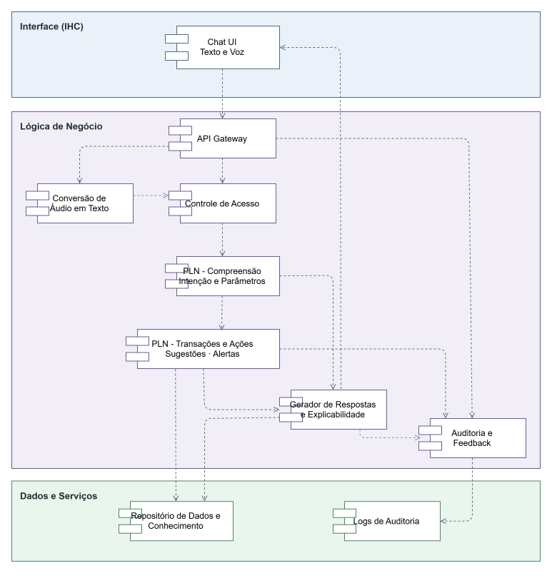<br>
  <sup>Fonte: Material produzido pelos autores, 2026.</sup>
</div>

### Ajustes feitos após a implementação da API de recebimento de áudio

 A construção da API de recebimento mostrou que o desenho anterior descrevia uma arquitetura pretendida, não a construída. O que mudou não foi a estética do diagrama, e sim o entendimento de como o áudio entra no sistema. A tabela abaixo registra os seis ajustes e serve de referência para acompanhar o desenvolvimento do projeto.

| O que mudou | Como estava (Imagem 2.4.1) | Como ficou (Imagem 2.4.2) |
|---|---|---|
| Entrada de áudio | A Chat UI enviava tudo ao API Gateway, que encaminhava o áudio à Conversão de Áudio em Texto | A Chat UI envia o áudio a uma API de Recebimento dedicada, que valida, armazena e devolve um `audio_id` |
| Armazenamento do áudio | Não representado — o áudio parecia trafegar direto entre componentes | Componente próprio na camada de dados, com chave `incoming/{audio_id}` e retenção de sete dias |
| Acoplamento recebimento ↔ transcrição | Chamada direta entre os dois | Nenhuma chamada direta: o vínculo é o identificador e o armazenamento compartilhado |
| Acesso ao armazenamento | Inexistente | Encapsulado pelo SDK boto3, isolando a aplicação da API do provedor |
| Autenticação SSO, rotulada inicialmente como Controle de Acesso | No caminho de todas as solicitações, como se estivesse implementada | Em traço interrompido e fora do caminho de execução, sinalizando implementação pendente |
| Modelo de linguagem | Ausente do diagrama | Agrupamento «Serviços de Terceiros», tornando visível a dependência externa e o risco AM8 |

 Os dois últimos ajustes seguem o mesmo princípio, aplicado em direções opostas: o diagrama deve mostrar aquilo de que a solução depende e não deve mostrar como pronto aquilo que ainda não existe. A autenticação SSO saiu do caminho de execução porque não está implementada; o modelo de linguagem entrou porque, embora a equipe não o construa, o fluxo de geração de respostas depende dele.

### Versão atual do diagrama de componentes

 A versão atual mantém as três camadas originais e acrescenta um agrupamento à parte para os serviços de terceiros, que a solução consome mas não constrói. A separação é deliberada: o critério não é quem desenvolve o componente, e sim de quem a solução depende. Um serviço de terceiros que participa do fluxo de execução é parte da arquitetura, com custo, latência e modo de falha próprios, ainda que a equipe só escreva o contrato de consumo. Omiti-lo esconderia, por exemplo, a origem do risco AM8 (alucinação do modelo de linguagem), registrado na seção 1.9.2.

<div align="center">
<sub>Imagem 2.4.2 - Diagrama de componentes (UML) — versão atual da solução técnica</sub><br>
  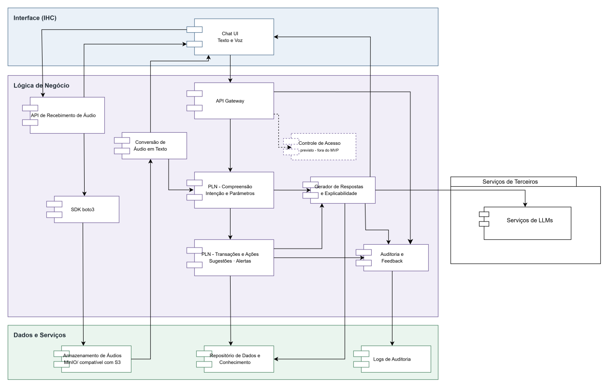<br>
  <sup>Fonte: Material produzido pelos autores, 2026.</sup>
</div>

### Descrição das camadas

| Camada | Componentes | Responsabilidade |
|---|---|---|
| **Interface (IHC)** | Chat UI - Texto e Voz | Recebe a solicitação do usuário nos dois canais previstos pelo RF01 e exibe a resposta estruturada ao final do processamento. Nas entradas por voz, é ela quem envia o arquivo à API de Recebimento de Áudio e quem recebe de volta o identificador da gravação. |
| **Lógica de negócio** | API de Recebimento de Áudio, SDK boto3, Conversão de Áudio em Texto, API Gateway, Autenticação SSO, PLN — Compreensão (Intenção e Parâmetros), PLN — Transações e Ações, Gerador de Respostas e Explicabilidade, Auditoria e Feedback | A API de Recebimento de Áudio é a porta de entrada do canal de voz: valida presença, tamanho, formato e duração do arquivo, delega a gravação ao SDK boto3 e devolve um `audio_id` (RF01 e RNF06). Ela não transcreve. O SDK boto3 encapsula o acesso ao armazenamento compatível com S3, isolando o restante da aplicação da API do provedor. A Conversão de Áudio em Texto recupera o áudio pelo identificador e devolve a transcrição. O API Gateway centraliza a entrada das solicitações em texto. O componente PLN — Compreensão identifica a intenção e extrai os parâmetros (RNF03), direcionando solicitações de preenchimento ao componente PLN — Transações e Ações (RF04 e RF06), alertas ao mesmo componente (RF05) e consultas ao Gerador de Respostas (RF02). O Gerador de Respostas monta a saída final e informa as fontes (RF03), além da justificativa quando aplicável (RNF11). Auditoria e Feedback registra os elementos definidos no RNF04 e captura a avaliação do usuário. A Autenticação SSO valida a identidade conforme o RNF02, sem autorização por cargo, e aparece em traço interrompido porque ainda não está implementada. |
| **Dados e serviços** | Armazenamento de Áudios, Repositório de Dados e Conhecimento, Logs de Auditoria | O Armazenamento de Áudios guarda as gravações recebidas em um bucket compatível com S3 (MinIO no ambiente local), sob a chave `incoming/{audio_id}`, e é o ponto de contato entre o recebimento e a transcrição: um grava, o outro lê. Os objetos em `incoming/` expiram automaticamente após sete dias, de modo que o áudio bruto não se acumula além do necessário. O Repositório de Dados e Conhecimento reúne os dados sintéticos estruturados do portfólio, o catálogo de intenções e a base de normativos empregados nas consultas (RF02), na indicação de fontes (RF03), nas sugestões (RF04 e RF06) e nos alertas (RF05). Os Logs de Auditoria armazenam separadamente os registros de interação e feedback correlacionados pelo RNF04 e protegidos conforme o RNF09, pois possuem padrão de escrita e controles distintos dos dados operacionais. |
| **Serviços de terceiros** | Serviços de LLMs | Modelo de linguagem consumido pelo Gerador de Respostas para compor respostas fundamentadas nas fontes recuperadas (RF03, RNF11 e RNF12). A equipe não implementa nem hospeda esse componente: define apenas o contrato de consumo. Sua presença no diagrama registra a dependência externa e é onde se materializa o risco AM8. |

### Conexões entre componentes

| Origem → destino | Protocolo ou mecanismo | Dados e motivo da conexão |
|---|---|---|
| Chat UI → API de Recebimento de Áudio | HTTPS/REST, `multipart/form-data` | Envia o arquivo de áudio. É o único caminho de entrada do canal de voz. |
| API de Recebimento de Áudio → Chat UI | Resposta HTTPS `201 Created` | Devolve o `audio_id` no formato `aud_<uuid>`, que passa a ser a única referência à gravação. |
| API de Recebimento de Áudio → SDK boto3 | Chamada de biblioteca | Delega a gravação do objeto, mantendo a rota livre de detalhes da API de armazenamento. |
| SDK boto3 → Armazenamento de Áudios | API S3 sobre HTTP | Grava o áudio validado sob a chave `incoming/{audio_id}`, preservando o `Content-Type` detectado e a metadata `audio-format`. |
| Armazenamento de Áudios → Conversão de Áudio em Texto | API S3 sobre HTTP | Entrega o conteúdo do áudio recuperado pela chave `incoming/{audio_id}`. Exige acesso de leitura ao mesmo bucket usado pelo recebimento. |
| Conversão de Áudio em Texto → Chat UI | Retorno da chamada | Devolve o texto transcrito para conferência do usuário antes do processamento, conforme o RF01. |
| Conversão de Áudio em Texto → PLN — Compreensão | Chamada interna | Encaminha a transcrição para o mesmo tratamento aplicado às entradas digitadas. |
| Chat UI → API Gateway | HTTPS/REST | Envia as solicitações digitadas, sem passar pelo canal de voz. |
| API Gateway → Autenticação SSO | Chamada interna (previsto) | Validação da identidade antes do processamento das solicitações (RNF02), sem autorização por cargo. Conexão registrada como decisão arquitetural; não existe no MVP. |
| API Gateway → PLN — Compreensão | Chamada interna | Encaminha a solicitação em texto para classificação de intenção e extração de parâmetros. |
| PLN — Compreensão → PLN — Transações e Ações | Chamada interna | Direciona intenções de sugestão e alerta para suas regras de negócio. |
| PLN — Compreensão → Gerador de Respostas | Chamada interna | Direciona consultas reconhecidas para composição da resposta. |
| PLN — Transações e Ações → Repositório de Dados | Consulta SQL e acesso ao repositório de documentos | Recupera campos e pendências sem alterar as fontes no MVP. |
| PLN — Transações e Ações → Gerador de Respostas | Chamada interna | Formata sugestões e alertas no mesmo padrão das consultas. |
| Gerador de Respostas → Repositório de Dados | Consulta SQL e recuperação de documentos | Obtém dados, metadados e referências necessários à resposta. |
| Gerador de Respostas → Serviços de LLMs | HTTPS/REST | Envia o contexto recuperado e obtém o texto da resposta. É a dependência externa do fluxo de geração. |
| Gerador de Respostas → Chat UI | Resposta HTTPS/REST | Devolve conteúdo, fonte e data para exibição no canal de origem. |
| Gerador de Respostas → Auditoria e Feedback | Chamada interna | Registra a resposta apresentada e associa eventual feedback. |
| API Gateway → Auditoria e Feedback | Chamada interna | Registra usuário, data, hora, canal e solicitação desde a entrada. |
| PLN — Transações e Ações → Auditoria e Feedback | Chamada interna | Registra a intenção processada e o resultado sugestivo ou informativo. |
| Auditoria e Feedback → Logs de Auditoria | Persistência SQL | Mantém registros separados dos dados operacionais para facilitar controle de acesso e auditoria. |

**Decisão de Sprint 2 — persistência do pipeline de voz adiada para Sprint 3:** o resultado do pipeline de áudio — transcrição e intenção classificada — trafega inteiramente em memória durante o ciclo de vida da requisição HTTP e não é gravado em nenhum banco de dados. O arquivo de áudio permanece no armazenamento de objetos (MinIO), mas a transcrição e a intenção reconhecida são descartadas após a resposta ser devolvida ao cliente. A persistência dessas interações, via componente Auditoria e Feedback nos Logs de Auditoria, está planejada para a Sprint 3, quando o PostgreSQL será provisionado e o schema de auditoria definido. Até lá, rastreabilidade parcial é garantida pelo `audio_id`, que vincula cada requisição ao arquivo de áudio correspondente no MinIO.

### Evolução do diagrama

 O diagrama passou por uma revisão relevante entre a primeira versão da arquitetura e a implementação da API de recebimento de áudio. As duas versões estão reproduzidas nesta seção — a Imagem 2.4.1, anterior à implementação, e a Imagem 2.4.2, em vigor — e os seis ajustes que as separam estão registrados na tabela da subseção *Ajustes feitos após a implementação da API de recebimento de áudio*. A versão anterior é mantida no documento deliberadamente, como referência para acompanhar o desenvolvimento do projeto.

 A comparação registra uma lição de projeto que vale além deste artefato: a primeira versão descrevia a arquitetura pretendida, e a segunda descreve a arquitetura construída. A diferença entre as duas apareceu durante a implementação, quando ficou claro que separar recebimento de transcrição simplificava as duas responsabilidades — e que o diagrama anterior sugeria como pronta uma autenticação que ainda não existia.

 A consolidação desses componentes em uma visão de projeto arquitetural, acompanhada dos diagramas de classes e de sequência revisados na Sprint 2, está na Seção 3.9.

---

## 2.5 Tecnologias e Ferramentas

Esta seção registra as tecnologias selecionadas para o MVP e distingue o que já está incorporado ao repositório do que será desenvolvido nas próximas etapas. A combinação dessas tecnologias por camada é apresentada na seção 3.5.

| Categoria | Tecnologia ou ferramenta | Situação | Justificativa |
|---|---|---|---|
| Interface web | JavaScript/JSX, React e Vite | Implementada | O React permite construir a interface conversacional por componentes, enquanto o Vite fornece o ambiente de desenvolvimento e o processo de build do frontend. |
| Estilização e componentes visuais | Tailwind CSS, Framer Motion e Lucide React | Implementadas | Apoiam, respectivamente, a estilização, as animações e a iconografia da interface. |
| Backend e API | Python 3.12+, FastAPI, Uvicorn, Pydantic e APIs REST | Implementados | Oferecem suporte ao pipeline de PLN e permitem expor contratos HTTP validados e desacoplados da aplicação cliente. |
| Recebimento e validação de áudio | `python-multipart` e PyAV | Implementados | Permitem receber arquivos enviados por formulário e inspecionar seu conteúdo, formato e duração. |
| Armazenamento de objetos | MinIO, API compatível com S3 e Boto3 | Implementado para áudios | Permite armazenar arquivos em buckets sem acoplar o código a um único provedor de nuvem. |
| PLN e classificação de intenções | scikit-learn, `MultinomialNB`, NLTK, spaCy, NumPy e Joblib | Implementados | Sustentam o pré-processamento linguístico, a vetorização, o treinamento, a classificação e a persistência do modelo. |
| Persistência estruturada | PostgreSQL e SQL | Modelagem concluída; integração futura | O modelo relacional atende aos dados estruturados do portfólio, metadados, alertas, feedbacks e registros de auditoria. |
| Speech-to-Text | Deepgram SDK 5+ e modelo Nova-3 | Implementado | Converte os áudios recebidos em texto antes do encaminhamento ao mesmo pipeline de intenção usado pelas mensagens digitadas. |
| Text-to-Speech | Google Gen AI SDK, Gemini TTS e voz `Kore` | Implementado | Converte sob demanda as respostas textuais em áudio WAV, mantendo o texto como fallback em caso de falha. |
| IA generativa | Google Gen AI SDK e modelo `gemini-3.5-flash-lite` | Implementada | Gera respostas em linguagem natural, preservando no backend as regras de negócio e a orquestração da solução. |
| RAG e documentos | MinIO, PostgreSQL com pgvector, Gemini Embedding (`gemini-embedding-001`) e Gemini 3.5 Flash-Lite | Selecionados para implementação futura | Separam o armazenamento dos arquivos, os metadados e vetores, a recuperação semântica e a geração da resposta fundamentada. |
| Agendamento e alertas | APScheduler, PostgreSQL e interface React | Selecionados para implementação futura | Permitem executar verificações periódicas, persistir os alertas identificados e apresentá-los na própria aplicação. |
| Conteinerização local | Docker e Docker Compose | Implementados para o MinIO | Padronizam a execução local do armazenamento de objetos e a persistência de seus dados em volume Docker. |
| Implantação em nuvem | AWS Academy e Amazon EC2 | Ambiente selecionado; EC2 confirmado | A AWS Academy fornece o ambiente acadêmico, e o EC2 hospedará os elementos executáveis do MVP. |
| Serviços auxiliares de nuvem | Amazon ECR, Amazon S3 e Amazon CloudWatch | Planejados; disponibilidade a confirmar | Atendem ao registro de imagens, armazenamento de objetos e observabilidade, desde que estejam liberados no catálogo do laboratório. |

### Interface web

A interface própria do MVP é desenvolvida em **JavaScript/JSX** com **React** e **Vite**. O frontend permite que o usuário envie solicitações por texto ou voz e visualize respostas, fontes, sugestões, alertas e pedidos de feedback. Tailwind CSS, Framer Motion e Lucide React complementam essa camada com recursos de apresentação e interação.

### Backend, API e PLN

O backend é desenvolvido em **Python 3.12 ou superior**, com **FastAPI** para construção das APIs REST, **Uvicorn** como servidor ASGI e **Pydantic** para validação dos dados. O envio de arquivos utiliza `python-multipart`, e a inspeção do conteúdo dos áudios utiliza **PyAV**.

O pipeline de classificação de intenções utiliza **scikit-learn**, com o algoritmo `MultinomialNB` definido na seção 3.3. NLTK e spaCy apoiam o pré-processamento linguístico, NumPy as operações numéricas e Joblib a serialização do modelo treinado.

### Dados, arquivos e recuperação de informação

O **PostgreSQL** foi selecionado como banco de dados relacional do MVP. Sua modelagem conceitual, lógica e física foi concluída nesta sprint, incluindo o dicionário de dados e a definição em SQL apresentados na seção 3.6. O provisionamento e a integração do banco à aplicação ocorrerão em etapa posterior. O banco deverá armazenar dados sintéticos do portfólio, usuários e perfis profissionais, metadados de documentos, feedbacks, alertas e registros de auditoria.

No ambiente local, os arquivos são armazenados no **MinIO**, serviço compatível com a API S3, acessado pelo backend por meio da biblioteca **Boto3**. O armazenamento de áudios já utiliza essa estrutura. Para a implantação na AWS, está prevista a substituição do MinIO pelo **Amazon S3**, mantendo o contrato S3 e o cliente Boto3; essa utilização depende da disponibilidade do serviço no laboratório da AWS Academy. Para o fluxo futuro de RAG, os documentos sintéticos também serão mantidos no armazenamento de objetos, enquanto seus metadados e vetores serão armazenados no PostgreSQL com a extensão **pgvector**. O modelo `gemini-embedding-001` produzirá os embeddings usados na busca semântica, e o `gemini-3.5-flash-lite` produzirá a resposta com base nos trechos recuperados.

### Inteligência artificial e serviços de voz

A geração de respostas utiliza o **Google Gen AI SDK** com o modelo `gemini-3.5-flash-lite`. A aplicação mantém sua própria camada de orquestração e regras de negócio, utilizando o modelo generativo como um serviço especializado do fluxo.

A conversão de áudio em texto utiliza o **Deepgram SDK 5+** com o modelo **Nova-3**, configurado para português brasileiro. Após a transcrição, o texto segue o mesmo pipeline de classificação usado nas entradas digitadas. Para a saída por voz, o backend utiliza o **Gemini Text-to-Speech** com a voz `Kore`: a resposta é sintetizada sob demanda, encapsulada como WAV e reproduzida pelo frontend sem substituir o conteúdo textual.

### Agendamento e notificações

O **APScheduler** foi selecionado para iniciar verificações periódicas, como a identificação de prazos próximos, documentos faltantes e campos incompletos. Os alertas gerados serão persistidos no PostgreSQL e exibidos na interface React. Essa parte da pilha está selecionada, mas ainda não foi implementada.

### Infraestrutura local e integrações futuras

O **Docker Compose** executa atualmente o MinIO e mantém seus objetos em um volume Docker persistente. A API e o frontend ainda são executados diretamente nos respectivos ambientes de desenvolvimento, e o repositório ainda não contém os Dockerfiles de frontend e backend previstos pelo processo de implantação.

O deploy acadêmico será realizado na **Amazon Web Services**, por meio do ambiente fornecido pela **AWS Academy**. O Amazon EC2 foi confirmado como recurso de computação. Amazon ECR, Amazon S3 e Amazon CloudWatch permanecem planejados, condicionados à disponibilidade no catálogo do laboratório. A forma de hospedagem do PostgreSQL na AWS ainda será definida pelo responsável pelo deploy.

Copilot Studio, Power Automate, Microsoft Teams, SharePoint e Microsoft Entra ID permanecem como possibilidades de integração futura com o ecossistema corporativo do Metrô. Eles não compõem a pilha executável atual do MVP. Durante o desenvolvimento serão utilizados apenas dados, documentos e identidades sintéticos, sem exposição de dados corporativos reais.

---

## 2.6 Rastreabilidade Consolidada

A tabela a seguir apresenta a rastreabilidade entre os principais elementos do artefato: business drivers, personas, jornadas, requisitos funcionais, requisitos não funcionais, diagramas e componentes. Ela permite verificar que não existem requisitos sem origem identificada, diagramas sem requisito relacionado nem componentes sem cobertura de requisito.

| Business Driver | Persona principal | Jornada relacionada | RF | RNF relacionado | Diagrama de classe (entidade central) | Diagrama de sequência | Componente arquitetural |
| --------------- | ----------------- | ------------------- | -- | --------------- | ------------------------------------- | --------------------- | ----------------------- |
| Eficiência e agilidade no acesso às informações | Robson (Diretor), Maria Eduarda (PMO), Rafael (Líder) | Jornadas 1.5.1, 1.5.2, 1.5.3 | RF01, RF02 | RNF01, RNF06, RNF07 | `Projeto`, `Portfólio`, `Usuário` | Cenário 1 | Chat UI, API Gateway, PLN — Compreensão, Gerador de Respostas |
| Precisão e confiabilidade das consultas | Robson (Diretor), Maria Eduarda (PMO) | Jornadas 1.5.1, 1.5.2 | RF02, RF03 | RNF03, RNF08, RNF12 | `Projeto`, `Artefato`, `Diretor`, `PMO` | Cenário 1 | PLN — Compreensão, Gerador de Respostas, Repositório de Dados |
| Confidencialidade e segurança da informação | Todos | Todas | RF01, RF02, RF03, RF04, RF05, RF06 | RNF02 | `Usuário` | Cenários 1, 2, 3 | Autenticação por SSO, API Gateway |
| Rastreabilidade e transparência | Todos | Todas | RF01, RF02, RF03, RF04, RF05 | RNF04, RNF09 | `Usuário` | Cenários 1, 2, 3 (automensagem `log()`) | Auditoria e Feedback, Logs de Auditoria |
| Proatividade e acompanhamento preventivo | Maria Eduarda (PMO), Rafael (Líder) | Jornadas 1.5.2, 1.5.3 | RF05 | RNF07 | `Pendência`, `Projeto`, `Usuário` | Cenário 3 | PLN — Transações e Ações, Serviço de Notificações, Agendador |
| Qualidade da entrada de dados | Rafael (Líder), Maria Eduarda (PMO) | Jornadas 1.5.2, 1.5.3 | RF04 | RNF11, RNF03 | `CampoArtefato`, `Artefato`, `LiderProjeto` | Cenário 2 | PLN — Transações e Ações, Gerador de Respostas, Repositório de Dados |
| Interoperabilidade e sustentabilidade tecnológica | Todos | Todas | RF01, RF02, RF04, RF05 | RNF05 | — | Cenários 1, 2, 3 | API Gateway (interface padronizada consumível por múltiplas aplicações clientes) |
| Acessibilidade e uso de linguagem natural | Todos | Todas | RF01 | RNF06 | `Usuário` | Cenário 1 (fragmento áudio) | Chat UI, Conversão de Áudio em Texto, API Gateway |

# 3. Definição Técnica e Arquitetural da Solução

## 3.1 Catálogo de Intenções e Contrato de Classificação

O catálogo de intenções define os tipos de solicitação que o agente deve reconhecer no MVP. A classificação ocorre após a entrada ser convertida para texto, quando aplicável, e antes da consulta às fontes ou do acionamento de qualquer processo. Solicitações que não correspondam às intenções catalogadas devem ser recusadas com uma orientação sobre as interações disponíveis.

| ID | Intenção técnica | Objetivo | Saída esperada | MVP |
|---|---|---|---|:---:|
| INT-01 | `consultar_documentos_normativos` | Consultar conceitos, regras, processos e informações dos documentos disponibilizados | Resposta fundamentada com indicação da fonte | Sim |
| INT-02 | `consultar_projeto_sintetico` | Consultar informações dos projetos do ambiente de demonstração | Dados estruturados do projeto sintético | Sim |
| INT-03 | `orientar_mapa_beneficios` | Apoiar o preenchimento do Mapa de Benefícios | Perguntas, campos pendentes e sugestões | Sim |
| INT-04 | `orientar_tap` | Apoiar o preenchimento do Termo de Abertura do Projeto | Orientações e sugestões para os campos do TAP | Sim |
| INT-05 | `orientar_entregas_cronograma` | Apoiar a definição de entregas, marcos, atividades, datas e dependências | Sugestões e validações do cronograma | Sim |
| INT-06 | `orientar_avanco_mensal` | Apoiar o preenchimento das informações de avanço do projeto | Dados necessários e sugestões de complementação | Sim |
| INT-07 | `orientar_riscos_problemas` | Apoiar a descrição e análise de riscos ou problemas | Sugestões de classificação, criticidade e plano de ação | Sim |
| INT-08 | `analisar_completude_coerencia` | Verificar se as informações fornecidas estão completas e coerentes | Diagnóstico de ausências, inconsistências e recomendações | Sim |
| INT-09 | `gerar_alertas_pendencias` | Identificar situações que precisam da atenção do usuário | Lista priorizada de alertas com justificativas | Sim, com dados de demonstração |
| INT-10 | `fora_do_catalogo` | Tratar solicitações que o protótipo não consegue executar | Explicação do limite e opções disponíveis | Sim |

### Contrato de classificação

Para cada solicitação, o componente de compreensão deve devolver, no mínimo:

- a intenção identificada;
- as entidades extraídas;
- os parâmetros obrigatórios ausentes;
- a indicação de que a solicitação está fora do catálogo, quando aplicável.

O agente só deve prosseguir quando a intenção estiver suficientemente identificada e os parâmetros necessários estiverem disponíveis. Em caso de ambiguidade ou informação faltante, deve solicitar esclarecimento ao usuário.

### Delimitação central

As intenções de orientação, análise e alerta produzem apenas respostas e sugestões no chat. No MVP, o agente consulta, interpreta, orienta e sugere conteúdos, mas não preenche documentos oficiais, não altera ou grava registros, não executa transações e não acessa o portfólio real do Metrô, as respostas dependem exclusivamente de documentos disponibilizados, dados sintéticos, informações fornecidas na conversa e artefatos anexados pelo usuário. Toda sugestão apresentada pelo agente deve ser revisada e confirmada pelo usuário, e o agente não deve apresentar sugestões como decisões oficiais, aprovações ou determinações de conformidade.

### Regra de classificação durante fluxos guiados

O classificador de intenções não deve interpretar cada resposta fornecida durante um fluxo guiado como uma nova intenção. Por exemplo, se o agente pergunta "Qual é a data de término da entrega?" e o usuário responde "31 de dezembro de 2026", essa resposta não representa uma nova intenção: o gerenciador de diálogo deve tratá-la como o preenchimento da entidade `data_termino` do processo em andamento.

Uma nova classificação de intenção só deve ser executada quando o sistema detectar:

- a resposta não corresponder ao tipo ou ao formato esperado da entidade em preenchimento;
- mudança de assunto em relação ao processo em andamento;
- solicitação explícita do usuário para iniciar outro processo.

## 3.2 API de Speech to Text e Text to Speech

Esta seção documenta as duas pontas do canal de voz: a conversão de fala em texto (Speech to Text, STT), implementada com Deepgram e integrada ao pipeline de PLN, e a conversão de texto em fala (Text to Speech, TTS), implementada com Gemini e integrada ao frontend básico. A API interna de recebimento descrita na Seção 3.4 recebe e guarda o áudio enviado pelo usuário; o STT o converte em texto; após o processamento, o TTS permite que a resposta textual do agente seja ouvida sob demanda. O texto permanece como resposta principal e como fallback quando a síntese de voz falha.

**Estado de implementação desta seção.** A tabela abaixo separa o que está em execução do que é proposta, para que nenhuma parte da especificação seja lida como pronta sem estar.

| Item | Situação | Evidência no repositório |
|---|---|---|
| Escolha do serviço de STT | Decisão aprovada | `pyproject.toml` (`deepgram-sdk>=5.0`) e `src/services/transcription_service.py` |
| Cliente de STT e endpoint interno de transcrição | Implementado e coberto por testes | `src/services/transcription_service.py`, `src/routes/transcription.py`, `tests/test_transcription_service.py`, `tests/test_transcription_api.py` |
| Endpoint interno de análise (transcrição encadeada ao PLN) | Implementado e coberto por testes | `src/routes/analysis.py`, `src/services/analysis_service.py`, `tests/test_analysis_api.py` |
| Autenticação do usuário nos endpoints de voz | Planejado, não implementado | Nenhum verificador de credencial nas rotas; ver Seção 3.4 |
| Política de tempo limite e de repetição | **DECISÃO TÉCNICA EM ABERTO** | Nenhum tempo limite explícito é configurado no cliente |
| Medição de Word Error Rate (WER) | Planejada para a Sprint 3 | Não há execução registrada em `resultados/` |
| Escolha e implementação do serviço de TTS | Implementado e coberto por testes | `src/services/gemini_speech_service.py`, `src/services/speech_service.py`, `src/routes/speech.py`, `tests/test_speech_service.py` e `tests/test_speech_api.py` |

### 3.2.1 Serviço de Speech to Text

**Decisão:** utilizar o **Deepgram**, modelo `nova-3`, como serviço de conversão de áudio em texto.

O comparativo abaixo registra os critérios avaliados:

| Critério | Deepgram nova-3 | OpenAI Whisper API | Google Cloud STT | Azure AI Speech |
| --- | --- | --- | --- | --- |
| Suporte ao português brasileiro | Sim, modelo dedicado | Sim | Sim | Sim |
| Qualidade em vocabulário técnico | Alta, aceita keyterms de domínio | Alta | Média | Média-alta |
| Custo por minuto de áudio | ~US$ 0,0043 | ~US$ 0,006 | ~US$ 0,016 | ~US$ 0,014 |
| Créditos gratuitos disponíveis | US$ 200 (conta nova) | US$ 5 (tier free) | US$ 300 (trial) | US$ 200 (trial) |
| Latência de resposta | Baixa (~1–2 s para áudios curtos) | Média (~3–5 s) | Baixa | Baixa |
| SDK Python oficial | Sim (`deepgram-sdk`) | Sim (`openai`) | Sim (`google-cloud-speech`) | Sim (`azure-cognitiveservices-speech`) |
| Facilidade de integração | Alta, cliente assíncrono nativo | Alta | Média, exige credencial GCP | Média, exige recurso Azure |

> **Origem dos valores.** Os custos, créditos e faixas de latência da tabela foram levantados pela equipe nas páginas de preço e na documentação pública de cada provedor durante a Sprint 2 e servem de critério comparativo, não de compromisso de desempenho. Nenhum deles foi medido no ambiente do projeto. A latência efetiva e o custo real do Deepgram sobre o vocabulário do portfólio permanecem **PENDENTE DE EVIDÊNCIA DA EQUIPE** até a medição prevista na Sprint 3.

O Deepgram foi escolhido por combinar suporte explícito a termos de domínio via parâmetro `keyterm`, relevante para vocabulário do PMO como "empreendimento", "cronograma" e "marco", com latência baixa e créditos gratuitos que viabilizam os testes desta sprint sem custo. A escolha é provisória: a abstração `AudioFetcher` em `src/services/transcription_service.py` isola o cliente do restante do código, de modo que a troca por outro provedor exige alteração apenas na camada de serviço, sem impacto nas rotas ou nos esquemas de resposta. A decisão será reavaliada antes da entrega final com base nos resultados de WER medidos sobre áudios do vocabulário do portfólio, conforme exigido pelo RNF06.

#### Identificação do serviço externo

| Item | Valor adotado | Como verificar |
|---|---|---|
| Nome oficial do serviço | Deepgram Speech-to-Text, recurso Listen, modo pré-gravado | [Documentação oficial](https://developers.deepgram.com/docs/pre-recorded-audio) |
| Modelo | `nova-3` | Constante `_DEEPGRAM_MODEL` em `src/services/transcription_service.py` |
| Versão da API | `v1` do recurso Listen, acessada pelo SDK em `client.listen.v1.media.transcribe_file` | Mesmo arquivo |
| SDK e versão mínima | `deepgram-sdk>=5.0`, cliente `AsyncDeepgramClient` | `pyproject.toml` e `requirements.txt` |
| URL-base | Endpoint hospedado padrão do SDK, `https://api.deepgram.com`; a aplicação não sobrescreve o host | Ausência de parâmetro de host na construção do cliente |
| Região ou ambiente | Não parametrizada. O serviço é consumido como API hospedada pelo provedor, e o projeto não seleciona região | Ausência de parâmetro de região no código |
| Autenticação | Chave de API do provedor, lida da variável de ambiente `DEEPGRAM_API_KEY` e inserida pelo SDK no cabeçalho de autorização da requisição | `src/az1_api/dependencies.py` e `.env.example` |
| Idioma | `pt-BR`, único valor aceito nesta versão | Tipo `TranscriptionLanguage = Literal["pt-BR"]` em `src/schemas/transcription.py` |

A chave nunca é escrita no código nem versionada: o repositório contém apenas o `.env.example`, com o nome da variável e sem valor. Nos exemplos deste documento, ela aparece como o marcador `<DEEPGRAM_API_KEY>`.

#### Parâmetros enviados ao provedor

A aplicação não repassa parâmetros do cliente diretamente ao provedor. Ela monta a chamada com um conjunto fixo, o que impede que uma requisição externa altere o comportamento da transcrição:

| Parâmetro | Valor | Motivo |
|---|---|---|
| `model` | `nova-3` | Modelo escolhido na comparação acima |
| `language` | `pt-BR` | Único idioma suportado nesta versão |
| `smart_format` | `true` | Aplica pontuação, maiúsculas e formatação de números e datas, reduzindo o ruído de formatação que chegaria ao pré-processamento do PLN |
| `punctuate` | `true` | Garante a pontuação mesmo quando a formatação inteligente não a inferir |
| `keyterm` | Doze termos do domínio: `PMO`, `Metrô de São Paulo`, `empreendimento`, `cronograma`, `marco`, `risco`, `portfólio`, `programa`, `contrato`, `obra`, `pendência`, `avanço físico` | Aumenta a probabilidade de o reconhecedor acertar o vocabulário do PMO, que é justamente o que distingue as intenções do catálogo da Seção 3.1 |

#### Formatos, codificação e limites de áudio

Os limites vinculantes do projeto são impostos pela API interna de recebimento, descrita na Seção 3.4, e não pelo provedor: o arquivo é validado, aceito e armazenado antes de qualquer chamada externa, de modo que nenhum áudio fora do envelope abaixo chega ao Deepgram.

| Item | Limite aplicado pelo AZ1 | Onde é verificado |
|---|---|---|
| Formatos aceitos | `.wav`, `.mp3`, `.m4a` e `.webm`, validados pela assinatura binária do arquivo | `_detect_audio_format` em `src/services/audio_service.py` |
| Tamanho máximo | 10 MB | `MAX_FILE_SIZE_BYTES`, mesmo arquivo |
| Duração máxima | 5 minutos | `MAX_DURATION_SECONDS`, mesmo arquivo |
| Codificação e taxa de amostragem | Não são fixadas pela aplicação. O arquivo segue ao provedor como recebido, com o `Content-Type` detectado, e o Deepgram infere codificação e taxa a partir do contêiner | `probe_audio` e `ReceiveAudio.receive` |
| Faixas de vídeo | Rejeitadas: um contêiner com faixa de vídeo, ou sem faixa de áudio, é recusado antes do armazenamento | `probe_audio` |

Os limites do próprio provedor para tamanho e duração de arquivo pré-gravado devem ser consultados na [documentação oficial do Deepgram](https://developers.deepgram.com/docs/pre-recorded-audio) e não são reproduzidos aqui, para que o documento não fixe números que o fornecedor pode alterar sem aviso. Como o envelope do AZ1 é bem mais restrito, é ele que vale na prática.

### 3.2.2 Endpoint interno de transcrição

**Decisão:** expor a transcrição como um endpoint separado do recebimento do áudio, acionado por `audio_id`.

O áudio é armazenado primeiro via `POST /api/v1/audio` e transcrito sob demanda. Essa separação permite que o recebimento e a transcrição evoluam de forma independente e que o mesmo áudio seja retranscrito sem reenvio, caso o serviço externo falhe ou o idioma precise ser corrigido.

```http
POST /api/v1/audio/{audio_id}/transcribe
```

#### Parâmetros de entrada

| Parâmetro | Tipo | Local | Obrigatório | Padrão | Descrição |
| --- | --- | --- | --- | --- | --- |
| `audio_id` | string | rota | Sim | — | Identificador devolvido pelo endpoint de recebimento, no formato `aud_` seguido de 32 caracteres hexadecimais |
| `language` | string | query | Não | `pt-BR` | Idioma do áudio; nesta versão, apenas `pt-BR` é aceito |

#### Autenticação

Nenhum cabeçalho de autenticação é exigido pela implementação atual. A autenticação com o Deepgram é feita internamente pela API, a partir da variável de ambiente `DEEPGRAM_API_KEY`.

> **Divergência declarada entre contrato e implementação.** A Seção 3.4 define Bearer Token obrigatório para o canal de voz, e essa regra vale igualmente para os endpoints de transcrição e de análise. Ela ainda **não está implementada** em nenhuma das três rotas. Enquanto isso não mudar, o serviço só deve ser executado em ambiente local ou de laboratório, sem exposição pública. A implementação está prevista para a Sprint 3, junto da definição do emissor do token.

#### Resposta de sucesso

**Código HTTP:** `200 OK`

| Campo | Tipo | Descrição |
| --- | --- | --- |
| `audio_id` | string | Identificador do áudio transcrito |
| `text` | string | Texto resultante da transcrição |
| `language` | string | Idioma utilizado na transcrição |
| `confidence` | float \| null | Grau de confiança médio reportado pelo serviço, de 0 a 1, ou `null` quando não disponível |
| `duration_seconds` | float | Duração do áudio em segundos, conforme reportada pelo provedor |

#### Respostas de erro

Todas as respostas de erro produzidas pela aplicação seguem o mesmo corpo padronizado da Seção 3.4, com os campos `error` e `message`:

| Código HTTP | `error` | Condição | Origem |
| --- | --- | --- | --- |
| `404 Not Found` | `audio_not_found` | `audio_id` inexistente no armazenamento, ou já removido pela política de retenção | Aplicação |
| `502 Bad Gateway` | `transcription_failed` | O serviço externo respondeu com erro, não respondeu ou devolveu conteúdo inesperado | Aplicação |
| `422 Unprocessable Entity` | corpo nativo do FastAPI, no formato `{"detail": [...]}` | `language` diferente de `pt-BR` | Validação do framework |
| `500 Internal Server Error` | `internal_error` | Falha interna não prevista | Aplicação |

A escolha de `502` para a falha do provedor, e não `500`, é deliberada: distingue para o cliente um defeito do AZ1 de uma indisponibilidade de serviço de terceiro, que admite nova tentativa sobre o mesmo `audio_id` sem reenviar o arquivo.

#### Tempo limite e política de repetição

> **DECISÃO TÉCNICA EM ABERTO.** O cliente atual não configura tempo limite explícito nem repetição automática: qualquer exceção levantada pela chamada externa é convertida em `502 transcription_failed`. Para a Sprint 3, a equipe precisa fixar três valores e registrá-los aqui — o tempo limite da chamada, o número máximo de tentativas e o intervalo entre elas. A decisão interage diretamente com o RNF01, porque cada repetição soma ao tempo total percebido pelo usuário, e com o custo, porque uma transcrição repetida é cobrada duas vezes.

### 3.2.3 Endpoint interno de análise, da voz à intenção

Além do endpoint de transcrição, a solução expõe o encadeamento completo entre voz e intenção, que é o caminho efetivamente exercitado pelo canal de voz:

```http
POST /api/v1/audio/{audio_id}/analyze
```

Os parâmetros de entrada, a autenticação e as respostas de erro são idênticos aos do endpoint de transcrição, porque a análise reaproveita o mesmo serviço e converte os mesmos códigos de falha. A resposta de sucesso acrescenta dois campos ao contrato da transcrição:

| Campo | Tipo | Descrição |
| --- | --- | --- |
| `intencao` | string | Intenção do catálogo da Seção 3.1 identificada pelo pipeline de PLN sobre o texto transcrito |
| `confianca_pln` | float | Grau de confiança do classificador, de 0 a 1, com a ressalva de calibração registrada na Seção 3.3.3 |

Este endpoint é o ponto em que as Seções 3.2, 3.3 e 3.4 se encontram: o `audio_id` vem da API de recebimento, o texto vem do provedor de STT e a intenção vem do classificador local. É também o que permite exercitar o canal de voz de ponta a ponta antes de a interface estar concluída.

> **Ressalva sobre o valor de `intencao`.** Os exemplos desta seção usam os nomes do catálogo da Seção 3.1, que é o contrato-alvo do produto. O modelo atualmente versionado, porém, foi treinado sobre um conjunto de apenas três classes genéricas e devolve um desses três rótulos, conforme a divergência apurada na Seção 3.3.2. A reconciliação entre o modelo e o catálogo é trabalho da Sprint 3.

### 3.2.4 Exemplos de requisição e resposta

Os exemplos abaixo correspondem ao contrato definido em `src/schemas/` e às mensagens declaradas em `src/routes/transcription.py`. Os valores de `text`, `confidence` e `duration_seconds` do caminho de sucesso são ilustrativos e representam uma consulta típica do domínio; os corpos de erro são reprodução literal do que a aplicação devolve.

**Exemplo 1 — Speech to Text bem-sucedido.**

```bash
curl -X POST \
  "http://localhost:8000/api/v1/audio/aud_067071317397468196a9b9c4cffa82c6/transcribe?language=pt-BR"
```

**Código HTTP:** `200 OK`

```json
{
  "audio_id": "aud_067071317397468196a9b9c4cffa82c6",
  "text": "Qual o status atual do empreendimento Linha 6 e quais são os marcos previstos para o próximo trimestre?",
  "language": "pt-BR",
  "confidence": 0.9516,
  "duration_seconds": 22.831
}
```

A leitura da resposta é direta: `text` é o que segue para o pipeline de PLN; `confidence` é a confiança do reconhecedor de fala, e não a do classificador de intenções, que aparece apenas na resposta do endpoint de análise; `duration_seconds` é insumo de custo, porque a cobrança do provedor é por minuto de áudio.

**Exemplo 2 — Speech to Text com áudio inválido ou inexistente.**

```bash
curl -X POST \
  "http://localhost:8000/api/v1/audio/aud_inexistente/transcribe"
```

**Código HTTP:** `404 Not Found`

```json
{
  "error": "audio_not_found",
  "message": "Áudio não encontrado. O id informado não existe ou já expirou."
}
```

O mesmo corpo é devolvido quando o `audio_id` existiu mas o objeto já foi removido pela política de retenção de sete dias descrita na Seção 3.2.5. Um arquivo corrompido ou em formato não suportado nunca chega a este endpoint: ele é recusado antes, no recebimento, com `415` ou `422`, conforme a Seção 3.4.

Quando o serviço externo falha — indisponibilidade, credencial inválida ou resposta malformada —, a resposta é:

**Código HTTP:** `502 Bad Gateway`

```json
{
  "error": "transcription_failed",
  "message": "Falha ao transcrever o áudio. Tente novamente em instantes."
}
```

**Exemplo 3 — análise de ponta a ponta, do áudio à intenção.**

```bash
curl -X POST \
  "http://localhost:8000/api/v1/audio/aud_067071317397468196a9b9c4cffa82c6/analyze"
```

**Código HTTP:** `200 OK`

```json
{
  "audio_id": "aud_067071317397468196a9b9c4cffa82c6",
  "text": "Qual o status atual do empreendimento Linha 6 e quais são os marcos previstos para o próximo trimestre?",
  "language": "pt-BR",
  "confidence": 0.9516,
  "duration_seconds": 22.831,
  "intencao": "consultar_projeto_sintetico",
  "confianca_pln": 0.7412
}
```

**Exemplo 4 — parâmetro inválido.**

```bash
curl -X POST \
  "http://localhost:8000/api/v1/audio/aud_067071317397468196a9b9c4cffa82c6/transcribe?language=en-US"
```

**Código HTTP:** `422 Unprocessable Entity`

Esta é a única resposta de erro dos endpoints de voz que mantém o corpo nativo do FastAPI, pela mesma razão explicada na Seção 3.4: a validação ocorre antes de a rota executar, no momento em que o framework converte a query no tipo `Literal["pt-BR"]`.

```json
{
  "detail": [
    {
      "type": "literal_error",
      "loc": ["query", "language"],
      "msg": "Input should be 'pt-BR'",
      "input": "en-US"
    }
  ]
}
```

**Exemplo 5 — Text to Speech bem-sucedido.**

```bash
curl -X POST \
  "http://localhost:8010/api/v1/text-to-speech" \
  -H "Content-Type: application/json" \
  --output resposta.wav \
  -d '{"text":"O empreendimento está dentro do prazo.","voice":"Kore","format":"wav"}'
```

**Código HTTP:** `200 OK`

```http
Content-Type: audio/wav
Content-Disposition: inline; filename="speech.wav"
```

O corpo é binário e começa com a assinatura `RIFF` de um arquivo WAV; por isso não há corpo JSON no caminho de sucesso. No exemplo, `--output resposta.wav` grava o conteúdo para reprodução local. A porta `8010` corresponde à configuração de desenvolvimento consumida pelo proxy do Vite em `src/frontend/vite.config.js`.

**Exemplo 6 — Text to Speech com formato inválido.**

```bash
curl -X POST \
  "http://localhost:8010/api/v1/text-to-speech" \
  -H "Content-Type: application/json" \
  -d '{"text":"Teste de formato.","voice":"Kore","format":"mp3"}'
```

**Código HTTP:** `422 Unprocessable Entity`

```json
{
  "detail": [
    {
      "type": "literal_error",
      "loc": ["body", "format"],
      "msg": "Input should be 'wav'",
      "input": "mp3"
    }
  ]
}
```

O framework rejeita o formato antes de chamar o Gemini, porque `SpeechAudioFormat` admite somente o literal `wav`. O mesmo mecanismo recusa vozes diferentes de `Kore` nesta versão.

**Pseudocódigo da integração.** O trecho abaixo resume, em forma reduzida, o que `TranscribeAudio.transcribe` faz. É **exemplo conceitual** destinado a explicar o mecanismo, e não o código executável do repositório, que está em `src/services/transcription_service.py`:

```python
# Exemplo conceitual — versão reduzida de src/services/transcription_service.py
async def transcrever(audio_id: str, language: str = "pt-BR") -> TranscriptionResult:
    try:
        conteudo = armazenamento.fetch(key=f"incoming/{audio_id}")   # bytes lidos do bucket
    except KeyError:
        raise TranscriptionError(AUDIO_NOT_FOUND)                    # vira 404 na rota

    try:
        resposta = await cliente.listen.v1.media.transcribe_file(
            request=conteudo, model="nova-3", language=language,
            smart_format=True, punctuate=True, keyterm=TERMOS_DO_DOMINIO,
        )
    except Exception:
        raise TranscriptionError(TRANSCRIPTION_FAILED)               # vira 502 na rota

    melhor = resposta.results.channels[0].alternatives[0]
    return TranscriptionResult(
        text=melhor.transcript or "",
        language=language,
        confidence=melhor.confidence,
        duration_seconds=resposta.metadata.duration,
    )
```

Três decisões estão visíveis nesse desenho. A primeira é que o serviço nunca recebe um caminho de arquivo nem um `UploadFile`: ele recebe um identificador e busca o conteúdo pelo `AudioFetcher`, o que permite trocar o armazenamento sem tocar na transcrição. A segunda é que toda exceção do provedor é traduzida para um erro do domínio antes de chegar à rota, de modo que nenhum detalhe do SDK vaze para o contrato HTTP. A terceira é que apenas a melhor alternativa do primeiro canal é aproveitada, decisão adequada a áudio monofônico de consulta e que precisaria ser revista se o produto passasse a tratar gravações com vários interlocutores.

### 3.2.5 Privacidade, retenção e descarte do áudio

| Item | Regra vigente | Situação |
|---|---|---|
| Local de armazenamento | Bucket compatível com S3, sob a chave `incoming/{audio_id}`; MinIO no ambiente local | Implementado |
| Retenção | Expiração automática dos objetos do prefixo `incoming/` após **7 dias**, por regra de ciclo de vida do bucket | Implementado, em `infra/minio/lifecycle.json` |
| Descarte | Executado pelo próprio armazenamento, sem intervenção da aplicação, o que evita que o descarte dependa de uma rotina capaz de falhar em silêncio | Implementado |
| Retenção pelo provedor externo | O áudio é enviado ao Deepgram para transcrição. As opções de retenção e de uso do conteúdo pelo provedor precisam ser conferidas e configuradas na conta antes de qualquer uso com dado real | **PENDENTE DE VALIDAÇÃO DA EQUIPE** |
| Criptografia em trânsito | HTTPS na chamada ao provedor. No ambiente local, o MinIO responde por HTTP dentro da própria máquina do desenvolvedor | Parcial, por se tratar de ambiente local |
| Conteúdo nos registros de log | A aplicação não registra o conteúdo do áudio nem o texto transcrito; o `audio_id` é a única referência que aparece em log | Implementado |
| Dados pessoais | Nenhum dado corporativo ou pessoal real transita pelo canal de voz no MVP, conforme a delimitação da Seção 1.3 | Restrição de escopo vigente |

A retenção de sete dias é curta de propósito e responde a duas exigências que puxam em direções opostas. De um lado, o áudio precisa sobreviver ao ciclo da requisição, para que a retranscrição seja possível sem novo envio e para que a coluna `audio_referencia` da trilha de auditoria, definida na Seção 3.6.5, tenha a que apontar. De outro, gravação de voz é o dado mais sensível que a solução manipula, e mantê-la indefinidamente ampliaria a superfície de exposição sem ganho proporcional. Antes de qualquer uso com dado real, a janela deve ser reavaliada junto às políticas de privacidade do parceiro e às exigências da LGPD aplicáveis ao tratamento de voz.

### 3.2.6 Serviço de Text to Speech

**Decisão:** utilizar a **API Gemini Text-to-Speech**, por meio do SDK oficial `google-genai`, para sintetizar em áudio as respostas textuais do agente. O projeto já utilizava o Gemini no serviço de chat e já declarava o SDK e a variável `GEMINI_API_KEY`; a escolha evita introduzir uma segunda credencial para geração de conteúdo e mantém o cliente externo na mesma família tecnológica. O Gemini TTS também aceita português e oferece vozes predefinidas. Como o recurso e o modelo utilizados estão em *preview*, a decisão deve ser reavaliada antes de uma implantação de produção.

O TTS é complementar ao Speech to Text exigido para a entrada por voz. Sua inclusão fecha o ciclo de interação: o usuário pode falar para o agente por meio do STT e, após o processamento, ouvir a resposta por meio do TTS. A síntese não ocorre automaticamente; o frontend só solicita o áudio quando o usuário aciona **Ouvir resposta**, o que evita consumo de cota sem intenção explícita e respeita as restrições de reprodução automática dos navegadores.

#### Identificação do serviço e decisões adotadas

| Item | Valor adotado | Evidência no repositório |
|---|---|---|
| Serviço externo | Gemini Text-to-Speech | `src/services/gemini_speech_service.py` |
| SDK | `google-genai>=1.0` | `pyproject.toml` e `requirements.txt` |
| Modelo padrão | `gemini-2.5-flash-preview-tts` | `DEFAULT_TTS_MODEL` e variável opcional `GEMINI_TTS_MODEL` |
| Autenticação externa | Chave lida de `GEMINI_API_KEY` | `get_speech_generator` em `src/az1_api/dependencies.py` |
| Voz | `Kore`, única voz exposta pelo contrato atual | `SpeechVoice` em `src/schemas/speech.py` |
| Idioma | Inferido pelo modelo a partir do texto; o fluxo do AZ1 utiliza português | Conteúdo textual enviado ao provedor |
| Saída do provedor | PCM mono, 24 kHz, amostras de 16 bits | Constantes de conversão em `src/services/speech_service.py` |
| Saída da API interna | WAV (`audio/wav`) | `GeneratedSpeech` e `pcm_to_wav` |
| Armazenamento | Nenhum; o áudio é mantido temporariamente em memória | Serviço e componente `ChatMessage` |

A aplicação não expõe a chave ao navegador. `GeminiSpeechModel` recebe o texto e a voz, chama o provedor e devolve os bytes PCM. A classe `GenerateSpeech` depende do protocolo interno `SpeechModel`, valida a entrada e encapsula o PCM em um contêiner WAV. Essa separação impede que a rota e o frontend dependam diretamente do SDK e permite substituir o fornecedor com a implementação de outro adaptador.

#### Endpoint interno de síntese

```http
POST /api/v1/text-to-speech
Content-Type: application/json
```

| Campo | Tipo | Obrigatório | Padrão | Regra |
|---|---|---:|---|---|
| `text` | string | Sim | — | Após a remoção de espaços nas extremidades, deve possuir de 1 a 4.000 caracteres |
| `voice` | string | Não | `Kore` | Nesta versão, somente `Kore` é aceita |
| `format` | string | Não | `wav` | Nesta versão, somente `wav` é aceito |

Em caso de sucesso, o endpoint devolve `200 OK`, o corpo binário do áudio, `Content-Type: audio/wav` e `Content-Disposition: inline; filename="speech.wav"`. O áudio não é codificado em Base64 nem armazenado no S3: o frontend o recebe como `Blob`, cria uma URL temporária com `URL.createObjectURL`, reproduz e revoga a URL quando o componente é removido.

#### Respostas de erro e fallback

| Código HTTP | `error` | Condição | Comportamento no frontend |
|---|---|---|---|
| `422 Unprocessable Entity` | `empty_text` | Texto vazio ou composto apenas por espaços | Mantém a resposta textual e informa que o áudio não pôde ser gerado |
| `422 Unprocessable Entity` | `text_too_long` | Texto com mais de 4.000 caracteres | Mantém a resposta textual e informa a falha |
| `422 Unprocessable Entity` | corpo de validação do FastAPI | Voz ou formato fora dos literais permitidos, ou campo obrigatório ausente | Mantém a resposta textual e informa a falha |
| `502 Bad Gateway` | `speech_generation_failed` | Erro do Gemini, credencial inválida, resposta vazia ou conteúdo inesperado | Mantém a resposta textual e permite nova tentativa |
| `500 Internal Server Error` | `internal_error` | Falha interna não prevista | Mantém a resposta textual e não expõe detalhes internos |

O tratamento de `502` diferencia a indisponibilidade do fornecedor de um defeito interno do AZ1. A interface bloqueia o botão enquanto a geração está em andamento, evitando solicitações concorrentes para a mesma mensagem. Se a síntese falhar, a resposta textual não é removida, pois ela é o resultado principal do agente e o áudio é um recurso complementar.

> **Limitação vigente.** O cliente ainda não define tempo limite nem repetição automática próprios; exceções do SDK são convertidas em `502 speech_generation_failed`. A política deve ser estabelecida antes de produção, considerando latência, custo de uma segunda geração e o RNF01. A autenticação do usuário no endpoint interno também permanece pendente, assim como nos demais endpoints de voz; por isso a execução atual deve permanecer em ambiente local ou controlado.

#### Integração com o frontend

A função `generateSpeech`, em `src/frontend/src/lib/api.js`, envia o conteúdo de uma resposta do agente ao endpoint e lê o retorno como `Blob`. O componente `ChatMessage` apresenta o botão apenas para mensagens do agente e controla os estados `idle`, `loading`, `playing` e `paused`. Durante a geração, o botão exibe **Gerando áudio...**; durante a reprodução, passa a **Pausar**. A geração acontece uma vez por instância da mensagem e o áudio já carregado pode ser retomado sem nova chamada ao provedor.

#### Testes implementados

Os testes não chamam o serviço externo nem consomem cota. Um modelo falso implementa o mesmo protocolo usado pelo adaptador real, permitindo verificar o comportamento da aplicação de forma determinística.

| Arquivo | Cobertura |
|---|---|
| `tests/test_speech_service.py` | Remoção de espaços, encaminhamento de texto e voz, conversão PCM–WAV, texto vazio, limite de 4.000 caracteres, resposta vazia e falha do provedor |
| `tests/test_gemini_speech_service.py` | Montagem da chamada ao SDK com modelo, texto, modalidade de áudio e voz `Kore`, além da rejeição de resposta externa sem áudio |
| `tests/test_speech_api.py` | Resposta `200` com `audio/wav`, voz e formato inválidos e mapeamento dos erros controlados para `422` e `502` |

Na validação da implementação, os dez testes específicos de TTS passaram. O frontend também foi submetido ao `oxlint` e ao build de produção do Vite; o build foi concluído, e os avisos de lint encontrados pertencem a componentes preexistentes não alterados por esta implementação. A reprodução real foi exercitada manualmente pela equipe no frontend com uma resposta em português. Essa validação comprova o caminho funcional, mas ainda não registra métricas de latência, custo ou qualidade de pronúncia e não substitui um teste automatizado de integração contra um ambiente controlado do provedor.

### 3.2.7 Coerência com o restante da especificação

A tabela fecha o vínculo entre esta seção e os demais elementos do projeto, de modo que nenhuma decisão de voz fique isolada do requisito que a origina nem do componente que a executa.

| Elemento relacionado | Vínculo com a API de voz |
|---|---|
| RF01 — entrada por texto ou voz | A transcrição permite que a solicitação falada percorra o mesmo pipeline da digitada; o TTS complementa o fluxo ao oferecer a reprodução da resposta, sem substituir o texto |
| RNF01 — desempenho | O tempo da chamada externa é a maior parcela do tempo de resposta do canal de voz; a política de tempo limite em aberto incide diretamente sobre este requisito |
| RNF03 — qualidade da classificação de intenções | Um erro de transcrição vira um erro de classificação; por isso o `keyterm` cobre o vocabulário que distingue as intenções |
| RNF04 e RNF09 — rastreabilidade e auditoria | A coluna `auditoria.mensagem.audio_referencia`, definida na Seção 3.6.5, guarda o `audio_id` e liga cada turno por voz ao arquivo original |
| RNF06 — acessibilidade | O STT oferece entrada por voz e o TTS oferece saída auditiva sob demanda; o texto permanece disponível e o controle possui rótulo acessível. WER, latência e avaliação de pronúncia ainda precisam ser medidos |
| AM9 — degradação da transcrição em ambiente ruidoso | O risco incide exatamente sobre esta seção e permanece **Aberto**, sem medição, conforme a Seção 4.3.2 do `GestaoProjeto.md` |
| Seção 2.4 — diagrama de componentes | A Conversão de Áudio em Texto encapsula o STT; a rota e o serviço de síntese encapsulam o TTS e devolvem WAV ao frontend |
| Seção 3.4 — API de recebimento | Fornece o `audio_id` e impõe os limites de formato, tamanho e duração que este serviço pressupõe |
| Seção 3.9 — projeto técnico e arquitetural | Os diagramas de sequência da consulta por voz e da falha do serviço de voz representam graficamente os fluxos desta seção |

## 3.3 Algoritmo de NLP e Implementação

Esta seção documenta o pipeline de Processamento de Linguagem Natural que classifica a intenção de cada solicitação. Ele é o passo comum a todos os requisitos iniciados por linguagem natural, o `classificarIntencao` que aparece nos cenários 1 e 2 da Seção 3.9, e é sobre ele que incide o RNF03, medido por F1-macro, cobertura das intenções conhecidas e aceitação indevida de exemplos fora do catálogo.

O código está em `src/pln/`.

### 3.3.1 Finalidade e escopo

O pipeline recebe **texto**, digitado pelo usuário ou transcrito pela API de Speech-to-Text descrita em 3.2, e devolve **uma das dez intenções do catálogo** definido em 3.1, acompanhada de um grau de confiança.

Ele não interpreta a intenção nem executa a ação correspondente. Essa responsabilidade é do agente, conforme a separação registrada no diagrama de componentes: o pipeline transforma texto e classifica, e o que fazer com a intenção identificada é decisão de quem o consome.

O conjunto de treino em `src/pln/dados/intencoes_exemplos.csv` tem **400 frases, 40 por intenção**, cobrindo as dez intenções do catálogo da Seção 3.1.

### 3.3.2 Algoritmo escolhido: Naive Bayes multinomial

**Decisão:** utilizar `MultinomialNB` sobre representação esparsa de termos, tanto na medição quanto no produto.

O critério determinante foi **velocidade**, e ele não é conveniência de desenvolvimento: é o que viabiliza o método de escolha descrito em 3.3.3. O pipeline só pode ser configurado por medição exaustiva se cada medição for barata, porque são 11.644 delas. Medindo o custo de uma validação cruzada de 5 dobras sobre a vetorização mais cara do espaço (`bow n=1-2`, com 2.540 colunas):

| Classificador | Custo por validação cruzada | Varredura exaustiva completa |
| --- | ---: | ---: |
| **`MultinomialNB`** | **0,029 s** | **~6 min** |
| `RidgeClassifier` | 0,185 s | ~28 min |
| `LogisticRegression` | 12,472 s | ~616 min |

A regressão logística é 430 vezes mais lenta nessa vetorização porque o solver `lbfgs` sofre com contagem bruta não normalizada. Com ela, a varredura passaria de minutos para mais de dez horas, e o método deixaria de ser praticável.

Os demais critérios acompanham a escolha:

| Critério | Como o `MultinomialNB` atende |
| --- | --- |
| Volume de dados disponível | Estima uma contagem por termo e classe, sem otimização iterativa que exija muitos exemplos para convergir |
| Determinismo | Sem sorteio interno nem `random_state`. Duas execuções produzem exatamente o mesmo modelo, o que torna a avaliação reprodutível |
| RNF11, explicabilidade das sugestões | Expõe peso por termo e por classe, permitindo listar as palavras que sustentaram cada decisão |
| RNF04 e RNF09, rastreabilidade e auditabilidade | A intenção identificada e as palavras que a determinaram podem ser registradas no log de cada interação |
| RNF01 e RNF10, desempenho e escalabilidade | Classificação em microssegundos, e a matriz esparsa não cresce em memória proporcionalmente ao corpus |

**Decisão:** o classificador do produto é o mesmo que serve de instrumento de medida no experimento.

Isso não é redundância, é uma condição de validade. O pré-processamento é escolhido medindo com um classificador fixo; se o produto usasse outro, a escolha do texto teria sido feita para um modelo que não é o que roda. Chegamos a avaliar `BernoulliNB` como modelo do produto, e a medição mostrou o custo dessa separação: o melhor pré-processamento sob Bernoulli estava na posição 43 do ranking construído sob multinomial, fora da janela de candidatos que o ajuste fino recebe. Fixar o mesmo classificador nos dois lugares elimina o problema por construção.

**Limitação declarada:** a confiança devolvida pelo modelo ordena bem e calibra mal. Ela serve para comparar duas frases entre si, mas não deve ser lida como "probabilidade de estar certo". Um limiar de recusa construído sobre ela, necessário para o comportamento previsto no RF02 e na intenção `fora_do_catalogo`, precisa ser calibrado empiricamente sobre dados rotulados, e não escolhido por intuição.

### 3.3.3 Por que um pipeline que combina opções, e não uma sequência fixa

Antes de classificar uma frase é preciso transformá-la: minusculizar, remover acentos, remover pontuação, descartar stopwords, reduzir palavras à forma base, separar em tokens. A literatura trata várias dessas etapas como boas práticas, mas nenhuma delas tem resposta universal:

- remover stopwords ajuda a classificar **assunto** e atrapalha a classificar **intenção**, porque a lista do português inclui `não`, `nem`, `sem` e `nunca`, palavras que carregam o sinal em "não atualizou o status";
- reduzir palavras à forma base aproxima termos relacionados e, ao mesmo tempo, junta termos sem relação;
- a **ordem** entre as etapas altera o resultado, e em alguns casos faz uma etapa parar de funcionar: a lista de stopwords vem acentuada, então filtrá-la depois de remover acentos não remove nada;
- a **tokenização** não é detalhe de implementação, porque separar por espaço, por expressão regular ou por regra linguística produz vocabulários diferentes a partir do mesmo texto, e é o vocabulário que o classificador enxerga.

**Decisão arquitetural:** o módulo não assume nada. Cada etapa é opcional, a ordem é campo da configuração e a tokenização é uma escolha explícita. Um experimento mede todas as combinações no dataset real e a escolha é feita por número.

Na prática, uma configuração de pré-processamento é um objeto de dados, não uma sequência de chamadas escrita à mão:

```python
from pln.preprocessamento import (
    ConfigPreprocessamento, ModoStopwords, ModoMorfologia, Tokenizacao, preprocessar
)

config = ConfigPreprocessamento(
    minusculas=True,
    remover_acentos=True,
    remover_pontuacao=True,
    stopwords=ModoStopwords.PRESERVAR_NEGACOES,
    morfologia=ModoMorfologia.STEMMING,
    tokenizacao=Tokenizacao.LINGUISTICO,
    ordem=("minusculas", "remover_pontuacao", "morfologia", "stopwords",
           "remover_acentos", "remover_numeros"),
)

preprocessar("O marco da Linha 6 NÃO foi atualizado em 12/03!", config)
# 'marc linh 6 nao atual 12 03'
```

O custo dessa decisão é que o espaço de busca fica grande e a avaliação leva minutos. O benefício é que toda escolha do pipeline passa a ser justificável por medição, o que sustenta a exigência de coerência técnica deste artefato: nenhuma etapa está ligada porque "costuma ajudar".

### 3.3.4 Arquitetura em módulos

Cada arquivo tem uma responsabilidade e não conhece a do outro. `preprocessamento.py` não sabe que existe vetorização, `vetorizacao.py` não sabe que existe stemming, e `experimento.py` e `classificador.py` compõem os dois primeiros sem implementar nenhum deles.

| Módulo | Responsabilidade |
| --- | --- |
| `caminhos.py` | Caminhos de entrada e saída, declarados num lugar só |
| `preprocessamento.py` | Texto para tokens. Seis etapas opcionais, ordem configurável, três tokenizações |
| `vetorizacao.py` | Tokens para matriz numérica. Dois modos por duas janelas de n-grama |
| `classificador.py` | O modelo do produto e a interface de previsão |
| `experimento.py` | Busca do **texto**: pré-processamento × vetorização |
| `ajuste_fino.py` | Busca dos **parâmetros do modelo**: suavização × priori × vetorização |
| `dados/` | Datasets rotulados, com as colunas `texto` e `intencao` |

O **pipeline em execução** é uma sequência linear, e é o que roda toda vez que uma solicitação chega:

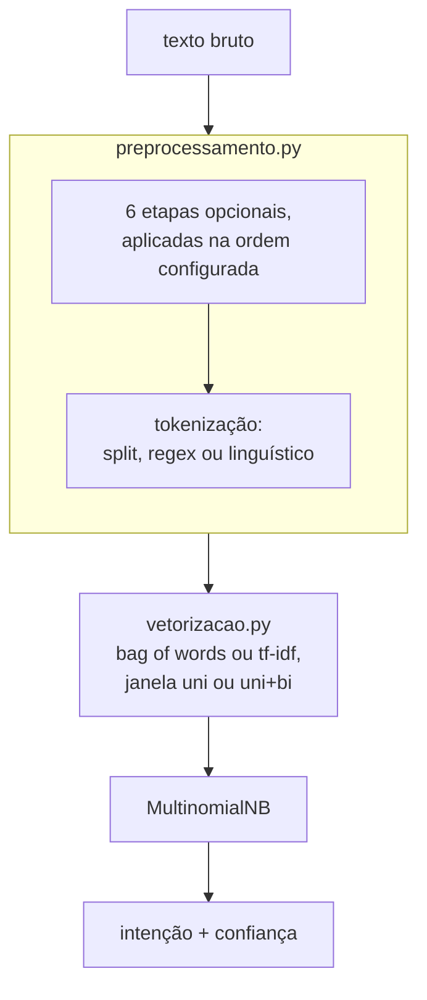
```mermaid
flowchart TB
    T["texto bruto"] --> P

    subgraph P["preprocessamento.py"]
        direction TB
        E["6 etapas opcionais,<br/>aplicadas na ordem configurada"]
        TK["tokenização:<br/>split, regex ou linguístico"]
        E --> TK
    end

    P --> V["vetorizacao.py<br/>bag of words ou tf-idf,<br/>janela uni ou uni+bi"]
    V --> C["MultinomialNB"]
    C --> S["intenção + confiança"]
```

As **duas buscas** que configuraram esse pipeline são maquinário de projeto e não rodam em produção. Elas encadeiam-se por arquivo, e o último passo é manual:

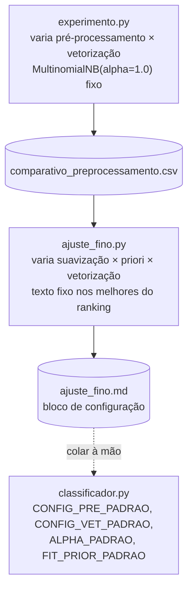
```mermaid
flowchart TB
    EXP["experimento.py<br/>varia pré-processamento × vetorização<br/>MultinomialNB(alpha=1.0) fixo"]
    CSV[("comparativo_preprocessamento.csv")]
    AJU["ajuste_fino.py<br/>varia suavização × priori × vetorização<br/>texto fixo nos melhores do ranking"]
    REL[("ajuste_fino.md<br/>bloco de configuração")]
    PROD["classificador.py<br/>CONFIG_PRE_PADRAO, CONFIG_VET_PADRAO,<br/>ALPHA_PADRAO, FIT_PRIOR_PADRAO"]

    EXP --> CSV --> AJU --> REL
    REL -. "colar à mão" .-> PROD
```

**Decisão:** o pipeline do produto é um único objeto do scikit-learn, com o pré-processamento como primeira etapa.

```python
Pipeline([
    ("preprocessamento", PreprocessadorDeTexto(config_pre)),
    ("vetorizador", construir_vetorizador(config_vet)),
    ("classificador", MultinomialNB(alpha=alpha, fit_prior=fit_prior)),
])
```

Isso importa por dois motivos. Primeiro, treinar, avaliar, salvar e prever passam a operar sobre texto bruto, e não existe a possibilidade de alguém treinar com um pré-processamento e prever com outro, que é um erro comum em PLN e não levanta exceção nenhuma: o modelo apenas erra mais. Segundo, dentro da validação cruzada o `Pipeline` garante que o vocabulário e o IDF sejam aprendidos apenas nas dobras de treino, evitando vazamento de dados.

### 3.3.5 Espaço de busca

| Dimensão | Opções | Combinações |
| --- | --- | ---: |
| Etapas booleanas (minúsculas, acentos, pontuação, números) | ligada ou desligada | 2⁴ = 16 |
| Tratamento de stopwords | manter, remover tudo, preservar negações | 3 |
| Normalização morfológica | nenhuma, stemming, lematização | 3 |
| Tokenização | split, regex, linguística | 3 |
| **Configurações de pré-processamento** | | **432** |
| Permutações de ordem das etapas ativas | | **19.767** |
| Vetorizações (2 modos × 2 janelas de n-grama) | | **4** |

Permutações que produzem texto idêntico são o mesmo experimento e são deduplicadas por hash do corpus, o que elimina cerca de 85% do trabalho. A varredura completa resulta em **11.644 execuções distintas** e leva aproximadamente **6 minutos**.

### 3.3.6 Como o pipeline final foi escolhido

A escolha é feita por duas buscas, e cada uma fixa o que a outra varia:

| Script | Varia | Fixa |
| --- | --- | --- |
| `experimento.py` | o **texto**: pré-processamento × vetorização | o modelo: `MultinomialNB(alpha=1.0)` |
| `ajuste_fino.py` | os **parâmetros do modelo**: suavização × priori × vetorização | o texto: os melhores do experimento |

O `ajuste_fino.py` lê o relatório que o `experimento.py` grava, então a ordem de execução é obrigatória.

### Decisões metodológicas que sustentam a validade da comparação

**Decisão:** a régua é única e fixa. O `experimento.py` compara formas de preparar texto, então tudo o que vem depois precisa ser idêntico: mesmo algoritmo, mesmos parâmetros, mesma semente.

**Decisão:** o espaço de vetorização contém apenas a família esparsa. Uma vetorização densa por embeddings pré-treinados chegou a ser avaliada e foi removida. O motivo não foi desempenho, e sim que vetores de embedding têm coordenadas negativas, que o `MultinomialNB` não aceita, o que obrigava a trocar de classificador naquela linha do ranking. Com o classificador variando junto com a representação, o efeito de um deixa de ser separável do do outro e a comparação fica **confundida**. Medindo a decomposição no dataset atual:

| Comparação | F1 | Leitura |
| --- | ---: | --- |
| tfidf + MultinomialNB | 0,6354 | ponto de partida |
| tfidf + GaussianNB | 0,4855 | **−0,1499**, só a troca de classificador |
| embedding + GaussianNB | 0,4239 | **−0,0615**, só a troca de representação |
| régua única, tfidf contra embedding | 0,6687 contra 0,6387 | **−0,0300**, o efeito real |

O relatório reportava −0,2114 para "embedding é pior". O efeito real da representação é −0,0300, ou seja, **71% do que era atribuído à representação vinha do classificador**. Restringir o espaço à família esparsa resolve o problema pela raiz, porque uma régua atende tudo que está dentro e toda linha do relatório passa a ser interpretável sem ressalva. O custo declarado é que o experimento deixou de responder "vale a pena usar embeddings?", pergunta que passa a exigir um estudo próprio.

**Decisão:** validação cruzada estratificada de 5 dobras, com semente fixa (42). Estratificada para que cada dobra contenha todas as intenções na mesma proporção, e com semente fixa para que duas configurações sejam comparáveis, e não diferentes por sorteio.

**Decisão:** a métrica é F1-macro, e não acurácia. Acurácia engana com classes desbalanceadas, enquanto o macro tira média por classe, de modo que a intenção rara pesa igual à comum.

**Decisão:** as comparações entre opções são pareadas. Média simples seria enviesada, porque `manter` e `nenhuma` deixam a configuração com uma etapa a menos e, portanto, com menos permutações de ordem. O pareamento compara apenas grupos idênticos em todas as demais escolhas.

**Decisão:** entre configurações empatadas, vence a mais simples. "Empatadas" são as que ficam dentro de um desvio padrão da melhor, ou seja, dentro da incerteza da própria medição. O desempate é, nesta ordem: menos etapas, janela de n-grama menor, ordem padrão, maior F1. A ordem padrão vem antes do F1 de propósito, porque entre permutações do mesmo conjunto de etapas a diferença de F1 é menor que o desvio entre dobras, e escolher por ela seria escolher por ruído.

### Resultados da busca do texto

Efeito de cada escolha, em comparação pareada sobre 576 configurações idênticas nas demais escolhas:

| Escolha | F1 médio | vs referência |
| --- | ---: | ---: |
| stopwords: manter | 0,6332 | referência |
| stopwords: remover tudo | 0,5942 | −0,0390 |
| stopwords: preservar negações | 0,5943 | −0,0389 |
| morfologia: nenhuma | 0,5962 | referência |
| **morfologia: stemming** | **0,6247** | **+0,0285** |
| morfologia: lematização | 0,6009 | +0,0047 |
| tokenização: split | 0,5951 | referência |
| tokenização: regex | 0,6133 | +0,0182 |
| tokenização: linguística | 0,6134 | +0,0184 |

O resultado sobre stopwords confirma a hipótese de domínio que motivou o terceiro modo: remover stopwords atrapalha, e as duas formas de removê-las são equivalentes entre si.

Sobre a ordem das etapas, ela muda o texto em **1.320 de 1.728 grupos** (76%), com amplitude média de 0,0148 de F1. Usar sempre a ordem padrão custa, em média, 0,0048, uma ordem de grandeza abaixo do desvio entre dobras, o que justifica a regra de desempate adotada.

### Resultados da busca dos parâmetros

Sobre os vinte melhores pré-processamentos, 960 candidatos avaliados:

| Suavização (`alpha`) | F1 médio | vs melhor |
| --- | ---: | ---: |
| **1.0** | **0,6537** | referência |
| 0.5 | 0,6454 | −0,0083 |
| 2.0 | 0,6446 | −0,0091 |
| 0.1 | 0,6190 | −0,0347 |

| Vetorização | F1 médio | vs melhor |
| --- | ---: | ---: |
| **bow n=1** | **0,6401** | referência |
| tfidf n=1 | 0,6276 | −0,0125 |
| bow n=1-2 | 0,6258 | −0,0143 |
| tfidf n=1-2 | 0,6148 | −0,0252 |

As probabilidades a priori não fazem diferença nenhuma (0,6271 nos dois valores), o que é coerente com as dez intenções terem exatamente o mesmo número de exemplos. O `alpha` fica no padrão da biblioteca, 1.0, que também foi o melhor medido.

### Configuração adotada

```python
CONFIG_PRE_PADRAO = ConfigPreprocessamento(
    remover_numeros=True,
    morfologia=ModoMorfologia.STEMMING,
    tokenizacao=Tokenizacao.REGEX,
)
CONFIG_VET_PADRAO = ConfigVetorizacao(ModoVetorizacao.BOW, n_max=1)
ALPHA_PADRAO      = 1.0
FIT_PRIOR_PADRAO  = True
```

F1-macro de **0,6736** em validação cruzada de 5 dobras. Esses valores estão aplicados em `classificador.py` e são verificados por teste automatizado, que falha se alguém os editar sem passar pelas duas buscas.

**Ressalvas declaradas.** A primeira é que 1.439 das 11.644 execuções ficam dentro de um desvio padrão da melhor. O topo do ranking é um empate largo, e a leitura confiável está nas tabelas agregadas, cada uma resumindo centenas de comparações pareadas, e não na primeira colocada. A segunda é que o F1-macro de 0,6736 está **17,6 pontos percentuais abaixo do 0,85 exigido pelo RNF03**. A classe `fora_do_catalogo` responde pela maior parte da distância, porque é uma categoria aberta, sem vocabulário próprio e que compartilha termos com todas as demais. Fechar essa distância é trabalho previsto para a Sprint 3, conforme a Seção 3.8, e as duas frentes são ampliar o dataset e calibrar, somente em dados de desenvolvimento, um limiar de confiança sobre as nove intenções conhecidas. A validação final também deverá atender à cobertura e à aceitação indevida definidas no RNF03.

### 3.3.7 Bibliotecas utilizadas

| Biblioteca | Versão | Papel no pipeline |
| --- | --- | --- |
| `scikit-learn` | 1.9.0 | Vetorizadores, `MultinomialNB`, `Pipeline`, validação cruzada e métricas |
| `nltk` | 3.10.3 | Lista de stopwords do português, stemmer RSLP e tokenizador por expressão regular |
| `spacy` | 3.8.16 | Tokenizador linguístico e lematizador de português (`pt_core_news_sm`) |
| `numpy` | 2.5.2 | Operações sobre a matriz de pesos na explicação por classe |
| `joblib` | 1.6.0 | Serialização do modelo treinado e paralelização da varredura |

As cinco versões acima estão fixadas com `==` em `requirements.txt` e em `pyproject.toml`, e não com piso `>=`. A tabela e os dois arquivos precisam concordar: são essas versões que produzem o F1-macro publicado em `resultados/`, e com piso um rebuild puxaria versões novas, mudando o número medido sem que nenhum teste acusasse. O teste `TesteVersoesFixadas`, em `tests/test_reprodutibilidade.py`, falha se a tabela divergir dos arquivos de dependência. Atualizar qualquer versão exige regerar os relatórios com `python -m pln.experimento` e `python -m pln.ajuste_fino` antes de editar a tabela.

O tokenizador linguístico usa `spacy.blank("pt")`, que carrega apenas as regras do idioma e não exige o download de modelo. O `pt_core_news_sm` é necessário somente para a lematização.

### 3.3.8 Execução

Instalação, uma vez:

```bash
pip install -e .
python -m nltk.downloader stopwords rslp
python -m spacy download pt_core_news_sm
```

Treinar, avaliar e salvar o modelo:

```bash
python -m pln.classificador
```

Classificar uma frase com o modelo salvo:

```bash
python -m pln.classificador --prever "Me ajuda a preencher o TAP da Linha 6?"
# 'Me ajuda a preencher o TAP da Linha 6?'
#   -> orientar_tap  (confiança 83.5%)
```

Reexecutar as duas buscas, nesta ordem:

```bash
python -m pln.experimento     # varredura exaustiva, ~6 min
python -m pln.ajuste_fino     # ~40 s sobre os 5 melhores pré-processamentos
```

Ambas gravam relatórios em `resultados/`, e o segundo emite o bloco de configuração pronto para ser aplicado em `classificador.py`.

Uso programático, que é como o agente consome o pipeline:

```python
from pln.caminhos import MODELO_PADRAO
from pln.classificador import carregar_modelo, prever_intencao

modelo = carregar_modelo(MODELO_PADRAO)
intencao, confianca = prever_intencao(modelo, "Tem algum prazo vencido no lote 3?")
# ('gerar_alertas_pendencias', 0.947)
```

Para auditoria e para o atendimento do RNF11, o modelo treinado expõe as palavras que mais distinguem cada intenção. Elas saem reduzidas ao radical porque a configuração adotada aplica stemming:

```python
from pln.classificador import listar_palavras_de_maior_peso_por_intencao

listar_palavras_de_maior_peso_por_intencao(modelo, quantas=4)
# {'orientar_tap':             [('tap', 2.71), ('term', 1.76), ('abert', 1.59), ('premiss', 1.50)],
#  'gerar_alertas_pendencias': [('venc', 1.86), ('sem', 1.79), ('avis', 1.79), ('tem', 1.70)],
#  ...}
```

### 3.3.9 Testes

O pipeline tem **153 testes automatizados**, organizados por módulo. Eles são a evidência de que o
comportamento descrito nesta seção é o que o código faz, e não apenas o que se pretendia.

```bash
python -m unittest discover tests
```

#### Cobertura por módulo

`tests/test_preprocessamento.py`, 34 testes:

| Classe | Testes | Garante |
| --- | ---: | --- |
| `TesteEtapasIsoladas` | 6 | Cada etapa ligada sozinha, com todas as outras desligadas, faz exatamente o que promete |
| `TesteMorfologia` | 7 | Os três modos produzem saídas distintas, o lema é palavra de dicionário e o radical não |
| `TesteTokenizacao` | 6 | As três estratégias tokenizam de formas realmente diferentes sobre o mesmo texto |
| `TesteModosDeStopwords` | 7 | As negações sobrevivem em `preservar_negacoes`, com e sem acento |
| `TesteOrdem` | 4 | A ordem tem efeito observável, e uma ordem inválida é rejeitada na construção |
| `TesteInvariantes` | 4 | Determinismo, ausência de espaço duplicado e configuração hasheável |

Cada etapa é testada **isolada**, ligada sozinha. É o que garante que as etapas são independentes: se
um teste de etapa isolada quebrar quando outra etapa mudar, houve acoplamento indevido.

`tests/test_vetorizacao.py`, 17 testes:

| Classe | Testes | Garante |
| --- | ---: | --- |
| `TesteEspacoDeVetorizacao` | 5 | São 4 opções, sem duplicata, e todo modo aparece |
| `TesteNaoRetokeniza` | 4 | O vetorizador respeita a tokenização já feita |
| `TesteModosEJanelas` | 3 | `bow` devolve contagens, `tfidf` devolve pesos normalizados, bigrama infla o vocabulário |
| `TestePipeline` | 3 | A régua treina, prediz e é determinística |
| `TesteReguaUnica` | 2 | O classificador é o mesmo nas 4 vetorizações, e todas alimentam ele |

`tests/test_classificador.py`, 21 testes:

| Classe | Testes | Garante |
| --- | ---: | --- |
| `TestePreprocessadorDeTexto` | 3 | O transformador respeita o contrato do sklearn e sobrevive ao `clone()` |
| `TesteConstrucao` | 4 | As três etapas na ordem certa, treinando a partir de texto bruto |
| `TestePrevisao` | 3 | Confiança em [0, 1] e probabilidades somando 1 |
| `TesteExplicacao` | 2 | Termos ordenados por peso, um conjunto por classe |
| `TesteConfiguracaoViajaComOModelo` | 2 | O modelo salvo carrega o próprio pré-processamento |
| `TesteAvaliacao` | 2 | F1, relatório por classe e matriz de confusão coerentes |
| `TesteDatasetPadrao` | 2 | Os padrões em vigor são os que as duas buscas recomendaram |
| `TesteClassificadorDoProdutoEAReguaDoExperimento` | 2 | Produto e régua usam a mesma classe, e o produto treina com toda vetorização do espaço |
| `TesteModeloSalvoCarregaDeFora` | 1 | O `.joblib` treinado pelo CLI carrega de um processo que apenas o importa |

`tests/test_ajuste_fino.py`, 19 testes:

| Classe | Testes | Garante |
| --- | ---: | --- |
| `TesteEspacoDeBusca` | 2 | O produto cartesiano é completo e o classificador não é eixo de busca |
| `TesteComparacaoPareada` | 3 | Todo eixo analisado rende tabela, e eixo constante não rende |
| `TesteRotulos` | 3 | Os valores saem legíveis nas tabelas, sem `repr()` de dataclass |
| `TesteDesempate` | 3 | Entre empatadas vence a mais simples, e nada fora do empate é escolhido |
| `TesteBlocoDeConfiguracao` | 6 | O bloco que o relatório manda colar é Python válido, executável e reproduz os padrões em vigor |
| `TesteEscapeDeTabela` | 1 | A barra vertical é escapada, senão a tabela markdown desalinha |
| `TesteLeituraDoRelatorio` | 1 | A configuração é reconstruída a partir das colunas do CSV do experimento |

`tests/test_experimento.py`, 9 testes:

| Classe | Testes | Garante |
| --- | ---: | --- |
| `TesteEspacoDeBusca` | 4 | As 432 configurações cobrem o produto cartesiano, toda etapa ativa é permutada, toda ordem gerada é válida e a primeira permutação é a ordem padrão |
| `TesteRecomendacao` | 5 | O empate é de um desvio padrão, e o desempate segue a ordem de critérios adotada |

#### Os quatro testes que impedem defeito silencioso

Estes existem porque o defeito que eles pegam **não levanta exceção**. Sem eles, a medição passa a
mentir sem que nada falhe, que é a forma mais cara de errar num experimento.

| Teste | O defeito que impede | Como o defeito se manifestaria |
| --- | --- | --- |
| `TesteNaoRetokeniza` | Os padrões do scikit-learn (`lowercase=True` e o `token_pattern`) retokenizarem o texto | As etapas `minusculas` e `remover_pontuacao` e a escolha de tokenizador deixariam de ter efeito, e o experimento reportaria "não faz diferença" para as três |
| `TesteReguaUnica` | O classificador voltar a mudar conforme a vetorização | A comparação entre representações ficaria confundida, exagerando o efeito da representação em cerca de 7 vezes, como descrito em 3.3.6 |
| `TesteComparacaoPareada` | Algum eixo deixar de formar grupos completos | A tabela correspondente sumiria do relatório, sem erro e sem aviso |
| `TesteModeloSalvoCarregaDeFora` | O pickle gravar `PreprocessadorDeTexto` com o caminho `__main__` | O `.joblib` carregaria apenas de dentro do próprio CLI, e o agente, que importa `carregar_modelo`, receberia `AttributeError` |

O último merece nota. `python -m pln.classificador` carrega o módulo como `__main__`, e é desse
contexto que o modelo era serializado. O teste treina pelo CLI num subprocesso e carrega o resultado
de outro processo, que é exatamente o uso previsto pelo agente e o que o defeito quebrava.

#### O que os testes não cobrem

Eles verificam **comportamento**, e não **qualidade da classificação**. Nenhum teste afirma que o
modelo atinge um F1 mínimo, e isso é deliberado: a nota depende do dataset, e prendê-la num teste
faria a suíte quebrar a cada troca de conjunto de treino por um motivo que não é defeito de código.
A qualidade é medida pelos relatórios em `resultados/` e discutida em 3.3.6.

## 3.4 API para Recebimento de Áudios

Esta seção documenta a API **interna** responsável por receber os áudios enviados pelos usuários, estabelecendo o contrato de entrada do canal de voz da solução. As definições apresentadas determinam como o áudio entra no sistema, quais regras devem ser respeitadas antes do processamento e como o cliente deve tratar os resultados.

Ela não se confunde com a API **externa** de Speech to Text da Seção 3.2. A distinção é a que organiza todo o canal de voz e vale registrar de uma vez:

| | API interna de recebimento (esta seção) | API externa de Speech to Text (Seção 3.2) |
|---|---|---|
| Quem constrói | A equipe | O provedor Deepgram |
| Quem chama | A interface web, e futuramente outros canais | O backend do AZ1, nunca o navegador |
| O que recebe | O arquivo binário de áudio, em `multipart/form-data` | Os bytes do áudio já validado, recuperados do armazenamento |
| O que devolve | Um `audio_id` e o status do recebimento | O texto transcrito e a confiança do reconhecedor |
| Onde falha | Validação de formato, tamanho e duração | Indisponibilidade ou erro do serviço de terceiro |
| Contrato governado por | Este documento e `src/schemas/audio.py` | A documentação oficial do provedor |

O vínculo entre as duas é o `audio_id` e o objeto gravado no armazenamento: o recebimento grava, a transcrição lê. Não existe chamada direta de uma para a outra, decisão registrada na Seção 2.4.

**Estado de implementação desta seção.** O contrato abaixo foi definido por inteiro na Sprint 2; a implementação cobre a maior parte dele, e o que falta está identificado linha a linha. Nenhuma regra ainda não construída deve ser lida como vigente.

| Regra do contrato | Situação | Evidência no repositório |
|---|---|---|
| Endpoint `POST /api/v1/audio`, resposta `201` com `id`, `status` e `message` | **Implementada** | `src/routes/audio.py`, `src/schemas/audio.py` |
| Corpo `multipart/form-data` com o campo `audio` | **Implementada** | Parâmetro `audio: UploadFile = File(...)` na rota |
| Rejeição de arquivo ausente, vazio ou corrompido | **Implementada** | `ReceiveAudio.receive` e `probe_audio` em `src/services/audio_service.py` |
| Limite de 10 MB | **Implementada** | `MAX_FILE_SIZE_BYTES` |
| Limite de 5 minutos | **Implementada** | `MAX_DURATION_SECONDS` |
| Validação de formato pela assinatura binária, e não pela extensão ou MIME type declarados | **Implementada** | `_detect_audio_format` e `probe_audio` |
| Corpo de erro padronizado com `error` e `message` | **Implementada** | `ErrorResponse` e os manipuladores de exceção em `src/az1_api/main.py` |
| Armazenamento em bucket compatível com S3 sob `incoming/{audio_id}` | **Implementada** | `S3AudioStorage.store` em `src/services/storage_service.py` |
| Cobertura por testes automatizados | **Implementada** | 4 testes de rota e 13 de serviço, em `tests/test_audio_api.py` e `tests/test_audio_service.py` |
| **Autenticação por Bearer Token e resposta `401`** | **Planejada, não implementada** | A rota não declara nenhuma dependência de autenticação |
| **HTTPS obrigatório** | **Planejada, não implementada** | O ambiente local serve por HTTP; ver Seção 3.7.4 |
| **Limitação de taxa de requisições** | **DECISÃO TÉCNICA EM ABERTO** | Nenhum mecanismo de *rate limit* no código |
| **Inspeção antivírus do arquivo** | **DECISÃO TÉCNICA EM ABERTO** | Não previsto no MVP; ver a subseção de segurança |

### Endpoint e método HTTP

**Decisão:** utilizar o método `POST` no endpoint abaixo:

```http
POST /api/v1/audio
```

O método `POST` é adequado para o envio de um novo recurso ao sistema. O prefixo `/api/v1` permite versionar a API e facilita futuras evoluções sem quebrar integrações existentes.

### Autenticação

**Decisão:** utilizar autenticação por Bearer Token.

```http
Authorization: Bearer <token>
```

Esse mecanismo restringe o acesso à API a usuários ou serviços autenticados e segue um padrão amplamente utilizado em APIs HTTP. O token será emitido pelo mecanismo de autenticação da solução. A definição do serviço emissor, entre autenticação própria ou integração com o Copilot Studio, será consolidada na Sprint 3, quando a camada de orquestração estiver especificada.

### Formato da requisição

**Decisão:** utilizar `multipart/form-data`.

Esse formato é apropriado para o envio de arquivos binários e evita a conversão do áudio para Base64, que aumentaria desnecessariamente o tamanho da requisição.

### Parâmetros de entrada

| Parâmetro | Tipo | Obrigatório | Formato esperado | Descrição |
| --- | --- | --- | --- | --- |
| `audio` | Arquivo binário | Sim | `audio/wav`, `audio/mpeg`, `audio/mp4`, `audio/x-m4a`, `audio/webm` | Arquivo de áudio enviado pelo usuário |

Nesta etapa, o endpoint precisa apenas receber o áudio. Outros parâmetros poderão ser adicionados futuramente caso o fluxo da aplicação exija.

A extensão e o MIME type declarados pelo cliente **não são utilizados como única fonte de verdade**: ambos podem ser inconsistentes com o conteúdo real do arquivo (um cliente pode renomear um arquivo ou enviar um MIME type incorreto). Por isso, a validação de formato deve inspecionar o conteúdo binário do arquivo (assinatura/header do arquivo), e não apenas os metadados informados na requisição.

### Formatos de áudio suportados

Inicialmente, serão aceitos os seguintes formatos:

| Extensão | MIME types aceitos |
| --- | --- |
| `.wav` | `audio/wav`, `audio/x-wav` |
| `.mp3` | `audio/mpeg` |
| `.m4a` | `audio/mp4`, `audio/x-m4a` |
| `.webm` | `audio/webm` |

Diferentes clientes podem declarar variações de MIME type para o mesmo formato — em especial para `.m4a`, que pode chegar como `audio/mp4` ou `audio/x-m4a` dependendo do navegador ou dispositivo. Todas as variações listadas acima devem ser aceitas como válidas para a respectiva extensão. Esses formatos possuem ampla compatibilidade com navegadores, dispositivos móveis e serviços de Speech-to-Text, atendendo aos principais cenários de captura de áudio do sistema.

### Tamanho máximo do arquivo

Cada arquivo será limitado a **10 MB**. Esse limite evita requisições excessivamente grandes, reduz o consumo desnecessário de memória e rede e oferece margem suficiente para áudios curtos utilizados em interações por voz.

### Duração máxima

O áudio será limitado a **5 minutos**. A solução foi projetada para interações de voz e consultas, e não para o processamento de gravações extensas. O limite reduz o tempo de processamento e o uso de recursos.

Caso a duração do áudio ultrapasse esse limite, a API retorna `422 Unprocessable Entity` com o erro `audio_too_long`.

### Exemplo de requisição

```bash
# Contrato-alvo, com a autenticação já implementada
curl -X POST https://<host-da-api>/api/v1/audio \
  -H "Authorization: Bearer <ACCESS_TOKEN>" \
  -F "audio=@consulta.wav"
```

No estado atual da implementação, em que a autenticação ainda não existe e a API roda localmente, a mesma requisição é feita sem o cabeçalho de autorização:

```bash
# Execução local, estado atual do repositório
curl -X POST http://localhost:8000/api/v1/audio \
  -F "audio=@consulta.wav"
```

O header `Content-Type: multipart/form-data` não é definido manualmente: a flag `-F` do curl já monta a requisição como multipart e adiciona o boundary correto automaticamente. Defini-lo à mão, sem o boundary, resultaria em uma requisição inválida. O host `<host-da-api>` é um marcador: nenhum endereço público foi provisionado até o encerramento desta sprint, conforme a Seção 3.7.

### Resposta de sucesso

**Código HTTP:** `201 Created`

```json
{
  "id": "aud_123456",
  "status": "received",
  "message": "Áudio recebido com sucesso."
}
```

O código `201` indica que o sistema recebeu e criou um novo recurso associado ao áudio enviado. Após passar por todas as validações, o áudio é armazenado em um bucket compatível com S3 usando o `id` gerado como chave do objeto — esse `id` é o que a próxima etapa do pipeline (Speech-to-Text) utiliza para recuperar o arquivo.

### Respostas de erro

| Código HTTP | Situação |
| --- | --- |
| `400 Bad Request` | Requisição malformada (ex: corpo que não é `multipart/form-data` válido) |
| `401 Unauthorized` | Token ausente ou inválido |
| `413 Payload Too Large` | Arquivo maior que 10 MB |
| `415 Unsupported Media Type` | Formato de áudio não suportado (extensão/MIME type fora da lista aceita) |
| `422 Unprocessable Entity` | Arquivo ausente, vazio, corrompido, com duração acima do limite, ou em formato aceito porém inválido para processamento |
| `500 Internal Server Error` | Falha interna inesperada |

A distinção entre `415` e `422` é importante para o cliente tratar cada caso corretamente:

- **`415`**: o cliente enviou um arquivo em um formato que a API **não suporta** (extensão/MIME type fora da lista de formatos aceitos).
- **`422`**: o arquivo está em um formato **aceito**, mas não pode ser processado — por exemplo, está corrompido, vazio, ausente, ou ultrapassa a duração máxima permitida.

Sobre o arquivo ausente: como a implementação utiliza FastAPI, um parâmetro obrigatório declarado como `audio: UploadFile = File(...)` gera automaticamente um erro `422` quando o arquivo não é enviado. O contrato segue esse comportamento nativo do framework, em vez de tratá-lo manualmente para forçar um `400` — isso também é consistente com a semântica HTTP, já que a ausência de um campo obrigatório é um erro semântico (a requisição está bem formada, mas incompleta), não um erro de sintaxe. Dessa forma, `400` fica reservado para requisições estruturalmente inválidas (ex: corpo que não é multipart), e implementação e contrato permanecem alinhados. Esse `400` retorna o corpo padronizado com `error: "bad_request"`; já o `422` de arquivo ausente é a única resposta de erro que mantém o corpo nativo do FastAPI (`{"detail": [...]}`), pela razão explicada acima.

Todas as respostas de erro seguem o mesmo formato padronizado:

```json
{
  "error": "<código_do_erro>",
  "message": "<mensagem legível para o usuário>"
}
```

| Código de erro | Código HTTP | Situação |
| --- | --- | --- |
| `bad_request` | 400 | Requisição malformada (ex: corpo que não é multipart válido) |
| `unauthorized` | 401 | Token ausente ou inválido |
| `unsupported_format` | 415 | Formato de áudio não suportado |
| `file_too_large` | 413 | Arquivo maior que 10 MB |
| `audio_too_long` | 422 | Duração do áudio acima de 5 minutos |
| `invalid_audio` | 422 | Arquivo ausente, vazio ou corrompido |
| `internal_error` | 500 | Falha interna inesperada |

Exemplos de respostas de erro:

```json
{
  "error": "bad_request",
  "message": "Requisição malformada."
}
```

```json
{
  "error": "unsupported_format",
  "message": "Formato de áudio não suportado. Formatos aceitos: wav, mp3, m4a, webm."
}
```

```json
{
  "error": "file_too_large",
  "message": "O arquivo excede o tamanho máximo permitido de 10 MB."
}
```

```json
{
  "error": "audio_too_long",
  "message": "O áudio excede a duração máxima permitida de 5 minutos."
}
```

```json
{
  "error": "invalid_audio",
  "message": "Arquivo de áudio ausente, vazio ou corrompido."
}
```

```json
{
  "error": "unauthorized",
  "message": "Token de autenticação ausente ou inválido."
}
```

```json
{
  "error": "internal_error",
  "message": "Erro interno inesperado."
}
```

Os códigos HTTP e os códigos de erro padronizados facilitam o tratamento dos erros pelo frontend e tornam o comportamento da API previsível.

### Cobertura dos casos de erro previstos

A tabela confronta cada situação de erro exigida pelo canal de voz com a resposta definida e com o estado da implementação. Ela evita que um caso previsto no contrato passe despercebido por não ter linha própria nas tabelas anteriores.

| Situação | Resposta | Endpoint responsável | Situação da implementação |
|---|---|---|---|
| Arquivo ausente na requisição | `422`, corpo nativo do FastAPI | `POST /api/v1/audio` | Implementada, pelo comportamento nativo do framework |
| Corpo que não é `multipart` válido | `400 bad_request` | `POST /api/v1/audio` | Implementada, pelo manipulador de `StarletteHTTPException` |
| Formato de áudio não suportado | `415 unsupported_format` | `POST /api/v1/audio` | Implementada |
| Arquivo acima de 10 MB | `413 file_too_large` | `POST /api/v1/audio` | Implementada |
| Arquivo vazio | `422 invalid_audio` | `POST /api/v1/audio` | Implementada |
| Arquivo corrompido, ou aceito porém ilegível | `422 invalid_audio` | `POST /api/v1/audio` | Implementada |
| Áudio acima de 5 minutos | `422 audio_too_long` | `POST /api/v1/audio` | Implementada |
| Usuário não autenticado | `401 unauthorized` | `POST /api/v1/audio` | **Planejada**, não implementada |
| Áudio inexistente na hora de transcrever | `404 audio_not_found` | `POST /api/v1/audio/{audio_id}/transcribe` | Implementada, Seção 3.2.2 |
| Serviço de transcrição indisponível | `502 transcription_failed` | `POST /api/v1/audio/{audio_id}/transcribe` | Implementada, Seção 3.2.2 |
| Tempo limite da transcrição excedido | `502 transcription_failed` | `POST /api/v1/audio/{audio_id}/transcribe` | Coberta pelo tratamento genérico de exceção; o tempo limite explícito é **DECISÃO TÉCNICA EM ABERTO**, Seção 3.2.2 |
| Áudio compreensível porém sem fala reconhecível | Transcrição vazia devolvida com `200` | `POST /api/v1/audio/{audio_id}/transcribe` | Comportamento atual; a decisão de convertê-la em erro explícito está em aberto |
| Erro interno inesperado | `500 internal_error` | Qualquer rota | Implementada, pelo manipulador global de exceção |

### Segurança do canal de recebimento

A tabela separa os controles vigentes dos previstos. A separação importa porque um controle listado como existente, mas ausente do código, produz uma falsa sensação de proteção — que é pior do que a ausência declarada.

| Controle | Situação | Como está implementado, ou o que falta |
|---|---|---|
| Validação do conteúdo real do arquivo | **Implementado** | A assinatura binária é lida e conferida antes de qualquer uso; extensão e MIME type declarados pelo cliente não são fonte de verdade |
| Rejeição de contêiner com faixa de vídeo | **Implementado** | Um arquivo com vídeo, ou sem áudio, é recusado como formato não suportado |
| Limite de tamanho | **Implementado** | Verificado antes da inspeção do conteúdo, o que evita processar arquivo grande demais |
| Limite de duração | **Implementado** | Apurado pela inspeção do contêiner, e não por metadado declarado |
| Identificador opaco | **Implementado** | O `audio_id` é um UUID em hexadecimal prefixado por `aud_`, sem relação com o nome do arquivo original, que é descartado |
| Descarte automático do áudio | **Implementado** | Expiração de sete dias no prefixo `incoming/`, conforme a Seção 3.2.5 |
| Log sem conteúdo sensível | **Implementado** | Nenhuma rota registra o conteúdo do arquivo nem o texto transcrito |
| Autenticação por SSO | **Planejado** | Bearer Token definido no contrato; provedor Microsoft ou Google ainda a selecionar, sem alteração do contrato do RNF02 |
| Criptografia em trânsito | **Planejado** | HTTPS exigido pelo contrato; o ambiente local ainda serve por HTTP |
| Limitação de taxa de requisições | **DECISÃO TÉCNICA EM ABERTO** | Sem mecanismo no código. Sem autenticação e sem limite de taxa, o endpoint não deve ser exposto publicamente |
| Inspeção antivírus do arquivo recebido | **DECISÃO TÉCNICA EM ABERTO** | Não previsto no MVP. A mitigação atual é indireta: o arquivo é validado como áudio íntegro, nunca é executado e nunca é servido de volta a outro usuário |
| Registro de auditoria do envio | **Planejado** | Depende do schema `auditoria` da Seção 3.6.5, adiado para a Sprint 3 conforme a decisão registrada na Seção 2.4 |
| Conformidade com a LGPD | **Restrição de escopo vigente** | Nenhum dado pessoal ou corporativo real trafega no MVP (Seção 1.3). Antes de qualquer uso real, é necessário definir base legal, prazo de retenção e direitos do titular sobre a gravação |

> **Consequência prática desta tabela.** Enquanto autenticação e limitação de taxa não estiverem implementadas, a API deve ser executada apenas em ambiente local ou de laboratório com acesso restrito. A publicação em endereço público sem esses controles é o principal risco de segurança aberto do MVP e está encaminhada na Seção 3.7.9, item 11, junto da regra de SSH aberta na instância.

### Requisitos adicionais

Consolidando as regras que o contrato da API precisa respeitar:

- **HTTPS obrigatório**: todas as requisições devem ser feitas via HTTPS, para proteger o áudio e o token de autenticação em trânsito.
- **Autenticação obrigatória**: toda requisição deve conter um Bearer Token válido.
- **Arquivo obrigatório**: o campo `audio` deve estar presente na requisição.
- **Arquivo não vazio**: o arquivo enviado não pode ter tamanho zero.
- **Tamanho máximo**: 10 MB por arquivo.
- **Duração máxima**: 5 minutos por áudio.
- **Formato validado pelo conteúdo real do arquivo**, não apenas pela extensão ou MIME type informado pelo cliente.
- **Formatos aceitos**: `.wav`, `.mp3`, `.m4a`, `.webm` (com as variações de MIME type aceitas listadas na seção de formatos suportados).

### Fluxo de processamento

```text
Usuário
  ↓
POST /api/v1/audio
  ↓
Autenticação (Bearer Token)
  ↓
Validação do arquivo (presença e estrutura)
  ↓
Validação de formato, tamanho e duração

  ↙                          ↘
Áudio aceito              Áudio rejeitado
  ↓                          ↓
Encaminha para           Retorna 4xx com
Speech-to-Text           mensagem de erro
```

Com essas definições, o contrato da API estabelece como o áudio entra no sistema, quais regras devem ser respeitadas antes de seu processamento e como o cliente deve tratar tanto o caminho de sucesso quanto os casos de erro.

## 3.5 Pilha de Tecnologias

A pilha de tecnologias do MVP mantém a interface, o backend, o processamento de linguagem natural e os serviços externos desacoplados. Essa separação permite substituir aplicações clientes ou provedores externos sem reimplementar o classificador de intenções e as regras de negócio.

### 3.5.1 Pilha implementada

| Camada | Tecnologias | Responsabilidade |
|---|---|---|
| Interface | JavaScript/JSX, React 19 e Vite 8 | Implementar a interface conversacional e gerar os artefatos estáticos do frontend. |
| Apresentação | Tailwind CSS, Framer Motion e Lucide React | Definir estilos, animações e ícones da interface. |
| Backend e API | Python 3.12+, FastAPI, Uvicorn, Pydantic e `python-multipart` | Expor APIs REST, validar requisições e coordenar os serviços da aplicação. |
| Processamento de áudio | PyAV | Inspecionar o conteúdo dos arquivos e validar formato e duração. |
| PLN | scikit-learn, `MultinomialNB`, NLTK, spaCy e NumPy | Pré-processar textos, vetorizar entradas e classificar intenções. |
| Persistência do modelo | Joblib | Serializar e carregar o classificador treinado. |
| Armazenamento de objetos | MinIO, API S3 e Boto3 | Armazenar e recuperar os arquivos de áudio em bucket compatível com S3. |
| Speech-to-Text | Deepgram SDK 5+ e modelo Nova-3 | Recuperar o áudio armazenado, transcrevê-lo em português brasileiro e devolver o texto ao pipeline de PLN. |
| IA generativa | Google Gen AI SDK e `gemini-3.5-flash-lite` | Gerar respostas em linguagem natural por meio do endpoint de chat. |
| Infraestrutura local | Docker e Docker Compose | Executar o MinIO e preservar seus dados no volume `minio_data`. |

O fluxo de áudio implementado nesta etapa é:

```text
Interface React
      ↓ multipart/form-data
API FastAPI
      ↓ validação com PyAV e geração do audio_id
Boto3
      ↓ PutObject pelo protocolo S3
MinIO / bucket az1-audio
      ↓
volume Docker minio_data

POST /api/v1/audio/{audio_id}/analyze
      ↓ GetObject com Boto3 no MinIO
Deepgram Nova-3
      ↓ transcrição em pt-BR
MultinomialNB
      ↓
intenção classificada
```

A geração de respostas textuais já está integrada separadamente pelo endpoint `POST /api/v1/chat`, que encaminha a mensagem ao `gemini-3.5-flash-lite` por meio do Google Gen AI SDK.

### 3.5.2 Tecnologias selecionadas para as próximas etapas

| Capacidade | Tecnologias selecionadas | Etapa prevista |
|---|---|---|
| Persistência estruturada | PostgreSQL e SQL | Modelagem conceitual, lógica e física concluída; provisionamento e integração posteriores. |
| RAG | MinIO, PostgreSQL com pgvector, `gemini-embedding-001` e `gemini-3.5-flash-lite` | Armazenamento de documentos sintéticos, recuperação semântica e geração de respostas fundamentadas. |
| Agendamento e alertas | APScheduler, PostgreSQL e interface React | Execução de verificações periódicas, persistência e apresentação de alertas na aplicação. |
| Computação em nuvem | AWS Academy e Amazon EC2 | Ambiente acadêmico selecionado e serviço de computação confirmado para o deploy do MVP. |
| Registro de imagens | Amazon ECR | Uso planejado, condicionado à disponibilidade no catálogo do laboratório. |
| Armazenamento de objetos em nuvem | Amazon S3 e Boto3 | Substituição planejada do MinIO no ambiente AWS, condicionada à disponibilidade do serviço. |
| Observabilidade | Amazon CloudWatch | Uso planejado para logs técnicos e métricas, condicionado à disponibilidade do serviço. |
| Empacotamento das aplicações | Docker | Criação futura dos Dockerfiles de frontend e backend antes da publicação na AWS. |

No fluxo planejado de RAG, os documentos originais serão mantidos no MinIO. Após a extração e divisão do texto em trechos, o `gemini-embedding-001` gerará as representações vetoriais, que serão armazenadas no PostgreSQL por meio do pgvector. A pergunta do usuário será comparada a esses vetores, e os trechos mais relevantes serão enviados ao `gemini-3.5-flash-lite` para a elaboração de uma resposta fundamentada.

A escolha do PostgreSQL evita introduzir um segundo banco apenas para a busca vetorial. O APScheduler, por sua vez, atende ao escopo acadêmico do MVP por permitir que as verificações periódicas sejam executadas junto ao backend Python. Caso a solução evolua para múltiplas instâncias ou maior volume de processamento, a estratégia de agendamento deverá ser reavaliada.

No desenvolvimento local, o MinIO permanece como armazenamento compatível com S3. No ambiente AWS, a substituição planejada pelo Amazon S3 preserva o uso do Boto3 e o contrato de acesso a objetos. O Amazon EC2 hospedará os elementos executáveis do MVP; ECR, S3 e CloudWatch somente serão incorporados ao deploy após a confirmação de que estão liberados no laboratório da AWS Academy. A hospedagem do PostgreSQL nesse ambiente permanece em aberto.

O serviço de Text-to-Speech já integra a pilha executável com Gemini TTS, conforme o contrato e as limitações registrados na Seção 3.2.6. As integrações com o ecossistema Microsoft, por sua vez, continuam tratadas como evolução futura e não fazem parte da pilha executável atual.

### 3.5.3 Quadro consolidado da pilha

O quadro reúne, em uma única leitura, cada camada da solução com a tecnologia adotada, a razão da escolha, a alternativa considerada e a limitação assumida. As duas tabelas anteriores respondem *o que* compõe a pilha e *quando* cada peça entra; esta responde *por que* cada uma foi escolhida e *o que se perde* com ela. A coluna **Status** usa quatro valores: **Implementado**, quando existe código em execução no repositório; **Decidido**, quando a escolha está fechada e a construção ainda não começou; **Selecionado**, quando há preferência registrada mas condicionada a verificação; e **Em aberto**, quando não há decisão.

| Camada | Tecnologia | Finalidade | Justificativa | Alternativa considerada | Vantagem | Limitação | Status |
|---|---|---|---|---|---|---|---|
| Interface web | React 19, Vite 8, JavaScript/JSX | Interface conversacional de texto e voz | Componentização adequada a um chat com estados de carregamento, transcrição e erro; Vite entrega desenvolvimento e build sem configuração extensa | Interface renderizada no próprio backend, sem framework de front | Ecossistema amplo e reaproveitável em outros canais | Exige processo de build próprio e um segundo ambiente de execução | Implementado |
| Apresentação | Tailwind CSS, Framer Motion, Lucide React | Estilo, animação e iconografia | Reduz o esforço de padronização visual sem introduzir uma biblioteca de componentes que imponha identidade própria | Biblioteca de componentes pronta | Consistência visual a baixo custo | Marcação verbosa; a acessibilidade continua sendo responsabilidade da equipe | Implementado |
| Backend e API | Python 3.12+, FastAPI, Uvicorn, Pydantic, `python-multipart` | Expor as APIs REST, validar entradas e orquestrar os serviços | Mesma linguagem do pipeline de PLN, o que elimina uma fronteira de processo entre API e modelo; validação por tipo já embutida | Flask, considerado no exemplo original da Seção 3.7.5 | Validação declarativa, documentação OpenAPI automática e suporte nativo a rotas assíncronas | Ecossistema assíncrono exige atenção com bibliotecas bloqueantes | Implementado |
| Processamento de áudio | PyAV | Inspecionar o conteúdo do arquivo e apurar formato e duração reais | Único modo de validar o arquivo pelo conteúdo, e não pelos metadados declarados pelo cliente | Confiar no MIME type e na extensão informados | Fecha a principal brecha de validação do canal de voz | Depende de bibliotecas nativas do FFmpeg no ambiente de execução | Implementado |
| PLN | scikit-learn com `MultinomialNB`, NLTK, spaCy, NumPy | Pré-processar, vetorizar e classificar a intenção | Velocidade que viabiliza a varredura exaustiva de 8.070 execuções distintas registrada na Seção 3.3.7, além de determinismo e explicabilidade | Regressão logística, `BernoulliNB`, `ComplementNB` e a vetorização densa por embeddings, todas medidas e registradas na Seção 3.3.7 | Treino e inferência em microssegundos, modelo auditável termo a termo | Medição saturada, com F1-macro de 1,0000 sobre três classes genéricas: não comprova o atendimento do RNF03, conforme a ressalva da Seção 3.3.7 | Implementado |
| Persistência do modelo | Joblib | Serializar e carregar o classificador treinado | Formato nativo do ecossistema scikit-learn para matrizes esparsas | Reconstruir o modelo a cada inicialização | Carga rápida, sem retreinar | Arquivo acoplado à versão da biblioteca que o gerou | Implementado |
| Armazenamento de objetos | MinIO com API S3 e Boto3 | Guardar os áudios recebidos | Contrato S3 permite trocar o provedor sem alterar o código da aplicação | Gravação em sistema de arquivos local | Mesmo cliente serve ao ambiente local e ao Amazon S3 na nuvem | Exige contêiner adicional em desenvolvimento | Implementado |
| Speech to Text | Deepgram SDK 5+, modelo Nova-3 | Converter o áudio em texto | Suporte a termos de domínio via `keyterm`, latência baixa e créditos gratuitos, conforme a comparação da Seção 3.2.1 | OpenAI Whisper API, Google Cloud STT, Azure AI Speech | Vocabulário do PMO reconhecido com mais precisão | Dependência de serviço externo pago, com custo por minuto de áudio | Implementado |
| IA generativa | Google Gen AI SDK, `gemini-3.5-flash-lite` | Gerar a resposta em linguagem natural no endpoint de chat | Camada gratuita suficiente para o MVP e SDK Python oficial | Consumo de outro provedor de modelo de linguagem | Resposta fluente sem infraestrutura própria de inferência | Origem do risco AM8, de alucinação; ainda sem fundamentação em fonte recuperada | Implementado |
| Infraestrutura local | Docker e Docker Compose | Executar o MinIO e preservar seus dados | Padroniza o ambiente entre as máquinas da equipe e antecipa o empacotamento do deploy | Instalação direta na máquina de cada integrante | Paridade entre desenvolvimento e implantação | Os Dockerfiles de frontend e backend ainda não existem no repositório | Implementado para o MinIO |
| Persistência estruturada | PostgreSQL | Guardar portfólio, projetos, artefatos, pendências e a trilha de auditoria | Modelo relacional adequado às entidades da Seção 3.6, com recursos de integridade que sustentam RNF04 e RNF09 | Banco não relacional para os dados do portfólio | Restrições declarativas, colunas geradas e separação por schema | Provisionamento e integração ainda não realizados | Decidido |
| Busca vetorial (RAG) | PostgreSQL com pgvector, `gemini-embedding-001` | Recuperar trechos de documentos para fundamentar a resposta | Evita introduzir um segundo banco só para busca semântica | Banco vetorial dedicado | Uma única base para dados e vetores, com uma só operação | Desempenho a verificar quando o volume de documentos crescer | Selecionado |
| Agendamento | APScheduler | Executar as verificações periódicas de pendências do RF05 | Roda no mesmo processo Python do backend, o que atende ao porte do MVP | Agendador externo ou serviço gerenciado de nuvem | Nenhum componente novo de infraestrutura | Não sobrevive a múltiplas instâncias nem à interrupção da sessão do laboratório, conforme a Seção 3.7.9, item 4 | Selecionado |
| Text to Speech | Google Gen AI SDK, `gemini-2.5-flash-preview-tts`, voz `Kore` | Converter sob demanda a resposta em áudio WAV | Reutiliza o SDK e a credencial já empregados pelo chat, oferece suporte a português e permanece isolado por um protocolo interno | Deepgram, Google Cloud, Azure AI Speech e OpenAI | Fecha o ciclo de voz sem expor a credencial ao frontend | Modelo em *preview*; timeout, repetição e autenticação do usuário ainda pendentes | Implementado |
| Autenticação por SSO | Microsoft ou Google, a definir | Autenticar o usuário e aplicar o RNF02 | Contrato de Bearer Token já definido na Seção 3.4 | Autenticação própria | Integração padronizada e independente das regras de negócio | Ausência do mecanismo é a principal lacuna de segurança do MVP | Em aberto |
| Computação em nuvem | AWS Academy com Amazon EC2 | Hospedar frontend e backend | Ambiente concedido pela instituição, sem custo nem necessidade de orçamento | Outros provedores com camada gratuita | Disponibilidade imediata e verificada | Crédito de US$ 50 e sessão de 4 horas, conforme a Seção 3.7.3 | Selecionado, com EC2 confirmado |
| Registro de imagens | Amazon ECR | Guardar as imagens de contêiner do pipeline | Integra-se ao EC2 sem credencial adicional, pelo papel de execução da instância | Construção local da imagem na própria instância | Rastreabilidade entre a imagem testada e a implantada | Disponibilidade no catálogo do laboratório ainda não confirmada | Selecionado |
| Armazenamento em nuvem | Amazon S3 com Boto3 | Substituir o MinIO no ambiente de nuvem | Preserva o contrato S3 e o cliente já implementado | Manter o MinIO em contêiner na própria instância | Troca sem alteração de código | Disponibilidade no catálogo do laboratório ainda não confirmada | Selecionado |
| Observabilidade | Amazon CloudWatch | Coletar logs técnicos e métricas de disponibilidade | Serviço nativo do provedor, distinto do log de auditoria de negócio | Registro em arquivo na própria instância | Separa telemetria técnica de trilha de auditoria, como exige a Seção 3.7.2 | Disponibilidade no catálogo do laboratório ainda não confirmada | Selecionado |
| Testes | `unittest` da biblioteca padrão | Verificar pré-processamento, vetorização, classificador, serviços e rotas | Não acrescenta dependência ao projeto e roda em qualquer ambiente Python | `pytest` | 160 testes executáveis sem instalação extra | Menos recursos de parametrização e de relatório | Implementado |
| Qualidade de código | `ruff` 0.16.2 e `eslint` | Padronizar o código de backend e frontend | Verificação rápida, com regra única para formatação e análise estática | `flake8` combinado com `black` | Uma única ferramenta para as duas funções no backend | Não substitui revisão por pares | Implementado |
| Versionamento | Git e GitLab do Inteli | Controlar versões, issues e Merge Requests | Instância institucional do módulo, onde o quadro Kanban e o dashboard já operam | — | Rastreabilidade entre commit, issue e MR | Convenções e desvios registrados no `GestaoConfiguracao.md` | Implementado |
| Documentação | Markdown no diretório `docs`, com diagramas em SVG e Mermaid | Registrar os artefatos do módulo | Versionável junto ao código, com histórico e revisão pelo mesmo fluxo de MR | Ferramenta externa de documentação | Documento e código evoluem no mesmo commit | Diagramas em SVG exigem ferramenta externa para edição | Implementado |
| Integração e entrega contínuas | Pipeline definido na Seção 3.7.6 | Verificar e publicar a cada integração | Automatiza lint, testes e publicação de imagem | Execução manual dos mesmos passos | Impede que código sem verificação chegue à `develop` | **Ainda não existe arquivo de configuração de CI no repositório**; a implantação está prevista para a Sprint 4 | Decidido |
| Canais corporativos | Microsoft Teams, Copilot Studio, Power Automate, SharePoint, Entra ID | Integração futura ao ecossistema do parceiro | O parceiro já opera nesse ecossistema, o que reduz o atrito de adoção | Manter apenas a interface web própria | Aproveita a base instalada do Metrô | Fora da pilha executável atual; depende do acesso tratado no risco AM3 | Em aberto |

### 3.5.4 Critérios aplicados na seleção

As escolhas acima não foram feitas item a item de forma isolada. Sete critérios atravessam a pilha inteira, e vale registrá-los porque explicam decisões que, vistas separadamente, poderiam parecer arbitrárias.

| Critério | Como foi aplicado |
|---|---|
| Compatibilidade e coesão | Backend e PLN compartilham a mesma linguagem e o mesmo processo, o que elimina serialização entre API e modelo. O contrato S3 é o mesmo no MinIO local e no Amazon S3, o que permite trocar o ambiente sem trocar o código |
| Maturidade | Todas as bibliotecas do núcleo são estáveis e amplamente adotadas. A exceção declarada é o modelo generativo, cuja família evolui rapidamente e cujo identificador está fixado em variável de ambiente por esse motivo |
| Escalabilidade | A representação esparsa não cresce em memória proporcionalmente ao corpus, e a classificação é da ordem de microssegundos. O ponto frágil declarado é o APScheduler, que não sobrevive a múltiplas instâncias |
| Segurança | A validação do áudio ocorre pelo conteúdo real do arquivo, e as credenciais residem apenas em variáveis de ambiente. As lacunas reconhecidas são a ausência de autenticação SSO e de limitação de taxa |
| Curva de aprendizagem | A equipe partiu de Python e JavaScript, que já dominava. `unittest` foi mantido em lugar de uma dependência adicional de teste pela mesma razão |
| Custo | Toda a pilha executável opera dentro de camadas gratuitas ou de créditos acadêmicos: Deepgram por crédito de conta nova, Gemini por camada gratuita, AWS pelo crédito de US$ 50 do laboratório |
| Disponibilidade no ambiente do parceiro | O ecossistema Microsoft foi tratado como **critério de integração futura**, e não como imposição sobre a pilha atual. A conclusão registrada na Seção 3.7.1 é que a portabilidade da pilha aberta e conteinerizada preserva a possibilidade de promoção ao ambiente do parceiro, sem que o MVP fique bloqueado pelo acesso, que é justamente o risco AM3 |

Sobre esse último critério, cabe explicitar o raciocínio, porque ele contraria uma conclusão automática. O fato de o parceiro operar no ecossistema Microsoft **não implica** que o MVP acadêmico deva ser construído sobre Azure. A dependência de acesso ao ambiente corporativo foi identificada como risco na Sprint 1 (AM3), e a resposta da equipe, registrada na Seção 4.3.2 do `GestaoProjeto.md`, foi eliminar a dependência em vez de aguardá-la. O que sustenta a aderência futura é a ausência de serviço proprietário no núcleo: nenhuma linha do classificador, das rotas ou dos esquemas conhece o provedor de nuvem.

## 3.6 Modelagem Conceitual e Lógica dos Dados

O modelo conceitual de dados apresenta os principais elementos de informação do parceiro e a forma como eles se relacionam no contexto da gestão do portfólio de projetos do Metrô de São Paulo. Nesta etapa, a modelagem se concentra nos conceitos do domínio e nas regras de associação entre eles, sem definir atributos, chaves, tipos de dados ou detalhes de implementação em banco de dados.

<div align="center">
<sub>Imagem 3.6.1 - Modelo conceitual de dados</sub><br>
  <br>
  <sup>Fonte: Material produzido pelos autores, 2026.</sup>
</div>

### 3.6.1 Entidades do modelo conceitual

| Entidade | Papel no domínio |
|---|---|
| **Usuário** | Representa o profissional autorizado a utilizar o agente para consultar informações do portfólio. |
| **Interação** | Representa uma solicitação realizada pelo usuário, permitindo registrar e rastrear o uso do agente. |
| **Artefato** | Representa um documento, registro ou outra fonte de informação associada a um projeto e passível de consulta pelo agente. |
| **Projeto** | Representa um projeto acompanhado pelo PMO e concentra os artefatos e as pendências relacionados à sua execução. |
| **Campo Artefato** | Representa uma unidade de informação que compõe um artefato, incluindo campos que podem estar preenchidos ou pendentes. |
| **Portfólio** | Representa o agrupamento organizacional de projetos acompanhado pelo PMO. |
| **Pendência** | Representa uma necessidade, obrigação ou item de acompanhamento originado no contexto de um projeto. |

### 3.6.2 Relacionamentos e cardinalidades

| Relacionamento | Regra representada |
|---|---|
| **Usuário realiza Interação** | Um usuário pode realizar nenhuma ou várias interações `(0,n)`, enquanto cada interação é realizada por exatamente um usuário `(1,1)`. |
| **Interação consulta Artefato** | Uma interação pode consultar nenhum ou vários artefatos `(0,n)`, e um artefato pode ser consultado em nenhuma ou várias interações `(0,n)`. Essa associação muitos-para-muitos permite que uma única solicitação combine diferentes fontes e que a mesma fonte sustente respostas distintas. |
| **Artefato documenta/pertence a Projeto** | Cada artefato está associado a exatamente um projeto `(1,1)`, enquanto um projeto pode não possuir artefatos ou reunir vários deles `(0,n)`. |
| **Artefato possui Campo Artefato** | Cada artefato possui um ou vários campos `(1,n)`, e cada campo pertence a exatamente um artefato `(1,1)`. Essa decomposição sustenta a identificação de campos ausentes e a geração de sugestões de preenchimento. |
| **Projeto pertence a Portfólio** | Cada projeto pertence a exatamente um portfólio `(1,1)`, e cada portfólio reúne um ou vários projetos `(1,n)`. |
| **Projeto origina Pendência** | Um projeto pode não originar pendências ou originar várias `(0,n)`, enquanto cada pendência está vinculada a exatamente um projeto `(1,1)`. |

### 3.6.3 Leitura do modelo no contexto da equipe

O modelo conecta o uso do agente às informações de negócio consultadas. Quando um usuário realiza uma interação, o agente pode localizar um ou mais artefatos relacionados ao pedido. Cada artefato fornece rastreabilidade até o projeto que documenta e pode ser decomposto em campos, o que viabiliza tanto a consulta de conteúdo quanto a identificação de informações ausentes. O projeto, por sua vez, está inserido em um portfólio e pode originar pendências que serão consultadas ou utilizadas na geração de alertas.

A entidade **Interação** estabelece a ligação entre o usuário e as fontes consultadas, contribuindo para os requisitos de rastreabilidade e auditabilidade. A associação entre **Interação** e **Artefato** permite registrar quais fontes fundamentaram cada resposta, enquanto a relação entre **Projeto** e **Pendência** oferece a base conceitual para o acompanhamento preventivo previsto no produto.

Por se tratar de um modelo conceitual, o diagrama não representa componentes técnicos, como API, pipeline de PLN, serviço de voz ou armazenamento de arquivos. Esses elementos pertencem à arquitetura da solução, descrita nas seções 2.4 e 3.8. A transformação deste modelo em um modelo lógico-relacional é apresentada nas subseções seguintes, que detalham os atributos das entidades, suas chaves primárias e estrangeiras, as tabelas associativas necessárias e as restrições de integridade correspondentes às cardinalidades apresentadas.

Esse recorte permanece o do negócio, e não o da implementação: as subseções seguintes acrescentam estruturas que não são conceitos do domínio de portfólio — a avaliação da resposta, os eventos de uso da plataforma e o desdobramento de **Interação** em conversa e turno — sem que isso contradiga o diagrama acima. A relação entre cada entidade conceitual e as tabelas que a implementam está na tabela de correspondência da seção 3.6.4.

### 3.6.4 Modelo lógico-relacional

O modelo lógico-relacional traduz o modelo conceitual para o paradigma relacional, tendo como alvo o PostgreSQL, sistema gerenciador de banco de dados definido na seção 2.5. A derivação seguiu as regras clássicas de mapeamento: cada entidade tornou-se uma tabela; cada relacionamento um-para-muitos tornou-se uma chave estrangeira no lado "muitos", com `NOT NULL` quando a cardinalidade mínima é 1; e cada relacionamento muitos-para-muitos tornou-se uma tabela associativa com chave primária composta pelas chaves estrangeiras das duas tabelas relacionadas.

O modelo lógico é mais amplo que o recorte conceitual da seção 3.6.1, e essa diferença é deliberada. Ele incorpora, primeiro, três estruturas declaradas na modelagem estática da seção 2.2.1 que não aparecem no diagrama conceitual por não serem conceitos de negócio: a associação `acompanha` entre Usuário e Projeto, que define os destinatários da notificação proativa do RF05; a relação `notifica` entre Pendência e Usuário, materializada como registro dos envios realizados; e a distinção dos perfis profissionais Diretor, PMO e Líder de Projeto, que preserva as personas e a relação de liderança (`lidera`) prevista no RF06. Incorpora, em segundo lugar, as estruturas exigidas pelo fluxo conversacional e pelos controles de auditoria — conversa, mensagem, fonte da resposta, avaliação e evento de plataforma —, detalhadas mais adiante nesta subseção. Os perfis não determinam autorização no RNF02, que exige somente autenticação por SSO.

<div align="center">
<sub>Imagem 3.6.2 - Modelo lógico-relacional de dados</sub><br>
  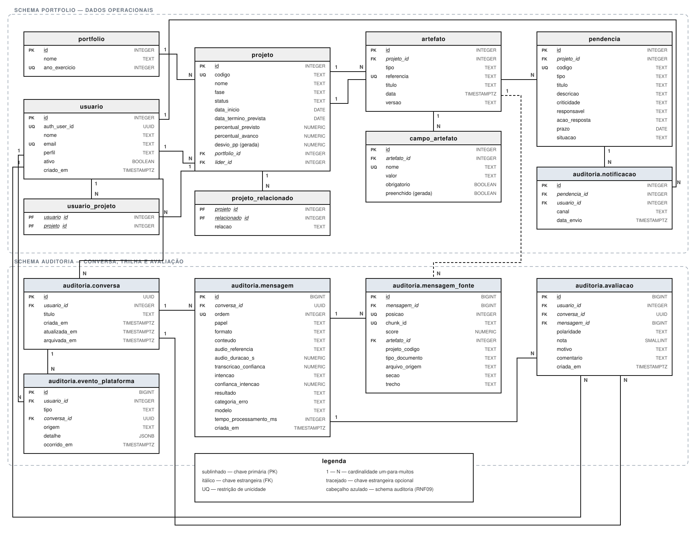<br>
  <sup>Fonte: Material produzido pelos autores, 2026.</sup>
</div>

#### Do conceito de Interação às tabelas `conversa` e `mensagem`

A entidade conceitual **Interação** representa "uma solicitação realizada pelo usuário". No modelo lógico ela se desdobra em duas tabelas, por três razões que só aparecem quando se desce ao nível da implementação.

A primeira é que o produto não trata solicitações isoladas, e sim **conversas**: a interface mantém uma barra lateral de conversas anteriores e envia um identificador de conversa a cada mensagem. Sem uma tabela que represente esse agrupamento, o histórico não teria onde existir.

A segunda é que a solicitação e a resposta precisam ser **registros de mesma natureza**. Uma tabela com uma linha por solicitação obriga a tratar a resposta como atributo da pergunta, o que impede atribuir a ela fontes, tempo de processamento e avaliação próprios. Modelando cada turno como uma linha — distinguida pela coluna `papel`, com valores `usuario` e `agente`, e ordenada por `ordem` dentro da conversa — pergunta e resposta ganham identidade própria, e as fontes passam a pender da resposta que elas fundamentam, que é onde o RF03 e o RNF12 as exigem.

A terceira é que o **texto da resposta precisa ser persistido**. O RNF12 estabelece que as afirmações factuais da resposta devem ser confrontadas com as fontes citadas, e o RNF04 exige que a interação permita relacionar "a resposta ou resultado". Um atributo categórico de desfecho — `sucesso`, `esclarecimento`, `recusada`, `falha` — informa como a solicitação terminou, mas não guarda o que foi afirmado ao usuário, e portanto não sustenta nenhuma das duas verificações. A coluna `mensagem.conteudo` guarda o texto de ambos os papéis: o prompt digitado, a transcrição do áudio enviado ou a resposta gerada.

#### Correspondência entre as modelagens

A tabela a seguir registra a correspondência entre cada elemento das modelagens anteriores e a estrutura relacional que o implementa, evidenciando que nenhuma regra de negócio foi perdida na tradução:

| Elemento de origem | Estrutura relacional | Regra de derivação aplicada |
|---|---|---|
| Entidade **Usuário** e especializações (2.2.1) | Tabela `usuario` com coluna `perfil` | Especializações sem atributos próprios colapsadas em coluna de domínio restrito por `CHECK` (decisão 1 da seção 3.6.7) |
| Entidade **Interação** | Tabelas `conversa` e `mensagem` | Entidade desdobrada em agrupamento e turno, conforme a justificativa acima (decisão 8 da seção 3.6.7) |
| **Usuário realiza Interação** `(0,n)`–`(1,1)` | `conversa.usuario_id NOT NULL` | Um-para-muitos vira chave estrangeira no lado "muitos"; mínimo 1 vira `NOT NULL`. A autoria da mensagem é herdada da conversa, evitando repetir o usuário em cada turno |
| **Interação consulta Artefato** `(0,n)`–`(0,n)` | Tabela `mensagem_fonte` | Muitos-para-muitos materializado com atributos próprios de posição, score e cópia dos metadados (decisão 9 da seção 3.6.7) |
| **Artefato documenta/pertence a Projeto** `(1,1)`–`(0,n)` | `artefato.projeto_id NOT NULL` | Um-para-muitos vira chave estrangeira, com cascata por se tratar de composição |
| **Artefato possui Campo Artefato** `(1,n)`–`(1,1)` | `campo_artefato.artefato_id NOT NULL` | Um-para-muitos vira chave estrangeira, com cascata e unicidade de `nome` por artefato |
| **Projeto pertence a Portfólio** `(1,1)`–`(1,n)` | `projeto.portfolio_id NOT NULL` | Um-para-muitos vira chave estrangeira |
| **Projeto origina Pendência** `(0,n)`–`(1,1)` | `pendencia.projeto_id NOT NULL` | Um-para-muitos vira chave estrangeira, com cascata por se tratar de composição |
| **LiderProjeto lidera Projeto** (2.2.1) | `projeto.lider_id NOT NULL` | O "1" do lado do líder na cardinalidade de `lidera` torna a chave estrangeira única e obrigatória em cada projeto |
| **Usuário acompanha Projeto** (2.2.1) | Tabela associativa `usuario_projeto` | Muitos-para-muitos vira tabela associativa |
| **Pendência notifica Usuário** (2.2.1) | Tabela `notificacao` | Muitos-para-muitos materializado como registro de envio, com atributo próprio `data_envio` (decisão 3 da seção 3.6.7) |
| Atributo de avaliação da Interação | Tabela `avaliacao` | Atributo promovido a entidade por possuir autor, instante e alvo próprios (decisão 10 da seção 3.6.7) |
| Uso da plataforma fora do agente | Tabela `evento_plataforma` | Estrutura nova, exigida pelo RNF09 e sem correspondência no recorte conceitual (decisão 11 da seção 3.6.7) |
| Dependências entre projetos declaradas na base | Tabela `projeto_relacionado` | Auto-relacionamento muitos-para-muitos sobre `projeto` (decisão 12 da seção 3.6.7) |

As cardinalidades mínimas do lado "muitos" — um portfólio reúne ao menos um projeto `(1,n)` e um artefato possui ao menos um campo `(1,n)` — não são expressáveis por restrições declarativas simples no modelo relacional, pois exigiriam verificação no momento da inserção da linha "pai". Essas duas regras permanecem documentadas como restrições de aplicação, a serem garantidas pela camada de serviços descrita na seção 2.4.

### 3.6.5 Dicionário de dados (modelo físico)

O dicionário a seguir descreve o modelo físico de cada tabela: colunas, tipos de dados do PostgreSQL e restrições de integridade. As chaves primárias substitutas usam `INTEGER` ou `BIGINT GENERATED ALWAYS AS IDENTITY`, forma recomendada pelo PostgreSQL para identificadores autoincrementais; a exceção é `conversa`, cuja chave é `UUID` pela razão registrada na decisão 8 da seção 3.6.7.

As tabelas distribuem-se em dois schemas, seguindo a separação definida no diagrama de componentes da seção 2.4 e adotada no processo de deploy da seção 3.7: o schema **`portfolio`** reúne os dados operacionais consultados pelo agente, e o schema **`auditoria`** reúne os registros de conversa, mensagem, fonte, avaliação, evento e notificação, que possuem padrão de escrita e requisito de imutabilidade distintos dos dados operacionais (decisão 7 da seção 3.6.7).

**`portfolio.portfolio`** — agrupamento de projetos de um exercício:

| Coluna | Tipo | Restrições | Finalidade |
|---|---|---|---|
| `id` | `INTEGER` | `PK`, identity | Identificador único do portfólio |
| `nome` | `TEXT` | `NOT NULL` | Denominação do portfólio |
| `ano_exercicio` | `INTEGER` | `NOT NULL`, `UNIQUE (nome, ano_exercicio)` | Exercício de referência; a unicidade composta impede a duplicação do mesmo portfólio no mesmo ano |

**`portfolio.usuario`** — profissional autorizado a utilizar o agente:

| Coluna | Tipo | Restrições | Finalidade |
|---|---|---|---|
| `id` | `INTEGER` | `PK`, identity | Identificador único do usuário |
| `auth_user_id` | `UUID` | `UNIQUE` | Identidade no provedor de SSO. Nula até a implementação do RNF02 (decisão 13 da seção 3.6.7) |
| `nome` | `TEXT` | `NOT NULL` | Nome do profissional |
| `email` | `TEXT` | `NOT NULL`, `UNIQUE` | Endereço corporativo de envio das notificações |
| `perfil` | `TEXT` | `NOT NULL`, `CHECK IN ('diretor', 'pmo', 'lider_projeto')` | Perfil profissional usado nas personas e relações do domínio; não concede permissões distintas no RNF02 |
| `ativo` | `BOOLEAN` | `NOT NULL`, `DEFAULT TRUE` | Desligamento lógico, preservando as conversas e a trilha do usuário |
| `criado_em` | `TIMESTAMPTZ` | `NOT NULL`, `DEFAULT now()` | Momento do cadastro |

**`portfolio.projeto`** — empreendimento acompanhado pelo PMO:

| Coluna | Tipo | Restrições | Finalidade |
|---|---|---|---|
| `id` | `INTEGER` | `PK`, identity | Identificador único do projeto |
| `codigo` | `TEXT` | `NOT NULL`, `UNIQUE` | Código institucional do empreendimento (chave natural) |
| `nome` | `TEXT` | `NOT NULL` | Denominação do empreendimento |
| `fase` | `TEXT` | `NOT NULL` | Fase do ciclo de vida: Iniciação, Execução, Encerramento |
| `status` | `TEXT` | `NOT NULL` | Situação corrente apurada pelo PMO |
| `data_inicio` | `DATE` | — | Data de início da execução |
| `data_termino_prevista` | `DATE` | — | Data prevista de conclusão, base da apuração de prazos |
| `percentual_previsto` | `NUMERIC(5,2)` | `NOT NULL`, `DEFAULT 0`, `CHECK (BETWEEN 0 AND 100)` | Avanço planejado para a data de referência |
| `percentual_avanco` | `NUMERIC(5,2)` | `NOT NULL`, `DEFAULT 0`, `CHECK (BETWEEN 0 AND 100)` | Grau de execução física realizado |
| `desvio_pp` | `NUMERIC(6,2)` | Coluna gerada (`GENERATED ALWAYS AS ... STORED`) | Desvio em pontos percentuais entre realizado e previsto (decisão 2 da seção 3.6.7) |
| `portfolio_id` | `INTEGER` | `FK → portfolio`, `NOT NULL` | Portfólio ao qual o projeto pertence |
| `lider_id` | `INTEGER` | `FK → usuario`, `NOT NULL` | Líder responsável, materialização de `lidera` |

**`portfolio.projeto_relacionado`** — dependências declaradas entre projetos:

| Coluna | Tipo | Restrições | Finalidade |
|---|---|---|---|
| `projeto_id` | `INTEGER` | `PK` composta, `FK → projeto`, `ON DELETE CASCADE` | Projeto de origem da relação |
| `relacionado_id` | `INTEGER` | `PK` composta, `FK → projeto`, `ON DELETE CASCADE`, `CHECK (<> projeto_id)` | Projeto relacionado |
| `relacao` | `TEXT` | `NOT NULL` | Natureza da dependência, como fornecimento de dados ou compartilhamento de recurso |

**`portfolio.artefato`** — documento que integra a documentação do projeto:

| Coluna | Tipo | Restrições | Finalidade |
|---|---|---|---|
| `id` | `INTEGER` | `PK`, identity | Identificador único do artefato |
| `projeto_id` | `INTEGER` | `FK → projeto`, `NOT NULL`, `ON DELETE CASCADE` | Projeto documentado (composição) |
| `tipo` | `TEXT` | `NOT NULL` | Natureza do documento, alinhada ao metadado `tipo_documento` do índice vetorial |
| `referencia` | `TEXT` | `NOT NULL`, `UNIQUE (projeto_id, referencia)` | Caminho relativo do documento no repositório, exibido como fonte no RF03 |
| `titulo` | `TEXT` | — | Denominação legível do documento |
| `data` | `TIMESTAMPTZ` | `NOT NULL` | Data da última atualização, exibida junto à fonte no RF03 |
| `versao` | `TEXT` | — | Versão vigente do documento |

**`portfolio.campo_artefato`** — campo individual de um artefato:

| Coluna | Tipo | Restrições | Finalidade |
|---|---|---|---|
| `id` | `INTEGER` | `PK`, identity | Identificador único do campo |
| `artefato_id` | `INTEGER` | `FK → artefato`, `NOT NULL`, `ON DELETE CASCADE` | Artefato ao qual o campo pertence (composição) |
| `nome` | `TEXT` | `NOT NULL`, `UNIQUE (artefato_id, nome)` | Rótulo do campo dentro do artefato |
| `valor` | `TEXT` | — | Conteúdo registrado; nulo ou vazio quando não preenchido |
| `obrigatorio` | `BOOLEAN` | `NOT NULL`, `DEFAULT FALSE` | Indica se o preenchimento é exigido |
| `preenchido` | `BOOLEAN` | Coluna gerada (`GENERATED ALWAYS AS ... STORED`) | Derivada de `valor`, elimina inconsistência entre valor e marcação (decisão 2 da seção 3.6.7) |

**`portfolio.pendencia`** — item em aberto originado por um projeto:

| Coluna | Tipo | Restrições | Finalidade |
|---|---|---|---|
| `id` | `INTEGER` | `PK`, identity | Identificador único da pendência |
| `projeto_id` | `INTEGER` | `FK → projeto`, `NOT NULL`, `ON DELETE CASCADE` | Projeto de origem (composição) |
| `codigo` | `TEXT` | `UNIQUE (projeto_id, codigo)` | Identificador do item na planilha de origem |
| `tipo` | `TEXT` | `NOT NULL` | Natureza da pendência; domínio exemplificativo mantido aberto, conforme a seção 2.2.1 |
| `titulo` | `TEXT` | `NOT NULL` | Enunciado curto do item |
| `descricao` | `TEXT` | `NOT NULL` | Detalhamento do item em aberto |
| `criticidade` | `TEXT` | — | Grau de criticidade apurado pelo PMO |
| `responsavel` | `TEXT` | — | Área responsável pelo tratamento |
| `acao_resposta` | `TEXT` | — | Ação de resposta planejada |
| `prazo` | `DATE` | — | Data limite para tratamento, base da notificação do RF05 |
| `situacao` | `TEXT` | `NOT NULL`, `DEFAULT 'aberta'`, `CHECK IN ('aberta', 'em_tratamento', 'materializada', 'resolvida')` | Estado corrente da pendência (decisão 14 da seção 3.6.7) |

**`portfolio.usuario_projeto`** — projetos acompanhados por cada usuário (associativa de `acompanha`):

| Coluna | Tipo | Restrições | Finalidade |
|---|---|---|---|
| `usuario_id` | `INTEGER` | `PK` composta, `FK → usuario`, `ON DELETE CASCADE` | Usuário interessado |
| `projeto_id` | `INTEGER` | `PK` composta, `FK → projeto`, `ON DELETE CASCADE` | Projeto acompanhado, base do RF05 |

**`auditoria.conversa`** — sequência de turnos entre um usuário e o agente:

| Coluna | Tipo | Restrições | Finalidade |
|---|---|---|---|
| `id` | `UUID` | `PK`, `DEFAULT gen_random_uuid()` | Identificador da conversa, gerado pelo cliente (decisão 8 da seção 3.6.7) |
| `usuario_id` | `INTEGER` | `FK → usuario`, `NOT NULL` | Autor da conversa; a autoria dos turnos é herdada daqui |
| `titulo` | `TEXT` | — | Rótulo exibido na barra lateral, derivado da primeira mensagem |
| `criada_em` | `TIMESTAMPTZ` | `NOT NULL`, `DEFAULT now()` | Momento de abertura |
| `atualizada_em` | `TIMESTAMPTZ` | `NOT NULL`, `DEFAULT now()` | Momento do último turno, mantido por gatilho |
| `arquivada_em` | `TIMESTAMPTZ` | — | Exclusão lógica. A linha permanece para atender à retenção do RNF09 |

**`auditoria.mensagem`** — turno da conversa, do usuário ou do agente (RNF04 e RNF09):

| Coluna | Tipo | Restrições | Finalidade |
|---|---|---|---|
| `id` | `BIGINT` | `PK`, identity | Identificador único do turno |
| `conversa_id` | `UUID` | `FK → conversa`, `NOT NULL` | Conversa à qual o turno pertence |
| `ordem` | `INTEGER` | `NOT NULL`, `CHECK (> 0)`, `UNIQUE (conversa_id, ordem)` | Posição do turno na conversa |
| `papel` | `TEXT` | `NOT NULL`, `CHECK IN ('usuario', 'agente')` | Autor do turno |
| `formato` | `TEXT` | `NOT NULL`, `CHECK IN ('texto', 'audio')` | Modalidade de entrada ou de saída, conforme o RF01 |
| `conteudo` | `TEXT` | `NOT NULL` | Texto do prompt, da transcrição ou da resposta |
| `audio_referencia` | `TEXT` | `CHECK` (apenas quando `formato = 'audio'`) | Identificador do áudio no armazenamento de objetos (`audio_id` da API da seção 3.4) |
| `audio_duracao_s` | `NUMERIC(8,2)` | `CHECK (>= 0)` | Duração do áudio, insumo do RNF06 |
| `transcricao_confianca` | `NUMERIC(5,4)` | `CHECK (BETWEEN 0 AND 1)` | Confiança devolvida pelo serviço de transcrição (RNF06) |
| `intencao` | `TEXT` | `CHECK` contra o catálogo da seção 3.1; apenas `papel = 'usuario'` | Intenção identificada pelo pipeline de PLN; nula quando a classificação falha |
| `confianca_intencao` | `NUMERIC(5,4)` | `CHECK (BETWEEN 0 AND 1)`; apenas `papel = 'usuario'` | Confiança da classificação, base do limiar do RNF03 |
| `resultado` | `TEXT` | `CHECK IN ('sucesso', 'esclarecimento', 'recusada', 'falha')`; obrigatório em `papel = 'agente'` | Desfecho da solicitação |
| `categoria_erro` | `TEXT` | apenas `papel = 'agente'` | Categoria do erro, quando aplicável (RNF09) |
| `modelo` | `TEXT` | apenas `papel = 'agente'` | Modelo de linguagem que gerou a resposta |
| `tempo_processamento_ms` | `INTEGER` | `CHECK (>= 0)`; apenas `papel = 'agente'` | Tempo de processamento, insumo da verificação do RNF01 |
| `criada_em` | `TIMESTAMPTZ` | `NOT NULL`, `DEFAULT now()` | Data e hora do turno |

Duas restrições de tabela garantem a coerência entre papel e colunas: `mensagem_audio_coerente` impede referenciar áudio em mensagem de texto, e `mensagem_papel_coerente` anula, em cada papel, as colunas que pertencem ao outro — de modo que o banco não admite uma resposta do agente com intenção classificada nem um prompt do usuário com tempo de processamento.

**`auditoria.mensagem_fonte`** — fontes que fundamentaram uma resposta (associativa de `consulta`):

| Coluna | Tipo | Restrições | Finalidade |
|---|---|---|---|
| `id` | `BIGINT` | `PK`, identity | Identificador único da citação |
| `mensagem_id` | `BIGINT` | `FK → mensagem`, `NOT NULL`, `ON DELETE CASCADE` | Resposta que citou a fonte |
| `posicao` | `INTEGER` | `NOT NULL`, `CHECK (> 0)`, `UNIQUE (mensagem_id, posicao)` | Ordem de relevância devolvida pelo recuperador |
| `chunk_id` | `TEXT` | `NOT NULL`, `UNIQUE (mensagem_id, chunk_id)` | Identificador do trecho no índice vetorial, sem chave estrangeira (decisão 9 da seção 3.6.7) |
| `score` | `NUMERIC(7,6)` | — | Similaridade apurada na recuperação |
| `artefato_id` | `INTEGER` | `FK → artefato` | Artefato correspondente, quando existe (RF03) |
| `projeto_codigo` | `TEXT` | — | Cópia do projeto de origem no momento da resposta |
| `tipo_documento` | `TEXT` | — | Cópia do tipo do documento no momento da resposta |
| `arquivo_origem` | `TEXT` | `NOT NULL` | Cópia do localizador do documento no momento da resposta |
| `secao` | `TEXT` | — | Cópia da seção do documento no momento da resposta |
| `trecho` | `TEXT` | — | Cópia do texto citado, base da verificação do RNF12 |

**`auditoria.avaliacao`** — juízo do usuário sobre uma resposta ou sobre a conversa:

| Coluna | Tipo | Restrições | Finalidade |
|---|---|---|---|
| `id` | `BIGINT` | `PK`, identity | Identificador único da avaliação |
| `usuario_id` | `INTEGER` | `FK → usuario`, `NOT NULL` | Autor da avaliação |
| `conversa_id` | `UUID` | `FK → conversa` | Alvo, quando a avaliação recai sobre a conversa inteira |
| `mensagem_id` | `BIGINT` | `FK → mensagem` | Alvo, quando a avaliação recai sobre uma resposta |
| `polaridade` | `TEXT` | `CHECK IN ('positiva', 'negativa')` | Juízo binário, correspondente ao polegar da interface |
| `nota` | `SMALLINT` | `CHECK (BETWEEN 1 AND 5)` | Juízo graduado |
| `motivo` | `TEXT` | `CHECK` contra domínio fechado de sete valores | Categoria da avaliação, base da análise agregada |
| `comentario` | `TEXT` | — | Justificativa livre |
| `criada_em` | `TIMESTAMPTZ` | `NOT NULL`, `DEFAULT now()` | Momento da avaliação |

Duas restrições delimitam o registro: `avaliacao_alvo_unico` exige que a avaliação recaia sobre exatamente um alvo, mensagem ou conversa; e `avaliacao_tem_juizo` exige polaridade ou nota, impedindo que um comentário isolado seja contabilizado como avaliação. Dois índices únicos parciais garantem uma avaliação por usuário por alvo, de modo que reavaliar seja atualização e não acúmulo de linhas.

**`auditoria.evento_plataforma`** — uso da plataforma fora do diálogo com o agente:

| Coluna | Tipo | Restrições | Finalidade |
|---|---|---|---|
| `id` | `BIGINT` | `PK`, identity | Identificador único do evento |
| `usuario_id` | `INTEGER` | `FK → usuario` | Usuário do evento; nulo quando a identidade não foi resolvida |
| `tipo` | `TEXT` | `NOT NULL`, `CHECK` contra domínio fechado de dez valores | Natureza do evento, de `login` a `erro_aplicacao` |
| `conversa_id` | `UUID` | `FK → conversa` | Conversa envolvida, quando aplicável |
| `origem` | `TEXT` | `CHECK IN ('web', 'api', 'agendador')` | Canal que originou o evento |
| `detalhe` | `JSONB` | `NOT NULL`, `DEFAULT '{}'` | Contexto livre. Proibido armazenar senhas, tokens ou segredos (RNF09) |
| `ocorrido_em` | `TIMESTAMPTZ` | `NOT NULL`, `DEFAULT now()` | Momento do evento |

**`auditoria.notificacao`** — registro dos envios da notificação proativa (materialização de `notifica`):

| Coluna | Tipo | Restrições | Finalidade |
|---|---|---|---|
| `id` | `INTEGER` | `PK`, identity | Identificador único do envio |
| `pendencia_id` | `INTEGER` | `FK → pendencia`, `NOT NULL`, `ON DELETE CASCADE` | Pendência comunicada |
| `usuario_id` | `INTEGER` | `FK → usuario`, `NOT NULL`, `UNIQUE (pendencia_id, usuario_id)` | Destinatário; a unicidade composta impede notificar duas vezes a mesma pendência ao mesmo usuário |
| `canal` | `TEXT` | `NOT NULL`, `DEFAULT 'email'`, `CHECK IN ('email', 'interface')` | Meio pelo qual o alerta foi entregue |
| `data_envio` | `TIMESTAMPTZ` | `NOT NULL`, `DEFAULT now()` | Momento do envio, exigido pelo RNF09 |

#### Visões de leitura

Duas visões evitam que cada consumidor reescreva as mesmas junções — e que cada um as escreva de forma diferente:

| Visão | Conteúdo | Uso |
|---|---|---|
| `auditoria.vw_turno` | Um par prompt/resposta por linha, com intenção, desfecho, tempo, contagem de fontes e avaliação | Tela de histórico e inspeção do RNF04 |
| `portfolio.vw_projeto_situacao` | Situação consolidada de cada projeto, com portfólio, líder, desvio, pendências abertas e artefatos | Consultas comparativas do RF02 |

### 3.6.6 Definição física em SQL

A definição a seguir implementa o modelo no PostgreSQL, banco definido na seção 2.5. A ordem de criação respeita as dependências entre as tabelas, e os índices finais cobrem os acessos mais frequentes identificados nos cenários da seção 2.2.2.

O script executável, com os comentários de justificativa por coluna, é [`src/database/01_create_database.sql`](../src/database/01_create_database.sql), e **é ele que vale como fonte de verdade**. O bloco abaixo é a transcrição do mesmo modelo, sem os comentários longos. A coerência entre os dois e o banco em execução é verificável por `scripts/verificar_modelo_documentado.py`, descrito ao final desta subseção. A pasta [`src/database`](../src/database/README.md) reúne também a carga inicial, as políticas de acesso e o roteiro de verificação.

```sql
CREATE SCHEMA portfolio;
CREATE SCHEMA auditoria;
CREATE EXTENSION IF NOT EXISTS pgcrypto;

CREATE TABLE portfolio.portfolio (
    id            INTEGER GENERATED ALWAYS AS IDENTITY PRIMARY KEY,
    nome          TEXT    NOT NULL,
    ano_exercicio INTEGER NOT NULL,
    UNIQUE (nome, ano_exercicio)
);

CREATE TABLE portfolio.usuario (
    id           INTEGER GENERATED ALWAYS AS IDENTITY PRIMARY KEY,
    auth_user_id UUID UNIQUE,
    nome         TEXT NOT NULL,
    email        TEXT NOT NULL UNIQUE,
    perfil       TEXT NOT NULL
                 CHECK (perfil IN ('diretor', 'pmo', 'lider_projeto')),
    ativo        BOOLEAN     NOT NULL DEFAULT TRUE,
    criado_em    TIMESTAMPTZ NOT NULL DEFAULT now()
);

CREATE TABLE portfolio.projeto (
    id                    INTEGER GENERATED ALWAYS AS IDENTITY PRIMARY KEY,
    codigo                TEXT NOT NULL UNIQUE,
    nome                  TEXT NOT NULL,
    fase                  TEXT NOT NULL,
    status                TEXT NOT NULL,
    data_inicio           DATE,
    data_termino_prevista DATE,
    percentual_previsto   NUMERIC(5,2) NOT NULL DEFAULT 0
                          CHECK (percentual_previsto BETWEEN 0 AND 100),
    percentual_avanco     NUMERIC(5,2) NOT NULL DEFAULT 0
                          CHECK (percentual_avanco BETWEEN 0 AND 100),
    desvio_pp             NUMERIC(6,2) GENERATED ALWAYS AS
                          (percentual_avanco - percentual_previsto) STORED,
    portfolio_id          INTEGER NOT NULL REFERENCES portfolio.portfolio (id),
    lider_id              INTEGER NOT NULL REFERENCES portfolio.usuario (id)
);

CREATE TABLE portfolio.projeto_relacionado (
    projeto_id     INTEGER NOT NULL REFERENCES portfolio.projeto (id) ON DELETE CASCADE,
    relacionado_id INTEGER NOT NULL REFERENCES portfolio.projeto (id) ON DELETE CASCADE,
    relacao        TEXT    NOT NULL,
    PRIMARY KEY (projeto_id, relacionado_id),
    CHECK (projeto_id <> relacionado_id)
);

CREATE TABLE portfolio.artefato (
    id         INTEGER GENERATED ALWAYS AS IDENTITY PRIMARY KEY,
    projeto_id INTEGER NOT NULL REFERENCES portfolio.projeto (id) ON DELETE CASCADE,
    tipo       TEXT NOT NULL,
    referencia TEXT NOT NULL,
    titulo     TEXT,
    data       TIMESTAMPTZ NOT NULL,
    versao     TEXT,
    UNIQUE (projeto_id, referencia)
);

CREATE TABLE portfolio.campo_artefato (
    id          INTEGER GENERATED ALWAYS AS IDENTITY PRIMARY KEY,
    artefato_id INTEGER NOT NULL REFERENCES portfolio.artefato (id) ON DELETE CASCADE,
    nome        TEXT NOT NULL,
    valor       TEXT,
    obrigatorio BOOLEAN NOT NULL DEFAULT FALSE,
    preenchido  BOOLEAN GENERATED ALWAYS AS
                (valor IS NOT NULL AND btrim(valor) <> '') STORED,
    UNIQUE (artefato_id, nome)
);

CREATE TABLE portfolio.pendencia (
    id            INTEGER GENERATED ALWAYS AS IDENTITY PRIMARY KEY,
    projeto_id    INTEGER NOT NULL REFERENCES portfolio.projeto (id) ON DELETE CASCADE,
    codigo        TEXT,
    tipo          TEXT NOT NULL,
    titulo        TEXT NOT NULL,
    descricao     TEXT NOT NULL,
    criticidade   TEXT,
    responsavel   TEXT,
    acao_resposta TEXT,
    prazo         DATE,
    situacao      TEXT NOT NULL DEFAULT 'aberta'
                  CHECK (situacao IN ('aberta', 'em_tratamento',
                                      'materializada', 'resolvida')),
    UNIQUE (projeto_id, codigo)
);

CREATE TABLE portfolio.usuario_projeto (
    usuario_id INTEGER NOT NULL REFERENCES portfolio.usuario (id) ON DELETE CASCADE,
    projeto_id INTEGER NOT NULL REFERENCES portfolio.projeto (id) ON DELETE CASCADE,
    PRIMARY KEY (usuario_id, projeto_id)
);

CREATE TABLE auditoria.conversa (
    id            UUID PRIMARY KEY DEFAULT gen_random_uuid(),
    usuario_id    INTEGER NOT NULL REFERENCES portfolio.usuario (id),
    titulo        TEXT,
    criada_em     TIMESTAMPTZ NOT NULL DEFAULT now(),
    atualizada_em TIMESTAMPTZ NOT NULL DEFAULT now(),
    arquivada_em  TIMESTAMPTZ
);

CREATE TABLE auditoria.mensagem (
    id                     BIGINT GENERATED ALWAYS AS IDENTITY PRIMARY KEY,
    conversa_id            UUID    NOT NULL REFERENCES auditoria.conversa (id),
    ordem                  INTEGER NOT NULL CHECK (ordem > 0),
    papel                  TEXT    NOT NULL CHECK (papel IN ('usuario', 'agente')),
    formato                TEXT    NOT NULL CHECK (formato IN ('texto', 'audio')),
    conteudo               TEXT    NOT NULL,
    audio_referencia       TEXT,
    audio_duracao_s        NUMERIC(8,2) CHECK (audio_duracao_s >= 0),
    transcricao_confianca  NUMERIC(5,4) CHECK (transcricao_confianca BETWEEN 0 AND 1),
    intencao               TEXT CHECK (intencao IN (
                               'consultar_documentos_normativos',
                               'consultar_projeto_sintetico',
                               'orientar_mapa_beneficios',
                               'orientar_tap',
                               'orientar_entregas_cronograma',
                               'orientar_avanco_mensal',
                               'orientar_riscos_problemas',
                               'analisar_completude_coerencia',
                               'gerar_alertas_pendencias',
                               'fora_do_catalogo')),
    confianca_intencao     NUMERIC(5,4) CHECK (confianca_intencao BETWEEN 0 AND 1),
    resultado              TEXT CHECK (resultado IN
                               ('sucesso', 'esclarecimento', 'recusada', 'falha')),
    categoria_erro         TEXT,
    modelo                 TEXT,
    tempo_processamento_ms INTEGER CHECK (tempo_processamento_ms >= 0),
    criada_em              TIMESTAMPTZ NOT NULL DEFAULT now(),
    UNIQUE (conversa_id, ordem),
    CONSTRAINT mensagem_audio_coerente CHECK (
        (formato = 'audio') OR
        (audio_referencia IS NULL AND audio_duracao_s IS NULL
         AND transcricao_confianca IS NULL)
    ),
    CONSTRAINT mensagem_papel_coerente CHECK (
        CASE papel
            WHEN 'usuario' THEN
                resultado IS NULL AND categoria_erro IS NULL
                AND modelo IS NULL AND tempo_processamento_ms IS NULL
            WHEN 'agente' THEN
                intencao IS NULL AND confianca_intencao IS NULL
                AND resultado IS NOT NULL
        END
    )
);

CREATE TABLE auditoria.mensagem_fonte (
    id             BIGINT GENERATED ALWAYS AS IDENTITY PRIMARY KEY,
    mensagem_id    BIGINT  NOT NULL REFERENCES auditoria.mensagem (id) ON DELETE CASCADE,
    posicao        INTEGER NOT NULL CHECK (posicao > 0),
    chunk_id       TEXT    NOT NULL,
    score          NUMERIC(7,6),
    artefato_id    INTEGER REFERENCES portfolio.artefato (id),
    projeto_codigo TEXT,
    tipo_documento TEXT,
    arquivo_origem TEXT NOT NULL,
    secao          TEXT,
    trecho         TEXT,
    UNIQUE (mensagem_id, chunk_id),
    UNIQUE (mensagem_id, posicao)
);

CREATE TABLE auditoria.avaliacao (
    id          BIGINT GENERATED ALWAYS AS IDENTITY PRIMARY KEY,
    usuario_id  INTEGER NOT NULL REFERENCES portfolio.usuario (id),
    conversa_id UUID   REFERENCES auditoria.conversa (id),
    mensagem_id BIGINT REFERENCES auditoria.mensagem (id),
    polaridade  TEXT CHECK (polaridade IN ('positiva', 'negativa')),
    nota        SMALLINT CHECK (nota BETWEEN 1 AND 5),
    motivo      TEXT CHECK (motivo IN (
                    'resposta_incorreta', 'fonte_irrelevante',
                    'resposta_incompleta', 'nao_entendeu_pergunta',
                    'demorou_demais', 'resposta_util', 'outro')),
    comentario  TEXT,
    criada_em   TIMESTAMPTZ NOT NULL DEFAULT now(),
    CONSTRAINT avaliacao_alvo_unico
        CHECK (num_nonnulls(conversa_id, mensagem_id) = 1),
    CONSTRAINT avaliacao_tem_juizo
        CHECK (polaridade IS NOT NULL OR nota IS NOT NULL)
);

CREATE UNIQUE INDEX uq_avaliacao_mensagem
    ON auditoria.avaliacao (usuario_id, mensagem_id) WHERE mensagem_id IS NOT NULL;
CREATE UNIQUE INDEX uq_avaliacao_conversa
    ON auditoria.avaliacao (usuario_id, conversa_id) WHERE conversa_id IS NOT NULL;

CREATE TABLE auditoria.evento_plataforma (
    id          BIGINT GENERATED ALWAYS AS IDENTITY PRIMARY KEY,
    usuario_id  INTEGER REFERENCES portfolio.usuario (id),
    tipo        TEXT NOT NULL CHECK (tipo IN (
                    'login', 'login_falho', 'logout',
                    'conversa_criada', 'conversa_renomeada',
                    'conversa_arquivada', 'conversa_exportada',
                    'audio_enviado', 'audio_recusado', 'erro_aplicacao')),
    conversa_id UUID REFERENCES auditoria.conversa (id),
    origem      TEXT CHECK (origem IN ('web', 'api', 'agendador')),
    detalhe     JSONB NOT NULL DEFAULT '{}'::jsonb,
    ocorrido_em TIMESTAMPTZ NOT NULL DEFAULT now()
);

CREATE TABLE auditoria.notificacao (
    id           INTEGER GENERATED ALWAYS AS IDENTITY PRIMARY KEY,
    pendencia_id INTEGER NOT NULL REFERENCES portfolio.pendencia (id) ON DELETE CASCADE,
    usuario_id   INTEGER NOT NULL REFERENCES portfolio.usuario (id),
    canal        TEXT NOT NULL DEFAULT 'email'
                 CHECK (canal IN ('email', 'interface')),
    data_envio   TIMESTAMPTZ NOT NULL DEFAULT now(),
    UNIQUE (pendencia_id, usuario_id)
);

-- Proteção dos registros de auditoria (RNF09)
REVOKE UPDATE, DELETE ON auditoria.mensagem, auditoria.mensagem_fonte,
                         auditoria.evento_plataforma, auditoria.notificacao
    FROM PUBLIC;
REVOKE DELETE ON auditoria.conversa, auditoria.avaliacao FROM PUBLIC;

-- As duas atualizações permitidas, concedidas em nível de coluna ao papel da
-- aplicação em 03_rls_policies.sql, não reescrevem nenhum registro:
-- GRANT UPDATE (titulo, atualizada_em, arquivada_em)  ON auditoria.conversa  TO az1_app;
-- GRANT UPDATE (polaridade, nota, motivo, comentario) ON auditoria.avaliacao TO az1_app;

-- Índices dos acessos frequentes dos cenários da seção 2.2.2
CREATE INDEX idx_projeto_portfolio       ON portfolio.projeto (portfolio_id);
CREATE INDEX idx_projeto_lider           ON portfolio.projeto (lider_id);
CREATE INDEX idx_artefato_projeto        ON portfolio.artefato (projeto_id);
CREATE INDEX idx_campo_artefato_artefato ON portfolio.campo_artefato (artefato_id);
CREATE INDEX idx_pendencia_verificacao   ON portfolio.pendencia (situacao, prazo);
CREATE INDEX idx_pendencia_projeto       ON portfolio.pendencia (projeto_id);
CREATE INDEX idx_conversa_usuario_recente
    ON auditoria.conversa (usuario_id, atualizada_em DESC)
    WHERE arquivada_em IS NULL;
CREATE INDEX idx_mensagem_conversa_ordem ON auditoria.mensagem (conversa_id, ordem);
CREATE INDEX idx_mensagem_criada_em      ON auditoria.mensagem (criada_em);
CREATE INDEX idx_mensagem_intencao       ON auditoria.mensagem (intencao)
    WHERE intencao IS NOT NULL;
CREATE INDEX idx_mensagem_fonte_mensagem ON auditoria.mensagem_fonte (mensagem_id);
CREATE INDEX idx_mensagem_fonte_chunk    ON auditoria.mensagem_fonte (chunk_id);
CREATE INDEX idx_mensagem_fonte_artefato ON auditoria.mensagem_fonte (artefato_id)
    WHERE artefato_id IS NOT NULL;
CREATE INDEX idx_evento_usuario_data     ON auditoria.evento_plataforma (usuario_id, ocorrido_em);
CREATE INDEX idx_evento_tipo_data        ON auditoria.evento_plataforma (tipo, ocorrido_em);
```

O gatilho `trg_mensagem_toca_conversa` mantém `conversa.atualizada_em` alinhada ao instante do último turno, de modo que a ordenação da barra lateral não dependa de a aplicação lembrar de atualizar a coluna. As visões `auditoria.vw_turno` e `portfolio.vw_projeto_situacao`, descritas na seção 3.6.5, são criadas na sequência.

#### Verificação da coerência entre documento, script e banco

O risco desta subseção é conhecido: uma definição transcrita em documento envelhece em silêncio quando o banco muda. Para que a divergência apareça como falha, e não como surpresa em uma sprint futura, o script `scripts/verificar_modelo_documentado.py` extrai o bloco SQL acima, extrai o de `src/database/01_create_database.sql` e compara ambos com o `information_schema` do banco em execução, apontando tabelas e colunas presentes em um lado e ausentes no outro:

```bash
python scripts/verificar_modelo_documentado.py
```

A verificação faz parte do procedimento de teste do RNF04 e integra o caso `TI-29` da seção 6.4.4.

### 3.6.7 Decisões de modelagem e restrições de integridade

As decisões estruturais do modelo, com as alternativas consideradas e as razões da escolha, são registradas a seguir.

**Decisão 1 — Perfis de usuário por coluna de domínio, e não por tabelas de subtipo.** A generalização de Usuário da seção 2.2.1 poderia ser mapeada em tabelas de subtipo (`diretor`, `pmo`, `lider_projeto` com chave primária compartilhada). A opção pela coluna `perfil` com `CHECK` preserva a classificação profissional usada pelas personas e pelas relações do domínio sem criar tabelas de subtipo vazias. O líder continua relacionado aos projetos pela chave `projeto.lider_id` e pelo vínculo de `usuario_projeto`; diretor e PMO permanecem como perfis descritivos. Nenhum desses valores concede permissões diferentes: o RNF02 limita-se à autenticação por SSO, e a identificação administrativa prevista no RNF09 é fornecida pelo mecanismo de autenticação.

**Decisão 2 — Colunas derivadas geradas pelo banco.** Se `campo_artefato.preenchido` fosse um booleano comum, o banco admitiria estados inconsistentes, como um campo com valor registrado e marcado como não preenchido. Como coluna gerada a partir de `valor`, a marcação é sempre verdadeira por construção, o que garante a confiabilidade da identificação de campos pendentes que alimenta o RF04 e o RF05. O mesmo raciocínio se aplica a `projeto.desvio_pp`, derivada de `percentual_avanco` e `percentual_previsto`: é o número que a persona do Diretor pede diretamente na jornada 1.5.1, e mantê-lo como coluna comum permitiria que divergisse das duas colunas que o produzem.

**Decisão 3 — `notificacao` como registro de envio.** A relação `notifica` poderia ser apenas derivada: os destinatários de uma pendência são os usuários que acompanham o projeto de origem. A materialização em tabela foi escolhida porque o RNF09 exige o registro dos eventos de notificação, e porque a unicidade composta `(pendencia_id, usuario_id)` dá ao Agendador do cenário 3 um critério idempotente, impedindo que a mesma pendência seja comunicada repetidamente ao mesmo usuário a cada verificação periódica.

**Decisão 4 — Intenção como domínio de coluna, e não como tabela.** O catálogo de intenções da seção 3.1 poderia ser normalizado em uma tabela própria. A opção pelo `CHECK` na coluna `mensagem.intencao` mantém a coerência com a delimitação do modelo conceitual, que tratou intenção como conceito da camada técnica de PLN, e não como entidade do domínio de portfólio. O custo da escolha é que a evolução do catálogo exige alteração da restrição; o benefício é não introduzir no banco uma entidade sem respaldo nas modelagens anteriores. A restrição deve ser mantida sincronizada com o catálogo da seção 3.1 e com `pln/classificador.py`.

**Decisão 5 — Chaves substitutas com chave natural preservada.** As tabelas do domínio usam identificadores substitutos gerados pelo banco, o que mantém as chaves estrangeiras compactas e estáveis. O código institucional do projeto, único identificador declarado na seção 2.2.1, é preservado como restrição `UNIQUE`, permanecendo utilizável nas consultas por linguagem natural sem servir de chave de referência.

**Decisão 6 — Cascatas apenas nas composições, com exceção deliberada na auditoria.** As exclusões em cascata seguem exatamente a distinção entre agregação e composição da seção 2.2.1: excluir um projeto remove seus artefatos, campos e pendências, que não fazem sentido isoladamente; excluir um portfólio, por sua vez, é bloqueado enquanto houver projetos, pois o projeto mantém identidade própria. A exceção é a trilha de auditoria: `auditoria.mensagem_fonte` referencia `portfolio.artefato` sem cascata, de modo que um artefato citado como fonte de uma resposta registrada não pode ser excluído sem tratamento explícito. O comportamento é intencional: o relacionamento preserva a rastreabilidade do RNF04, enquanto o comando `REVOKE UPDATE, DELETE` sobre as tabelas de auditoria implementa a proteção exigida pelo RNF09.

**Decisão 7 — Separação em schemas `portfolio` e `auditoria`.** O diagrama de componentes da seção 2.4 determina que os logs de auditoria sejam mantidos "separados dos dados operacionais para facilitar controle de acesso e auditoria", e o processo de deploy da seção 3.7 concentra a persistência em um banco relacional único. A separação por schema concilia as duas exigências: um único banco, com as tabelas operacionais no schema `portfolio` e as de trilha no schema `auditoria`, onde o controle de permissões pode ser aplicado ao schema inteiro sem afetar os dados de negócio. A tabela `notificacao` integra o schema de auditoria por ser um registro de envio: a seção 2.5 lista os alertas gerados entre as informações a auditar, e o Agendador do cenário 3 precisa apenas de inserção e leitura, operações compatíveis com a imutabilidade do schema.

**Decisão 8 — Interação desdobrada em `conversa` e `mensagem`, com um turno por linha.** A alternativa era manter uma tabela única de interação, com uma linha por solicitação e a resposta como atributo dela. Foi descartada por três motivos, desenvolvidos na seção 3.6.4: o produto trabalha com conversas e não com solicitações isoladas; a resposta precisa de identidade própria para receber fontes, tempo e avaliação; e o texto da resposta precisa ser persistido, sem o que o RNF12 não é verificável. A chave de `conversa` é `UUID` porque o identificador nasce no cliente — a interface o gera antes de a primeira mensagem existir e o envia em cada requisição de chat —, de modo que uma chave sequencial gerada pelo banco exigiria uma ida e volta adicional apenas para descobrir o valor que o cliente já escolheu. A coerência entre papel e colunas é imposta pelo banco, e não pela aplicação: `mensagem_papel_coerente` recusa uma resposta do agente com intenção classificada e um prompt do usuário com tempo de processamento.

**Decisão 9 — Fonte registrada por cópia, e sem chave estrangeira para o índice vetorial.** O conteúdo dos documentos é recuperado do índice vetorial descrito na seção 2.5, no qual cada trecho é identificado por uma soma de verificação do próprio conteúdo. Declarar `mensagem_fonte.chunk_id` como chave estrangeira para esse índice foi considerado e descartado: reindexar um documento produz identificadores novos, e a restrição obrigaria a escolher entre impedir a reindexação e apagar registros de auditoria, ambas incompatíveis com a imutabilidade do RNF09. Pela mesma razão, os metadados da fonte — arquivo de origem, seção, projeto e o próprio trecho citado — são copiados no instante da resposta, e não lidos por junção: a fonte apresentada ao usuário precisa continuar legível na auditoria mesmo depois de o documento ser reindexado, movido ou retirado do índice. A coluna `artefato_id` permanece opcional, o que resolve a limitação registrada adiante nesta seção: uma resposta fundamentada em documento normativo, que não pertence a projeto algum, tem fonte registrada com vínculo relacional nulo e metadados preenchidos.

**Decisão 10 — Avaliação como entidade, e não como atributo da interação.** A avaliação poderia ser uma coluna de texto na própria mensagem. A promoção a tabela decorre de a avaliação ter autor, instante e alvo próprios: ela é produzida depois da resposta, possivelmente por caminho distinto, e pode recair sobre uma resposta específica ou sobre a conversa inteira. Como coluna, não haveria onde registrar quem avaliou nem quando, e não seria possível correlacionar avaliação negativa com intenção classificada, fontes citadas ou tempo de processamento — correlação que é o insumo da melhoria do agente e da leitura do RNF08. A tabela admite juízo binário e graduado simultaneamente porque a interface oferece o polegar e a rubrica de usabilidade pede escala; `avaliacao_tem_juizo` garante que ao menos um dos dois exista, e `avaliacao_alvo_unico` impede o registro ambíguo que aponta para conversa e mensagem ao mesmo tempo.

**Decisão 11 — Eventos de plataforma separados dos turnos da conversa.** Login, abertura, renomeação e arquivamento de conversa poderiam ser registrados como linhas de `mensagem` com um papel adicional. Foram separados porque respondem a outra pergunta: `mensagem` responde "o que o agente respondeu e com base em quê", enquanto `evento_plataforma` responde "quem esteve na plataforma e o que fez". Misturá-los contaminaria as métricas do RNF01 e do RNF03, que contam turnos, e obrigaria toda consulta de conversa a filtrar registros que não são conversa. A coluna `detalhe`, do tipo `JSONB`, admite contexto livre por evento e é, por isso, o ponto de maior risco de violação da proibição de armazenar segredos do RNF09 — restrição que o procedimento de teste da seção 6.3.4 verifica explicitamente.

**Decisão 12 — Dependências entre projetos como auto-relacionamento.** A planilha de portfólio declara relações entre projetos, como fornecimento de dados de monitoramento e compartilhamento de recurso técnico. Sem a tabela `projeto_relacionado`, essa informação existiria apenas no texto vetorizado e o banco não conseguiria responder a consultas de impacto cruzado, do tipo "o que depende deste projeto?", que são justamente as que a jornada do Diretor exercita. A relação é direcionada e a restrição `CHECK (projeto_id <> relacionado_id)` impede o auto-vínculo.

**Decisão 13 — Identidade de autenticação como coluna preparada, sem chave estrangeira imediata.** O RNF02 exige autenticação por SSO, cuja implementação pertence a outra frente. Para que o modelo não precise ser alterado quando ela chegar, `usuario.auth_user_id` já existe e é o ponto único de ligação com o provedor; a função `portfolio.usuario_atual()`, definida em `src/database/03_rls_policies.sql`, traduz a identidade autenticada para a chave do usuário e é atravessada por todas as políticas de acesso, de modo que nenhuma delas precisará ser reescrita. A coluna não foi declarada como chave estrangeira desde já porque isso impediria cadastrar usuários antes de existirem contas no provedor, o que é justamente a situação da base sintética; a promoção a chave estrangeira é um comando único, registrado no `README.md` da pasta `src/database`. Nenhuma senha, token ou segredo é armazenado, conforme o RNF09: o provedor detém a credencial e o banco guarda apenas a correspondência.

**Decisão 14 — Estado `materializada` acrescentado ao domínio de `pendencia.situacao`.** O domínio inicialmente previsto continha três estados: aberta, em tratamento e resolvida. As planilhas de riscos e problemas da base sintética usam um quarto estado para o risco que se concretizou, e mapeá-lo para um dos três existentes faria a resposta produzida a partir do banco divergir da resposta produzida a partir do mesmo documento no índice vetorial — precisamente a incoerência que o RNF12 mede. O domínio foi ampliado em vez de a informação ser colapsada. Pela mesma razão foram preservadas as colunas `codigo`, `titulo`, `criticidade`, `responsavel` e `acao_resposta`, presentes na origem e sem as quais a resposta do agente seria mais pobre que o documento que a fundamenta.

**Limitação registrada — documentos normativos.** A intenção INT-01 do catálogo da seção 3.1 consulta conceitos e normativos de gestão de portfólio, documentos que não pertencem a nenhum projeto específico. Pelo modelo conceitual e pela seção 2.2.1, todo artefato compõe exatamente um projeto, portanto a base de normativos permanece fora da tabela `artefato`, no repositório de arquivos independente descrito na seção 2.5. A consequência, que na modelagem anterior era assumida como perda, é resolvida pela decisão 9: a coluna `mensagem_fonte.artefato_id` é opcional e as demais colunas guardam a cópia dos metadados, de modo que a fonte de uma resposta normativa é registrada com a mesma estrutura das demais, apenas sem vínculo relacional. Se a base de normativos evoluir para dado estruturado, a modelagem de uma entidade própria deverá ser reavaliada junto com o modelo conceitual.

**Normalização.** O modelo está na terceira forma normal: todas as tabelas têm chave primária definida, os atributos são atômicos e nenhum atributo não chave depende de outro atributo não chave. Há duas redundâncias deliberadas, ambas justificadas acima e nenhuma delas configurando anomalia de atualização: as colunas geradas `preenchido` e `desvio_pp`, mantidas pelo próprio banco a partir de colunas da mesma linha (decisão 2); e a cópia dos metadados da fonte em `mensagem_fonte`, que não é redundância de estado e sim registro histórico — o valor copiado descreve o que era verdade no instante da resposta, e deve permanecer imune a mudanças posteriores na origem (decisão 9).

Por fim, a tabela a seguir consolida a rastreabilidade entre as estruturas do modelo e os requisitos que elas sustentam, no mesmo formato adotado nas seções anteriores:

| Estrutura do modelo | Requisitos sustentados | Papel |
|---|---|---|
| `usuario.perfil` | Personas e RF06 | Identifica o perfil profissional sem estabelecer autorização por cargo |
| `usuario.auth_user_id` | RNF02 | Ponto único de ligação com o provedor de SSO, sem armazenar credencial |
| `projeto.lider_id` | RF06 | Identifica o responsável relacionado a cada projeto |
| `projeto.desvio_pp` | RF02 | Desvio entre previsto e realizado, base da consulta comparativa |
| `projeto_relacionado` | RF02 | Permite responder a consultas de impacto entre projetos |
| `usuario_projeto` | RF05 | Define os destinatários da notificação proativa |
| `auditoria.notificacao` | RF05, RNF09 | Registra os envios e garante idempotência da verificação periódica |
| `auditoria.conversa` | RF01, RNF04 | Agrupa os turnos e sustenta o histórico apresentado ao usuário |
| `auditoria.mensagem` | RNF01, RNF03, RNF04, RNF09 | Trilha com formato, intenção, desfecho, tempo e o texto de cada turno |
| `mensagem.conteudo` | RNF04, RNF12 | Guarda o texto da resposta, sem o qual a fundamentação não é verificável |
| `mensagem.audio_referencia` | RF01, RNF06, RNF09 | Vincula o turno por voz ao arquivo de áudio original no armazenamento de objetos |
| `auditoria.mensagem_fonte` | RF03, RNF04, RNF11, RNF12 | Registra as fontes que fundamentaram cada resposta e permite confrontá-las com as afirmações produzidas |
| `auditoria.avaliacao` | RNF04, RNF08, RNF09 | Registra a avaliação com autor, instante e alvo, permitindo correlacioná-la à intenção e às fontes |
| `auditoria.evento_plataforma` | RNF09 | Registra o uso da plataforma fora do diálogo, para inspeção administrativa |
| `artefato.referencia`, `artefato.data` | RF03 | Origem e data exibidas junto a cada informação |
| `campo_artefato.obrigatorio`, `campo_artefato.preenchido` | RF04, RF05 | Identificação dos campos pendentes de preenchimento |
| `pendencia.prazo`, `pendencia.situacao` | RF05 | Critérios da verificação periódica do Agendador |

O modelo físico definido nesta seção foi implementado e está populado exclusivamente com os dados sintéticos previstos na seção 1.3, carregados a partir dos mesmos documentos que alimentam o índice vetorial. Os scripts de criação, carga, políticas de acesso e verificação estão em [`src/database`](../src/database/README.md), cujo `README.md` descreve a ordem de execução, o controle de acesso e as pendências conhecidas.

## 3.7 Processo de Deploy em Nuvem

Esta seção descreve como a solução sai do ambiente de desenvolvimento e passa a executar em nuvem. Enquanto o projeto arquitetural define *o que* a solução faz e como suas responsabilidades se organizam, o processo de deploy define *onde* essas responsabilidades executam, sob qual provedor, com quais recursos e por quais caminhos de comunicação.

 O ambiente adotado é o AWS Academy, concedido pela instituição de ensino. Trata-se de um ambiente acadêmico, com crédito e catálogo de serviços limitados, o que impõe restrições de dimensionamento e de continuidade que estão registradas ao longo da seção. A implantação é tratada, portanto, como prova de conceito técnica sobre dados sintéticos, e não como operação em ambiente produtivo.

### 3.7.1 Arquitetura e Provedor Selecionado

 O deploy do MVP foi definido para o **AWS Academy**, o programa educacional da Amazon Web Services disponibilizado pela instituição de ensino. A escolha se apoia em duas razões independentes.

 A primeira é de **viabilidade**: o acesso é concedido pela faculdade, sem custo para a equipe e sem necessidade de cartão de crédito ou de aprovação de orçamento, o que elimina o risco de o projeto parar por indisponibilidade de infraestrutura durante as sprints.

 A segunda é de **portabilidade**: toda a pilha implantada é composta por tecnologias de código aberto e por interfaces padronizadas — Docker para empacotamento, PostgreSQL para persistência, Python e FastAPI no backend, JavaScript/JSX, React e Vite na interface. Nenhum componente do núcleo depende de serviço proprietário de um provedor específico. É importante registrar a distinção: a AWS não é uma plataforma de código aberto, e o argumento não é sobre o provedor, e sim sobre o que é implantado sobre ele. Como o núcleo é aberto e conteinerizado, a mesma imagem que roda no AWS Academy roda em qualquer outro provedor, o que preserva a possibilidade de a solução ser futuramente promovida para o ambiente Microsoft utilizado pelo Metrô sem reescrita de código.

 Essa decisão tem uma consequência que precisa estar explícita: o ambiente de deploy do MVP deixa de coincidir com o ecossistema de produção do parceiro. A aderência ao ambiente Microsoft, prevista no TAPI, passa a ser garantida pela portabilidade da pilha e pelas integrações registradas na Seção 3.7.8, e não pelo provedor escolhido para o ambiente acadêmico.

**Componentes principais:**

| Componente | Nó no diagrama | Serviço AWS | Justificativa |
|---|---|---|---|
| Interface web | Web App Frontend | Amazon EC2 | Executa o contêiner que serve a Chat UI construída em JavaScript/JSX, React e Vite |
| Núcleo da aplicação | Web App Backend | Amazon EC2 | Executa o contêiner com o pipeline de PLN, as regras de negócio e as APIs REST |
| Empacotamento e publicação | Docker - Amazon ECR | Amazon Elastic Container Registry | Guarda as imagens de frontend e backend produzidas pelo pipeline |
| Persistência de dados | Database - PostgreSQL | PostgreSQL | Banco relacional único, com os schemas de portfólio e de auditoria. A forma de hospedagem ainda não está definida — ver Seção 3.7.9 |
| Armazenamento de arquivos | Amazon S3 - Bucket Storage | Amazon S3 | Conteúdo não relacional: prompts e demais artefatos do pipeline |
| Conversão de voz | API de Transcrição | Serviço externo de Speech to Text | Converte em texto o áudio recebido pelo backend (RF01 e RNF06). O provedor implementado é o **Deepgram Nova-3**, conforme a Seção 3.2.1; o desenho original deste diagrama previa o Amazon Transcribe, e a divergência está registrada no item 12 da Seção 3.7.9 |
| Modelo de linguagem | LLM - Serviço externo | Google Gemini (`gemini-3.5-flash-lite`) | Geração de respostas em linguagem natural, consumida como serviço externo pelo endpoint `POST /api/v1/chat` |
| Observabilidade | Rastreabilidade | Amazon CloudWatch | Telemetria e logs técnicos, distintos do log de auditoria |

**Por que essa arquitetura:**

- **Viabilidade imediata** — o acesso ao AWS Academy é concedido pela instituição de ensino, sem custo para a equipe;
- **Pilha de código aberto** — Docker, PostgreSQL, Python, FastAPI, JavaScript/JSX, React e Vite compõem o núcleo, sem dependência de serviço proprietário;
- **Portabilidade** — como o núcleo é conteinerizado e aberto, a mesma imagem pode ser promovida para outro provedor, inclusive para o ambiente Microsoft do parceiro;
- **Banco único** — a persistência estruturada foi concentrada em um único banco relacional, sem introduzir base não relacional, conforme decidido na Seção 2.5;
- **Reprodutibilidade** — os passos e parâmetros necessários são registrados na Seção 3.7.4 para repetição em ambiente autorizado.

### 3.7.2 Diagrama de Implantação

 Enquanto o diagrama de componentes da Seção 2.4 responde *o que* a solução faz, organizando as responsabilidades em três camadas lógicas, o diagrama de implantação responde *onde* cada uma dessas responsabilidades passa a executar depois do deploy. É a passagem da visão lógica para a visão física: os mesmos componentes especificados nas Seções 2.2 e 2.3 reaparecem aqui distribuídos entre nós concretos de execução, cada um com um serviço de nuvem correspondente e um protocolo definido de comunicação.

 A notação adotada é a de diagrama de implantação da UML. Cada cubo representa um `<<Node>>`, isto é, um ambiente de execução com identidade própria — uma máquina, um contêiner ou um serviço gerenciado. Os retângulos internos representam os elementos implantados nesse nó: `<<Component>>` para unidades com comportamento em tempo de execução e `<<Artifact>>` para arquivos entregues, como as imagens de contêiner. As linhas entre os nós são caminhos de comunicação e cada uma está rotulada com o protocolo que a percorre; as portas correspondentes estão detalhadas na tabela de caminhos de comunicação desta seção e reaparecem, como regras de firewall, na Seção 3.7.4.

 A organização em nós separa três fronteiras que importam para o projeto. A primeira é a fronteira do cliente: o nó **Internet - Browser** é o único que executa fora da infraestrutura de nuvem, na máquina do profissional do PMO. A segunda é a fronteira da conta acadêmica: a **Instância de Deploy na Nuvem** reúne tudo o que a equipe provisiona e controla dentro do AWS Academy. A terceira é a fronteira do serviço externo: o nó **LLM** aparece fora da instância porque o modelo de linguagem é consumido como serviço de terceiro, o que tem consequências diretas sobre autenticação, custo e tráfego de dados — motivo pelo qual, no MVP, apenas dados sintéticos transitam por ele.

#### Diagrama de implantação (UML)

<div align="center">
<sub>Imagem 3.7.1 - Diagrama de implantação (UML) — Distribuição dos artefatos da solução em nuvem</sub><br>
  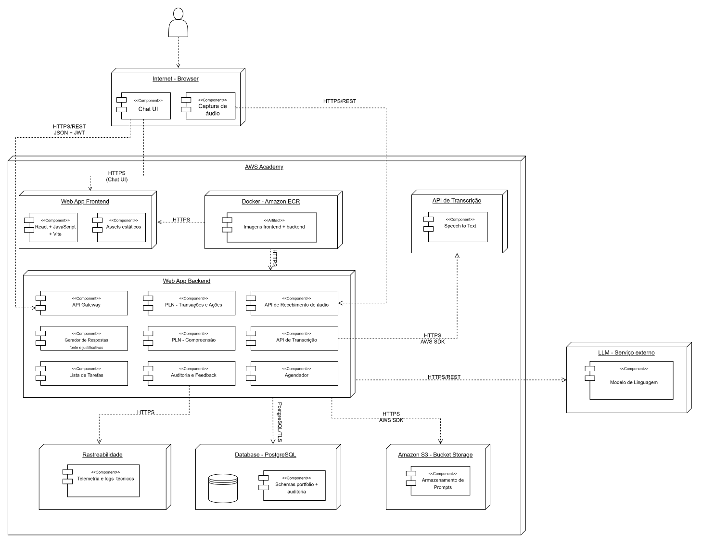<br>
  <sup>Fonte: Material produzido pelos autores, 2026.</sup>
</div>

#### Descrição dos nós de execução

| Nó | Elementos implantados | Responsabilidade |
|---|---|---|
| **Internet - Browser** | Chat UI, Captura de áudio | Único nó fora da infraestrutura de nuvem: executa no navegador da máquina do profissional do PMO. A Chat UI é o código de interface baixado do Web App Frontend e executado localmente; é por ela que a solicitação é digitada e que a resposta é exibida junto da fonte consultada e da data de referência (RF02 e RF03). A Captura de áudio grava a mensagem falada e a encaminha como arquivo ao backend, atendendo ao canal de voz previsto no RF01 e à acessibilidade exigida pelo RNF06. Nenhum processamento de linguagem natural ocorre neste nó: ele apenas coleta a entrada e apresenta a saída. |
| **Web App Frontend** (Amazon EC2) | JavaScript/JSX + React + Vite, Assets estáticos | Hospeda a aplicação cliente e a entrega ao navegador. Os Assets estáticos reúnem os arquivos de JavaScript, folhas de estilo e fontes que compõem a Chat UI; o bloco JavaScript/JSX + React + Vite responde pela construção e pela renderização das telas. A separação em relação ao Web App Backend mantém a aplicação cliente desacoplada do núcleo, condição do RNF05 para que outras aplicações possam futuramente consumir a mesma API. |
| **Docker - Amazon ECR** | `<<Artifact>>` Imagens frontend + backend | Registro das imagens de contêiner produzidas pelo pipeline descrito na Seção 3.7.6. Não participa da execução: sua função é guardar a versão exata de frontend e backend que foi construída, testada e aprovada, para que as instâncias EC2 obtenham dela a imagem no momento da implantação. É esse nó que garante que a versão validada em homologação seja idêntica à promovida para produção. |
| **Web App Backend** (Amazon EC2) | API Gateway, PLN - Compreensão, PLN - Transações e Ações, API de Recebimento de áudio, API de Transcrição, Gerador de Respostas, Auditoria e Feedback, Agendador, Lista de Tarefas | Concentra toda a camada de lógica de negócio definida na Seção 2.4. O API Gateway centraliza a entrada das solicitações e autentica o usuário antes de qualquer processamento (RNF02). A API de Recebimento de áudio aceita o arquivo enviado pelo navegador e a API de Transcrição atua como cliente do serviço de voz, de modo que áudio e texto convergem para o mesmo fluxo (RF01 e RNF06). O PLN - Compreensão classifica a intenção e extrai os parâmetros da solicitação (RNF03), encaminhando pedidos de preenchimento e alertas ao PLN - Transações e Ações (RF04, RF05 e RF06) e consultas ao Gerador de Respostas (RF02), que monta a saída, informa a fonte e restringe afirmações ao que ela sustenta (RF03, RNF11 e RNF12). O Agendador executa as verificações periódicas que não dependem de solicitação do usuário e alimenta a Lista de Tarefas com as pendências encontradas, sustentando o acompanhamento preventivo do RF05. O Auditoria e Feedback registra usuário, data, canal, intenção, fontes e resultado de cada interação (RNF04). |
| **API de Transcrição** (serviço externo de Speech to Text) | Speech to Text | Serviço de conversão de fala em texto consumido por API. Recebe o áudio encaminhado pelo backend e devolve a transcrição, que segue daí em diante pelo mesmo pipeline das mensagens digitadas. O fato de ser chamado pelo backend, e não diretamente pelo navegador, mantém a autenticação e o registro de auditoria concentrados em um único ponto de entrada. **O provedor efetivamente implementado é o Deepgram Nova-3** (Seção 3.2.1), que é externo à conta da AWS; o rótulo Amazon Transcribe presente na figura corresponde ao desenho anterior à decisão de STT e será corrigido no diagrama junto da revisão prevista no item 12 da Seção 3.7.9. Com o Deepgram, este elemento deixa de ser um nó interno da conta acadêmica e passa a ser uma dependência externa, como o nó de modelo de linguagem. |
| **Database - PostgreSQL** | Schemas portfolio + auditoria | Banco de dados relacional único da solução. O schema `portfolio` guarda os dados sintéticos de projetos, prazos, marcos, riscos, usuários e permissões consultados pelo agente (RF02, RF04 e RF05). O schema `auditoria` guarda os registros de interação e feedback correlacionados pelo RNF04. A separação em dois schemas, e não em dois bancos, permite aplicar por permissão a proteção exigida pelo RNF09 sem introduzir uma segunda base de dados, conforme decidido na Seção 2.5. A forma de hospedagem do PostgreSQL, em serviço gerenciado ou em contêiner na própria instância EC2, permanece em aberto na Seção 3.7.9. |
| **Amazon S3 - Bucket Storage** | Armazenamento de Prompts | Armazenamento de objetos para o conteúdo que não se representa bem em modelo relacional. Guarda os prompts utilizados pelo pipeline de PLN, versionados de forma independente do código, o que permite ajustá-los sem reconstruir a imagem do backend. |
| **Rastreabilidade** (Amazon CloudWatch) | Telemetria e logs técnicos | Observabilidade da aplicação: tempos de resposta, taxas de erro e disponibilidade dos dois contêineres. Não se confunde com o schema `auditoria`: a telemetria mostra o funcionamento técnico, enquanto `auditoria.mensagem` e `auditoria.mensagem_fonte` correlacionam quem pediu o quê, as fontes e o resultado conforme o RNF04; os controles de consulta, retenção e proteção desses registros pertencem ao RNF09. São dados com públicos e ciclos de vida distintos, e por isso ficam em nós distintos. |
| **LLM - Serviço externo** | Modelo de Linguagem | Serviço externo de modelo de linguagem, consumido por API; o provedor implementado é o Google Gemini, modelo `gemini-3.5-flash-lite`, acionado pelo endpoint `POST /api/v1/chat`. Apoia a geração das respostas em linguagem natural e a interpretação de documentos e normativos, sempre sob a orquestração do backend: o modelo é um componente do processamento, e não o responsável pela decisão (RNF11 e RNF12). Por estar fora da fronteira da conta acadêmica, é o único ponto do diagrama em que dados deixam a infraestrutura controlada pela equipe — razão pela qual o MVP trafega exclusivamente dados sintéticos, conforme a restrição registrada na Seção 1.3. |

#### Caminhos de comunicação

| # | Origem → destino | Protocolo | Porta | Momento | Dados e motivo da conexão |
|---|---|---|---|---|---|
| C1 | Usuário → Internet - Browser | Interação direta | — | Execução | Solicitação digitada ou falada pelo profissional do PMO. |
| C2 | Chat UI → Web App Frontend | HTTPS | 443 | Execução | Baixa os arquivos que compõem a interface — JavaScript, folhas de estilo e fontes — na primeira visita e a cada nova versão publicada. Enquanto não houver certificado, o acesso ocorre por HTTP na porta 80, ou diretamente na porta 5173 do servidor de desenvolvimento do Vite. |
| C3 | Chat UI → API Gateway | HTTPS/REST, JSON com JWT | 443 | Execução | Envia a solicitação em texto e recebe a resposta estruturada, mantendo a aplicação cliente desacoplada da lógica interna (RNF05). O processo do backend escuta internamente na porta 8000. |
| C4 | Captura de áudio → API de Recebimento de áudio | HTTPS/REST, `multipart/form-data` | 443 | Execução | Envia o arquivo de áudio gravado no navegador para que a transcrição ocorra no servidor, e não no cliente. Compartilha a mesma porta de C3, por ser outro recurso da mesma API. |
| C5 | API de Transcrição → API de Transcrição (Amazon Transcribe) | HTTPS, AWS SDK | 443 | Execução | Encaminha o áudio ao serviço de voz e recebe o texto transcrito, que segue pelo mesmo fluxo das mensagens digitadas. Conexão de saída da instância. |
| C6 | Web App Backend → LLM - Serviço externo | HTTPS/REST | 443 | Execução | Envia o contexto recuperado e recebe a resposta gerada em linguagem natural, empregada pelo Gerador de Respostas. Única conexão que sai da fronteira da conta acadêmica. |
| C7 | Web App Backend → Database - PostgreSQL | `PostgreSQL/TLS` — protocolo nativo do PostgreSQL sobre TLS | 5432 | Execução | Consulta os dados do portfólio para responder e para identificar pendências, e grava os registros de auditoria. Não é HTTP: o PostgreSQL usa protocolo próprio de mensagens sobre TCP, e o TLS o encapsula. |
| C8 | Web App Backend → Amazon S3 - Bucket Storage | HTTPS, AWS SDK (`GetObject` / `PutObject`) | 443 | Execução | Lê os prompts utilizados pelo pipeline de PLN. |
| C9 | Auditoria e Feedback → Rastreabilidade | HTTPS, AWS SDK (`PutLogEvents` / `PutMetricData`) | 443 | Execução | Publica eventos, métricas e logs técnicos para monitoramento da disponibilidade e do desempenho. |
| C10 | Docker - Amazon ECR → Web App Frontend | `<<deploy>>` `docker pull` sobre HTTPS | 443 | Implantação | Entrega a imagem do frontend à instância no momento do deploy. |
| C11 | Docker - Amazon ECR → Web App Backend | `<<deploy>>` `docker pull` sobre HTTPS | 443 | Implantação | Entrega a imagem do backend à instância no momento do deploy. |
| C12 | Administrador → Instância EC2 | SSH | 22 | Operação | Acesso administrativo da equipe à instância para configuração e verificação. Não aparece no diagrama por ser um caminho de operação, e não de execução da solução; está detalhado na Seção 3.7.4. |

 A coluna **Momento** separa os planos que o diagrama necessariamente sobrepõe. As conexões de **Execução** ocorrem a cada interação do usuário e trafegam dados por HTTP, pelo protocolo do banco ou por SDK. As conexões de **Implantação** ocorrem uma única vez a cada deploy, quando a instância obtém a imagem no registro e sobe o contêiner. A distinção evita a leitura equivocada de que o navegador obteria imagens de contêiner: o navegador participa apenas do primeiro plano e recebe arquivos servidos pelo Web App Frontend. A conexão de **Operação** não pertence a nenhum dos dois planos: existe para que a equipe administre a instância.

 Duas observações sobre a leitura das portas. A primeira é que a porta 443 predomina porque quase toda comunicação entre nós é HTTP sobre TLS — o que muda de uma conexão para outra não é a porta, e sim o recurso chamado e o formato do corpo da mensagem, registrados na última coluna. A segunda é que a porta exposta ao exterior não coincide com a porta interna do processo: o frontend responde em 3000 e o backend em 8000 dentro do contêiner, e ambos só são alcançados de fora pelas portas publicadas na instância. Essa distinção é o que permite fechar o grupo de segurança conforme a Seção 3.7.4.

#### Fluxo de uma solicitação ponta a ponta

 Os três percursos a seguir descrevem como os nós do diagrama cooperam nos cenários especificados na Seção 2.2.2, e cobrem todos os elementos implantados.

 **Consulta em texto.** O profissional abre o AZ1 no navegador; a Chat UI já foi baixada do Web App Frontend e executa localmente. Ao enviar a pergunta, a Chat UI faz uma requisição HTTPS ao API Gateway, no Web App Backend, que valida a identidade por SSO antes de prosseguir (RNF02). O PLN - Compreensão classifica a solicitação como consulta e extrai os parâmetros mencionados, como o nome do projeto e o período (RNF03). O Gerador de Respostas consulta o schema `portfolio` no banco, recupera os prompts necessários no bucket S3 e aciona o LLM para redigir a resposta, que retorna à Chat UI acompanhada da fonte consultada e da data de referência (RF02 e RF03). Em paralelo, o Auditoria e Feedback grava a interação no schema `auditoria` e publica os eventos técnicos no CloudWatch (RNF04).

 **Solicitação por voz.** O percurso difere apenas na entrada. A Captura de áudio grava a mensagem falada e a envia à API de Recebimento de áudio, que valida o arquivo e o repassa à API de Transcrição; esta atua como cliente do Amazon Transcribe e devolve o texto correspondente. A partir desse ponto, a solicitação segue exatamente o mesmo caminho da consulta em texto, o que atende ao RF01 sem exigir um segundo pipeline de intenções e preserva a acessibilidade prevista no RNF06.

 **Alerta proativo.** Este percurso não parte do usuário. O Agendador executa verificações periódicas sobre o schema `portfolio`, identificando prazos próximos, campos incompletos e documentos ausentes. As pendências encontradas alimentam a Lista de Tarefas, e o PLN - Transações e Ações as converte em alertas e sugestões de preenchimento, apresentados ao profissional quando ele acessa a interface (RF04, RF05 e RF06). Também aqui o Auditoria e Feedback registra o alerta gerado, de modo que a origem de cada recomendação permaneça rastreável.

 Em nenhum dos três percursos o agente altera de forma autônoma os registros do portfólio: a solução sugere e alerta, e a responsabilidade pelo registro e pela decisão permanece com o profissional, conforme delimitado na Seção 1.3.

#### Correspondência entre os componentes lógicos e os nós de execução

 A tabela a seguir fecha a rastreabilidade entre a visão lógica da Seção 2.4 e a visão física desta seção, permitindo verificar que nenhum componente especificado ficou sem lugar de execução definido.

| Componente da Seção 2.4 | Nó de execução | Observação |
|---|---|---|
| Chat UI - Texto e Voz | Internet - Browser, servida pelo Web App Frontend | O componente executa no navegador; o Web App Frontend é o nó que o entrega. |
| API Gateway | Web App Backend | Ponto único de entrada; concentra também a autenticação SSO. |
| Conversão de Áudio em Texto | Web App Backend e API de Transcrição (Amazon Transcribe) | Dividido em dois elementos: a API de Recebimento de áudio e a API de Transcrição no backend, e o Speech to Text no serviço gerenciado. |
| Autenticação SSO | Web App Backend | Integrada ao API Gateway e aplicada antes de qualquer processamento de linguagem. |
| PLN - Compreensão | Web App Backend | Classificação de intenção e extração de parâmetros. |
| PLN - Transações e Ações | Web App Backend | Sugestões e alertas, apoiado pelo Agendador e pela Lista de Tarefas. |
| Gerador de Respostas e Explicabilidade | Web App Backend, com apoio do LLM - Serviço externo | A composição da resposta e a indicação da fonte permanecem no backend; o LLM apoia a redação. |
| Auditoria e Feedback | Web App Backend | Grava no schema `auditoria` e publica telemetria no nó Rastreabilidade. |
| Repositório de Dados e Conhecimento | Database - PostgreSQL e Amazon S3 - Bucket Storage | Dados estruturados no banco; conteúdo não relacional no armazenamento de objetos. |
| Logs de Auditoria | Database - PostgreSQL, schema `auditoria` | Correlacionados pelo RNF04 e separados dos dados operacionais por schema e por permissão conforme o RNF09. |

### 3.7.3 Recursos do Ambiente Acadêmico e Limites

 O AWS Academy é disponibilizado pela instituição de ensino e opera sob limites que diferem de uma conta AWS comum. Esses limites não são um detalhe administrativo: eles condicionam o porte dos recursos, o tempo em que podem permanecer ativos e a continuidade do serviço, e por isso precisam estar registrados junto da arquitetura que se apoia neles.

**Limites do ambiente:**

| Recurso | Limite | Consequência para o projeto |
|---|---|---|
| Crédito | US$ 50 por participante | Determina o porte da instância e o tempo total em que ela pode permanecer em execução. O consumo é proporcional ao tempo ligado, e não ao uso efetivo, o que torna a interrupção da instância ociosa a principal medida de contenção |
| Duração da sessão | 4 horas por sessão de laboratório | Ao término, a instância é interrompida. O ambiente não permanece disponível entre sessões, o que impede a operação contínua |
| Catálogo de serviços | Restrito à lista permitida pelo curso | Serviços previstos na arquitetura que não estejam liberados exigem alternativa de projeto |
| Identidade e acesso | Papel de execução pré-definido, sem criação livre de usuários e políticas | A instância utiliza o papel fornecido pelo laboratório para acessar os demais serviços da conta |
| Custo de acesso | Nenhum para a equipe | Concedido pela instituição, sem cartão de crédito nem aprovação de orçamento |

**Serviços em uso e serviços previstos.** O ambiente foi verificado para o **Amazon EC2**, utilizado com a imagem **Amazon Linux**, que é o serviço sobre o qual a configuração descrita na Seção 3.7.4 se apoia. Os demais serviços previstos na arquitetura da Seção 3.7.2 — Amazon ECR, Amazon S3, Amazon Transcribe e Amazon CloudWatch — ainda não tiveram sua disponibilidade confirmada no catálogo do laboratório. Essa confirmação precisa preceder as etapas de implantação, porque a indisponibilidade de qualquer um deles exige uma alternativa de projeto: o registro de imagens pode ser substituído pela construção local na própria instância, o armazenamento de objetos e a telemetria podem ser acomodados no volume da instância, mas a ausência do serviço de transcrição afetaria diretamente o canal de voz previsto no RF01 e no RNF06.

A região habilitada é a **us-east-1 (Norte da Virgínia)**, e todos os recursos do projeto são provisionados nela.

> [PENDENTE — confirmar no catálogo do laboratório a disponibilidade do Amazon ECR, do Amazon S3, do Amazon Transcribe e do Amazon CloudWatch.]

 Os recursos do AWS Academy serão utilizados enquanto forem suficientes para o MVP com dados sintéticos. A implantação em ambiente real deverá considerar licenciamento, disponibilidade contínua e recursos corporativos, conforme a Seção 3.7.8.

### 3.7.4 Configuração da Instância EC2 e Acesso

 A instância Amazon EC2 é o nó que hospeda a execução da solução, e sua configuração antecede qualquer atividade de implantação: sem ambiente provisionado e acessível, não há onde publicar as imagens de contêiner nem como verificar o comportamento da aplicação. Esta seção documenta esse procedimento na ordem em que ele é executado, de modo que possa ser repetido por qualquer integrante da equipe e reproduzido em uma nova sessão do laboratório.

 Os cinco passos seguem a ordem em que o ambiente foi efetivamente montado. O par de chaves e o grupo de segurança podem ser criados tanto dentro do assistente de criação da instância quanto em suas próprias telas do console; neste projeto foram criados em telas separadas, o que permite reutilizá-los em instâncias futuras sem repetir a configuração. As imagens que acompanham cada passo registram a evidência de sua execução.

#### Passo 1 — Iniciar o laboratório do AWS Academy

1. Acessar o AWS Academy com a credencial institucional e abrir o laboratório da disciplina
2. Iniciar a sessão do laboratório e aguardar o indicador de ambiente disponível
3. Abrir o console da AWS a partir do próprio laboratório, sem criar conta própria
4. Confirmar a região habilitada e mantê-la em todos os passos seguintes, uma vez que recursos criados em regiões distintas não se comunicam entre si
5. Registrar o crédito remanescente e o horário de início, que delimitam o tempo útil de trabalho da sessão

 Duas restrições do ambiente condicionam todos os passos seguintes e convém tê-las em vista desde já: o crédito total é de **US$ 50 por participante** e a sessão do laboratório dura **4 horas**, ao fim das quais a instância é interrompida. A primeira restringe o porte e o tempo de execução dos recursos; a segunda significa que o ambiente não permanece no ar entre uma sessão e outra, com as consequências descritas ao final desta seção.

<div align="center">
<sub>Imagem 3.7.2 - Passo 1 — Laboratório do AWS Academy iniciado, com o crédito e o cronômetro da sessão visíveis</sub><br>
  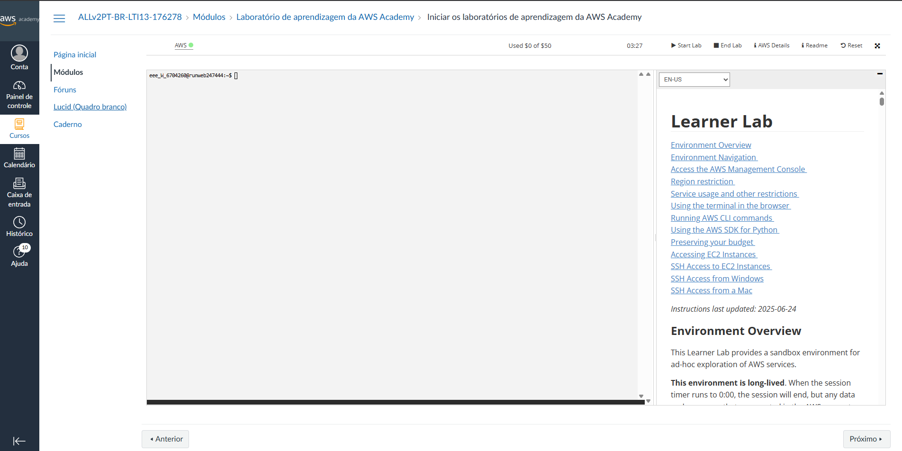<br>
  <sup>Fonte: Material produzido pelos autores, 2026.</sup>
</div>

#### Passo 2 — Criar a instância e definir imagem, porte e armazenamento

 No console do EC2, a criação começa por **Launch Instance**. Os parâmetros definidos aqui determinam o custo por hora e, portanto, quanto do crédito disponível a instância consome enquanto permanece em execução.

1. Nomear a instância de forma identificável — no projeto, `az1-app`
2. Selecionar o **Amazon Linux 2023** como imagem de máquina (AMI), cujo usuário padrão de acesso é `ec2-user`
3. Selecionar o tipo de instância de menor porte que atenda ao MVP — no projeto, `t3.micro` —, uma vez que o consumo de crédito é proporcional ao tempo de execução e ao porte escolhido
4. Definir o volume de disco, mantido no tamanho padrão de 8 GiB
5. Associar à instância o papel de execução disponibilizado pelo laboratório, em **Detalhes avançados → Perfil de instância do IAM**

 O quinto item merece destaque por ser o menos evidente. É o papel de execução que permite à instância chamar os demais serviços da conta — o registro de imagens, o armazenamento de objetos, a transcrição e a telemetria — sem que credenciais precisem ser gravadas dentro da máquina ou da imagem de contêiner. Sem ele, as conexões C5, C8, C9, C10 e C11 da Seção 3.7.2 falham por falta de autorização, e o diagnóstico costuma ser demorado porque o erro só aparece na primeira chamada da aplicação, muito depois da criação da instância.

 O volume de 8 GiB atende à configuração atual, em que a instância hospeda apenas o sistema operacional. Ele tende a ficar apertado quando as imagens de contêiner do frontend e do backend passarem a ser armazenadas localmente, e o espaço disponível deve ser reavaliado antes dessa etapa. O volume pode ser ampliado sem recriar a instância.

<div align="center">
<sub>Imagem 3.7.3 - Passo 2 — Definição do nome, da imagem Amazon Linux 2023 e do porte da instância</sub><br>
  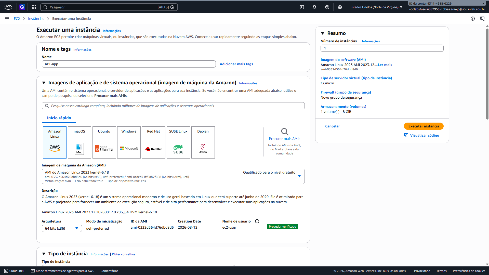<br>
  <sup>Fonte: Material produzido pelos autores, 2026.</sup>
</div>

#### Passo 3 — Criar o par de chaves de acesso

 O acesso à instância é feito por chave criptográfica, e não por senha. A chave privada é o único meio de entrar na máquina: se for perdida, não há recuperação possível e a instância precisa ser recriada.

1. Em **EC2 → Pares de chaves → Criar par de chaves**, nomear o par de forma que se associe à instância — no projeto, `az1-app`
2. Selecionar **RSA** como tipo de par de chaves
3. Selecionar o formato **`.pem`**, destinado ao uso com OpenSSH; o formato `.ppk` é necessário apenas para acesso por PuTTY
4. Baixar a chave privada no momento da criação, pois a AWS não permite baixá-la novamente depois
5. Restringir as permissões do arquivo, pois o cliente SSH recusa chaves com permissão aberta:

```bash
# Linux ou macOS
chmod 400 ~/.ssh/az1-key.pem
```

```powershell
# Windows — remove a herança e concede leitura apenas ao usuário atual
icacls .\az1-key.pem /inheritance:r
icacls .\az1-key.pem /grant:r "$($env:USERNAME):(R)"
```

 A chave deve ser guardada em local seguro e não deve ser compartilhada em canais de mensagem nem incluída no repositório. A definição de onde ela ficará versionada em relação ao projeto, assim como o tratamento dos demais segredos da aplicação, acompanha as etapas de implantação e está registrada ao final desta seção.

<div align="center">
<sub>Imagem 3.7.4 - Passo 3 — Criação do par de chaves `az1-app` no formato `.pem`</sub><br>
  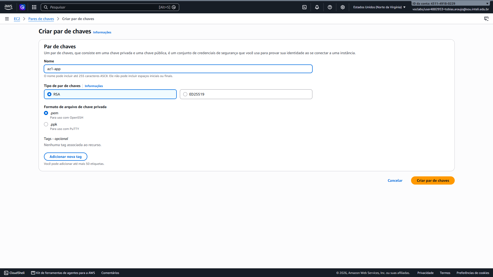<br>
  <sup>Fonte: Material produzido pelos autores, 2026.</sup>
</div>

#### Passo 4 — Configurar as portas no grupo de segurança

 O grupo de segurança é o firewall da instância e traduz, em regras, os caminhos de comunicação da Seção 3.7.2. Cada porta aberta corresponde a uma conexão prevista no diagrama; portas sem conexão correspondente permanecem fechadas. A edição é feita em **EC2 → Grupos de segurança → Editar regras de entrada**.

**Regras de entrada configuradas:**

| Tipo | Protocolo | Porta | Origem | Conexão correspondente | Motivo |
|---|---|---|---|---|---|
| SSH | TCP | 22 | `0.0.0.0/0` | C12 | Acesso administrativo à instância |
| HTTP | TCP | 80 | `0.0.0.0/0` | C2 | Entrega da Chat UI ao navegador enquanto não houver certificado emitido |
| HTTPS | TCP | 443 | `0.0.0.0/0` | C2, C3, C4 | Entrega da interface e chamadas à API, em texto e em áudio, após a emissão do certificado |

 As regras de saída permanecem no padrão da AWS, que libera todo o tráfego originado na instância. Isso atende às conexões C5, C6, C8, C9, C10 e C11 — as chamadas da instância ao serviço de transcrição, ao modelo de linguagem, ao armazenamento de objetos, à telemetria e ao registro de imagens — sem configuração adicional.

**Ajuste necessário na regra de SSH.** A porta 22 está aberta para `0.0.0.0/0`, e o próprio console da AWS sinaliza a condição na tela de edição. Isso significa que qualquer endereço da internet pode tentar autenticar-se na instância, o que a expõe a tentativas automatizadas de acesso. A mitigação atual é o acesso depender de chave criptográfica, e não de senha; ainda assim, a origem deve ser restringida ao endereço da equipe, em notação `/32`. O custo dessa restrição é apenas o de atualizá-la quando o endereço da equipe mudar, e ela está registrada como pendência na Seção 3.7.9.

**Portas ainda não configuradas.** As três regras acima cobrem o estado atual, em que a instância hospeda apenas o sistema operacional. As portas a seguir serão necessárias nas etapas de implantação e devem ser abertas apenas quando os serviços correspondentes existirem, pois abrir portas sem serviço em escuta amplia a superfície exposta sem nenhum ganho:

| Tipo | Porta | Origem recomendada | Conexão | Quando será necessária |
|---|---|---|---|---|
| TCP personalizado | 5173 | IP da equipe, em `/32` | — | Acesso direto ao servidor de desenvolvimento do Vite durante os testes, antes de o frontend ser publicado nas portas 80 ou 443 |
| TCP personalizado | 8000 | IP da equipe, em `/32` | — | Verificação do endpoint `/health` do backend antes de haver proxy |
| PostgreSQL | 5432 | Grupo de segurança do backend | C7 | Acesso do backend ao banco. A origem deve ser o próprio grupo de segurança, e não uma faixa de endereços: assim o banco aceita conexões apenas de dentro do ambiente, independentemente do endereço que a instância receba a cada retomada de sessão, e nunca fica alcançável pela internet |

 Concluída a configuração de rede, confirmar que a instância atingiu o estado **running**, com a verificação de status concluída, e registrar o identificador e o endereço público atribuídos.

<div align="center">
<sub>Imagem 3.7.5 - Passo 4 — Regras de entrada configuradas no grupo de segurança da instância</sub><br>
  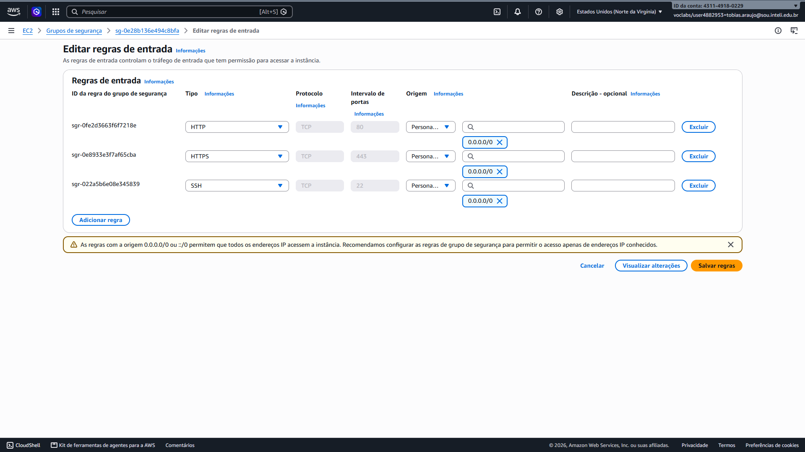<br>
  <sup>Fonte: Material produzido pelos autores, 2026.</sup>
</div>

#### Passo 5 — Acessar a instância e confirmar o provisionamento

 Este passo encerra a configuração porque é o único que comprova que ela funcionou. Uma instância em estado **running** apenas indica que a máquina virtual foi iniciada; não indica que ela é alcançável. Enquanto o acesso não é estabelecido, um erro na regra da porta 22, no par de chaves ou na rede permanece invisível, e seria descoberto apenas na etapa de implantação, quando o custo de diagnosticá-lo é maior.

 Há dois caminhos de acesso. O primeiro não depende de configuração local e serve para uma verificação rápida; o segundo é o que a equipe utiliza no trabalho corrente e o único que permite copiar arquivos para a instância.

**Acesso pelo navegador, via EC2 Instance Connect.** Selecionar a instância no console do EC2, acionar **Conectar** e escolher a conexão pelo próprio navegador. Não exige chave nem cliente instalado, e foi o caminho utilizado para a verificação registrada na Imagem 3.7.6, em que o prompt confirma o usuário `ec2-user` e o sistema Amazon Linux 2023.

**Acesso por SSH, a partir da máquina da equipe.** No Amazon Linux, o usuário padrão é `ec2-user`:

```bash
# Linux ou macOS
ssh -i ~/.ssh/az1-key.pem ec2-user@<endereco-publico-da-instancia>
```

```powershell
# Windows — o cliente SSH já acompanha o sistema
ssh -i .\az1-key.pem ec2-user@<endereco-publico-da-instancia>
```

 Para transferir arquivos, o mesmo par de chaves atende:

```bash
scp -i ~/.ssh/az1-key.pem arquivo.txt ec2-user@<endereco-publico-da-instancia>:~/
```

**Quando o acesso falha,** a causa costuma estar em uma destas quatro condições, verificáveis nesta ordem:

| Sintoma | Causa provável | Verificação |
|---|---|---|
| A conexão fica pendente e expira | A porta 22 não está liberada para o endereço de origem | Conferir a regra de entrada do grupo de segurança e o endereço público atual da máquina da equipe |
| `Permission denied (publickey)` | Chave incorreta ou nome de usuário errado | Confirmar o par de chaves associado à instância e o uso de `ec2-user` como usuário |
| `UNPROTECTED PRIVATE KEY FILE` | Permissões do arquivo `.pem` abertas | Reaplicar as permissões definidas no Passo 3 |
| O endereço não responde após uma retomada | O endereço público mudou ao parar e iniciar a instância | Obter o novo endereço no console e atualizar os acessos |

<div align="center">
<sub>Imagem 3.7.6 - Passo 5 — Sessão estabelecida com a instância pelo EC2 Instance Connect</sub><br>
  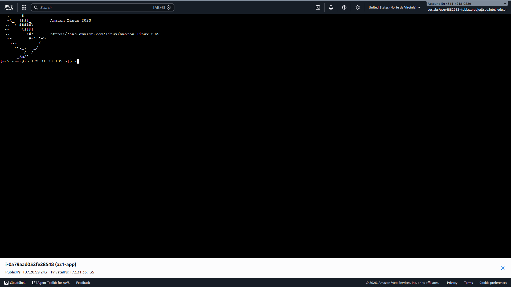<br>
  <sup>Fonte: Material produzido pelos autores, 2026.</sup>
</div>

#### Limites da sessão e retomada do ambiente

 A sessão de 4 horas define o ritmo de trabalho no ambiente e tem duas consequências que não decorrem da configuração da instância, mas condicionam tudo o que se apoia nela.

 A primeira é que **a instância é interrompida ao fim da sessão**. O que sobrevive à interrupção é o volume de disco, com o sistema operacional e os arquivos gravados; o que não sobrevive são os processos em execução, que precisam ser iniciados novamente a cada retomada. Isso é o que torna o item registrado na Seção 3.7.9 relevante para o Agendador: verificações periódicas pressupõem um serviço continuamente no ar, e o ambiente acadêmico não oferece essa garantia.

 A segunda é que **o endereço público é reatribuído a cada retomada**. Toda configuração que referencie o endereço da instância precisa ser atualizada, e o endereço corrente deve ser reconsultado no console antes de cada acesso.

> [PENDENTE — verificar se o laboratório permite associar um endereço IP elástico à instância, o que tornaria o endereço fixo entre sessões e eliminaria essa etapa.]

 Ao encerrar o trabalho, a instância deve ser parada pelo console, para não consumir crédito enquanto não estiver em uso, e o crédito remanescente deve ser registrado para acompanhamento do orçamento ao longo do projeto.

#### Etapas subsequentes da implantação

 Concluída a configuração da instância, a implantação prossegue pelas etapas abaixo, que dependem do empacotamento das aplicações e estão especificadas nas seções indicadas. A ordem reflete a cadeia de dependências entre elas: cada etapa pressupõe a anterior.

| Etapa | Especificação | Pressupõe |
|---|---|---|
| Preparação do sistema operacional da instância: atualização dos pacotes, instalação do `git` e configuração do fuso horário para `America/Sao_Paulo` | Seção 3.7.4 | Acesso à instância estabelecido |
| Instalação do runtime de contêiner na instância | Seção 3.7.6 | Sistema operacional preparado |
| Preparação do backend para empacotamento: escrita do `Dockerfile` sobre o pacote já declarado em `pyproject.toml`, inclusão do modelo treinado e implementação do endpoint `/health` | Seção 3.7.5 | Classificador definido e integrado, conforme o item 5 da Seção 3.7.9 |
| Construção das imagens de frontend e backend | Seção 3.7.5 e Seção 3.7.6 | Código do backend e do frontend estabilizado |
| Criação dos repositórios e publicação das imagens no Amazon ECR | Seção 3.7.6 | Imagens construídas |
| Provisionamento do PostgreSQL e aplicação dos schemas `portfolio` e `auditoria` | Seção 3.7.2 e Seção 3.7.9 | Decisão sobre a forma de hospedagem, registrada no item 1 da Seção 3.7.9 |
| Criação do bucket no Amazon S3 e habilitação do serviço de transcrição | Seção 3.7.2, conexões C5 e C8 | Serviços confirmados no catálogo do laboratório |
| Registro da cadeia de conexão do banco e das chaves de serviço como variáveis de ambiente da instância, com o par de chaves e o `.env` mantidos fora do repositório | Seção 3.7.4, Passo 3 | Serviços provisionados |
| Subida dos contêineres e publicação das portas na instância | Seção 3.7.2, conexões C10 e C11 | Imagens publicadas no registro |
| Configuração do pipeline de entrega contínua | Seção 3.7.6 | Imagens e ambiente de destino existentes |
| Integração com o ecossistema Microsoft | Seção 3.7.8 | Promoção da solução para o ambiente do parceiro |

### 3.7.5 Empacotamento do backend e exemplo de aplicação

A imagem do backend empacota a aplicação que já existe no repositório, e não uma aplicação nova escrita para o deploy. Isso importa porque o benefício declarado na Seção 3.7.6 — a imagem que vai a produção é a mesma que passou pelos testes — só é verdadeiro se o que está na imagem for exatamente o código versionado.

O ponto de entrada é `src/az1_api/main.py`, que compõe a aplicação FastAPI a partir dos quatro roteadores de `src/routes/` e registra os manipuladores de exceção que produzem o corpo de erro padronizado das Seções 3.2 e 3.4. O trecho abaixo é **exemplo conceitual**, reduzido para caber na leitura, e mostra a estrutura dessa composição e o endpoint de verificação de saúde que ainda precisa ser acrescentado:

```python
# Exemplo conceitual — estrutura reduzida de src/az1_api/main.py
from fastapi import FastAPI
from routes import analysis_router, audio_router, chat_router, transcription_router

app = FastAPI(title="AZ1 API")

# Cada frente expõe seu próprio roteador; o prefixo de versão fica em um lugar só.
app.include_router(audio_router, prefix="/api/v1")          # POST /api/v1/audio
app.include_router(transcription_router, prefix="/api/v1")  # POST /api/v1/audio/{id}/transcribe
app.include_router(analysis_router, prefix="/api/v1")       # POST /api/v1/audio/{id}/analyze
app.include_router(chat_router, prefix="/api/v1")           # POST /api/v1/chat


# AINDA NÃO IMPLEMENTADO — exigido pela etapa 06 do pipeline da Seção 3.7.6.
# O verificador precisa responder sem depender de serviço externo: ele atesta
# que o processo subiu, não que o Deepgram ou o Gemini estão disponíveis.
@app.get("/health")
def health() -> dict[str, str]:
    return {"status": "healthy"}
```

Duas observações sobre o exemplo. A primeira é que o endpoint `/health` está marcado como não implementado porque de fato não existe no repositório, embora seja pressuposto pela etapa de verificação do pipeline e pela regra de firewall da porta 8000 descrita na Seção 3.7.4; a lacuna está registrada no item 13 da Seção 3.7.9. A segunda é que a verificação de saúde deve ser deliberadamente rasa: se ela chamasse o serviço de transcrição, uma indisponibilidade do provedor derrubaria a instância em um rollback automático, quando o problema não está na aplicação.

O modelo treinado é carregado uma única vez, no arranque, pelo provedor de dependência `get_analyzer` de `src/az1_api/dependencies.py`, e não a cada requisição. O arquivo `joblib` precisa, portanto, estar dentro da imagem — o que também significa que **publicar uma nova versão do modelo exige reconstruir a imagem**, e essa é uma consequência a considerar quando a base for reformulada na Sprint 3.

**Dockerfile correspondente:**

```dockerfile
# Exemplo conceitual — o Dockerfile do backend ainda não existe no repositório
FROM python:3.12-slim

# O PyAV depende das bibliotecas nativas do FFmpeg; sem elas a validação de
# áudio da Seção 3.4 falha apenas em tempo de execução, não na construção.
RUN apt-get update && apt-get install -y --no-install-recommends \
        ffmpeg \
    && rm -rf /var/lib/apt/lists/*

WORKDIR /app

# O projeto adota o "src layout" declarado no pyproject.toml; instalar o pacote,
# em vez de copiar arquivos soltos, é o que faz `from pln import ...` funcionar
# dentro do contêiner sem manipular o sys.path.
COPY pyproject.toml ./
COPY src/ ./src/
RUN pip install --no-cache-dir .

# Recursos do modelo treinado e da lista de stopwords, necessários em execução.
RUN python -m nltk.downloader -d /usr/share/nltk_data stopwords rslp

EXPOSE 8000

CMD ["uvicorn", "az1_api.main:app", "--host", "0.0.0.0", "--port", "8000"]
```

> **PENDENTE DE EVIDÊNCIA DA EQUIPE:** o Dockerfile acima é uma proposta derivada das dependências declaradas em `pyproject.toml` e ainda **não foi construído nem executado**. A construção da imagem, o registro do identificador gerado e a execução do contêiner com a verificação de `/health` são a evidência que fecha esta subseção, e estão previstas para a Sprint 4, conforme a Seção 3.8.6.

### 3.7.6 Processo de Entrega Contínua

O diagrama da Seção 3.7.2 descreve o **estado final** da implantação. Esta seção descreve o **caminho** até ele: o que acontece entre um commit e a imagem em execução, apoiado no fluxo de branches definido no documento de Gestão de Configuração.

**Etapas do pipeline:**

| Etapa | O que faz | Ferramenta |
|---|---|---|
| 01 — Lint | Verifica padrão de código no backend e no frontend | `ruff` · `eslint` |
| 02 — Testes | Executa a suíte automatizada e apura a cobertura | `pytest` |
| 03 — Build | Constrói as imagens de frontend e de backend | Docker |
| 04 — Registro | Publica as imagens no Amazon ECR | `docker push` |
| 05 — Deploy | Faz a instância obter a imagem e aplica as migrações do banco | `docker pull` |
| 06 — Verificação | Confirma que a aplicação respondeu após subir | `GET /health`, endpoint ainda a implementar |

**Gatilhos e destinos:**

| Gatilho | Etapas executadas | Destino | Aprovação |
|---|---|---|---|
| `push` em `feature/*` ou `fix/*` | 01 a 03 | Nenhum ambiente | Automática — a falha bloqueia o Merge Request |
| `merge` em `develop` | 01 a 06 | Ambiente de homologação | Automática, após Merge Request aprovado por revisor |
| `merge` em `main` com tag `vX.Y.Z` | 01 a 06 | Ambiente de produção | Manual, por portão no pipeline |
| `hotfix/*` a partir de `main` | 01 a 06 | Ambiente de produção | Manual, com merge de retorno obrigatório para `develop` |

As quatro rotas compartilham as mesmas quatro primeiras etapas e divergem apenas no destino. É isso que torna o processo auditável: a imagem que entra em produção é exatamente a mesma que passou pelos testes e que já rodou em homologação, identificada pela tag da versão.

**Rollback:** a versão anterior é restaurada fazendo a instância obter do Amazon ECR a imagem da tag imediatamente anterior e subir o contêiner novamente. Como as imagens permanecem no registro, o procedimento não depende de reconstruir o código.

**Ambiente local:** antes da etapa 01, o desenvolvimento roda com `docker compose up`, que sobe backend, frontend e banco a partir das mesmas imagens usadas pelo pipeline. É essa paridade entre desenvolvimento e implantação que justifica a adoção do Docker registrada na Seção 2.5.

### 3.7.7 Reprodutibilidade e Verificação

 A reprodutibilidade da implantação é verificada em duas frentes complementares. A primeira apura se o ambiente permanece dentro dos limites do crédito acadêmico; a segunda, se a solução implantada responde conforme especificado.

**Controle de consumo do ambiente acadêmico:**

| Verificação | Critério |
|---|---|
| Porte das instâncias | Dimensionadas no menor porte que atenda ao MVP |
| Instâncias ociosas | Interrompidas quando não estiverem em uso, uma vez que o crédito é consumido por tempo de execução |
| Armazenamento do registro de imagens | Imagens antigas removidas do Amazon ECR |
| Consumo de crédito | Acompanhado a cada sessão do laboratório |
| Vigência do acesso | Elegibilidade e validade do acesso ao AWS Academy confirmadas |

**Verificação funcional da solução implantada.** O roteiro abaixo percorre as rotas efetivamente implementadas em `src/routes/`, na ordem em que uma falha isola melhor a causa: primeiro o processo, depois o armazenamento, depois cada serviço externo e, por fim, a interface. O contrato planejado de `GET /health` responde `200 OK` em até dois segundos quando aplicação e banco estão disponíveis e `503 Service Unavailable` quando um deles não está pronto. Serviços externos são monitorados separadamente e não alteram esse estado. O endpoint ainda não está implementado.

| # | Verificação | Rota ou recurso | Resultado esperado | Situação |
|---:|---|---|---|---|
| 1 | Contêineres de frontend e backend | `docker ps` na instância | Ambos em execução, com as portas publicadas | A verificar após o deploy |
| 2 | Saúde da aplicação e do banco | `GET /health` | `200 OK` em até dois segundos quando ambos estão disponíveis; `503 Service Unavailable` quando um deles não está pronto | Depende da implementação do endpoint, item 13 da Seção 3.7.9 |
| 3 | Documentação da API gerada | `GET /docs` | Página do OpenAPI listando as quatro rotas de `/api/v1` | Disponível por padrão no FastAPI |
| 4 | Recebimento e armazenamento do áudio | `POST /api/v1/audio` | `201 Created` com `id` no formato `aud_…`, e o objeto gravado sob `incoming/{audio_id}` | Implementada |
| 5 | Rejeição de arquivo inválido | `POST /api/v1/audio` com um arquivo de texto renomeado para `.wav` | `415 unsupported_format` | Implementada |
| 6 | Transcrição pelo serviço externo | `POST /api/v1/audio/{audio_id}/transcribe` | `200 OK` com `text` não vazio | Implementada; depende de `DEEPGRAM_API_KEY` na instância |
| 7 | Encadeamento de voz e intenção | `POST /api/v1/audio/{audio_id}/analyze` | `200 OK` com `intencao` pertencente ao catálogo da Seção 3.1 | Implementada |
| 8 | Geração de resposta em linguagem natural | `POST /api/v1/chat` | `200 OK` com `reply` preenchido | Implementada; depende de `GEMINI_API_KEY` na instância |
| 9 | Chat UI | Navegador apontado para a porta publicada do frontend | Interface carrega e conversa com o backend | A verificar após o deploy |
| 10 | Persistência | Consulta aos schemas `portfolio` e `auditoria` | Registros gravados e recuperáveis | Prevista para a Sprint 4, conforme a Seção 3.8.6 |
| 11 | Armazenamento de objetos em nuvem | Bucket no Amazon S3 | Objetos gravados e lidos pelo backend | Condicionada à disponibilidade do serviço no laboratório |
| 12 | Observabilidade | Nó de Rastreabilidade | Eventos e métricas visíveis | Condicionada à disponibilidade do serviço no laboratório |

**Exemplo de requisição ponta a ponta.** O percurso mínimo tem dois passos, porque o recebimento e a análise são endpoints distintos, conforme a decisão registrada na Seção 3.2.2. O endereço é um marcador e deve ser substituído pelo endereço público da instância após o deploy.

```bash
# 1) Enviar o áudio e guardar o identificador devolvido
AUDIO_ID=$(curl -s -X POST http://<endereco-da-instancia>:8000/api/v1/audio \
  -F "audio=@consulta.wav" | python -c "import sys,json; print(json.load(sys.stdin)['id'])")

# 2) Transcrever e classificar em uma única chamada
curl -X POST "http://<endereco-da-instancia>:8000/api/v1/audio/$AUDIO_ID/analyze"
```

**Resposta esperada do segundo passo:**

```json
{
  "audio_id": "aud_067071317397468196a9b9c4cffa82c6",
  "text": "Qual o prazo do marco de licenciamento ambiental da Linha 6?",
  "language": "pt-BR",
  "confidence": 0.9516,
  "duration_seconds": 4.812,
  "intencao": "consultar_projeto_sintetico",
  "confianca_pln": 0.7412
}
```

O primeiro comando serve também de verificação indireta do armazenamento: se o bucket não estiver acessível, o passo 1 falha antes de devolver o identificador, e o passo 2 nem chega a ser executado. Já uma falha apenas no passo 2, com `502 transcription_failed`, isola o problema no serviço externo de transcrição ou na credencial configurada na instância.

**Estado da execução.** Nenhum dos doze itens acima foi executado até o encerramento da Sprint 2, porque a implantação não ocorreu: apenas os cinco passos de provisionamento da instância, documentados na Seção 3.7.4, foram realizados e evidenciados.

> **PENDENTE DE EVIDÊNCIA DA EQUIPE:** anexar a esta subseção, após a execução do deploy, (i) a captura do `docker ps` na instância, (ii) a saída do `GET /health`, (iii) a saída completa do percurso de duas etapas acima com um áudio real, (iv) a captura do painel da AWS com as instâncias em execução e o crédito remanescente, e (v) o identificador da imagem publicada no registro. Cada evidência deve ser nomeada no padrão `assets/deploy/pos_deploy_<n>.png` e referenciada aqui com legenda e fonte, no mesmo formato das Imagens 3.7.2 a 3.7.6.

### 3.7.8 Próximos Passos para Produção

 O ambiente de produção do parceiro é o ecossistema Microsoft, e o ambiente acadêmico é o AWS Academy. A promoção para produção envolve, portanto, uma troca de provedor, e não apenas uma troca de assinatura. É a portabilidade da pilha, descrita na Seção 3.7.1, que torna essa troca viável sem reescrita do núcleo.

Quando a solução for promovida para o ambiente real do Metrô:

1. **Migrar as imagens:** publicar as mesmas imagens de contêiner no registro do ambiente de destino, sem alteração de código;
2. **Migrar o banco de dados:** transferir os schemas `portfolio` e `auditoria` para a instância PostgreSQL corporativa;
3. **Substituir os serviços gerenciados:** trocar Amazon Transcribe, Amazon S3 e Amazon CloudWatch pelos equivalentes do ambiente de destino, o que afeta apenas as camadas de integração, e não a lógica de negócio;
4. **Copilot Studio e Power Automate:** integrar o agente ao tenant corporativo e conectar os fluxos aos documentos e listas efetivamente utilizados pelo PMO;
5. **Provedor SSO:** selecionar Microsoft ou Google e integrar a autenticação ao API Gateway sem introduzir autorização por cargo;
6. **Compliance e segurança:** implementar retenção de logs de auditoria, Data Loss Prevention (DLP) e conformidade com as políticas corporativas.

 A arquitetura em nós e os caminhos de comunicação permanecem os mesmos; o que muda são os serviços que ocupam cada nó.

### 3.7.9 Decisões Técnicas em Aberto

O desenho da implantação expôs pontos que ainda dependem de decisão da equipe. Eles estão registrados aqui para que sejam fechados antes da implementação, e não durante ela.

| # | Ponto em aberto | Impacto | Encaminhamento |
|---|---|---|---|
| 1 | A forma de hospedagem do PostgreSQL não está definida | Alto — muda o provisionamento, o custo em crédito e o procedimento de retomada após a expiração da sessão | Decidir entre serviço gerenciado e contêiner na própria instância EC2, verificando antes o que está liberado no laboratório |
| 2 | O bucket S3 guarda apenas "Armazenamento de Prompts" | Médio — o RF03 exige repositório de documentos com metadados para citar a fonte | Definir se os documentos sintéticos ficam nesse mesmo nó e ajustar o rótulo |
| 3 | ~~O provedor do LLM não está definido~~ **Encerrado na Sprint 2** | — | O Google Gemini (`gemini-3.5-flash-lite`) foi integrado pelo endpoint `POST /api/v1/chat` e consta da pilha da Seção 3.5.1. Resta confirmar se o tráfego de saída para o provedor é permitido a partir da instância do laboratório |
| 4 | As sessões do laboratório expiram e interrompem as instâncias | Alto — conflita com a disponibilidade contínua pressuposta pelo Agendador e pelos alertas do RF05 | Definir o procedimento de retomada e avaliar o impacto sobre as verificações periódicas |
| 5 | ~~Convivem no documento um classificador local e uma API de modelo de linguagem~~ **Encerrado na Sprint 2** | — | A divisão está implementada e é verificável no código: a classificação de intenções roda no modelo local (`pln/classificador.py`, empacotado com o backend) e o modelo de linguagem responde apenas pela geração de texto no endpoint de chat. A delimitação está registrada no início da Seção 3.3 |
| 6 | ~~A Seção 2.5 define FastAPI, mas o exemplo da Seção 3.7.5 usa Flask~~ **Encerrado na Sprint 2** | — | O exemplo da Seção 3.7.5 foi reescrito em FastAPI, coerente com a pilha da Seção 2.5 e com o código de `src/az1_api/main.py` |
| 7 | O diagrama prevê dois nós de execução, mas o ambiente acadêmico comporta consolidá-los em uma única instância | Médio — muda o consumo de crédito, o grupo de segurança e as portas publicadas | Decidir entre uma instância com dois contêineres e duas instâncias separadas, considerando o crédito disponível |
| 8 | O endereço público da instância muda a cada retomada da sessão | Médio — invalida configurações e acessos registrados entre uma sessão e outra | Verificar se o laboratório permite associar um endereço IP elástico e, em caso negativo, definir onde o endereço corrente será registrado |
| 9 | Apenas o Amazon EC2 teve disponibilidade confirmada no laboratório | Alto — a arquitetura da Seção 3.7.2 pressupõe também ECR, S3, Transcribe e CloudWatch | Confirmar o catálogo liberado e definir a alternativa para cada serviço indisponível, conforme discutido na Seção 3.7.3 |
| 10 | O crédito de US$ 50 é consumido por tempo de instância ligada, e não por uso | Médio — uma instância esquecida em execução consome o crédito de toda a equipe | Definir a responsabilidade pela interrupção da instância ao fim de cada sessão e o acompanhamento periódico do saldo |
| 11 | A regra de SSH do grupo de segurança está aberta para `0.0.0.0/0` | Alto — expõe a porta 22 da instância a tentativas de acesso de qualquer origem da internet | Restringir a origem ao endereço da equipe em notação `/32`, conforme a Seção 3.7.4, e definir quem atualiza a regra quando esse endereço mudar |
| 12 | O diagrama de implantação nomeia o Amazon Transcribe, mas o serviço de Speech to Text implementado é o Deepgram Nova-3 | Médio — muda a fronteira de rede, pois o Deepgram é externo à conta da AWS, e muda a autenticação, que passa a depender da variável `DEEPGRAM_API_KEY` na instância em vez do papel de execução | Atualizar o diagrama `assets/diagrama_de_deploy.svg`, movendo o elemento de transcrição para fora da fronteira da conta acadêmica, e decidir se o Amazon Transcribe permanece como alternativa avaliada |
| 13 | Os endpoints usados nas verificações da Seção 3.7.7 (`/classify`, `/audio`, `/health`) não correspondem às rotas implementadas | Médio — a verificação pós-deploy falharia contra a aplicação real | Alinhar o roteiro de verificação às rotas de `src/routes/` e implementar o endpoint `/health`, que hoje não existe no repositório |
| 14 | Não existe arquivo de configuração de integração contínua no repositório | Médio — o pipeline da Seção 3.7.6 está especificado, mas nenhuma etapa executa automaticamente | Criar a configuração do pipeline na Sprint 4, conforme a task T36 do planejamento, e registrar aqui a evidência da primeira execução |

### 3.7.10 Estado das evidências da implantação

A Seção 3.7 é, nesta sprint, um **plano reproduzível de implantação com o provisionamento da instância já executado**, e não uma implantação concluída. A tabela separa o que tem evidência anexada do que ainda não tem, para que nenhuma etapa seja lida como realizada sem estar.

| Etapa | Situação | Evidência |
|---|---|---|
| Passo 1 — laboratório do AWS Academy iniciado | **Executada** | Imagem 3.7.2 |
| Passo 2 — instância `az1-app` criada, com AMI, porte e volume definidos | **Executada** | Imagem 3.7.3 |
| Passo 3 — par de chaves `az1-app` criado no formato `.pem` | **Executada** | Imagem 3.7.4 |
| Passo 4 — regras de entrada do grupo de segurança configuradas | **Executada** | Imagem 3.7.5 |
| Passo 5 — acesso à instância estabelecido e confirmado | **Executada** | Imagem 3.7.6 |
| Confirmação de ECR, S3, Transcribe e CloudWatch no catálogo | Não executada | **PENDENTE DE EVIDÊNCIA DA EQUIPE**, conforme a Seção 3.7.3 |
| Preparação do sistema operacional e instalação do runtime de contêiner | Não executada | **PENDENTE DE EVIDÊNCIA DA EQUIPE** |
| Construção das imagens de frontend e backend | Não executada | **PENDENTE DE EVIDÊNCIA DA EQUIPE**, conforme a Seção 3.7.5 |
| Publicação das imagens no registro | Não executada | **PENDENTE DE EVIDÊNCIA DA EQUIPE** |
| Provisionamento do PostgreSQL e aplicação dos schemas | Não executada | Depende do item 1 da Seção 3.7.9 |
| Subida dos contêineres e publicação das portas | Não executada | **PENDENTE DE EVIDÊNCIA DA EQUIPE** |
| Verificação funcional pós-deploy | Não executada | **PENDENTE DE EVIDÊNCIA DA EQUIPE**, conforme a Seção 3.7.7 |
| Configuração do pipeline de entrega contínua | Não executada | Nenhum arquivo de CI existe no repositório; item 14 da Seção 3.7.9 |

A gestão dos segredos merece registro próprio porque atravessa várias dessas etapas. O repositório versiona apenas o `.env.example`, com os nomes das variáveis e sem valores; o `.env` e o arquivo `.pem` da chave privada permanecem fora do controle de versão. Na instância, as credenciais devem ser registradas como variáveis de ambiente do serviço, e não gravadas dentro da imagem de contêiner — caso contrário, qualquer pessoa com acesso ao registro de imagens passa a ter acesso às chaves. O acesso aos demais serviços da conta é feito pelo papel de execução associado à instância no Passo 2, o que dispensa gravar credenciais da AWS na máquina.

### 3.7.11 Observações Finais

Este deploy foi estruturado como uma prova de conceito técnica sobre um ambiente concedido pela instituição de ensino, sem custo para a equipe. A conteinerização e a escolha de uma pilha de código aberto asseguram que a mesma imagem validada em desenvolvimento seja a promovida para os demais ambientes, e que a solução não fique presa ao provedor utilizado no MVP — condição para que a promoção futura ao ecossistema Microsoft do parceiro seja uma troca de infraestrutura, e não uma reescrita. A reprodutibilidade será confirmada após a execução dos passos descritos e a inclusão das evidências correspondentes. Uma futura promoção para produção exigirá ajustes de configuração, segurança, licenciamento e integração com o ambiente real do Metrô.

## 3.8 Estratégia de Entrega para as Sprints 3, 4 e 5

Esta seção define como a solução será desenvolvida, integrada, testada e implantada ao longo das Sprints 3, 4 e 5. A estratégia parte do projeto técnico e arquitetural descrito nas seções anteriores e organiza a construção em incrementos: cada sprint encerra com um conjunto de componentes funcionando de forma integrada, e não com partes isoladas aguardando montagem no final do módulo.

A distribuição das entregas considera três fatores: a ordem de dependência entre os componentes, o prazo de duas semanas de cada sprint e a necessidade de manter, a cada ciclo, uma versão demonstrável da solução para o parceiro.

### 3.8.1 Princípios da estratégia

- **Entrega incremental e integrada.** Cada componente novo entra conectado ao que já existe. Nenhuma frente é construída isoladamente para ser integrada apenas no encerramento do módulo.
- **Fluxo principal primeiro.** A Sprint 3 concentra o caminho que atravessa toda a solução: entrada do usuário, transcrição, processamento de linguagem natural e resposta na interface. As sprints seguintes ampliam, persistem e distribuem esse fluxo.
- **Documentação produzida junto com o código.** Cada entrega técnica é acompanhada da atualização das seções correspondentes deste documento e dos registros no diretório `docs`, evitando acúmulo de documentação no fim do ciclo.
- **Testes acompanhando a construção.** O planejamento dos testes ocorre na mesma sprint em que o componente é construído, e a execução ocorre na sprint seguinte, de modo que nenhuma funcionalidade chegue ao encerramento sem verificação.
- **Implantação antecipada.** O deploy em nuvem é iniciado na Sprint 4, e não no fechamento do projeto, para que eventuais problemas de ambiente sejam identificados enquanto ainda há tempo de correção.

### 3.8.2 Calendário e foco de cada sprint

| Sprint | Período | Foco da sprint |
|---|---|---|
| Sprint 3 | 31/08/2026 a 11/09/2026 | Construção do fluxo principal: recebimento de áudio, conversão em texto, algoritmo de PLN e interface básica integrada |
| Sprint 4 | 14/09/2026 a 25/09/2026 | Persistência em banco de dados, integrações por webhooks, implantação em nuvem e execução dos testes planejados |
| Sprint 5 | 28/09/2026 a 09/10/2026 | Sistema de mensageria, frontend completo, integração ponta a ponta e consolidação da solução |

As três sprints têm duração de duas semanas, iniciando na segunda-feira e encerrando na sexta-feira da semana seguinte. A distribuição nominal das tarefas entre os integrantes é registrada na matriz de papéis e responsabilidades do documento de [Gestão do Projeto](GestaoProjeto.md) e nas issues do GitLab, que permanecem como fonte oficial do acompanhamento.

### 3.8.3 Linha do tempo das frentes de trabalho

<div align="center">
  <sub>FIGURA 3.1 — Linha do tempo de entrega das Sprints 3, 4 e 5</sub><br>
  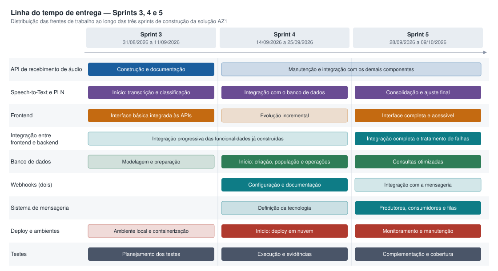<br>
  <sup>Fonte: material produzido pelos autores com auxílio de inteligência artificial (2026).</sup>
</div>

A figura apresenta as frentes de trabalho em linhas e as sprints em colunas. As barras sólidas indicam a sprint em que a frente é efetivamente construída; as barras claras indicam preparação, evolução incremental ou manutenção do que já foi entregue.

A leitura horizontal evidencia o caráter incremental da estratégia: nenhuma frente aparece isolada em uma única coluna. A API de áudio, construída na Sprint 3, permanece em manutenção e integração nas sprints seguintes; o banco de dados é preparado na Sprint 3 pela modelagem, construído na Sprint 4 e otimizado na Sprint 5; e a integração entre frontend e backend acontece progressivamente desde a Sprint 3, sendo concluída apenas na Sprint 5.

### 3.8.4 Distribuição das entregas entre as sprints

A tabela relaciona cada entrega prevista para o módulo com o estado esperado ao final de cada sprint. Os estados utilizados são: **Preparação**, quando a frente é apenas planejada ou modelada; **Construção**, quando é efetivamente implementada; **Evolução**, quando recebe incrementos sobre uma base já funcional; e **Consolidação**, quando é finalizada, integrada e documentada em definitivo.

| Entrega | Sprint 3 | Sprint 4 | Sprint 5 |
|---|---|---|---|
| API para recebimento de áudios | Construção | Evolução | Consolidação |
| Conversão de fala em texto e algoritmo de PLN | Construção | Evolução | Consolidação |
| Frontend | Construção (interface básica) | Evolução | Consolidação (interface completa) |
| Integração entre frontend e backend | Preparação | Evolução | Consolidação |
| Banco de dados | Preparação (modelagem) | Construção | Consolidação |
| Webhooks (dois) | — | Construção | Evolução |
| Sistema de troca de mensagens | — | Preparação | Construção |
| Deploy da solução | Preparação (ambiente local) | Construção (nuvem) | Consolidação |
| Testes sistêmicos | Planejamento | Execução | Complementação |

### 3.8.5 Sprint 3 — Construção do fluxo principal

O objetivo da sprint é colocar em funcionamento o caminho completo entre a solicitação do usuário e a resposta apresentada na interface, ainda que com escopo reduzido de funcionalidades e sem persistência definitiva.

**Design.** Refinamento do fluxo de interação a partir dos resultados da prototipação exploratória, definição dos estados de carregamento, transcrição e erro na interface, e revisão do contrato de classificação de intenções descrito na Seção 3.1.

**Desenvolvimento.** Construção da API de recebimento de áudio conforme o contrato definido na Seção 3.4, integração com o serviço de conversão de fala em texto, implementação do algoritmo de PLN responsável pela identificação das intenções catalogadas e construção da interface básica que permite enviar a solicitação e visualizar o resultado.

**Testes.** Cobertura por testes unitários dos componentes construídos e elaboração do plano de testes funcionais, não funcionais, de integração e de usabilidade, derivado dos requisitos das Seções 2.2 e 2.3, incluindo a definição das ferramentas e bibliotecas que serão utilizadas na execução.

**Implantação.** Padronização do ambiente local de desenvolvimento por meio de containerização, garantindo que todos os integrantes executem a solução da mesma forma e preparando a imagem que será publicada na nuvem na sprint seguinte.

**Condição de conclusão da sprint:**

- é possível enviar uma solicitação em áudio ou texto pela interface e receber uma resposta produzida pelo sistema;
- os erros previstos no contrato da API são tratados e comunicados ao usuário;
- as seções técnicas correspondentes deste documento estão atualizadas;
- o plano de testes está registrado e aprovado pela equipe.

### 3.8.6 Sprint 4 — Persistência, integrações e implantação

O objetivo da sprint é dar durabilidade e alcance à solução: o que era processado em memória passa a ser armazenado, o sistema passa a reagir a eventos externos e a aplicação passa a existir em um ambiente de nuvem acessível ao parceiro.

**Design.** Revisão da navegação e do retorno visual da interface a partir dos apontamentos da Sprint 3 e definição da apresentação das informações que passam a ser persistidas, como o histórico das interações.

**Desenvolvimento.** Criação e população do banco de dados a partir da modelagem descrita na Seção 3.6, com implementação das operações de leitura e escrita; implementação de dois webhooks que permitam ao sistema reagir a eventos originados fora dele, com tratamento do conteúdo recebido e resposta adequada ao provedor; evolução incremental do frontend e da integração com as APIs do backend.

**Testes.** Execução do plano elaborado na Sprint 3, incluindo os testes funcionais, os testes de desempenho, os testes de integração com registro das respostas dos serviços externos e a realização dos testes de usabilidade com usuários externos à turma, com produção das evidências correspondentes.

**Implantação.** Configuração dos ambientes de desenvolvimento e de produção, publicação da aplicação na nuvem conforme o processo descrito na Seção 3.7 e início do monitoramento da solução implantada.

**Condição de conclusão da sprint:**

- as informações processadas pelo sistema são armazenadas e recuperadas do banco de dados;
- os dois webhooks estão implementados, documentados e respondendo corretamente ao provedor;
- a aplicação está acessível em ambiente de nuvem;
- os testes planejados foram executados e as evidências estão registradas.

### 3.8.7 Sprint 5 — Mensageria, interface completa e consolidação

O objetivo da sprint é fechar a solução: desacoplar o processamento por meio de mensageria, concluir a interface e garantir que todos os componentes operem de forma integrada e verificada.

**Design.** Conclusão da interface com tratamento de responsividade e de acessibilidade, padronização dos componentes visuais e revisão da consistência entre as telas.

**Desenvolvimento.** Implementação do sistema de troca de mensagens assíncronas, com produtores e consumidores configurados e integrados aos webhooks construídos na Sprint 4; finalização do frontend com a biblioteca escolhida; e conclusão da integração entre frontend e backend, com tratamento de erros e de falhas de comunicação em todos os fluxos.

**Testes.** Complementação dos testes não concluídos na Sprint 4, execução dos testes unitários por componente do frontend, automação dos testes de interface e verificação da cobertura alcançada em relação aos requisitos definidos.

**Implantação.** Publicação da versão final na nuvem, consolidação das instruções de configuração e do manual de implantação e uso da prova de conceito, e verificação da reprodutibilidade do processo por uma pessoa que não participou da configuração original.

**Condição de conclusão da sprint:**

- o processamento assíncrono opera entre os componentes por meio da tecnologia de mensageria adotada;
- a interface está completa, responsiva e acessível, com testes automatizados;
- todas as funcionalidades do frontend consomem as APIs do backend com tratamento de falhas;
- a documentação final está consolidada e o processo de implantação é reprodutível.

### 3.8.8 Integração entre as frentes e ambientes

A integração entre as frentes segue o fluxo Gitflow definido no documento de [Gestão de Configuração](GestaoConfiguracao.md). Cada frente é desenvolvida em uma branch própria, vinculada a uma issue, e integrada por Merge Request revisado por outro integrante. A branch `develop` concentra a integração contínua do trabalho da sprint; a branch de homologação recebe a versão estabilizada para verificação; e a branch principal recebe apenas versões concluídas e validadas.

A separação entre os ambientes acompanha essa estrutura: o ambiente de desenvolvimento é executado localmente em contêineres desde a Sprint 3; o ambiente de homologação é utilizado para verificar a versão candidata antes da entrega; e o ambiente de produção, configurado na Sprint 4, hospeda a versão demonstrável ao parceiro. A automação de verificação, composta pela análise estática e pela execução da suíte de testes a cada integração, é incorporada ao repositório na Sprint 4, junto com a configuração do deploy.

### 3.8.9 Quadro consolidado das três sprints

O quadro reúne, em uma linha por sprint, o objetivo, as entregas, as integrações, os testes, a evidência que encerra o ciclo e as dependências. Ele condensa o que as Seções 3.8.5 a 3.8.7 desenvolvem em prosa e serve de referência rápida na Sprint Planning de cada ciclo.

| Sprint | Objetivo | Entregas | Integrações | Testes | Evidência de conclusão | Dependências |
|---|---|---|---|---|---|---|
| **Sprint 3** (31/08 a 11/09) | Fechar o caminho da entrada do usuário até a resposta apresentada, e liquidar a dívida documental da Sprint 2 | API de recebimento de áudio concluída; adaptador de Speech to Text; pipeline de PLN integrado; interface básica; base de intenções qualificada; plano de testes; seções técnicas pendentes preenchidas | Áudio para transcrição; transcrição para classificação; interface para as APIs do backend; contêiner local para o ambiente de desenvolvimento | Testes unitários dos componentes construídos; testes de integração do caminho áudio para intenção; plano de testes funcionais, não funcionais, de integração e de usabilidade elaborado | Solicitação enviada pela interface, em texto ou áudio, produzindo resposta do sistema; erros do contrato tratados e comunicados; relatórios de `resultados/` regenerados sobre a base ampliada; plano de testes aprovado pela equipe | Contrato da API da Seção 3.4; escolha de STT da Seção 3.2; modelagem da Seção 3.6; anexos de portfólio recebidos do parceiro |
| **Sprint 4** (14/09 a 25/09) | Dar durabilidade e alcance: persistir o que era processado em memória, reagir a eventos externos e publicar na nuvem | Banco de dados criado e populado; persistência das interações; dois webhooks; evolução do frontend; ambientes de desenvolvimento e produção configurados; aplicação publicada na nuvem | Backend para PostgreSQL, nos schemas `portfolio` e `auditoria`; backend para provedores externos por webhook; imagens de contêiner para o registro; instância para os serviços de nuvem | Execução do plano da Sprint 3: testes funcionais, de requisitos não funcionais com desempenho, de integração com respostas externas armazenadas temporariamente, e de usabilidade com cinco usuários externos | Informações gravadas e recuperadas do banco; webhooks respondendo ao provedor; aplicação acessível em endereço de nuvem; evidências dos testes registradas nas issues | Modelagem lógica e física da Seção 3.6; guia de deploy da Seção 3.7; decisão sobre hospedagem do PostgreSQL, item 1 da Seção 3.7.9; plano de testes da Sprint 3 |
| **Sprint 5** (28/09 a 09/10) | Fechar a solução: desacoplar o processamento, concluir a interface e verificar o conjunto | Sistema de mensageria; frontend completo, responsivo e acessível; integração ponta a ponta concluída; documentação final; manual de implantação e uso | Produtores e consumidores de mensagem integrados aos webhooks da Sprint 4; frontend consumindo todas as APIs com tratamento de falha; versão final publicada na nuvem | Complementação dos casos não executados; testes unitários por componente do frontend; automação dos testes de interface; análise crítica da cobertura alcançada | Processamento assíncrono operando entre os componentes; interface completa com testes automatizados; processo de implantação reproduzido por quem não o configurou; documentação consolidada | Webhooks da Sprint 4; ambiente de nuvem em operação; resultados dos testes da Sprint 4 |

Duas leituras atravessam o quadro. A primeira é que **nenhuma frente estreia na Sprint 5**: mensageria e interface completa, as duas entregas mais tardias, apoiam-se em webhooks e em telas que já existirão desde a Sprint 4. A segunda é que **a evidência de conclusão é sempre observável**, e não uma declaração de esforço: em todos os três ciclos ela é algo que alguém de fora da frente consegue executar ou conferir.

### 3.8.10 Estratégia de testes ao longo das sprints

A verificação é distribuída entre as três sprints, de modo que o planejamento anteceda a execução e a complementação encerre as lacunas identificadas.

| Sprint | Papel na estratégia de testes | Escopo |
|---|---|---|
| Sprint 3 | Planejamento | Definição dos casos de teste funcionais e não funcionais derivados dos requisitos, do roteiro de usabilidade e das ferramentas e bibliotecas adotadas; testes unitários dos componentes construídos na sprint |
| Sprint 4 | Execução | Execução dos casos planejados, com registro de evidências e logs; testes de desempenho; testes de integração com armazenamento temporário das respostas dos serviços externos; testes de usabilidade com usuários externos |
| Sprint 5 | Complementação | Conclusão dos casos não executados, testes unitários por componente do frontend, automação dos testes de interface e análise crítica da cobertura alcançada |

Os testes de integração utilizam um mecanismo de armazenamento temporário das respostas dos serviços externos, evitando requisições repetidas durante a execução da suíte e reduzindo tanto o tempo de verificação quanto a dependência da disponibilidade desses serviços.


## 3.9 Projeto Técnico e Arquitetural

As Seções 3.1 a 3.8 tratam de decisões por frente: o catálogo de intenções, as APIs de voz, o algoritmo de PLN, o recebimento de áudio, a pilha, os dados, o deploy e o cronograma. Esta seção fecha o artefato consolidando essas decisões em três visões que o módulo exige e que precisam ser lidas em conjunto: **a estrutura** (diagramas de classes), **a organização em componentes** e **o comportamento** (diagramas de sequência dos casos críticos). Ela retoma e atualiza os diagramas produzidos na Sprint 1, incorporando o que a implementação desta sprint mudou.

**O que esta seção acrescenta em relação à Sprint 1.** A modelagem estática da Seção 2.2.1 e os diagramas de sequência da Seção 2.2.2 foram produzidos antes de qualquer código. Depois deles, três coisas aconteceram: o modelo de dados foi derivado e detalhado até o nível físico (Seção 3.6), o canal de voz foi implementado (Seções 3.2 e 3.4) e o pipeline de PLN passou a existir com forma própria (Seção 3.3). Esta seção registra o efeito dessas três mudanças sobre a arquitetura.

> **Estado de validação.** Os diagramas desta seção foram derivados do conteúdo já aprovado nas Seções 2.2, 2.4, 3.1 a 3.6 e do código presente em `src/`. Eles consolidam decisões existentes e não introduzem decisão nova. A conferência final e a aprovação formal, incluindo a substituição dos diagramas em Mermaid por versões em SVG quando a equipe julgar necessário, correspondem às tasks T05, T06 e T07 do planejamento da Sprint 3 e permanecem **PENDENTE DE VALIDAÇÃO DA EQUIPE**.

### 3.9.1 Diagrama de classes do domínio

**Objetivo.** Representar as entidades sobre as quais o agente atua, seus atributos e as regras de associação entre elas, em um nível independente de tecnologia.

**Requisitos relacionados.** RF02 a RF06, e RNF02, RNF04 e RNF09 pelas estruturas de acesso e de auditoria.

**Notação.** Diagrama de classes da UML. A composição é representada por losango preenchido, a agregação por losango vazado, a generalização por seta de ponta triangular vazada e a associação simples por linha contínua. As cardinalidades acompanham cada extremidade.

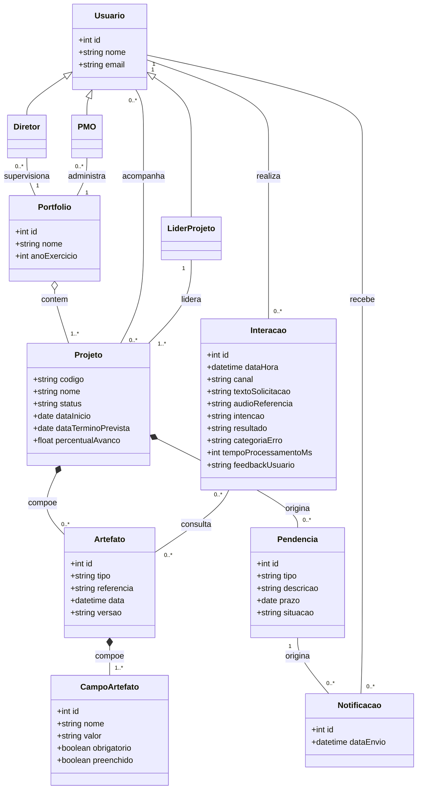
```mermaid
classDiagram
    direction TB

    class Portfolio {
        +int id
        +string nome
        +int anoExercicio
    }

    class Projeto {
        +string codigo
        +string nome
        +string status
        +date dataInicio
        +date dataTerminoPrevista
        +float percentualAvanco
    }

    class Usuario {
        +int id
        +string nome
        +string email
    }

    class Diretor
    class PMO
    class LiderProjeto

    class Artefato {
        +int id
        +string tipo
        +string referencia
        +datetime data
        +string versao
    }

    class CampoArtefato {
        +int id
        +string nome
        +string valor
        +boolean obrigatorio
        +boolean preenchido
    }

    class Pendencia {
        +int id
        +string tipo
        +string descricao
        +date prazo
        +string situacao
    }

    class Interacao {
        +int id
        +datetime dataHora
        +string canal
        +string textoSolicitacao
        +string audioReferencia
        +string intencao
        +string resultado
        +string categoriaErro
        +int tempoProcessamentoMs
        +string feedbackUsuario
    }

    class Notificacao {
        +int id
        +datetime dataEnvio
    }

    Usuario <|-- Diretor
    Usuario <|-- PMO
    Usuario <|-- LiderProjeto

    Portfolio o-- "1..*" Projeto : contem
    Projeto *-- "0..*" Artefato : compoe
    Artefato *-- "1..*" CampoArtefato : compoe
    Projeto *-- "0..*" Pendencia : origina

    Usuario "0..*" -- "0..*" Projeto : acompanha
    LiderProjeto "1" -- "1..*" Projeto : lidera
    Diretor "0..*" -- "1" Portfolio : supervisiona
    PMO "0..*" -- "1" Portfolio : administra

    Usuario "1" -- "0..*" Interacao : realiza
    Interacao "0..*" -- "0..*" Artefato : consulta
    Pendencia "1" -- "0..*" Notificacao : origina
    Usuario "1" -- "0..*" Notificacao : recebe
```

**Leitura do diagrama.** As nove classes herdadas da Sprint 1 permanecem inalteradas, com os mesmos atributos e as mesmas cardinalidades da Seção 2.2.1. Duas classes são acrescentadas nesta sprint, e ambas vêm do modelo de dados da Seção 3.6, não de uma decisão nova:

| Classe acrescentada | Origem | O que passa a ser representável |
|---|---|---|
| `Interacao` | Tabelas `auditoria.conversa` e `auditoria.mensagem` da Seção 3.6.5 | O registro de cada turno: quem pediu, por qual formato, qual intenção foi identificada, o que foi respondido, quanto tempo levou e qual foi o desfecho. A classe corresponde a duas tabelas porque a solicitação e a resposta são turnos irmãos de uma mesma conversa, conforme a decisão 8 da Seção 3.6.7. É o que torna o RNF04 e o RNF09 verificáveis no modelo, e não apenas no texto |
| `Notificacao` | Tabela `auditoria.notificacao` da Seção 3.6.5 | O envio efetivo de um aviso de pendência a um usuário. A associação `notifica`, que na Sprint 1 era muitos-para-muitos entre `Pendencia` e `Usuario`, ganha atributo próprio (`dataEnvio`) e por isso vira classe |

A associação `Interacao consulta Artefato`, de muitos para muitos, é o que sustenta o RF03: ela registra quais fontes fundamentaram cada resposta e permite reconstruir a origem de uma informação depois de exibida.

**Por que as classes de domínio não declaram operações.** A decisão foi tomada na Sprint 1, pela razão registrada ao final da Seção 2.2.1: estas classes representam a estrutura de dados do domínio de portfólio, e o comportamento do agente pertence à camada de aplicação. Mantê-la é o que impede que o diagrama de domínio se transforme em desenho de implementação. As operações estão no diagrama seguinte, que representa exatamente essa camada.

**Coerência com o modelo de dados.** Cada classe corresponde a uma tabela da Seção 3.6.5, com uma exceção deliberada: as três especializações de `Usuario` não viram tabelas, e sim a coluna `usuario.perfil` restringida por `CHECK`. A justificativa está na decisão 1 da Seção 3.6.7 — as especializações não têm atributos próprios, e o que as distingue é alcance de acesso, que já está expresso pelas associações.

### 3.9.2 Diagrama de classes da camada de aplicação

**Objetivo.** Representar as classes efetivamente implementadas em `src/`, com suas operações e dependências, tornando visível o desenho que sustenta as decisões de desacoplamento descritas nas Seções 3.2, 3.3 e 3.4.

**Requisitos relacionados.** RF01, RNF03, RNF05 e RNF06.

**Notação.** Diagrama de classes da UML. As interfaces aparecem com o estereótipo `<<interface>>`; a realização de interface usa seta tracejada de ponta triangular vazada, e a dependência de uso usa seta tracejada simples.

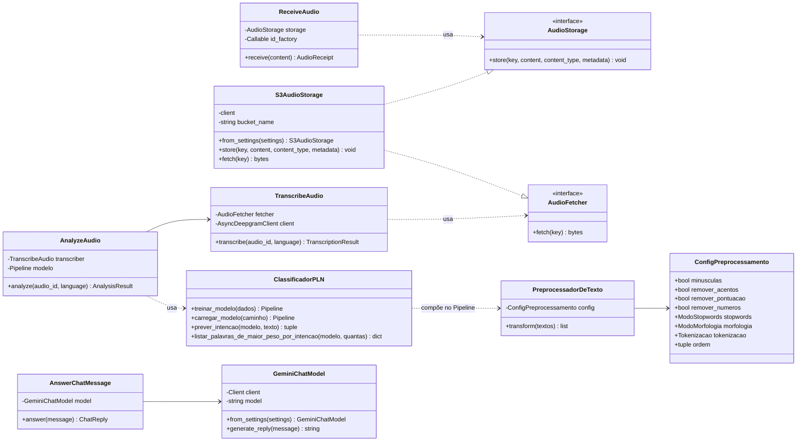
```mermaid
classDiagram
    direction LR

    class ReceiveAudio {
        -AudioStorage storage
        -Callable id_factory
        +receive(content) AudioReceipt
    }

    class AudioStorage {
        <<interface>>
        +store(key, content, content_type, metadata) void
    }

    class AudioFetcher {
        <<interface>>
        +fetch(key) bytes
    }

    class S3AudioStorage {
        -client
        -string bucket_name
        +from_settings(settings) S3AudioStorage
        +store(key, content, content_type, metadata) void
        +fetch(key) bytes
    }

    class TranscribeAudio {
        -AudioFetcher fetcher
        -AsyncDeepgramClient client
        +transcribe(audio_id, language) TranscriptionResult
    }

    class AnalyzeAudio {
        -TranscribeAudio transcriber
        -Pipeline modelo
        +analyze(audio_id, language) AnalysisResult
    }

    class AnswerChatMessage {
        -GeminiChatModel model
        +answer(message) ChatReply
    }

    class GeminiChatModel {
        -Client client
        -string model
        +from_settings(settings) GeminiChatModel
        +generate_reply(message) string
    }

    class ClassificadorPLN {
        +treinar_modelo(dados) Pipeline
        +carregar_modelo(caminho) Pipeline
        +prever_intencao(modelo, texto) tuple
        +listar_palavras_de_maior_peso_por_intencao(modelo, quantas) dict
    }

    class PreprocessadorDeTexto {
        -ConfigPreprocessamento config
        +transform(textos) list
    }

    class ConfigPreprocessamento {
        +bool minusculas
        +bool remover_acentos
        +bool remover_pontuacao
        +bool remover_numeros
        +ModoStopwords stopwords
        +ModoMorfologia morfologia
        +Tokenizacao tokenizacao
        +tuple ordem
    }

    S3AudioStorage ..|> AudioStorage
    S3AudioStorage ..|> AudioFetcher
    ReceiveAudio ..> AudioStorage : usa
    TranscribeAudio ..> AudioFetcher : usa
    AnalyzeAudio --> TranscribeAudio
    AnalyzeAudio ..> ClassificadorPLN : usa
    AnswerChatMessage --> GeminiChatModel
    ClassificadorPLN ..> PreprocessadorDeTexto : compõe no Pipeline
    PreprocessadorDeTexto --> ConfigPreprocessamento
```

**Leitura do diagrama.** Três decisões de projeto ficam visíveis na estrutura, e nenhuma delas é acidental.

A primeira é que **`ReceiveAudio` e `TranscribeAudio` não se conhecem**. O recebimento depende de `AudioStorage`, a transcrição depende de `AudioFetcher`, e a mesma classe concreta `S3AudioStorage` realiza as duas interfaces. O vínculo entre recebimento e transcrição é o `audio_id` e o objeto gravado, exatamente como a Seção 2.4 registra. Consequência prática: trocar o armazenamento afeta uma classe, e trocar o provedor de transcrição afeta outra, sem que uma mudança force a outra.

A segunda é que **o classificador não sabe que existe uma API**. `ClassificadorPLN` expõe funções que recebem texto e devolvem intenção, e é `AnalyzeAudio` — uma classe da camada de serviço — que encadeia transcrição e classificação. É esse desacoplamento que a oportunidade OP1 registra como concretizada na Seção 4.3.3 do `GestaoProjeto.md`.

A terceira é que **o pré-processamento é parte do modelo, e não um passo anterior a ele**. `PreprocessadorDeTexto` é a primeira etapa do `Pipeline` do scikit-learn, o que elimina por construção a possibilidade de treinar com uma configuração e prever com outra — erro que, como a Seção 3.3.5 observa, não levanta exceção nenhuma e apenas faz o modelo errar mais.

**Classes ainda não implementadas.** Não aparecem no diagrama, por não existirem: o componente de Autenticação SSO (RNF02), o extrator de entidades, o gerenciador de diálogo, o Agendador do RF05 e a camada de persistência das interações. Todas estão especificadas nas Seções 2.4, 3.3.11 e 3.6 e distribuídas entre as Sprints 3 e 4 conforme a Seção 3.8.

### 3.9.3 Visão de componentes com estado de implementação

**Objetivo.** Mostrar a organização da solução em componentes, as dependências entre eles e, sobretudo, **quais existem e quais estão apenas especificados**.

**Relação com a Seção 2.4.** O diagrama UML de componentes da solução é o da Imagem 2.4.2, e ele continua sendo a representação oficial da arquitetura lógica. O esquema abaixo não o substitui: é uma visão complementar, em notação de blocos, cuja única função é sobrepor à mesma estrutura a informação de estado de implementação, que o diagrama UML não carrega. As camadas, os nomes dos componentes e as direções de chamada são os mesmos.

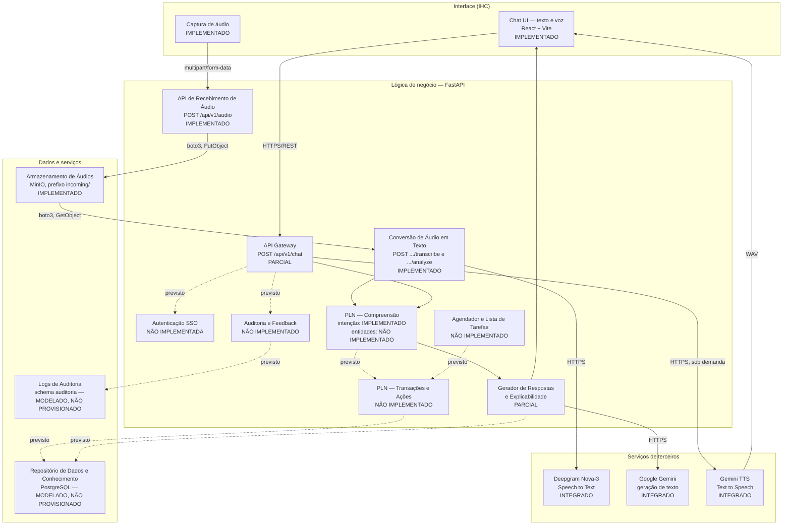
```mermaid
flowchart TB
    subgraph IHC["Interface (IHC)"]
        UI["Chat UI — texto e voz<br/>React + Vite<br/>IMPLEMENTADO"]
        CAP["Captura de áudio<br/>IMPLEMENTADO"]
    end

    subgraph NEG["Lógica de negócio — FastAPI"]
        RX["API de Recebimento de Áudio<br/>POST /api/v1/audio<br/>IMPLEMENTADO"]
        TR["Conversão de Áudio em Texto<br/>POST .../transcribe e .../analyze<br/>IMPLEMENTADO"]
        GW["API Gateway<br/>POST /api/v1/chat<br/>PARCIAL"]
        CA["Autenticação SSO<br/>NÃO IMPLEMENTADA"]
        PC["PLN — Compreensão<br/>intenção: IMPLEMENTADO<br/>entidades: NÃO IMPLEMENTADO"]
        PT["PLN — Transações e Ações<br/>NÃO IMPLEMENTADO"]
        GR["Gerador de Respostas<br/>e Explicabilidade<br/>PARCIAL"]
        AG["Agendador e Lista de Tarefas<br/>NÃO IMPLEMENTADO"]
        AF["Auditoria e Feedback<br/>NÃO IMPLEMENTADO"]
    end

    subgraph DAD["Dados e serviços"]
        AR["Armazenamento de Áudios<br/>MinIO, prefixo incoming/<br/>IMPLEMENTADO"]
        RD["Repositório de Dados e Conhecimento<br/>PostgreSQL — MODELADO, NÃO PROVISIONADO"]
        LG["Logs de Auditoria<br/>schema auditoria — MODELADO, NÃO PROVISIONADO"]
    end

    subgraph EXT["Serviços de terceiros"]
        STT["Deepgram Nova-3<br/>Speech to Text<br/>INTEGRADO"]
        LLM["Google Gemini<br/>geração de texto<br/>INTEGRADO"]
        TTS["Gemini TTS<br/>Text to Speech<br/>INTEGRADO"]
    end

    CAP -->|"multipart/form-data"| RX
    UI -->|"HTTPS/REST"| GW
    RX -->|"boto3, PutObject"| AR
    AR -->|"boto3, GetObject"| TR
    TR -->|"HTTPS"| STT
    TR --> PC
    GW -.->|"previsto"| CA
    GW --> PC
    PC --> GR
    PC -.->|"previsto"| PT
    PT -.->|"previsto"| RD
    GR -->|"HTTPS"| LLM
    GR -.->|"previsto"| RD
    GR --> UI
    GW -->|"HTTPS, sob demanda"| TTS
    TTS -->|"WAV"| UI
    AG -.->|"previsto"| PT
    AF -.->|"previsto"| LG
    GW -.->|"previsto"| AF
```

**Como ler o esquema.** As setas contínuas representam chamadas que existem no código; as tracejadas, chamadas especificadas e ainda não construídas. O rótulo de cada bloco declara o estado do componente em quatro valores: **implementado**, **parcial**, **não implementado** e, para os serviços externos, **integrado** ou **em aberto**.

Dois blocos merecem explicação do rótulo *parcial*. O **API Gateway** existe como ponto de entrada HTTP — o FastAPI compõe as quatro rotas sob o prefixo `/api/v1` —, mas não cumpre ainda as duas funções que a Seção 2.4 lhe atribui além do roteamento: autenticar a solicitação e registrar a interação. O **Gerador de Respostas** produz texto em linguagem natural pelo endpoint de chat, porém sem a recuperação de fontes que o RF03, o RNF11 e o RNF12 exigem; hoje ele responde a partir do conhecimento do próprio modelo de linguagem, e não de conteúdo recuperado do repositório, e essa distinção é justamente onde o risco AM8 se materializa.

**O caminho fechado.** Lendo apenas as setas contínuas, existe um percurso completo: `Captura de áudio → API de Recebimento → Armazenamento → Conversão de Áudio em Texto → Deepgram → PLN — Compreensão`. Esse é o resultado técnico da Sprint 2, e é o que os diagramas de sequência a seguir detalham.

### 3.9.4 Diagramas de sequência dos casos críticos

Os três cenários principais — consulta, sugestão de preenchimento e notificação — estão na Seção 2.2.2, e dois casos críticos de exceção na Seção 2.2.3. Esta subseção acrescenta os quatro cenários que a implementação desta sprint tornou concretos ou que a auditoria identificou como ausentes, e que o canal de voz exige.

Em todos eles, `:ChatUI` é o cliente no navegador, `:API` é a aplicação FastAPI, `:Armazenamento` é o bucket compatível com S3 e `:Deepgram` é o serviço externo de transcrição.

#### Cenário A — Consulta por voz bem-sucedida

**Objetivo.** Registrar o caminho completo entre a fala do usuário e a intenção classificada.
**Requisitos.** RF01, RNF03, RNF06.
**Estado.** Implementado e coberto por testes de rota e de serviço.

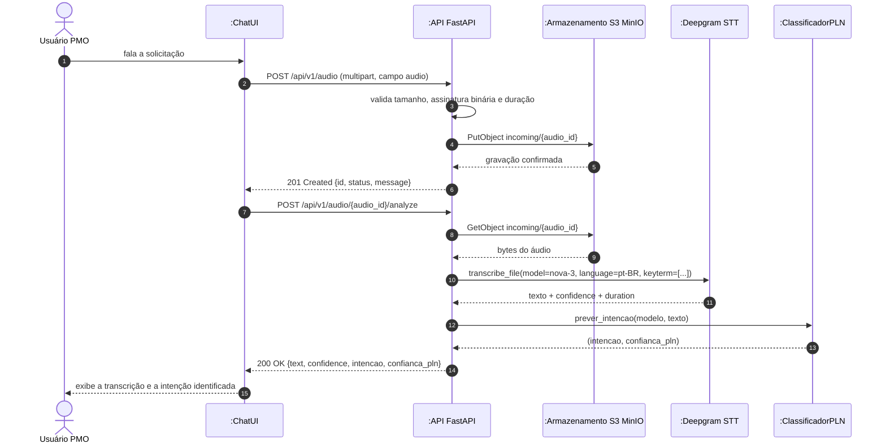
```mermaid
sequenceDiagram
    autonumber
    actor U as Usuário PMO
    participant UI as :ChatUI
    participant API as :API FastAPI
    participant ST as :Armazenamento S3 MinIO
    participant DG as :Deepgram STT
    participant PLN as :ClassificadorPLN

    U->>UI: fala a solicitação
    UI->>API: POST /api/v1/audio (multipart, campo audio)
    API->>API: valida tamanho, assinatura binária e duração
    API->>ST: PutObject incoming/{audio_id}
    ST-->>API: gravação confirmada
    API-->>UI: 201 Created {id, status, message}

    UI->>API: POST /api/v1/audio/{audio_id}/analyze
    API->>ST: GetObject incoming/{audio_id}
    ST-->>API: bytes do áudio
    API->>DG: transcribe_file(model=nova-3, language=pt-BR, keyterm=[...])
    DG-->>API: texto + confidence + duration
    API->>PLN: prever_intencao(modelo, texto)
    PLN-->>API: (intencao, confianca_pln)
    API-->>UI: 200 OK {text, confidence, intencao, confianca_pln}
    UI-->>U: exibe a transcrição e a intenção identificada
```

**Explicação.** O fluxo tem duas requisições, e não uma, pela decisão registrada na Seção 3.2.2: separar recebimento de transcrição permite retranscrever sem reenviar o arquivo. As mensagens 3 e 4 mostram por que a validação precede o armazenamento — arquivo inválido nunca chega a ocupar o bucket nem a consumir crédito do provedor. A mensagem 12 evidencia a diferença entre `confidence`, que é do reconhecedor de fala, e `confianca_pln`, que é do classificador: são grandezas distintas e não devem ser somadas nem comparadas.

**O que este cenário ainda não contém.** A autenticação do usuário, a recuperação da informação nas fontes e o registro de auditoria. Os três estão especificados e ausentes do código, conforme a Seção 3.3.11.

**Ressalva sobre o rótulo devolvido.** A mensagem 12 devolve uma intenção do catálogo da Seção 3.1 porque é esse o contrato-alvo. O modelo versionado hoje reconhece três classes genéricas, e não o catálogo, conforme a Seção 3.3.2: o fluxo do diagrama está implementado, mas o vocabulário de saída ainda não corresponde ao especificado.

#### Cenário B — Áudio recusado na validação

**Objetivo.** Registrar o tratamento dos erros de entrada do canal de voz.
**Requisitos.** RF01; contrato da Seção 3.4.
**Estado.** Implementado e coberto por testes.

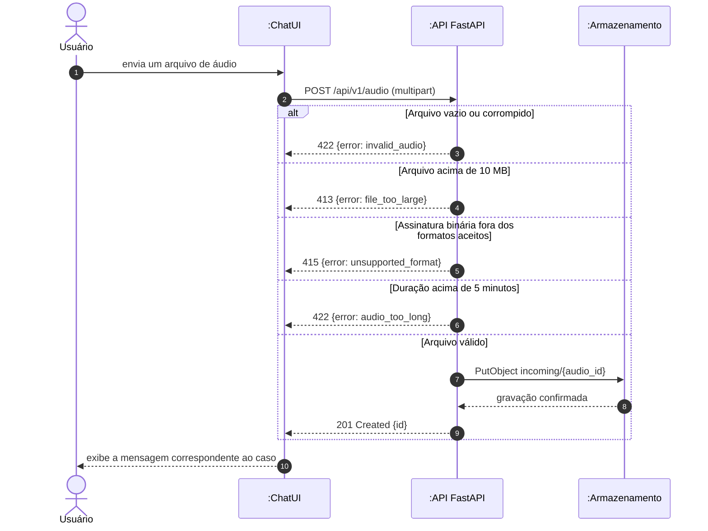
```mermaid
sequenceDiagram
    autonumber
    actor U as Usuário
    participant UI as :ChatUI
    participant API as :API FastAPI
    participant ST as :Armazenamento

    U->>UI: envia um arquivo de áudio
    UI->>API: POST /api/v1/audio (multipart)

    alt Arquivo vazio ou corrompido
        API-->>UI: 422 {error: invalid_audio}
    else Arquivo acima de 10 MB
        API-->>UI: 413 {error: file_too_large}
    else Assinatura binária fora dos formatos aceitos
        API-->>UI: 415 {error: unsupported_format}
    else Duração acima de 5 minutos
        API-->>UI: 422 {error: audio_too_long}
    else Arquivo válido
        API->>ST: PutObject incoming/{audio_id}
        ST-->>API: gravação confirmada
        API-->>UI: 201 Created {id}
    end

    UI-->>U: exibe a mensagem correspondente ao caso
```

**Explicação.** A ordem das alternativas é a ordem real das verificações no código, e ela não é arbitrária: tamanho antes de conteúdo, porque conferir um número é mais barato que abrir o contêiner; assinatura binária antes de duração, porque a duração só pode ser lida de um contêiner reconhecido. Em nenhum dos quatro ramos de erro o armazenamento é acionado. Note também que os quatro casos produzem o mesmo corpo padronizado, com `error` e `message`, o que permite ao frontend tratar todos por um único caminho de código e diferenciar a mensagem apenas pelo campo `error`.

#### Cenário C — Falha do serviço de voz

**Objetivo.** Registrar o comportamento quando o provedor externo de transcrição não responde ou responde com erro.
**Requisitos.** RF01, RNF07; risco AM9.
**Estado.** Implementado quanto à tradução do erro; a política de tempo limite e de repetição é **DECISÃO TÉCNICA EM ABERTO**.

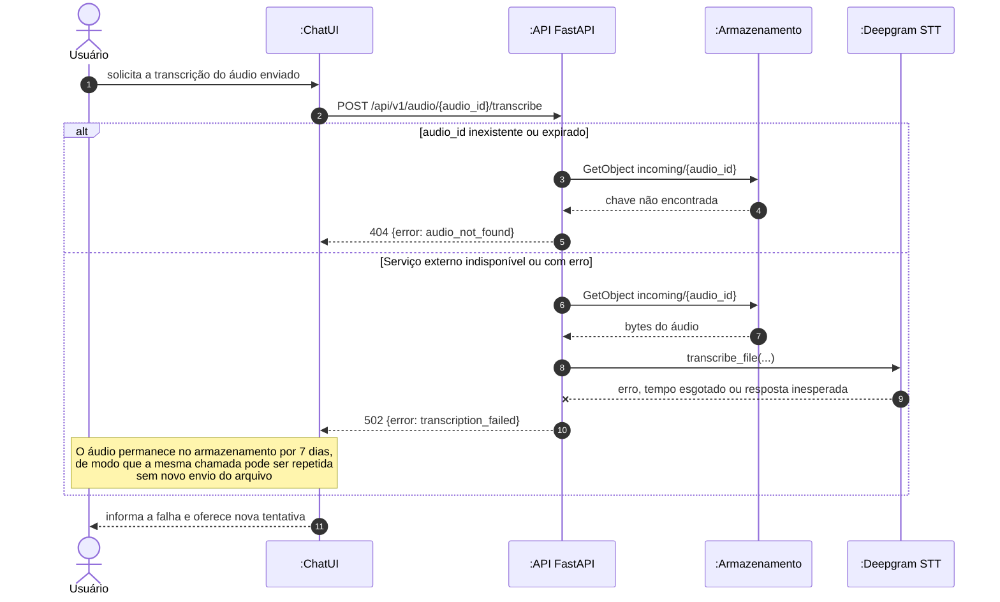
```mermaid
sequenceDiagram
    autonumber
    actor U as Usuário
    participant UI as :ChatUI
    participant API as :API FastAPI
    participant ST as :Armazenamento
    participant DG as :Deepgram STT

    U->>UI: solicita a transcrição do áudio enviado
    UI->>API: POST /api/v1/audio/{audio_id}/transcribe

    alt audio_id inexistente ou expirado
        API->>ST: GetObject incoming/{audio_id}
        ST-->>API: chave não encontrada
        API-->>UI: 404 {error: audio_not_found}
    else Serviço externo indisponível ou com erro
        API->>ST: GetObject incoming/{audio_id}
        ST-->>API: bytes do áudio
        API->>DG: transcribe_file(...)
        DG--xAPI: erro, tempo esgotado ou resposta inesperada
        API-->>UI: 502 {error: transcription_failed}
        Note over UI,U: O áudio permanece no armazenamento por 7 dias,<br/>de modo que a mesma chamada pode ser repetida<br/>sem novo envio do arquivo
    end

    UI-->>U: informa a falha e oferece nova tentativa
```

**Explicação.** A escolha de `502`, e não `500`, é o que permite à interface oferecer nova tentativa: o código informa ao cliente que o defeito está a montante, e não na aplicação. A nota do diagrama registra a consequência arquitetural da retenção de sete dias definida na Seção 3.2.5 — é ela que torna a repetição barata, porque o arquivo não precisa ser reenviado. O que falta neste cenário é a repetição automática com recuo progressivo: hoje, a nova tentativa depende de ação do usuário.

#### Cenário D — Solicitação ambígua ou fora do catálogo

**Objetivo.** Registrar o comportamento previsto quando o classificador não identifica a intenção com confiança suficiente.
**Requisitos.** RF02, RNF03; catálogo da Seção 3.1, intenção `fora_do_catalogo`.
**Estado.** **Não implementado.** Este diagrama representa o comportamento especificado, e não o atual; hoje a aplicação devolve sempre a intenção de maior probabilidade, conforme a Seção 3.3.12.

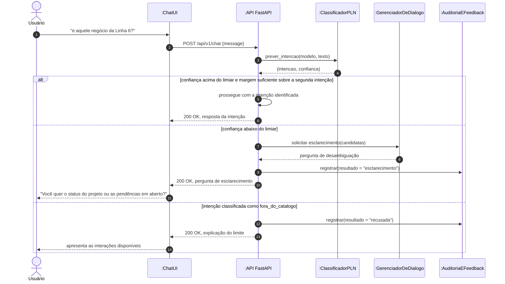
```mermaid
sequenceDiagram
    autonumber
    actor U as Usuário
    participant UI as :ChatUI
    participant API as :API FastAPI
    participant PLN as :ClassificadorPLN
    participant DLG as :GerenciadorDeDialogo
    participant AUD as :AuditoriaEFeedback

    U->>UI: "e aquele negócio da Linha 6?"
    UI->>API: POST /api/v1/chat {message}
    API->>PLN: prever_intencao(modelo, texto)
    PLN-->>API: (intencao, confianca)

    alt confiança acima do limiar e margem suficiente sobre a segunda intenção
        API->>API: prossegue com a intenção identificada
        API-->>UI: 200 OK, resposta da intenção
    else confiança abaixo do limiar
        API->>DLG: solicitar esclarecimento(candidatas)
        DLG-->>API: pergunta de desambiguação
        API->>AUD: registrar(resultado = "esclarecimento")
        API-->>UI: 200 OK, pergunta de esclarecimento
        UI-->>U: "Você quer o status do projeto ou as pendências em aberto?"
    else intenção classificada como fora_do_catalogo
        API->>AUD: registrar(resultado = "recusada")
        API-->>UI: 200 OK, explicação do limite
        UI-->>U: apresenta as interações disponíveis
    end
```

**Explicação.** O diagrama existe justamente porque a regra de negócio já está definida na Seção 3.1 e o mecanismo que a executa não. Ele torna explícito o que precisa ser construído: um limiar de confiança, uma margem mínima entre a primeira e a segunda intenção candidata, e um componente que formule a pergunta de desambiguação. Os dois primeiros são números a calibrar sobre a partição de teste isolada prevista na task T14 da Sprint 3, e não devem ser escolhidos por intuição, pela razão de calibração registrada na Seção 3.3.3. Note ainda que os três ramos registram desfechos distintos na auditoria — `sucesso`, `esclarecimento` e `recusada` —, valores que já existem no `CHECK` da coluna `auditoria.mensagem.resultado` definida na Seção 3.6.5.

#### Cenário E — Solicitação sem autenticação válida

**Objetivo.** Registrar o comportamento previsto quando uma funcionalidade protegida é chamada sem identidade SSO válida.
**Requisitos.** RNF02.
**Estado.** **Não implementado.** O componente de autenticação aparece em traço interrompido na Seção 2.4 exatamente por isso.

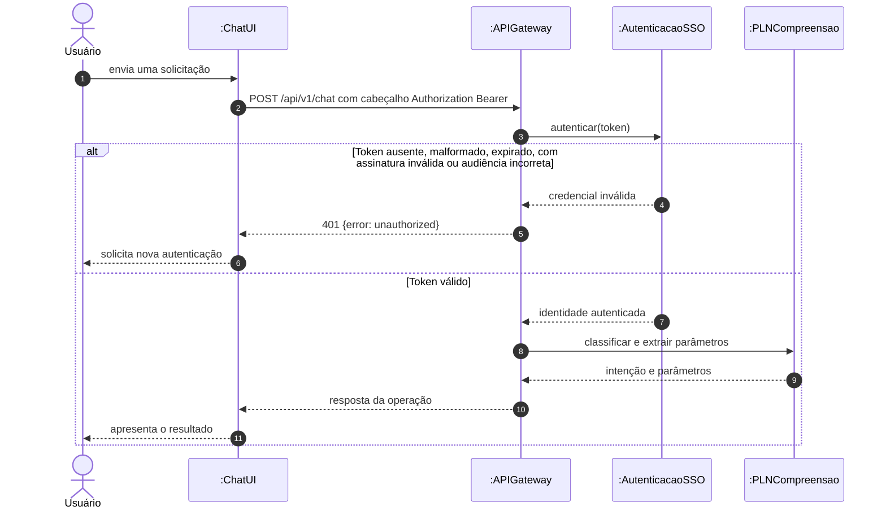
```mermaid
sequenceDiagram
    autonumber
    actor U as Usuário
    participant UI as :ChatUI
    participant GW as :APIGateway
    participant CA as :AutenticacaoSSO
    participant PLN as :PLNCompreensao

    U->>UI: envia uma solicitação
    UI->>GW: POST /api/v1/chat com cabeçalho Authorization Bearer
    GW->>CA: autenticar(token)

    alt Token ausente, malformado, expirado, com assinatura inválida ou audiência incorreta
        CA-->>GW: credencial inválida
        GW-->>UI: 401 {error: unauthorized}
        UI-->>U: solicita nova autenticação
    else Token válido
        CA-->>GW: identidade autenticada
        GW->>PLN: classificar e extrair parâmetros
        PLN-->>GW: intenção e parâmetros
        GW-->>UI: resposta da operação
        UI-->>U: apresenta o resultado
    end
```

**Explicação.** A autenticação responde quem é o usuário e ocorre antes de qualquer processamento de linguagem ou acesso aos dados. Por isso, todas as condições de credencial ausente ou inválida encerram o fluxo com `401`, enquanto uma credencial válida permite que a mesma regra de negócio seja executada para qualquer perfil profissional. O RNF02 não estabelece autorização por cargo. A única distinção de acesso planejada é a identificação administrativa usada pelo RNF09 para consulta dos registros de auditoria.

#### Cobertura dos cenários

| Cenário | Onde está documentado | Estado |
|---|---|---|
| Consulta textual bem-sucedida | Seção 2.2.2, cenário 1 | Especificado; parcialmente implementado pelo endpoint de chat |
| Sugestão de preenchimento de documento | Seção 2.2.2, cenário 2 | Especificado; não implementado |
| Notificação proativa de pendências | Seção 2.2.2, cenário 3 | Especificado; não implementado |
| Intenção fora do catálogo ou fora do limite de atuação | Seção 2.2.3, caso crítico 1, e Cenário D desta seção | Especificado; não implementado |
| Fonte indisponível ou sem evidência suficiente | Seção 2.2.3, caso crítico 2 | Especificado; não implementado |
| **Consulta por voz bem-sucedida** | **Cenário A desta seção** | **Implementado** |
| **Áudio recusado na validação** | **Cenário B desta seção** | **Implementado** |
| **Falha do serviço de voz** | **Cenário C desta seção** | **Implementado quanto ao tratamento do erro** |
| **Usuário sem autenticação válida** | **Cenário E desta seção** | **Especificado; não implementado** |

### 3.9.5 Matriz de rastreabilidade técnica

A matriz fecha o artefato ligando cada requisito ao mecanismo que o realiza. Ela permite verificar as ausências que importam: requisito sem componente, endpoint sem requisito, entidade sem uso, diagrama sem cenário e RNF sem mecanismo técnico. A coluna **Sprint** indica o ciclo em que o item é construído, conforme a Seção 3.8.

| RF/RNF | API | NLP | Entidade | Componente | Sequência | Teste | Sprint |
|---|---|---|---|---|---|---|---|
| RF01 — solicitações por áudio e texto | `POST /api/v1/audio`, `POST .../transcribe`, `POST .../analyze`, `POST /api/v1/chat` | Entrada do pipeline: a transcrição alimenta o mesmo classificador do texto digitado | `Interacao.canal`, `Interacao.audioReferencia` | Chat UI, Captura de áudio, API de Recebimento, Conversão de Áudio em Texto | 2.2.2 cenário 1; 3.9.4 cenários A, B e C | `test_audio_api`, `test_audio_service`, `test_transcription_api`, `test_transcription_service`, `test_analysis_api` | Construída na 2; concluída na 3 |
| RF02 — consultar dados de projetos | `POST /api/v1/chat`; consulta a fontes prevista | Classificação de `consultar_projeto_sintetico` e extração de parâmetros (pendente) | `Projeto`, `Portfolio`, `Artefato` | PLN — Compreensão, Gerador de Respostas, Repositório de Dados | 2.2.2 cenário 1; 3.9.4 cenário D | Plano de testes funcionais, task T30 | 3 e 4 |
| RF03 — apresentar a fonte da informação | Campo de fontes na resposta, a definir | Seleção das fontes que fundamentam a resposta | `Artefato.referencia`, `Artefato.data`, associação `Interacao consulta Artefato` | Gerador de Respostas e Explicabilidade, Repositório de Dados | 2.2.2 cenário 1; 2.2.3 caso crítico 2 | Plano de testes funcionais, task T30 | 4 |
| RF04 — sugerir preenchimento de documentos | Endpoint a definir | Classificação das intenções `orientar_*` e `analisar_completude_coerencia` | `CampoArtefato.obrigatorio`, `CampoArtefato.preenchido` | PLN — Transações e Ações | 2.2.2 cenário 2 | Plano de testes funcionais, task T30 | 4 |
| RF05 — notificar pendências | Sem endpoint: fluxo iniciado pelo Agendador | Classificação de `gerar_alertas_pendencias` para a consulta correspondente | `Pendencia`, `Notificacao`, associação `acompanha` | Agendador, Lista de Tarefas, PLN — Transações e Ações | 2.2.2 cenário 3 | Plano de testes funcionais, task T30 | 4 e 5 |
| RF06 — atualizar cadastro por instrução | Endpoint de escrita a definir | Extração de campos e valores da instrução | `Projeto`, `LiderProjeto`, `projeto.lider_id` | PLN — Transações e Ações | 2.2.2 cenário 2 (variação) | Plano de testes funcionais, task T30 | 5 |
| RNF01 — desempenho | Tempo de resposta de todas as rotas | Classificação em microssegundos; o custo dominante é a chamada externa | `Interacao.tempoProcessamentoMs` | API Gateway, Conversão de Áudio em Texto | 3.9.4 cenário A | Teste de desempenho, task T31 | 4 |
| RNF02 — autenticação | Cabeçalho `Authorization` e resposta `401` | Não se aplica | Identidade técnica associada ao usuário; sem autorização por cargo | Autenticação SSO, API Gateway | 3.9.4 cenário E | `CT-RNF02-P` e `CT-RNF02-N` | 3 e 4 |
| RNF03 — qualidade da classificação de intenções | Campo `confianca_pln` da resposta de análise e decisão do limiar | `MultinomialNB` sobre vetorização esparsa; F1-macro atual de 0,6736, abaixo da meta | `Interacao.intencao` | PLN — Compreensão | 3.9.4 cenários A e D | `CT-RNF03-P` e `CT-RNF03-N`; testes automatizados existentes apoiam a regressão | Instrumento construído na 2; medição cega pendente para a 3 |
| RNF04 — rastreabilidade | Identificador de cada interação e registro de toda requisição | Intenção e termos de maior peso registráveis | `auditoria.mensagem`, `auditoria.mensagem_fonte` | Auditoria e Feedback, Logs de Auditoria | 2.2.2 cenário 1, automensagem `log()` | `CT-RNF04-P` e `CT-RNF04-N` | 3 |
| RNF05 — interoperabilidade | Contrato REST versionado em `/api/v1` | Núcleo de PLN sem dependência da camada de API | Não se aplica | API Gateway | 3.9.4 cenário A | `CT-RNF05-P` e `CT-RNF05-N` entre React e Python | 4 e 5 |
| RNF06 — qualidade da transcrição | `POST .../transcribe`, campo `confidence` | Entrada do pipeline; `keyterm` cobre o vocabulário do domínio | `Interacao.audioReferencia` | Conversão de Áudio em Texto, Deepgram | 3.9.4 cenários A e C | Medição de WER, prevista para a 3 | 3 |
| RNF07 — disponibilidade | `GET /health`, a implementar, com 200 ou 503 em até dois segundos | Não se aplica | Não se aplica | Rastreabilidade (CloudWatch) | 3.9.4 cenário C | `CT-RNF07-P` e `CT-RNF07-N` | 4 |
| RNF08 — usabilidade das respostas | Formato da resposta devolvida | Não se aplica | Não se aplica | Chat UI, Gerador de Respostas | 2.2.2 cenário 1 | Teste de usabilidade com SUS, task T34 | 3 e 4 |
| RNF09 — auditabilidade das interações | Consulta administrativa no banco ou serviço | Não se aplica | `auditoria.mensagem`, `auditoria.evento_plataforma`, `auditoria.notificacao` | Auditoria e Feedback | 3.9.4 cenários D e E | `CT-RNF09-P` e `CT-RNF09-N` | 3 e 4 |
| RNF10 — escalabilidade | Todas as rotas sob carga | Matriz esparsa que não cresce proporcionalmente ao corpus | Não se aplica | Web App Backend | Não aplicável | Teste de carga progressiva, task T31 | 4 |
| RNF11 — explicabilidade | Justificativa curta e fontes na resposta | Evidências recuperadas sustentam o conteúdo sugerido | `auditoria.mensagem_fonte` | Gerador de Respostas e Explicabilidade | 2.2.2 cenário 2 | `CT-RNF11-P` e `CT-RNF11-N` | 4 |
| RNF12 — fundamentação das respostas | Referências e data na resposta de consulta | Evidências recuperadas devem sustentar cada afirmação factual | `auditoria.mensagem_fonte`, `mensagem.conteudo` | Gerador de Respostas, Repositório de Dados | 2.2.2 cenário 1; risco AM8 | `CT-RNF12-P` e `CT-RNF12-N` | 4 |

**Ausências identificadas na verificação da matriz.** A leitura por coluna expõe cinco lacunas, todas já encaminhadas neste documento e no planejamento da Sprint 3:

1. **RF03, RF04, RF05 e RF06 não têm endpoint definido.** São os quatro requisitos cuja construção começa na Sprint 4; o contrato precisa ser definido antes, e a definição está entre as tasks daquele ciclo.
2. **RNF02 não tem mecanismo implementado.** A autenticação SSO é a lacuna de maior consequência: sem ela, os endpoints não podem ser expostos publicamente, conforme registrado na Seção 3.4.
3. **RNF07 depende de um endpoint que não existe.** O `GET /health` é pressuposto pelo pipeline da Seção 3.7.6 e está no item 13 da Seção 3.7.9.
4. **Nenhum endpoint está sem requisito de origem.** As quatro rotas implementadas rastreiam para RF01 e RF02.
5. **Nenhuma entidade do modelo está sem uso.** Todas as onze tabelas da Seção 3.6.5 aparecem em pelo menos uma linha desta matriz, o que confirma que o modelo de dados não excede o necessário para sustentar os casos de uso.

# 4. Prototipação Exploratória — Design e UX

## 4.1 Questão de Projeto

**Até onde o agente de IA deve ajudar proativamente o usuário durante sua rotina de trabalho e em quais situações deve permanecer em silêncio?**

A questão permanece em aberto porque uma IA excessivamente proativa pode interromper, recomendar conteúdo inadequado ou reduzir a sensação de controle, enquanto uma IA totalmente reativa pode deixar informações relevantes ocultas quando o usuário não sabe o que perguntar. A decisão afeta quem inicia a interação, quando ela ocorre e como contexto e intenção são considerados. A prototipação permite tornar visíveis consequências que uma discussão abstrata não evidencia, sem exigir uma escolha final nesta etapa.

## 4.2 Alternativas Divergentes

Para investigar diferentes formas de interação entre o usuário e o agente de IA durante a rotina de trabalho, foram propostas duas alternativas que apresentam comportamentos distintos quanto à iniciativa do agente e à forma de acesso às informações dos projetos.

### 4.2.1 Alternativa A: Interação Proativa e Contextual

Nesta alternativa, o agente acompanha o contexto das atividades realizadas pelo usuário durante sua rotina de trabalho e identifica informações e documentos do banco de dados que possam ser relevantes para a atividade em andamento. Ao encontrar conteúdos potencialmente úteis, o agente apresenta uma recomendação, permitindo que o usuário escolha se deseja ou não acessá-los.

A proposta busca explorar uma interação em que o agente possui maior iniciativa, oferecendo informações sem depender de uma consulta explícita. O usuário, entretanto, mantém o controle sobre a interação, podendo aceitar ou rejeitar as recomendações apresentadas.

O agente apenas recomenda: não altera documentos nem aplica informações automaticamente. A alternativa depende de sinais de contexto e, quando possível, da intenção do usuário; uma recomendação pode ser marcada como útil ou não útil. Sua vantagem potencial é antecipar informações, enquanto seu risco central é interromper ou sugerir algo tematicamente relacionado, mas inadequado à tarefa atual.

Ao final do período de trabalho, as informações consideradas relevantes podem ser organizadas em um ambiente integrado ao Microsoft Teams, junto ao chatbot do agente, permitindo visualizar conteúdos priorizados, pendências identificadas e possíveis próximos passos.

### 4.2.2 Alternativa B: Interação Sob Demanda

Nesta alternativa, o agente não apresenta recomendações durante as atividades do usuário. A interação ocorre somente quando o próprio usuário identifica uma necessidade e inicia uma consulta ao agente, informando o que deseja encontrar ou compreender sobre determinado projeto.

A partir da solicitação realizada, o agente consulta as informações disponíveis e apresenta os documentos e conteúdos relacionados à necessidade expressa pelo usuário. Dessa forma, a iniciativa da interação permanece com a pessoa, que determina quando utilizar o agente e quais informações deseja consultar.

Essa alternativa busca explorar uma experiência com menor nível de intervenção durante a rotina de trabalho, priorizando o controle do usuário sobre o momento e o contexto em que o agente é acionado.

A alternativa reduz interrupções e mantém o momento da interação predominantemente sob controle do usuário. Em contrapartida, exige que a pessoa reconheça a própria necessidade e consiga formular uma consulta; informações importantes podem permanecer ocultas quando ela não sabe o que perguntar. Por isso, a interação sob demanda é uma alternativa defensável, e não uma versão deliberadamente limitada da solução.

### Divergência entre as alternativas

As alternativas diferem principalmente em **quem inicia a interação**. Na Alternativa A, o agente identifica oportunidades de apoio e apresenta recomendações de forma proativa durante a atividade. Na Alternativa B, o agente permanece disponível, mas só realiza a busca e apresenta informações após uma solicitação explícita do usuário.

| Dimensão | Alternativa A — proativa e contextual | Alternativa B — sob demanda |
|---|---|---|
| Início da interação | Agente de IA | Usuário |
| Controle do momento | Compartilhado entre agente e usuário | Predominantemente do usuário |
| Risco principal | Interrupção ou recomendação inadequada | Informação relevante não ser descoberta |
| Papel do contexto | Apoia a decisão de quando sugerir | É interpretado depois da solicitação |
| Esforço do usuário | Menor para descobrir informações | Maior para formular a consulta |
| Decisão em aberto | Quando o agente deve interferir | Como apoiar quem não sabe o que perguntar |

Essas diferenças alteram o esforço para encontrar informações, a frequência de interrupções e o controle percebido. Nenhuma alternativa é considerada definitiva ou superior; a exploração compara consequências e mantém a decisão em aberto.

## 4.3 Formatos de Prototipação

Para explorar as duas alternativas propostas, foram escolhidos formatos que permitem observar aspectos diferentes da interação. Ambos são instrumentos de investigação e não representam versões finais da solução.

| Protótipo | Formato e materiais documentados | Modo de construção e execução | Pergunta que permite investigar | O que não consegue representar |
|---|---|---|---|---|
| A — proativo e contextual | vídeo, roteiro, encenação por integrantes e animações de recomendação | roteiro percorrido e comportamento encenado ao longo de uma rotina simulada | quando uma recomendação aparece, interrompe, é aceita ou recusada | reação espontânea, detecção real de contexto, frequência acumulada e precisão |
| B — sob demanda | mockups PNG de uma interface conversacional com texto e voz simulada | estados visuais construídos e sessão de uso declarada pela equipe | como pedidos são formulados e como ambiguidades, permissões e fontes aparecem na interface | PLN, voz, fontes, permissões e latência em funcionamento real |

### 4.3.1 Alternativa A: Vídeo e Encenação da Interação Proativa

A alternativa de interação proativa e contextual foi explorada por meio de um **vídeo encenado**, representando um usuário durante sua rotina de trabalho enquanto o agente acompanha o contexto das atividades realizadas.

Ao longo da encenação, foram previstos momentos em que o agente identifica documentos potencialmente relevantes e apresenta recomendações visuais ao usuário. O usuário aceita ou rejeita essas recomendações no roteiro, tornando perceptível como a iniciativa do agente pode interferir no fluxo normal de trabalho.

O formato foi escolhido por permitir representar a experiência ao longo do tempo e investigar questões como **quando uma recomendação deveria aparecer, com que frequência o agente deveria intervir, como o usuário mantém controle sobre as sugestões e em quais situações uma recomendação pode deixar de ajudar e passar a interromper a atividade**.

O vídeo não busca representar uma interface final ou tecnicamente implementada. Seu formato principal é a **encenação do comportamento ao longo do tempo**: as telas e animações funcionam como adereços narrativos para tornar a recomendação perceptível. Por isso, ele é tratado como formato não baseado em uma interface digital funcional. O formato permite explorar ritmo, interrupção, aceitação e recusa, mas não consegue representar detecção real de contexto, reação espontânea ou precisão técnica.

### 4.3.2 Alternativa B: Interface de Interação Sob Demanda

A alternativa de interação sob demanda foi explorada por meio de uma **interface gráfica conversacional**, na qual o usuário inicia a interação com o agente quando identifica a necessidade de consultar alguma informação relacionada aos projetos.

Nesse formato, o usuário pode realizar perguntas em linguagem natural por **texto ou voz**. A partir da solicitação, o agente interpreta a consulta, busca as informações disponíveis nas fontes de dados do projeto e apresenta uma resposta em linguagem natural, podendo também indicar os documentos e fontes relacionados à informação apresentada.

Diferentemente da alternativa proativa, o agente não acompanha continuamente as atividades realizadas pelo usuário nem apresenta recomendações espontâneas. A interação depende de uma ação explícita do usuário, que determina quando o agente será acionado e qual informação deseja consultar.

Esse formato permite investigar **como o usuário formula suas necessidades em linguagem natural, quanto contexto precisa fornecer para obter uma resposta adequada e quais dificuldades podem surgir quando ele precisa identificar a necessidade e iniciar a interação com o agente**.

A prototipação por interface gráfica também permite representar e explorar situações como consultas ambíguas, perguntas por texto ou voz, necessidade de esclarecimento e apresentação das fontes utilizadas pelo agente.

### Relação dos formatos com a questão de projeto

Os dois formatos permitem investigar a questão definida na [seção 4.1](#41-questão-de-projeto) a partir de formas distintas de interação entre o usuário e o agente. O vídeo encenado permite explorar uma experiência proativa e contextual, na qual o agente acompanha a rotina de trabalho e pode recomendar informações e documentos sem depender de uma solicitação inicial. Já a interface gráfica conversacional permite explorar uma experiência sob demanda, em que o usuário inicia a interação por texto ou voz e recebe respostas em linguagem natural a partir de suas solicitações.

A exploração dos dois formatos permite observar diferenças relacionadas à iniciativa do agente, ao controle do usuário, à interrupção e ao esforço para acessar informações. A encenação investiga o comportamento distribuído ao longo de uma rotina; a interface torna concretos pedidos, ambiguidades e respostas. O objetivo não é determinar qual alternativa é superior, mas compreender consequências e limitações de cada uma.

## 4.4 Construção dos Protótipos

Nesta seção serão apresentados os dois protótipos construídos a partir das alternativas definidas na [seção 4.2](#42-alternativas-divergentes), juntamente com os registros visuais de sua construção.

### 4.4.1 Construção do Protótipo A: Interação Proativa e Contextual

#### Demonstração do Protótipo A

O Protótipo A foi materializado por uma encenação em vídeo, seguindo o [roteiro completo](RoteiroPrototipoA.md). A sequência abaixo funciona como storyboard do comportamento representado e permite percorrer a alternativa mesmo sem depender do arquivo de vídeo editado:

**Demonstração audiovisual:** [assistir ao vídeo do Protótipo A](../assets/Vídeos/Vídeo-A.mp4).

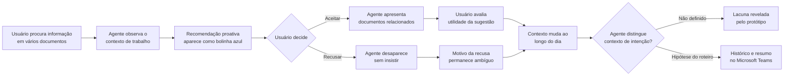
```mermaid
flowchart LR
    A[Usuário procura informação<br/>em vários documentos] --> B[Agente observa o<br/>contexto de trabalho]
    B --> C[Recomendação proativa<br/>aparece como bolinha azul]
    C --> D{Usuário decide}
    D -->|Aceitar| E[Agente apresenta<br/>documentos relacionados]
    D -->|Recusar| F[Agente desaparece<br/>sem insistir]
    E --> G[Usuário avalia<br/>utilidade da sugestão]
    F --> H[Motivo da recusa<br/>permanece ambíguo]
    G --> I[Contexto muda ao<br/>longo do dia]
    H --> I
    I --> J{Agente distingue<br/>contexto de intenção?}
    J -->|Não definido| K[Lacuna revelada<br/>pelo protótipo]
    J -->|Hipótese do roteiro| L[Histórico e resumo<br/>no Microsoft Teams]
```

O roteiro e o storyboard demonstram uma experiência proativa ao longo do tempo; não representam uma interface implementada nem comprovam integração com Microsoft Teams ou bases corporativas. O arquivo final e os registros brutos da gravação devem ser mantidos como evidências complementares, conforme delimitado na [seção 4.13](#413-registros-visuais).

### 4.4.2 Construção do Protótipo B: Interação Sob Demanda

#### Demonstração do Protótipo B

<div align="center">
<sub>Imagem 4.4.2 - Mockup da interface gráfica conversacional do agente — Interação Sob Demanda</sub><br>
  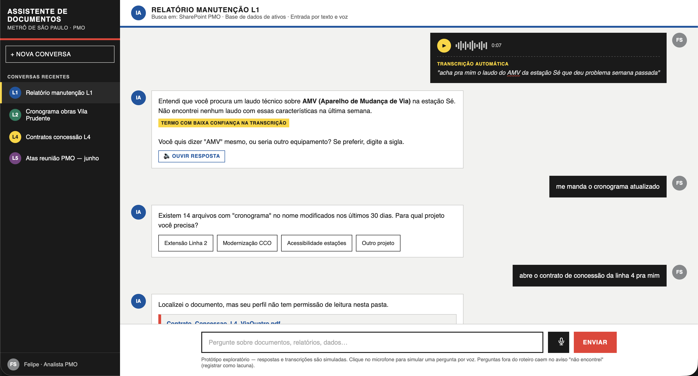<br>
  <sup>Fonte: Material produzido pelos autores, 2026.</sup>
</div>

#### Evolução: da simulação à interface funcional

Após a exploração do protótipo simulado, a interface conversacional definida no formato da [seção 4.3.2](#432-alternativa-b-interface-de-interação-sob-demanda) evoluiu para uma **implementação funcional em React**, construída entre 25 e 26 de agosto de 2026 na branch `feat/contruir-interface`. A implementação preserva a estrutura convencional de chatbot adotada na prototipação — sidebar de conversas, histórico e campo de entrada — e mantém a identidade visual metroviária e a entrada por voz como elementos centrais da interação sob demanda.

A aplicação está no diretório `frontend/` do repositório, construída com **React 19** e **Vite**, estilização com **Tailwind CSS 4** e animações com **framer-motion**. A interface é organizada em quatro abas — **Chat**, **Voz**, **Agenda** e **Tarefas** —, com modal de configurações (tema claro/escuro/sistema), compartilhamento e layout responsivo com navegação inferior no mobile. A camada `frontend/src/lib/api.js` já prepara a integração com o backend (`/api/v1/chat`, `/api/v1/audio`, `/api/v1/tasks`, `/api/v1/calendar/events`), com fallbacks quando os serviços estão indisponíveis: o chat responde com mensagem fixa e as abas de Agenda e Tarefas exibem dados sintéticos do contexto do Metrô. Para executar localmente: `cd frontend && npm ci && npm run dev`.

As capturas a seguir registram a evolução em três momentos: a interface conversacional real substituindo o mockup estático, a entrada de voz com captura real de microfone e a expansão para novas telas além do escopo original do protótipo.

<div align="center">
<sub>Imagem 4.4.3 - Interface funcional em modo escuro: tela inicial do chat, com sidebar de conversas, histórico e barra de prompt</sub><br>
  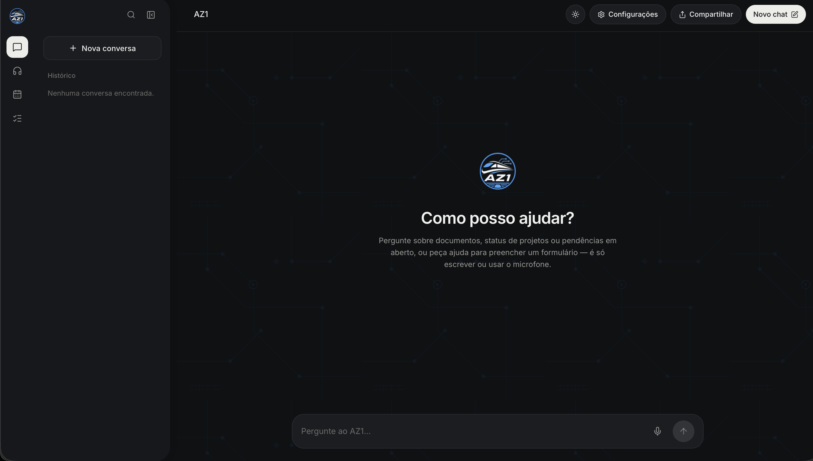<br>
  <sup>Fonte: Material produzido pelos autores, 2026.</sup>
</div>

<div align="center">
<sub>Imagem 4.4.4 - Entrada de voz ativa na barra de prompt: a onda sonora reage ao volume real do microfone, evolução em relação à gravação simulada do protótipo</sub><br>
  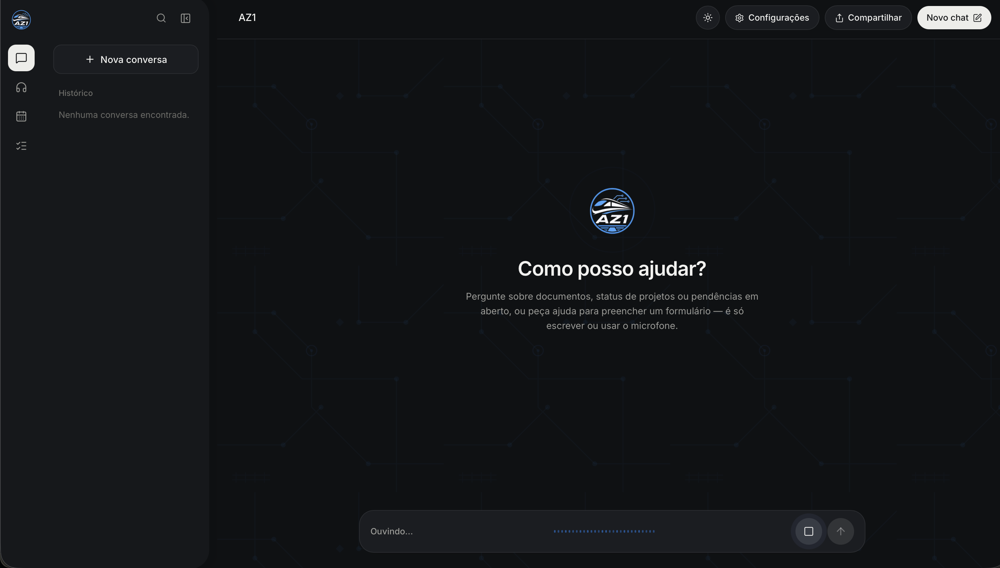<br>
  <sup>Fonte: Material produzido pelos autores, 2026.</sup>
</div>

<div align="center">
<sub>Imagem 4.4.5 - Aba de Tarefas: expansão da interface além do escopo do protótipo, com navegação por abas (Chat, Voz, Agenda e Tarefas) e pendências priorizadas por projeto</sub><br>
  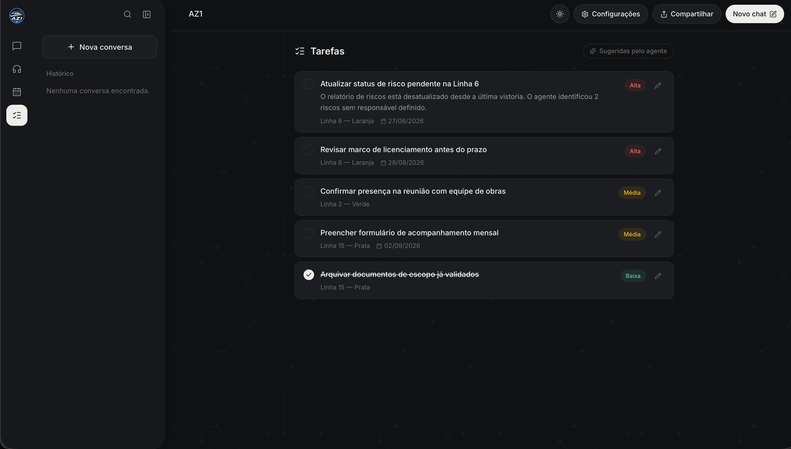<br>
  <sup>Fonte: Material produzido pelos autores, 2026.</sup>
</div>

Diferentemente do protótipo, em que gravação, transcrição e resposta eram simuladas, a interface funcional captura o áudio do microfone de verdade para animar a onda sonora — o hook `useMicVolume` usa a Web Audio API para medir o volume da fala. O Text-to-Speech já está conectado às respostas do agente por meio do botão **Ouvir resposta**. Permanecem como limites do estado atual a entrada por voz ponta a ponta — o áudio capturado ainda não é enviado ao endpoint `/api/v1/audio` — e a integração completa dessa entrada ao processamento do chat. Essa distinção é mantida explícita porque a semelhança da interface com produtos reais gera expectativa de funcionamento real, e a documentação não deve sugerir comportamentos ainda não implementados.


## 4.5 Diário de Construção dos Dois Protótipos

Esta seção consolida decisões, ambiguidades, dúvidas e limitações associadas à construção dos protótipos. **Parte do diário foi sistematizada posteriormente com base no roteiro, nos registros visuais, no histórico Git e nas lembranças da equipe. Por isso, ele não substitui integralmente um registro bruto e contínuo produzido durante a construção.**

As datas abaixo são as datas declaradas pela equipe para as atividades. O histórico Git comprova os momentos de versionamento: a primeira versão material do B e seu diário aparecem nos commits `ceac0b1` (25/08, 09h51) e `33d1ba0` (25/08, 09h52), enquanto o roteiro e a construção do A aparecem nos commits `03ce12a` (25/08, 10h51) e `bb0f4ec` (25/08, 11h23), em branches próprias. Assim, há evidência verificável de que **as primeiras versões dos dois protótipos existiam antes da consolidação e da comparação entre as alternativas**. É esse o sentido de construção em paralelo adotado pelo enunciado: os dois foram materializados antes de um deles ser avaliado e refinado como vencedor; não se exige simultaneidade minuto a minuto. O histórico não permite, contudo, reconstruir o instante de cada decisão tomada dentro das sessões de trabalho.

Para manter a rastreabilidade, os registros são classificados assim:

| Classificação | Significado nesta seção |
|---|---|
| Construção declarada | atividade atribuída pela equipe ao período de elaboração, posteriormente sistematizada |
| Execução declarada | acontecimento atribuído pela equipe à operação do protótipo, sem registro audiovisual contínuo |
| Evidência versionada | arquivo ou estado intermediário cuja existência pode ser verificada no repositório |
| Reconstrução posterior | interpretação apoiada em roteiro, imagens, commits ou memória, sem anotação bruta contemporânea anexada |

### Protótipo A — Vídeo Encenado (Interação Proativa e Contextual)

**18/08/2026 — Definição do problema a ser explorado.** Antes de pensar em uma solução, partimos do problema enfrentado pelo usuário: a dificuldade de localizar informações relevantes entre atas, relatórios, cronogramas e outros documentos que mudam ao longo do projeto. A questão inicial não era como desenhar uma interface, mas como reduzir esse esforço sem retirar do usuário o controle sobre seu trabalho.

**19/08/2026 — Escolha do formato do Protótipo A.** Depois de delimitar o problema, discutimos diferentes formas de representar a alternativa proativa e contextual. Consideramos que uma imagem estática ou uma interface isolada mostraria a aparência da recomendação, mas não permitiria observar o momento da interrupção, a mudança de contexto nem a reação do usuário. Por isso, escolhemos o vídeo encenado, formato não baseado em interface digital funcional, por permitir simular a experiência ao longo de um dia de trabalho e tornar visíveis as interações entre usuário e agente.

**20/08/2026 — Construção do roteiro.** Começamos a organizar a encenação como uma jornada: apresentação do problema, surgimento da recomendação proativa, possibilidade de aceitar ou recusar, mudança de projeto, recomendação inadequada, consulta posterior no Microsoft Teams e encerramento do dia. Buscamos uma sequência que apresentasse a proposta sem tratá-la como solução já validada. O roteiro completo está disponível em [Roteiro do Protótipo A](RoteiroPrototipoA.md).

**20/08/2026 — Decisão não prevista: como o agente deve aparecer.** Ao transformar a alternativa em uma encenação, foi necessário definir como a recomendação proativa chegaria ao usuário sem retirar sua atenção da atividade principal. Decidimos representar o agente por uma pequena bolinha azul acompanhada de uma mensagem curta e das opções “Aceitar” e “Recusar”. A escolha permitiu continuar a construção, mas revelou uma decisão de comportamento ainda em aberto: qual deve ser o nível de destaque de uma recomendação para que ela seja percebida sem se tornar uma interrupção excessiva?

**20/08/2026 — Decisão não prevista: o que acontece após a recusa.** A inclusão da opção “Recusar” obrigou o grupo a definir uma reação que ainda não havia sido discutida. No roteiro, o agente desaparece sem insistir e sem repetir imediatamente a recomendação. Entretanto, permaneceu indefinido se a recusa significa que o documento não foi útil, que o momento foi inadequado ou que o usuário não deseja mais receber recomendações daquele tipo.

**21/08/2026 — Ambiguidade: contexto observado não é intenção.** Ao construir as cenas de mudança entre atividades e projetos, percebemos que reconhecer o documento aberto ou o projeto exibido na tela não permite concluir o que o usuário pretende fazer. Um arquivo pode ser aberto apenas para copiar uma data ou conferir uma informação pontual. Essa ambiguidade passou a orientar a Cena 9: como distinguir aquilo que está visível na tela da intenção real do usuário naquele momento?

**21/08/2026 — Dúvida: uso do feedback e permanência no histórico.** A proposta de permitir avaliações de utilidade criou novas perguntas: o agente deveria aprender com cada rejeição? Por quanto tempo esse sinal deveria influenciar recomendações futuras? Quais informações encontradas durante o dia deveriam permanecer disponíveis no histórico integrado ao Microsoft Teams? O roteiro apresenta essas questões sem escolher uma resposta definitiva, pois elas dependem da rotina e das expectativas dos usuários reais.

**24/08/2026 — Validação do roteiro.** Durante a leitura e validação do roteiro, levantamos perguntas que afetariam diretamente a gravação: como o agente identifica uma mudança de contexto; se abrir um documento significa estar trabalhando naquele assunto; quantas recomendações podem aparecer antes de atrapalhar; o que uma recusa comunica; se o feedback deve influenciar sugestões futuras; e quais informações devem permanecer no histórico. Em vez de ocultar essas dúvidas, decidimos incorporá-las à Cena 9 como parte da própria exploração.

**25/08/2026 — Gravação do vídeo encenado e improvisação declarada.** Durante a gravação, a equipe percebeu que a recomendação proativa estava representada apenas visualmente e acrescentou, na hora, uma cena sobre interação por áudio através de fone de ouvido. A nova cena preservou a regra de controle — o agente recomenda por voz e o usuário decide se deseja acessar a informação — e permitiu representar apoio sem exigir a abertura de uma interface. Esse acréscimo é declarado pela equipe como uma improvisação ocorrida durante a execução; o vídeo final e o roteiro atualizado registram a cena resultante, mas não comprovam isoladamente o momento exato em que a decisão foi tomada.

**Rastreabilidade disponível para a mudança da Cena 10.** No commit `49fdfea`, de 27/08/2026 às 11h09, o roteiro ainda possuía dez cenas e a Cena 10 era o encerramento. No commit `f888c2d`, de 27/08/2026 às 12h19, a interação por áudio aparece como Cena 10 e o encerramento passa a ser a Cena 11. O histórico Git comprova que o documento foi alterado nesse intervalo e preserva as versões anterior e posterior. Ele não comprova, porém, que a decisão tenha ocorrido durante a gravação de 25/08, pois ambos os commits são posteriores a ela.

> A equipe relata que a Cena 10 surgiu como uma improvisação durante a gravação. Entretanto, não foi localizado um registro contemporâneo suficiente para comprovar o momento exato dessa decisão. Por isso, o relato é mantido como reconstrução posterior e não como evidência bruta do processo.

**25/08/2026 — Edição do material.** Depois da gravação, o vídeo recebeu edição e animações para tornar visíveis elementos que não existiam fisicamente durante a encenação, como a bolinha azul, as mensagens do agente e as transições entre situações. Essa edição facilita a compreensão da alternativa, mas não substitui o registro bruto exigido pelo artefato e não é considerada evidência de que as integrações ou o comportamento apresentados estejam implementados.

**Limitações observadas.** O vídeo permitiu percorrer e comunicar a experiência de uma interação proativa, mas não permite medir a tolerância de usuários reais às interrupções, comprovar que o agente identifica corretamente o contexto, validar como diferentes motivos de recusa seriam interpretados nem reproduzir as integrações reais com Microsoft Teams e bases corporativas. A execução conforme o roteiro também não representa, por si só, o teste até a falha exigido pelo artefato.


### Protótipo B — Interface de Interação Sob Demanda

**20/08/2026 — Início da construção.** Decidimos partir da estrutura convencional de chatbot (sidebar de conversas, histórico de mensagens, campo de entrada), sem inovação de layout, para que a investigação ficasse concentrada no comportamento do agente e não na interface em si. A identidade visual usa a sinalização do Metrô (bolachas de linha, tipografia de placa, faixas de cor) apenas como camada de reconhecimento do contexto.

**Demonstração audiovisual:** [assistir ao vídeo do Protótipo B](../assets/Vídeos/Vídeo-B.mp4).

<div align="center">
<sub>Imagem 4.5.1 - Primeiro estado da interface: apenas interação por texto, ainda incompleta</sub><br>
  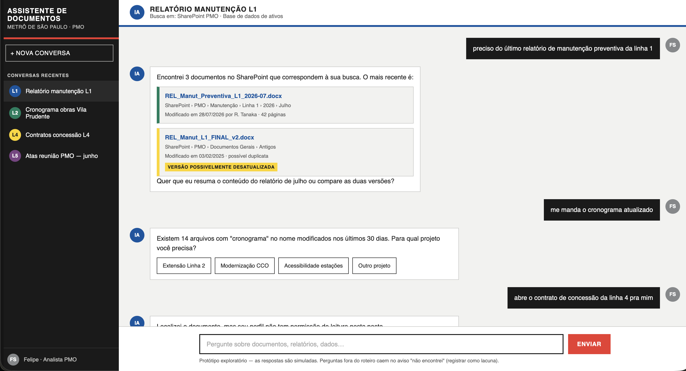<br>
  <sup>Fonte: Material produzido pelos autores, 2026.</sup>
</div>

**21/08/2026 — Decisão não prevista: duplicatas no SharePoint.** Ao montar a conversa de exemplo, foi preciso decidir o que o agente faz quando a busca retorna o mesmo documento em duas versões (uma recente e uma antiga em pasta "Antigos"). O grupo nunca tinha discutido isso. Para conseguir continuar, decidimos exibir as duas com um aviso amarelo de "versão possivelmente desatualizada" — mas a decisão real (ocultar a antiga? perguntar? mesclar?) permanece em aberto e foi registrada no [inventário da seção 4.9](#49-inventário-de-decisões-em-aberto).

**21/08/2026 — Ambiguidade: o que o agente responde a um pedido vago.** Ao simular o pedido "me manda o cronograma atualizado", não soubemos o que o sistema deveria fazer: escolher o mais provável? Listar todos? Perguntar? Improvisamos uma pergunta de desambiguação com botões de projeto. Ficou registrado como ambiguidade: o comportamento correto depende de conhecer a rotina real do PMO.

**22/08/2026 — Decisão não prevista: entrada por voz e transcrição incerta.** Ao adicionar a entrada por voz (exigência do contexto de PLN do módulo), a construção obrigou a decidir: (a) a transcrição aparece para o usuário ou fica oculta? (b) quando o reconhecimento tem baixa confiança em um termo (siglas internas como AMV, CCO), o agente busca assim mesmo ou confirma antes? Decidimos exibir a transcrição e confirmar antes de buscar — mas sem base em observação de usuários; foi o que o material exigiu para o protótipo funcionar. Ambas as decisões foram registradas no inventário da seção 4.9.

**24/08/2026 — Ambiguidade: o que a resposta por voz deveria falar.** O botão "ouvir resposta" existe na interface, mas não soubemos definir o que ele reproduz: o documento inteiro? Um resumo? Apenas "encontrei, veja na tela"? O protótipo não define — a reprodução é simulada. Registrado como lacuna do formato.

**O que o formato não permitiu representar:** a latência real do reconhecimento de voz; o comportamento do ASR com ruído de fundo (ambiente de estação); a conexão real com o SharePoint e o banco de dados (todas as respostas são fixas por palavra-chave, com um fallback de "não encontrei" para qualquer pedido fora do roteiro); e o Teams, citado na Alternativa A, que aqui não aparece.

<div align="center">
<sub>Imagem 4.5.2 - Estado intermediário: adição da entrada por voz, com microfone no campo de entrada e botões "ouvir resposta"</sub><br>
  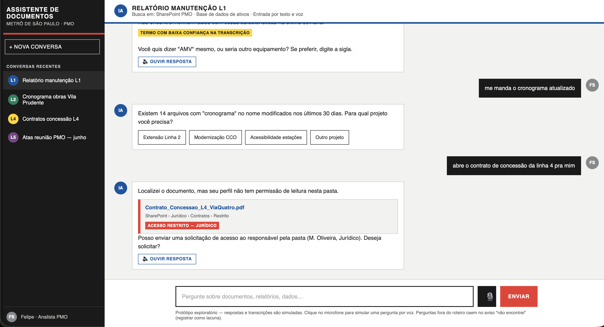<br>
  <sup>Fonte: Material produzido pelos autores, 2026.</sup>
</div>

<div align="center">
<sub>Imagem 4.5.3 - Estado intermediário: gravação de voz em andamento, com transcrição automática exibida e confirmação de termo com baixa confiança (AMV)</sub><br>
  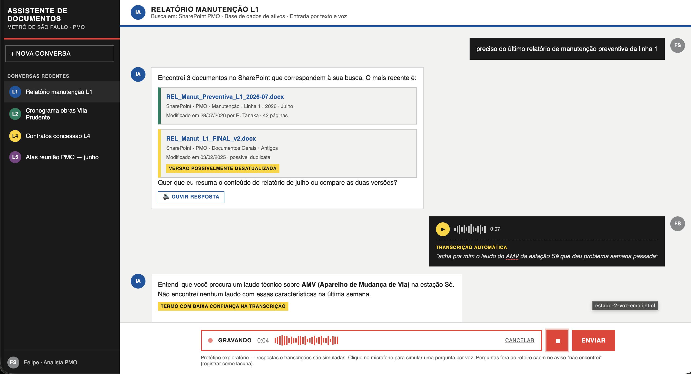<br>
  <sup>Fonte: Material produzido pelos autores, 2026.</sup>
</div>

<div align="center">
<sub>Imagem 4.5.4 - Estado final do Protótipo B: fluxo completo com bloqueio por permissão, entrada por voz com transcrição e reprodução da resposta em áudio</sub><br>
  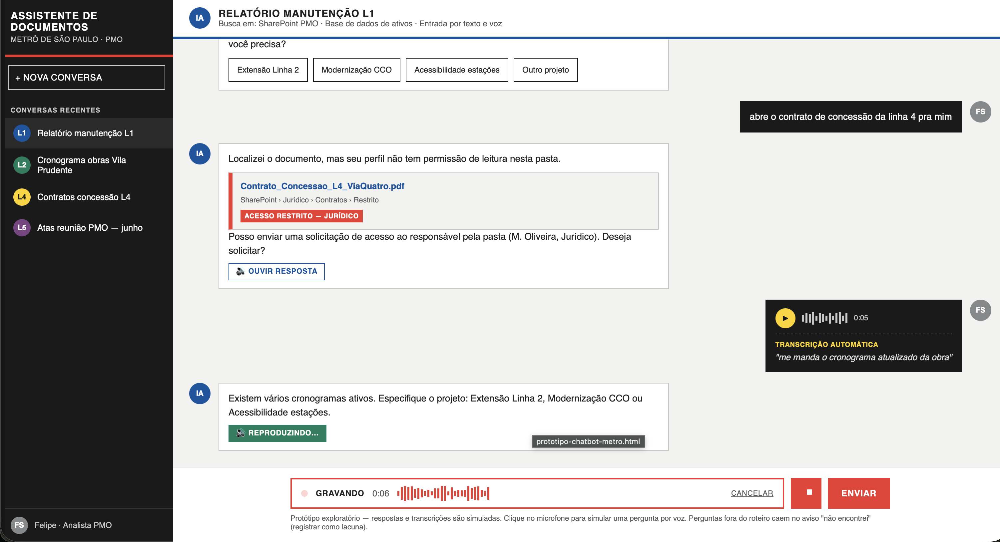<br>
  <sup>Fonte: Material produzido pelos autores, 2026.</sup>
</div>

## 4.6 Execução dos Protótipos

Esta seção registra como cada protótipo foi colocado em operação, incluindo situações difíceis, falhas, improvisos e lacunas encontradas durante a execução.

### Protótipo A — Vídeo Encenado (Interação Proativa e Contextual)

**Registro disponível:** o [roteiro](RoteiroPrototipoA.md) identifica Karol e Matheus como participantes, e o [vídeo versionado](../assets/Vídeos/Vídeo-A.mp4) registra a encenação da alternativa. Segundo o diário consolidado pela equipe, o roteiro foi lido, ensaiado e gravado em 25 de agosto de 2026. Neste formato, “rodar” significa percorrer as cenas, representar o aparecimento da recomendação e encenar as escolhas de aceitar e recusar.

**O que o roteiro e o diário permitem afirmar:**

| Situação prevista | Comportamento representado | Lacuna identificada durante a elaboração |
|---|---|---|
| Recomendação recusada | O agente desaparece e não insiste imediatamente | O roteiro não distingue documento irrelevante, momento inadequado e rejeição permanente |
| Mudança do Projeto X para o Projeto Y | A atividade e as recomendações mudam de projeto | Não está definido qual evento comprovaria mudança de contexto no sistema real |
| Documento ligado ao projeto, mas inadequado à tarefa | A Cena 6 explicita que relevância temática não equivale à intenção | O mecanismo para inferir a intenção permanece indefinido |
| Recomendações ao longo do dia | A narrativa distribui intervenções durante a rotina | Frequência, prioridade e intervalo aceitáveis não foram testados |
| Consulta posterior no Teams | O roteiro apresenta histórico e resumo diário | Conteúdo, retenção e tratamento de informações sensíveis não foram definidos |

#### Falha e improvisação observadas no Protótipo A

O roteiro apresenta um limite potencial na Cena 9: diante do conflito entre contexto visível e intenção, deixa de especificar se o agente deveria recomendar, aguardar, pedir confirmação ou permanecer silencioso. Isso continua sendo um limite antecipado, e não uma falha provocada. Durante a gravação, porém, a equipe declara ter encontrado outra limitação concreta: a alternativa dependia da recomendação visual e exigia que a pessoa consultasse uma interface.

| Campo | Registro da improvisação declarada pela equipe |
|---|---|
| Situação | Durante a gravação, a interação proativa estava representada somente por elementos visuais. |
| Comportamento inicialmente previsto | O agente apresentaria uma bolinha e uma mensagem; o usuário aceitaria ou recusaria na interface. |
| Comportamento não contemplado | Como recomendar quando a pessoa não pode ou não deve interromper a atividade para olhar uma tela. |
| Improvisação realizada | Inclusão, na hora, da Cena 10, propondo recomendação por áudio através de um fone de ouvido. |
| Consequência | O protótipo passou a representar um segundo canal para a mesma lógica de controle: o agente recomenda e o usuário decide. |
| Decisão em aberto | Quando usar áudio ou recurso visual, como preservar privacidade e como aceitar ou recusar sem ambiguidade por voz. |
| Evidência correspondente | Cena 10 do [roteiro atualizado](RoteiroPrototipoA.md) e cena resultante no [vídeo final](../assets/Vídeos/Vídeo-A.mp4); o caráter de improvisação é uma declaração retrospectiva da equipe. |

A improvisação revela uma limitação real do comportamento inicialmente representado, mas não substitui o teste do conflito contexto–intenção até a falha. Também não valida tecnicamente uso de fone, reconhecimento de voz, privacidade ou adequação do canal em ambientes reais.

#### Falha não prevista durante a execução do Protótipo A

Durante a gravação, a equipe identificou uma falha no roteiro então existente: toda recomendação proativa dependia de um elemento visual, obrigando o usuário a interromper a atividade e olhar para uma interface. Essa limitação não havia sido resolvida no roteiro utilizado como base e impedia representar situações em que a pessoa estivesse com as mãos ou a atenção ocupadas. Para continuar a gravação, a equipe improvisou a Cena 10, propondo o fone de ouvido como canal alternativo.

| Elemento | Registro |
|---|---|
| Situação inesperada | Ao executar o roteiro, a equipe percebeu que a recomendação só podia ser percebida quando o usuário consultava a interface visual. |
| Comportamento previsto | O agente apresentaria uma bolinha azul e uma mensagem com as opções “Aceitar” e “Recusar”. |
| Falha observada | O comportamento não contemplava momentos em que abrir ou observar uma interface interromperia a atividade do usuário. |
| Improvisação | A equipe acrescentou na hora a Cena 10, na qual a recomendação também pode ser apresentada por áudio através de um fone de ouvido. |
| Decisão revelada | O produto ainda precisa definir quando usar o canal visual, o canal de áudio ou ambos, além de como aceitar e recusar por voz com privacidade e clareza. |
| Evidência | [Roteiro atualizado](RoteiroPrototipoA.md), [vídeo final](../assets/Vídeos/Vídeo-A.mp4), comparação dos commits `49fdfea` e `f888c2d` e registros de bastidores das [Figuras 4.13.1](../assets/Vídeos/imagem-1.png), [4.13.2](../assets/Vídeos/imagem-2.png) e [4.13.3](../assets/Vídeos/imagem-3.png). |

As fotografias mostram os participantes, ambientes e equipamentos usados na gravação e, por isso, corroboram o contexto em que a improvisação foi relatada. O vídeo e o roteiro registram o resultado incorporado à encenação, enquanto o Git preserva uma versão sem a cena de áudio e outra posterior com ela. Nenhum desses elementos, isoladamente, registra a conversa exata em que a decisão foi tomada; esse momento permanece sustentado pelo relato retrospectivo da equipe.

### Protótipo B — Interface de Interação Sob Demanda

#### Registro bruto da construção e execução do Protótipo B

##### Evidência bruta da execução do Protótipo B

**Registro audiovisual da execução:** [assistir ao vídeo da execução do Protótipo B](../assets/Vídeos/Vídeo-B.mp4). O vídeo registra a interação sob demanda em uma situação comum e em situações fora do escopo do mockup, evidenciando a falha do protótipo diante do pedido de dado estruturado e a improvisação necessária do facilitador. Fonte: registro bruto do grupo.

**Como foi rodado:** a sessão ocorreu em 25 de agosto de 2026, às 9h30, na biblioteca da faculdade, com duração aproximada de 30 minutos. Roberto Filho, aluno de Engenharia de Software, representou um analista de PMO e recebeu apenas o contexto mínimo ("você é analista do PMO e precisa encontrar documentos e informações dos projetos"), sem tutorial. A primeira parte foi de uso livre; na segunda, foram propostos pedidos fora do escopo. O nome “Felipe” e as iniciais “FS” nas capturas pertencem à persona fixa do mockup, não ao participante. Os resultados abaixo se apoiam no vídeo da execução, nas anotações da equipe e na captura do fallback.

**O que aconteceu (não o que se esperava):**

| # | Pedido do participante | O que o protótipo fez | Falha / improviso / lacuna |
|---|------------------------|-----------------------|----------------------------|
| 1 | Uso livre inicial: localizar a conversa ativa, enviar mensagem de texto e iniciar gravação de áudio | O participante navegou sem nenhuma instrução, reconhecendo os elementos por semelhança com interfaces de chat que já utiliza | Nenhuma falha. Achado: o padrão convencional de interface elimina o custo de aprendizado — comportamento relevante para a comparação com a Alternativa A |
| 2 | Tentou gravar um áudio real e ouvir a resposta falada | A gravação, a transcrição e a reprodução são simuladas; a expectativa de funcionalidade real foi frustrada | **Improviso registrado:** foi preciso explicar verbalmente o que o sistema real faria. O protótipo não comunica seus próprios limites — a semelhança com produtos reais gera expectativa de funcionamento real |
| 3 | "quantas ocorrências teve na L2 em julho?" | Caiu no fallback genérico, que afirma não ter encontrado resultado no SharePoint nem na base de dados | **Lacuna confirmada:** o mockup não consulta nenhuma fonte real e não define um fluxo próprio para dados estruturados. A mensagem ampla demais mascara essa diferença e precisa ser redesenhada. Corresponde à decisão P-B05 do [inventário (seção 4.9)](#49-inventário-de-decisões-em-aberto) |

**Falhas encontradas:** O protótipo falhou diante de um pedido legítimo de informação (consulta a dado estruturado do banco, e não a um documento), caindo em uma mensagem que alega busca em fontes que o mockup não consulta. Além disso, falhou em comunicar sua própria natureza simulada: o participante esperava enviar e ouvir áudio de verdade.

**Improvisos registrados:** Em ambas as falhas foi necessário intervir verbalmente — explicar que a decisão sobre consultas ao banco está em aberto e que o fluxo de voz é simulado. Cada intervenção verbal indica um comportamento que o sistema real precisará definir.

As falas e reações detalhadas estão registradas no vídeo da execução; a captura da Imagem 4.6.1 complementa o registro ao destacar o estado de falha do protótipo.

| Evidência existente | Etapa registrada | Cenário e ação | Resposta e resultado | Falha, limite ou improvisação | Fonte |
|---|---|---|---|---|---|
| [Vídeo B](../assets/Vídeos/Vídeo-B.mp4) | execução | uso livre, tentativa de áudio e consulta fora do escopo | registra a sessão, incluindo o percurso até o fallback e as intervenções do facilitador | materializa a falha diante do pedido de dado estruturado e a improvisação verbal | arquivo MP4 versionado em `assets/Vídeos/` |
| Estados 4.5.1 a 4.5.4 | construção | evolução da interface de texto para voz, confirmação e permissão | mostram decisões materializadas em telas | registram a construção; a operação está registrada no vídeo da execução | arquivos PNG versionados |
| Imagem 4.6.1 | execução | consulta sobre ocorrências na L2 em julho | fallback genérico de busca documental | evidencia a resposta inadequada ao tipo de pedido; a interação completa está no vídeo da execução | captura PNG produzida pela equipe |
| Relato consolidado da sessão | registro da sessão | tentativa de áudio e consulta fora do escopo | equipe explica a natureza simulada dos fluxos | documenta as intervenções verbais realizadas | seção 4.6, com o vídeo da execução |

<div align="center">
<sub>Imagem 4.6.1 - Fallback exibido durante a execução, diante do pedido de dado estruturado ("quantas ocorrências teve na L2 em julho?")</sub><br>
  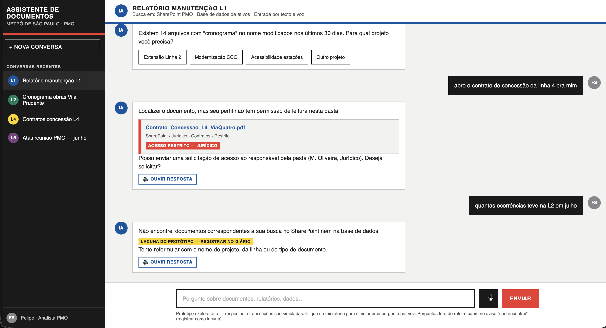<br>
  <sup>Fonte: Material produzido pelos autores, 2026.</sup>
</div>

## 4.7 Comparação entre as Alternativas

A comparação separa o que está evidenciado no material do que permanece sem comprovação e não escolhe uma alternativa vencedora.

| Aspecto | Protótipo A — proativo e contextual | Protótipo B — sob demanda | O que permanece em aberto |
|---|---|---|---|
| Início da interação | O agente inicia a recomendação | O usuário inicia a consulta | Nível de proatividade aceitável |
| Ambiguidade central | O roteiro explicita que contexto visível não revela necessariamente intenção | Pedidos curtos podem omitir projeto, período, fonte ou tipo de informação | Quando pedir confirmação |
| Controle do usuário | Aceitar e recusar estão representados, mas o significado da recusa não foi definido | O usuário controla o momento, mas depende dos limites do chat | Como adiar, configurar ou silenciar interações |
| Limite ou falha | Durante a gravação, a equipe identificou a dependência exclusiva do canal visual e improvisou a Cena 10 com áudio; a Cena 9 mantém separadamente o conflito contexto–intenção em aberto | O vídeo da execução e a captura registram o fallback inadequado para pedido de dado estruturado | Testar os canais do A com usuários e repetir o percurso de falha do B com usuários do parceiro |
| Contribuição do formato | A encenação representa passagem do tempo, mudança de atividade e interrupção | A interface concretiza pedidos, desambiguação, permissões, versões e transcrição | Como esses efeitos aparecem com usuários do Metrô |
| Limite | Não mede reação espontânea, fadiga ou precisão | Não mede frequência de intervenções nem integração real | Método comparativo com tarefas e participantes equivalentes |

**O que apareceu somente no A:** a necessidade de definir um gatilho legítimo para recomendações, um limite de frequência, o significado do feedback e a permanência do histórico. O formato não baseado em interface digital permitiu encenar tempo, mudança de atividade e interrupção — relações que uma tela estática do chat não mostraria.

**O que apareceu somente no B:** a construção materializou duplicatas de documentos, pedidos vagos, bloqueio por permissão, incerteza na transcrição e a fronteira entre documento e dado estruturado. A tentativa de operar controles que pareciam reais também revelou expectativas incompatíveis com a simulação; essa parte está registrada no [vídeo da execução](../assets/Vídeos/Vídeo-B.mp4).

**Interpretações posteriores:** no A, a construção tornou explícita a diferença entre estar no projeto correto e compreender a tarefa atual. No B, o registro da equipe relata que a familiaridade visual reduziu o custo de aprendizagem, mas aumentou a frustração quando áudio e resposta se revelaram simulados. A primeira conclusão decorre do roteiro e do diário consolidado; a segunda decorre do vídeo da execução e das anotações da sessão. A exploração não permite concluir que proatividade ou interação sob demanda seja superior.

## 4.8 Limites da Exploração

Esta seção explicita o que cada protótipo **não** permite concluir e o que ainda dependeria de testes com usuários reais.

### Limites do Protótipo A — Vídeo Encenado

- **Comportamento roteirizado:** as falas e reações foram previstas; não é possível concluir como uma pessoa reagiria espontaneamente a interrupções.
- **Detecção de contexto simulada:** a troca de projeto é representada pelos atores; não há mecanismo que comprove quando o contexto realmente mudou.
- **Intenção não observável:** o vídeo evidencia o problema, mas não informa quais sinais seriam suficientes para diferenciar conteúdo aberto de objetivo real.
- **Frequência não testada:** poucas recomendações encenadas não permitem determinar quantidade, intervalo ou prioridade aceitáveis durante uma jornada real.
- **Feedback sem semântica definida:** aceitar, recusar e avaliar utilidade aparecem no roteiro, mas não se sabe como esses sinais devem alterar recomendações futuras.
- **Integrações ilustrativas:** Teams, histórico e acesso às bases são recursos narrativos, não integrações implementadas.
- **Sem usuários do parceiro:** tolerância a interrupções, privacidade percebida e utilidade contextual só podem ser conhecidas com profissionais do Metrô em uma rotina próxima da real.
- **Evidência bruta limitada:** o vídeo editado, o histórico do roteiro e três fotografias de bastidores sustentam o resultado da improvisação do canal de áudio. Como não há gravação contínua da conversa em que a decisão foi tomada, sua ocorrência durante a gravação depende do relato retrospectivo da equipe e não permite reconstruir hesitações e falas exatas.

### Limites do Protótipo B — Interface de Interação Sob Demanda

- **Respostas fixas por palavra-chave:** não há PLN real, então nada se conclui sobre a qualidade de interpretação dos pedidos.
- **Voz simulada:** nada se conclui sobre a taxa de erro do ASR com o jargão do Metrô nem sobre o comportamento com ruído de ambiente.
- **Sem SharePoint real:** nada se conclui sobre tempo de resposta, cobertura da base documental ou permissões reais.
- **O participante do teste foi Roberto Filho, aluno de Engenharia de Software, fazendo o papel de analista de PMO:** a formulação de pedidos de um colaborador real, com vocabulário e pressa reais, só seria observada com usuários do Metrô.
- **Sessão única de execução:** o vídeo registra uma única sessão com um participante; padrões de uso recorrente, fadiga e preferências ao longo do tempo não podem ser inferidos de uma execução isolada.

### Limites comuns e conclusão permitida

- Nenhum protótipo utiliza dados reais do Metrô ou opera no ambiente real de trabalho.
- Não há recuperação documental, inferência de intenção, permissões ou integração com Teams/SharePoint em funcionamento nos protótipos.
- O número reduzido de cenários não permite medir confiança, fadiga, aceitação ao longo do tempo ou efeito da frequência de notificações.
- O canal de áudio não foi testado em condições reais de ruído, privacidade ou indisponibilidade.
- Para responder a essas questões seriam necessários testes moderados com profissionais do parceiro, tarefas equivalentes, registros brutos e métricas de utilidade, interrupção e sucesso.
- A exploração **não permite determinar qual alternativa é superior**.

## 4.9 Inventário de Decisões em Aberto

Esta seção reúne as decisões de design e comportamento do agente que a construção dos protótipos revelou, mas que permanecem sem resposta definitiva. Para cada uma, registram-se as opções consideradas e o que está em jogo.

| ID | Decisão em aberto | Opção A | Opção B | Outras opções | O que está em jogo | Evidência que revelou a decisão | Próxima forma de investigação |
|---|---|---|---|---|---|---|---|
| P-A01 | Gatilho da recomendação | mudança de tela | evento do projeto | tempo na atividade; confirmação explícita | antecipação vs. inferência indevida | diário A, 20–21/08, e Cenas 5–6 | encenar os mesmos gatilhos com usuários e comparar pertinência |
| P-A02 | Frequência e prioridade | limite por período | apenas alta relevância | configuração pessoal; modo silencioso | utilidade vs. interrupção e fadiga | validação do roteiro em 24/08 | simulação longitudinal com diferentes frequências |
| P-A03 | Significado da recusa | conteúdo irrelevante | momento inadequado | não repetir tema; perguntar motivo | aprendizagem vs. interpretação errada | diário A, 20/08, e Cena 3 | testar “não”, “agora não” e “não mostrar novamente” separadamente |
| P-A04 | Contexto incerto | recomendar | pedir confirmação | aguardar; guardar para resumo | ajuda vs. interrupção ou exposição indevida | diário A, 21/08, e Cena 9 | teste difícil com conflito entre tela e intenção |
| P-A05 | Uso do feedback | apenas na sessão | histórico por usuário | aprendizagem coletiva; não aprender automaticamente | personalização, privacidade e propagação de erro | diário A, 21/08 | protótipo de políticas de feedback com revisão dos usuários |
| P-A06 | Conteúdo no Teams/resumo | somente aceitos | aceitos e pendências | vistos; rejeitados; todos com retenção | memória útil vs. excesso e sensibilidade | Cena 7 e diário A, 21/08 | card sorting com usuários e análise de retenção |
| P-A07 | Canal da recomendação proativa | somente visual | somente áudio por fone | combinar canais; permitir configuração | atenção, acessibilidade, privacidade e controle | improvisação declarada na gravação e Cena 10 | encenar tarefas com tela disponível e indisponível, comparando aceitação e recusa |
| P-B01 | Duplicatas e versões antigas | mostrar todas com aviso | mostrar só a mais recente | perguntar ao usuário | segurança de versão vs. poluição | diário B, 21/08, e Imagem 4.5.1 | tarefas com versões conflitantes e fonte conhecida |
| P-B02 | Baixa confiança na transcrição | buscar melhor palpite | confirmar antes | buscar e sinalizar | fluidez vs. consulta incorreta | diário B, 22/08, e Imagem 4.5.3 | teste de voz com siglas e ruído controlado |
| P-B03 | Exibição da transcrição | sempre visível | apenas com incerteza | oculta | transparência vs. ruído visual | diário B, 22/08 | comparação de três estados da interface |
| P-B04 | Resposta por voz | leitura completa | resumo | confirmação curta | acessibilidade vs. tempo e imprecisão | diário B, 24/08 | teste auditivo com conteúdos de extensões diferentes |
| P-B05 | Dado estruturado vs. documento | consultar banco | devolver documento-fonte | declarar limite | cobertura do agente e expectativa | captura do fallback, Imagem 4.6.1 | criar fluxos separados e testar pedidos equivalentes |
| P-B06 | Acesso negado | ocultar existência | oferecer solicitação | mostrar apenas metadados | transparência vs. exposição sensível | estado final, Imagem 4.5.4 | revisão de segurança e teste com perfis distintos |

## 4.10 Repertório de Situações

Esta seção registra os casos e situações usados durante a construção e a execução dos protótipos, com destaque para aqueles que não foram atendidos.

| ID | Situação ou fala | Contexto | Comportamento do protótipo | Resultado documentado | Falha ou lacuna | Protótipo |
|---|---|---|---|---|---|---|
| S-A01 | “Eu sei que eu vi isso em algum lugar” | busca entre vários arquivos | narrativa apresenta recomendação proativa | problema e proposta representados | busca e relevância não são reais | A |
| S-A02 | recomendação recusada | usuário trabalhando | agente desaparece sem insistir | comportamento previsto no roteiro | significado da recusa indefinido | A |
| S-A03 | recomendação aceita | documento relacionado à atividade | agente apresenta documentos | comportamento previsto no roteiro | sem recuperação ou critério real | A |
| S-A04 | mudança do Projeto X para Y | transição de atividade | recomendações deveriam acompanhar contexto | mudança narrada | gatilho técnico indefinido | A |
| S-A05 | documento do projeto, mas inadequado à intenção | conflito contexto–objetivo | o roteiro deixa de definir uma resposta e passa às perguntas da Cena 9 | limite potencial identificado no planejamento; falha não provocada em registro bruto | decidir entre recomendar, confirmar, aguardar ou silenciar | A |
| S-A06 | várias recomendações durante o dia | frequência acumulada | roteiro questiona quando começa a atrapalhar | pergunta em aberto | não houve teste longitudinal | A |
| S-A07 | recomendação sem interromper para abrir uma interface | usuário continua a atividade | equipe acrescenta a Cena 10 com recomendação por áudio através de fone | improvisação declarada e cena incorporada ao material final | privacidade, escolha do canal e comandos de aceitar/recusar por voz permanecem indefinidos | A |
| S-B01 | “preciso do último relatório...” | busca documental | mostra documentos e alerta de versão | atendida no mockup | fonte e busca simuladas | B |
| S-B02 | “me manda o cronograma atualizado” | pedido sem projeto | pergunta qual projeto | ambiguidade tratada no mockup | critério de opções não validado | B |
| S-B03 | “abre o contrato... linha 4” | conteúdo restrito | informa bloqueio e oferece solicitação | bloqueada por permissão simulada | exposição de metadados em aberto | B |
| S-B04 | “acha... laudo do AMV...” | voz com sigla técnica | exibe baixa confiança e pede confirmação | tratada no mockup | ASR não executado | B |
| S-B05 | tentativa de gravar e ouvir áudio | uso livre relatado pela equipe | controles eram simulados | não atendida; exigiu explicação verbal | reação depende do registro textual da equipe | B |
| S-B06 | “quantas ocorrências teve na L2 em julho?” | pedido de dado estruturado | fallback alega busca sem fonte real | não atendida; captura disponível | fluxo confunde dado e documento | B |

## 4.11 Aprendizados da Exploração

- A construção do A tornou explícito que **contexto** (projeto, tela, atividade e histórico observáveis) não equivale à **intenção** (objetivo que a pessoa pretende alcançar naquele momento).
- Aceitar e recusar não bastam para definir o comportamento: “não” pode significar irrelevância, momento inadequado ou rejeição permanente.
- A frequência de recomendações precisa ser uma política explícita; o formato atual não permite determinar um limite aceitável.
- A construção do B mostrou que pedidos vagos exigem desambiguação e que versões, permissões e tipos de fonte alteram a resposta esperada.
- A baixa confiança na transcrição precisa ser comunicada e tratada antes de uma busca potencialmente errada.
- A sessão B mostrou que uma interface visualmente realista pode criar expectativas de funcionalidades que o protótipo não executa; essa interpretação está apoiada no vídeo da execução e nas anotações da equipe.
- A inclusão da Cena 10 durante a gravação revelou que a proatividade não precisa depender exclusivamente de uma tela. O canal por fone foi materializado na encenação como improvisação declarada, mas sua utilidade, privacidade e operação por voz ainda não foram validadas com usuários.

## 4.12 Próximos Passos

| Decisão a investigar | Método proposto | Evidência esperada |
|---|---|---|
| P-A01 a P-A04 — gatilho, frequência, recusa e contexto incerto | reencenar o A com situações difíceis, usuários externos ao roteiro e registro audiovisual bruto | momentos de interrupção, falhas, improvisações e justificativas das preferências |
| P-A05 a P-A07 — feedback, histórico e canal | card sorting, protótipo de retenção e encenação comparativa entre aviso visual e áudio | categorias priorizadas, riscos percebidos e preferência de canal por contexto |
| P-B01, P-B05 e P-B06 — versões, fontes e permissões | tarefas equivalentes com documentos duplicados, dados estruturados e perfis distintos | taxa de conclusão, erros e decisões de apresentação |
| P-B02 a P-B04 — voz | teste controlado com siglas, ruído e respostas de diferentes extensões | transcrições, correções, tempo e preferência de saída |
| Comparação A × B | aplicar tarefas equivalentes com profissionais do parceiro | medidas comparáveis de utilidade, interrupção, esforço e controle percebido |

## 4.13 Registros Visuais

Esta seção reúne evidências de naturezas diferentes — fotografias de bastidores, vídeo editado, roteiro, storyboard e capturas de tela. Cada item é classificado conforme aquilo que realmente comprova; materiais de planejamento e reconstruções posteriores não são apresentados como registros brutos de execução.

### Registros do Protótipo A

| Evidência | Formato | Etapa registrada | O que permite comprovar | Verificação |
|---|---|---|---|---|
| [Vídeo A](../assets/Vídeos/Vídeo-A.mp4) | MP4, 20,7 MB | encenação final | existência do registro audiovisual associado ao A | arquivo, assinatura MP4 e link local verificados |
| [Roteiro A](RoteiroPrototipoA.md) | Markdown | planejamento e atualização posterior | participantes declarados, falas, ações e onze cenas | link local acessível; registra a cena acrescentada, mas isoladamente não comprova sua execução nem o momento da decisão |
| [Storyboard A](#441-construção-do-protótipo-a-interação-proativa-e-contextual) | Mermaid | síntese posterior | fluxo comportamental documentado | renderização depende do visualizador; não é evidência bruta |
| Diário A, [seção 4.5](#45-diário-de-construção-dos-dois-protótipos) | texto | construção consolidada | decisões e ambiguidades declaradas pela equipe | contemporaneidade não comprovada por registro bruto |
| [Figura 4.13.1](../assets/Vídeos/imagem-1.png) | PNG | bastidores do A | Karol em um dos ambientes utilizados na gravação | origem confirmada pela equipe; arquivo, link e conteúdo visual verificados |
| [Figura 4.13.2](../assets/Vídeos/imagem-2.png) | PNG | bastidores do A | Matheus com um computador utilizado na gravação | origem confirmada pela equipe; arquivo, link e conteúdo visual verificados |
| [Figura 4.13.3](../assets/Vídeos/imagem-3.png) | PNG | bastidores do A | Karol e Matheus juntos em outro cenário | origem confirmada pela equipe; arquivo, link e conteúdo visual verificados |

<div align="center">
<sub>Figura 4.13.1 — Registro bruto de bastidores do Protótipo A, produzido durante a etapa de preparação/gravação: Karol aparece em um dos ambientes da encenação. A fotografia comprova a participação e o ambiente de produção, mas não a execução integral nem uma falha.</sub><br>
  <br>
  <sup>Fonte: arquivo disponibilizado pela equipe, 2026.</sup>
</div>

<div align="center">
<sub>Figura 4.13.2 — Registro bruto de bastidores do Protótipo A, produzido durante a etapa de preparação/gravação: Matheus aparece com um computador usado na encenação. A fotografia comprova parte da preparação material, mas não o comportamento do protótipo em operação.</sub><br>
  <br>
  <sup>Fonte: arquivo disponibilizado pela equipe, 2026.</sup>
</div>

<div align="center">
<sub>Figura 4.13.3 — Registro bruto de bastidores do Protótipo A, produzido durante a etapa de gravação: Karol e Matheus aparecem juntos em outro cenário. A fotografia comprova participantes e diversidade de cenários, mas não registra falha ou improvisação.</sub><br>
  <br>
  <sup>Fonte: arquivo disponibilizado pela equipe, 2026.</sup>
</div>

Os bastidores ampliam o registro visual da construção, confirmam a participação declarada no roteiro e mostram os diferentes ambientes e equipamentos utilizados na gravação. As imagens não registram o momento de falha ou improvisação.

### Registros do Protótipo B

| Evidência | Formato | Etapa registrada | O que permite comprovar | Verificação |
|---|---|---|---|---|
| [Vídeo B](../assets/Vídeos/Vídeo-B.mp4) | MP4, 4,2 MB | execução da sessão | registro audiovisual da execução do B, incluindo o percurso até o fallback | arquivo, assinatura MP4 e link local verificados |
| [Imagem 4.5.1](../assets/design/estado-1-somente-texto.png) | PNG | primeiro estado | interface apenas com texto e casos documentais | arquivo, link e conteúdo visual verificados |
| [Imagem 4.5.2](../assets/design/estado-2-emoji.png) | PNG | estado intermediário | entrada por voz e saída em áudio representadas | arquivo, link e conteúdo visual verificados |
| [Imagem 4.5.3](../assets/design/estado-2-voz-emoji.png) | PNG | estado intermediário | transcrição e confirmação de “AMV” | arquivo, link e conteúdo visual verificados |
| [Imagem 4.5.4](../assets/design/prototipo-chatbot-metro.png) | PNG | estado final | voz, reprodução e bloqueio por permissão | arquivo, link e conteúdo visual verificados |
| [Imagem 4.4.2](../assets/design/mockup-agente.png) | PNG | demonstração | visão consolidada da alternativa sob demanda | arquivo, link e conteúdo visual verificados |
| [Imagem 4.6.1](../assets/design/execucao-fallback-dado-estruturado.png) | PNG | execução declarada | estado do fallback para pedido estruturado | arquivo, link e conteúdo visual verificados; captura isolada não comprova toda a sessão |

O vídeo da execução registra a operação do protótipo pelo participante, incluindo as reações e falas descritas na seção 4.6; as imagens comprovam os estados da interface ao longo da construção.

### Matriz consolidada de evidências

| Evidência | Protótipo | Etapa | O que registra | O que comprova | Limitação da evidência |
|---|---|---|---|---|---|
| [Vídeo A](../assets/Vídeos/Vídeo-A.mp4) | A | execução roteirizada | encenação editada das onze cenas, incluindo a cena de áudio acrescentada | alternativa colocada em operação e resultado final da improvisação declarada | edição e ausência de registro bruto do momento em que a decisão foi tomada |
| [Roteiro A](RoteiroPrototipoA.md) | A | planejamento | falas, ações e comportamentos previstos | estrutura e intenção da encenação | comprova planejamento, não execução |
| Storyboard da seção 4.4.1 | A | síntese posterior | sequência comportamental | articulação do fluxo | não é evidência bruta |
| Figuras 4.13.1 a 4.13.3 | A | preparação/gravação | participantes, ambientes e equipamento | bastidores da produção | fotografias isoladas; não registram continuidade, áudio, falha ou improvisação |
| Diário A da seção 4.5 | A | construção declarada | decisões e ambiguidades sistematizadas | percurso declarado pela equipe | parcialmente reconstruído posteriormente |
| Imagens 4.5.1 a 4.5.4 | B | construção | estados inicial, intermediários e final | evolução material do mockup | capturas sem áudio e sem pessoa operando o protótipo |
| Imagem 4.4.2 | B | demonstração | visão consolidada do mockup | existência da alternativa sob demanda | não comprova sessão de execução |
| Imagem 4.6.1 | B | execução | fallback para pedido estruturado | existência do estado inadequado ao pedido | captura estática; a continuidade está registrada no vídeo da execução |
| Relato da seção 4.6 | B | execução | tentativa de voz, pedido fora do escopo e intervenções da equipe | acontecimentos da sessão | complementa o vídeo da execução |
| Commits `ceac0b1`, `33d1ba0`, `03ce12a` e `bb0f4ec` | A e B | versionamento | materiais próprios em branches distintas | desenvolvimento independente antes da consolidação | não comprova sequência minuto a minuto nem construção simultânea estrita |
| Comparação entre `49fdfea` e `f888c2d` | A | atualização documental | roteiro sem a cena de áudio e versão posterior com a nova Cena 10 | comprova que a cena foi incorporada ao documento entre 11h09 e 12h19 de 27/08 | commits posteriores à gravação; não comprovam quando a decisão surgiu |
| Roteiro, vídeo, bastidores e commits da Cena 10 | A | execução e reconstrução | limitação do canal exclusivamente visual e solução incorporada por áudio | materializa a falha relatada e o resultado da improvisação | o momento exato da decisão é sustentado pelo relato retrospectivo da equipe |
| [Vídeo B](../assets/Vídeos/Vídeo-B.mp4) | B | execução | sessão de execução com uso livre, tentativa de áudio e pedido fora do escopo | operação do protótipo pelo participante, falha diante do pedido de dado estruturado e improvisação do facilitador | registra uma única sessão com um participante |

### Rastreabilidade entre rubrica e evidências

| Critério da rubrica | Evidência relacionada | Situação atual | Pendência |
|---|---|---|---|
| Questão de projeto | seção 4.1 | Atendido: questão comportamental em uma frase e justificativa | nenhuma documental |
| Alternativas divergentes | seção 4.2 e quadro comparativo | Atendido: iniciativa do agente e consequências diferem substancialmente | nenhuma documental |
| Formato não digital | seção 4.3, roteiro, vídeo e bastidores do A | Atendido: encenação audiovisual, com elementos visuais usados como adereços narrativos | nenhuma documental |
| Construção paralela | commits `ceac0b1` e `33d1ba0` do B, seguidos de `03ce12a` e `bb0f4ec` do A, estados do B e bastidores do A | **Atendido:** as primeiras versões materiais de A e B estavam versionadas em branches próprias em 25/08, antes da consolidação e da comparação; nenhum dos registros apresenta escolha de vencedor | o histórico comprova a precedência em relação à comparação, mas não reconstrói cada decisão minuto a minuto |
| Diário | seção 4.5 | Parcialmente atendido: decisões, ambiguidades e impossibilidades estão registradas | falta diário bruto contínuo; parte foi sistematizada depois |
| Execução do Protótipo A | arquivo local `assets/Vídeos/Vídeo-A.mp4` (2min55s), roteiro e bastidores | **Atendido:** a gravação mostra a encenação realizada em diferentes situações e explicita os achados sobre contexto, intenção e canal de interação | o vídeo é editado e roteirizado; comprova a execução, mas não substitui um registro contínuo da tomada de cada decisão |
| Execução do Protótipo B | arquivo local `assets/Vídeos/Vídeo-B.mp4` (57s), relato e Imagem 4.6.1 | **Atendido:** a gravação de tela mostra o protótipo sendo percorrido e levado ao fallback descrito na Seção 4.6 | registra uma sessão, suficiente para comprovar a operação, mas não permite generalização para usuários reais |
| Falha do Protótipo A | Cena 10, vídeo final, Figuras 4.13.1 a 4.13.3, commits `49fdfea`/`f888c2d` e seção 4.6 | Atendido com ressalva: a dependência exclusiva da interface visual foi registrada como falha e originou a solução por áudio | o momento exato da decisão é uma reconstrução retrospectiva, explicitamente identificada |
| Falha do Protótipo B | vídeo B e Imagem 4.6.1 | Atendido: o percurso que levou ao fallback está registrado em vídeo e captura | nenhuma documental |
| Improvisações | Cena 10 do A, vídeo final, bastidores, commits `49fdfea`/`f888c2d`, vídeo B e relato do B | Atendido: o resultado da mudança do A está materializado e a intervenção do B está registrada em vídeo | no A, a ocorrência “na hora” permanece sustentada pelo relato retrospectivo |
| Comparação | seção 4.7 | Atendido: diferenças, achados exclusivos e ausência de vencedor | preservar distinção entre evidência e interpretação |
| Limites | seção 4.8 | Atendido: limites específicos de ambos e de usuários reais | nenhuma documental |
| Inventário de decisões | seção 4.9 | Atendido: opções, aspectos em jogo, origem e teste futuro | nenhuma documental |
| Repertório de situações | seção 4.10 | Atendido: inclui sucessos e lacunas | nenhuma documental |
| Documentação visual | seções 4.4 a 4.6 e 4.13 | Atendido: vídeos, fotografias e capturas estão referenciados e verificados | nenhuma documental |

As evidências disponíveis comprovam a existência dos dois protótipos, seus formatos e parte relevante do processo. No A, a Cena 10 materializa a resposta improvisada à dependência exclusiva da interface visual; vídeo, roteiro, commits e bastidores sustentam partes diferentes desse registro, enquanto o momento exato da decisão permanece corretamente identificado como relato retrospectivo. No B, o vídeo da execução registra a sessão em que o protótipo foi operado, incluindo a falha diante do pedido de dado estruturado e as intervenções do facilitador.

## 4.14 Próximos Passos para uma Interface Funcional

Esta seção projeta a transição entre o material exploratório documentado nas seções 4.4 a 4.13 e uma interface funcional, integrada ao ambiente de trabalho já utilizado pelas pessoas que atuam no Metrô. Nenhum dos dois protótipos foi construído para operar nesse ambiente: o Protótipo A é uma encenação em vídeo que **vendeu a ideia** da interação proativa, tornando visível ao longo do tempo um comportamento que ainda não existe em nenhum sistema real; o Protótipo B é uma interface gráfica com respostas simuladas, que tornou concreto o formato de uma consulta sob demanda sem consultar nenhuma fonte real. A comparação da [seção 4.7](#47-comparação-entre-as-alternativas) não elegeu uma alternativa vencedora, e os limites da [seção 4.8](#48-limites-da-exploração) mostram que perguntas sobre frequência, fadiga, confiança e precisão só podem ser respondidas em operação real. Por isso, o passo seguinte não é escolher entre A e B, mas **consolidar** o que cada exploração validou em uma única interface embutida no ambiente real de trabalho.

### 4.14.1 O que cada protótipo leva à implementação real

| Elemento validado | Origem | O que seria incorporado à interface real | Decisão do inventário ([seção 4.9](#49-inventário-de-decisões-em-aberto)) a resolver antes |
|---|---|---|---|
| Recomendação proativa por contexto de atividade | Protótipo A | Canal de sugestões que aparece sem consulta explícita, dentro da própria ferramenta de trabalho | P-A01 (gatilho), P-A02 (frequência) |
| Aceitar/recusar como sinal de controle | Protótipo A | Ações de aceitar e recusar associadas a um significado explícito, não apenas ao desaparecimento da sugestão | P-A03 (significado da recusa), P-A05 (uso do feedback) |
| Canal alternativo ao visual | Protótipo A (Cena 10, improvisada) | Opção de notificação por áudio para quem está com as mãos ou a atenção ocupadas | P-A07 (canal) |
| Consulta em linguagem natural por texto ou voz | Protótipo B | Campo de pergunta ao agente, disponível a qualquer momento dentro da mesma tela de trabalho | P-B02 a P-B04 (transcrição e resposta por voz) |
| Diferenciação entre documento e dado estruturado | Protótipo B (falha da seção 4.6) | Dois fluxos de resposta distintos: um para documentos e outro para consultas ao banco de dados de projetos | P-B05 |
| Bloqueio por permissão | Protótipo B | Controle de acesso real, ligado ao perfil da pessoa autenticada, em vez da simulação da Imagem 4.5.4 | P-B06 |

### 4.14.2 Onde a interface deveria viver

Em vez de uma tela nova e isolada, como a interface de chat do Protótipo B, a interface funcional deveria ser **embutida na ferramenta que as pessoas do Metrô já usam para acompanhar projetos**, aparecendo como um painel disponível durante a própria rotina de trabalho. Essa escolha reduz o custo de aprendizado observado durante a execução do Protótipo B: o primeiro item da tabela "O que aconteceu" da [seção 4.6](#46-execução-dos-protótipos) registra que o participante reconheceu os elementos de interface por semelhança com produtos que já utiliza. Também aproxima o canal proativo do Protótipo A do momento em que a pessoa já está trabalhando, sem depender de um segundo aplicativo.

<div align="center">
<sub>Imagem 4.14.1 - Próximos passos: proposta de um assistente de IA embutido na ferramenta de acompanhamento de projetos do Metrô.</sub><br>
  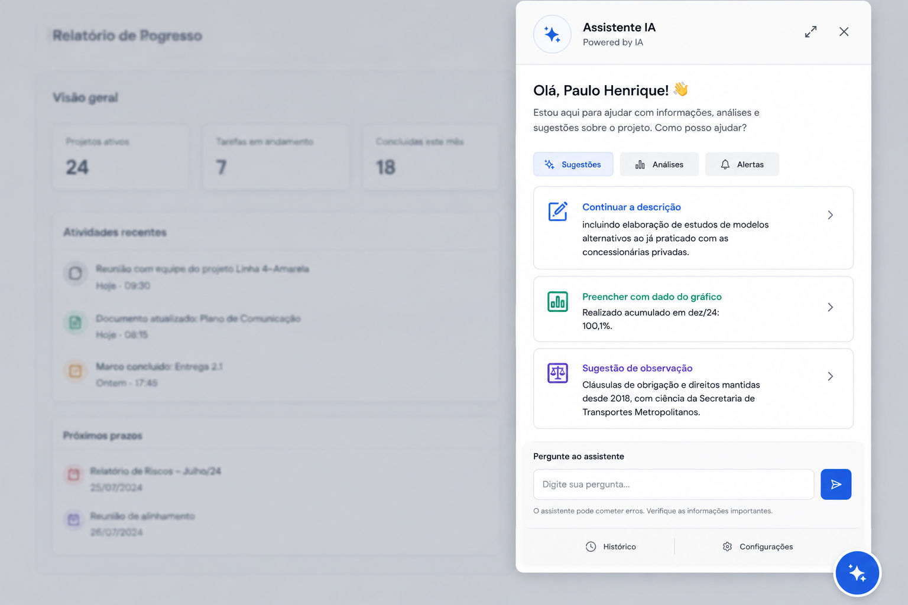<br>
  <sup>Fonte: Material produzido pelos autores, 2026.</sup>
</div>

A imagem representa a ideia dessa proposta, ainda não implementada.

### 4.14.3 Passos propostos para a implementação

| Ordem | Passo | Resolve |
|---|---|---|
| 1 | Priorizar e decidir os itens do inventário da seção 4.9 que bloqueiam a construção, a começar por P-A01, P-A02, P-B05 e P-B06 | Transforma decisões em aberto em requisitos de comportamento |
| 2 | Substituir respostas simuladas por integração real com SharePoint, o banco de dados de projetos e o Microsoft Teams | Elimina a limitação apontada nas seções 4.8 e 4.13: nenhum protótipo utiliza dados reais |
| 3 | Implementar autenticação por SSO para identificar a pessoa antes do uso, em vez do acesso simulado da Imagem 4.5.4 | Resolve P-B06 e trata o acesso não autenticado à solução |
| 4 | Construir o canal de PLN e, quando necessário, o reconhecimento de voz, para tratar pedidos como os das situações S-B04 e S-B06 do [repertório da seção 4.10](#410-repertório-de-situações) | Substitui as respostas fixas por palavra-chave do mockup |
| 5 | Definir e implementar a política de frequência e o gatilho da recomendação proativa como configuração real, não como roteiro encenado | Resolve P-A01 e P-A02 |
| 6 | Rodar um piloto controlado com um pequeno grupo de profissionais do Metrô operando a interface embutida durante a rotina real de trabalho, com instrumentação de uso | Produz o teste com usuários reais apontado como pendente em toda a seção 4.8 |
| 7 | Revisar o inventário da seção 4.9 com os resultados do piloto antes de decidir sobre expansão | Fecha o ciclo entre exploração, decisão e validação |

O piloto do passo 6 é o único ponto desta proposta capaz de responder às perguntas que os dois protótipos deixaram em aberto (tolerância a interrupções, fadiga, confiança na resposta e utilidade percebida), porque depende de pessoas do Metrô usando a interface durante o próprio trabalho, e não de uma encenação ou de uma sessão única com um participante externo.

### 4.14.4 Conclusão e Decisão

A decisão tomada ao final da exploração é que a interface funcional a ser implementada é a representada na Imagem 4.14.1: um painel embutido na ferramenta de acompanhamento de projetos que a equipe do Metrô já utiliza. Essa interface puxa as informações dos projetos por meio da IA, buscando documentos e dados estruturados, e por cima dessas informações apresenta recomendações proativas.

O vídeo do Protótipo A mostrou como essa interação vai funcionar: quando o agente recomenda, como o usuário aceita ou recusa e como a proatividade se comporta ao longo da rotina de trabalho. Esta documentação mostra como essa interação será implementada, com a Imagem 4.14.1 como exemplo concreto da interface.

O próximo passo é implementar essa interface, seguindo os passos da seção 4.14.3, e abrir seu uso para as pessoas do Metrô.

---

# 5. Desenvolvimento e Documentação Técnica do Projeto

## 5.1 Webhooks

### 5.1.1 Definição dos Webhooks

### 5.1.2 Rotas e Endpoints

### 5.1.3 Estrutura dos Dados Recebidos

### 5.1.4 Processamento e Armazenamento

### 5.1.5 Respostas e Tratamento de Erros

### 5.1.6 Exemplos e Testes

## 5.2 Módulo VHS

### 5.2.1 Objetivo e Tecnologia Utilizada

### 5.2.2 Configuração do Cache

### 5.2.3 Gravação e Reprodução das Respostas Externas

### 5.2.4 Integração com os Serviços Externos

### 5.2.5 Casos de Uso e Testes

## 5.3 Sistema de Troca de Mensagens

### 5.3.1 Tecnologia de Mensageria

### 5.3.2 Configuração de Filas, Tópicos ou Canais

### 5.3.3 Produtores

### 5.3.4 Consumidores

### 5.3.5 Integração com os Webhooks

### 5.3.6 Tratamento de Falhas

### 5.3.7 Casos de Uso e Testes

## 5.4 Integração entre Frontend e Backend

### 5.4.1 Arquitetura da Integração

### 5.4.2 Configuração e Contratos das APIs

### 5.4.3 Fluxos Integrados

### 5.4.4 Tratamento de Erros e Falhas de Comunicação

### 5.4.5 Testes de Integração

---

# 6. Planejamento de Testes Sistêmicos

## 6.1 Estratégia, Ferramentas e Bibliotecas Planejadas

## 6.2 Planejamento dos Testes de Funcionalidade

Esta seção deriva dos requisitos funcionais da Seção 2.2 o conjunto de casos de teste que verificam se a solução faz o que foi especificado. Ela cumpre o papel atribuído à Sprint 3 pela Seção 3.8.10: **planejar** os casos, não executá-los. A execução ocorre na Sprint 4 e a complementação na Sprint 5, conforme a mesma seção.

O planejamento cobre os seis requisitos funcionais, e não apenas os que já possuem implementação. Cada caso carrega uma marca de estado que declara se ele pode ser executado sobre o repositório atual ou se depende de um componente ainda por construir. Essa marca é o que impede que o plano seja lido como um retrato do que funciona: um caso planejado sobre um componente inexistente continua sendo um compromisso de verificação, mas não é evidência de nada até que a construção o alcance.

### 6.2.1 Propósito e Rastreabilidade com os Requisitos Funcionais

#### Propósito e delimitação em relação aos testes já existentes

O repositório já contém 145 testes automatizados, executados por `python -m unittest discover tests`. Eles são **testes de unidade e de contrato de componente**: verificam que `probe_audio` rejeita um arquivo corrompido, que a rota devolve `413` quando o serviço levanta `FILE_TOO_LARGE`, que o pré-processamento aplica o radicalizador na ordem esperada. Seu objeto é a peça isolada, e a referência contra a qual eles julgam é a decisão de implementação.

Os testes de funcionalidade planejados aqui têm outro objeto e outra referência. O objeto é o **comportamento observável pelo usuário**, atravessando as peças que forem necessárias; a referência é o **critério de aceitação escrito na Seção 2.2**, e não a implementação. A distinção é prática: um teste de unidade pode passar sobre um componente que cumpre perfeitamente seu contrato interno enquanto o critério de aceitação do requisito permanece descumprido. É exatamente o caso do RF01 no estado atual do repositório, como a subseção seguinte demonstra.

A consequência é que os dois conjuntos não se substituem. Os testes de unidade permanecem como a rede que protege a refatoração; os testes de funcionalidade são a evidência que se apresenta ao parceiro de que o requisito foi atendido.

#### Convenção de identificação

Cada caso recebe o identificador `CT-RFxx-nn`, em que `RFxx` é o requisito de origem e `nn` é o número sequencial dentro daquele requisito. O identificador é estável: uma vez atribuído, não é reaproveitado nem renumerado, ainda que o caso seja descartado, de modo que a evidência registrada em uma issue continue localizável depois de o plano evoluir.

Os casos são classificados em dois eixos:

| Eixo | Valores | Significado |
|---|---|---|
| Tipo | **Positivo** | Verifica que o sistema faz o que deve fazer quando as condições são favoráveis |
| | **Negativo** | Verifica que o sistema recusa, informa ou trata corretamente uma condição adversa. A aprovação exige comportamento previsto, não ausência de erro |
| Nível | **API** | Executado contra os endpoints da Seção 3.4, sem interface |
| | **Integração** | Percorre mais de um componente encadeado, como áudio para transcrição para intenção |
| | **Interface** | Exige a interface web, executado manualmente ou por automação de navegador na Sprint 5 |
| | **Conjunto** | Avaliado sobre um lote de entradas, e não sobre uma execução isolada |

#### Estado de implementação de cada requisito

A tabela confronta cada requisito funcional com o que existe no repositório na data desta redação. Ela é o insumo que determina em qual sprint cada caso se torna executável, e foi levantada por inspeção do código, e não por leitura das seções anteriores deste documento.

| RF | Estado | O que existe | O que falta para o critério de aceitação |
|---|---|---|---|
| **RF01** | **Parcialmente implementado** | `POST /api/v1/audio` com validação de formato, tamanho e duração (`src/routes/audio.py`); `POST /api/v1/audio/{audio_id}/transcribe` integrado ao Deepgram (`src/routes/transcription.py`); `POST /api/v1/chat` devolvendo resposta textual (`src/routes/chat.py`) | A interface não envia áudio: `sendAudio` existe em `src/frontend/src/lib/api.js` e nenhum componente a utiliza; a transcrição não é apresentada ao usuário antes do processamento, que é a parte central do critério |
| **RF02** | **Parcialmente implementado** | Classificação de intenção sobre as dez classes do catálogo da Seção 3.1, incluindo `fora_do_catalogo`, exposta por `POST /api/v1/audio/{audio_id}/analyze` (`src/routes/analysis.py`) e apoiada em 400 exemplos rotulados | Extração de entidades, correspondência entre entidade e registro, consulta às fontes e ciclo de esclarecimento de parâmetro faltante. O `POST /api/v1/chat` responde por modelo de linguagem sem fundamentação nas fontes |
| **RF03** | **Não implementado** | — | Nenhum schema de resposta em `src/schemas/` transporta documento de origem, referência ou data; `ChatResponse` contém apenas `reply` |
| **RF04** | **Não implementado** | As intenções INT-03 a INT-07 estão no catálogo e na base de treinamento | A execução da intenção: leitura dos campos pendentes de um artefato e geração de sugestão por campo |
| **RF05** | **Não implementado** | — | Persistência de `Pendência`, agendador de verificação e serviço de notificação, todos previstos para a Sprint 4 |
| **RF06** | **Não implementado** | — | Escrita nas fontes, que a Seção 3.1 declara fora do escopo do MVP e a decisão D04 registra como evolução futura |

Dos seis requisitos, portanto, **nenhum está integralmente implementado**, dois possuem caminho parcial verificável e quatro dependem de construção. O plano registra isso de frente porque a alternativa — planejar como se tudo existisse — produziria um artefato que só se descobre irreal no momento da execução, na Sprint 4, quando já não há folga para reagir.

#### Decomposição dos critérios de aceitação em condições verificáveis

Cada critério de aceitação da Seção 2.2 é uma frase que reúne mais de uma exigência. A verificação exige separá-las, porque um caso de teste que tenta cobrir a frase inteira não distingue qual parte falhou. A tabela apresenta essa decomposição e indica os casos que respondem por cada condição.

| RF | Condição verificável extraída do critério | Casos |
|---|---|---|
| **RF01** | C1.1 — Solicitação em áudio é convertida em texto | CT-RF01-01, CT-RF01-02 |
| | C1.2 — A transcrição é apresentada ao usuário **antes** do processamento | CT-RF01-03 |
| | C1.3 — Solicitação em texto é processada diretamente | CT-RF01-04 |
| | C1.4 — A resposta é apresentada em texto, qualquer que seja o formato de entrada | CT-RF01-05 |
| | C1.5 — Entradas inválidas no recebimento de áudio são recusadas com o erro previsto no contrato da Seção 3.4 | CT-RF01-06 a CT-RF01-10 |
| | C1.6 — A falha do canal é comunicada ao usuário, e não mascarada | CT-RF01-15 |
| | C1.7 — Falha da transcrição e mensagem de texto inválida são recusadas com o erro correspondente, definido no código das rotas de transcrição e de chat | CT-RF01-11 a CT-RF01-14 |
| **RF02** | C2.1 — O sistema identifica a que tipo de solicitação a mensagem se refere | CT-RF02-01, CT-RF02-02, CT-RF02-03 |
| | C2.2 — O sistema identifica a que projeto e a que dado a solicitação se refere | CT-RF02-04 |
| | C2.3 — O sistema consulta as fontes e retorna os dados solicitados | CT-RF02-05 |
| | C2.4 — Quando não é possível identificar projeto ou dado, o sistema solicita o dado faltante antes de consultar as fontes | CT-RF02-06, CT-RF02-09 |
| | C2.5 — Quando a solicitação está fora do catálogo, o sistema informa a limitação **sem consultar as fontes** | CT-RF02-07 |
| | C2.6 — O sistema não devolve dado sobre projeto inexistente nem sobre projeto fora do alcance do perfil | CT-RF02-08, CT-RF02-10 |
| **RF03** | C3.1 — Todo dado de negócio é acompanhado do documento de origem | CT-RF03-01 |
| | C3.2 — A referência exibida permite localizar o documento no repositório | CT-RF03-03 |
| | C3.3 — A data da última atualização do documento é exibida | CT-RF03-01, CT-RF03-05 |
| | C3.4 — Quando a resposta combina mais de uma fonte, todas são listadas | CT-RF03-02 |
| | C3.5 — Dado sem origem identificável não é apresentado como fundamentado | CT-RF03-04 |
| **RF04** | C4.1 — Há uma sugestão de texto para cada campo pendente | CT-RF04-01, CT-RF04-05 |
| | C4.2 — Cada sugestão pode ser copiada individualmente | CT-RF04-02 |
| | C4.3 — O documento de origem não é alterado | CT-RF04-03 |
| | C4.4 — Cada sugestão indica fonte e justificativa, conforme o RNF11 | CT-RF04-04 |
| | C4.5 — Documento fora do conjunto suportado produz informação de limitação | CT-RF04-06 |
| **RF05** | C5.1 — Nova pendência gera notificação sem solicitação prévia do usuário | CT-RF05-01 |
| | C5.2 — A notificação informa o projeto e a pendência | CT-RF05-01 |
| | C5.3 — A notificação alcança apenas quem acompanha o projeto | CT-RF05-02, CT-RF05-04 |
| | C5.4 — Pendência já notificada não gera notificação repetida | CT-RF05-03 |
| | C5.5 — Pendência com dados incompletos não produz notificação malformada | CT-RF05-05 |
| **RF06** | C6.1 — A instrução identifica o projeto e os campos afetados, com valores compatíveis com o tipo de cada campo | CT-RF06-01, CT-RF06-05 |
| | C6.2 — Os valores a gravar são apresentados ao usuário antes da gravação | CT-RF06-01 |
| | C6.3 — A alteração só é efetivada após confirmação explícita | CT-RF06-02, CT-RF06-03 |
| | C6.4 — Autor e data da alteração são registrados | CT-RF06-02 |
| | C6.5 — Alteração por quem não lidera o projeto é recusada | CT-RF06-04 |

Nenhuma condição ficou sem caso e nenhum caso ficou sem condição de origem. É essa correspondência, e não a contagem de casos, que sustenta a discussão de abrangência da Seção 6.2.5.

#### Rastreabilidade com os requisitos não funcionais

Alguns casos funcionais tocam requisitos não funcionais sem, no entanto, medi-los. A distinção é deliberada: o caso funcional verifica que o comportamento **existe**; o teste da Seção 6.3 verifica que ele atinge o **valor-alvo**. A tabela registra esses pontos de contato para que a Seção 6.3 não os replique.

| Caso funcional | RNF tocado | O que o caso funcional verifica | O que fica para a Seção 6.3 |
|---|---|---|---|
| CT-RF01-02 | RNF06 — Qualidade da transcrição | Que a transcrição é produzida e devolvida com idioma, confiança e duração | A taxa de erro de palavras contra transcrições de referência |
| CT-RF02-03 | RNF03 — Precisão na identificação de intenções | Que o classificador atribui uma classe do catálogo a cada entrada | A acurácia mínima de 85% sobre a partição de teste isolada |
| CT-RF02-10 | RNF02 — Controle de acesso | Que o dado não é devolvido a perfil sem alcance | O bloqueio de 80% das tentativas em até 15 segundos |
| CT-RF03-01 a CT-RF03-05 | RNF11 — Explicabilidade | Que fonte e data acompanham o dado | A proporção de 85% de sugestões com referência válida |
| CT-RF04-04 | RNF11 — Explicabilidade | Que a sugestão traz fonte e justificativa | A compreensibilidade da justificativa, aferida na Seção 6.5 |
| Todos | RNF04 e RNF09 — Rastreabilidade e auditabilidade | — | O registro de cada interação com os atributos mínimos exigidos |

### 6.2.2 Cenários Positivos e Negativos Planejados

#### Critério de composição

O plano não distribui casos positivos e negativos em proporção fixa. A distribuição acompanha a superfície de erro efetivamente especificada de cada requisito: o RF01 concentra nove casos negativos porque três fontes de erro sobre o mesmo canal de entrada definem, um a um, códigos com HTTP e mensagem próprios — cinco dos sete códigos padronizados pelo contrato da Seção 3.4, mais dois da API de transcrição e dois da validação de mensagem do chat, definidos no código das rotas — e cada um deles é uma promessa verificável; o RF03, ao contrário, tem dois negativos porque seu critério descreve principalmente uma obrigação de presença, e não um conjunto de recusas.

Um caso negativo só é aprovado quando o sistema apresenta o **comportamento previsto** para a condição adversa. Ausência de exceção não é aprovação: um endpoint que aceita um arquivo corrompido e devolve `201` falha o caso negativo correspondente, ainda que não tenha quebrado.

#### Quadro geral dos casos planejados

A coluna **Sprint** indica em que ciclo o caso se torna executável, conforme o estado levantado na Seção 6.2.1. A coluna **Estado** distingue três situações: *Executável* significa que o caso pode ser escrito e rodado sobre o repositório atual; *Executável em parte* significa que uma parcela da condição é verificável hoje e o restante depende de construção, com a delimitação indicada na ficha correspondente; *Planejado* significa que o componente sob teste ainda não existe.

| ID | RF | Condição | Tipo | Nível | Sprint | Estado |
|---|---|---|---|---|---|---|
| CT-RF01-01 | RF01 | C1.1 | Positivo | API | 4 | Executável |
| CT-RF01-02 | RF01 | C1.1 | Positivo | Integração | 4 | Executável |
| CT-RF01-03 | RF01 | C1.2 | Positivo | Interface | 5 | Planejado |
| CT-RF01-04 | RF01 | C1.3 | Positivo | API | 4 | Executável |
| CT-RF01-05 | RF01 | C1.4 | Positivo | Integração | 4 | Executável em parte |
| CT-RF01-06 | RF01 | C1.5 | Negativo | API | 4 | Executável |
| CT-RF01-07 | RF01 | C1.5 | Negativo | API | 4 | Executável |
| CT-RF01-08 | RF01 | C1.5 | Negativo | API | 4 | Executável |
| CT-RF01-09 | RF01 | C1.5 | Negativo | API | 4 | Executável |
| CT-RF01-10 | RF01 | C1.5 | Negativo | API | 4 | Executável |
| CT-RF01-11 | RF01 | C1.7 | Negativo | API | 4 | Executável |
| CT-RF01-12 | RF01 | C1.7 | Negativo | Integração | 4 | Executável |
| CT-RF01-13 | RF01 | C1.7 | Negativo | API | 4 | Executável |
| CT-RF01-14 | RF01 | C1.7 | Negativo | API | 4 | Executável |
| CT-RF01-15 | RF01 | C1.6 | Negativo | Interface | 5 | Planejado |
| CT-RF02-01 | RF02 | C2.1 | Positivo | API | 4 | Executável |
| CT-RF02-02 | RF02 | C2.1 | Positivo | API | 4 | Executável |
| CT-RF02-03 | RF02 | C2.1 | Positivo | Conjunto | 4 | Executável |
| CT-RF02-04 | RF02 | C2.2 | Positivo | Integração | 4 | Planejado |
| CT-RF02-05 | RF02 | C2.3 | Positivo | Integração | 4 | Planejado |
| CT-RF02-06 | RF02 | C2.4 | Positivo | Integração | 5 | Planejado |
| CT-RF02-07 | RF02 | C2.5 | Negativo | Integração | 4 | Executável em parte |
| CT-RF02-08 | RF02 | C2.6 | Negativo | Integração | 4 | Planejado |
| CT-RF02-09 | RF02 | C2.4 | Negativo | Integração | 5 | Planejado |
| CT-RF02-10 | RF02 | C2.6 | Negativo | API | 5 | Planejado |
| CT-RF03-01 | RF03 | C3.1, C3.3 | Positivo | Integração | 4 | Planejado |
| CT-RF03-02 | RF03 | C3.4 | Positivo | Integração | 4 | Planejado |
| CT-RF03-03 | RF03 | C3.2 | Positivo | Interface | 4 | Planejado |
| CT-RF03-04 | RF03 | C3.5 | Negativo | Integração | 4 | Planejado |
| CT-RF03-05 | RF03 | C3.3 | Negativo | Integração | 4 | Planejado |
| CT-RF04-01 | RF04 | C4.1 | Positivo | Integração | 5 | Planejado |
| CT-RF04-02 | RF04 | C4.2 | Positivo | Interface | 5 | Planejado |
| CT-RF04-03 | RF04 | C4.3 | Positivo | Integração | 5 | Planejado |
| CT-RF04-04 | RF04 | C4.4 | Positivo | Integração | 5 | Planejado |
| CT-RF04-05 | RF04 | C4.1 | Negativo | Integração | 5 | Planejado |
| CT-RF04-06 | RF04 | C4.5 | Negativo | Integração | 5 | Planejado |
| CT-RF05-01 | RF05 | C5.1, C5.2 | Positivo | Integração | 4 | Planejado |
| CT-RF05-02 | RF05 | C5.3 | Positivo | Integração | 4 | Planejado |
| CT-RF05-03 | RF05 | C5.4 | Negativo | Integração | 4 | Planejado |
| CT-RF05-04 | RF05 | C5.3 | Negativo | Integração | 4 | Planejado |
| CT-RF05-05 | RF05 | C5.5 | Negativo | Integração | 5 | Planejado |
| CT-RF06-01 | RF06 | C6.1, C6.2 | Positivo | Integração | 5 | Planejado |
| CT-RF06-02 | RF06 | C6.3, C6.4 | Positivo | Integração | 5 | Planejado |
| CT-RF06-03 | RF06 | C6.3 | Negativo | Integração | 5 | Planejado |
| CT-RF06-04 | RF06 | C6.5 | Negativo | API | 5 | Planejado |
| CT-RF06-05 | RF06 | C6.1 | Negativo | Integração | 5 | Planejado |

#### Distribuição consolidada

| RF | Positivos | Negativos | Total | Executáveis na Sprint 4 | Planejados para as próximas sprints |
|---|---:|---:|---:|---:|---:|
| RF01 | 5 | 10 | 15 | 13 | 2 |
| RF02 | 6 | 4 | 10 | 4 | 6 |
| RF03 | 3 | 2 | 5 | 0 | 5 |
| RF04 | 4 | 2 | 6 | 0 | 6 |
| RF05 | 2 | 3 | 5 | 0 | 5 |
| RF06 | 2 | 3 | 5 | 0 | 5 |
| **Total** | **22** | **24** | **46** | **17** | **29** |

Dezessete dos quarenta e seis casos, ou 37%, podem ser executados sobre o que existe hoje, contando os dois marcados como *Executável em parte*. Os vinte e nove restantes permanecem como compromisso de verificação das Sprints 4 e 5, vinculados às entregas correspondentes da Seção 3.8.4. Essa proporção é a medida mais direta da distância entre o especificado e o construído, e a Seção 6.2.5 discute o que ela implica.

### 6.2.3 Procedimentos de Teste

Esta subseção reúne, para cada requisito, as pré-condições comuns, a massa de dados necessária e o roteiro de execução caso a caso. O agrupamento por requisito evita repetir em quarenta e seis fichas o mesmo ambiente e a mesma massa de dados, e mantém legível a parte que efetivamente varia: o propósito do caso, o passo executado e a observação a registrar. A coluna **Propósito do teste** responde à pergunta que justifica a existência de cada caso, e é o que distingue um caso de outro dentro do mesmo requisito.

#### Ambiente e ferramental comuns a todos os casos

As condições abaixo valem para o conjunto inteiro e não são repetidas nas fichas.

| Item | Definição |
|---|---|
| Ambiente | Contêiner local padronizado na Sprint 3, conforme a Seção 3.8.5, ou a instância de nuvem da Seção 3.7 quando o caso for de interface |
| Instalação | `pip install -e ".[dev]"`, seguido dos recursos de linguagem indicados no `README.md` |
| Execução dos casos automatizados | `python -m unittest discover tests`, mesmo comando da suíte atual de 145 testes |
| Ferramental | `unittest` como executor, `fastapi.testclient.TestClient` para os casos de API e `httpx` para os de integração, já declarados no `pyproject.toml`. A consolidação das ferramentas por categoria de teste é objeto da Seção 6.1 |
| Serviços externos | Nos casos de integração, as respostas do Deepgram e do Gemini são obtidas do mecanismo de armazenamento temporário previsto na Seção 3.8.10 e detalhado na Seção 6.4.3, e não do serviço ao vivo |
| Registro da evidência | Saída do executor, corpo das respostas HTTP e captura de tela nos casos de interface, anexados à issue correspondente no GitLab |
| Isolamento | Nenhum caso depende do resultado de outro. Casos que exigem estado prévio o constroem em sua própria pré-condição |

#### Massa de dados necessária

A massa é construída pela equipe e versionada junto dos testes. Nenhum item utiliza dado real do parceiro, em conformidade com a decisão D01.

| Conjunto | Conteúdo | Casos que o utilizam | Situação |
|---|---|---|---|
| **A. Áudios válidos** | Seis gravações de 5 a 30 segundos, uma por formato aceito, com vocabulário de gestão de portfólio: nomes de linha, siglas de artefato, datas faladas | CT-RF01-01, CT-RF01-02, CT-RF01-05 | A gravar na Sprint 4 |
| **B. Áudios inválidos** | Um arquivo `.ogg`, um arquivo de 12 MB, uma gravação de 6 minutos, um arquivo de zero byte, um `.wav` com cabeçalho truncado | CT-RF01-06 a CT-RF01-09 | A gerar por script na Sprint 4 |
| **C. Solicitações em texto rotuladas** | A partição de teste isolada prevista na task T14 do planejamento da Sprint 3, separada por semente fixa e sem participação na varredura nem no ajuste de hiperparâmetros | CT-RF02-01 a CT-RF02-03, CT-RF02-07 | Depende da conclusão da T14 |
| **D. Solicitações fora do catálogo** | Vinte pedidos alheios ao portfólio, distintos dos 40 exemplos de `fora_do_catalogo` usados no treinamento | CT-RF02-07 | A escrever na Sprint 4 |
| **E. Projetos sintéticos** | Ao menos oito projetos com status, avanço, prazos e responsáveis distintos, sendo pelo menos dois liderados por perfis diferentes | CT-RF02-04 a CT-RF02-10, CT-RF03-*, CT-RF05-*, CT-RF06-* | Depende da população do banco, task T25 da Sprint 4 |
| **F. Artefatos com metadados** | Ao menos seis artefatos vinculados aos projetos do conjunto E, com `referencia` e `data` preenchidas; um artefato deliberadamente sem `data`; um dado de negócio sem artefato de origem | CT-RF03-* | A construir na Sprint 4 |
| **G. Artefatos com campos pendentes** | Um TAP com três campos pendentes, um mapa de benefícios integralmente preenchido e um documento de tipo não previsto no catálogo | CT-RF04-* | A construir na Sprint 5 |
| **H. Pendências** | Pendências com prazo futuro, prazo vencido, uma já notificada e uma sem prazo, distribuídas entre projetos acompanhados e não acompanhados | CT-RF05-* | Depende do modelo de `Pendência`, Sprint 4 |
| **I. Perfis de usuário** | Um diretor, um analista de PMO e dois líderes responsáveis por projetos distintos, conforme as especializações da Seção 2.2.1 | CT-RF02-10, CT-RF06-04 | Depende da autenticação, hoje não implementada |

O conjunto C merece registro à parte. A base atual foi gerada por gabarito e a Seção 3.3.7 já declara que a medição sobre ela está saturada; o risco AM6 acompanha exatamente essa fragilidade. Os casos CT-RF02-01 a CT-RF02-03 executados sobre a base atual produziriam aprovação sem significado. Por isso o plano condiciona esses três casos à partição reformulada da task T14, e não à base existente.

#### RF01 — Receber solicitações por áudio e texto e responder em texto

**Propósito.** Verificar que o canal de entrada aceita as duas modalidades previstas, que a conversão de áudio em texto ocorre e é apresentada ao usuário antes do processamento, que a resposta chega em texto e que toda entrada inválida é recusada com o erro exato definido no contrato de cada rota envolvida: a Seção 3.4 para o recebimento de áudio; o código das rotas de transcrição e de chat para os demais.

**Pré-condições comuns.** Aplicação em execução; bucket compatível com S3 acessível; credencial do provedor de Speech to Text configurada nos casos de integração; conjuntos A e B disponíveis.

| Caso | Propósito do teste | Passos | Observação a registrar |
|---|---|---|---|
| CT-RF01-01 | Confirmar que os seis formatos aceitos entram no sistema e ficam armazenados | Enviar `POST /api/v1/audio` com `multipart/form-data`, campo `audio`, usando cada um dos seis arquivos do conjunto A | Código HTTP, corpo da resposta e presença do objeto sob `incoming/{audio_id}` no bucket |
| CT-RF01-02 | Confirmar que o áudio armazenado é convertido em texto com os metadados do reconhecimento | A partir do `audio_id` do caso anterior, enviar `POST /api/v1/audio/{audio_id}/transcribe?language=pt-BR` | Código HTTP e os campos `text`, `language`, `confidence` e `duration_seconds` |
| CT-RF01-03 | Confirmar que o usuário vê e pode conferir a transcrição antes de ela ser processada | Pela interface, gravar uma solicitação por voz e acompanhar a tela até a resposta | Se a transcrição aparece na tela **antes** de a resposta ser solicitada, e se o usuário pode conferi-la nesse intervalo |
| CT-RF01-04 | Confirmar que a solicitação em texto é processada sem passar pelo canal de voz | Enviar `POST /api/v1/chat` com `{"message": "...", "conversation_id": "..."}` usando cinco solicitações do conjunto C | Código HTTP e o campo `reply`, verificando que é texto não vazio |
| CT-RF01-05 | Confirmar que os dois canais de entrada levam ao mesmo entendimento da solicitação | Submeter a mesma solicitação pelos dois canais: gravada em áudio do conjunto A e digitada em texto; comparar a intenção classificada nos dois caminhos | Intenção e confiança de cada caminho, e se coincidem |
| CT-RF01-06 | Confirmar que formato fora da lista é recusado como formato, e não como arquivo inválido | `POST /api/v1/audio` com o arquivo `.ogg` do conjunto B | Código HTTP e o campo `error` do corpo |
| CT-RF01-07 | Confirmar que o limite de 10 MB é aplicado antes de qualquer processamento | `POST /api/v1/audio` com o arquivo de 12 MB | Código HTTP e o campo `error` |
| CT-RF01-08 | Confirmar que o limite de 5 minutos é aplicado sobre a duração real, e não sobre o tamanho | `POST /api/v1/audio` com a gravação de 6 minutos | Código HTTP e o campo `error` |
| CT-RF01-09 | Confirmar que arquivo vazio e arquivo corrompido são recusados pelo conteúdo binário | `POST /api/v1/audio` com o arquivo de zero byte e, em seguida, com o `.wav` truncado | Código HTTP e o campo `error` em cada envio |
| CT-RF01-10 | Confirmar que requisição estruturalmente inválida é distinguida de arquivo inválido | `POST /api/v1/audio` com corpo `application/json`, e não `multipart/form-data` | Código HTTP e o campo `error` |
| CT-RF01-11 | Confirmar que identificador inexistente não é tratado como falha do provedor externo | `POST /api/v1/audio/aud_inexistente/transcribe` | Código HTTP e o campo `error` |
| CT-RF01-12 | Confirmar que a falha do serviço externo chega ao cliente como erro previsto, sem vazar exceção | Executar a transcrição com o provedor de Speech to Text configurado para falhar, usando a resposta de erro armazenada conforme a Seção 6.4.3 | Código HTTP, o campo `error` e a mensagem devolvida ao cliente |
| CT-RF01-13 | Confirmar que mensagem vazia é recusada antes de consumir o modelo de linguagem | `POST /api/v1/chat` com `message` vazia e, em seguida, com apenas espaços | Código HTTP e o campo `error` em cada envio |
| CT-RF01-14 | Confirmar que o limite de 4.000 caracteres da mensagem é aplicado | `POST /api/v1/chat` com `message` de 4.001 caracteres | Código HTTP e o campo `error` |
| CT-RF01-15 | Confirmar que a indisponibilidade do backend é comunicada, e não substituída por conteúdo de exemplo | Pela interface, enviar uma mensagem com o backend interrompido | O que a tela apresenta ao usuário: mensagem de erro identificável ou resposta indistinguível de uma resposta real |

O CT-RF01-15 tem motivação concreta. O tratamento atual em `src/frontend/src/pages/AgentPage.jsx` registra `backend indisponível, usando resposta de exemplo` no console e apresenta uma resposta de demonstração na tela. Para a prototipação isso foi útil; para o usuário final significa receber conteúdo fabricado sem saber. O caso existe para forçar a decisão sobre esse comportamento antes da entrega, e sua aprovação exige que a indisponibilidade seja visível na interface.

#### RF02 — Consultar dados de projetos

**Propósito.** Verificar que o agente reconhece a natureza da solicitação, localiza o projeto e o dado pedidos, consulta as fontes, pede o que falta quando a solicitação é incompleta e recusa, sem consultar as fontes, aquilo que está fora do catálogo da Seção 3.1.

**Pré-condições comuns.** Modelo de classificação treinado e carregado; partição de teste da task T14 disponível; conjuntos C, D, E e I conforme o caso.

| Caso | Propósito do teste | Passos | Observação a registrar |
|---|---|---|---|
| CT-RF02-01 | Confirmar que solicitação sobre projeto é reconhecida como consulta ao portfólio | Submeter dez solicitações do conjunto C rotuladas como `consultar_projeto_sintetico` a `POST /api/v1/audio/{audio_id}/analyze` ou diretamente ao classificador | Intenção prevista, confiança e rótulo esperado de cada solicitação |
| CT-RF02-02 | Confirmar que solicitação sobre norma é distinguida de solicitação sobre projeto | Repetir com dez solicitações rotuladas como `consultar_documentos_normativos` | Os mesmos campos |
| CT-RF02-03 | Medir se o classificador separa as dez classes do catálogo em condição não vista no treinamento | Executar o classificador sobre a partição de teste completa e apurar a acurácia e a matriz de confusão | Acurácia global, acurácia por classe e as confusões mais frequentes |
| CT-RF02-04 | Confirmar que o projeto nomeado na solicitação é associado ao registro correto | Submeter cinco solicitações que nomeiem projetos do conjunto E e verificar a entidade extraída e o registro correspondente | Entidade extraída, registro associado e se corresponde ao projeto nomeado |
| CT-RF02-05 | Confirmar que o dado devolvido vem da fonte, e não da geração livre do modelo | Consultar um dado específico de um projeto do conjunto E e comparar o valor devolvido com o registro na fonte | Valor devolvido, valor na fonte e se coincidem |
| CT-RF02-06 | Confirmar que o esclarecimento pede apenas o que falta e preserva o que já foi informado | Enviar "qual é o status do projeto?", sem nomear o projeto; responder à pergunta de esclarecimento com o nome; verificar se o dado originalmente pedido foi preservado | Texto da pergunta de esclarecimento, resposta final e se o pedido original foi mantido |
| CT-RF02-07 | Confirmar que pedido fora do escopo é recusado antes de qualquer consulta às fontes | Submeter as vinte solicitações do conjunto D e observar a classificação e a resposta | Intenção atribuída, teor da resposta e, nos registros de auditoria, se houve consulta às fontes |
| CT-RF02-08 | Confirmar que o agente admite não ter o dado em vez de fabricá-lo | Consultar um projeto que não existe no conjunto E | Teor da resposta, verificando se declara não ter encontrado o projeto ou se apresenta conteúdo fabricado |
| CT-RF02-09 | Confirmar que a resposta dentro de um fluxo guiado não reinicia a classificação de intenção | Iniciar um fluxo guiado, responder à pergunta do agente com um valor simples, como uma data, e observar se o sistema trata a resposta como preenchimento de entidade ou como nova intenção | Estado do fluxo após a resposta e intenção registrada, se houver |
| CT-RF02-10 | Confirmar que o alcance do perfil limita o que é devolvido | Autenticado como líder do projeto P1, consultar um dado do projeto P2, liderado por outro perfil | Código HTTP, teor da resposta e registro de auditoria da tentativa |

O CT-RF02-07 é o caso que o plano identifica como *executável em parte*. A classificação como `fora_do_catalogo` pode ser verificada hoje; a exigência de que a recusa ocorra **sem consultar as fontes** só se torna verificável quando existirem fontes a consultar e registro de auditoria que evidencie a ausência da consulta, ambos previstos para a Sprint 4.

#### RF03 — Apresentar a fonte da informação

**Propósito.** Verificar que todo dado de negócio devolvido pelo agente vem acompanhado do documento de origem, da referência que permite localizá-lo e da data da sua última atualização, e que respostas construídas sobre mais de um documento listam todos eles.

**Pré-condições comuns.** Conjuntos E e F carregados; atributos `referencia` e `data` da classe `Artefato` implementados conforme a Seção 2.2.1; resposta do agente fundamentada em fonte, e não gerada livremente.

| Caso | Propósito do teste | Passos | Observação a registrar |
|---|---|---|---|
| CT-RF03-01 | Confirmar que os três elementos de origem acompanham o dado de negócio | Consultar um dado de projeto cuja origem seja um único artefato do conjunto F | Os três elementos exigidos na resposta: documento, referência e data |
| CT-RF03-02 | Confirmar que nenhuma fonte usada na composição da resposta é omitida | Formular uma consulta cuja resposta exija combinar dois artefatos distintos | Quantidade de fontes listadas e se corresponde às efetivamente utilizadas |
| CT-RF03-03 | Confirmar que a referência é acionável, e não apenas presente na tela | Tomar a referência exibida em CT-RF03-01 e tentar localizar o documento no repositório a partir dela | Se a referência levou ao documento correto, sem informação adicional |
| CT-RF03-04 | Confirmar que dado sem origem não é apresentado como fundamentado | Consultar o dado de negócio que, no conjunto F, não possui artefato de origem | Se a resposta declara a ausência de fonte ou apresenta o dado como fundamentado |
| CT-RF03-05 | Confirmar que a lacuna de data é declarada em vez de preenchida | Consultar o dado cujo artefato de origem está sem `data` preenchida | Se a resposta indica a lacuna ou exibe data vazia, nula ou inventada |

#### RF04 — Sugerir o preenchimento de documentos

**Propósito.** Verificar que o agente identifica os campos pendentes de um documento, produz uma sugestão para cada um, permite copiá-las individualmente e não altera o documento de origem.

**Pré-condições comuns.** Conjunto G carregado; atributos `obrigatorio` e `preenchido` da classe `CampoArtefato` implementados; cópia do documento de origem preservada para comparação.

| Caso | Propósito do teste | Passos | Observação a registrar |
|---|---|---|---|
| CT-RF04-01 | Confirmar a correspondência de um para um entre campo pendente e sugestão | Solicitar apoio no preenchimento do TAP com três campos pendentes | Quantidade de sugestões apresentadas e a qual campo cada uma corresponde |
| CT-RF04-02 | Confirmar que a cópia isola exatamente a sugestão escolhida | Acionar a cópia de uma sugestão individual na interface e colar em um editor | Conteúdo efetivamente copiado e se corresponde apenas àquela sugestão |
| CT-RF04-03 | Confirmar que a interação não escreve no documento de origem | Comparar o documento de origem antes e depois da interação, por soma de verificação | Somas de verificação antes e depois e se coincidem |
| CT-RF04-04 | Confirmar que a sugestão é rastreável até a fonte que a fundamenta | Examinar cada sugestão de CT-RF04-01 quanto à fonte e à justificativa apresentadas | Presença de fonte identificável e de justificativa em cada sugestão |
| CT-RF04-05 | Confirmar que ausência de pendência não é preenchida com sugestão desnecessária | Solicitar apoio no preenchimento do mapa de benefícios integralmente preenchido | Teor da resposta, verificando se informa a ausência de pendências ou produz sugestões sem necessidade |
| CT-RF04-06 | Confirmar que o limite do conjunto suportado é declarado ao usuário | Solicitar apoio para o documento de tipo não previsto no catálogo | Teor da resposta e se a limitação é explicada ao usuário |

#### RF05 — Notificar proativamente o usuário de pendências

**Propósito.** Verificar que o sistema identifica pendências novas nos projetos acompanhados e notifica o usuário por iniciativa própria, sem solicitação prévia, informando projeto e pendência, sem repetir alertas já enviados e sem alcançar quem não acompanha o projeto.

**Pré-condições comuns.** Conjuntos E e H carregados; associação `acompanha` da Seção 2.2.1 populada; agendador de verificação em execução, com o intervalo reduzido para permitir a observação dentro da janela de teste.

| Caso | Propósito do teste | Passos | Observação a registrar |
|---|---|---|---|
| CT-RF05-01 | Confirmar que a notificação parte do sistema, e não de uma solicitação do usuário | Inserir uma pendência nova em projeto acompanhado pelo usuário de teste e aguardar o ciclo do agendador, sem realizar nenhuma solicitação | Se a notificação ocorreu, e se identifica o projeto e a pendência |
| CT-RF05-02 | Confirmar que o alcance da notificação segue a relação `acompanha` | Verificar quais usuários receberam a notificação do caso anterior | Lista de destinatários confrontada com a lista de quem acompanha o projeto |
| CT-RF05-03 | Confirmar que o alerta não se repete a cada ciclo do agendador | Executar um segundo ciclo do agendador sem alterar as pendências | Se houve nova notificação sobre a mesma pendência |
| CT-RF05-04 | Confirmar que quem não acompanha o projeto não é alcançado | Inserir uma pendência em projeto que o usuário de teste não acompanha e aguardar o ciclo | Se o usuário recebeu notificação indevida |
| CT-RF05-05 | Confirmar que pendência incompleta não vira notificação com campo vazio | Inserir a pendência sem prazo do conjunto H e aguardar o ciclo | Se houve notificação, e, havendo, se o conteúdo está completo ou apresenta campo vazio ao usuário |

#### RF06 — Atualizar o cadastro de projetos a partir de instruções do usuário

**Propósito.** Verificar que o agente interpreta uma instrução de atualização, identifica projeto e campos afetados, apresenta ao usuário os valores que serão gravados, grava apenas após confirmação explícita e registra autor e data.

**Pré-condições comuns.** Conjuntos E e I carregados; escrita nas fontes habilitada, o que hoje a Seção 3.1 exclui do MVP; registro de auditoria em operação conforme o RNF09.

| Caso | Propósito do teste | Passos | Observação a registrar |
|---|---|---|---|
| CT-RF06-01 | Confirmar que a instrução em linguagem natural vira alteração explícita e revisável | Autenticado como líder de P1, enviar "atualiza o avanço do projeto P1 para 45% neste mês" | Projeto e campos identificados e os valores exibidos antes da gravação |
| CT-RF06-02 | Confirmar que a gravação ocorre e deixa rastro de autoria e data | Confirmar explicitamente a alteração proposta no caso anterior | Valor gravado na fonte e os campos de autor e data do registro de auditoria |
| CT-RF06-03 | Confirmar que a ausência de confirmação preserva o valor anterior | Repetir a instrução e, em vez de confirmar, recusar ou abandonar a conversa | Valor do campo na fonte após a interação |
| CT-RF06-04 | Confirmar que a permissão de alteração segue a relação `lidera` | Autenticado como líder de P1, instruir a atualização de um campo do projeto P2 | Código HTTP, teor da resposta e valor do campo em P2 após a tentativa |
| CT-RF06-05 | Confirmar que valor ambíguo não é resolvido por conta própria pelo agente | Enviar "atualiza a data de término do projeto P1 para amanhã de manhã cedo", com valor incompatível com o tipo `date` do campo | Teor da resposta e se o sistema pede correção ou grava uma interpretação própria |

### 6.2.4 Resultados Esperados

O resultado esperado é declarado antes da execução e não é ajustado depois dela. Se a execução na Sprint 4 produzir um resultado diferente do previsto aqui, o caso é reprovado e a divergência é registrada como defeito ou como revisão de requisito, com a decisão registrada na Seção 7; alterar o resultado esperado para acomodar o comportamento observado descaracterizaria o teste.

Nos casos de conjunto, o critério de aprovação é um limiar sobre o lote inteiro. Nos demais, é a correspondência exata com o resultado descrito.

#### RF01

| Caso | Resultado esperado | Critério de aprovação |
|---|---|---|
| CT-RF01-01 | `201` com corpo `{"id": "...", "status": "received", "message": "Áudio recebido com sucesso."}` e objeto gravado sob `incoming/{audio_id}` | Os seis formatos do conjunto A aprovados, sem exceção |
| CT-RF01-02 | `200` com `text` não vazio, `language` igual a `pt-BR`, `confidence` numérico e `duration_seconds` compatível com a gravação | Transcrição inteligível em todos os seis áudios; a fidelidade é medida no teste de RNF06 da Seção 6.3 |
| CT-RF01-03 | A transcrição é exibida na tela e permanece visível antes de a solicitação seguir para processamento | A transcrição precede a resposta na tela e é legível pelo usuário |
| CT-RF01-04 | `200` com `reply` em texto não vazio | Cinco solicitações de cinco aprovadas |
| CT-RF01-05 | A intenção classificada é a mesma pelos dois canais | Coincidência em pelo menos quatro das cinco solicitações; divergência isolada é atribuída à transcrição e investigada no RNF06 |
| CT-RF01-06 | `415` com `error` igual a `unsupported_format` | Correspondência exata de código HTTP e de `error` |
| CT-RF01-07 | `413` com `error` igual a `file_too_large` | Correspondência exata |
| CT-RF01-08 | `422` com `error` igual a `audio_too_long` | Correspondência exata |
| CT-RF01-09 | `422` com `error` igual a `invalid_audio` nos dois envios | Correspondência exata nos dois |
| CT-RF01-10 | `400` com `error` igual a `bad_request` | Correspondência exata |
| CT-RF01-11 | `404` com `error` igual a `audio_not_found` | Correspondência exata |
| CT-RF01-12 | `502` com `error` igual a `transcription_failed` e mensagem orientando nova tentativa | Correspondência exata, e ausência de rastro de exceção no corpo devolvido |
| CT-RF01-13 | `422` com `error` igual a `empty_message` nos dois envios | Correspondência exata nos dois |
| CT-RF01-14 | `422` com `error` igual a `message_too_long` | Correspondência exata |
| CT-RF01-15 | A interface informa que o serviço está indisponível | Nenhum conteúdo de demonstração é apresentado como resposta do agente |

#### RF02

| Caso | Resultado esperado | Critério de aprovação |
|---|---|---|
| CT-RF02-01 | Intenção `consultar_projeto_sintetico` nas dez solicitações | Pelo menos nove de dez, coerente com o piso de 85% do RNF03 |
| CT-RF02-02 | Intenção `consultar_documentos_normativos` nas dez solicitações | Pelo menos nove de dez |
| CT-RF02-03 | Acurácia global sobre a partição de teste isolada | Acurácia igual ou superior a 85%, e nenhuma classe do catálogo com acurácia inferior a 70% |
| CT-RF02-04 | A entidade `nome_projeto` é extraída e associada ao registro correto | Correspondência correta em pelo menos nove das dez solicitações, conforme o indicador de 90% da Seção 2.1 |
| CT-RF02-05 | O valor devolvido é idêntico ao registrado na fonte | Coincidência exata nas cinco consultas |
| CT-RF02-06 | O agente pergunta qual é o projeto, e a resposta final traz o dado originalmente pedido | O pedido original é preservado; o usuário não precisa reformular a pergunta inteira |
| CT-RF02-07 | Intenção `fora_do_catalogo`, resposta explicando o limite e indicando as interações disponíveis, sem registro de consulta às fontes | Pelo menos dezoito das vinte classificadas corretamente, e nenhuma consulta às fontes registrada na auditoria |
| CT-RF02-08 | O agente declara não ter encontrado o projeto | Nenhuma resposta apresenta dado sobre projeto inexistente; o caso é a verificação direta do risco de alucinação registrado na Seção 1.9.2 |
| CT-RF02-09 | A resposta é tratada como preenchimento da entidade em curso, sem nova classificação de intenção | O fluxo guiado avança para o passo seguinte, conforme a regra da Seção 3.1 |
| CT-RF02-10 | O dado de P2 não é devolvido, e a tentativa é registrada | Nenhum dado de P2 aparece na resposta |

#### RF03

| Caso | Resultado esperado | Critério de aprovação |
|---|---|---|
| CT-RF03-01 | A resposta traz documento de origem, referência e data da última atualização | Os três elementos presentes; a ausência de qualquer um reprova o caso |
| CT-RF03-02 | As duas fontes utilizadas são listadas | Nenhuma fonte utilizada fica omitida |
| CT-RF03-03 | O documento é localizado no repositório a partir da referência exibida | A localização ocorre sem informação além da referência |
| CT-RF03-04 | O agente declara não haver fonte para o dado, ou não o apresenta | O dado não é apresentado como fundamentado |
| CT-RF03-05 | O agente indica que a data de atualização não está disponível | Nenhuma data vazia, nula ou estimada é exibida |

#### RF04

| Caso | Resultado esperado | Critério de aprovação |
|---|---|---|
| CT-RF04-01 | Três sugestões, uma para cada campo pendente, cada uma identificando o campo | Correspondência de um para um entre campos pendentes e sugestões |
| CT-RF04-02 | O conteúdo copiado corresponde exatamente à sugestão escolhida | Nenhum conteúdo de outra sugestão é incluído |
| CT-RF04-03 | O documento de origem permanece inalterado | Somas de verificação idênticas antes e depois |
| CT-RF04-04 | Cada sugestão apresenta fonte e justificativa | As três sugestões atendem, coerente com o piso de 85% do RNF11 |
| CT-RF04-05 | O agente informa que não há campos pendentes | Nenhuma sugestão é produzida para campo já preenchido |
| CT-RF04-06 | O agente explica que o tipo de documento não é suportado | A limitação é declarada, e não substituída por sugestão genérica |

#### RF05

| Caso | Resultado esperado | Critério de aprovação |
|---|---|---|
| CT-RF05-01 | Notificação entregue por iniciativa do sistema, contendo projeto e pendência | Notificação recebida sem nenhuma solicitação do usuário, com os dois elementos presentes |
| CT-RF05-02 | Somente quem acompanha o projeto recebeu a notificação | Lista de destinatários idêntica à lista de acompanhantes |
| CT-RF05-03 | Nenhuma notificação nova sobre a mesma pendência | Zero notificações repetidas |
| CT-RF05-04 | O usuário que não acompanha o projeto não recebe notificação | Zero notificações indevidas |
| CT-RF05-05 | Nenhuma notificação é emitida, ou a notificação declara a ausência do prazo | Nenhum campo vazio, nulo ou de preenchimento automático é exibido ao usuário |

#### RF06

| Caso | Resultado esperado | Critério de aprovação |
|---|---|---|
| CT-RF06-01 | Projeto e campo corretamente identificados, com os valores exibidos antes da gravação | O usuário vê o valor que será gravado antes de qualquer escrita |
| CT-RF06-02 | O valor é gravado, e o registro de auditoria contém autor e data | Valor na fonte igual ao confirmado; autor e data presentes no registro |
| CT-RF06-03 | Nenhuma alteração é gravada | O campo permanece com o valor anterior |
| CT-RF06-04 | A alteração é recusada e o campo de P2 permanece inalterado | Recusa explícita e valor original preservado |
| CT-RF06-05 | O agente pede a data em formato preciso | Nenhuma data é gravada por interpretação própria do agente |

#### Critérios de encerramento da execução

A execução dos testes de funcionalidade na Sprint 4 é considerada concluída quando as três condições abaixo forem satisfeitas.

| Condição | Definição |
|---|---|
| Cobertura executada | Todos os casos marcados como *Executável* ou *Executável em parte* na Seção 6.2.2 foram executados e tiveram o resultado registrado, aprovado ou reprovado |
| Tratamento das reprovações | Cada caso reprovado possui issue aberta no GitLab, com a evidência anexada e a classificação entre defeito de implementação e divergência de requisito |
| Registro dos não executados | Cada caso marcado como *Planejado* permanece no plano com a sprint de execução atualizada, e nenhum é retirado sem decisão registrada na Seção 7 |

Nenhum caso é considerado aprovado por inspeção de código. A aprovação exige execução com evidência registrada, o que vale inclusive para os casos cujo comportamento já está coberto pela suíte de unidade: a proximidade entre um teste de unidade existente e um caso funcional não dispensa a execução do caso.

### 6.2.5 Abrangência Planejada

#### O que o plano cobre

O plano cobre os seis requisitos funcionais da Seção 2.2 e as trinta e três condições verificáveis extraídas de seus critérios de aceitação, sem deixar condição sem caso nem caso sem condição de origem. Cobre também a parte provocável do contrato de erro da Seção 3.4: cinco dos sete códigos padronizados possuem caso próprio, aos quais se somam os dois códigos da transcrição e os dois do chat, totalizando nove casos negativos sobre o canal de entrada. Ficam de fora `unauthorized`, que depende da autenticação ainda não construída, e `internal_error`, que por definição não é provocável por entrada do cliente. É essa densidade que faz do RF01 o requisito de verificação mais forte do conjunto.

A cobertura é maior onde a especificação é mais precisa. Isso não é acidental: um critério que enumera códigos de erro, limites numéricos e formatos aceitos permite escrever um resultado esperado inequívoco, ao passo que um critério redigido em termos de comportamento desejado, como "apresentar sugestões para os campos pendentes", só se converte em caso verificável depois que a equipe fixa o que conta como sugestão adequada. O plano registra essa assimetria em vez de disfarçá-la distribuindo casos uniformemente entre os requisitos.

#### O que o plano deliberadamente não cobre

| Aspecto | Razão de não estar coberto | Onde é tratado |
|---|---|---|
| Autenticação e autorização de acesso à API | A Seção 3.4 declara a autenticação por Bearer Token como planejada e não implementada; a rota não possui dependência de autenticação | CT-RF02-10 e CT-RF06-04 dependem dessa construção; a medição do bloqueio pertence ao RNF02, na Seção 6.3 |
| Fidelidade da transcrição | O caso funcional verifica que a transcrição ocorre, não o quanto ela acerta | Teste de RNF06 na Seção 6.3 |
| Tempo de resposta e comportamento sob carga | Fora do objeto do teste funcional | RNF01 e RNF10, na Seção 6.3 |
| Compreensibilidade das respostas pelos usuários | Exige participante externo e instrumento próprio | RNF08 e RNF11, na Seção 6.5, com aplicação do SUS |
| Contrato com Deepgram e Gemini | O plano funcional consome as respostas armazenadas, sem exercitar o serviço ao vivo | Seção 6.4.2 |
| Persistência e recuperação das interações | Depende do banco construído na Sprint 4 | Seção 6.4.1 |
| Registro de auditoria de cada interação | Requisito não funcional transversal | RNF04 e RNF09, na Seção 6.3 |

#### Limites reconhecidos

Três limites afetam a força das conclusões que a execução deste plano poderá sustentar, e o registro deles faz parte do plano.

**A base de avaliação do classificador.** Os casos CT-RF02-01 a CT-RF02-03 dependem da partição de teste isolada prevista na task T14. A base atual, de 400 exemplos igualmente distribuídos entre as dez intenções, foi gerada por gabarito, e a Seção 3.3.7 já registra que a medição sobre ela está saturada. Executar esses casos sobre a base atual produziria aprovação sem informação, porque o conjunto não contém casos que o classificador erre. Esse limite é a materialização do risco AM6 e é a dependência mais crítica de todo o plano: sem a base reformulada, o RF02 fica sem verificação significativa da sua condição C2.1.

**A proporção do plano que depende de construção.** Vinte e nove dos quarenta e seis casos, ou 63%, incidem sobre componentes que não existem. O plano permanece útil porque antecipa o que precisará ser verificado e, com isso, informa a construção: um critério de aprovação escrito antes do componente é uma especificação a mais para quem vai implementá-lo. Mas ele não pode ser lido como cobertura efetiva. Ao final da Sprint 4, a única cobertura demonstrável será a dos dezessete casos executáveis, todos concentrados em RF01 e RF02.

**A ausência de verificação de ponta a ponta pela interface.** Dos quarenta e seis casos, quatro são de nível interface e três deles ficam para a Sprint 5, quando a automação de testes de interface estiver disponível conforme a Seção 3.8.7. Até lá, a verificação do RF01 permanece incompleta em sua condição central, a C1.2, porque a apresentação da transcrição ao usuário antes do processamento é, por definição, um comportamento de interface, e nenhum teste de API pode substituí-la.

#### Concentração da verificação e efeito sobre a demonstração ao parceiro

A distribuição dos casos executáveis é desigual por consequência do estado do repositório, e não por escolha de escopo: RF01 concentra treze dos dezessete casos executáveis, RF02 concentra quatro, e os RF03 a RF06 não têm nenhum. Na prática, a Sprint 4 conseguirá demonstrar ao parceiro que o **canal de entrada** funciona e é robusto a entradas inválidas, mas não conseguirá demonstrar que o agente **consulta o portfólio com fonte rastreável**, que é a proposta de valor registrada na Seção 1.4.

A consequência para o planejamento é direta e vale registrar aqui, e não apenas nas issues: as entregas que destravam a maior parte do plano são a persistência do banco e a fundamentação das respostas em fontes, ambas da Sprint 4. Vinte e sete dos vinte e nove casos ainda não executáveis dependem delas; os dois restantes são de interface. Enquanto essas entregas não existirem, o percentual de cobertura funcional demonstrável não passa de pouco mais de um terço, por mais testes de unidade que a suíte acumule.

#### Evolução do plano

O plano é revisado ao final de cada sprint. A revisão atualiza a coluna **Estado** da Seção 6.2.2 conforme os componentes forem construídos, acrescenta casos quando a construção revelar comportamento não previsto na especificação e registra na Seção 7 toda remoção de caso, com a justificativa. Os identificadores `CT-RFxx-nn` não são renumerados entre revisões, de modo que a evidência anexada a uma issue da Sprint 4 continue localizável na Sprint 5.

A consolidação da cobertura alcançada, confrontando o planejado nesta seção com o efetivamente executado, é objeto da Seção 6.6.

## 6.3 Planejamento dos Testes de Requisitos Não Funcionais

### 6.3.1 Propósito e Rastreabilidade com os RNFs

Os testes desta seção verificam os atributos de qualidade definidos nos requisitos não funcionais da Seção 2.3. Eles não substituem os testes de comportamento da Seção 6.2: partem dos mesmos fluxos funcionais, mas medem propriedades como tempo de resposta, precisão, qualidade da transcrição, compreensibilidade e capacidade de crescimento. Essa ligação evita testes isolados do uso real do produto e torna explícito qual comportamento funcional fornece o contexto para cada medição.

Esta versão detalha os doze RNFs definidos na Seção 2.3. Nenhum resultado de execução é apresentado aqui; os casos descrevem o que deverá ser executado e quais evidências deverão ser preservadas. A cobertura integral do planejamento não significa que todos os mecanismos estejam implementados, distinção registrada na Seção 6.3.6.

| Casos de teste | RNF de origem | RFs relacionados | Propósito |
|---|---|---|---|
| `CT-RNF01-P` e `CT-RNF01-N` | RNF01 — Desempenho das consultas | RF02 | Verificar o tempo de resposta das consultas textuais em condições normais e identificar respostas fora do limite |
| `CT-RNF02-P` e `CT-RNF02-N` | RNF02 — Autenticação dos usuários | RF01, RF02, RF03, RF04, RF05 e RF06 | Verificar que credenciais SSO válidas permitem o acesso e que credenciais ausentes ou inválidas são rejeitadas antes da regra de negócio |
| `CT-RNF03-P` e `CT-RNF03-N` | RNF03 — Qualidade da classificação de intenções | RF02, RF04 e RF06 | Verificar F1-macro, cobertura das intenções conhecidas e rejeição de solicitações fora do catálogo |
| `CT-RNF04-P` e `CT-RNF04-N` | RNF04 — Rastreabilidade das consultas | RF01, RF02, RF03, RF04, RF05 e RF06 | Verificar se cada interação pode ser correlacionada à entrada, ao processamento, às fontes e ao resultado aplicável |
| `CT-RNF05-P` e `CT-RNF05-N` | RNF05 — Interoperabilidade entre aplicações clientes | RF01, RF02, RF04 e RF05 | Verificar a equivalência de contrato e de resultado de negócio entre a interface React e um cliente Python independente |
| `CT-RNF06-P` e `CT-RNF06-N` | RNF06 — Qualidade da transcrição de áudio | RF01 | Verificar a fidelidade da conversão de voz em texto em condições favoráveis e adversas |
| `CT-RNF07-P` e `CT-RNF07-N` | RNF07 — Disponibilidade da solução | RF01, RF02, RF03, RF04, RF05 e RF06 | Verificar a disponibilidade na janela operacional e o comportamento do endpoint de saúde diante de falhas da aplicação e do banco |
| `CT-RNF08-P` e `CT-RNF08-N` | RNF08 — Usabilidade das respostas | RF02 e RF03 | Verificar se o usuário compreende tanto respostas informativas quanto mensagens de limitação |
| `CT-RNF09-P` e `CT-RNF09-N` | RNF09 — Auditabilidade das interações | RF01, RF02, RF03, RF04 e RF05 | Verificar acesso administrativo, proteção, retenção, privacidade e tratamento de falha dos registros de auditoria |
| `CT-RNF10-C-P` e `CT-RNF10-C-N` | RNF10 — Escalabilidade do agente | RF02 e RF04 | Verificar a escalabilidade sob crescimento progressivo e pico repentino de solicitações concorrentes |
| `CT-RNF10-M-P` e `CT-RNF10-M-N` | RNF10 — Escalabilidade do agente | RF02 e RF04 | Verificar o crescimento do consumo de memória com o aumento do volume e da diversidade dos dados |
| `CT-RNF11-P` e `CT-RNF11-N` | RNF11 — Explicabilidade das sugestões | RF03 e RF04 | Verificar se as sugestões possuem fonte que as sustente e justificativa curta, e se o agente evita sugestões sem fundamento |
| `CT-RNF12-P` e `CT-RNF12-N` | RNF12 — Fundamentação das respostas de consulta | RF02 e RF03 | Verificar se as fontes existem e sustentam as afirmações factuais e se o agente limita a resposta quando não há evidência suficiente |

Nos identificadores, `P` representa o cenário positivo e `N` o cenário negativo. Nos casos do RNF10, `C` identifica o teste de concorrência e `M` o teste de crescimento de memória. Os mesmos identificadores são usados nas subseções seguintes para manter a rastreabilidade entre cenário, procedimento, resultado esperado e evidência.

#### Operacionalização na Sprint 4

A execução será coordenada pelo responsável da task T31, com revisão das evidências por um segundo integrante. Avaliações subjetivas seguem as regras específicas de independência e desempate dos RNF08, RNF11 e RNF12. As datas abaixo pertencem à janela da Sprint 4, de 14 a 25 de setembro de 2026, e definem uma ordem planejada; a designação nominal permanece registrada no quadro da equipe.

| Ordem e data planejada | RNFs | Ambiente | Responsável operacional | Pré-requisitos |
|---|---|---|---|---|
| 1 — 14 e 15/09 | Preparação comum | Local controlado e repositório | Responsável da T31 | Massas versionadas, commit candidato, instrumentos da Seção 6.1 e respostas controladas da Seção 6.4 |
| 2 — 16 e 17/09 | RNF03, RNF06 e RNF10-M | Local controlado, com processos reiniciados entre rodadas | Responsável da T31 e responsável pelo PLN | Modelo e limiar congelados, conjunto cego custodiado, áudios de referência e datasets escalonados |
| 3 — 18/09 | RNF02, RNF04, RNF05 e RNF09 | Homologação | Responsável da T31 e responsável pelo backend | SSO, persistência de auditoria, identidade administrativa e cliente Python disponíveis |
| 4 — 21 e 22/09 | RNF08, RNF11 e RNF12 | Homologação e sessões acompanhadas | Responsável da T31 e responsáveis pela avaliação | Roteiro da Seção 6.5, participantes recrutados, fontes e rubricas congeladas |
| 5 — 23/09 | RNF01 e RNF10-C | Homologação, com recursos fixos | Responsável da T31 e responsável pela infraestrutura | Dependências reais verificadas para RNF01; mocks idênticos e linha de base disponíveis para RNF10 |
| 6 — 24/09 | RNF07 | AWS Academy durante uma única sessão contínua | Responsável da T31 e responsável pela infraestrutura | `GET /health`, aplicação, banco e monitor disponíveis durante quatro horas |
| 7 — 25/09 | Consolidação e retestes admissíveis | Conforme o caso original | Responsável da T31 e revisor | Evidências reunidas, defeitos classificados e critérios de reteste respeitados |

**Política geral de resultado e reteste.** Um caso recebe `Aprovado` somente quando todos os seus critérios forem atendidos e as evidências mínimas estiverem disponíveis. `Reprovado` exige abertura de defeito com caso, ambiente, evidência, responsável e versão afetada; após a correção, executam-se novamente o caso afetado e os casos de regressão relacionados. `Bloqueado` somente pode ser usado quando um pré-requisito externo ou de implementação impedir a execução e deve registrar responsável e data esperada de desbloqueio. `Não executado` identifica apenas trabalho que não chegou a ser iniciado. A política específica do conjunto cego do RNF03 prevalece sobre a repetição geral quando houver ajuste do modelo ou do limiar.

### 6.3.2 Planejamento dos Testes de Desempenho

O planejamento de desempenho cobre o RNF01, que estabelece o tempo aceitável para as consultas textuais, e as duas dimensões do RNF10: crescimento da concorrência e crescimento dos dados. Os ensaios devem ser executados em ambiente controlado, com versão do código, configuração, recursos computacionais, horário e estado dos serviços externos registrados antes de cada rodada.

#### Escopo, metas e componentes disponíveis

O planejamento parte das metas da Seção 2.3 e dos componentes presentes no repositório. A tabela abaixo fixa as referências para preparar os ensaios; seus valores são critérios de aceitação, não resultados já obtidos.

| Dimensão | Casos relacionados | Meta do requisito | Condição de comparação |
|---|---|---|---|
| Tempo de resposta textual — RNF01 | `CT-RNF01-P`, `CT-RNF01-N` | Pelo menos 80% das consultas elegíveis com resposta completa em até 15 s; 100% com resposta ou erro controlado em até 60 s | Fluxo textual com serviços reais para a avaliação principal; lentidão injetada em rodada separada para avaliar degradação |
| Concorrência — RNF10 | `CT-RNF10-C-P`, `CT-RNF10-C-N` | Em `10x`, p95 ≤ 20 s e ≤ 2 vezes o p95 da linha de base | Dependências externas controladas e idênticas; `1x` = 5 e `10x` = 50 solicitações simultâneas, conforme a carga adotada neste plano |
| Memória de treinamento — RNF10 | `CT-RNF10-M-P`, `CT-RNF10-M-N` | Pico de memória com dataset `10x` ≤ 8 vezes o pico em `1x` | Mesma configuração de treinamento, processos reiniciados e datasets identificados |
| Memória do processo servido — RNF10 | `CT-RNF10-M-P`, `CT-RNF10-M-N` | Memória estabilizada e pico de inferência com modelo treinado em `10x` ≤ 2 vezes suas respectivas linhas de base | Mesma massa de inferência e recursos fixos, medindo separadamente as duas razões |

Os cinco acessos simultâneos da linha de base são uma hipótese de carga do MVP, não uma estimativa comprovada do uso pelo Metrô. O aumento de concorrência e o aumento do dataset serão avaliados separadamente, para permitir identificar a origem de uma eventual degradação.

| Componente disponível | Entrada e interação atual | Aplicação no planejamento e limite da evidência |
|---|---|---|
| `POST /api/v1/chat` — `src/routes/chat.py` | JSON com `message` e `conversation_id`; chama `AnswerChatMessage`, que utiliza o adaptador Gemini, e retorna `reply` | Alvo HTTP inicial para RNF01 e RNF10-C. A mensagem deve ser não vazia e ter até 4000 caracteres após remoção de espaços nas extremidades. O fluxo atual gera resposta com Gemini; medir essa rota não comprova, sozinho, a consulta integrada às fontes de projetos exigida pelo RF02 |
| `POST /api/v1/audio/{audio_id}/analyze` — `src/routes/analysis.py` | Recebe identificador de áudio armazenado, transcreve via Deepgram e executa o classificador carregado pelo serviço | Referência do processo que já utiliza o modelo de PLN. A duração total da rota inclui armazenamento e transcrição; não deve ser usada como tempo de consulta textual do RNF01 nem confundida com inferência isolada |
| `src/pln/classificador.py` | CLI `python -m pln.classificador`, com opções `--dataset` e `--salvar`; oferece carregamento e predição do modelo | Base disponível para preparar RNF10-M. Separar a medição do treinamento da avaliação cruzada também executada pela CLI; usar um processo persistente com modelo carregado para medir a memória do serviço |
| `GET /health` — `src/az1_api/main.py` | Retorna o estado básico do processo HTTP | Verificação inicial de acesso ao servidor; não comprova disponibilidade do Gemini, Deepgram, armazenamento ou fontes de projetos |

**Pré-requisitos para a execução.** Identificar o commit candidato, congelar a massa sintética e registrar recursos, processos e configuração do servidor. Antes de declarar atendimento integral aos RF02 e RF04 associados a estes RNFs, confirmar que os fluxos de consulta às fontes e de sugestões estejam integrados. Enquanto isso, identificar as medições como parciais e informar o componente efetivamente exercitado.

Para o RNF01, verificar as credenciais e a disponibilidade do provedor real e confirmar o mecanismo de interrupção da espera dentro de 60 segundos; o contrato atual de chat não demonstra por si só essa garantia. Para o RNF10-C, preparar a substituição controlada das dependências externas mantendo o processamento interno que se deseja medir. Quando utilizado, o VHS deverá ter seu modo e estado registrados: respostas reproduzidas servem ao ensaio controlado, mas não comprovam a latência do provedor real. Para o RNF10-M, disponibilizar datasets e modelos identificáveis em todos os tamanhos e a instrumentação de memória. A ausência desses pré-requisitos deve ser registrada como bloqueio do caso correspondente, conforme a Seção 6.3.1.

#### Ferramentas e preparação do ambiente

Os ensaios utilizarão Python, acompanhando a tecnologia do backend e do pipeline de PLN. Os instrumentos descritos abaixo deverão ser preparados antes da execução; esta seção registra o planejamento, sem afirmar que os scripts de carga e coleta já existem.

| Ferramenta ou biblioteca | Uso planejado | Situação no projeto |
|---|---|---|
| HTTPX e `asyncio` | Enviar consultas HTTP e controlar a quantidade de requisições simultâneas nos ensaios RNF01 e RNF10-C | HTTPX já consta no extra `dev`; `asyncio` integra a biblioteca padrão do Python. O gerador de carga deverá ser implementado |
| `time.perf_counter` e `csv` | Medir a duração completa de cada requisição com relógio monotônico e preservar os registros individuais | Biblioteca padrão do Python; instrumentação a preparar |
| `psutil` | Coletar CPU e memória RSS dos processos de treinamento e atendimento em RNF10 | Dependência adicional planejada, ainda não declarada no `pyproject.toml` |
| NumPy | Consolidar percentis e medianas a partir dos registros brutos | Já declarado nas dependências do projeto |
| Uvicorn | Servir a aplicação por HTTP durante os ensaios, com quantidade fixa de workers | Já declarado nas dependências do projeto |

O cliente assíncrono permite reutilizar conexões durante as rodadas, conforme a [documentação do HTTPX](https://www.python-httpx.org/async/). A coleta de memória usará RSS, exposto por `memory_info`, conforme a [documentação do psutil](https://psutil.readthedocs.io/stable/index.html). As versões efetivamente utilizadas deverão acompanhar as evidências para permitir reprodução.

**Configuração de referência.** Usar Python 3.12 em ambiente virtual, com a aplicação instalada por `python -m pip install -e ".[dev]"`. Instalar `psutil` no ambiente de medição e registrar sua versão. Iniciar o servidor com `python -m uvicorn az1_api.main:app --host 0.0.0.0 --port 8000 --workers 1`, sem recarga automática. Manter o mesmo número de workers, CPU e memória em todas as comparações de `1x` a `10x`; esses ensaios medem crescimento da carga e dos dados sob recursos fixos.

O gerador de carga deverá rodar preferencialmente em outra máquina da mesma rede. Se compartilhar a máquina do servidor, registrar essa limitação e monitorar ambos os processos para identificar competição por recursos. Antes de cada rodada, preencher a ficha abaixo e verificar `GET /health`, seguido de uma consulta válida ao fluxo em teste.

| Registro obrigatório | Informação a preencher na execução |
|---|---|
| Identificação | Caso, número da rodada, data, horário, responsável e commit avaliado |
| Servidor e gerador | Sistema operacional, CPU, RAM, localização de cada processo e endereço base da API |
| Configuração | Versões das bibliotecas, workers, limites de conexão e tempos limite do cliente e da aplicação |
| Dados e modelo | Identificadores da massa de consultas, dataset e modelo, com tamanho e versão |
| Dependências | Provedor real ou dublê, atraso configurado, modo do VHS e estado inicial do cache |
| Evidências | Local dos CSVs de requisições, medições de recursos e logs correlacionados |

#### Protocolo comum de execução e coleta

1. **Preparar a entrada.** Usar a mesma massa de 100 consultas válidas em todas as comparações HTTP, com `message` e `conversation_id` preenchidos. Atribuir um identificador a cada consulta e manter sua ordem reproduzível. No RNF01 positivo, enviar uma consulta por vez; no RNF10-C, percorrer ciclicamente a massa durante cada estágio.
2. **Controlar a carga.** No RNF10-C, manter 5, 10, 25 ou 50 tarefas concorrentes, cada uma enviando a próxima requisição após concluir a anterior, sem pausa deliberada. Configurar o pool de conexões para comportar pelo menos 50 requisições e registrar a concorrência efetivamente observada. Trata-se de carga fechada: a taxa de chegada depende do tempo de resposta, por isso o throughput deve acompanhar os percentis.
3. **Medir a resposta completa.** Iniciar o cronômetro imediatamente antes do envio e encerrá-lo após receber todo o corpo ou identificar falha. Configurar um limite total de observação de 65 segundos no gerador; esse limite permite observar a violação do teto de 60 segundos e não amplia o prazo do RNF01. Cancelamento pelo cliente não equivale a erro controlado pela aplicação. Não repetir automaticamente requisições com falha.
4. **Separar as condições externas.** Executar RNF01 positivo com o provedor real e VHS em modo `ignorar`, quando disponível. Preparar a rodada negativa com atrasos controlados de 20 e 65 segundos no adaptador externo, registrando cada condição separadamente. Para RNF10-C, usar respostas e atrasos determinísticos idênticos em todos os estágios, sem substituir a rota ou o serviço interno inteiro. Não agregar medições reais e simuladas em um único resultado.
5. **Delimitar as rodadas.** Descartar o aquecimento previsto em cada caso. Ao terminar os cinco minutos de um estágio de concorrência, interromper novos envios e aguardar as requisições pendentes até seu limite de observação. Atribuir cada requisição ao estágio em que foi iniciada e registrar o tempo de drenagem. Reiniciar o servidor e restaurar o mesmo estado de cache antes de cada repetição completa; no ensaio de pico, aquecer apenas com a carga de base antes de saltar para 50 tarefas.
6. **Coletar recursos.** Amostrar RSS a cada 100 ms e CPU a cada segundo em processo monitor separado, registrando PID e instante da coleta. Medir o treinamento em processo dedicado, sem incluir a validação cruzada. Para o serviço, carregar o modelo, realizar uma inferência de aquecimento e observar 30 segundos sem carga; usar a mediana da RSS dos últimos dez segundos como memória estabilizada. Em seguida, medir o pico durante as 100 inferências previstas. Repetir três vezes para cada tamanho, incluindo o dataset adverso. O maior RSS amostrado é uma estimativa do pico e pode perder variações menores que o intervalo de coleta.
7. **Preservar os dados.** Salvar uma linha por requisição com caso, rodada, estágio, identificador da consulta, início, duração, status HTTP, categoria de erro e indicação de resposta completa. Salvar recursos em CSV separado. Calcular percentis pelo mesmo método em todas as rodadas, documentando-o, e apresentar latências de sucesso e de erro separadamente. Informar requisições concluídas por segundo na janela de carga, requisições pendentes ao final e total de falhas; um erro rápido não deve ser interpretado como resposta funcional rápida.

#### RNF01 — tempo de resposta das consultas textuais

**Propósito.** Verificar se pelo menos 80% das consultas textuais previstas no RF02 apresentam resposta completa em até 15 segundos e se nenhuma consulta elegível permanece sem desfecho além do teto de 60 segundos.

**Massa de teste.** Serão utilizadas 100 consultas sintéticas representativas dos tipos de consulta previstos no RF02. A massa deve variar a formulação das perguntas e os elementos consultados, sem utilizar dados corporativos reais.

**Cenários.** O caso `CT-RNF01-P` executa as 100 consultas válidas sob condições normais, com serviços reais. Em outra rodada de 100 consultas, o caso `CT-RNF01-N` utiliza dependências controladas: 90 respostas sem atraso adicional, cinco com atraso de 20 segundos e cinco com atraso de 65 segundos, distribuídas em posições previamente registradas na massa. Na condição mais lenta, a aplicação deve interromper a espera e devolver erro controlado dentro do teto. Essa distribuição permite avaliar simultaneamente a meta de 80% e a proteção de 60 segundos; as dez falhas injetadas não podem ser excluídas como indisponibilidade externa comprovada.

**Instruções de execução:**

1. Registrar o identificador do commit, o ambiente, a configuração da aplicação, os recursos computacionais, o horário e a disponibilidade dos serviços externos.
2. Enviar uma requisição de aquecimento e descartá-la da medição, evitando que a inicialização do processo ou das conexões distorça a amostra.
3. Executar as 100 consultas pelo endpoint textual, registrando o instante de envio e o instante de recebimento completo da resposta.
4. Calcular a duração de cada requisição e classificá-la como: resposta completa em até 15 segundos; desfecho entre 15 e 60 segundos; ou ausência de desfecho em até 60 segundos.
5. Separar da amostra elegível somente as falhas comprovadamente causadas por indisponibilidade de serviço externo, preservando o status HTTP e o log que sustentam cada exclusão.
6. Calcular `consultas elegíveis com resposta completa em até 15 s / total de consultas elegíveis × 100` e `consultas elegíveis encerradas em até 60 s / total de consultas elegíveis × 100`.
7. Registrar também p50, p80, p95, menor tempo, maior tempo e taxa de respostas HTTP bem-sucedidas.

**Critério de aprovação.** Em cada caso, separadamente, pelo menos 80% das consultas elegíveis devem apresentar resposta completa em até 15 segundos e 100% devem encerrar com resposta ou erro controlado em até 60 segundos. Uma resposta acima de 15 segundos não conta para a meta principal, mas só reprova esse critério quando o percentual agregado fica abaixo de 80%; qualquer ausência de desfecho em até 60 segundos reprova o teto. Erro controlado conta apenas como desfecho, nunca como resposta completa. Somente indisponibilidade externa comprovada permite exclusão na rodada com serviços reais. Se não restarem consultas elegíveis, o resultado será inconclusivo e o caso ficará bloqueado para nova execução, sem aprovação por amostra vazia.

**Evidências planejadas.** Arquivo CSV com uma linha por consulta, logs HTTP, identificação da massa e do ambiente e relatório consolidado com percentuais e percentis.

#### RNF10 — crescimento da concorrência

**Propósito.** Verificar, sob dependências externas controladas, se o agente mantém o limite absoluto e a degradação relativa de latência quando submetido a uma carga dez vezes maior que a carga nominal adotada para o MVP.

**Carga planejada.** A carga nominal, ou `1x`, será de cinco solicitações simultâneas e funcionará como linha de base controlada. O crescimento progressivo utilizará os estágios de 5, 10, 25 e 50 solicitações simultâneas, correspondentes a `1x`, `2x`, `5x` e `10x`. Todos os estágios usarão a mesma massa, versão e respostas simuladas das dependências externas; os resultados não serão comparados diretamente ao RNF01, que mede o fluxo com serviços reais.

**Cenários.** O caso `CT-RNF10-C-P` aumenta a concorrência progressivamente até 50 solicitações. O caso `CT-RNF10-C-N` inicia diretamente com 50 solicitações simultâneas, representando um pico repentino e verificando se a mesma meta é preservada sem o período de crescimento gradual.

**Instruções de execução:**

1. Preparar respostas controladas para as dependências externas, conforme a estratégia da Seção 6.4, para que a medição represente a capacidade da aplicação e não o limite comercial de um provedor.
2. Registrar o ambiente, o commit, a massa de solicitações, a configuração da ferramenta de carga e os recursos computacionais disponíveis.
3. Executar um minuto de aquecimento antes de iniciar as rodadas contabilizadas.
4. No caso progressivo, executar sucessivamente os estágios de 5, 10, 25 e 50 solicitações simultâneas durante cinco minutos cada.
5. No caso de pico, iniciar diretamente uma rodada de cinco minutos com 50 solicitações simultâneas.
6. Repetir três vezes a sequência progressiva completa e, separadamente, três vezes o ensaio de pico, restaurando as condições iniciais conforme o protocolo comum. Cada estágio terá, assim, três medições; usar a mediana dos três p95 na comparação.
7. Registrar p50, p80 e p95 da latência, throughput, quantidade e categoria dos erros, CPU e pico de memória.
8. Calcular `B = mediana dos três p95 de 1x`, `C = mediana dos três p95 de 10x progressivo` e `P = mediana dos três p95 do pico`. Comparar `C / B` e `P / B` com o limite relativo, e `C` e `P` com o limite absoluto. Preservar os p95 individuais para expor variações entre rodadas.

**Critério de aprovação.** Tanto no crescimento progressivo quanto no pico de 50 solicitações, a mediana dos três p95 deve ser de no máximo 20 segundos e de no máximo duas vezes o p95 mediano da linha de base `1x`. Os dois limites são cumulativos. Calcular o p95 sobre as durações de todas as tentativas do estágio, incluindo falhas, e apresentar também o p95 das respostas completas. Como controle de validade do ensaio com entradas válidas e dependências determinísticas de sucesso, exigir resposta completa em todas as tentativas; erros ou cancelamentos impedem aprovação baseada apenas em baixa latência. Esse controle complementa o plano e não altera as metas numéricas do RNF10. Linha de base ausente, nula ou carga não atingida invalida a comparação e exige nova rodada.

**Evidências planejadas.** Configuração da carga, arquivos brutos de cada rodada, relatório de percentis e throughput, gráficos de CPU e memória e registro das respostas controladas usadas nas dependências externas.

#### RNF10 — crescimento do volume de dados

**Propósito.** Verificar separadamente se a memória de treinamento cresce de forma sublinear e se o processo servido não carrega para cada requisição um custo proporcional ao volume usado para produzir o modelo.

**Massa de teste.** Serão produzidas quatro versões sintéticas e versionadas do dataset, com tamanhos `1x`, `2x`, `5x` e `10x`. Cada versão preservará a distribuição das intenções. A versão adversa de `10x` acrescentará maior diversidade vocabular para aumentar deliberadamente o espaço de representação.

**Cenários.** O caso `CT-RNF10-M-P` mede o crescimento sobre os quatro datasets com distribuição e vocabulário controlados. O caso `CT-RNF10-M-N` utiliza o dataset `10x` com alta diversidade vocabular, criando a condição mais desfavorável para a matriz esparsa.

**Instruções de execução:**

1. Versionar os quatro datasets e registrar quantidade de exemplos, classes, termos distintos e tamanho em disco.
2. Reiniciar o processo antes de cada medição, evitando reaproveitamento de memória entre rodadas.
3. Treinar cada tamanho três vezes com a mesma configuração e registrar o pico de RSS do processo, usando a mediana das três execuções.
4. Reiniciar o serviço, carregar o modelo produzido por cada tamanho e registrar a memória RSS estabilizada antes de receber requisições.
5. Executar a mesma massa fixa de 100 inferências em cada modelo e registrar memória estabilizada, pico durante o atendimento e variação por requisição.
6. Repetir treinamento e serviço com o dataset adverso de alta diversidade vocabular.
7. Calcular, para treinamento, `pico mediano 10x / pico mediano 1x` e, para serviço, `mediana da RSS estabilizada em 10x / mediana da RSS estabilizada em 1x` e `mediana dos picos de inferência em 10x / mediana dos picos de inferência em 1x`. Usar as três repetições de cada condição e comparar o dataset adverso separadamente com a mesma linha de base `1x`.

**Critério de aprovação.** No dataset controlado e no adverso, a razão de pico de treinamento entre `10x` e `1x` deve ser no máximo 8, e as razões da memória estabilizada e do pico de inferência do processo servido devem ser no máximo 2. Os limites devem ser atendidos simultaneamente.

**Evidências planejadas.** Datasets e modelos versionados, configuração do pipeline e do serviço, medições brutas de RSS, cálculo das medianas e gráficos separados de treinamento e serviço.

#### Consolidação dos resultados e critérios de falha

Os percentuais serão calculados a partir das contagens brutas, sem arredondamento antes da comparação com os limites. Para os percentis, ordenar as durações e usar o posto mais próximo superior: p95 corresponde ao elemento de posição `ceil(0,95 × N)`, contando a primeira posição como 1. Aplicar a mesma regra a p50 e p80. O tempo de uma tentativa cancelada representa somente o tempo observado até o cancelamento, que deve permanecer identificado como falha.

| Caso | Condição que reprova o ensaio | Evidência necessária para decidir |
|---|---|---|
| `CT-RNF01-P` | Menos de 80% de respostas completas em até 15 s ou qualquer consulta elegível sem desfecho em até 60 s | CSV das 100 tentativas, contagem elegível, tempos, respostas e justificativa individual das exclusões |
| `CT-RNF01-N` | Mesmos limites violados na rodada de 90 consultas sem atraso adicional e dez com atraso; espera de 65 s sem interrupção controlada em até 60 s | Mapa das injeções de atraso, logs da aplicação e CSV completo, sem excluir as falhas injetadas |
| `CT-RNF10-C-P` e `CT-RNF10-C-N` | Mediana dos p95 acima de 20 s ou razão acima de 2; falhas de atendimento no cenário determinístico de sucesso | Três rodadas por condição, valores de `B`, `C` e `P`, razões, erros, concorrência observada e throughput |
| `CT-RNF10-M-P` e `CT-RNF10-M-N` | Razão de treinamento acima de 8, razão de memória estabilizada ou de pico de inferência acima de 2; término por falta de memória | Três medições de cada tamanho e condição, RSS bruto, medianas, modelos e logs de encerramento |

Ausência de instrumento, dataset, fluxo integrado ou dependência necessária será registrada como `Bloqueado`, com motivo e responsável pelo desbloqueio. Uma falha observada no sistema durante um ensaio válido será `Reprovado`, não bloqueio. Problemas do gerador ou perda de amostras invalidam a rodada, que deverá ser preservada com a justificativa e repetida após correção. Não selecionar apenas a melhor execução nem remover uma rodada válida por resultado desfavorável.

Para cada caso, o relatório de execução deverá conter: estado final, versão avaliada, configuração, resultados brutos, cálculo dos indicadores, comparação com cada limite, limitações e referência às evidências. Uma resposta HTTP 200 só será classificada como completa se respeitar o contrato e contiver o resultado esperado para a consulta; respostas vazias ou falhas de negócio deverão ser identificadas. Após correções, repetir o caso afetado; mudanças em código, modelo, recursos ou dependências dos ensaios comparativos exigem também nova linha de base.

#### Justificativa de abrangência e revisão

A massa de consultas deverá distribuir os 100 exemplos entre os tipos de informação do RF02, como documentos, prazos, marcos, riscos, pendências e avanço dos projetos, registrando a quantidade por tipo. Essa variedade cobre diferentes caminhos de consulta, mas constitui amostra sintética de engenharia e não demonstra representatividade estatística do uso real. Os ensaios isolam três causas de degradação: espera por dependência externa, concorrência no atendimento e crescimento do modelo e dos dados.

Os estágios intermediários de `2x` e `5x` ajudam a localizar onde a degradação começa; o estágio `10x` e o pico verificam o limite previsto no RNF10. As três repetições reduzem a influência de variações ocasionais sem provar estabilidade de longo prazo. O dataset adverso amplia a cobertura além da simples repetição de frases, exercitando crescimento do vocabulário. Os ensaios de memória avaliam o pipeline de PLN e o processo servido, não o crescimento de armazenamento do banco ou de documentos.

Ficam fora desta evidência testes de longa duração, descoberta do ponto de ruptura acima de `10x`, escalabilidade por adição de máquinas ou workers e latência do canal de voz. A configuração fixa permite comparar os limites definidos no RNF10, mas não comprova escalabilidade horizontal. A concorrência com dependências simuladas não estima a capacidade ou os limites comerciais dos provedores reais. O uso de VHS em integração permanece detalhado na Seção 6.4; seu cache não deverá mascarar as chamadas reais do RNF01.

Antes de encerrar o card #186, um segundo integrante deverá revisar as metas contra a Seção 2.3, conferir se os scripts futuros reproduzem a carga descrita, verificar os cálculos com os dados brutos e registrar os comentários e ajustes no card ou no pull request. Nesta entrega de planejamento, a revisão de scripts e resultados fica condicionada à execução futura; a revisão documental deve registrar revisor, data e feedback aplicado, sem declarar testes executados ou aprovação do sistema.

### 6.3.3 Cenários Positivos e Negativos Planejados

| Caso | Tipo | Condição exercitada | Comportamento ou medição esperada |
|---|---|---|---|
| `CT-RNF01-P` | Positivo | Consultas textuais válidas sob condições normais | Pelo menos 80% apresentam resposta completa em até 15 segundos e todas encerram em até 60 segundos |
| `CT-RNF01-N` | Negativo | 100 consultas com dependência controlada: 90 sem atraso adicional, cinco com 20 s e cinco com 65 s | Pelo menos 80% de respostas completas em até 15 s e 100% de desfechos em até 60 s, interrompendo a espera excessiva; falhas injetadas não são excluídas |
| `CT-RNF02-P` | Positivo | Requisição válida em cada endpoint protegido com token SSO válido | A identidade é aceita e a requisição alcança a regra de negócio sem resposta 401 |
| `CT-RNF02-N` | Negativo | Token ausente, malformado, expirado, com assinatura inválida ou audiência incorreta | Todas as solicitações são interrompidas antes da regra de negócio e recebem HTTP 401 sem expor credenciais |
| `CT-RNF03-P` | Positivo | Paráfrases inéditas e representativas das nove intenções conhecidas | O classificador preserva F1-macro mínimo de 0,85 e cobertura mínima de 90% sem rejeitar excessivamente entradas conhecidas |
| `CT-RNF03-N` | Negativo | Solicitações inéditas, ambíguas, limítrofes e fora do catálogo | No máximo 15% dos exemplos `fora_do_catalogo` são aceitos indevidamente como intenção conhecida |
| `CT-RNF04-P` | Positivo | Vinte interações de texto e voz, com sucesso, esclarecimento, fora do catálogo e respostas com ou sem fontes | Todos os elementos aplicáveis podem ser recuperados e relacionados pelo identificador da interação |
| `CT-RNF04-N` | Negativo | Falha externa, erro de processamento e registro propositalmente incompleto | A falha é relacionada à interação e o checklist identifica qualquer ausência de elemento obrigatório |
| `CT-RNF05-P` | Positivo | As mesmas vinte solicitações válidas executadas pela interface React e por cliente Python | Os pares apresentam o mesmo contrato e resultado de negócio, admitindo apenas variação de redação textual |
| `CT-RNF05-N` | Negativo | Entrada inválida, erro de autenticação e falha controlada do serviço nos dois clientes | Os clientes recebem status, esquema e categoria de erro equivalentes |
| `CT-RNF06-P` | Positivo | Fala clara em português brasileiro, com microfone adequado | A transcrição preserva o conteúdo e contribui para WER geral de até 15% |
| `CT-RNF06-N` | Negativo | Ruído controlado, diferentes locutores e vocabulário técnico | A degradação é medida e discriminada por condição, sem ocultar os erros no resultado agregado |
| `CT-RNF07-P` | Positivo | Verificação por minuto durante uma sessão contínua de quatro horas no AWS Academy | Pelo menos 99% das verificações elegíveis retornam HTTP 200 em até dois segundos |
| `CT-RNF07-N` | Negativo | Condição não saudável controlada da aplicação, mantendo o servidor HTTP acessível, e interrupção separada do banco de dados | O endpoint retorna 503, a falha gera registro técnico e alerta e o serviço volta a 200 após a recuperação |
| `CT-RNF08-P` | Positivo | Resposta contendo informação solicitada e fonte | O participante identifica a informação e sua origem sem auxílio |
| `CT-RNF08-N` | Negativo | Resposta de limitação, ausência de fonte ou solicitação fora do catálogo | O participante identifica o motivo da limitação e o próximo passo sem auxílio |
| `CT-RNF09-P` | Positivo | Consulta administrativa, registros dentro da retenção, tentativa de escrita comum e atualização controlada de feedback | O administrador consulta os registros, alterações e exclusões são bloqueadas e somente o feedback autorizado pode mudar |
| `CT-RNF09-N` | Negativo | Consulta por usuário comum, adulteração, segredos simulados e indisponibilidade do mecanismo principal de auditoria | O acesso e a adulteração são negados, segredos não são persistidos e a falha aciona contingência, alerta e nova tentativa |
| `CT-RNF10-C-P` | Positivo | Aumento progressivo de 5 para 50 solicitações simultâneas com linha de base e mocks constantes | No estágio de `10x`, o p95 fica em até 20 segundos e em no máximo duas vezes o p95 de `1x` |
| `CT-RNF10-C-N` | Negativo | Pico direto de 50 solicitações simultâneas sob os mesmos mocks da linha de base | A aplicação preserva os limites absoluto e relativo sem depender do crescimento gradual |
| `CT-RNF10-M-P` | Positivo | Treinamento e serviço com datasets de `1x`, `2x`, `5x` e `10x` | A razão fica em até 8 no treinamento e as razões de memória estabilizada e de pico ficam em até 2 no serviço |
| `CT-RNF10-M-N` | Negativo | Treinamento e serviço com dataset `10x` de alta diversidade vocabular | Razão de pico de treinamento ≤ 8 e razões de memória estabilizada e pico de inferência ≤ 2; qualquer violação reprova o caso |
| `CT-RNF11-P` | Positivo | Vinte solicitações com fontes de referência conhecidas e suficientes | Pelo menos 17 sugestões têm fonte existente que sustenta o conteúdo e justificativa curta e compreensível |
| `CT-RNF11-N` | Negativo | Dez solicitações sem fonte suficiente, com fonte inexistente ou irrelevante | O agente se abstém ou informa a limitação, sem inventar fonte ou justificativa |
| `CT-RNF12-P` | Positivo | Trinta consultas com respostas e fontes de referência conhecidas | Todas as referências existem e pelo menos 90% das afirmações factuais são sustentadas pelas fontes citadas |
| `CT-RNF12-N` | Negativo | Dez consultas com evidência ausente, insuficiente, conflitante ou irrelevante | Todas as respostas informam a limitação e nenhuma apresenta afirmação factual sem sustentação |

### 6.3.4 Procedimentos de Teste

Os procedimentos dos casos de desempenho `CT-RNF01-*` e `CT-RNF10-*` estão detalhados na Seção 6.3.2. Esta subseção apresenta as instruções para os demais requisitos contemplados no planejamento.

#### RNF02 — autenticação dos usuários

**Propósito.** Verificar se todas as funcionalidades protegidas dos RF01 a RF06 somente são executadas após a validação de uma identidade por SSO e se as falhas de autenticação são tratadas de forma uniforme, independentemente da futura escolha entre Microsoft e Google.

**Massa e ambiente.** Antes da execução, será extraída da especificação OpenAPI a lista de todos os endpoints protegidos. Para cada endpoint será preparada uma requisição válida com identidade sintética e token SSO válido para o `CT-RNF02-P`. O `CT-RNF02-N` repetirá cada requisição com cinco condições: credencial ausente, token malformado, token expirado, assinatura inválida e audiência incorreta. Tokens reais não serão usados nem preservados como evidência.

**Instruções de execução:**

1. Registrar commit, ambiente, lista de endpoints protegidos, configuração do adaptador SSO e metadados públicos do emissor, sem copiar segredo ou token para o relatório.
2. Criar uma identidade sintética no provedor ou simulador homologado e obter uma credencial válida com emissor, assinatura, audiência e prazo compatíveis com a aplicação.
3. Executar uma requisição funcionalmente válida em cada endpoint protegido com a credencial válida.
4. Confirmar que a autenticação é aceita, que a identidade técnica é propagada à aplicação e que a resposta não é HTTP 401; erros funcionais posteriores não contam como falha de autenticação.
5. Repetir a requisição de cada endpoint sem credencial e com cada uma das quatro credenciais inválidas preparadas.
6. Confirmar que todas as variações negativas retornam HTTP 401 com mensagem genérica e são interrompidas antes do classificador, da consulta a dados, da geração de resposta ou de outra regra de negócio.
7. Inspecionar os registros técnicos e de auditoria para confirmar que não contêm o token bruto, segredo, senha ou outro material de autenticação.
8. Registrar cada tentativa como aceita ou bloqueada e calcular separadamente `credenciais válidas aceitas / total de credenciais válidas × 100` e `credenciais inválidas bloqueadas / total de credenciais inválidas × 100`.

**Critério de aprovação.** 100% das credenciais válidas devem ser aceitas e 100% das condições ausentes ou inválidas devem ser rejeitadas com HTTP 401 antes da regra de negócio. Nenhuma credencial bruta ou segredo pode aparecer nas evidências ou nos registros inspecionados.

**Evidências planejadas.** Inventário dos endpoints protegidos, configuração não secreta do emissor e da audiência, requisições com cabeçalhos ocultados, status e corpos das respostas, evidência da não execução das regras de negócio e inspeção anonimizada dos registros.

#### RNF03 — qualidade da classificação de intenções

**Propósito.** Verificar se o classificador interpreta corretamente solicitações relacionadas aos RF02, RF04 e RF06, mantendo equilíbrio entre qualidade por classe, atendimento das intenções conhecidas e rejeição de entradas fora do catálogo.

**Massa de teste.** Será construído um conjunto cego novo com 200 exemplos, vinte para cada uma das dez intenções do catálogo. Os 180 exemplos das nove intenções conhecidas compõem o `CT-RNF03-P`; os vinte exemplos de `fora_do_catalogo`, incluindo formulações ambíguas e limítrofes, compõem o `CT-RNF03-N`. Um integrante que não participe do ajuste custodiará os textos e rótulos. Nenhum exemplo poderá integrar o corpus atual de 400 frases nem participar do treinamento, da comparação de pré-processamento, da ampliação do dataset, da calibração do limiar ou do ajuste de hiperparâmetros. Embora maior que a massa anterior, o conjunto sintético continua sendo evidência acadêmica controlada e não estima sozinho o desempenho sobre a linguagem real de toda a organização.

**Instruções de execução:**

1. Registrar a versão do modelo, o commit, a configuração do pipeline, a semente, o limiar de confiança e o hash do conjunto cego lacrado.
2. Confirmar com o custodiante que nenhum dos 200 exemplos participou de treinamento, desenvolvimento, comparação ou calibração.
3. Congelar modelo e limiar antes de receber os textos e rótulos do conjunto cego para execução.
4. Classificar os 200 exemplos uma única vez para a versão candidata, sem alteração de modelo ou limiar durante a medição.
5. Registrar, para cada exemplo, o identificador, o rótulo esperado, o rótulo previsto, a confiança e se houve rejeição pelo limiar.
6. Calcular F1-macro entre as dez classes, métricas por classe e matriz de confusão.
7. Calcular `exemplos conhecidos não rejeitados / 180 × 100` para obter a cobertura das intenções conhecidas.
8. Calcular `exemplos fora do catálogo classificados como intenção conhecida / 20 × 100` para obter a aceitação indevida.
9. Identificar as classes responsáveis pelos erros e distinguir classificação incorreta, rejeição de intenção conhecida e aceitação indevida.

**Critério de aprovação.** Os três limites devem ser atendidos simultaneamente: F1-macro mínimo de 0,85, cobertura mínima de 90% sobre as intenções conhecidas e aceitação indevida máxima de 15% sobre `fora_do_catalogo`.

**Evidências planejadas.** Hash e versão do conjunto cego, declaração de isolamento assinada pelo custodiante, arquivo de previsões, configuração do modelo e do limiar, matriz de confusão e relatório das três métricas.

**Política específica de reteste.** Falhas causadas exclusivamente pelo instrumento ou ambiente permitem repetir o mesmo conjunto sem modificar o modelo. Se os resultados ou exemplos do conjunto cego forem usados para alterar corpus, pré-processamento, modelo, hiperparâmetros ou limiar, esse conjunto perde a condição de teste final: a nova versão deverá ser avaliada sobre outro conjunto cego, inédito e custodiado. O estado `Reprovado` deve gerar registro de defeito e nova versão candidata; o limiar é calibrado somente em dados de desenvolvimento.

#### RNF04 — rastreabilidade das consultas

**Propósito.** Verificar se as interações dos RF01 a RF06 podem ser rastreadas da solicitação ao resultado por meio de um identificador único, sem confundir essa correlação automática com os controles administrativos de auditoria do RNF09.

**Massa de teste.** Serão produzidas 20 interações sintéticas de texto e voz, distribuídas entre consulta bem-sucedida, resposta com fonte, resposta sem fonte aplicável, solicitação de esclarecimento e rejeição fora do catálogo. O caso `CT-RNF04-P` utiliza registros completos desses fluxos. O caso `CT-RNF04-N` acrescenta falha de serviço externo, erro de processamento e uma cópia controlada de registro com elemento obrigatório ausente, destinada exclusivamente a validar o instrumento de inspeção.

**Instruções de execução:**

1. Versionar a massa e registrar, para cada interação, o usuário sintético, o canal, a entrada, a intenção, as fontes e o desfecho esperados.
2. Executar as 20 interações e preservar o identificador devolvido ou associado a cada uma.
3. Consultar `auditoria.mensagem` pelo identificador do turno e, quando houver fonte, relacionar os registros de `auditoria.mensagem_fonte`; a visão `auditoria.vw_turno` devolve o par solicitação/resposta já reunido.
4. Verificar em cada registro os campos aplicáveis: usuário autenticado, data e hora, formato, texto da solicitação ou referência do áudio, intenção, texto da resposta, resultado, tempo de processamento, avaliação e categoria de erro.
5. Confirmar que as fontes recuperadas correspondem às fontes efetivamente utilizadas para produzir o resultado.
6. Nas falhas, confirmar que o erro e o resultado controlado permanecem associados ao mesmo identificador.
7. Executar o mesmo checklist sobre o registro incompleto preparado para o cenário negativo e confirmar que a ausência é apontada.
8. Calcular `interações completas / interações executadas × 100` e listar separadamente as inconsistências encontradas.

**Critério de aprovação.** As 20 interações executadas devem apresentar 100% dos elementos aplicáveis e relacionamentos corretos, e o registro incompleto controlado deve ser identificado como inválido pelo checklist.

**Evidências planejadas.** Massa de entradas, identificadores das interações, consultas e registros recuperados, relacionamentos com artefatos e checklist de completude por caso.

#### RNF05 — interoperabilidade entre aplicações clientes

**Propósito.** Verificar se a interface React e um cliente Python independente consomem o mesmo núcleo por contratos REST padronizados e recebem resultados de negócio equivalentes, sem duplicar regras do agente nos clientes.

**Massa e ambiente.** Serão usadas as mesmas 20 solicitações sintéticas válidas nos dois clientes, incluindo o fluxo textual por `POST /api/v1/chat` e o fluxo de voz iniciado por `POST /api/v1/audio` e continuado por `POST /api/v1/audio/{audio_id}/analyze`. As dependências externas usarão respostas controladas para que ambos os clientes recebam as mesmas condições. O caso `CT-RNF05-N` acrescenta entrada inválida, credencial inválida simulada e falha controlada do serviço.

**Instruções de execução:**

1. Registrar commit, versão da interface React, versão do cliente Python, contratos da API e configuração das respostas externas controladas.
2. Confirmar que os dois clientes apontam para a mesma instância da API e não executam localmente classificação, recuperação de fontes ou regras de negócio.
3. Executar em cada cliente as 20 solicitações válidas com os mesmos dados de entrada e preservar requisições e respostas completas.
4. Para cada par, comparar método e rota, status HTTP, campos obrigatórios do esquema, intenção, fontes e dados estruturados de negócio.
5. Comparar a resposta textual apenas quanto ao significado e aos dados apresentados; não reprovar diferenças de redação que preservem o mesmo resultado de negócio.
6. Repetir nos dois clientes os cenários de entrada inválida, credencial inválida simulada e falha controlada do serviço.
7. Comparar, nos cenários negativos, status HTTP, esquema e categoria de erro, sem exigir mensagens textuais literais idênticas.
8. Registrar cada par como equivalente ou divergente e calcular `pares equivalentes / total de pares × 100`.

**Critério de aprovação.** Todos os pares positivos e negativos devem apresentar contrato e resultado de negócio equivalentes. Qualquer divergência de status, esquema, intenção, fonte, dado estruturado ou categoria de erro reprova o caso correspondente.

**Evidências planejadas.** Versões dos clientes, contratos utilizados, requisições e respostas completas, configuração das dependências controladas e tabela comparativa por par.

#### RNF06 — qualidade da transcrição de áudio

**Propósito.** Verificar se o canal de voz do RF01 apresenta WER geral de no máximo 15% em um conjunto representativo.

**Massa de teste.** Serão utilizadas 30 gravações em português brasileiro, produzidas por pelo menos cinco locutores. Metade será gravada em condição limpa e metade com ruído controlado. O conjunto incluirá termos de gestão de projetos e do contexto metroferroviário. O caso `CT-RNF06-P` usa fala clara e microfone adequado; o caso `CT-RNF06-N` combina ruído, variação de locutor e vocabulário técnico.

**Instruções de execução:**

1. Produzir e versionar uma transcrição manual de referência para cada gravação.
2. Registrar locutor anonimizado, condição de ruído, equipamento, duração e termos técnicos presentes em cada áudio.
3. Enviar cada gravação pelo endpoint de transcrição configurado para `pt-BR` e preservar o texto devolvido.
4. Aplicar a mesma regra de normalização à referência e ao resultado, sem corrigir manualmente o texto produzido pelo serviço.
5. Contar substituições (`S`), exclusões (`D`) e inserções (`I`) em relação ao total de palavras da referência (`N`).
6. Calcular `WER = (S + D + I) / N × 100` para cada gravação e para o corpus completo.
7. Consolidar separadamente os resultados de fala limpa, ruído controlado e ocorrências de vocabulário técnico.

**Critério de aprovação.** O WER geral deve ser igual ou inferior a 15%. Como a métrica inclui inserções, ela não é apresentada como complemento exato de uma porcentagem de palavras reconhecidas corretamente.

**Evidências planejadas.** Arquivos de áudio, transcrições de referência, textos devolvidos pelo serviço, metadados anonimizados da massa e planilha com o cálculo do WER.

#### RNF07 — disponibilidade da solução

**Propósito.** Verificar se aplicação e banco permanecem disponíveis em pelo menos 99% da janela operacional definida e se o endpoint de saúde distingue corretamente condições saudáveis e indisponíveis.

**Contrato e período.** O endpoint planejado `GET /health` deve responder HTTP 200 quando aplicação e banco estiverem disponíveis e HTTP 503 quando um deles não estiver pronto, sempre dentro do limite de dois segundos. A medição ocorrerá uma vez por minuto durante uma sessão contínua de quatro horas do AWS Academy, produzindo 240 verificações antes de exclusões. Provedores externos serão monitorados separadamente e não alteram o estado desse endpoint.

**Instruções de execução:**

1. Registrar commit, ambiente, fuso horário, recursos, configuração do monitor, horários de início e término da sessão e eventuais manutenções comunicadas antes da janela afetada.
2. Configurar o monitor para chamar `GET /health` uma vez por minuto e registrar início, fim, duração, status HTTP e corpo da resposta.
3. Executar a monitoração durante quatro horas contínuas da mesma sessão do AWS Academy, sem preencher artificialmente verificações ausentes.
4. Classificar como bem-sucedida somente a verificação com HTTP 200 recebida em até dois segundos.
5. Excluir do denominador apenas verificações pertencentes a manutenções previamente comunicadas, preservando a justificativa e os limites de cada intervalo excluído.
6. Calcular `verificações bem-sucedidas / verificações elegíveis × 100` e relacionar cada falha a eventual incidente conhecido.
7. Para `CT-RNF07-N`, provocar uma condição interna não saudável na aplicação sem interromper o servidor HTTP e verificar retorno 503, registro técnico e alerta; restaurar a condição saudável e confirmar retorno a 200.
8. Repetir o passo anterior interrompendo apenas a conexão com o banco, sem tornar indisponível o próprio monitor.
9. Preservar o instante de detecção e de recuperação de cada falha e confirmar que dependências externas não foram indevidamente usadas para mudar o estado do health check.

**Critério de aprovação.** A disponibilidade deve ser igual ou superior a 99%. Se todas as 240 verificações forem elegíveis, no máximo duas podem falhar. Nos cenários controlados, aplicação ou banco indisponível devem produzir 503, registro técnico e alerta, seguidos de 200 após a recuperação.

**Evidências planejadas.** Histórico das verificações, configuração do monitor, tempos e status, intervalos de manutenção excluídos, registros e alertas dos incidentes e cálculo consolidado.

#### RNF08 — compreensão das respostas

**Propósito.** Verificar se as respostas associadas aos RF02 e RF03 permitem que representantes das personas identifiquem, sem auxílio, a informação solicitada e sua fonte ou, nos casos de limitação, compreendam o motivo e o próximo passo.

**Participantes e cenários.** Participarão pelo menos cinco pessoas externas à turma, contemplando os perfis das personas. O caso `CT-RNF08-P` apresenta uma resposta com informação e fonte. O caso `CT-RNF08-N` apresenta resposta de limitação por ausência de fonte ou solicitação fora do catálogo. O recrutamento, o roteiro completo e a aplicação do SUS permanecem detalhados na Seção 6.5. A amostra mínima é exploratória: cada participante representa vinte pontos percentuais, portanto o resultado descreve o grupo observado e não permite generalização estatística para todos os usuários do Metrô.

**Instruções de execução:**

1. Apresentar as tarefas sem explicar previamente o conteúdo ou a organização da resposta.
2. No caso positivo, solicitar que o participante identifique a informação principal e a fonte apresentada.
3. No caso negativo, solicitar que o participante explique o motivo da limitação e indique o próximo passo sugerido pelo agente.
4. Não fornecer auxílio, reformular a resposta nem indicar visualmente onde a informação está.
5. Registrar acerto, erro, pedido de ajuda, tempo e observações relevantes em ficha anonimizada e preservar a gravação autorizada ou as anotações necessárias à revisão.
6. Dois avaliadores devem classificar independentemente cada tarefa como bem-sucedida ou não, usando a mesma rubrica; uma divergência será decidida por um terceiro integrante que não participou das duas classificações iniciais.
7. Considerar bem-sucedido apenas o participante que concluir as verificações previstas sem ajuda externa segundo a classificação consolidada.
8. Calcular `participantes bem-sucedidos / total de participantes × 100` e apresentar também as contagens absolutas.

**Critério de aprovação.** Pelo menos 80% dos participantes devem ser bem-sucedidos. Com a amostra mínima de cinco pessoas, isso exige pelo menos quatro participantes bem-sucedidos.

**Evidências planejadas.** Roteiro da Seção 6.5, respostas apresentadas, fichas anonimizadas, avaliações independentes, decisões de desempate e consolidação dos resultados por cenário.

#### RNF09 — auditabilidade das interações

**Propósito.** Verificar se os registros correlacionados pelo RNF04 podem ser inspecionados administrativamente, permanecem protegidos e disponíveis pelo prazo definido, não expõem segredos e possuem contingência diante de falha da auditoria. O teste cobre banco e camada de serviço; a futura tela administrativa e a exportação de registros ficam fora desta seção.

**Massa e acessos.** Serão preparados registros sintéticos com 89, 90 e 91 dias, uma identidade autenticada marcada administrativamente pelo mecanismo de autenticação e uma identidade comum. A identificação administrativa é um atributo de autenticação e não cria hierarquia de cargos nem novo campo no modelo. Também serão usados valores simulados com formato de senha e token, nunca credenciais reais.

**Instruções de execução:**

1. Registrar commit, ambiente, instante de referência, configuração da retenção e identificadores anonimizados das duas identidades de teste.
2. Autenticar-se com acesso administrativo e consultar, no banco ou na camada de serviço, os registros com 89 e 90 dias, confirmando sua disponibilidade e integridade.
3. Verificar que o registro com 91 dias está elegível para expurgo; sua presença não reprova o teste, pois a remoção não é obrigada imediatamente após o prazo mínimo.
4. Tentar consultar os mesmos registros com a identidade comum e confirmar a negação, sem depender de tela administrativa.
5. Tentar alterar e excluir um registro com credenciais comuns da aplicação e confirmar que ambas as operações são bloqueadas.
6. Executar os dois mecanismos autorizados de atualização — renomear ou arquivar uma conversa e reavaliar uma resposta em `auditoria.avaliacao` — e confirmar que apenas as colunas concedidas mudaram; em seguida, tentar alterar `auditoria.mensagem` e confirmar o bloqueio.
7. Processar entradas contendo senhas e tokens fictícios marcados e inspecionar os registros para confirmar que esses valores não foram persistidos, incluindo a coluna `auditoria.evento_plataforma.detalhe`, que admite conteúdo livre e é o ponto de maior risco.
8. Indisponibilizar controladamente o mecanismo principal de persistência de auditoria e executar uma interação.
9. Confirmar que a falha produziu registro técnico alternativo ou armazenamento temporário em buffer, emitiu alerta e programou ou realizou nova tentativa de persistência, sem expor os valores protegidos.
10. Registrar se a solicitação do usuário foi concluída ou recebeu erro controlado; ambos são admissíveis desde que a perda silenciosa do evento não ocorra.

**Critério de aprovação.** Todos os controles devem ser respeitados: consulta administrativa permitida, consulta comum negada, registros de até 90 dias preservados, registro mais antigo elegível ao expurgo, alteração e exclusão bloqueadas, feedback atualizado somente pelo caminho autorizado, ausência de segredos e contingência observável na falha da auditoria.

**Evidências planejadas.** Consultas e respostas de autorização, registros antes e depois das tentativas, configuração de retenção, inspeção de ausência dos segredos simulados, conteúdo do buffer ou registro alternativo, alertas e evidência da nova tentativa.

#### RNF11 — explicabilidade das sugestões de preenchimento

**Propósito.** Verificar se as sugestões relacionadas ao RF04 são sustentadas por fontes existentes e apresentam justificativa curta e compreensível, estendendo às sugestões a indicação de origem prevista no RF03 sem exigir a exposição do processamento interno do modelo.

**Massa de teste.** O caso `CT-RNF11-P` utilizará 20 solicitações com fontes sintéticas de referência conhecidas e suficientes. O caso `CT-RNF11-N` terá dez solicitações divididas entre ausência de fonte suficiente, referência inexistente e referência cujo conteúdo não sustenta a sugestão. Por seu tamanho, a amostra produz evidência exploratória e não uma estimativa precisa do desempenho em produção; o relatório deve apresentar 17 de 20 juntamente com os 85%, sem ocultar a contagem absoluta.

**Instruções de execução:**

1. Versionar as 30 solicitações e as fontes de referência, registrando previamente quais evidências podem ou não sustentar cada sugestão.
2. Executar as 20 solicitações positivas sem alterar prompts, modelo ou fontes durante a avaliação.
3. Para cada sugestão produzida, confirmar que a referência existe e pode ser recuperada pelo identificador apresentado.
4. Comparar o conteúdo da sugestão com a fonte e registrar se a evidência sustenta diretamente o valor ou texto sugerido.
5. Dois avaliadores devem julgar independentemente se a fonte sustenta a sugestão e se a justificativa explica, em linguagem curta dirigida ao usuário, a relação entre ambas sem depender de explicação externa.
6. Submeter divergências a um terceiro avaliador, que aplicará a mesma rubrica sem conhecer qual integrante produziu cada decisão inicial.
7. Classificar como válida somente a sugestão que atender simultaneamente a existência da fonte, sustentação do conteúdo e compreensão da justificativa na decisão consolidada.
8. Calcular `sugestões válidas / 20 × 100` e listar separadamente o motivo de cada reprovação.
9. Executar as dez solicitações negativas e verificar se o agente se abstém de sugerir ou informa explicitamente que não há fundamento suficiente.
10. Confirmar que nenhuma resposta negativa inventa referência, atribui à fonte conteúdo inexistente ou apresenta justificativa sem evidência.

**Critério de aprovação.** Pelo menos 17 das 20 sugestões positivas devem ser válidas, correspondendo aos 85% do RNF11. Nas dez solicitações negativas, o agente deve se abster ou informar a limitação em 100% dos casos, sem fabricar fonte ou justificativa.

**Evidências planejadas.** Solicitações, fontes versionadas, respostas completas, rubricas dos dois avaliadores, decisões de desempate, justificativa das reprovações e consolidação separada dos cenários positivo e negativo.

#### RNF12 — fundamentação das respostas de consulta

**Propósito.** Verificar se as respostas do RF02 são factualmente sustentadas pelas fontes exibidas conforme o RF03, cobrindo o risco AM8 sem confundir a mera presença da referência com a correção do conteúdo atribuído a ela.

**Massa de teste.** O `CT-RNF12-P` utilizará 30 consultas sintéticas com respostas esperadas e fontes de referência conhecidas, distribuídas entre status, prazo, marco, risco, pendência, documento e avanço de projeto. O `CT-RNF12-N` utilizará dez consultas divididas entre fonte ausente, evidência insuficiente, fontes conflitantes e fonte irrelevante. A unidade de avaliação será a afirmação factual atômica: proposição verificável que relaciona uma entidade a um valor, estado, data ou evento e que pode ser julgada separadamente das demais frases da resposta. A amostra é exploratória e o relatório deverá apresentar contagens absolutas de consultas, referências e afirmações juntamente com os percentuais.

**Instruções de execução:**

1. Versionar as 40 consultas e fontes, registrando previamente os fatos sustentados, os conflitos conhecidos e os casos sem evidência suficiente.
2. Congelar versão do sistema, prompt, modelo e repositório de fontes antes da execução.
3. Executar as 30 consultas positivas e preservar resposta completa, referências apresentadas e conteúdo das fontes na versão consultada.
4. Decompor cada resposta em afirmações factuais atômicas sem alterar seu sentido.
5. Confirmar para cada referência se ela existe, é recuperável e corresponde ao documento e à data apresentados ao usuário.
6. Dois avaliadores devem classificar independentemente cada afirmação como sustentada, contradita ou não sustentada pela fonte citada, usando rubrica única.
7. Encaminhar divergências a um terceiro avaliador e registrar a decisão consolidada sem apagar as avaliações originais.
8. Calcular `referências existentes e recuperáveis / referências apresentadas × 100` e `afirmações sustentadas / total de afirmações factuais × 100`.
9. Executar as dez consultas negativas e verificar se a resposta declara ausência, insuficiência ou conflito da evidência sem acrescentar afirmação factual não sustentada.
10. Registrar separadamente referência inexistente, atribuição incompatível, afirmação sem citação e resposta segura de limitação.

**Critério de aprovação.** No cenário positivo, 100% das referências devem existir e ser recuperáveis e pelo menos 90% das afirmações factuais devem ser sustentadas. No cenário negativo, 100% das respostas devem informar a limitação e nenhuma pode apresentar afirmação factual não sustentada.

**Evidências planejadas.** Massa e fontes versionadas, respostas completas, decomposição em afirmações, rubricas independentes, decisões de desempate, cálculos por afirmação e relatório de falhas ligado ao risco AM8.

### 6.3.5 Resultados Esperados

| Casos | Métrica principal | Resultado esperado para aprovação | Evidências mínimas |
|---|---|---|---|
| `CT-RNF01-P` e `CT-RNF01-N` | Percentual com resposta completa em até 15 segundos e percentual encerrado em até 60 segundos, calculados separadamente por caso | Pelo menos 80% com resposta completa em até 15 segundos e 100% com desfecho em até 60 segundos; falhas injetadas permanecem na amostra negativa | CSV por consulta, mapa de atrasos, logs HTTP, ambiente, exclusões justificadas da rodada real e relatório de percentis e teto |
| `CT-RNF02-P` e `CT-RNF02-N` | Credenciais válidas aceitas e condições inválidas bloqueadas antes da regra de negócio | 100% das válidas aceitas e 100% das ausentes ou inválidas rejeitadas com HTTP 401, sem credenciais nos registros | Inventário de rotas, requisições ocultadas, respostas, evidência de interrupção e inspeção dos registros |
| `CT-RNF03-P` e `CT-RNF03-N` | F1-macro, cobertura das intenções conhecidas e aceitação indevida de fora do catálogo | F1-macro ≥ 0,85; cobertura ≥ 90%; aceitação indevida ≤ 15% | Conjunto cego, declaração de isolamento, previsões, limiar e matriz de confusão |
| `CT-RNF04-P` e `CT-RNF04-N` | Interações com todos os elementos aplicáveis e relacionamentos corretos | 100% das 20 interações completas; registro incompleto controlado corretamente identificado | Entradas, identificadores, registros consultados, fontes relacionadas e checklist |
| `CT-RNF05-P` e `CT-RNF05-N` | Pares com contrato e resultado de negócio equivalentes | 100% dos pares equivalentes; diferenças exclusivamente de redação são permitidas | Requisições, respostas, versões dos clientes e tabela comparativa |
| `CT-RNF06-P` e `CT-RNF06-N` | WER geral do corpus | WER igual ou inferior a 15%, com resultados discriminados por condição | Áudios, referências, transcrições geradas e planilha de WER |
| `CT-RNF07-P` e `CT-RNF07-N` | Verificações elegíveis com HTTP 200 em até dois segundos | Disponibilidade mínima de 99%; falhas controladas retornam 503, alertam e recuperam para 200 | Histórico do monitor, status e tempos, exclusões, incidentes e cálculo final |
| `CT-RNF08-P` e `CT-RNF08-N` | Participantes bem-sucedidos sem auxílio | Resultado igual ou superior a 80%; na amostra mínima, pelo menos quatro de cinco | Roteiro, fichas anonimizadas, avaliações independentes, desempates e consolidação |
| `CT-RNF09-P` e `CT-RNF09-N` | Controles de acesso, proteção, retenção, privacidade e contingência atendidos | Todos os controles respeitados, sem perda silenciosa de evento nem persistência de segredo | Consultas, registros, configuração de retenção, alertas e contingência |
| `CT-RNF10-C-P` e `CT-RNF10-C-N` | Mediana dos três p95 de cada condição e razões `C / B` e `P / B` | `C` e `P` ≤ 20 segundos e ≤ 2 vezes `B`, com atendimento completo das entradas válidas sob dependências determinísticas de sucesso | Configuração de carga e mocks, dados brutos, percentis individuais, medianas, razões, erros e métricas de recursos |
| `CT-RNF10-M-P` e `CT-RNF10-M-N` | Razões de memória de treinamento, RSS estabilizada e pico de inferência entre `10x` e `1x` | Treinamento ≤ 8 vezes; memória estabilizada e pico do serviço ≤ 2 vezes, inclusive no dataset adverso | Datasets, modelos, RSS bruto, medianas e gráficos separados |
| `CT-RNF11-P` e `CT-RNF11-N` | Sugestões com fonte válida, sustentação e justificativa compreensível | Pelo menos 17 de 20 positivas válidas; 100% das negativas se abstêm ou informam limitação sem invenção | Solicitações, fontes, respostas, rubricas independentes, desempates e consolidação |
| `CT-RNF12-P` e `CT-RNF12-N` | Referências existentes e afirmações factuais sustentadas | 100% das referências recuperáveis, pelo menos 90% das afirmações sustentadas e 100% das negativas com limitação segura | Consultas, fontes, respostas, afirmações atômicas, rubricas e desempates |

Durante a execução futura, cada caso deverá receber um dos estados `Aprovado`, `Reprovado`, `Bloqueado` ou `Não executado`. Esta seção registra somente o resultado esperado e não antecipa conclusões sobre o atendimento dos RNFs.

### 6.3.6 Abrangência Planejada

A abrangência desta versão foi definida pelas dimensões expressamente presentes nos doze RNFs. O RNF01 cobre apenas o canal textual porque esse é o canal delimitado pelo próprio requisito; o desempenho do fluxo de áudio permanece representado pela qualidade da transcrição no RNF06 e não é incorporado artificialmente ao critério de 15 segundos. O RNF02 percorre todos os endpoints protegidos e cinco condições de ausência ou invalidade da credencial, mas não testa autorização por cargo nem escolhe entre Microsoft e Google, pois o contrato de autenticação é independente do provedor. O acesso administrativo aos registros é testado exclusivamente no RNF09. O RNF03 percorre as dez intenções em um conjunto novo e cego, medindo desempenho por classe, cobertura e rejeição, mas não mede extração de entidades, que não faz parte de seu critério.

O RNF04 percorre texto, voz, resultados com e sem fontes e desfechos de sucesso e falha, verificando a correlação automática pelo identificador da interação; não testa consulta administrativa, que pertence ao RNF09. O RNF05 compara contratos e dados de negócio entre React e Python, sem confundir equivalência semântica com igualdade literal de texto. O RNF06 combina condições favoráveis e adversas de fala, sem abranger Text-to-Speech. O RNF07 cobre uma sessão contínua de quatro horas e falhas separadas de aplicação e banco; provedores externos são observados separadamente. Essa janela é compatível com o limite do AWS Academy, mas constitui evidência acadêmica de curta duração e não permite generalizar o resultado para disponibilidade operacional semanal, mensal ou de produção. O RNF08 cobre respostas bem-sucedidas e respostas de limitação, enquanto a avaliação geral de usabilidade e o SUS permanecem na Seção 6.5.

O RNF09 reúne os controles administrativos sobre os registros — acesso, proteção, retenção, privacidade e contingência — no banco ou na camada de serviço. A futura tela administrativa e a exportação de registros não fazem parte deste planejamento. O RNF10 cobre separadamente concorrência, memória de treinamento e memória do processo servido, usando linhas de base comparáveis. O RNF11 avalia sugestões fundamentadas e também a resposta segura quando não existe fonte suficiente, sem solicitar ou expor o processamento interno do modelo. O RNF12 cobre a existência e a sustentação das fontes das respostas de consulta e inclui ausência, insuficiência, conflito e irrelevância de evidência; não substitui o teste funcional de apresentação da referência exigida pelo RF03.

Com isso, esta versão cobre o planejamento de **12 dos 12 RNFs**, ou 100% do inventário da Seção 2.3. Cada requisito possui derivação e propósito, cenário positivo, cenário negativo, instruções, resultado esperado, evidências e justificativa de abrangência, atendendo estruturalmente ao escopo da task T31.

A cobertura integral é documental e não afirma que todos os mecanismos já existem. Permanecem como limitações de implementação a integração SSO do RNF02, o cliente Python independente, o endpoint `GET /health`, as sugestões fundamentadas, a recuperação de fontes necessária ao RNF12 e parte da persistência, proteção e contingência da auditoria. Esses itens impedem a execução imediata de seus casos, mas não deixam lacunas no planejamento.

A retenção de sete dias do áudio bruto permanece como controle técnico da Seção 3.2.5 e deverá receber teste de ciclo de vida na Seção 6.4 quando o planejamento de integração for preenchido. Text-to-Speech permanece fora da cobertura porque o provedor e o comportamento de saída ainda não foram definidos na Seção 3.2.6; caso entre no escopo do MVP, exigirá requisito e casos próprios. Essas duas fronteiras são declaradas para não apresentar a cobertura de 100% dos RNFs como cobertura de todo comportamento técnico futuro.

## 6.4 Planejamento dos Testes de Integração

Os testes de integração têm como objetivo validar a comunicação entre os componentes da arquitetura do AZ1 (as rotas do FastAPI, os serviços de domínio que elas invocam por injeção de dependência e o pipeline de PLN) e as dependências que cada um consome: o armazenamento de objetos MinIO/Amazon S3, os provedores externos Deepgram e Gemini, o PostgreSQL a ser provisionado na Sprint 4, e os dois webhooks e o barramento de mensagens previstos para as Sprints 4 e 5. Esta camada assegura que os contratos HTTP, S3 e SQL são respeitados de ponta a ponta, que a persistência ocorre em serviços reais e não em dublês de memória, e que os mecanismos de resiliência (tradução de falha externa em código HTTP, idempotência de eventos, cache determinístico do módulo VHS) atuam conforme especificado. O critério que distingue um caso desta seção de um teste de unidade é operacional: um caso de integração exercita ao menos uma fronteira de processo, de rede ou de biblioteca de terceiro, ao contrário dos testes atuais de `tests/test_audio_api.py`, `tests/test_chat_api.py`, `tests/test_transcription_api.py` e `tests/test_analysis_api.py`, que verificam a rota com a dependência substituída por `app.dependency_overrides`.

Os casos referentes aos webhooks (seção 5.1) e ao sistema de troca de mensagens (seção 5.3) são especificados como suítes de contrato: uma classe que descreve o comportamento exigido de qualquer provedor ou barramento, com um único ponto de extensão (o método de fábrica que constrói o objeto sob teste). Nesta etapa, a suíte é exercitada contra um dublê determinístico em memória; quando a tecnologia for selecionada nas Sprints 4 e 5, uma nova subclasse injeta o adaptador real e herda os mesmos casos, sem reescrevê-los. O arranjo estende às duas dependências ainda não escolhidas o mesmo padrão de portas e adaptadores que `AudioStorage`, `AudioFetcher` e `ChatModel` já praticam como `Protocol` nos serviços existentes.

### 6.4.1 Integrações entre Componentes Internos

Objetivo e escopo. Validar, em caixa-preta sobre o contrato observável de cada rota, a comunicação entre a camada HTTP e os serviços de domínio que ela invoca, cobrindo a ordem entre validação e efeito colateral, a tradução de erro de domínio em código HTTP e a passagem de estado por referência opaca (o identificador `aud_<uuid>`) entre recebimento, transcrição e análise.

| Suíte | Componentes | Mecanismo | Requisito |
|---|---|---|---|
| Recebimento aciona o armazenamento | `ReceiveAudio`, `AudioStorage` | Chamada de biblioteca por `Protocol` | RF01 |
| Transcrição lê o objeto gravado pelo recebimento | `TranscribeAudio`, `AudioFetcher` | `Protocol` sobre o adaptador de armazenamento | RF01 |
| Análise encadeia transcrição e classificação | `AnalyzeAudio`, `TranscribeAudio`, `prever_intencao` | Corrotina interna e carga do artefato `.joblib` | RF01, RNF03 |
| Resposta de chat delega ao modelo de linguagem | `AnswerChatMessage`, `ChatModel` | Chamada de biblioteca por `Protocol` | RF02 |
| Interface consome as rotas do backend | Frontend, roteador FastAPI | HTTPS/REST pelo proxy do Vite | RF01, RF02, RNF05 |
| Backend persiste e recupera interações | Serviços de domínio, PostgreSQL (schemas `portfolio` e `auditoria`) | SQL sobre TCP | RF02, RF03, RNF04, RNF09 |
| Webhook aciona a regra de negócio correspondente | Endpoint de entrada, camada de domínio | Chamada em processo, após verificação de assinatura | RF05, RF06 |
| Produtor publica evento consumido de forma assíncrona | Serviço produtor, barramento, consumidor | Protocolo do barramento selecionado | RF05 |
| Síntese de fala delega ao provedor de voz | `GenerateSpeech`, `SpeechModel` | Chamada de biblioteca por `Protocol` | Não documentado (seção 6.4.4) |
| Agendador aciona a regra de pendências | Agendador, PLN — Transações e Ações | Chamada em processo | RF05 |

A validação de entrada precede sempre o efeito colateral: `ReceiveAudio` confere tamanho, assinatura binária e duração do áudio antes de acionar o armazenamento, `GenerateSpeech` confere o texto antes de acionar o provedor de síntese, e `AnswerChatMessage` confere o conteúdo da mensagem antes de acionar o provedor de linguagem. É essa ordem que os casos TI-05, TI-09, TI-12 a TI-14, TI-22 e TI-23 da seção 6.4.4 verificam. A tradução de erro segue o mesmo princípio de fronteira: `TranscribeAudio` converte a ausência do objeto de áudio em `TranscriptionError.AUDIO_NOT_FOUND`, que a rota converte em `404 audio_not_found`.

### 6.4.2 Integrações com Serviços Externos

Quatro serviços externos sustentam o fluxo de voz e de conversação do agente, cada um com um perfil de falha próprio que os casos da seção 6.4.4 cobrem individualmente.

| Suíte | Serviço | Adaptador | Mecanismo | Requisito |
|---|---|---|---|---|
| Armazenamento de áudio | MinIO em ambiente local, Amazon S3 em nuvem | `S3AudioStorage` | API S3 sobre HTTP, via `boto3` | RF01 |
| Transcrição de fala | Deepgram, modelo Nova-3 | `TranscribeAudio` | HTTPS, `AsyncDeepgramClient` | RNF06, RF01 |
| Síntese de fala | Google Gemini, modelo `gemini-2.5-flash-preview-tts` | `GeminiSpeechModel` | HTTPS, `google-genai` | Não documentado (seção 6.4.4) |
| Geração de resposta | Google Gemini, modelo `gemini-3.5-flash-lite` | `GeminiChatModel` | HTTPS, `google-genai` | RF02, RNF11 |

O adaptador de armazenamento traduz apenas o erro `NoSuchKey` do `botocore`, convertido em `KeyError` e em seguida em `404 audio_not_found` pela rota de transcrição; as demais falhas de infraestrutura (bucket inexistente, credencial inválida, serviço fora do ar) chegam ao cliente como `500 internal_error`. O caso TI-04 valida esse comportamento nas três causas e serve de base para a eventual diferenciação de código a decidir na Sprint 4.

`TranscribeAudio.transcribe` captura qualquer exceção do SDK e a converte em `502 transcription_failed`, o que garante que nenhum detalhe do provedor vaza ao cliente ao custo de não distinguir indisponibilidade, tempo limite e credencial inválida. O caso TI-07 verifica essa conversão nas três causas, e registra que a chamada não define tempo limite explícito, ficando sujeita ao padrão do SDK conforme a seção 3.2.2.

`GenerateSpeech.generate`, diferente do chat, já captura qualquer exceção do modelo de síntese e a converte em `502 speech_generation_failed`, inclusive quando o provedor devolve áudio vazio, tratado como falha. O caso TI-15 verifica as duas causas.

O caminho do chat ainda não replica essa conversão: uma falha do Gemini sobe ao manipulador global e é respondida como `500 internal_error`, e uma resposta vazia do provedor reprova apenas na serialização de `ChatResponse`, também como `500`. O caso TI-21 fixa esse comportamento e serve de evidência para a decisão de alinhar o contrato de erro do chat ao da transcrição e ao da síntese de fala, que já tratam a falha do provedor de forma equivalente.

### 6.4.3 Uso Planejado do Módulo VHS

O módulo VHS, especificado na seção 5.2 como mecanismo de cache das respostas dos provedores externos, cumpre dois papéis nos testes de integração: reduz o tempo de resposta ao evitar chamadas repetidas ao mesmo provedor com a mesma entrada, e torna determinística a execução da suíte, eliminando a dependência de crédito de API e de disponibilidade de rede durante a integração contínua. O módulo guarda dois tipos de registro pela mesma chave: um registro de sucesso, com o conteúdo da resposta do provedor (o DTO de transcrição, o texto da resposta de chat, os bytes do áudio sintetizado), e um registro de falha, com o código de erro a relançar quando o provedor está indisponível, excede o tempo esperado ou rejeita a credencial. O registro de falha não é uma invenção de teste: é a mesma técnica de cache negativo usada em produção para evitar bater outra vez num provedor que acabou de falhar, aplicada aqui também à suíte.

Um registro de falha é criado de duas formas. Quando a causa é uma resposta de erro do próprio provedor, uma credencial deliberadamente inválida, por exemplo, o registro é gravado a partir de uma interação real, do mesmo jeito que um registro de sucesso. Quando a causa é a ausência de qualquer interação, indisponibilidade de rede ou tempo limite, não há resposta real para capturar, e o registro é composto diretamente pela equipe, descrevendo o erro que o teste precisa reproduzir. Nos dois casos, a leitura em modo `reproduzir` funciona da mesma forma: a chave é consultada, e o registro devolve um valor ou relança um erro, sem que o adaptador real seja acionado.

Com essa extensão, todo caso de teste que envolve o provedor de fala em texto, o de síntese de fala ou o modelo de linguagem passa pelo VHS, tanto no caminho de sucesso quanto no de falha, o que cumpre o uso obrigatório do módulo exigido para os testes de integração. A única exceção é o caso que verifica quais parâmetros a aplicação envia ao provedor (TI-10, os termos do domínio enviados ao Deepgram): essa verificação depende de o cliente real ser efetivamente chamado, o que só acontece nas execuções de gravação, e por isso usa um dublê espião substituído diretamente na porta, sem passar pelo VHS. O armazenamento de objetos permanece fora do módulo por um motivo diferente: o MinIO é infraestrutura local e determinística, sob controle da própria equipe, e não uma API externa no sentido do enunciado, sem custo por requisição nem limite de taxa a evitar; cachear a leitura do bucket esconderia justamente os defeitos que os casos TI-01 a TI-05 procuram.

| Serviço | Componentes da chave | Observação |
|---|---|---|
| Transcrição | Hash do conteúdo do áudio, idioma, modelo, hash da lista de termos do domínio | A chave deriva do conteúdo do áudio, não do identificador `aud_<uuid>`, gerado a cada envio |
| Síntese de fala | Texto normalizado, voz, formato, modelo | A mesma resposta sintetizada duas vezes reaproveita o áudio já gerado; qualquer mudança de voz ou de modelo seleciona uma chave distinta |
| Chat | Mensagem normalizada, modelo, hash da instrução de sistema | A instrução de sistema participa da chave, de modo que uma alteração de prompt invalide o cache |
| Armazenamento de objetos | Não integra o módulo | Infraestrutura local, fora do sentido de API externa do enunciado; os casos TI-01 a TI-05 validam esse serviço diretamente |

| Modo | Leitura | Gravação | Rede | Uso nos testes |
|---|:-:|:-:|:-:|---|
| `reproduzir` | Sim | Não | Nenhuma | Modo padrão da suíte e da integração contínua; devolve um valor ou relança um erro, conforme o tipo do registro |
| `gravar` | Sim | Apenas quando ausente | Apenas quando ausente | Criação inicial dos registros de sucesso, e dos registros de falha capturáveis a partir de uma resposta real |
| `atualizar` | Não | Sempre | Sempre | Regravação após mudança de modelo, de instrução ou de SDK |
| `ignorar` | Não | Não | Sempre | Verificação contra o serviço real e medição de desempenho (seção 6.3) |

A chave precisa cobrir tudo o que altera a resposta, a ausência de registro em modo `reproduzir` falha de forma explícita informando o comando de regravação, e nenhum segredo (chave de API, cabeçalho de autorização, token) é gravado nos arquivos versionados, nem nos de sucesso, nem nos de falha. Como o módulo atua sobre a porta de domínio e não sobre o transporte HTTP, o cabeçalho de autenticação nunca chega a ser observado por ele; o caso TI-50 confirma essa garantia por inspeção direta dos arquivos gravados. Os registros de transcrição e de síntese de fala seguem o mesmo prazo de retenção do áudio de origem no MinIO, sete dias conforme a seção 3.2.5; os registros de chat, por não terem origem física a expirar, seguem o prazo de 24 horas definido na seção 5.2.

### 6.4.4 Cenários Positivos e Negativos Planejados

Casos de teste detalhados. Os identificadores seguem a numeração `TI-nn`, sequencial por suíte. O nome de cada caso corresponde à convenção de classe e método já adotada em `tests/` (`TestNomeDoCaso.test_descricao_do_cenario`). Quando duas ou mais causas produzem exatamente a mesma resposta do sistema, o catálogo reúne essas causas num único caso, com a entrada listando as variantes e o resultado esperado cobrindo todas elas; é o caso, por exemplo, de `test_falha_de_infraestrutura_retorna_500`, que cobre bucket inexistente, credencial inválida e serviço indisponível porque as três produzem hoje o mesmo `500 internal_error` sem distinção.

A tabela relaciona cada suíte à dependência que ela isola e ao mecanismo usado para isolá-la. O módulo VHS cobre tanto o caminho de sucesso quanto o de falha de cada provedor, pelos dois tipos de registro descritos na seção 6.4.3; a única suíte de provedor externo que foge dessa regra é a de transcrição, no caso isolado que inspeciona os parâmetros de uma chamada em vez da resposta a ela.

| Suíte | Dependência isolada nos testes | Mecanismo |
|---|---|---|
| Recebimento de áudio e armazenamento de objetos | MinIO | Contêiner real, provisionado por `docker compose` |
| Transcrição e provedor de fala em texto | Deepgram | VHS, registro de sucesso (TI-06, TI-08) e registro de falha (TI-07); dublê espião para os parâmetros da chamada (TI-10) |
| Síntese de fala e provedor de voz | Google Gemini (`gemini-2.5-flash-preview-tts`) | VHS, registro de sucesso (TI-11) e registro de falha (TI-15); TI-12 a TI-14 não acionam nenhuma dependência |
| Análise e pipeline de PLN | Deepgram, por meio de `TranscribeAudio`; modelo classificador local | VHS no trecho de transcrição (TI-16 a TI-18); modelo carregado diretamente do disco, sem dublê; TI-19 não aciona nenhuma dependência externa |
| Chat e provedor de modelo de linguagem | Google Gemini (`gemini-3.5-flash-lite`) | VHS, registro de sucesso (TI-20) e registro de falha (TI-21) |
| Persistência em banco de dados | PostgreSQL | Contêiner real, provisionado por `docker compose` a partir da Sprint 4 |
| Frontend e backend | Nenhuma; verificação de contrato entre interface e aplicação | `TestClient` sobre a aplicação FastAPI real, sem substituição de dependência |
| Webhooks | Provedor a definir na Sprint 4 | Suíte de contrato `ContratoWebhookInbound` contra um receptor em memória |
| Mensageria | Barramento a definir na Sprint 5 | Suíte de contrato `ContratoBarramentoMensagens` contra um intermediário em memória |
| Módulo VHS | O adaptador real que o módulo decora | Dublê instrumentado que conta chamadas, decorado pelo módulo VHS sob teste |

#### Recebimento de áudio e armazenamento de objetos

| ID | Tipo | Caso | Entrada | Resultado esperado | Requisito |
|---|---|---|---|---|---|
| TI-01 | Positivo | `TestRecebimentoAudioIntegracao.test_upload_valido_grava_objeto_no_bucket` | Áudio `.wav` válido em `multipart/form-data` | `201 Created`; objeto em `incoming/{id}` com `Content-Type` e metadata `audio-format` corretos | RF01 |
| TI-02 | Positivo | `TestRecebimentoAudioIntegracao.test_leitura_devolve_bytes_identicos_ao_upload` | Áudio gravado por TI-01, lido em seguida por `TranscribeAudio` | Bytes lidos idênticos aos bytes enviados | RF01 |
| TI-03 | Negativo | `TestRecebimentoAudioIntegracao.test_audio_id_inexistente_retorna_404` | Identificador inexistente em `POST /audio/{id}/transcribe` | `404 audio_not_found` | RF01 |
| TI-04 | Negativo | `TestRecebimentoAudioIntegracao.test_falha_de_infraestrutura_retorna_500` | Bucket inexistente, credencial de armazenamento inválida, ou serviço inacessível (três causas distintas) | `500 internal_error` nas três causas, sem detalhe de infraestrutura no corpo | RNF07 |
| TI-05 | Negativo | `TestRecebimentoAudioIntegracao.test_arquivo_rejeitado_nao_grava_objeto` | Arquivo de texto renomeado para `.wav` | `415 unsupported_format`; nenhum objeto novo no bucket | RF01 |

#### Transcrição e provedor de fala em texto

Os casos TI-06 e TI-08 leem um registro de sucesso do módulo VHS, com uma resposta genuína gravada do provedor. O caso TI-07 lê um registro de falha, que reproduz num único teste as três causas de indisponibilidade de infraestrutura (indisponibilidade, tempo limite e credencial inválida); a de credencial inválida foi gravada a partir de uma resposta real do provedor a uma chave deliberadamente errada, e as outras duas foram compostas diretamente, por não haver interação real a capturar quando a rede está fora do ar. O caso TI-10 é a exceção que não passa pelo VHS: substitui o cliente por um dublê espião que inspeciona os parâmetros da chamada, verificação que a reprodução de um registro não alcançaria, porque em modo `reproduzir` o cliente real nunca é acionado, e nada garantiria que o código de produção continuasse enviando `keyterm` ao SDK.

| ID | Tipo | Caso | Entrada | Resultado esperado | Requisito |
|---|---|---|---|---|---|
| TI-06 | Positivo | `TestTranscricaoIntegracao.test_transcreve_audio_de_referencia` | Áudio de referência com fala em português | `200 OK`; texto não vazio; `language` igual a `pt-BR`; `confidence` entre 0 e 1; `duration_seconds` maior que zero | RNF06, RF01 |
| TI-07 | Negativo | `TestTranscricaoIntegracao.test_falha_do_provedor_retorna_502` | Provedor inacessível, tempo limite excedido, ou credencial inválida (três causas distintas) | `502 transcription_failed` nas três causas, sem detalhe do SDK no corpo; o tempo limite não é configurado explicitamente e segue o padrão do SDK (seção 3.2.2) | RNF01, RNF07 |
| TI-08 | Negativo | `TestTranscricaoIntegracao.test_audio_sem_fala_retorna_texto_vazio` | Áudio sem fala reconhecível | `200 OK` com `text` vazio | RNF06 |
| TI-09 | Negativo | `TestTranscricaoIntegracao.test_idioma_nao_suportado_retorna_422_sem_chamar_provedor` | `language=en-US` | `422 Unprocessable Entity`; nenhuma chamada ao provedor | RF01 |
| TI-10 | Positivo | `TestTranscricaoIntegracao.test_termos_do_dominio_sao_enviados_ao_provedor` | Transcrição de áudio de referência | Parâmetro `keyterm` contém os 12 termos do domínio, junto com `model=nova-3` | RNF03, RNF06 |

#### Síntese de fala e provedor de voz

A rota `POST /api/v1/text-to-speech` converte a resposta do agente em áudio sob demanda, acionada pelo botão "Ouvir resposta" da interface; não substitui a apresentação em texto exigida pelo RF01, é um canal complementar. A especificação de requisitos da seção 2.2 ainda não documenta essa capacidade: não há RF que cubra explicitamente a saída em áudio, e por isso as entradas da tabela abaixo marcadas como "não documentado" apontam uma atualização pendente a levar à revisão da seção 2.2, e não uma omissão deste plano. `GenerateSpeech.generate` já captura qualquer exceção do modelo de síntese, inclusive áudio vazio, e as converte em `502 speech_generation_failed`; por isso o caso TI-15 lê um registro de falha do VHS do mesmo jeito que o caso TI-07 lê o da transcrição.

| ID | Tipo | Caso | Entrada | Resultado esperado | Requisito |
|---|---|---|---|---|---|
| TI-11 | Positivo | `TestSinteseDeFalaIntegracao.test_gera_audio_wav_a_partir_do_texto` | Texto de resposta típico | `200 OK`; `Content-Type` igual a `audio/wav`; corpo de bytes não vazio | Não documentado |
| TI-12 | Negativo | `TestSinteseDeFalaIntegracao.test_texto_vazio_nao_aciona_o_provedor` | Texto vazio ou composto apenas de espaços | `422 empty_text`; nenhuma chamada ao provedor | RNF01 |
| TI-13 | Negativo | `TestSinteseDeFalaIntegracao.test_texto_acima_do_limite_nao_aciona_o_provedor` | Texto com mais de 4000 caracteres | `422 text_too_long`; nenhuma chamada ao provedor | RNF01 |
| TI-14 | Negativo | `TestSinteseDeFalaIntegracao.test_voz_ou_formato_nao_suportado_retorna_422` | `voice` diferente de `Kore`, ou `format` diferente de `wav` (duas causas) | `422 Unprocessable Entity` pela validação do schema nas duas, sem chamar o provedor | RNF01 |
| TI-15 | Negativo | `TestSinteseDeFalaIntegracao.test_falha_ou_audio_vazio_do_provedor_retorna_502` | Provedor lança exceção, ou devolve conteúdo de áudio vazio (duas causas distintas) | `502 speech_generation_failed` nas duas causas | RNF07 |

#### Análise e pipeline de PLN

O acerto da classificação, medido pelo F1-macro, é avaliado como requisito não funcional na seção 6.3; os casos abaixo validam apenas a forma do contrato entre transcrição e classificação. As transcrições dos casos TI-16 a TI-18 vêm de um registro de sucesso do módulo VHS, pela mesma chave de registro que a suíte de transcrição usa; o caso TI-19 não aciona nenhum serviço externo, porque a falha ocorre na composição local do classificador.

| ID | Tipo | Caso | Entrada | Resultado esperado | Requisito |
|---|---|---|---|---|---|
| TI-16 | Positivo | `TestAnaliseIntegracao.test_transcricao_recebe_intencao_do_catalogo` | Áudio com solicitação típica do domínio | `200 OK`; `intencao` pertence a INT-01 a INT-10; `confianca_pln` entre 0 e 1 | RF01, RNF03 |
| TI-17 | Positivo | `TestAnaliseIntegracao.test_texto_digitado_e_transcrito_produzem_a_mesma_intencao` | Mesma frase via `/chat` e via `/audio/analyze` | Mesma intenção nas duas rotas | RF01 |
| TI-18 | Negativo | `TestAnaliseIntegracao.test_solicitacao_fora_do_catalogo_retorna_intencao_valida` | Solicitação fora do escopo do agente | `200 OK`; `intencao` igual a `fora_do_catalogo` | RF02, RNF03 |
| TI-19 | Negativo | `TestAnaliseIntegracao.test_modelo_ausente_falha_na_composicao` | Inicialização da aplicação sem `resultados/classificador.joblib` | Falha explícita na composição de `get_analyzer` | RNF03 |

#### Chat e provedor de modelo de linguagem

O caso TI-20 lê um registro de sucesso do módulo VHS. O caso TI-21 lê um registro de falha que reproduz, num único teste, a indisponibilidade do provedor e o retorno de um conteúdo nulo; a primeira causa foi composta diretamente, por não haver interação real a capturar, e a segunda pode ser gravada a partir de uma resposta real do provedor sem conteúdo de texto.

| ID | Tipo | Caso | Entrada | Resultado esperado | Requisito |
|---|---|---|---|---|---|
| TI-20 | Positivo | `TestChatIntegracao.test_resposta_gerada_pelo_provedor` | Mensagem típica de consulta | `200 OK`; `reply` não vazio | RF02, RNF11 |
| TI-21 | Negativo | `TestChatIntegracao.test_falha_ou_resposta_vazia_retorna_500` | Provedor inacessível, ou resposta com conteúdo nulo (duas causas distintas) | `500 internal_error` nas duas causas: a exceção do SDK sobe ao manipulador global, e o conteúdo nulo reprova apenas na serialização de `ChatResponse` | RF02, RNF07 |
| TI-22 | Negativo | `TestChatIntegracao.test_mensagem_acima_do_limite_nao_aciona_o_provedor` | Mensagem com mais de 4000 caracteres | `422 message_too_long`; nenhuma chamada ao provedor | RF02, RNF01 |
| TI-23 | Negativo | `TestChatIntegracao.test_mensagem_vazia_nao_aciona_o_provedor` | Mensagem vazia ou composta apenas de espaços | `422 empty_message`; nenhuma chamada externa | RF02 |

#### Persistência em banco de dados

Casos executados contra o PostgreSQL provisionado pelos scripts de `src/database`, cuja definição está transcrita na seção 3.6.6, aplicados a uma base de testes dedicada. O roteiro manual equivalente é `src/database/04_verificacao.sql`, que exercita o caminho de escrita e as restrições dentro de uma transação revertida ao final.

| ID | Tipo | Caso | Entrada | Resultado esperado | Requisito |
|---|---|---|---|---|---|
| TI-24 | Positivo | `TestPersistenciaIntegracao.test_turno_por_texto_e_gravado_com_atributos_minimos` | Solicitação e resposta processadas pelo formato de texto | Duas linhas em `auditoria.mensagem`, com papéis `usuario` e `agente`, ordens consecutivas e o texto de ambas preservado | RNF04, RNF09 |
| TI-25 | Positivo e negativo | `TestPersistenciaIntegracao.test_turno_por_voz_vincula_o_audio_de_origem` | Solicitação processada pelo formato de áudio | `audio_referencia` igual ao identificador do MinIO; preenchê-lo com `formato='texto'` é rejeitado por `mensagem_audio_coerente` | RNF04, RF01 |
| TI-26 | Positivo | `TestPersistenciaIntegracao.test_consulta_de_projeto_retorna_dados_e_fontes_registradas` | Consulta de dados de um projeto que cita artefatos de origem | Retorno inclui a referência e a data do artefato; uma linha em `auditoria.mensagem_fonte` por trecho citado, com `chunk_id`, posição e cópia dos metadados | RF02, RF03, RNF11, RNF12 |
| TI-27 | Negativo | `TestPersistenciaIntegracao.test_banco_indisponivel_nao_perde_o_turno` | Turno processado com o banco inacessível | Código de indisponibilidade definido; o turno é reencaminhado, não descartado | RNF07, RNF04 |
| TI-28 | Negativo | `TestPersistenciaIntegracao.test_papel_de_aplicacao_nao_altera_auditoria` | `UPDATE`/`DELETE` em `auditoria.mensagem` com as credenciais da aplicação | Operação rejeitada pelo banco; renomear conversa e reavaliar resposta continuam permitidos | RNF04, RNF09 |
| TI-29 | Positivo | `TestPersistenciaIntegracao.test_schema_e_criado_em_base_vazia` | Execução de `src/database/01_create_database.sql` em base vazia, seguida de `02_initial_data.sql` e `03_rls_policies.sql` | Os dois schemas e as catorze tabelas são criados; carga inicial populada; `scripts/verificar_modelo_documentado.py` não aponta divergência com a seção 3.6.6 | Seção 3.6 |
| TI-30 | Positivo e negativo | `TestPersistenciaIntegracao.test_papel_da_mensagem_delimita_as_colunas` | Resposta do agente com intenção classificada e solicitação do usuário com tempo de processamento | Ambas rejeitadas por `mensagem_papel_coerente` | RNF04 |
| TI-31 | Positivo e negativo | `TestPersistenciaIntegracao.test_avaliacao_exige_alvo_e_juizo_unicos` | Avaliação apontando para conversa e mensagem ao mesmo tempo; avaliação apenas com comentário | Ambas rejeitadas por `avaliacao_alvo_unico` e `avaliacao_tem_juizo`; reavaliar o mesmo alvo atualiza a linha existente | RNF08, RNF09 |

#### Frontend e backend

| ID | Tipo | Caso | Entrada | Resultado esperado | Requisito |
|---|---|---|---|---|---|
| TI-30 | Positivo | `TestFrontendBackendIntegracao.test_contrato_da_rota_de_chat` | Envio de mensagem pela interface | Campos de `ChatRequest`/`ChatResponse` respeitados nos dois sentidos | RF02, RNF05 |
| TI-31 | Positivo | `TestFrontendBackendIntegracao.test_contrato_do_envio_de_audio` | `Blob` de áudio sem nome de arquivo, anexado no campo `audio` | `201 Created` | RF01 |
| TI-32 | Negativo | `TestFrontendBackendIntegracao.test_erro_4xx_5xx_e_tratado_pela_interface` | Resposta `4xx`/`5xx` do backend | Interface exibe estado de falha sem travar | RNF08 |
| TI-33 | Negativo | `TestFrontendBackendIntegracao.test_rotas_nao_implementadas_retornam_404` | `GET /api/v1/tasks`, `PATCH /api/v1/tasks/{id}` e `GET /api/v1/calendar/events` (três rotas) | `404 Not Found` nas três | RF05, RF06 |
| TI-34 | Negativo | `TestFrontendBackendIntegracao.test_porta_do_proxy_coincide_com_a_porta_do_servidor` | Leitura de `vite.config.js` e do procedimento de execução do backend | As portas declaradas coincidem | RNF05 |

#### Webhooks

Suíte de contrato `ContratoWebhookInbound`, exercitada nesta etapa contra um receptor em memória, conforme a estratégia da abertura desta seção.

| ID | Tipo | Caso | Entrada | Resultado esperado | Requisito |
|---|---|---|---|---|---|
| TI-35 | Positivo | `ContratoWebhookInbound.test_entrega_com_assinatura_valida_e_processada` | Evento com assinatura válida | `2xx`; efeito aplicado exatamente uma vez | RF05 |
| TI-36 | Negativo | `ContratoWebhookInbound.test_assinatura_invalida_e_rejeitada` | Evento sem assinatura, com assinatura incorreta, ou com assinatura válida porém antiga (três causas) | `401 Unauthorized` nas três; nenhum efeito; a rejeição por janela de tempo impede a reapresentação de uma entrega capturada anteriormente | RNF02 |
| TI-37 | Negativo | `ContratoWebhookInbound.test_entrega_duplicada_produz_efeito_unico` | Mesmo evento entregue duas vezes, com o mesmo identificador | `2xx` nas duas entregas; efeito aplicado uma única vez | RF05, RNF04 |
| TI-38 | Negativo | `ContratoWebhookInbound.test_confirmacao_so_ocorre_apos_persistencia` | Falha no processamento após a entrega | `5xx`, para provocar reentrega do provedor | RNF04, RNF07 |
| TI-39 | Negativo | `ContratoWebhookInbound.test_conteudo_malformado_e_rejeitado` | JSON inválido ou campo obrigatório ausente | `400 Bad Request`; evento registrado sem efeito | RNF04 |
| TI-40 | Positivo | `ContratoWebhookInbound.test_evento_de_tipo_desconhecido_e_registrado_e_ignorado` | Evento de tipo não catalogado | `2xx`; registrado sem processamento | RNF07 |

#### Mensageria

Suíte de contrato `ContratoBarramentoMensagens`, exercitada nesta etapa contra um intermediário em memória. O contrato é o envelope da mensagem, com os campos identificador, tipo, versão, marca de tempo, correlação e conteúdo, além do ciclo de publicação e consumo.

| ID | Tipo | Caso | Entrada | Resultado esperado | Requisito |
|---|---|---|---|---|---|
| TI-41 | Positivo | `ContratoBarramentoMensagens.test_publica_e_consome_o_envelope_integro` | Mensagem publicada | Consumidor recebe os seis campos do envelope preservados | RF05 |
| TI-42 | Positivo e negativo | `ContratoBarramentoMensagens.test_confirmacao_remove_e_recusa_devolve_a_mensagem` | Mensagem confirmada pelo consumidor; mensagem que gera exceção no consumidor | Mensagem confirmada não é reentregue; mensagem recusada é devolvida à fila | RF05, RNF07 |
| TI-43 | Negativo | `ContratoBarramentoMensagens.test_falha_persistente_vai_para_dead_letter` | Processamento sempre reprova, com reentregas sucessivas contadas, ou payload indesserializável | O contador de tentativas é incrementado a cada reentrega; após o limite, ou de imediato se indesserializável, a mensagem vai para a fila de mensagens mortas com a causa registrada; a fila principal segue processando | RNF04, RNF07 |
| TI-44 | Negativo | `ContratoBarramentoMensagens.test_consumo_duplicado_produz_efeito_unico` | Mesma mensagem processada duas vezes | Efeito único | RF05, RNF04 |
| TI-45 | Positivo | `ContratoBarramentoMensagens.test_consumidor_nao_depende_de_ordem_global` | Mensagens publicadas fora de ordem | Consumidor processa corretamente sem pressupor ordem de chegada | RF05 |
| TI-46 | Negativo | `ContratoBarramentoMensagens.test_indisponibilidade_na_publicacao_e_reportada` | Barramento inacessível no momento da publicação | Erro explícito ao produtor; nenhuma perda silenciosa | RNF07 |

#### Módulo VHS

| ID | Tipo | Caso | Entrada | Resultado esperado | Requisito |
|---|---|---|---|---|---|
| TI-47 | Positivo | `TestVhsIntegracao.test_ausencia_ou_expiracao_aciona_o_adaptador_real` | Primeira chamada com uma chave nova, ou chamada além do prazo de validade de um registro existente | Adaptador real acionado; resultado gravado ou regravado | RNF01 |
| TI-48 | Positivo | `TestVhsIntegracao.test_registro_existente_nao_aciona_o_adaptador` | Segunda chamada com a mesma chave, para um registro de sucesso ou de falha | O valor ou o erro gravado é devolvido sem acionar o adaptador novamente | RNF01, RNF07 |
| TI-49 | Negativo | `TestVhsIntegracao.test_modo_reproduzir_sem_registro_valido_falha_sem_acessar_a_rede` | Chave sem registro correspondente, ou com registro corrompido, em modo `reproduzir` | Falha explícita, distinguindo ausência de corrupção; nenhuma requisição de rede | RNF07 |
| TI-50 | Negativo | `TestVhsIntegracao.test_nenhum_segredo_e_gravado_no_registro` | Varredura dos arquivos gravados, de sucesso e de falha | Nenhuma ocorrência de `Authorization`, chave de API ou token | RNF02 |
| TI-51 | Positivo | `TestVhsIntegracao.test_modos_ignorar_e_atualizar_se_comportam_conforme_especificado` | Execução nos modos `ignorar` e `atualizar` | `ignorar` não lê nem grava; `atualizar` sobrescreve o registro existente | RNF01 |
| TI-52 | Positivo | `TestVhsIntegracao.test_chave_e_sensivel_a_mudanca_de_idioma_modelo_ou_instrucao` | Alteração de idioma, modelo ou instrução de sistema | Nova chave gerada; registro anterior não é reaproveitado | RNF01, RNF11 |

### 6.4.5 Procedimentos, Ferramentas e Validação Esperada

Ferramentas e bibliotecas, com justificativa.

`unittest` — framework padrão da suíte, adotado desde a Sprint 2 conforme a seção 3.5.3; não acrescenta dependência e roda em qualquer ambiente Python.

`unittest.IsolatedAsyncioTestCase` — executa os casos que exercitam `transcribe` e `analyze`, ambos corrotinas, sem depender do `TestClient` para alcançá-los.

`fastapi.testclient.TestClient` — sobe a aplicação FastAPI em processo, exercitando roteamento, injeção de dependências, serialização Pydantic e os manipuladores de exceção de `main.py`.

`app.dependency_overrides` — mecanismo de composição que substitui o adaptador real pelo dublê ou pelo módulo VHS nos casos que o exigem.

`httpx` — dependência de transporte do `TestClient`, incluída no extra de desenvolvimento do `pyproject.toml`.

`docker compose` — provisiona o MinIO e, a partir da Sprint 4, o PostgreSQL, com o bucket `az1-audio` e a regra de ciclo de vida já configurados pelo serviço `minio-init`.

`boto3` — cliente independente do usado pela aplicação, para conferir de fora o estado do bucket após cada operação.

`ContratoWebhookInbound` e `ContratoBarramentoMensagens` — classes que descrevem o comportamento exigido de webhooks e do barramento de mensagens independentemente do provedor selecionado, com um único ponto de extensão: o método de fábrica que constrói o objeto sob teste.

Padrão de validação. Cada caso verifica o código de status HTTP ou o efeito observável da operação, a integridade do payload desserializado para o schema Pydantic correspondente e, quando aplicável, o estado persistido (releitura do objeto no bucket, ou da linha na tabela) e o comportamento do módulo VHS, comparando o número de chamadas ao adaptador real entre a primeira e a segunda execução com a mesma chave.

Ambiente e pré-requisitos.

Python 3.12 com o pacote instalado em modo editável incluindo o extra de desenvolvimento (`pip install -e ".[dev]"`), que traz o `httpx` consumido pelo `TestClient`. Docker em execução para as suítes que dependem de contêiner: o armazenamento de objetos (TI-01 a TI-05) exige o serviço `minio` do `docker-compose.yml`, e a persistência (TI-24 a TI-29) exige o serviço de PostgreSQL a ser acrescentado ao mesmo arquivo na Sprint 4, com o DDL da seção 3.6.6 aplicado à base de testes. As suítes de contrato de webhook e de mensageria (TI-35 a TI-46) não exigem contêiner nesta etapa, por rodarem contra dublês em memória. O modelo de classificação (`resultados/classificador.joblib`) precisa existir para os casos TI-16 a TI-19, gerado por `python -m pln.classificador`.

```bash
docker compose up -d
python -m unittest discover tests -p "test_integracao_*.py"
```

A regravação dos registros do módulo VHS é a etapa que usa a rede e exige as chaves dos provedores, e a verificação em modo `ignorar` é a que mede o sistema sem cache:

```bash
VHS_MODO=atualizar python -m unittest tests.test_integracao_transcricao
VHS_MODO=ignorar python -m unittest discover tests -p "test_integracao_*.py"
```

Ficam fora deste escopo os testes de desempenho e carga sob concorrência, que dependem do módulo VHS em modo `ignorar` e de instrumentação própria (seção 6.3), os testes de acerto da transcrição e da classificação de intenção, medidos como requisito não funcional (seção 6.3), e a verificação do ambiente de nuvem após a implantação, coberta pelo roteiro da seção 3.7.7.

---

## 6.5 Planejamento dos Testes de Usabilidade

Os testes das seções 6.2 a 6.4 verificam se o sistema faz o que foi especificado. Esta seção planeja um tipo diferente de verificação: se uma pessoa que nunca viu o agente consegue usá-lo sem instrução prévia. Nenhuma das evidências desta seção existe ainda: o que segue é o instrumento e o roteiro a serem aplicados, não os resultados da aplicação.

### 6.5.1 Objetivo do Teste

O teste de usabilidade avalia se usuários externos ao projeto conseguem operar o agente de forma clara e intuitiva, sem receber explicações sobre a interface antes ou durante a tarefa. Especificamente, o teste verifica se o participante consegue:

- enviar uma pergunta por texto;
- enviar uma pergunta por áudio;
- compreender a resposta apresentada pelo agente;
- identificar a fonte da informação retornada;
- entender alertas, limitações de escopo e mensagens de erro apresentados pelo sistema.

Este teste é o instrumento de coleta que sustenta o RNF08 (usabilidade das respostas, meta de 80% de compreensão sem auxílio externo) e complementa o RNF06 (qualidade da transcrição de áudio), na medida em que uma transcrição tecnicamente correta ainda pode falhar em produzir uma interação compreensível se o fluxo de gravação confundir o usuário. O teste não mede desempenho, precisão de classificação de intenção ou corretude de dados: essas dimensões já são cobertas pelas seções 6.2 e 6.3. Aqui, o foco é exclusivamente a experiência de uso.

### 6.5.2 Perfis, Diversidade e Seleção dos Participantes

O teste será aplicado a, no mínimo, 5 participantes externos à equipe e à turma, para que nenhum resultado seja explicado por familiaridade prévia com as decisões de design do grupo. A seleção busca variar o perfil profissional e o nível de familiaridade com IA e com gestão de projetos, para que o instrumento não meça apenas a facilidade de uso para um único tipo de usuário.

| Participante | Perfil | Familiaridade com IA | Familiaridade com gestão de projetos | Papel do agente aproximado |
|---|---|---|---|---|
| P1 | Estudante | A registrar na aplicação | A registrar na aplicação | Usuário do portfólio (consulta geral) |
| P2 | Profissional de tecnologia | A registrar na aplicação | A registrar na aplicação | Usuário do portfólio / Líder de projeto |
| P3 | Profissional administrativo | A registrar na aplicação | A registrar na aplicação | PMO |
| P4 | Pessoa com experiência em projetos | A registrar na aplicação | A registrar na aplicação | Líder de projeto / Diretor |
| P5 | Pessoa com pouca familiaridade com IA | A registrar na aplicação | A registrar na aplicação | Usuário do portfólio (consulta geral) |

A coluna "Papel do agente aproximado" não atribui uma persona fictícia da seção 1.5 ao participante; ela apenas indica qual perfil de uso (consulta, liderança de projeto, PMO ou diretoria) o participante mais se aproxima ao interpretar as tarefas, para que a diversidade de perfis cubra os mesmos papéis já mapeados nas jornadas do usuário. As colunas de familiaridade serão preenchidas por uma pergunta de triagem de escala 1 a 5 (nenhuma a muita familiaridade), aplicada antes do início do teste e não durante ele, para não induzir o participante a se autoavaliar em função das tarefas que ainda vai executar.

Critérios de seleção: o participante não pode ter contato prévio com o agente nem com as decisões de arquitetura descritas neste documento; o convite é feito sem revelar o que o sistema faz além de "um agente conversacional para acompanhamento de portfólio de projetos"; e o consentimento para observação e registro das respostas é obtido antes da sessão.

### 6.5.3 Cenários de Teste

| ID | Cenário | O que o usuário faz | Requisito relacionado |
|---|---|---|---|
| TU-01 | Consulta por texto | Envia uma pergunta digitada ao agente | RF01, RF02 |
| TU-02 | Consulta por áudio | Grava e envia uma pergunta por voz | RF01, RNF06 |
| TU-03 | Consulta com fontes | Faz uma pergunta e identifica a fonte da resposta | RF03, RNF11 |
| TU-04 | Solicitação fora do catálogo | Tenta pedir algo que o agente não executa diretamente | RF06, RNF08, RNF09 |
| TU-05 | Dados insuficientes | Faz uma pergunta sem informação suficiente disponível | RF03, RNF08, RNF09 |
| TU-06 | Alertas e pendências | Consulta uma situação em que o agente apresenta alerta | RF05, RNF08 |

O TU-04 explora deliberadamente um limite conhecido do sistema: o RF06 não executa escrita direta nas fontes, apenas gera uma sugestão copiável, conforme a decisão D04 (seção 7). Pedir ao agente para "atualizar o prazo de entrega de um projeto" não deve resultar em uma alteração de fato: a resposta esperada é uma sugestão de texto para o participante copiar e aplicar manualmente na ferramenta oficial. O critério de sucesso da tarefa não é o prazo ter sido alterado, e sim se o participante entende, a partir da resposta do agente, que recebeu uma sugestão (e não uma confirmação de alteração), por que a mudança não foi feita diretamente e qual é o próximo passo para efetivá-la.

### 6.5.4 Cenário Detalhado de Uso por Áudio (TU-02)

Este é o cenário com maior número de pontos de possível confusão, porque depende de o participante perceber corretamente três estados sucessivos da interface (gravando, enviando, processando) sem qualquer explicação prévia sobre onde procurar essas indicações. O roteiro observa cada etapa do fluxo descrito na seção 3 (Chat UI → API de Recebimento de Áudio → transcrição exibida para conferência → processamento pelo pipeline de PLN):

| Etapa | O que será observado | Indício de dificuldade |
|---|---|---|
| 1. Localizar o controle de áudio | Tempo até o participante identificar o botão/ícone de gravação sem apoio | Participante navega pela tela procurando, ou pergunta onde gravar |
| 2. Perceber o início da gravação | Se o participante reconhece, sem perguntar, que a gravação começou | Participante fala antes de confirmar visualmente o início, ou pergunta "já está gravando?" |
| 3. Perceber o fim da gravação | Se o participante sabe como e quando a gravação é encerrada | Participante continua falando após pretender parar, ou não sabe como parar |
| 4. Enviar o áudio gravado | Se o envio é uma ação distinta e reconhecível após a gravação | Participante acredita que gravar já enviou, ou não encontra o botão de envio |
| 5. Perceber o processamento | Se existe alguma indicação de que o sistema está processando, e se o participante a percebe | Participante pergunta se o sistema travou, ou envia o áudio novamente |
| 6. Entender a transcrição e eventuais erros | Se o participante relaciona a transcrição exibida ao que falou, e entende mensagens de erro quando ocorrem | Participante não nota que a transcrição está errada, ou não sabe o que fazer diante de uma mensagem de erro |
| 7. Relacionar a resposta final ao áudio enviado | Se o participante confirma que a resposta corresponde à pergunta que fez por voz | Participante hesita ou pergunta se a resposta é sobre o que ele perguntou |

Além do fluxo correto, cada sessão induz pelo menos uma condição de erro no canal de áudio. A condição prioritária é o áudio muito longo, por ser o único limite já definido no documento: a seção 3 estabelece um teto de 5 minutos por gravação. As demais condições (áudio inválido, formato não suportado e falha no envio) são aplicadas como complemento quando o tempo de sessão permitir, já que seus limites técnicos ainda dependem de definição de implementação e não fazem parte do escopo desta seção.

O critério de avaliação do erro não é se o backend retornou o código HTTP correto: isso já é coberto pelos testes de requisitos não funcionais da seção 6.3. Aqui, o que importa é se o participante entende, a partir da mensagem exibida, o que aconteceu e o que pode fazer em seguida (regravar, encurtar o áudio, tentar novamente), sem precisar perguntar ao facilitador.

### 6.5.5 Tarefas Aplicadas aos Participantes

Cada participante recebe as seis tarefas abaixo, uma por cenário, em texto escrito e sem indicação de como executá-las na interface.

| ID | Tarefa entregue ao participante | Cenário |
|---|---|---|
| T1 | "Pergunte por texto quais são os principais riscos do projeto." | TU-01 |
| T2 | "Faça a mesma consulta utilizando áudio." | TU-02 |
| T3 | "Descubra qual fonte foi utilizada na resposta." | TU-03 |
| T4 | "Peça ao agente para atualizar o prazo de entrega de um projeto." | TU-04 |
| T5 | "Faça uma pergunta para a qual não há dados suficientes." | TU-05 |
| T6 | "Identifique uma pendência ou alerta apresentado pelo sistema." | TU-06 |

As tarefas são apresentadas nessa ordem para todos os participantes, de modo que T2 (áudio) já ocorra com o participante familiarizado com a resposta do agente em texto (T1), isolando a dificuldade específica do canal de voz das dificuldades gerais de uma primeira interação com o sistema.

### 6.5.6 Métricas Observadas

Para cada tarefa, o facilitador registra:

| Métrica | Definição |
|---|---|
| Resultado | Concluída sem ajuda / concluída com ajuda / não concluída |
| Tempo para concluir | Do início da leitura da tarefa até a ação que a encerra, em mm:ss |
| Quantidade de erros | Número de ações que não levam ao objetivo da tarefa (cliques, tentativas, reformulações) |
| Necessidade de ajuda | Se o facilitador precisou intervir, e em que ponto |
| Dúvidas verbalizadas | Perguntas feitas em voz alta durante a tarefa (protocolo think-aloud) |
| Comentários do participante | Observações espontâneas registradas literalmente |

O instrumento de campo é uma ficha por participante, com uma linha por tarefa:

| Participante | Tarefa | Resultado | Tempo | Nº de erros | Ajuda necessária | Dúvidas verbalizadas | Comentários |
|---|---|---|---|---|---|---|---|

### 6.5.7 Procedimento de Execução

1. **Apresentar rapidamente o contexto.** O facilitador explica em poucas frases o que é o agente ("um assistente conversacional para consultar informações de projetos"), sem descrever a interface ou como realizar qualquer ação nela.
2. **Entregar as tarefas.** As seis tarefas da seção 6.5.5 são entregues por escrito, uma de cada vez, na ordem T1 a T6.
3. **Não ensinar onde clicar.** O facilitador não indica botões, menus ou fluxos. Se o participante travar completamente, o facilitador registra o bloqueio como parte do resultado antes de decidir se intervém.
4. **Observar a interação.** O facilitador acompanha em silêncio, sem validar ou corrigir escolhas do participante durante a tarefa.
5. **Registrar dificuldades.** Cada hesitação, tentativa fracassada, pergunta ou comentário é anotado na ficha da seção 6.5.6 no momento em que ocorre.
6. **Aplicar todas as tarefas.** As seis tarefas são aplicadas na mesma sessão, sem pular etapas, mesmo quando uma tarefa anterior não é concluída.
7. **Aplicar o SUS ao final.** Após a última tarefa, o participante responde ao questionário da seção 6.5.8 sem a presença de comentários do facilitador sobre o desempenho observado.
8. **Fazer perguntas abertas.** O facilitador conduz as perguntas qualitativas da seção 6.5.9 como conversa, não como formulário lido em voz alta.
9. **Consolidar os resultados.** Ao final de cada sessão, a ficha de observação e as respostas do SUS são digitalizadas e associadas ao identificador do participante (P1 a P5), preservando o anonimato do nome real no restante do documento.

### 6.5.8 Questionário SUS e Cálculo do Escore

Ao final da sessão, todos os participantes respondem às dez perguntas padrão do System Usability Scale (Brooke, 1996), em escala de 1 (discordo totalmente) a 5 (concordo totalmente):

1. Eu acho que gostaria de usar este sistema com frequência.
2. Eu achei o sistema desnecessariamente complexo.
3. Eu achei o sistema fácil de usar.
4. Eu acho que precisaria do apoio de uma pessoa com conhecimento técnico para conseguir usar este sistema.
5. Eu achei que as várias funções deste sistema estavam bem integradas.
6. Eu achei que havia muita inconsistência neste sistema.
7. Eu imagino que a maioria das pessoas aprenderia a usar este sistema rapidamente.
8. Eu achei o sistema muito difícil de usar.
9. Eu me senti muito confiante usando o sistema.
10. Eu precisei aprender uma quantidade grande de coisas antes de conseguir usar este sistema.

O escore de cada participante é calculado assim:

- para as questões ímpares (1, 3, 5, 7, 9): resposta − 1;
- para as questões pares (2, 4, 6, 8, 10): 5 − resposta;
- soma-se o resultado das dez questões;
- multiplica-se a soma por 2,5, produzindo um escore de 0 a 100.

O escore final reportado é a média dos escores individuais dos 5 participantes (ou mais, se o recrutamento da seção 6.5.2 exceder o mínimo).

### 6.5.9 Perguntas Qualitativas Finais

Aplicadas em conversa aberta após o SUS, sem opções de resposta pré-definidas:

- O que foi mais fácil de usar?
- O que foi mais difícil?
- Você preferiu usar texto ou áudio? Por quê?
- Em algum momento você ficou em dúvida se o sistema estava gravando, enviando ou processando?
- O que você mudaria na interface?

### 6.5.10 Critérios de Avaliação dos Resultados

Com 5 participantes executando as 6 tarefas da seção 6.5.5, o instrumento produz 30 execuções de tarefa. A taxa de conclusão sem ajuda é calculada como:

Taxa de conclusão sem ajuda = (execuções concluídas sem ajuda / total de execuções) × 100

Essa taxa será reportada como indicador complementar de execução das tarefas. A verificação do RNF08 será feita por participante, pois o requisito estabelece que pelo menos 80% dos participantes compreendam a resposta e identifiquem a informação solicitada sem auxílio externo.

Para observar essa compreensão, após T1 e T3 o facilitador solicitará, sem dar pistas: "Explique com suas palavras o que a resposta informa e mostre onde encontrou a informação solicitada e sua fonte". Após T5, solicitará: "Explique o que a resposta permite concluir sobre a informação solicitada". As respostas serão comparadas com um gabarito preparado previamente a partir da massa de teste, registrando compreensão correta e necessidade de ajuda. No cenário de dados insuficientes, compreender corretamente significa reconhecer que a informação não está disponível, sem interpretar a limitação como uma resposta factual.

Cada participante será contado uma única vez como bem-sucedido no RNF08 se compreender tanto a resposta informativa e sua fonte quanto a resposta de limitação, sem explicação adicional do facilitador. Os registros por cenário serão preservados para identificar dificuldades específicas.

Taxa de compreensão sem ajuda = (participantes que atendem aos critérios de compreensão / total de participantes avaliados) × 100

Com cinco participantes, pelo menos quatro deverão atender aos critérios. Com mais participantes, será exigida a menor quantidade inteira que alcance 80% da amostra, sem arredondar o percentual para cima. Esses cálculos serão realizados após a aplicação; não representam resultados já obtidos.

O teste é considerado bem-sucedido quando:

- a taxa de compreensão sem ajuda é igual ou superior a 80% dos participantes, conforme o RNF08, independentemente da taxa complementar de conclusão das tarefas;
- os erros de interação registrados na seção 6.5.6 são pontuais, sem um mesmo ponto de confusão se repetir de forma consistente entre participantes diferentes;
- os participantes descrevem, nas perguntas qualitativas, ter entendido as respostas do agente, a indicação de fonte (TU-03) e as mensagens de alerta, limitação e erro (TU-04, TU-05, TU-06) sem precisar de explicação adicional;
- os participantes completam o fluxo de áudio (TU-02), ou seja, localizar o botão, gravar, enviar e reconhecer o processamento, sem orientação do facilitador, conforme os sete pontos de verificação da seção 6.5.4;
- o escore médio do SUS calculado na seção 6.5.8 fica em nível aceitável, tomando como referência usual da literatura de usabilidade um escore igual ou superior a 68 (Bangor, Kortum e Miller, 2008), que corresponde à média histórica de sistemas avaliados pelo instrumento.

Qualquer um desses critérios não atendido é registrado como achado do teste, não como falha do plano: o objetivo desta seção é gerar evidência para decidir onde a interface precisa de ajuste, não aprovar o sistema.

### 6.5.11 Orientações para a Elaboração da Conclusão

Esta seção planeja o instrumento; a conclusão só pode ser escrita depois da aplicação com os 5 participantes. Quando os dados existirem, a conclusão deve:

- reportar o resultado agregado por cenário (TU-01 a TU-06), não apenas por participante, para identificar se a dificuldade está concentrada em um cenário específico: é possível que o TU-02 apresente maior concentração de dificuldades, considerando a quantidade de estados e ações envolvidos no fluxo de áudio; essa hipótese deverá ser confirmada ou rejeitada pelos resultados;
- comparar a taxa de compreensão sem ajuda por participante com a meta de 80% do RNF08, apresentar a contagem absoluta (por exemplo, quatro de cinco) e declarar se a meta foi atingida ou não; reportar separadamente a taxa de conclusão das tarefas como indicador complementar;
- reportar o escore médio do SUS e sua faixa de interpretação (abaixo, próximo ou acima da referência de 68), junto com o desvio entre participantes: um SUS médio aceitável com alta variância indica um sistema que funciona bem para alguns perfis e mal para outros, o que é uma conclusão diferente de um SUS uniformemente mediano;
- descrever os dois ou três pontos de confusão que mais se repetiram nas fichas de observação e nas respostas às perguntas qualitativas, citando a etapa exata da seção 6.5.4 ou 6.5.6 em que ocorreram, para que a recomendação de ajuste seja acionável e não genérica;
- indicar, para cada ponto de confusão relevante, se a causa é de interface (o controle certo existe mas não foi encontrado) ou de conteúdo (a mensagem existe mas não foi compreendida), porque as duas causas pedem correções diferentes;
- registrar as limitações da coleta, em particular o tamanho da amostra (mínimo de 5 participantes) e qualquer desvio do roteiro planejado nesta seção, para que os resultados não sejam lidos como estatisticamente conclusivos;
- encerrar com recomendações concretas de ajuste de interface ou de texto, priorizadas pelos achados mais recorrentes, e indicar quais delas justificam nova rodada de teste após implementadas. As recomendações que não forem endereçadas nesta sprint devem ser registradas na seção 7 (Registro de Decisões) ou na seção 1.7 (evolução futura), para não se perderem entre sprints.

## 6.6 Matriz de Cobertura Planejada

---

# 7. Registro de Decisões

Esta seção registra as principais decisões técnicas, de escopo e de processo tomadas durante a Sprint 1. O registro segue o formato: decisão, contexto, alternativas consideradas, justificativa, impacto, participantes, data e status.

| ID  | Decisão | Contexto | Alternativas consideradas | Justificativa | Impacto | Participantes | Data | Status |
| --- | ------- | -------- | ------------------------- | ------------- | ------- | ------------- | ---- | ------ |
| D01 | Validar o MVP exclusivamente com dados sintéticos | O TAPI proíbe o uso de dados corporativos sensíveis fora do ambiente homologado do Metrô | Utilizar dados reais anonimizados; solicitar acesso ao ambiente de homologação | Restrição de confidencialidade do parceiro; ambiente de produção não será disponibilizado durante o módulo | Nenhuma integração com o portfólio real no MVP; todas as validações do pipeline ocorrem sobre dados construídos pela equipe | Equipe | **Data a confirmar pela equipe** | Aprovada |
| D02 | Desenvolver interface própria no MVP, sem integrar diretamente o ecossistema Microsoft | O parceiro utiliza Microsoft Copilot Studio e Power Platform, mas o acesso ao ambiente corporativo depende de aprovação de TI e compliance | Desenvolver diretamente no Copilot Studio; aguardar liberação de acesso antes de iniciar o desenvolvimento | A liberação de acesso tem alta probabilidade de atraso (AM3, probabilidade 70%); a arquitetura desacoplada permite futuras integrações sem reescrita | O MVP é demonstrado em ambiente próprio da equipe; o material de correspondência com o ecossistema Microsoft é entregue separadamente | Equipe | **Data a confirmar pela equipe** | Aprovada |
| D03 | Manter o núcleo de PLN desacoplado das aplicações clientes e exposto por APIs REST | Premissa do parceiro de que a plataforma de gestão de portfólio pode ser substituída no futuro | Acoplar o pipeline ao Copilot Studio; desenvolver sem separação formal de camadas | Desacoplamento reduz o custo de migração e é requisito direto do RNF05; também sustenta a oportunidade OP1 da matriz de riscos | O pipeline pode ser consumido por qualquer aplicação cliente sem duplicação das regras de negócio | Equipe | **Data a confirmar pela equipe** | Aprovada |
| D04 | RF06 (Atualizar cadastro de projetos) não recebe diagrama de sequência na Sprint 1 | RF06 tem prioridade baixa e representa variação do cenário 2; no MVP, gera apenas sugestão copiável sem escrita nas fontes | Modelar RF06 com diagrama próprio; incluir fluxo de confirmação explícita | O comportamento sugestivo do RF06 é coberto pela modelagem do cenário 2; a escrita com confirmação pertence à evolução futura | A ausência de diagrama é declarada explicitamente no documento como limitação desta sprint e não como omissão | Equipe | **Data a confirmar pela equipe** | Aprovada |
| D05 | Cenários de sequência representam apenas o fluxo principal nesta sprint | Os desvios (rejeição de intenção desconhecida, esclarecimento de parâmetros, falha de transcrição, indisponibilidade de fonte) aumentariam significativamente a complexidade dos diagramas | Incluir todos os fragmentos alternativos desde a Sprint 1; dividir cada cenário em diagrama principal e diagrama de exceção | Privilegiar legibilidade na primeira especificação; os desvios entram na Sprint 2 conforme registrado no documento | Os critérios de aceitação dos RFs descrevem os desvios, mas eles não aparecem graficamente nesta sprint | Equipe | **Data a confirmar pela equipe** | Aprovada |
| D06 | RNF09 substituído de "Tratamento de ambiguidades" para "Auditabilidade das interações" | A equipe não possuía informações suficientes para sustentar metas mensuráveis para o RNF09 original; o componente de auditoria já estava presente na arquitetura (seção 2.4) sem requisito formal correspondente | Manter o RNF09 original com metas pendentes; remover o requisito sem substituição | Auditabilidade é exigência direta das restrições de rastreabilidade do parceiro e estava prevista na arquitetura sem cobertura por requisito não funcional | O RNF09 de auditabilidade passou a cobrir o componente "Auditoria e Feedback" da solução técnica; o tratamento de ambiguidades permanece como comportamento descrito nos critérios de aceitação do RF02 | Equipe | 2026-08-14 | Aprovada |
| D07 | Reformular o RNF02 como autenticação por SSO sem autorização por cargo | A equipe decidiu que o MVP terá autenticação comum e não diferenciará o acesso às funcionalidades por perfil; a única distinção será o acesso administrativo aos registros, tratado pelo RNF09 | Manter autorização por perfil; escolher imediatamente Microsoft; escolher imediatamente Google | Um contrato baseado em Bearer Token permite planejar e testar a autenticação sem depender da escolha do provedor e evita atribuir aos perfis profissionais uma regra de autorização que não fará parte do MVP | O RNF02 passa a exigir 100% de rejeição das credenciais ausentes ou inválidas com HTTP 401; `usuario.perfil` permanece apenas como informação profissional e o RNF02 deixa de ser uma lacuna do planejamento | Equipe | 2026-09-03 | Aprovada |
| D08 | Adicionar o RNF12 para fundamentação das respostas de consulta | O RF03 exige apresentar a referência, mas não mede se a fonte realmente sustenta as afirmações produzidas pelo modelo; o risco AM8 identifica alucinação como ameaça relevante | Tratar apenas como teste funcional do RF03; reutilizar o RNF11, restrito às sugestões | Separar existência da referência de sustentação factual permite medir diretamente o risco sem misturar respostas de consulta com sugestões de preenchimento | O inventário passa a ter doze RNFs e a Seção 6.3 inclui avaliação por afirmações atômicas, dois avaliadores e cenários sem evidência suficiente | Equipe | 2026-09-03 | Aprovada |

# 8. Fontes

- ANPTrilhos. [Balanço do Setor Metroferroviário 2024](https://anptrilhos.org.br/balanco-metroferroviario-2024-transporte-sobre-trilhos-cresce-e-transporta-257-bilhoes-de-passageiros/). Acesso em ago. 2026.
- Microsoft. [Design effective language understanding — Microsoft Copilot Studio](https://learn.microsoft.com/en-us/microsoft-copilot-studio/guidance/language-understanding). Acesso em ago. 2026.
- Metrô/CPTM. [Guia do Metrô de São Paulo em 2026](https://www.metrocptm.com.br/guia-do-metro-de-sao-paulo-em-2026-linhas-operacao-e-como-usar-o-sistema/). Acesso em ago. 2026.
- NIST. [Security Requirements for Controlled Unclassified Information — NIST SP 800-171 Rev. 3](https://nvlpubs.nist.gov/nistpubs/SpecialPublications/800-171r3/NIST.SP.800-171r3.html). 2024. Acesso em set. 2026.
- OpenTelemetry. [Observability primer](https://opentelemetry.io/docs/concepts/observability-primer/). Acesso em set. 2026.
- OWASP Foundation. [Logging Cheat Sheet](https://cheatsheetseries.owasp.org/cheatsheets/Logging_Cheat_Sheet.html). Acesso em set. 2026.
- Rasa. [Intents and Entities — Rasa Documentation](https://rasa.com/docs/reference/primitives/intents-and-entities/). Acesso em ago. 2026.
- Wikipédia. [Metropolitano de São Paulo](https://pt.wikipedia.org/wiki/Metropolitano_de_S%C3%A3o_Paulo). Acesso em ago. 2026.
