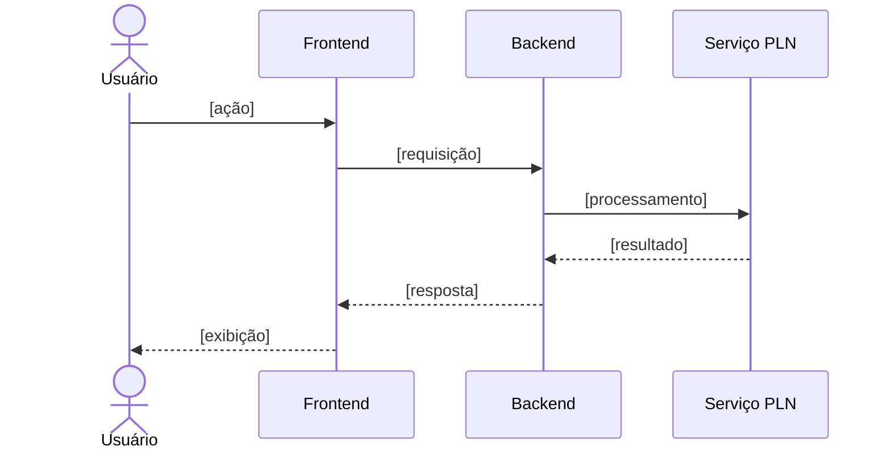

<p align='center'>
  <a href='https://www.inteli.edu.br/'>
    
  </a>
</p>

---

## Projeto: Azum


## Sumário

<details>
<summary><strong>1. Entendimento de Negócio</strong></summary>

- [1.1 Problema](#11-problema)
- [1.2 Contexto da Indústria do Parceiro](#12-contexto-da-indústria-do-parceiro)
- [1.3 Visão do Produto](#13-visão-do-produto)
- [1.4 Objetivo do Produto](#14-objetivo-do-produto)
- [1.5 Personas e Jornada do Usuário](#15-personas-e-jornada-do-usuário)
- [1.6 Fluxo do Negócio](#16-fluxo-do-negócio)
- [1.7 Brainstorming de Features](#17-brainstorming-de-features)
- [1.8 Canvas do MVP](#18-canvas-do-mvp)
- [1.9 Matriz de Risco do Projeto](#19-matriz-de-risco-do-projeto)

</details>

<details>
<summary><strong>2. Especificação de Requisitos de Software (Sprint 1)</strong></summary>

- [2.1 Business Drivers](#21-business-drivers)
- [2.2 Requisitos Funcionais](#22-requisitos-funcionais)
- [2.3 Requisitos Não Funcionais](#23-requisitos-não-funcionais)
- [2.4 Visão Inicial da Solução Técnica](#24-visão-inicial-da-solução-técnica)
- [2.5 Tecnologias e Ferramentas](#25-tecnologias-e-ferramentas)

</details>

- [3. Registro de Decisões](#3-registro-de-decisões)

---

# 1. Entendimento de Negócio

## 1.1 Problema


**Impacto sobre o parceiro:** [...]

**Impacto sobre o setor:** [...]

### Matriz SWOT


---

## 1.2 Contexto da Indústria do Parceiro

### Visão geral do setor


### Tendências e desafios

- **Tendência 1:** [...]
- **Tendência 2:** [...]
- **Desafio 1:** [...]
- **Desafio 2:** [...]

### Posicionamento do parceiro no mercado


---

## 1.3 Visão do Produto

### Descrição geral


### O que o produto FAZ (escopo)

| # | Funcionalidade | Descrição |
|---|---|---|
| 1 | [Funcionalidade] | [Descrição breve] |
| 2 | [Funcionalidade] | [Descrição breve] |
| 3 | [Funcionalidade] | [Descrição breve] |

### O que o produto NÃO FAZ (fora de escopo)

| # | Item fora do escopo | Justificativa |
|---|---|---|
| 1 | [Limitação] | [Por que está fora do escopo] |
| 2 | [Limitação] | [Por que está fora do escopo] |

---

## 1.4 Objetivo do Produto


**Objetivo geral:** 

**Objetivos específicos:**

1. [Objetivo mensurável 1]


---

## 1.5 Personas e Jornada do Usuário

### Persona 1: [Nome fictício]


### Jornada do Usuário — [Persona X]


---

## 1.6 Fluxo do Negócio

### Cadeia de valor

<!-- Modelagem da cadeia de valor dos processos relacionados ao contexto do projeto. -->


[Descrição da cadeia de valor...]

### Fluxo principal (BPMN)

<!-- Diagrama BPMN do fluxo principal. Ferramentas sugeridas: Bizagi, draw.io, Camunda Modeler. -->


**Descrição do processo:**

1. **[Atividade 1]:** [descrição]
2. **[Atividade 2]:** [descrição]
3. **[Gateway/decisão]:** [condições e caminhos]
4. **[Atividade final]:** [descrição]

---

## 1.7 Brainstorming de Features

### Ideias levantadas


| # | Feature | Origem (grupo/parceiro) | Descrição |
|---|---|---|---|
| F01 | [Feature] | [Grupo] | [...] |
| F02 | [Feature] | [Parceiro] | [...] |
| F03 | [Feature] | [Grupo] | [...] |

### Priorização


**Critério de priorização:** [ex.: Importância (1-5) × Viabilidade (1-5)]

| Prioridade | Feature | Importância | Viabilidade | Score | Entra no MVP? |
|---|---|---|---|---|---|
| 1º | [F0X] | 5 | 5 | 25 | ✅ Sim |
| 2º | [F0X] | 4 | 5 | 20 | ✅ Sim |
| 3º | [F0X] | 5 | 2 | 10 | ❌ Futuro |

---

## 1.8 Canvas do MVP

<!-- Preencha o MVP Canvas (Paulo Caroli) ou estrutura equivalente. -->


| Bloco | Conteúdo |
|---|---|
| **Proposta do MVP** | [O que é a versão mínima e viável] |
| **Segmento de personas** | [Para quem é este MVP] |
| **Jornadas atendidas** | [Quais jornadas o MVP cobre] |
| **Funcionalidades** | [Features incluídas no recorte] |
| **Resultado esperado** | [Aprendizado/valor que se espera obter] |
| **Métricas para validar** | [Como saber se o MVP funcionou] |
| **Custo e cronograma** | [Estimativa de esforço e prazo] |

**Justificativa do recorte:** [Por que essas features e não outras.]

---

## 1.9 Matriz de Risco do Projeto

### Critérios de avaliação

- **Escala de probabilidade:** 1 (muito baixa) a 5 (muito alta)
- **Escala de impacto:** 1 (muito baixo) a 5 (muito alto)
- **Severidade:** Probabilidade × Impacto
- **Faixas de criticidade:**
  - 🟢 Baixa: 1–6
  - 🟡 Média: 8–12
  - 🔴 Alta: 15–25

### Registro de riscos


### Matriz Probabilidade × Impacto


# 2. Especificação de Requisitos de Software (Sprint 1)

## 2.1 Business Drivers

### Contexto da aplicação

Conforme detalhado na seção 1.1, a gestão do portfólio do Metrô depende hoje de ações manuais para a obtenção de status, a consolidação de documentos e o acompanhamento de pendências. Do ponto de vista computacional, a aplicação de Processamento de Linguagem Natural transforma esse cenário ao substituir a navegação manual por listas e documentos por uma interação direta em linguagem natural, na qual o usuário formula sua solicitação por texto ou por voz e recebe uma resposta já estruturada, rastreável até sua fonte original e adequada ao seu nível de permissão.

Essa transformação depende de duas capacidades transversais, exigidas por ambos os fluxos descritos a seguir: um canal de entrada que processe texto e áudio de forma equivalente, exibindo a transcrição para conferência quando a entrada ocorrer por voz e um mecanismo de classificação capaz de reconhecer toda solicitação dentro de um catálogo de intenções definido com o parceiro, recusando pedidos fora do escopo do portfólio antes mesmo de consultar as fontes de dados.

### Fluxo de negócio 1: Consulta e análise comparativa de projetos

- **Situação atual (AS-IS):** conforme mapeado no fluxo de negócio (seção 1.6), a consulta e a comparação entre projetos hoje dependem de navegação manual pelas listas do SharePoint e de consolidação visual dos dados, processo sujeito a erros de interpretação e que se torna mais custoso quando envolve cruzar informações de portfólio com indicadores estratégicos.

- **Situação proposta (TO-BE):** o usuário formula sua solicitação diretamente em linguagem natural, como por exemplo: "qual o status do projeto X?" ou "compare os projetos X e Y em relação a prazo e riscos", e o sistema retorna os indicadores solicitados já filtrados conforme seu nível de permissão, acompanhados da fonte e da data de apuração de cada dado. Quando a solicitação for ambígua, o sistema solicita esclarecimento apenas sobre o dado faltante, preservando o que já foi informado.

- **Indicadores computacionais:**
  - ***Precisão da classificação de intenção:*** razão entre o número de solicitações corretamente classificadas dentro do catálogo de intenções e o número total de solicitações recebidas no conjunto de teste.
  - ***Taxa de acerto na extração de entidades:*** razão entre o número de entidades corretamente extraídas (nome do projeto, período de referência, indicador solicitado) e o número total de entidades presentes nas solicitações do conjunto de teste.
  - ***Taxa de correspondência entre entidade extraída e registro correto:*** razão entre o número de consultas em que a entidade extraída foi corretamente associada ao registro correspondente no portfólio (ex.: nome do projeto vinculado ao item correto da lista) e o número total de consultas do conjunto de teste, avaliando o desempenho do PLN na etapa de recuperação do dado, e não apenas na extração textual da entidade.

### Fluxo de negócio 2: Apoio proativo ao preenchimento e acompanhamento de pendências

- **Situação atual (AS-IS):** conforme mapeado no fluxo de negócio (seção 1.6), o acompanhamento de pendências depende hoje da cobrança manual do PMO junto a cada responsável antes do prazo mensal, sem qualquer apoio automatizado ao preenchimento de documentos como termo de abertura, cronograma e mapa de benefícios.

- **Situação proposta (TO-BE):** o sistema sugere textos para os campos pendentes a partir da interação com o usuário, mantendo o controle humano sobre o que é efetivamente registrado, e notifica proativamente o PMO sobre marcos, riscos e pendências conforme filtros configurados, sem repetir alertas já enviados.

- **Indicadores computacionais:**
  - ***Taxa de acerto na extração de entidades:*** razão entre o número de entidades corretamente extraídas da fala ou do texto do usuário (campo a ser atualizado, valor sugerido) e o número total de entidades presentes nas interações do conjunto de teste.
  - ***Precisão na detecção de alertas:*** razão entre o número de marcos, riscos e pendências corretamente identificados como elegíveis para alerta, conforme os filtros configurados, e o número total de alertas gerados pelo sistema no período avaliado.
  - ***Taxa de erro na conversão de áudio em texto (WER - Word Error Rate):*** razão entre a soma das substituições, inserções e exclusões de palavras identificadas na transcrição e o número total de palavras do áudio de referência.

---

## 2.2 Requisitos Funcionais

### Histórias de usuário

<!-- Formato: Como [persona], quero [ação] para [benefício].
     Inclua critérios de aceitação testáveis. -->

#### RF01 — [Título da história]

> **Como** [persona], **quero** [ação/funcionalidade], **para** [benefício/valor].

**Critérios de aceitação:**
- [ ] [Critério 1]
- [ ] [Critério 2]

**Prioridade:** [Alta/Média/Baixa] · **Persona relacionada:** [Persona X]

#### RF02 — [Título da história]

> **Como** [persona], **quero** [ação], **para** [benefício].

**Critérios de aceitação:**
- [ ] [Critério 1]
- [ ] [Critério 2]

<!-- Repita para cada requisito funcional. -->

### Modelagem estática — Diagrama de classes do domínio

<!-- Classes e atributos do domínio, coerentes com as histórias acima. -->


```mermaid
classDiagram
    class Usuario {
        +id: UUID
        +nome: String
        +email: String
    }
    class [EntidadeDominio] {
        +atributo1: Tipo
        +atributo2: Tipo
    }
    Usuario "1" --> "*" [EntidadeDominio] : possui
```

**Descrição das classes:**

| Classe | Responsabilidade | Relacionamentos |
|---|---|---|
| Usuario | [...] | [...] |
| [Entidade] | [...] | [...] |

### Modelagem dinâmica — Cenários e diagramas de sequência

#### Cenário 1: [Nome do cenário — relacionado ao RF0X]

**Descrição:** [Fluxo passo a passo do cenário.]




<!-- Repita para os demais cenários. Garanta coerência: cada diagrama
     deve corresponder a uma história de usuário e usar as classes do domínio. -->

---

## 2.3 Requisitos Não Funcionais

<!-- Mínimo de 2 RNFs, derivados dos business drivers,
     descritos como histórias de usuário e coerentes com os RFs. -->

#### RNF01 — [Categoria: ex. Desempenho]

> **Como** [persona], **quero** [qualidade do sistema, ex.: receber a resposta em até X segundos], **para** [benefício].

- **Business driver relacionado:** [Fluxo 1/2]
- **Métrica de verificação:** [como será medido]
- **Critério de aceitação:** [valor-alvo]

#### RNF02 — [Categoria: ex. Acurácia do modelo]

> **Como** [persona], **quero** [ex.: que a classificação por tags tenha precisão ≥ X%], **para** [benefício].

- **Business driver relacionado:** [...]
- **Métrica de verificação:** [...]
- **Critério de aceitação:** [...]

---

## 2.4 Visão Inicial da Solução Técnica

<!-- OBRIGATÓRIO: diagrama UML de componentes ou de pacotes.
     Esboço em blocos conectados cobrindo as 3 camadas:
     interface humano-computador, lógica de negócio, acesso a dados/serviços. -->

### Diagrama de componentes (UML)


### Descrição das camadas

| Camada | Componentes | Responsabilidade |
|---|---|---|
| **Interface (IHC)** | [ex.: Web App, Chat UI] | [...] |
| **Lógica de negócio** | [ex.: API, Serviço de PLN, Orquestrador] | [...] |
| **Dados e serviços** | [ex.: Banco de dados, APIs externas, storage] | [...] |

### Conexões entre componentes

- **[Componente A] → [Componente B]:** [protocolo/motivo da conexão, ex.: REST/JSON]
- **[Componente B] → [Componente C]:** [...]

---

## 2.5 Tecnologias e Ferramentas

<!-- Estimativa inicial — pode ser revisada nas próximas sprints. -->

| Categoria | Tecnologia/Ferramenta | Justificativa |
|---|---|---|
| Linguagem (backend) | [ex.: Python 3.12] | [...] |
| Framework (backend) | [ex.: FastAPI] | [...] |
| Frontend | [ex.: React] | [...] |
| PLN / IA | [ex.: spaCy, Hugging Face, API de LLM] | [...] |
| Banco de dados | [ex.: PostgreSQL] | [...] |
| Infraestrutura | [ex.: Docker, AWS] | [...] |
| Versionamento | [ex.: Git + GitHub] | [...] |
| Gestão do projeto | [ex.: GitHub Projects] | [...] |
| Modelagem | [ex.: draw.io, Mermaid, Bizagi] | [...] |

---

# 3. Registro de Decisões

<!-- Registre as decisões mais relevantes tomadas pelo grupo. -->

| # | Data | Decisão | Alternativas consideradas | Justificativa |
|---|---|---|---|---|
| D01 | [DD/MM] | [...] | [...] | [...] |
| D02 | [DD/MM] | [...] | [...] | [...] |
