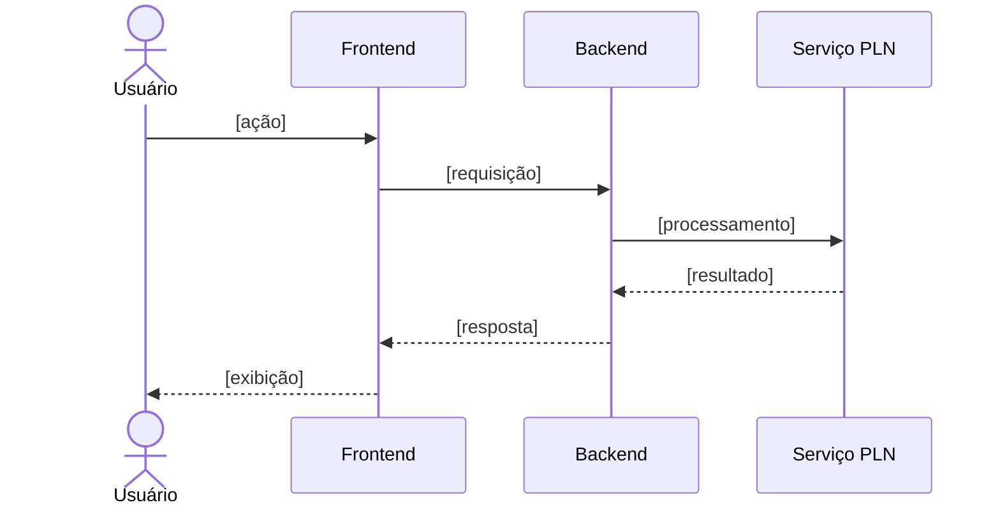

<p align='center'>
  <a href='https://www.inteli.edu.br/'>
    
  </a>
</p>

---

## Projeto: Azum


## Sumário

<details>
<summary><strong>1. Entendimento de Negócio</strong></summary>

- [1.1 Problema](#11-problema)
- [1.2 Contexto da Indústria do Parceiro](#12-contexto-da-indústria-do-parceiro)
- [1.3 Visão do Produto](#13-visão-do-produto)
- [1.4 Objetivo do Produto](#14-objetivo-do-produto)
- [1.5 Personas e Jornada do Usuário](#15-personas-e-jornada-do-usuário)
- [1.6 Fluxo do Negócio](#16-fluxo-do-negócio)
- [1.7 Brainstorming de Features](#17-brainstorming-de-features)
- [1.8 Canvas do MVP](#18-canvas-do-mvp)
- [1.9 Matriz de Risco do Projeto](#19-matriz-de-risco-do-projeto)

</details>

<details>
<summary><strong>2. Especificação de Requisitos de Software (Sprint 1)</strong></summary>

- [2.1 Business Drivers](#21-business-drivers)
- [2.2 Requisitos Funcionais](#22-requisitos-funcionais)
- [2.3 Requisitos Não Funcionais](#23-requisitos-não-funcionais)
- [2.4 Visão Inicial da Solução Técnica](#24-visão-inicial-da-solução-técnica)
- [2.5 Tecnologias e Ferramentas](#25-tecnologias-e-ferramentas)

</details>

- [3. Registro de Decisões](#3-registro-de-decisões)

---

# 1. Entendimento de Negócio

## 1.1 Problema


**Impacto sobre o parceiro:** [...]

**Impacto sobre o setor:** [...]

### Matriz SWOT


---

## 1.2 Contexto da Indústria do Parceiro

### Visão geral do setor


### Tendências e desafios

- **Tendência 1:** [...]
- **Tendência 2:** [...]
- **Desafio 1:** [...]
- **Desafio 2:** [...]

### Posicionamento do parceiro no mercado


---

## 1.3 Visão do Produto

### Descrição geral


### O que o produto FAZ (escopo)

| # | Funcionalidade | Descrição |
|---|---|---|
| 1 | [Funcionalidade] | [Descrição breve] |
| 2 | [Funcionalidade] | [Descrição breve] |
| 3 | [Funcionalidade] | [Descrição breve] |

### O que o produto NÃO FAZ (fora de escopo)

| # | Item fora do escopo | Justificativa |
|---|---|---|
| 1 | [Limitação] | [Por que está fora do escopo] |
| 2 | [Limitação] | [Por que está fora do escopo] |

---

## 1.4 Objetivo do Produto


**Objetivo geral:** 

**Objetivos específicos:**

1. [Objetivo mensurável 1]


---

## 1.5 Personas e Jornada do Usuário

### Persona 1: Robson Oliveira — Diretor

<div align="center">
<sub>Imagem 1.5 - Persona 1: Robson Oliveira — Diretor</sub><br>
  <br>
  <sup>Fonte: Material produzido pelos autores, 2026.</sup>
</div>

#### Caracterização

Robson Oliveira é diretor e acompanha projetos estratégicos do Metrô, tendo como uma de suas principais responsabilidades tomar decisões relacionadas ao andamento e aos resultados das iniciativas sob sua gestão. Para isso, precisa ter uma visão ampla dos projetos, acompanhando informações como status, indicadores, riscos, prazos e marcos.

Sua rotina envolve lidar com informações provenientes de diferentes projetos, documentos e sistemas. Nesse contexto, o acesso rápido e confiável aos dados é importante para que consiga compreender a situação dos projetos e identificar possíveis impactos para a organização.

#### Dores

Uma das principais dificuldades de Robson é encontrar informações distribuídas entre diferentes documentos e sistemas. A necessidade de consultar diferentes fontes pode tornar a busca por informações atualizadas mais demorada, principalmente quando é necessário obter uma visão geral do portfólio.

Outra dificuldade está na comparação entre projetos. Sem uma forma centralizada de consultar e relacionar as informações, pode ser mais difícil identificar semelhanças, diferenças, riscos e situações que mereçam atenção.

#### Interesses no Sistema

Robson tem interesse em consultar rapidamente o status e os indicadores dos projetos, obtendo uma visão geral do andamento das iniciativas. Também busca acompanhar riscos, prazos e marcos, de forma a identificar possíveis impactos para a organização com antecedência.

Além disso, tem interesse em comparar diferentes projetos do portfólio, utilizando essas informações como apoio para suas decisões estratégicas. Por ocupar uma posição de nível executivo, seu foco está menos nos detalhes operacionais de cada projeto e mais em uma visão consolidada e confiável que oriente suas decisões.

#### Expectativas em relação à solução

Robson espera conseguir consultar as informações dos projetos de maneira simples e rápida, sem precisar realizar buscas manuais em diferentes documentos e sistemas. Também espera que as informações apresentadas sejam organizadas e contextualizadas de acordo com o projeto consultado.

A possibilidade de realizar consultas utilizando linguagem natural, por texto ou voz, facilita a interação com a solução e permite que o usuário formule perguntas de acordo com a necessidade do momento.

#### Relação da persona com o produto

A persona de Robson representa o **Diretor**, que utiliza o agente para obter uma visão estratégica e consolidada do portfólio de projetos. Seu papel é acompanhar o desempenho geral das iniciativas, identificar riscos, avanços e possíveis impactos para a organização, utilizando essas informações como apoio à tomada de decisões. O Diretor utiliza a solução principalmente para **obter uma visão estratégica do conjunto de projetos e apoiar decisões de nível executivo**.

### Jornada do Usuário 1.5.1 — [Robson Oliveira - Diretor]

<div align="center">
<sub>Imagem 1.5.1 - Jornada do Usuário — Robson Oliveira, Diretor</sub><br>
  <br>
  <sup>Fonte: Material produzido pelos autores, 2026.</sup>
</div>


---

## 1.6 Fluxo do Negócio

### Cadeia de valor

<!-- Modelagem da cadeia de valor dos processos relacionados ao contexto do projeto. -->


[Descrição da cadeia de valor...]

### Fluxo principal (BPMN)

<!-- Diagrama BPMN do fluxo principal. Ferramentas sugeridas: Bizagi, draw.io, Camunda Modeler. -->


**Descrição do processo:**

1. **[Atividade 1]:** [descrição]
2. **[Atividade 2]:** [descrição]
3. **[Gateway/decisão]:** [condições e caminhos]
4. **[Atividade final]:** [descrição]

---

## 1.7 Brainstorming de Features

### Ideias levantadas


| # | Feature | Origem (grupo/parceiro) | Descrição |
|---|---|---|---|
| F01 | [Feature] | [Grupo] | [...] |
| F02 | [Feature] | [Parceiro] | [...] |
| F03 | [Feature] | [Grupo] | [...] |

### Priorização


**Critério de priorização:** [ex.: Importância (1-5) × Viabilidade (1-5)]

| Prioridade | Feature | Importância | Viabilidade | Score | Entra no MVP? |
|---|---|---|---|---|---|
| 1º | [F0X] | 5 | 5 | 25 | ✅ Sim |
| 2º | [F0X] | 4 | 5 | 20 | ✅ Sim |
| 3º | [F0X] | 5 | 2 | 10 | ❌ Futuro |

---

## 1.8 Canvas do MVP

<!-- Preencha o MVP Canvas (Paulo Caroli) ou estrutura equivalente. -->


| Bloco | Conteúdo |
|---|---|
| **Proposta do MVP** | [O que é a versão mínima e viável] |
| **Segmento de personas** | [Para quem é este MVP] |
| **Jornadas atendidas** | [Quais jornadas o MVP cobre] |
| **Funcionalidades** | [Features incluídas no recorte] |
| **Resultado esperado** | [Aprendizado/valor que se espera obter] |
| **Métricas para validar** | [Como saber se o MVP funcionou] |
| **Custo e cronograma** | [Estimativa de esforço e prazo] |

**Justificativa do recorte:** [Por que essas features e não outras.]

---

## 1.9 Matriz de Risco do Projeto

### Critérios de avaliação

- **Escala de probabilidade:** 1 (muito baixa) a 5 (muito alta)
- **Escala de impacto:** 1 (muito baixo) a 5 (muito alto)
- **Severidade:** Probabilidade × Impacto
- **Faixas de criticidade:**
  - 🟢 Baixa: 1–6
  - 🟡 Média: 8–12
  - 🔴 Alta: 15–25

### Registro de riscos


### Matriz Probabilidade × Impacto


# 2. Especificação de Requisitos de Software (Sprint 1)

## 2.1 Business Drivers


### Contexto da aplicação

[Como o processamento de linguagem natural transforma o negócio do parceiro...]

### Fluxo de negócio 1: [Nome do fluxo]

- **Situação atual (AS-IS):** [como funciona hoje]
- **Situação proposta (TO-BE):** [como funcionará com a solução]
- **Indicadores computacionais:** [ex.: precisão da classificação por tags ≥ X%, taxa de acerto de intenção, WER na conversão áudio→texto, latência de resposta...]

### Fluxo de negócio 2: [Nome do fluxo]

- **Situação atual (AS-IS):** [...]
- **Situação proposta (TO-BE):** [...]
- **Indicadores computacionais:** [...]

---

## 2.2 Requisitos Funcionais

### Histórias de usuário

<!-- Formato: Como [persona], quero [ação] para [benefício].
     Inclua critérios de aceitação testáveis. -->

#### RF01 — [Título da história]

> **Como** [persona], **quero** [ação/funcionalidade], **para** [benefício/valor].

**Critérios de aceitação:**
- [ ] [Critério 1]
- [ ] [Critério 2]

**Prioridade:** [Alta/Média/Baixa] · **Persona relacionada:** [Persona X]

#### RF02 — [Título da história]

> **Como** [persona], **quero** [ação], **para** [benefício].

**Critérios de aceitação:**
- [ ] [Critério 1]
- [ ] [Critério 2]

<!-- Repita para cada requisito funcional. -->

### Modelagem estática — Diagrama de classes do domínio

<!-- Classes e atributos do domínio, coerentes com as histórias acima. -->


```mermaid
classDiagram
    class Usuario {
        +id: UUID
        +nome: String
        +email: String
    }
    class [EntidadeDominio] {
        +atributo1: Tipo
        +atributo2: Tipo
    }
    Usuario "1" --> "*" [EntidadeDominio] : possui
```

**Descrição das classes:**

| Classe | Responsabilidade | Relacionamentos |
|---|---|---|
| Usuario | [...] | [...] |
| [Entidade] | [...] | [...] |

### Modelagem dinâmica — Cenários e diagramas de sequência

#### Cenário 1: [Nome do cenário — relacionado ao RF0X]

**Descrição:** [Fluxo passo a passo do cenário.]




<!-- Repita para os demais cenários. Garanta coerência: cada diagrama
     deve corresponder a uma história de usuário e usar as classes do domínio. -->

---

## 2.3 Requisitos Não Funcionais

<!-- Mínimo de 2 RNFs, derivados dos business drivers,
     descritos como histórias de usuário e coerentes com os RFs. -->

#### RNF01 — [Categoria: ex. Desempenho]

> **Como** [persona], **quero** [qualidade do sistema, ex.: receber a resposta em até X segundos], **para** [benefício].

- **Business driver relacionado:** [Fluxo 1/2]
- **Métrica de verificação:** [como será medido]
- **Critério de aceitação:** [valor-alvo]

#### RNF02 — [Categoria: ex. Acurácia do modelo]

> **Como** [persona], **quero** [ex.: que a classificação por tags tenha precisão ≥ X%], **para** [benefício].

- **Business driver relacionado:** [...]
- **Métrica de verificação:** [...]
- **Critério de aceitação:** [...]

---

## 2.4 Visão Inicial da Solução Técnica

<!-- OBRIGATÓRIO: diagrama UML de componentes ou de pacotes.
     Esboço em blocos conectados cobrindo as 3 camadas:
     interface humano-computador, lógica de negócio, acesso a dados/serviços. -->

### Diagrama de componentes (UML)


### Descrição das camadas

| Camada | Componentes | Responsabilidade |
|---|---|---|
| **Interface (IHC)** | [ex.: Web App, Chat UI] | [...] |
| **Lógica de negócio** | [ex.: API, Serviço de PLN, Orquestrador] | [...] |
| **Dados e serviços** | [ex.: Banco de dados, APIs externas, storage] | [...] |

### Conexões entre componentes

- **[Componente A] → [Componente B]:** [protocolo/motivo da conexão, ex.: REST/JSON]
- **[Componente B] → [Componente C]:** [...]

---

## 2.5 Tecnologias e Ferramentas

<!-- Estimativa inicial — pode ser revisada nas próximas sprints. -->

| Categoria | Tecnologia/Ferramenta | Justificativa |
|---|---|---|
| Linguagem (backend) | [ex.: Python 3.12] | [...] |
| Framework (backend) | [ex.: FastAPI] | [...] |
| Frontend | [ex.: React] | [...] |
| PLN / IA | [ex.: spaCy, Hugging Face, API de LLM] | [...] |
| Banco de dados | [ex.: PostgreSQL] | [...] |
| Infraestrutura | [ex.: Docker, AWS] | [...] |
| Versionamento | [ex.: Git + GitHub] | [...] |
| Gestão do projeto | [ex.: GitHub Projects] | [...] |
| Modelagem | [ex.: draw.io, Mermaid, Bizagi] | [...] |

---

# 3. Registro de Decisões

<!-- Registre as decisões mais relevantes tomadas pelo grupo. -->

| # | Data | Decisão | Alternativas consideradas | Justificativa |
|---|---|---|---|---|
| D01 | [DD/MM] | [...] | [...] | [...] |
| D02 | [DD/MM] | [...] | [...] | [...] |
