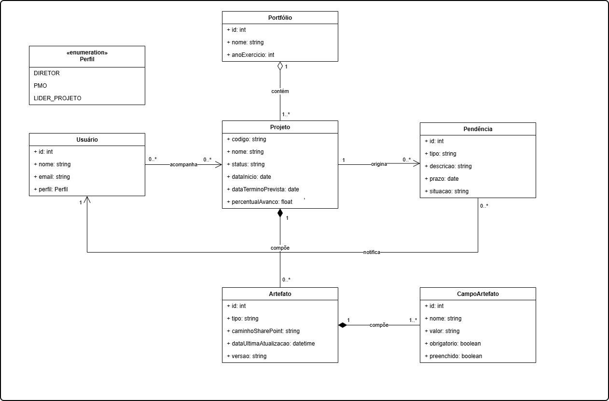
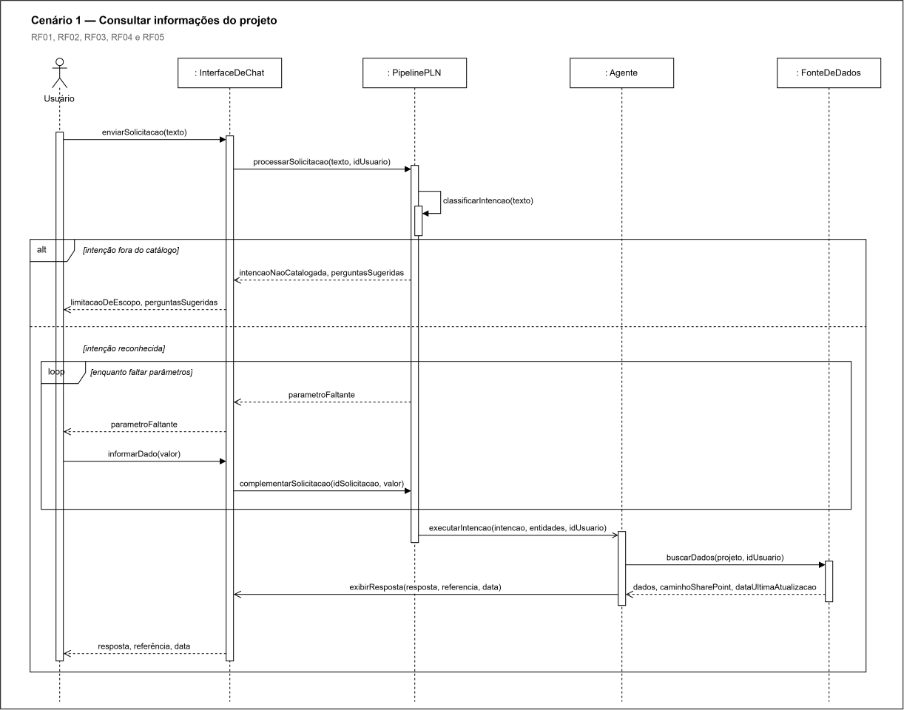
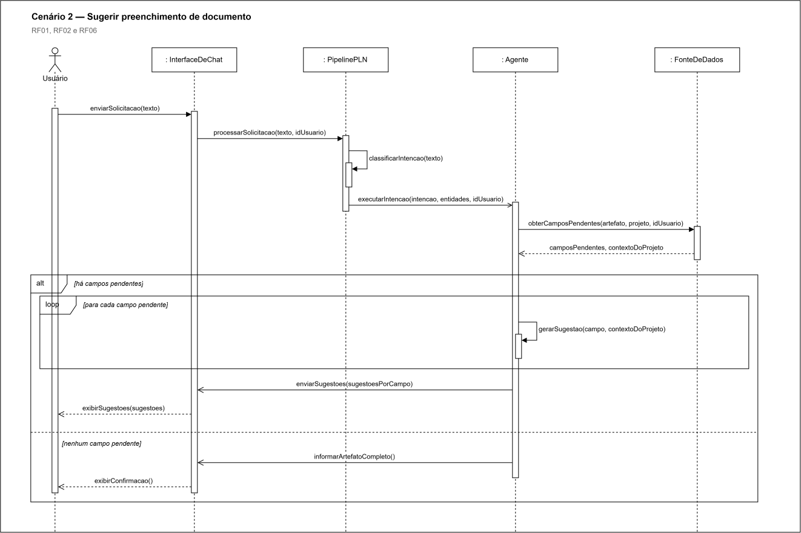

  

---

## Projeto: Azum

## Sumário

<strong>1. Entendimento de Negócio</strong>

- [1.1 Problema](#11-problema)
- [1.2 Contexto da Indústria do Parceiro](#12-contexto-da-indústria-do-parceiro)
- [1.3 Visão do Produto](#13-visão-do-produto)
- [1.4 Objetivo do Produto](#14-objetivo-do-produto)
- [1.5 Personas e Jornada do Usuário](#15-personas-e-jornada-do-usuário)
- [1.6 Fluxo do Negócio](#16-fluxo-do-negócio)
- [1.7 Brainstorming de Features](#17-brainstorming-de-features)
- [1.8 Canvas do MVP](#18-canvas-do-mvp)
- [1.9 Matriz de Risco do Projeto](#19-matriz-de-risco-do-projeto)

<strong>2. Especificação de Requisitos de Software (Sprint 1)</strong>

- [2.1 Business Drivers](#21-business-drivers)
- [2.2 Requisitos Funcionais](#22-requisitos-funcionais)
- [2.3 Requisitos Não Funcionais](#23-requisitos-não-funcionais)
- [2.4 Visão Inicial da Solução Técnica](#24-visão-inicial-da-solução-técnica)
- [2.5 Tecnologias e Ferramentas](#25-tecnologias-e-ferramentas)

- [3. Registro de Decisões](#3-registro-de-decisões)

---

# 1. Entendimento de Negócio

## 1.1 Problema

**Impacto sobre o parceiro:** [...]

**Impacto sobre o setor:** [...]

### Matriz SWOT

---

## 1.2 Contexto da Indústria do Parceiro

### Visão geral do setor

### Tendências e desafios

- **Tendência 1:** [...]
- **Tendência 2:** [...]
- **Desafio 1:** [...]
- **Desafio 2:** [...]

### Posicionamento do parceiro no mercado

---

## 1.3 Visão do Produto

### Descrição geral

### O que o produto FAZ (escopo)

| # | Funcionalidade | Descrição |
|---|---|---|
| 1 | [Funcionalidade] | [Descrição breve] |
| 2 | [Funcionalidade] | [Descrição breve] |
| 3 | [Funcionalidade] | [Descrição breve] |

### O que o produto NÃO FAZ (fora de escopo)

| # | Item fora do escopo | Justificativa |
|---|---|---|
| 1 | [Limitação] | [Por que está fora do escopo] |
| 2 | [Limitação] | [Por que está fora do escopo] |

---

## 1.4 Objetivo do Produto

**Objetivo geral:** 

**Objetivos específicos:**

1. [Objetivo mensurável 1]

---

## 1.5 Personas e Jornada do Usuário

### Persona 1: [Nome fictício]

### Jornada do Usuário: [Persona X]

---

## 1.6 Fluxo do Negócio

### Cadeia de valor

<!-- Modelagem da cadeia de valor dos processos relacionados ao contexto do projeto. -->

[Descrição da cadeia de valor...]

### Fluxo principal (BPMN)

<!-- Diagrama BPMN do fluxo principal. Ferramentas sugeridas: Bizagi, draw.io, Camunda Modeler. -->

**Descrição do processo:**

1. **[Atividade 1]:** [descrição]
2. **[Atividade 2]:** [descrição]
3. **[Gateway/decisão]:** [condições e caminhos]
4. **[Atividade final]:** [descrição]

---

## 1.7 Brainstorming de Features

### Ideias levantadas

| # | Feature | Origem (grupo/parceiro) | Descrição |
|---|---|---|---|
| F01 | [Feature] | [Grupo] | [...] |
| F02 | [Feature] | [Parceiro] | [...] |
| F03 | [Feature] | [Grupo] | [...] |

### Priorização

**Critério de priorização:** [por exemplo, Importância (1 a 5) × Viabilidade (1 a 5)]

| Prioridade | Feature | Importância | Viabilidade | Score | Entra no MVP? |
|---|---|---|---|---|---|
| 1º | [F0X] | 5 | 5 | 25 | Sim |
| 2º | [F0X] | 4 | 5 | 20 | Sim |
| 3º | [F0X] | 5 | 2 | 10 | Futuro |

---

## 1.8 Canvas do MVP

<!-- Preencha o MVP Canvas (Paulo Caroli) ou estrutura equivalente. -->

| Bloco | Conteúdo |
|---|---|
| **Proposta do MVP** | [O que é a versão mínima e viável] |
| **Segmento de personas** | [Para quem é este MVP] |
| **Jornadas atendidas** | [Quais jornadas o MVP cobre] |
| **Funcionalidades** | [Features incluídas no recorte] |
| **Resultado esperado** | [Aprendizado/valor que se espera obter] |
| **Métricas para validar** | [Como saber se o MVP funcionou] |
| **Custo e cronograma** | [Estimativa de esforço e prazo] |

**Justificativa do recorte:** [Por que essas features e não outras.]

---

## 1.9 Matriz de Risco do Projeto

### Critérios de avaliação

- **Escala de probabilidade:** 1 (muito baixa) a 5 (muito alta)
- **Escala de impacto:** 1 (muito baixo) a 5 (muito alto)
- **Severidade:** Probabilidade × Impacto
- **Faixas de criticidade:**
  - Baixa: 1 a 6
  - Média: 8 a 12
  - Alta: 15 a 25

### Registro de riscos

### Matriz Probabilidade × Impacto

# 2. Especificação de Requisitos de Software (Sprint 1)

## 2.1 Business Drivers

### Contexto da aplicação

[Como o processamento de linguagem natural transforma o negócio do parceiro...]

### Fluxo de negócio 1: [Nome do fluxo]

- **Situação atual (AS-IS):** [como funciona hoje]
- **Situação proposta (TO-BE):** [como funcionará com a solução]
- **Indicadores computacionais:** [ex.: precisão da classificação por tags ≥ X%, taxa de acerto de intenção, WER na conversão áudio para texto, latência de resposta...]

### Fluxo de negócio 2: [Nome do fluxo]

- **Situação atual (AS-IS):** [...]
- **Situação proposta (TO-BE):** [...]
- **Indicadores computacionais:** [...]

---

## 2.2 Requisitos Funcionais

### Visão geral dos requisitos funcionais

| ID e título | User story | Critério de aceitação | Prioridade |
|---|---|---|---|
| RF01: Interagir em linguagem natural por texto e voz | Como usuário do portfólio, quero enviar minhas solicitações por texto ou áudio, para obter informações sem precisar navegar por planilhas e documentos. | Ao receber uma solicitação por texto ou áudio, o sistema deve processá-la e responder no mesmo canal de interação. | Alta |
| RF02: Identificar e classificar intenções | Como usuário do portfólio, quero que o agente entenda o que estou pedindo e recuse pedidos fora do contexto do portfólio, para que minhas solicitações sejam atendidas corretamente e o uso permaneça dentro do escopo da empresa. | Ao receber uma solicitação, o sistema deve identificar sua intenção com base nas intenções catalogadas e, quando a solicitação estiver fora do contexto do portfólio, informar a limitação ao usuário sem consultar as fontes de dados. | Alta |
| RF03: Consultar dados de projetos | Como PMO, quero consultar dados de um projeto, para obter informações sobre seu status e acompanhamento sem precisar consultar manualmente os documentos do portfólio. | Ao receber uma solicitação sobre um projeto, o sistema deve consultar as fontes disponíveis e retornar os dados solicitados. | Alta |
| RF04: Apresentar a fonte da informação | Como diretor, quero saber de qual documento e de qual data veio cada resposta, para confiar na informação antes de tomar uma decisão. | Ao apresentar qualquer dado de negócio, o sistema deve exibir o documento de origem, o caminho de acesso no SharePoint e a data da última atualização, listando todas as fontes quando a resposta combinar mais de uma. | Alta |
| RF05: Solicitar esclarecimento em casos ambíguos | Como líder de projeto, quero que o agente me pergunte o que faltou quando meu pedido estiver incompleto ou ambíguo, para receber a resposta certa sem ter que reformular a solicitação inteira. | Ao receber uma solicitação incompleta ou ambígua, o sistema deve perguntar apenas o dado faltante e preservar o que já foi informado, em vez de responder com conteúdo não fundamentado. | Alta |
| RF06: Sugerir o preenchimento de documentos | Como líder de projeto, quero receber sugestões de texto para os campos pendentes dos meus documentos, para preencher o portfólio mais rápido mantendo o controle sobre o que é efetivamente gravado. | Ao solicitar apoio no preenchimento de um documento, o sistema deve apresentar no chat uma sugestão de texto para cada campo pendente, permitindo a cópia individual das sugestões e sem alterar o documento de origem. | Média |
| RF07: Notificar proativamente o usuário de pendências | Como usuário do portfólio, quero ser notificado quando tiver pendências relacionadas aos projetos que acompanho, para tomar as providências necessárias dentro do prazo. | Ao identificar uma nova pendência relacionada a um projeto acompanhado pelo usuário, o sistema deve notificá-lo automaticamente, informando o projeto e a pendência, sem exigir uma solicitação prévia do usuário. | Média |

### 2.2.1. Modelagem estática: classes e atributos do domínio

&emsp; A modelagem estática representa as entidades do domínio de gestão de portfólio do Metrô de São Paulo sobre as quais o agente atua. O modelo parte do Portfólio, que agrupa os projetos de um exercício, e desdobra cada projeto em três eixos: os artefatos que o documentam, as pendências que dele se originam e os usuários que o acompanham. Essa estrutura sustenta os três comportamentos previstos nos requisitos funcionais, que são consultar dados de projetos, sugerir o preenchimento de campos de artefatos e notificar pendências.

  FIGURA 2.1: modelagem estática (classes e atributos do domínio) 
   
  Fonte: material produzido pelos autores (2026).

**Descrição das classes:**

| Classe | Responsabilidade | RFs atendidos |
|---|---|---|
| Portfólio | Agrupa os projetos administrados pelo PMO Corporativo em um determinado exercício, delimitando o conjunto percorrido na verificação periódica de pendências | RF07 |
| Projeto | Representa o empreendimento acompanhado pelo PMO, concentrando os dados de identificação, situação e avanço consultados pelo agente | RF03, RF04, RF05, RF06, RF07 |
| Usuário | Representa o profissional que interage com o agente, com o perfil que determina seu papel e os projetos que acompanha | RF01, RF03, RF07 |
| Perfil | Enumeração que tipifica o usuário nos três papéis previstos, diferenciando o alcance da atuação de cada um sobre o portfólio | RF03, RF07 |
| Pendência | Representa um item em aberto originado por um projeto, com prazo e situação, que fundamenta a notificação proativa | RF07 |
| Artefato | Representa o documento do projeto hospedado no SharePoint, cujos metadados sustentam a indicação de fonte das respostas | RF04, RF06, RF07 |
| CampoArtefato | Representa um campo individual de um artefato, com o valor registrado e as marcações que identificam se ele está pendente de preenchimento | RF06, RF07 |

**Atributos por classe:**

| Classe | Atributo | Tipo | Finalidade no domínio |
|---|---|---|---|
| Portfólio | `id` | int | Identificador único do portfólio |
| Portfólio | `nome` | string | Denominação do portfólio |
| Portfólio | `anoExercicio` | int | Exercício ao qual o conjunto de projetos se refere |
| Projeto | `codigo` | string | Código institucional que identifica o empreendimento |
| Projeto | `nome` | string | Denominação do empreendimento |
| Projeto | `status` | string | Situação corrente do projeto, consultada no RF03 |
| Projeto | `dataInicio` | date | Data de início da execução |
| Projeto | `dataTerminoPrevista` | date | Data prevista de conclusão, base para a apuração de prazos |
| Projeto | `percentualAvanco` | float | Grau de execução física do projeto |
| Usuário | `id` | int | Identificador único do usuário |
| Usuário | `nome` | string | Nome do profissional |
| Usuário | `email` | string | Endereço corporativo utilizado no envio das notificações |
| Usuário | `perfil` | Perfil | Papel do usuário, restrito aos valores da enumeração |
| Pendência | `id` | int | Identificador único da pendência |
| Pendência | `tipo` | string | Natureza da pendência, como prazo, documento ou aprovação |
| Pendência | `descricao` | string | Detalhamento do item em aberto |
| Pendência | `prazo` | date | Data limite para tratamento, base da notificação do RF07 |
| Pendência | `situacao` | string | Estado corrente da pendência |
| Artefato | `id` | int | Identificador único do artefato |
| Artefato | `tipo` | string | Natureza do documento, como ata, relatório ou contrato |
| Artefato | `caminhoSharePoint` | string | Localização do documento, exibida como fonte no RF04 |
| Artefato | `dataUltimaAtualizacao` | datetime | Data da última alteração, exibida junto à fonte no RF04 |
| Artefato | `versao` | string | Versão vigente do documento |
| CampoArtefato | `id` | int | Identificador único do campo |
| CampoArtefato | `nome` | string | Rótulo do campo dentro do artefato |
| CampoArtefato | `valor` | string | Conteúdo atualmente registrado no campo |
| CampoArtefato | `obrigatorio` | boolean | Indica se o preenchimento do campo é exigido |
| CampoArtefato | `preenchido` | boolean | Indica se o campo já possui conteúdo |

&emsp; A combinação dos atributos `obrigatorio` e `preenchido` da classe CampoArtefato é o que permite determinar quais campos de um artefato estão pendentes, insumo direto da sugestão de preenchimento prevista no RF06. Da mesma forma, os atributos `caminhoSharePoint` e `dataUltimaAtualizacao` da classe Artefato são os que sustentam a exigência do RF04 de apresentar a origem e a data de cada informação devolvida pelo agente.

**Relacionamentos:**

| Origem | Relacionamento | Destino | Cardinalidade | Tipo |
|---|---|---|---|---|
| Portfólio | contém | Projeto | 1 para 1..* | Agregação |
| Projeto | compõe | Artefato | 1 para 0..* | Composição |
| Artefato | compõe | CampoArtefato | 1 para 1..* | Composição |
| Projeto | origina | Pendência | 1 para 0..* | Associação |
| Usuário | acompanha | Projeto | 0..* para 0..* | Associação |
| Pendência | notifica | Usuário | 0..* para 1 | Associação |

&emsp; A distinção entre agregação e composição é intencional. O Portfólio agrega Projetos porque um projeto mantém identidade própria e pode ser reagrupado em outro exercício sem deixar de existir. Já o Artefato compõe o Projeto e o CampoArtefato compõe o Artefato, porque nenhum dos dois faz sentido isoladamente: excluído o projeto, seus artefatos perdem o objeto que documentam, e excluído o artefato, seus campos perdem a estrutura que os define.

&emsp; A associação `acompanha`, com cardinalidade de muitos para muitos entre Usuário e Projeto, é o que viabiliza a personalização da notificação prevista no RF07. É por meio dela que o sistema determina quais pendências interessam a cada usuário, sem exigir uma configuração paralela de assinatura.

&emsp; A modelagem declara apenas classes e atributos, sem operações, por representar a estrutura de dados do domínio de portfólio. O comportamento do agente está representado na modelagem dinâmica desta seção e nos componentes da solução técnica descritos na seção 2.4.

### 2.2.2. Modelagem dinâmica: cenários e diagramas de sequência

&emsp; A modelagem dinâmica descreve como as classes declaradas na modelagem estática são percorridas durante a execução das solicitações previstas nos requisitos funcionais. Foram definidos três cenários que, em conjunto, cobrem os sete requisitos. Os dois primeiros são iniciados pelo usuário em linguagem natural e compartilham a mesma cadeia de tratamento da entrada, enquanto o terceiro é iniciado pelo próprio sistema, sem interação conversacional.

| Cenário | Descrição | Iniciador | RFs cobertos |
|---|---|---|---|
| Cenário 1 | Consultar informações do projeto | Usuário | RF01, RF02, RF03, RF04, RF05 |
| Cenário 2 | Sugerir preenchimento de documento | Usuário | RF01, RF02, RF06 |
| Cenário 3 | Notificar pendências | Agendador (sistema) | RF07 |

#### Linhas de vida adotadas

&emsp; Os três diagramas utilizam um conjunto comum de linhas de vida, de modo que a leitura de um cenário se aproveite do vocabulário do anterior. A tabela a seguir relaciona cada linha de vida ao seu papel e à sua correspondência na modelagem estática.

| Linha de vida | Papel nos cenários | Correspondência no modelo estático |
|---|---|---|
| Usuário | Ator que inicia a interação nos cenários 1 e 2 e recebe a notificação no cenário 3 | Classe `Usuário` |
| `: InterfaceDeChat` | Canal de entrada e saída das solicitações em linguagem natural | Componente de interface (seção 2.4) |
| `: PipelinePLN` | Classifica a intenção e extrai as entidades da solicitação | Componente de lógica de negócio (seção 2.4) |
| `: Agente` | Orquestra a execução da intenção, consulta as fontes e compõe a resposta | Componente de lógica de negócio (seção 2.4) |
| `: FonteDeDados` | Encapsula o acesso às entidades persistidas do domínio | `Portfólio`, `Projeto`, `Artefato`, `CampoArtefato`, `Pendência`, `Usuário` |
| `: ServicoDeNotificacao` | Entrega a notificação ao usuário pelo canal corporativo (exclusivo do cenário 3) | Componente de serviços (seção 2.4) |
| `: Agendador` | Dispara a verificação periódica de pendências (exclusivo do cenário 3) | Componente de lógica de negócio (seção 2.4) |

&emsp; As linhas de vida de componente adotam a sintaxe UML de instância anônima, no formato `: Classe`, enquanto o Usuário é identificado pelo nome do papel, por ser um ator e não uma instância de componente.

**Nota:** apenas a linha de vida Usuário e a linha de vida `: FonteDeDados` possuem contrapartida direta na modelagem estática. As demais representam componentes da solução técnica, e não entidades do domínio, coerentemente com a decisão de declarar o diagrama de classes sem operações.

#### Convenções de notação adotadas

&emsp; Os três diagramas empregam três tipos de mensagem, distinguidos graficamente e aplicados de forma uniforme. A tabela a seguir registra a convenção, necessária para a leitura correta dos fluxos apresentados adiante.

| Tipo de mensagem | Traço | Ponta da seta | Rótulo | Quando é usada |
|---|---|---|---|---|
| Síncrona | Linha contínua | Cheia | Assinatura com parênteses | Chamada em que o remetente aguarda a conclusão, como `buscarDados(projeto, idUsuario)` |
| Assíncrona | Linha contínua | Vazada | Assinatura com parênteses | Envio em que o remetente não aguarda retorno, como `executarIntencao(intencao, entidades, idUsuario)` e a entrega da notificação no cenário 3 |
| Retorno | Linha tracejada | Vazada | Dados devolvidos, sem parênteses | Resposta a uma chamada anterior, como `camposPendentes, contextoDoProjeto` |

&emsp; A distinção importa para a leitura das mensagens dirigidas ao ator. Nos cenários 1 e 2, o que chega ao Usuário é sempre um retorno da solicitação que ele mesmo iniciou, representado por linha tracejada com os dados devolvidos. No cenário 3, em que o Usuário nunca formula uma solicitação, a notificação é um envio assíncrono genuíno e por isso aparece como linha contínua com ponta vazada.

&emsp; A passagem do `: PipelinePLN` ao `: Agente` é assíncrona nos cenários 1 e 2 porque o pipeline entrega a intenção reconhecida e não permanece bloqueado à espera do resultado. Quem devolve a resposta ao usuário é o `: Agente`, por meio da `: InterfaceDeChat`, e não o pipeline que originou a chamada. Já as consultas à `: FonteDeDados` são síncronas, porque o `: Agente` depende do dado retornado para compor a resposta.

#### Cenário 1: consultar informações do projeto

&emsp; O cenário representa o fluxo mais frequente do agente, no qual o usuário formula uma pergunta sobre um projeto e recebe a resposta acompanhada da indicação de origem. É o cenário de maior alcance, por percorrer a cadeia completa de consulta, do recebimento da solicitação em linguagem natural (RF01) à devolução da resposta fundamentada (RF04), e por representar os dois desvios previstos: a recusa de pedidos fora do catálogo de intenções (RF02) e o ciclo de esclarecimento diante de parâmetros faltantes (RF05).

  FIGURA 2.2: diagrama de sequência do cenário 1 (consultar informações do projeto) 
   
  Fonte: material produzido pelos autores (2026).

**Fluxo do cenário:**

| # | Mensagem | Tipo | Origem | Destino | Requisito |
|---|---|---|---|---|---|
| 1 | `enviarSolicitacao(texto)` | Síncrona | Usuário | `: InterfaceDeChat` | RF01 |
| 2 | `processarSolicitacao(texto, idUsuario)` | Síncrona | `: InterfaceDeChat` | `: PipelinePLN` | RF01 |
| 3 | `classificarIntencao(texto)` | Síncrona | `: PipelinePLN` | `: PipelinePLN` | RF02 |
| 4 | `executarIntencao(intencao, entidades, idUsuario)` | Assíncrona | `: PipelinePLN` | `: Agente` | RF03 |
| 5 | `buscarDados(projeto, idUsuario)` | Síncrona | `: Agente` | `: FonteDeDados` | RF03 |
| 6 | `dados, caminhoSharePoint, dataUltimaAtualizacao` | Retorno | `: FonteDeDados` | `: Agente` | RF03, RF04 |
| 7 | `exibirResposta(resposta, referencia, data)` | Síncrona | `: Agente` | `: InterfaceDeChat` | RF04 |
| 8 | `resposta, referência, data` | Retorno | `: InterfaceDeChat` | Usuário | RF04 |

**Fragmentos de interação:**

| Fragmento | Condição de guarda | Comportamento | Requisito |
|---|---|---|---|
| `alt` | `[intenção fora do catálogo]` | O `: PipelinePLN` devolve `intencaoNaoCatalogada, perguntasSugeridas` e a `: InterfaceDeChat` devolve `limitacaoDeEscopo, perguntasSugeridas` ao usuário, encerrando a interação sem qualquer mensagem dirigida à `: FonteDeDados` | RF02 |
| `alt` | `[intenção reconhecida]` | A execução prossegue para a resolução dos parâmetros e para a consulta às fontes | RF03 |
| `loop` | `[enquanto faltar parâmetros]` | Ciclo formado pelo retorno `parametroFaltante`, propagado do `: PipelinePLN` à `: InterfaceDeChat` e desta ao usuário, seguido das chamadas `informarDado(valor)` e `complementarSolicitacao(idSolicitacao, valor)`, repetido até que a solicitação esteja completa | RF05 |

&emsp; A ordem das mensagens materializa uma restrição do RF02: a classificação da intenção (passo 3) precede o acesso à `: FonteDeDados` (passo 5). Solicitações fora do catálogo de intenções são interrompidas no ramo correspondente do fragmento `alt`, antes de qualquer consulta, o que impede que o agente exponha dados do portfólio em resposta a pedidos alheios ao domínio.

&emsp; O ciclo de esclarecimento é modelado como `loop` e não como uma única troca de mensagens. Essa escolha atende ao RF05 em dois pontos. O primeiro é a repetição enquanto houver parâmetro faltante, que trata solicitações com mais de uma lacuna. O segundo é a mensagem `complementarSolicitacao(idSolicitacao, valor)`, que devolve ao `: PipelinePLN` apenas o valor informado e o identificador da solicitação em curso, preservando as entidades já reconhecidas e dispensando a reformulação integral do pedido.

&emsp; O passo 6 devolve, além dos dados do projeto, o `caminhoSharePoint` e a `dataUltimaAtualizacao` do artefato de origem. Esse retorno conjunto é o que permite ao passo 8 devolver `resposta`, `referência` e `data` em uma única exibição, atendendo ao RF04 sem uma consulta adicional às fontes.

#### Cenário 2: sugerir preenchimento de documento

&emsp; O cenário representa o apoio à documentação do portfólio, no qual o usuário solicita ajuda para preencher um artefato e recebe uma sugestão de texto para cada campo pendente. Reaproveita integralmente a cadeia de tratamento da entrada do cenário 1 (RF01 e RF02) e diverge a partir da execução da intenção, quando o agente passa a operar sobre os campos do artefato em vez dos dados de acompanhamento do projeto.

  FIGURA 2.3: diagrama de sequência do cenário 2 (sugerir preenchimento de documento) 
   
  Fonte: material produzido pelos autores (2026).

**Fluxo do cenário:**

| # | Mensagem | Tipo | Origem | Destino | Requisito |
|---|---|---|---|---|---|
| 1 | `enviarSolicitacao(texto)` | Síncrona | Usuário | `: InterfaceDeChat` | RF01 |
| 2 | `processarSolicitacao(texto, idUsuario)` | Síncrona | `: InterfaceDeChat` | `: PipelinePLN` | RF01 |
| 3 | `classificarIntencao(texto)` | Síncrona | `: PipelinePLN` | `: PipelinePLN` | RF02 |
| 4 | `executarIntencao(intencao, entidades, idUsuario)` | Assíncrona | `: PipelinePLN` | `: Agente` | RF06 |
| 5 | `obterCamposPendentes(artefato, projeto, idUsuario)` | Síncrona | `: Agente` | `: FonteDeDados` | RF06 |
| 6 | `camposPendentes, contextoDoProjeto` | Retorno | `: FonteDeDados` | `: Agente` | RF06 |
| 7 | `gerarSugestao(campo, contextoDoProjeto)` | Síncrona | `: Agente` | `: Agente` | RF06 |
| 8 | `enviarSugestoes(sugestoesPorCampo)` | Síncrona | `: Agente` | `: InterfaceDeChat` | RF06 |
| 9 | `sugestoes` | Retorno | `: InterfaceDeChat` | Usuário | RF06 |

**Fragmentos de interação:**

| Fragmento | Condição de guarda | Comportamento | Requisito |
|---|---|---|---|
| `alt` | `[há campos pendentes]` | O `: Agente` gera as sugestões e a `: InterfaceDeChat` as devolve individualmente ao usuário | RF06 |
| `alt` | `[nenhum campo pendente]` | O `: Agente` emite `informarArtefatoCompleto()` e a `: InterfaceDeChat` devolve `artefatoCompleto` ao usuário, sem gerar sugestões | RF06 |
| `loop` | `[para cada campo pendente]` | A sugestão é gerada campo a campo, o que garante a granularidade exigida pelo critério de aceitação do RF06 | RF06 |

&emsp; A mensagem `obterCamposPendentes` do passo 5 é a tradução direta da combinação dos atributos `obrigatorio` e `preenchido` da classe `CampoArtefato`, descrita na modelagem estática. É essa combinação que define o conjunto sobre o qual o fragmento `loop` itera.

&emsp; O `: Agente` devolve as sugestões ao usuário pela `: InterfaceDeChat` e não emite qualquer mensagem de escrita à `: FonteDeDados`. Essa ausência é deliberada e representa graficamente a restrição do RF06 de não alterar o documento de origem, mantendo com o usuário a decisão sobre o que é efetivamente gravado.

#### Cenário 3: notificar pendências

&emsp; O cenário representa o único comportamento proativo da solução. Diferentemente dos anteriores, não é iniciado por uma solicitação em linguagem natural, mas por um agendador que dispara a verificação periódica do portfólio. O usuário aparece apenas ao final da sequência, como destinatário da notificação.

  FIGURA 2.4: diagrama de sequência do cenário 3 (notificar pendências) 
   
  Fonte: material produzido pelos autores (2026).

**Fluxo do cenário:**

| # | Mensagem | Tipo | Origem | Destino | Requisito |
|---|---|---|---|---|---|
| 1 | `executarVerificacaoPeriodica()` | Assíncrona | `: Agendador` | `: Agente` | RF07 |
| 2 | `consultarProjetos(prazos, campos, situacoes)` | Síncrona | `: Agente` | `: FonteDeDados` | RF07 |
| 3 | `projetos, artefatos` | Retorno | `: FonteDeDados` | `: Agente` | RF07 |
| 4 | `identificarPendencias(projetos)` | Síncrona | `: Agente` | `: Agente` | RF07 |
| 5 | `obterUsuariosQueAcompanham(projeto)` | Síncrona | `: Agente` | `: FonteDeDados` | RF07 |
| 6 | `usuariosDestino` | Retorno | `: FonteDeDados` | `: Agente` | RF07 |
| 7 | `enviarNotificacao(pendencia, usuariosDestino)` | Síncrona | `: Agente` | `: ServicoDeNotificacao` | RF07 |
| 8 | `notificar(projeto, pendencia)` | Assíncrona | `: ServicoDeNotificacao` | Usuário | RF07 |

**Fragmentos de interação:**

| Fragmento | Condição de guarda | Comportamento | Requisito |
|---|---|---|---|
| `opt` | `[há pendências identificadas]` | Quando a verificação não encontra pendências, a sequência se encerra sem notificação, o que evita comunicação desnecessária ao usuário | RF07 |
| `loop` | `[para cada pendência identificada]` | O destinatário é resolvido por pendência, de modo que cada usuário receba apenas o que se refere aos projetos que acompanha | RF07 |

&emsp; A mensagem `obterUsuariosQueAcompanham` do passo 5 percorre a associação `acompanha` entre `Usuário` e `Projeto`, de cardinalidade muitos para muitos. É esse relacionamento que dispensa uma configuração paralela de assinatura de notificações, conforme observado na modelagem estática.

&emsp; A ausência da `: InterfaceDeChat` e do `: PipelinePLN` entre as linhas de vida é o traço que distingue este cenário dos demais. Ela expressa graficamente o critério de aceitação do RF07, segundo o qual a notificação ocorre sem exigir uma solicitação prévia do usuário.

&emsp; É também o único cenário em que uma mensagem assíncrona chega ao ator. O disparo do `: Agendador` e a entrega pelo `: ServicoDeNotificacao` não bloqueiam o remetente à espera de resposta, ao contrário das consultas à `: FonteDeDados`, que são síncronas porque o `: Agente` depende do resultado para prosseguir. A notação evita a leitura equivocada de que a notificação seria o retorno de alguma solicitação do usuário, que neste cenário não existe.

### 2.2.3. Rastreabilidade entre requisitos, cenários e classes

&emsp; A rastreabilidade a seguir demonstra que cada requisito funcional está representado em ao menos um cenário e que cada cenário opera sobre classes efetivamente declaradas na modelagem estática. A verificação percorre os três eixos do artefato, ou seja, as histórias de usuário da seção 2.2, os diagramas de sequência e o diagrama de classes.

**Requisitos, cenários e classes:**

| RF | Cenário | Classes envolvidas | Atributos e relacionamentos determinantes | Mensagem que evidencia o atendimento |
|---|---|---|---|---|
| RF01: Interagir em linguagem natural por texto e voz | Cenários 1 e 2 | `Usuário` | `id`, `perfil` | `enviarSolicitacao(texto)` e `processarSolicitacao(texto, idUsuario)` |
| RF02: Identificar e classificar intenções | Cenários 1 e 2 | Nenhuma classe de domínio | Não se aplica | `classificarIntencao(texto)`, anterior a qualquer acesso à `: FonteDeDados`, e o retorno `limitacaoDeEscopo, perguntasSugeridas` no ramo de intenção não catalogada |
| RF03: Consultar dados de projetos | Cenário 1 | `Projeto` | `codigo`, `status`, `percentualAvanco`, `dataTerminoPrevista` | `executarIntencao(intencao, entidades, idUsuario)` e `buscarDados(projeto, idUsuario)` |
| RF04: Apresentar a fonte da informação | Cenário 1 | `Artefato`, `Projeto` | `caminhoSharePoint`, `dataUltimaAtualizacao`, relacionamento `compõe` | Retorno `dados, caminhoSharePoint, dataUltimaAtualizacao`, chamada `exibirResposta(resposta, referencia, data)` e retorno `resposta, referência, data` |
| RF05: Solicitar esclarecimento em casos ambíguos | Cenário 1 | `Projeto` | `codigo`, `nome` | Retorno `parametroFaltante` e chamada `complementarSolicitacao(idSolicitacao, valor)`, no fragmento `loop` |
| RF06: Sugerir o preenchimento de documentos | Cenário 2 | `Artefato`, `CampoArtefato`, `Projeto` | `obrigatorio`, `preenchido`, `nome`, `valor`, relacionamento `compõe` | `obterCamposPendentes(artefato, projeto, idUsuario)`, `gerarSugestao(campo, contextoDoProjeto)` e `enviarSugestoes(sugestoesPorCampo)` |
| RF07: Notificar proativamente o usuário de pendências | Cenário 3 | `Portfólio`, `Projeto`, `Artefato`, `CampoArtefato`, `Pendência`, `Usuário` | `prazo`, `situacao`, `preenchido`, `email`, relacionamentos `contém`, `origina`, `acompanha` e `notifica` | `consultarProjetos(prazos, campos, situacoes)`, `identificarPendencias(projetos)`, `obterUsuariosQueAcompanham(projeto)` e `enviarNotificacao(pendencia, usuariosDestino)` |

**Cobertura das classes pelos cenários:**

| Classe | Cenário 1 | Cenário 2 | Cenário 3 | RFs atendidos |
|---|---|---|---|---|
| `Portfólio` | Não | Não | Sim | RF07 |
| `Projeto` | Sim | Sim | Sim | RF03, RF04, RF05, RF06, RF07 |
| `Usuário` | Sim | Sim | Sim | RF01, RF03, RF07 |
| `Perfil` | Sim | Sim | Sim | RF03, RF07 |
| `Pendência` | Não | Não | Sim | RF07 |
| `Artefato` | Sim | Sim | Sim | RF04, RF06, RF07 |
| `CampoArtefato` | Não | Sim | Sim | RF06, RF07 |

&emsp; A verificação de cobertura confirma a coerência entre as três representações. Todos os sete requisitos funcionais aparecem em ao menos um cenário e todas as sete classes do modelo estático são exercitadas por ao menos um cenário, o que indica que não há classe declarada sem uso previsto nem requisito sem representação dinâmica.

&emsp; A classe `Projeto` figura nos três cenários e concentra o maior número de requisitos, o que a confirma como entidade central do domínio, conforme antecipado na modelagem estática. Nas extremidades, `Portfólio` é acionada apenas no cenário 3, por delimitar o conjunto de projetos percorrido pela mensagem `consultarProjetos`, e `Pendência` também se restringe ao cenário 3, por ser a entidade produzida pela verificação periódica. A classe `Perfil` aparece de forma indireta nos três cenários, por ser a enumeração que tipifica o atributo `perfil` da classe `Usuário`.

&emsp; As classes `Artefato` e `CampoArtefato` participam de mais de um cenário por cumprirem papéis distintos em cada um. No cenário 1, o `Artefato` fornece os metadados de origem exigidos pelo RF04. No cenário 2, a dupla sustenta a identificação dos campos pendentes exigida pelo RF06. No cenário 3, ambas são percorridas pelo critério `campos` da mensagem `consultarProjetos`, que permite classificar como pendência um artefato com campos obrigatórios ainda não preenchidos.

&emsp; O RF02 é o único requisito sem classe de domínio associada, por operar sobre o texto da solicitação antes de qualquer acesso às fontes. Essa ausência é consistente com o posicionamento da mensagem `classificarIntencao` nos diagramas dos cenários 1 e 2, sempre anterior à primeira mensagem dirigida à `: FonteDeDados`.

---

## 2.3 Requisitos Não Funcionais

<!-- Mínimo de 2 RNFs, derivados dos business drivers,
     descritos como histórias de usuário e coerentes com os RFs. -->

#### RNF01: [categoria, por exemplo desempenho]

> **Como** [persona], **quero** [qualidade do sistema, ex.: receber a resposta em até X segundos], **para** [benefício].

- **Business driver relacionado:** [Fluxo 1/2]
- **Métrica de verificação:** [como será medido]
- **Critério de aceitação:** [valor-alvo]

#### RNF02: [categoria, por exemplo acurácia do modelo]

> **Como** [persona], **quero** [ex.: que a classificação por tags tenha precisão ≥ X%], **para** [benefício].

- **Business driver relacionado:** [...]
- **Métrica de verificação:** [...]
- **Critério de aceitação:** [...]

---

## 2.4 Visão Inicial da Solução Técnica

<!-- OBRIGATÓRIO: diagrama UML de componentes ou de pacotes.
     Esboço em blocos conectados cobrindo as 3 camadas:
     interface humano-computador, lógica de negócio, acesso a dados/serviços. -->

### Diagrama de componentes (UML)

### Descrição das camadas

| Camada | Componentes | Responsabilidade |
|---|---|---|
| **Interface (IHC)** | [ex.: Web App, Chat UI] | [...] |
| **Lógica de negócio** | [ex.: API, Serviço de PLN, Orquestrador] | [...] |
| **Dados e serviços** | [ex.: Banco de dados, APIs externas, storage] | [...] |

### Conexões entre componentes

- **[Componente A] → [Componente B]:** [protocolo/motivo da conexão, ex.: REST/JSON]
- **[Componente B] → [Componente C]:** [...]

---

## 2.5 Tecnologias e Ferramentas

<!-- Estimativa inicial, pode ser revisada nas próximas sprints. -->

| Categoria | Tecnologia/Ferramenta | Justificativa |
|---|---|---|
| Linguagem (backend) | [ex.: Python 3.12] | [...] |
| Framework (backend) | [ex.: FastAPI] | [...] |
| Frontend | [ex.: React] | [...] |
| PLN / IA | [ex.: spaCy, Hugging Face, API de LLM] | [...] |
| Banco de dados | [ex.: PostgreSQL] | [...] |
| Infraestrutura | [ex.: Docker, AWS] | [...] |
| Versionamento | [ex.: Git + GitHub] | [...] |
| Gestão do projeto | [ex.: GitHub Projects] | [...] |
| Modelagem | [ex.: draw.io, Mermaid, Bizagi] | [...] |

---

# 3. Registro de Decisões

<!-- Registre as decisões mais relevantes tomadas pelo grupo. -->

| # | Data | Decisão | Alternativas consideradas | Justificativa |
|---|---|---|---|---|
| D01 | [DD/MM] | [...] | [...] | [...] |
| D02 | [DD/MM] | [...] | [...] | [...] |
