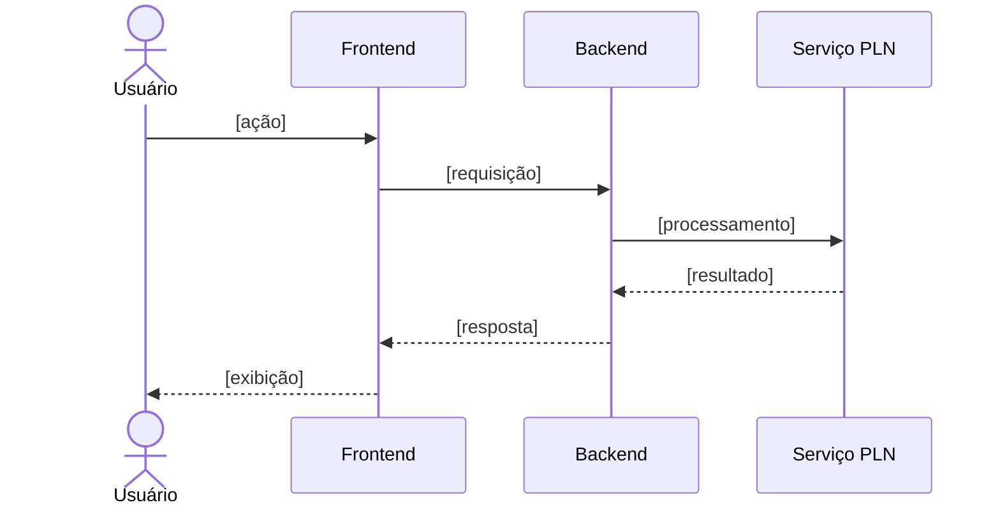

<p align='center'>
  <a href='https://www.inteli.edu.br/'>
    
  </a>
</p>

---

## Projeto: Azum


## Sumário

<details>
<summary><strong>1. Entendimento de Negócio</strong></summary>

- [1.1 Problema](#11-problema)
- [1.2 Contexto da Indústria do Parceiro](#12-contexto-da-indústria-do-parceiro)
- [1.3 Visão do Produto](#13-visão-do-produto)
- [1.4 Objetivo do Produto](#14-objetivo-do-produto)
- [1.5 Personas e Jornada do Usuário](#15-personas-e-jornada-do-usuário)
- [1.6 Fluxo do Negócio](#16-fluxo-do-negócio)
- [1.7 Brainstorming de Features](#17-brainstorming-de-features)
- [1.8 Canvas do MVP](#18-canvas-do-mvp)
- [1.9 Matriz de Risco do Projeto](#19-matriz-de-risco-do-projeto)

</details>

<details>
<summary><strong>2. Especificação de Requisitos de Software (Sprint 1)</strong></summary>

- [2.1 Business Drivers](#21-business-drivers)
- [2.2 Requisitos Funcionais](#22-requisitos-funcionais)
- [2.3 Requisitos Não Funcionais](#23-requisitos-não-funcionais)
- [2.4 Visão Inicial da Solução Técnica](#24-visão-inicial-da-solução-técnica)
- [2.5 Tecnologias e Ferramentas](#25-tecnologias-e-ferramentas)

</details>

- [3. Registro de Decisões](#3-registro-de-decisões)

---

# 1. Entendimento de Negócio

## 1.1 Problema


**Impacto sobre o parceiro:** [...]

**Impacto sobre o setor:** [...]

### Matriz SWOT


---

## 1.2 Contexto da Indústria do Parceiro

### Visão geral do setor


### Tendências e desafios

- **Tendência 1:** [...]
- **Tendência 2:** [...]
- **Desafio 1:** [...]
- **Desafio 2:** [...]

### Posicionamento do parceiro no mercado


---

## 1.3 Visão do Produto

### Descrição geral

&emsp; O produto consiste em um agente inteligente de apoio à gestão do portfólio de projetos, desenvolvido para auxiliar os profissionais do Metrô de São Paulo no acompanhamento dos empreendimentos administrados pelo PMO Corporativo. Sua finalidade é facilitar a consulta, a interpretação e o acompanhamento das informações dos projetos, proporcionando uma interação mais simples e intuitiva por meio de linguagem natural.
&emsp; No MVP, o agente utilizará um pipeline de Processamento de Linguagem Natural desenvolvido e avaliado pela equipe. Esse pipeline será responsável por interpretar as solicitações dos usuários, identificar suas intenções e classificá-las de acordo com os tipos de interação definidos, como consultas, transações ou alertas. As intenções serão controladas por um catálogo aceitável de interações sobre os projetos da empresa: solicitações genéricas ou sem relação com o contexto do portfólio deverão ser detectadas, e o usuário será orientado sobre as interações possíveis, evitando respostas fora do escopo do agente.
 &emsp; Por meio de uma interface conversacional, o profissional poderá fazer perguntas relacionadas aos projetos, incluindo dúvidas sobre documentos, prazos, marcos, riscos, pendências, avanço e situação dos empreendimentos, além de dúvidas sobre conceitos e normativos relativos à gestão de portfólio, programas e projetos. O agente consultará as fontes integradas e apresentará respostas estruturadas com base nas informações disponíveis. Também poderá comparar projetos, apoiar análises relacionadas ao acompanhamento do portfólio e à aderência aos normativos aplicáveis e gerar prévias de relatórios de status e de apresentações para a diretoria a partir dos dados disponíveis.
&emsp; A interação com o agente ocorrerá primariamente por linguagem natural escrita, e a solicitação por voz também integra o escopo do produto: por meio da conversão de áudio em texto, as mensagens faladas serão encaminhadas ao mesmo pipeline de PLN, permitindo que o profissional interaja com o agente da forma que lhe for mais conveniente.
 &emsp; Além de responder às solicitações, o agente poderá oferecer apoio proativo aos profissionais. A partir dos dados disponíveis, poderá identificar e comunicar situações que mereçam atenção, como a proximidade ou o vencimento de prazos, a ausência de documentos esperados, a existência de campos incompletos e outras pendências relacionadas aos projetos. Esses alertas terão caráter informativo e servirão como apoio ao acompanhamento realizado pelo PMO.
 &emsp; O agente também poderá apoiar a entrada de dados. Ao identificar uma solicitação de transação, como o registro de uma nova informação ou a criação de um projeto, o agente analisará os dados disponíveis e apresentará, na própria conversa, uma sugestão estruturada de preenchimento dos campos correspondentes. No MVP, entretanto, essas propostas terão caráter exclusivamente sugestivo: o agente não preencherá, alterará ou salvará informações em nenhuma base, cabendo ao profissional avaliar a sugestão e, se desejar, efetuar o registro por meio das ferramentas oficiais. Dessa forma, a categoria de transação é contemplada na identificação de intenções e no apoio ao preenchimento, preservando integralmente a responsabilidade humana sobre as informações registradas.
 &emsp; Para desenvolver e validar o MVP de maneira segura, serão utilizados dados sintéticos que representem situações e informações do contexto do PMO. Portanto, o produto não será integrado ao portfólio real do Metrô nesta etapa, não utilizará dados corporativos sensíveis e não será implantado em ambiente de produção. A integração com os sistemas reais poderá ser considerada como uma evolução posterior do projeto.
&emsp; A solução deverá considerar o ecossistema tecnológico da Microsoft, especialmente ferramentas como o Microsoft Copilot Studio e a Power Platform, que atuarão como camada de orquestração e integração do agente, assegurando aderência ao ambiente homologado pelo Metrô e a possibilidade de sustentação e evolução da solução pela própria equipe interna.
&emsp; O produto funcionará como uma camada inteligente de consulta, orientação e apoio ao acompanhamento dos projetos. Ele não substituirá os sistemas corporativos, os processos de governança nem a avaliação dos profissionais do Metrô. Seu papel será auxiliar o profissional a encontrar, compreender e analisar informações, preservando as regras de acesso, a confidencialidade e a rastreabilidade das interações.

### O que o produto FAZ (escopo)

| # | Funcionalidade | Descrição |
|---|---|---|
| 1 | Interação em linguagem natural por texto | Recebe solicitações escritas em linguagem natural por meio de uma interface conversacional. |
| 2 | Interação por voz | Aceita solicitações faladas, convertendo o áudio em texto e encaminhando-o ao mesmo pipeline de processamento. |
| 3 | Interpretação e classificação de intenções | Interpreta as solicitações por meio de um pipeline de PLN desenvolvido pela equipe, identifica a intenção do usuário e a classifica como consulta, transação ou alerta. |
| 4 | Controle do catálogo de intenções | Detecta solicitações genéricas ou fora do contexto do portfólio e orienta o usuário sobre o catálogo de interações aceitáveis, recusando interações fora de escopo. |
| 5 | Consulta a informações dos projetos | Responde a dúvidas sobre documentos, prazos, marcos, riscos, pendências, avanço e situação dos projetos, utilizando dados sintéticos. |
| 6 | Esclarecimento de conceitos e normativos | Responde a dúvidas sobre conceitos e normativos relativos à gestão de portfólio, programas e projetos. |
| 7 | Análises e comparações | Compara informações entre projetos do portfólio e apoia análises sobre status e aderência a normativos. |
| 8 | Prévias de relatórios | Gera prévias de relatórios de status e de apresentações para a diretoria a partir dos dados disponíveis. |
| 9 | Respostas estruturadas com referências | Apresenta respostas claras e estruturadas, indicando as fontes ou referências utilizadas quando disponíveis, e informa quando não existem dados suficientes para uma resposta confiável. |
| 10 | Alertas e apoio proativo | Alerta sobre prazos próximos ou vencidos, sinaliza documentos esperados ausentes, identifica campos incompletos e demais pendências, e oferece ajuda proativa conforme o contexto identificado. |
| 11 | Sugestões de preenchimento | Identifica solicitações de transação e apresenta, no chat, sugestões estruturadas de preenchimento de campos e registros, permitindo que o profissional as avalie antes de qualquer registro. |
| 12 | Segurança e governança das interações | Respeita as permissões de cada perfil, a confidencialidade das informações e a rastreabilidade das interações. |

### O que o produto NÃO FAZ (fora de escopo)

| # | Item fora do escopo | Justificativa |
|---|---|---|
| 1 | Utilizar dados reais ou sensíveis do Metrô | Restrição de confidencialidade do parceiro: nenhum dado sensível pode ser processado fora de ambientes homologados; o MVP é validado exclusivamente sobre dados sintéticos. |
| 2 | Integrar-se ao portfólio real ou ser implantado em produção | O TAPI delimita a integração com o portfólio real como evolução posterior ("Ir Além"); o MVP é uma prova de conceito em ambiente controlado. |
| 3 | Preencher, alterar, salvar ou excluir informações automaticamente em qualquer base ou sistema | Decisão de projeto para preservar a responsabilidade humana: as transações geram apenas sugestões no chat, e o registro é efetuado pelo profissional nas ferramentas oficiais. |
| 4 | Executar automaticamente as sugestões apresentadas | O profissional deve avaliar e decidir sobre cada sugestão, mantendo-se como responsável final pelas informações registradas. |
| 5 | Tomar decisões técnicas, administrativas ou estratégicas, ou aprovar documentos, riscos, prazos e ações de governança | O agente tem caráter de apoio: decisões e aprovações permanecem sob responsabilidade dos profissionais e dos processos de governança do Metrô. |
| 6 | Substituir os sistemas, processos ou profissionais do Metrô | O produto é uma camada adicional de interação sobre a estrutura existente, e não um substituto dela. |
| 7 | Permitir acesso a informações incompatíveis com as permissões do usuário | Exigência de confidencialidade e controle de acesso por perfil definida pelo parceiro. |
| 8 | Responder a solicitações fora do catálogo de intenções | O TAPI determina que interações genéricas ou sem contexto sejam detectadas, orientadas e descartadas. |
| 9 | Garantir respostas conclusivas com dados ausentes, incompletos ou desatualizados, ou prever com certeza resultados futuros | Limitação inerente à natureza da solução: as respostas dependem da qualidade dos dados disponíveis, e o agente sinaliza incertezas em vez de ocultá-las. |
| 10 | Contemplar todos os documentos, processos e possibilidades do ambiente corporativo | Delimitação necessária de escopo para um MVP acadêmico com prazo definido; a cobertura completa é evolução futura. |

#### Delimitação do MVP
 &emsp;  O MVP será destinado à validação do pipeline de PLN e das principais formas de interação do agente em um ambiente controlado, utilizando dados sintéticos. O foco estará na capacidade de compreender solicitações por texto e por voz, responder a consultas, apoiar comparações, emitir alertas e sugerir o preenchimento de campos, sempre mantendo o profissional como responsável pela avaliação, pelo registro das informações e pela decisão final.
&emsp; Em síntese: no MVP, o agente consulta, interpreta, compara, responde, alerta e sugere preenchimentos utilizando dados sintéticos. O profissional analisa, registra e decide. A integração com o portfólio real, o preenchimento automático de qualquer base, o uso de dados sensíveis e a implantação em produção ficam fora do escopo.


## 1.4 Objetivo do Produto

&emsp; O objetivo geral do produto é reduzir o esforço manual necessário para consultar, interpretar e registrar informações dos projetos administrados pelo PMO Corporativo do Metrô de São Paulo, por meio de um agente de Inteligência Artificial capaz de compreender solicitações em linguagem natural, escrita e por voz, e de responder com informações estruturadas, alertas e sugestões de preenchimento, preservando os processos, as permissões e a rastreabilidade já estabelecidos pela companhia.

&emsp; Esse objetivo foi formulado a partir da conclusão central da análise do problema: o desafio do Metrô não está na ausência de uma estrutura de gestão, mas no custo operacional de interagir com ela. Por essa razão, o objetivo não propõe a substituição de sistemas, processos ou profissionais, e sim a redução do atrito entre o profissional e a informação, atuando exatamente sobre os pontos em que a análise identificou esforço manual: a localização de informações dispersas em diferentes arquivos, listas e sistemas, a consolidação de análises e o registro de novos dados. O objetivo geral desdobra-se nas seguintes metas específicas, alinhadas ao problema identificado e às necessidades do negócio:

* **Agilizar o acesso à informação:** permitir que o profissional obtenha dados sobre documentos, prazos, marcos, riscos, pendências e avanço dos projetos por meio de uma única interface conversacional, reduzindo o tempo gasto na navegação manual por diferentes arquivos, listas, relatórios e sistemas;
* **Compreender corretamente as solicitações dos usuários:** desenvolver e avaliar um pipeline de Processamento de Linguagem Natural capaz de identificar as intenções dos usuários e classificá-las como consultas, transações ou alertas, com desempenho acompanhado por métricas de classificação a cada iteração, detectando e orientando solicitações genéricas ou fora do catálogo de interações aceitáveis;
* **Apoiar a análise dos projetos:** oferecer respostas estruturadas sobre os projetos do portfólio e prévias de relatórios de status e apresentações, apoiando decisões mais ágeis e fundamentadas em evidências;
* **Fortalecer o acompanhamento preventivo do portfólio:** identificar e comunicar proativamente prazos próximos ou vencidos, documentos ausentes, campos incompletos e demais pendências, ampliando a capacidade do PMO de antecipar riscos e desvios;
* **Apoiar a qualidade da entrada de dados:** apresentar sugestões estruturadas de preenchimento de campos e registros a partir das solicitações de transação, contribuindo para a redução de erros e inconsistências, mantendo o profissional como responsável pelo registro e pela decisão final;
* **Garantir conformidade com as restrições do parceiro:** validar a solução exclusivamente sobre dados sintéticos, respeitando as permissões de acesso por perfil, a confidencialidade das informações e a rastreabilidade das interações, sem trânsito de dados por serviços externos não homologados;
* **Assegurar aderência e sustentabilidade tecnológica:** conceber a solução sobre o ecossistema Microsoft (Copilot Studio / Power Platform), de forma que possa ser operada, mantida e evoluída pela própria equipe do Metrô, com flexibilidade para permanecer funcional diante de eventuais mudanças na plataforma de portfólio.

&emsp; Para evidenciar o alinhamento entre as metas, o problema identificado e as necessidades do negócio, a tabela a seguir apresenta a rastreabilidade de cada meta em relação ao aspecto do problema que a origina e ao benefício esperado pelo parceiro que ela atende, conforme registrado no TAPI:

<div align="center">
<sub>Tabela x - Rastreabilidade entre metas, problema e benefícios esperados pelo parceiro</sub>
</div>

| Meta | Origem no problema | Benefício esperado pelo parceiro |
|---|---|---|
| Agilizar o acesso à informação | Navegação manual por diferentes arquivos, listas, relatórios e sistemas | Eficiência; Transparência |
| Compreender as solicitações dos usuários | Viabilizador técnico da interação em linguagem natural (núcleo do MVP) | Precisão |
| Apoiar a análise dos projetos | Consolidação manual de documentos e análises | Capacidade analítica e suporte à decisão; Relatórios automatizados |
| Fortalecer o acompanhamento preventivo | Limitação da capacidade do PMO de identificar riscos e desvios preventivamente | Proatividade |
| Apoiar a qualidade da entrada de dados | Registro de informações trabalhoso e suscetível a erros e inconsistências | Precisão |
| Garantir conformidade com as restrições | Exigências de confidencialidade, permissões por perfil e rastreabilidade | Confidencialidade; Rastreabilidade |
| Assegurar aderência e sustentabilidade tecnológica | Premissa de possível troca da plataforma de portfólio | Interoperabilidade e integração; Sustentação e autonomia da equipe interna |

<div align="center">
<sup>Fonte: Material produzido pelos autores, 2026.</sup>
</div>

&emsp; Em conjunto, essas metas respondem diretamente ao problema central identificado: tornar mais ágil, simples e intuitiva a interação com a estrutura de gestão de portfólio já existente. Ao permitir que a informação seja consultada, analisada e sugerida por meio de linguagem natural, o produto atua sobre o esforço manual que hoje consome o tempo das equipes, gerando eficiência, precisão e apoio à tomada de decisão, ao mesmo tempo em que preserva as permissões, a confidencialidade e a rastreabilidade exigidas pela companhia. Alcançar esse objetivo significa, portanto, entregar ao PMO Corporativo não um substituto de seus sistemas, processos ou profissionais, mas uma camada de interação que amplia a capacidade da estrutura já existente, liberando as equipes para as atividades analíticas e estratégicas que efetivamente dependem do julgamento humano.

## 1.5 Personas e Jornada do Usuário

### Persona 1: [Nome fictício]


### Jornada do Usuário — [Persona X]


---

## 1.6 Fluxo do Negócio

### Cadeia de valor

<!-- Modelagem da cadeia de valor dos processos relacionados ao contexto do projeto. -->


[Descrição da cadeia de valor...]

### Fluxo principal (BPMN)

<!-- Diagrama BPMN do fluxo principal. Ferramentas sugeridas: Bizagi, draw.io, Camunda Modeler. -->


**Descrição do processo:**

1. **[Atividade 1]:** [descrição]
2. **[Atividade 2]:** [descrição]
3. **[Gateway/decisão]:** [condições e caminhos]
4. **[Atividade final]:** [descrição]

---

## 1.7 Brainstorming de Features

### Ideias levantadas


| # | Feature | Origem (grupo/parceiro) | Descrição |
|---|---|---|---|
| F01 | [Feature] | [Grupo] | [...] |
| F02 | [Feature] | [Parceiro] | [...] |
| F03 | [Feature] | [Grupo] | [...] |

### Priorização


**Critério de priorização:** [ex.: Importância (1-5) × Viabilidade (1-5)]

| Prioridade | Feature | Importância | Viabilidade | Score | Entra no MVP? |
|---|---|---|---|---|---|
| 1º | [F0X] | 5 | 5 | 25 | ✅ Sim |
| 2º | [F0X] | 4 | 5 | 20 | ✅ Sim |
| 3º | [F0X] | 5 | 2 | 10 | ❌ Futuro |

---

## 1.8 Canvas do MVP

<!-- Preencha o MVP Canvas (Paulo Caroli) ou estrutura equivalente. -->


| Bloco | Conteúdo |
|---|---|
| **Proposta do MVP** | [O que é a versão mínima e viável] |
| **Segmento de personas** | [Para quem é este MVP] |
| **Jornadas atendidas** | [Quais jornadas o MVP cobre] |
| **Funcionalidades** | [Features incluídas no recorte] |
| **Resultado esperado** | [Aprendizado/valor que se espera obter] |
| **Métricas para validar** | [Como saber se o MVP funcionou] |
| **Custo e cronograma** | [Estimativa de esforço e prazo] |

**Justificativa do recorte:** [Por que essas features e não outras.]

---

## 1.9 Matriz de Risco do Projeto

### Critérios de avaliação

- **Escala de probabilidade:** 1 (muito baixa) a 5 (muito alta)
- **Escala de impacto:** 1 (muito baixo) a 5 (muito alto)
- **Severidade:** Probabilidade × Impacto
- **Faixas de criticidade:**
  - 🟢 Baixa: 1–6
  - 🟡 Média: 8–12
  - 🔴 Alta: 15–25

### Registro de riscos


### Matriz Probabilidade × Impacto


# 2. Especificação de Requisitos de Software (Sprint 1)

## 2.1 Business Drivers


### Contexto da aplicação

[Como o processamento de linguagem natural transforma o negócio do parceiro...]

### Fluxo de negócio 1: [Nome do fluxo]

- **Situação atual (AS-IS):** [como funciona hoje]
- **Situação proposta (TO-BE):** [como funcionará com a solução]
- **Indicadores computacionais:** [ex.: precisão da classificação por tags ≥ X%, taxa de acerto de intenção, WER na conversão áudio→texto, latência de resposta...]

### Fluxo de negócio 2: [Nome do fluxo]

- **Situação atual (AS-IS):** [...]
- **Situação proposta (TO-BE):** [...]
- **Indicadores computacionais:** [...]

---

## 2.2 Requisitos Funcionais

### Histórias de usuário

<!-- Formato: Como [persona], quero [ação] para [benefício].
     Inclua critérios de aceitação testáveis. -->

#### RF01 — [Título da história]

> **Como** [persona], **quero** [ação/funcionalidade], **para** [benefício/valor].

**Critérios de aceitação:**
- [ ] [Critério 1]
- [ ] [Critério 2]

**Prioridade:** [Alta/Média/Baixa] · **Persona relacionada:** [Persona X]

#### RF02 — [Título da história]

> **Como** [persona], **quero** [ação], **para** [benefício].

**Critérios de aceitação:**
- [ ] [Critério 1]
- [ ] [Critério 2]

<!-- Repita para cada requisito funcional. -->

### Modelagem estática — Diagrama de classes do domínio

<!-- Classes e atributos do domínio, coerentes com as histórias acima. -->


```mermaid
classDiagram
    class Usuario {
        +id: UUID
        +nome: String
        +email: String
    }
    class [EntidadeDominio] {
        +atributo1: Tipo
        +atributo2: Tipo
    }
    Usuario "1" --> "*" [EntidadeDominio] : possui
```

**Descrição das classes:**

| Classe | Responsabilidade | Relacionamentos |
|---|---|---|
| Usuario | [...] | [...] |
| [Entidade] | [...] | [...] |

### Modelagem dinâmica — Cenários e diagramas de sequência

#### Cenário 1: [Nome do cenário — relacionado ao RF0X]

**Descrição:** [Fluxo passo a passo do cenário.]




<!-- Repita para os demais cenários. Garanta coerência: cada diagrama
     deve corresponder a uma história de usuário e usar as classes do domínio. -->

---

## 2.3 Requisitos Não Funcionais

<!-- Mínimo de 2 RNFs, derivados dos business drivers,
     descritos como histórias de usuário e coerentes com os RFs. -->

#### RNF01 — [Categoria: ex. Desempenho]

> **Como** [persona], **quero** [qualidade do sistema, ex.: receber a resposta em até X segundos], **para** [benefício].

- **Business driver relacionado:** [Fluxo 1/2]
- **Métrica de verificação:** [como será medido]
- **Critério de aceitação:** [valor-alvo]

#### RNF02 — [Categoria: ex. Acurácia do modelo]

> **Como** [persona], **quero** [ex.: que a classificação por tags tenha precisão ≥ X%], **para** [benefício].

- **Business driver relacionado:** [...]
- **Métrica de verificação:** [...]
- **Critério de aceitação:** [...]

---

## 2.4 Visão Inicial da Solução Técnica

<!-- OBRIGATÓRIO: diagrama UML de componentes ou de pacotes.
     Esboço em blocos conectados cobrindo as 3 camadas:
     interface humano-computador, lógica de negócio, acesso a dados/serviços. -->

### Diagrama de componentes (UML)


### Descrição das camadas

| Camada | Componentes | Responsabilidade |
|---|---|---|
| **Interface (IHC)** | [ex.: Web App, Chat UI] | [...] |
| **Lógica de negócio** | [ex.: API, Serviço de PLN, Orquestrador] | [...] |
| **Dados e serviços** | [ex.: Banco de dados, APIs externas, storage] | [...] |

### Conexões entre componentes

- **[Componente A] → [Componente B]:** [protocolo/motivo da conexão, ex.: REST/JSON]
- **[Componente B] → [Componente C]:** [...]

---

## 2.5 Tecnologias e Ferramentas

<!-- Estimativa inicial — pode ser revisada nas próximas sprints. -->

| Categoria | Tecnologia/Ferramenta | Justificativa |
|---|---|---|
| Linguagem (backend) | [ex.: Python 3.12] | [...] |
| Framework (backend) | [ex.: FastAPI] | [...] |
| Frontend | [ex.: React] | [...] |
| PLN / IA | [ex.: spaCy, Hugging Face, API de LLM] | [...] |
| Banco de dados | [ex.: PostgreSQL] | [...] |
| Infraestrutura | [ex.: Docker, AWS] | [...] |
| Versionamento | [ex.: Git + GitHub] | [...] |
| Gestão do projeto | [ex.: GitHub Projects] | [...] |
| Modelagem | [ex.: draw.io, Mermaid, Bizagi] | [...] |

---

# 3. Registro de Decisões

<!-- Registre as decisões mais relevantes tomadas pelo grupo. -->

| # | Data | Decisão | Alternativas consideradas | Justificativa |
|---|---|---|---|---|
| D01 | [DD/MM] | [...] | [...] | [...] |
| D02 | [DD/MM] | [...] | [...] | [...] |
