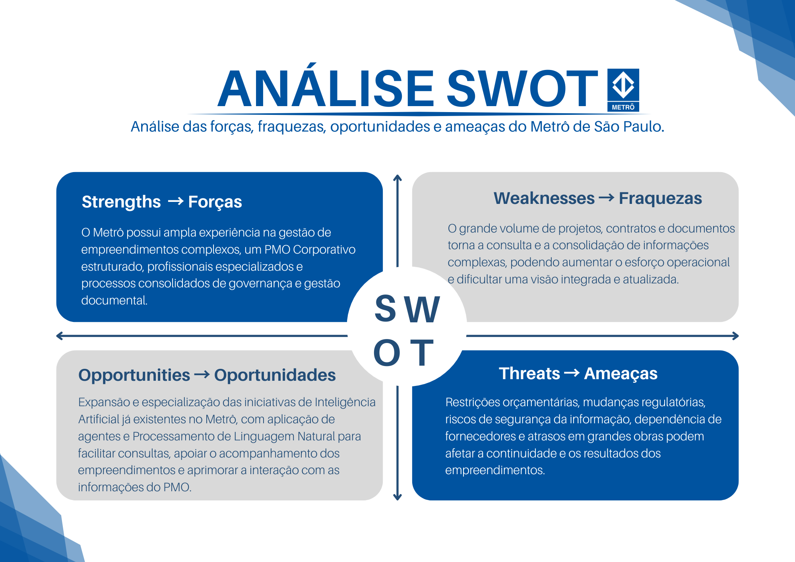
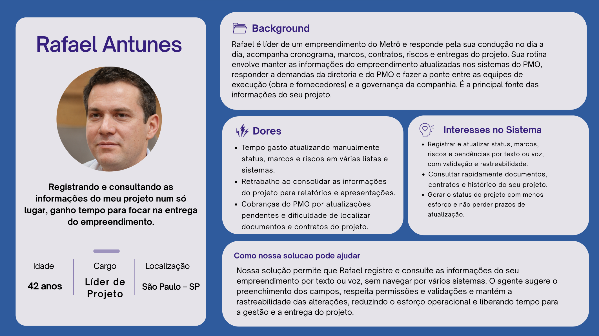
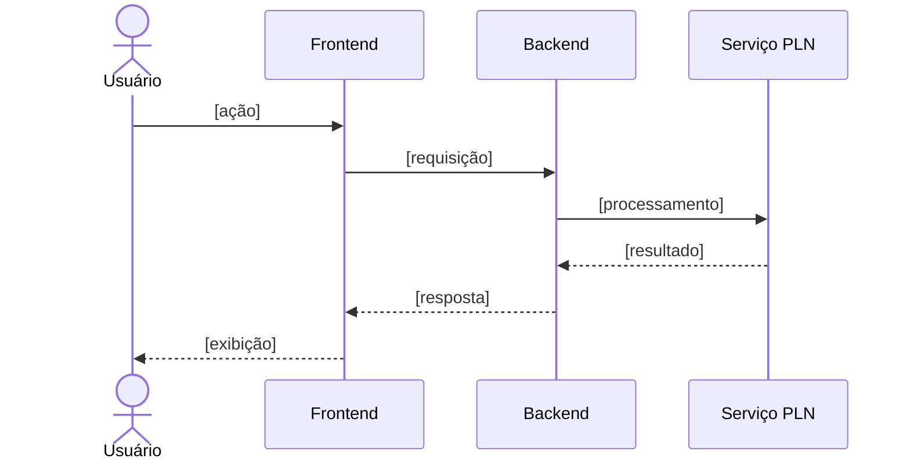

<p align='center'>
  <a href='https://www.inteli.edu.br/'>
    
  </a>
</p>

---

## Projeto: Azum

## Sumário

<details>
<summary><strong>1. Entendimento de Negócio</strong></summary>

- [1.1 Problema](#11-problema)
- [1.2 Contexto da Indústria do Parceiro](#12-contexto-da-indústria-do-parceiro)
- [1.3 Visão do Produto](#13-visão-do-produto)
- [1.4 Objetivo do Produto](#14-objetivo-do-produto)
- [1.5 Personas e Jornada do Usuário](#15-personas-e-jornada-do-usuário)
- [1.6 Fluxo do Negócio](#16-fluxo-do-negócio)
- [1.7 Brainstorming de Features](#17-brainstorming-de-features)
- [1.8 Canvas do MVP](#18-canvas-do-mvp)
- [1.9 Matriz de Risco do Projeto](#19-matriz-de-risco-do-projeto)

</details>

<details>
<summary><strong>2. Especificação de Requisitos de Software (Sprint 1)</strong></summary>

- [2.1 Business Drivers](#21-business-drivers)
- [2.2 Requisitos Funcionais](#22-requisitos-funcionais)
- [2.3 Requisitos Não Funcionais](#23-requisitos-não-funcionais)
- [2.4 Visão Inicial da Solução Técnica](#24-visão-inicial-da-solução-técnica)
- [2.5 Tecnologias e Ferramentas](#25-tecnologias-e-ferramentas)

</details>

- [3. Registro de Decisões](#3-registro-de-decisões)

---

# 1. Entendimento de Negócio

## 1.1 Problema

&emsp; O Metrô de São Paulo gerencia empreendimentos de elevada complexidade técnica, financeira e administrativa. Esses projetos podem durar entre oito e dez anos, envolver investimentos bilionários, mais de uma centena de contratos e produzir dezenas de milhares de documentos. Nesse cenário, o PMO Corporativo é responsável pela governança da estratégia, dos portfólios, dos programas e dos projetos da companhia, acompanhando cronogramas, marcos, riscos, problemas, indicadores, benefícios e mudanças.

&emsp; Atualmente, o Metrô já possui processos, ferramentas e práticas estabelecidas para a gestão e o armazenamento desses documentos e informações. Portanto, o desafio não está na ausência de uma estrutura de gestão documental, mas na necessidade de tornar a interação com esse grande volume de conteúdo mais simples, ágil e acessível.

&emsp; Mesmo com os documentos organizados, a localização de uma informação específica pode exigir que o profissional navegue por diferentes arquivos, listas, relatórios ou sistemas, aplique filtros e analise manualmente os resultados. Além disso, o registro de novas informações e documentos depende do acesso às ferramentas utilizadas e do preenchimento correto dos campos necessários. Essas atividades podem demandar tempo e aumentar a carga operacional das equipes, principalmente diante da quantidade e da complexidade dos projetos administrados.

&emsp; Dessa forma, o desafio consiste em oferecer uma maneira mais rápida e intuitiva de consultar e adicionar informações à estrutura de gestão já existente. Por meio de uma interação em linguagem natural, tanto por texto quanto por áudio, o usuário poderá solicitar dados sobre determinado projeto, localizar documentos, verificar riscos, marcos e pendências ou registrar novas informações sem precisar navegar manualmente por diferentes interfaces. As inclusões realizadas com o auxílio do agente, entretanto, deverão passar por validações, respeitar os campos obrigatórios e as permissões de cada usuário, além de manter a rastreabilidade das alterações.

&emsp; A dificuldade de acessar e registrar informações com agilidade pode atrasar análises, aumentar o esforço necessário para elaborar relatórios e limitar a capacidade do PMO de identificar riscos, pendências e desvios de maneira preventiva. No setor metroferroviário, em que os empreendimentos envolvem recursos públicos e afetam diretamente a mobilidade da população, a rapidez, a integridade e a confiabilidade dessas informações são fundamentais para apoiar decisões e acompanhar a entrega dos benefícios planejados.

&emsp; Portanto, o problema central que o projeto busca resolver é a necessidade de tornar mais ágil, simples e intuitiva a consulta e a adição de informações na estrutura de gestão documental já utilizada pelo Metrô. O objetivo não é substituir os processos, as ferramentas ou os profissionais responsáveis, mas reduzir o esforço manual necessário para localizar, interpretar e registrar informações relacionadas aos empreendimentos.

&emsp; Como resposta a esse desafio, o projeto considera o desenvolvimento de um agente de Inteligência Artificial capaz de compreender solicitações em linguagem natural e, por meio de integrações com o ambiente Microsoft homologado do Metrô, consultar ou registrar informações autorizadas. A solução deverá preservar os processos existentes, as regras de negócio, as permissões de acesso, a segurança e a rastreabilidade, funcionando como uma nova camada de interação com o ambiente já administrado pelo Metrô e apoiando, sem substituir, a análise e a tomada de decisão dos profissionais responsáveis.

### Matriz SWOT

&emsp; Para aprofundar a compreensão do problema e do contexto em que a solução será inserida, foi elaborada uma Matriz SWOT, ferramenta de análise estratégica que organiza os fatores internos (forças e fraquezas) e externos (oportunidades e ameaças) que influenciam o negócio. A imagem 1 apresenta a matriz elaborada para o Metrô de São Paulo, com foco na atuação do PMO Corporativo e na gestão de informações de seus empreendimentos, e os quadrantes são analisados em detalhe na sequência.

<div align="center">
<sub>Imagem 01 - Matriz SWOT </sub><br>
  <br>
  <sup>Fonte: Material produzido pelos autores, 2026.</sup>
</div>

&emsp; A Matriz SWOT foi elaborada para analisar o contexto interno e externo do Metrô de São Paulo, com foco na atuação do PMO Corporativo e na gestão de informações relacionadas aos seus empreendimentos. As forças e fraquezas representam características internas da organização, enquanto as oportunidades e ameaças correspondem a fatores externos que podem influenciar suas atividades.

&emsp; Entre as principais forças do Metrô, destacam-se sua ampla experiência na gestão de empreendimentos de grande porte, a presença de profissionais especializados e a existência de processos consolidados de governança e gestão documental. A organização também conta com um PMO Corporativo estruturado, responsável por apoiar o acompanhamento da estratégia, dos portfólios, dos programas, dos projetos e dos indicadores. Esses elementos favorecem o controle das iniciativas e o alinhamento dos empreendimentos aos objetivos estratégicos da companhia.

&emsp; Em relação às fraquezas, a própria dimensão e complexidade das operações representam desafios internos. Os empreendimentos podem envolver longos períodos de execução, investimentos elevados, numerosos contratos e a produção de milhares de documentos. Embora o Metrô já possua ferramentas e processos para administrar essas informações, o grande volume de conteúdo pode tornar a localização, a consulta e a consolidação dos dados mais demoradas, aumentando o esforço operacional, a dependência de ações manuais de consolidação e verificação da qualidade das informações e o risco de inconsistências nos dados, o que dificulta a obtenção rápida de uma visão integrada dos projetos.

&emsp; No ambiente externo, a evolução contínua da Inteligência Artificial, do Processamento de Linguagem Natural e das tecnologias de integração de dados representa uma oportunidade relevante para o Metrô. A organização já possui iniciativas relacionadas à IA, incluindo o uso de agentes, o que demonstra abertura institucional e experiência inicial com essas tecnologias. A oportunidade, portanto, não está simplesmente em iniciar sua adoção, mas em ampliar e especializar suas aplicações de acordo com as necessidades do PMO Corporativo. Nesse contexto, essas tecnologias podem ser utilizadas para tornar a consulta às informações mais intuitiva, apoiar a identificação de prazos e pendências, comparar dados dos empreendimentos e propor conteúdos para campos que deverão ser avaliados pelos profissionais responsáveis. Essa evolução pode reduzir o esforço operacional e fortalecer a capacidade de acompanhamento e análise dos projetos, desde que seja integrada aos processos, às permissões e às regras de segurança já estabelecidos pelo Metrô.

&emsp; Entretanto, o Metrô também está exposto a ameaças externas que podem afetar a continuidade e os resultados de seus empreendimentos. Entre elas estão restrições orçamentárias, mudanças regulatórias, dependência de fornecedores, riscos relacionados à segurança da informação, atrasos em grandes obras e possíveis mudanças ou substituições na plataforma de gestão de portfólio, o que exige que novas soluções sejam flexíveis e desacopladas das ferramentas atuais. Por prestar um serviço público essencial e administrar empreendimentos financiados com recursos públicos, eventuais falhas, atrasos ou problemas de segurança podem produzir impactos financeiros, institucionais e sociais relevantes.

&emsp; A análise demonstra que o Metrô possui uma base organizacional sólida para aproveitar as oportunidades proporcionadas pela transformação digital. Sua experiência, seus profissionais especializados, seus processos consolidados e seu PMO estruturado oferecem condições favoráveis para a incorporação gradual de novas tecnologias. Ao mesmo tempo, qualquer iniciativa deve considerar a complexidade interna da organização e as ameaças existentes no ambiente externo.

&emsp;Nesse contexto, o projeto pode aproveitar as forças já existentes no Metrô para facilitar o acesso e o registro de informações, sem substituir os processos e mecanismos atuais de gestão. A implementação de uma nova camada de interação deve ocorrer de forma segura, integrada e alinhada às regras da organização, contribuindo para reduzir o esforço operacional e melhorar o apoio à tomada de decisão.

---

## 1.2 Contexto da Indústria do Parceiro

### Visão geral do setor

&emsp; O setor metroferroviário compreende o transporte público de passageiros sobre trilhos em ambientes urbanos e metropolitanos — metrôs, trens metropolitanos, monotrilhos e veículos leves sobre trilhos (VLTs). É um modal estruturante da mobilidade urbana, marcado pela alta capacidade, pela previsibilidade e pelo menor impacto ambiental por passageiro transportado. No Brasil, segundo o Balanço do Setor Metroferroviário 2024 da ANPTrilhos, a malha soma cerca de 1.137,5 km e transportou 2,57 bilhões de passageiros em 2024 (média de aproximadamente 8,6 milhões por dia), distribuídos por cerca de 49 linhas em 21 sistemas de 73 municípios — um crescimento de 3,6% em relação a 2023.

&emsp; Além do papel na mobilidade, o setor gera benefícios econômicos e ambientais expressivos: a ANPTrilhos estima, para 2024, uma economia de R$ 11,7 bilhões com a redução de congestionamentos e a emissão evitada de 2,4 milhões de toneladas de poluentes. Trata-se de uma indústria intensiva em capital, sustentada por obras de infraestrutura de longo prazo — empreendimentos plurianuais e bilionários —, que exigem forte governança de projetos e articulação entre o poder público, os operadores e a iniciativa privada.

### Tendências e desafios

&emsp; Entre as principais tendências, destaca-se a ampliação da participação privada por meio de concessões e parcerias público-privadas (PPPs) — das 16 empresas operadoras do país, 9 já são privadas —, modelo apontado pela ANPTrilhos como instrumento essencial para viabilizar a expansão da malha, a exemplo da concessão do Trem Intercidades São Paulo–Campinas, firmada em 2024. Somam-se a isso a modernização tecnológica, com sistemas de sinalização CBTC e operação automatizada (sem condutor), a adoção de monotrilhos e VLTs e a digitalização da experiência do usuário, com bilhetagem eletrônica e pagamento por aproximação e QR Code.

&emsp; Do lado dos desafios, a própria ANPTrilhos aponta a necessidade de mais incentivos regulatórios e de maior priorização de investimentos para sustentar a expansão e a modernização do setor. A esses fatores somam-se o financiamento de obras de grande porte com recursos públicos, a recuperação da demanda após a pandemia (ainda pressionada pelo teletrabalho), a complexidade de coordenar múltiplos operadores em uma mesma rede, o envelhecimento de ativos nas linhas mais antigas e a gestão de empreendimentos longos — com milhares de contratos e documentos —, que demanda controle rigoroso de prazos, custos e riscos.

### Posicionamento do parceiro no mercado

&emsp; A Companhia do Metropolitano de São Paulo (Metrô/SP), fundada em 1968, é uma sociedade de economia mista controlada pelo Governo do Estado de São Paulo e vinculada à Secretaria dos Transportes Metropolitanos. Seu papel vai além da operação: a companhia é responsável pelo planejamento, projeto, construção e operação do sistema metroviário da Região Metropolitana de São Paulo, atuando como principal articuladora da expansão da rede sobre trilhos da capital.

&emsp; Em termos de participação, o Metrô opera diretamente as Linhas 1-Azul, 2-Verde, 3-Vermelha e 15-Prata (além da 17-Ouro), que juntas transportaram mais de 821 milhões de passageiros em 2025, dentro de um sistema metroviário de cerca de 116 km e mais de 100 estações. Historicamente a espinha dorsal do transporte de alta capacidade da cidade, o Metrô hoje divide a operação da rede com concessionárias privadas — como a Linha 4-Amarela (primeira PPP metroviária do país, operada pela ViaQuatro) e as Linhas 5-Lilás, 8 e 9 (ViaMobilidade) —, mantendo, porém, o papel central de planejador e executor dos grandes empreendimentos de expansão do sistema.

**Fontes:** ANPTrilhos — [Balanço do Setor Metroferroviário 2024](https://anptrilhos.org.br/balanco-metroferroviario-2024-transporte-sobre-trilhos-cresce-e-transporta-257-bilhoes-de-passageiros/); Companhia do Metropolitano de São Paulo — [Metropolitano de São Paulo (Wikipédia)](https://pt.wikipedia.org/wiki/Metropolitano_de_S%C3%A3o_Paulo); Metrô/CPTM — [Guia do Metrô de São Paulo em 2026](https://www.metrocptm.com.br/guia-do-metro-de-sao-paulo-em-2026-linhas-operacao-e-como-usar-o-sistema/). Acesso em ago. 2026.

---

## 1.3 Visão do Produto

### Descrição geral

&emsp; O produto consiste em um agente inteligente de apoio à gestão do portfólio de projetos, desenvolvido para auxiliar os profissionais do Metrô de São Paulo no acompanhamento dos empreendimentos administrados pelo PMO Corporativo. Sua finalidade é facilitar a consulta, a interpretação e o acompanhamento das informações dos projetos, proporcionando uma interação mais simples e intuitiva por meio de linguagem natural.
&emsp; No MVP, o agente utilizará um pipeline de Processamento de Linguagem Natural desenvolvido e avaliado pela equipe. Esse pipeline será responsável por interpretar as solicitações dos usuários, identificar suas intenções e classificá-las de acordo com os tipos de interação definidos, como consultas, transações ou alertas. As intenções serão controladas por um catálogo aceitável de interações sobre os projetos da empresa: solicitações genéricas ou sem relação com o contexto do portfólio deverão ser detectadas, e o usuário será orientado sobre as interações possíveis, evitando respostas fora do escopo do agente.
 &emsp; Por meio de uma interface conversacional, o profissional poderá fazer perguntas relacionadas aos projetos, incluindo dúvidas sobre documentos, prazos, marcos, riscos, pendências, avanço e situação dos empreendimentos, além de dúvidas sobre conceitos e normativos relativos à gestão de portfólio, programas e projetos. O agente consultará as fontes integradas e apresentará respostas estruturadas com base nas informações disponíveis. Também poderá comparar projetos, apoiar análises relacionadas ao acompanhamento do portfólio e à aderência aos normativos aplicáveis e gerar prévias de relatórios de status e de apresentações para a diretoria a partir dos dados disponíveis.
&emsp; A interação com o agente ocorrerá primariamente por linguagem natural escrita, e a solicitação por voz também integra o escopo do produto: por meio da conversão de áudio em texto, as mensagens faladas serão encaminhadas ao mesmo pipeline de PLN, permitindo que o profissional interaja com o agente da forma que lhe for mais conveniente.
 &emsp; Além de responder às solicitações, o agente poderá oferecer apoio proativo aos profissionais. A partir dos dados disponíveis, poderá identificar e comunicar situações que mereçam atenção, como a proximidade ou o vencimento de prazos, a ausência de documentos esperados, a existência de campos incompletos e outras pendências relacionadas aos projetos. Esses alertas terão caráter informativo e servirão como apoio ao acompanhamento realizado pelo PMO.
 &emsp; O agente também poderá apoiar a entrada de dados. Ao identificar uma solicitação de transação, como o registro de uma nova informação ou a criação de um projeto, o agente analisará os dados disponíveis e apresentará, na própria conversa, uma sugestão estruturada de preenchimento dos campos correspondentes. No MVP, entretanto, essas propostas terão caráter exclusivamente sugestivo: o agente não preencherá, alterará ou salvará informações em nenhuma base, cabendo ao profissional avaliar a sugestão e, se desejar, efetuar o registro por meio das ferramentas oficiais. Dessa forma, a categoria de transação é contemplada na identificação de intenções e no apoio ao preenchimento, preservando integralmente a responsabilidade humana sobre as informações registradas.
 &emsp; Para desenvolver e validar o MVP de maneira segura, serão utilizados dados sintéticos que representem situações e informações do contexto do PMO. Portanto, o produto não será integrado ao portfólio real do Metrô nesta etapa, não utilizará dados corporativos sensíveis e não será implantado em ambiente de produção. A integração com os sistemas reais poderá ser considerada como uma evolução posterior do projeto.
&emsp; A solução deverá considerar o ecossistema tecnológico da Microsoft, especialmente ferramentas como o Microsoft Copilot Studio e a Power Platform, que atuarão como camada de orquestração e integração do agente, assegurando aderência ao ambiente homologado pelo Metrô e a possibilidade de sustentação e evolução da solução pela própria equipe interna.
&emsp; O produto funcionará como uma camada inteligente de consulta, orientação e apoio ao acompanhamento dos projetos. Ele não substituirá os sistemas corporativos, os processos de governança nem a avaliação dos profissionais do Metrô. Seu papel será auxiliar o profissional a encontrar, compreender e analisar informações, preservando as regras de acesso, a confidencialidade e a rastreabilidade das interações.

### O que o produto FAZ (escopo)

| #   | Funcionalidade                             | Descrição                                                                                                                                                                                       |
| --- | ------------------------------------------ | ----------------------------------------------------------------------------------------------------------------------------------------------------------------------------------------------- |
| 1   | Interação em linguagem natural por texto   | Recebe solicitações escritas em linguagem natural por meio de uma interface conversacional.                                                                                                     |
| 2   | Interação por voz                          | Aceita solicitações faladas, convertendo o áudio em texto e encaminhando-o ao mesmo pipeline de processamento.                                                                                  |
| 3   | Interpretação e classificação de intenções | Interpreta as solicitações por meio de um pipeline de PLN desenvolvido pela equipe, identifica a intenção do usuário e a classifica como consulta, transação ou alerta.                         |
| 4   | Controle do catálogo de intenções          | Detecta solicitações genéricas ou fora do contexto do portfólio e orienta o usuário sobre o catálogo de interações aceitáveis, recusando interações fora de escopo.                             |
| 5   | Consulta a informações dos projetos        | Responde a dúvidas sobre documentos, prazos, marcos, riscos, pendências, avanço e situação dos projetos, utilizando dados sintéticos.                                                           |
| 6   | Esclarecimento de conceitos e normativos   | Responde a dúvidas sobre conceitos e normativos relativos à gestão de portfólio, programas e projetos.                                                                                          |
| 7   | Análises e comparações                     | Compara informações entre projetos do portfólio e apoia análises sobre status e aderência a normativos.                                                                                         |
| 8   | Prévias de relatórios                      | Gera prévias de relatórios de status e de apresentações para a diretoria a partir dos dados disponíveis.                                                                                        |
| 9   | Respostas estruturadas com referências     | Apresenta respostas claras e estruturadas, indicando as fontes ou referências utilizadas quando disponíveis, e informa quando não existem dados suficientes para uma resposta confiável.        |
| 10  | Alertas e apoio proativo                   | Alerta sobre prazos próximos ou vencidos, sinaliza documentos esperados ausentes, identifica campos incompletos e demais pendências, e oferece ajuda proativa conforme o contexto identificado. |
| 11  | Sugestões de preenchimento                 | Identifica solicitações de transação e apresenta, no chat, sugestões estruturadas de preenchimento de campos e registros, permitindo que o profissional as avalie antes de qualquer registro.   |
| 12  | Segurança e governança das interações      | Respeita as permissões de cada perfil, a confidencialidade das informações e a rastreabilidade das interações.                                                                                  |

### O que o produto NÃO FAZ (fora de escopo)

| #   | Item fora do escopo                                                                                                        | Justificativa                                                                                                                                                                  |
| --- | -------------------------------------------------------------------------------------------------------------------------- | ------------------------------------------------------------------------------------------------------------------------------------------------------------------------------ |
| 1   | Utilizar dados reais ou sensíveis do Metrô                                                                                 | Restrição de confidencialidade do parceiro: nenhum dado sensível pode ser processado fora de ambientes homologados; o MVP é validado exclusivamente sobre dados sintéticos.    |
| 2   | Integrar-se ao portfólio real ou ser implantado em produção                                                                | O TAPI delimita a integração com o portfólio real como evolução posterior ("Ir Além"); o MVP é uma prova de conceito em ambiente controlado.                                   |
| 3   | Preencher, alterar, salvar ou excluir informações automaticamente em qualquer base ou sistema                              | Decisão de projeto para preservar a responsabilidade humana: as transações geram apenas sugestões no chat, e o registro é efetuado pelo profissional nas ferramentas oficiais. |
| 4   | Executar automaticamente as sugestões apresentadas                                                                         | O profissional deve avaliar e decidir sobre cada sugestão, mantendo-se como responsável final pelas informações registradas.                                                   |
| 5   | Tomar decisões técnicas, administrativas ou estratégicas, ou aprovar documentos, riscos, prazos e ações de governança      | O agente tem caráter de apoio: decisões e aprovações permanecem sob responsabilidade dos profissionais e dos processos de governança do Metrô.                                 |
| 6   | Substituir os sistemas, processos ou profissionais do Metrô                                                                | O produto é uma camada adicional de interação sobre a estrutura existente, e não um substituto dela.                                                                           |
| 7   | Permitir acesso a informações incompatíveis com as permissões do usuário                                                   | Exigência de confidencialidade e controle de acesso por perfil definida pelo parceiro.                                                                                         |
| 8   | Responder a solicitações fora do catálogo de intenções                                                                     | O TAPI determina que interações genéricas ou sem contexto sejam detectadas, orientadas e descartadas.                                                                          |
| 9   | Garantir respostas conclusivas com dados ausentes, incompletos ou desatualizados, ou prever com certeza resultados futuros | Limitação inerente à natureza da solução: as respostas dependem da qualidade dos dados disponíveis, e o agente sinaliza incertezas em vez de ocultá-las.                       |
| 10  | Contemplar todos os documentos, processos e possibilidades do ambiente corporativo                                         | Delimitação necessária de escopo para um MVP acadêmico com prazo definido; a cobertura completa é evolução futura.                                                             |

#### Delimitação do MVP

 &emsp; O MVP será destinado à validação do pipeline de PLN e das principais formas de interação do agente em um ambiente controlado, utilizando dados sintéticos. O foco estará na capacidade de compreender solicitações por texto e por voz, responder a consultas, apoiar comparações, emitir alertas e sugerir o preenchimento de campos, sempre mantendo o profissional como responsável pela avaliação, pelo registro das informações e pela decisão final.
&emsp; Em síntese: no MVP, o agente consulta, interpreta, compara, responde, alerta e sugere preenchimentos utilizando dados sintéticos. O profissional analisa, registra e decide. A integração com o portfólio real, o preenchimento automático de qualquer base, o uso de dados sensíveis e a implantação em produção ficam fora do escopo.

## 1.4 Objetivo do Produto

&emsp; O objetivo geral do produto é reduzir o esforço manual necessário para consultar, interpretar e registrar informações dos projetos administrados pelo PMO Corporativo do Metrô de São Paulo, por meio de um agente de Inteligência Artificial capaz de compreender solicitações em linguagem natural, escrita e por voz, e de responder com informações estruturadas, alertas e sugestões de preenchimento, preservando os processos, as permissões e a rastreabilidade já estabelecidos pela companhia.

&emsp; Esse objetivo foi formulado a partir da conclusão central da análise do problema: o desafio do Metrô não está na ausência de uma estrutura de gestão, mas no custo operacional de interagir com ela. Por essa razão, o objetivo não propõe a substituição de sistemas, processos ou profissionais, e sim a redução do atrito entre o profissional e a informação, atuando exatamente sobre os pontos em que a análise identificou esforço manual: a localização de informações dispersas em diferentes arquivos, listas e sistemas, a consolidação de análises e o registro de novos dados. O objetivo geral desdobra-se nas seguintes metas específicas, alinhadas ao problema identificado e às necessidades do negócio:

- **Agilizar o acesso à informação:** permitir que o profissional obtenha dados sobre documentos, prazos, marcos, riscos, pendências e avanço dos projetos por meio de uma única interface conversacional, reduzindo o tempo gasto na navegação manual por diferentes arquivos, listas, relatórios e sistemas;
- **Compreender corretamente as solicitações dos usuários:** desenvolver e avaliar um pipeline de Processamento de Linguagem Natural capaz de identificar as intenções dos usuários e classificá-las como consultas, transações ou alertas, com desempenho acompanhado por métricas de classificação a cada iteração, detectando e orientando solicitações genéricas ou fora do catálogo de interações aceitáveis;
- **Apoiar a análise dos projetos:** oferecer respostas estruturadas sobre os projetos do portfólio e prévias de relatórios de status e apresentações, apoiando decisões mais ágeis e fundamentadas em evidências;
- **Fortalecer o acompanhamento preventivo do portfólio:** identificar e comunicar proativamente prazos próximos ou vencidos, documentos ausentes, campos incompletos e demais pendências, ampliando a capacidade do PMO de antecipar riscos e desvios;
- **Apoiar a qualidade da entrada de dados:** apresentar sugestões estruturadas de preenchimento de campos e registros a partir das solicitações de transação, contribuindo para a redução de erros e inconsistências, mantendo o profissional como responsável pelo registro e pela decisão final;
- **Garantir conformidade com as restrições do parceiro:** validar a solução exclusivamente sobre dados sintéticos, respeitando as permissões de acesso por perfil, a confidencialidade das informações e a rastreabilidade das interações, sem trânsito de dados por serviços externos não homologados;
- **Assegurar aderência e sustentabilidade tecnológica:** conceber a solução sobre o ecossistema Microsoft (Copilot Studio / Power Platform), de forma que possa ser operada, mantida e evoluída pela própria equipe do Metrô, com flexibilidade para permanecer funcional diante de eventuais mudanças na plataforma de portfólio.

&emsp; Para evidenciar o alinhamento entre as metas, o problema identificado e as necessidades do negócio, a tabela a seguir apresenta a rastreabilidade de cada meta em relação ao aspecto do problema que a origina e ao benefício esperado pelo parceiro que ela atende, conforme registrado no TAPI:

<div align="center">
<sub>Tabela x - Rastreabilidade entre metas, problema e benefícios esperados pelo parceiro</sub>
</div>

| Meta                                               | Origem no problema                                                             | Benefício esperado pelo parceiro                                           |
| -------------------------------------------------- | ------------------------------------------------------------------------------ | -------------------------------------------------------------------------- |
| Agilizar o acesso à informação                     | Navegação manual por diferentes arquivos, listas, relatórios e sistemas        | Eficiência; Transparência                                                  |
| Compreender as solicitações dos usuários           | Viabilizador técnico da interação em linguagem natural (núcleo do MVP)         | Precisão                                                                   |
| Apoiar a análise dos projetos                      | Consolidação manual de documentos e análises                                   | Capacidade analítica e suporte à decisão; Relatórios automatizados         |
| Fortalecer o acompanhamento preventivo             | Limitação da capacidade do PMO de identificar riscos e desvios preventivamente | Proatividade                                                               |
| Apoiar a qualidade da entrada de dados             | Registro de informações trabalhoso e suscetível a erros e inconsistências      | Precisão                                                                   |
| Garantir conformidade com as restrições            | Exigências de confidencialidade, permissões por perfil e rastreabilidade       | Confidencialidade; Rastreabilidade                                         |
| Assegurar aderência e sustentabilidade tecnológica | Premissa de possível troca da plataforma de portfólio                          | Interoperabilidade e integração; Sustentação e autonomia da equipe interna |

<div align="center">
<sup>Fonte: Material produzido pelos autores, 2026.</sup>
</div>

&emsp; Em conjunto, essas metas respondem diretamente ao problema central identificado: tornar mais ágil, simples e intuitiva a interação com a estrutura de gestão de portfólio já existente. Ao permitir que a informação seja consultada, analisada e sugerida por meio de linguagem natural, o produto atua sobre o esforço manual que hoje consome o tempo das equipes, gerando eficiência, precisão e apoio à tomada de decisão, ao mesmo tempo em que preserva as permissões, a confidencialidade e a rastreabilidade exigidas pela companhia. Alcançar esse objetivo significa, portanto, entregar ao PMO Corporativo não um substituto de seus sistemas, processos ou profissionais, mas uma camada de interação que amplia a capacidade da estrutura já existente, liberando as equipes para as atividades analíticas e estratégicas que efetivamente dependem do julgamento humano.

## 1.5 Personas e Jornada do Usuário

### Persona 1: Robson Oliveira — Diretor

<div align="center">
<sub>Imagem 1.5 - Persona 1: Robson Oliveira — Diretor</sub><br>
  <br>
  <sup>Fonte: Material produzido pelos autores, 2026.</sup>
</div>

### Caracterização

Robson Oliveira é diretor e acompanha projetos estratégicos do Metrô, tendo como uma de suas principais responsabilidades tomar decisões relacionadas ao andamento e aos resultados das iniciativas sob sua gestão. Para isso, precisa ter uma visão ampla dos projetos, acompanhando informações como status, indicadores, riscos, prazos e marcos.

Sua rotina envolve lidar com informações provenientes de diferentes projetos, documentos e sistemas. Nesse contexto, o acesso rápido e confiável aos dados é importante para que consiga compreender a situação dos projetos e identificar possíveis impactos para a organização.

### Dores

Uma das principais dificuldades de Robson é encontrar informações distribuídas entre diferentes documentos e sistemas. A necessidade de consultar diferentes fontes pode tornar a busca por informações atualizadas mais demorada, principalmente quando é necessário obter uma visão geral do portfólio.

Outra dificuldade está na comparação entre projetos. Sem uma forma centralizada de consultar e relacionar as informações, pode ser mais difícil identificar semelhanças, diferenças, riscos e situações que mereçam atenção.

### Interesses no Sistema

Robson tem interesse em consultar rapidamente o status e os indicadores dos projetos, obtendo uma visão geral do andamento das iniciativas. Também busca acompanhar riscos, prazos e marcos, de forma a identificar possíveis impactos para a organização com antecedência.

Além disso, tem interesse em comparar diferentes projetos do portfólio, utilizando essas informações como apoio para suas decisões estratégicas. Por ocupar uma posição de nível executivo, seu foco está menos nos detalhes operacionais de cada projeto e mais em uma visão consolidada e confiável que oriente suas decisões.

### Expectativas em relação à solução

Robson espera conseguir consultar as informações dos projetos de maneira simples e rápida, sem precisar realizar buscas manuais em diferentes documentos e sistemas. Também espera que as informações apresentadas sejam organizadas e contextualizadas de acordo com o projeto consultado.

A possibilidade de realizar consultas utilizando linguagem natural, por texto ou voz, facilita a interação com a solução e permite que o usuário formule perguntas de acordo com a necessidade do momento.

### Relação da persona com o produto

A persona de Robson representa o **Diretor**, que utiliza o agente para obter uma visão estratégica e consolidada do portfólio de projetos. Seu papel é acompanhar o desempenho geral das iniciativas, identificar riscos, avanços e possíveis impactos para a organização, utilizando essas informações como apoio à tomada de decisões. O Diretor utiliza a solução principalmente para **obter uma visão estratégica do conjunto de projetos e apoiar decisões de nível executivo**.

### Jornada do Usuário 1.5.1 — [Robson Oliveira - Diretor]

<div align="center">
<sub>Imagem 1.5.1 - Jornada do Usuário — Robson Oliveira - Diretor</sub><br>
  <br>
  <sup>Fonte: Material produzido pelos autores, 2026.</sup>
</div>

### Cenário

Robson precisa acompanhar o andamento de projetos estratégicos do Metrô, mas as informações estão espalhadas entre diferentes documentos e sistemas, dificultando uma visão rápida e confiável para suas decisões.

### Necessidade

A jornada de Robson começa com a identificação da necessidade de se atualizar sobre um ou mais projetos, geralmente motivada por reuniões de diretoria, cobranças de stakeholders ou pela própria rotina de acompanhamento. Nesse momento, sua principal dificuldade é lidar com informações espalhadas entre documentos e sistemas, o que representa uma oportunidade para a solução centralizar essas informações em um único ponto de consulta.

### Consulta

Em seguida, Robson formula uma pergunta em linguagem natural, por texto ou voz, sobre o projeto de seu interesse. Nessa etapa, a principal dor está na demora para acessar informações atualizadas dos projetos, o que a solução busca resolver ao permitir consultas rápidas e diretas por meio do agente.

### Análise

Com a resposta em mãos, Robson avalia as informações recebidas, como status, riscos e prazos dos projetos. Nessa etapa, sua principal necessidade é compreender as informações de forma clara e organizada, facilitando a identificação de pontos que possam exigir sua atenção ou influenciar suas decisões.

### Comparação

Quando necessário, Robson compara diferentes projetos do portfólio para identificar riscos e prioridades. Essa etapa representa o ponto de maior satisfação na jornada, já que a possibilidade de comparação direta entre projetos supera uma das principais dores relatadas por Robson: a dificuldade em comparar projetos e visualizar o portfólio como um todo.

### Decisão

Por fim, com base nos dados consolidados, Robson toma sua decisão estratégica, geralmente no contexto de uma reunião de diretoria ou na definição de próximos passos. Ao contar com dados confiáveis e atualizados, a insegurança de decidir com base em informações incompletas é reduzida, tornando o processo mais ágil e permitindo que Robson utilize o agente como apoio, mantendo a decisão sob sua responsabilidade.

### Experiência do cliente ao longo da jornada

A experiência de Robson evolui de forma crescente ao longo da jornada: parte de um sentimento mais neutro/insatisfeito nas etapas iniciais, quando ainda lida com a dispersão das informações, e cresce progressivamente até atingir o pico de satisfação nas etapas de Comparação e Decisão, momento em que consegue consolidar as informações e tomar decisões estratégicas com mais confiança e agilidade.

---

### Persona 3: Rafael Antunes — Líder de Projeto

<div align="center">
<sub>Imagem 1.5.3 - Persona 3: Rafael Antunes — Líder de Projeto</sub><br>
  <br>
  <sup>Fonte: Material produzido pelos autores, 2026.</sup>
</div>

### Caracterização

Rafael Antunes é líder de um empreendimento específico do Metrô e responde pela sua condução no dia a dia, sendo responsável por acompanhar o cronograma, os marcos, os contratos, os riscos e as entregas do projeto sob sua gestão. Diferentemente de uma visão ampla de portfólio, seu foco está na profundidade de um único empreendimento, do qual é a principal fonte de informações.

Sua rotina envolve manter as informações do projeto atualizadas nos sistemas do PMO, responder a demandas da diretoria e do próprio PMO e fazer a ponte entre as equipes de execução — como obra e fornecedores — e a governança da companhia. Nesse contexto, registrar e localizar rapidamente as informações do empreendimento é essencial para acompanhar o andamento e responder com agilidade às demandas.

### Dores

Uma das principais dificuldades de Rafael é o tempo gasto atualizando manualmente status, marcos e riscos em diferentes listas e sistemas. Essa atividade operacional, somada ao retrabalho necessário para consolidar as informações do projeto em relatórios e apresentações, reduz o tempo disponível para a gestão do empreendimento.

Além disso, Rafael lida frequentemente com cobranças do PMO por atualizações pendentes e com a dificuldade de localizar documentos e contratos específicos do seu projeto em meio ao grande volume de informações.

### Interesses no Sistema

Rafael tem interesse em registrar e atualizar status, marcos, riscos e pendências do seu projeto por meio de linguagem natural, por texto ou voz, contando com validação dos campos e rastreabilidade das alterações. Também busca consultar rapidamente documentos, contratos e o histórico do empreendimento sob sua responsabilidade.

Ademais, tem interesse em gerar o status do projeto com menos esforço e em não perder prazos de atualização, mantendo as informações sempre consistentes e disponíveis para o PMO e a diretoria.

### Expectativas em relação à solução

Rafael espera conseguir registrar e consultar as informações do seu empreendimento de maneira simples e rápida, sem precisar navegar manualmente por diversos sistemas e documentos. Também espera que o preenchimento das informações seja apoiado pela solução, com sugestões de conteúdo que ele possa validar, respeitando as permissões de acesso e os campos obrigatórios.

A possibilidade de interagir por linguagem natural, aliada à manutenção da rastreabilidade das alterações, é vista como um fator que reduz o esforço operacional e aumenta a confiabilidade das informações registradas.

### Relação da persona com o produto

A persona de Rafael representa o **Líder de Projeto**, responsável por um empreendimento específico do Metrô. Ele utiliza o agente tanto para **registrar e manter atualizadas as informações do seu projeto** quanto para consultá-las rapidamente, sendo a principal fonte dos dados que alimentam a governança do PMO e as decisões da diretoria. O Líder de Projeto utiliza a solução principalmente para **reduzir o esforço operacional de registro e consulta das informações do seu empreendimento, dedicando mais tempo à gestão e à entrega do projeto**.

### Jornada do Usuário 1.5.3 — Rafael Antunes - Líder de Projeto

<div align="center">
<sub>Imagem 1.5.3.1 - Jornada do Usuário — Rafael Antunes - Líder de Projeto</sub><br>
  <br>
  <sup>Fonte: Material produzido pelos autores, 2026.</sup>
</div>

### Cenário

Rafael precisa manter as informações do seu empreendimento sempre atualizadas e responder a demandas do PMO e da diretoria, mas registrar e localizar esses dados exige navegar por diferentes sistemas e documentos, consumindo tempo que faltaria à gestão do projeto.

### Acompanhamento

A jornada de Rafael começa com o acompanhamento contínuo do andamento do seu empreendimento, momento em que identifica o que precisa ser registrado ou atualizado, como um avanço, um atraso, um novo risco ou uma pendência. Nessa etapa, sua principal dificuldade está nas informações do projeto dispersas entre documentos e sistemas, o que representa uma oportunidade para a solução oferecer alertas proativos sobre prazos e pendências do próprio projeto.

### Consulta

Em seguida, Rafael consulta rapidamente documentos, contratos, riscos e o status atual do seu projeto, formulando perguntas em linguagem natural, por texto ou voz. Nessa etapa, a principal dor está na necessidade de navegar por várias listas, pastas e sistemas para localizar a informação, o que a solução busca resolver ao oferecer uma consulta unificada e contextualizada do empreendimento.

### Registro

Com as informações em mãos, Rafael registra ou atualiza o status, os marcos, os riscos e as pendências do projeto em linguagem natural. Nessa etapa, sua principal dor é o preenchimento manual e demorado em diversos campos e sistemas, além do retrabalho envolvido. A solução atua nesse ponto ao oferecer um registro assistido, com sugestão de campos, validação, respeito às permissões e rastreabilidade das alterações.

### Consolidação

Na sequência, Rafael consolida as informações do projeto para gerar relatórios e apresentações de status. Sua principal dificuldade é montar o relatório manualmente, reunindo dados espalhados em diferentes fontes. Nessa etapa, a solução pode gerar prévias de relatório a partir dos dados já atualizados e rastreáveis, reduzindo o esforço de consolidação.

### Reporte

Por fim, Rafael reporta o andamento do projeto ao PMO e à diretoria, respondendo a questionamentos sobre o empreendimento. Essa etapa representa o ponto de maior satisfação da jornada, pois, ao contar com dados confiáveis, atualizados e rastreáveis, reduz-se o risco de reportar informações desatualizadas ou inconsistentes, tornando o reporte mais seguro e ágil.

### Experiência do cliente ao longo da jornada

A experiência de Rafael evolui de forma crescente ao longo da jornada: parte de um sentimento mais neutro/insatisfeito nas etapas iniciais, quando ainda lida com a dispersão das informações e o esforço manual de registro, e cresce progressivamente até atingir o pico de satisfação na etapa de Reporte, momento em que consegue reportar o andamento do projeto com mais confiança, agilidade e rastreabilidade.

---

## 1.6 Fluxo do Negócio

### Cadeia de valor

<!-- Modelagem da cadeia de valor dos processos relacionados ao contexto do projeto. -->


[Descrição da cadeia de valor...]

### Fluxo principal (BPMN)

<!-- Diagrama BPMN do fluxo principal. Ferramentas sugeridas: Bizagi, draw.io, Camunda Modeler. -->


**Descrição do processo:**

1. **[Atividade 1]:** [descrição]
2. **[Atividade 2]:** [descrição]
3. **[Gateway/decisão]:** [condições e caminhos]
4. **[Atividade final]:** [descrição]

---

## 1.7 Brainstorming de Features

&emsp; O brainstorming de features é uma técnica de levantamento de ideias na qual as funcionalidades possíveis para um produto são registradas de forma ampla, antes de qualquer filtro de escopo, para em seguida serem avaliadas e priorizadas. Essa prática permite que o grupo visualize o universo completo de possibilidades da solução, das capacidades essenciais ao MVP até os desejos de longo prazo do parceiro, e tome decisões de sequenciamento fundamentadas, em vez de definir o escopo de maneira implícita ou arbitrária. Nesta seção, são apresentados o registro das ideias levantadas, os critérios adotados para a priorização e a classificação de cada feature quanto ao seu planejamento no projeto.

&emsp; A partir da análise do TAPI (Termo de Abertura de Projeto Inteli), das discussões internas do grupo e dos desejos manifestados pelo parceiro, foi realizado um brainstorming de funcionalidades para o agente de IA. Nessa etapa, todas as ideias foram registradas, incluindo aquelas que extrapolam o escopo do MVP, como as funcionalidades que dependem da integração com o portfólio real do Metrô ou de aprovações de compliance da companhia. O objetivo desse registro é duplo: sequenciar o desenvolvimento das features viáveis dentro do módulo e preservar, para o parceiro, as ideias que podem orientar evoluções futuras da solução, ainda que não sejam satisfeitas nesta etapa.

&emsp; Cada feature foi avaliada qualitativamente em dois critérios. A importância expressa o valor da funcionalidade para o problema identificado e para os benefícios esperados pelo parceiro, e a viabilidade expressa a capacidade de entrega dentro do módulo, considerando o esforço técnico, as dependências externas e as restrições de confidencialidade. A ordem de prioridade foi definida pela importância, com a viabilidade como critério de desempate, e ajustada pelas dependências técnicas entre as features: as funcionalidades do pipeline de Processamento de Linguagem Natural antecedem todas as demais por constituírem pré-requisito delas. Por fim, a coluna de planejamento classifica o destino de cada feature em quatro categorias: MVP, para as funcionalidades desenvolvidas e validadas dentro do módulo; simulação no MVP, para aquelas cujos mecanismos serão demonstrados sobre a base sintética por dependerem da infraestrutura corporativa real; evolução futura, para as candidatas a incorporação caso haja capacidade adicional nas sprints; e registro para o futuro, para os desejos preservados para a continuidade da solução pelo parceiro.

<div align="center">
<sub>Tabela X - Brainstorming e priorização de features</sub>
</div>

| Prioridade | Feature                                                                           | Importância | Viabilidade | Planejamento                                  |
| :--------: | --------------------------------------------------------------------------------- | :---------: | :---------: | --------------------------------------------- |
|     1      | Consulta em linguagem natural por voz e texto                                     |    Alta     |    Alta     | MVP                                           |
|     2      | Identificação e classificação de intenções                                        |    Alta     |    Alta     | MVP                                           |
|     3      | Detecção de solicitações fora do catálogo de intenções                            |    Alta     |    Alta     | MVP                                           |
|     4      | Consulta a informações estruturadas dos projetos (prazos, marcos, riscos, avanço) |    Alta     |    Alta     | MVP                                           |
|     5      | Respostas estruturadas                                                            |    Alta     |    Alta     | MVP                                           |
|     6      | Aviso de dados insuficientes para resposta confiável                              |    Alta     |    Alta     | MVP                                           |
|     7      | Localização e consulta de documentos dos projetos                                 |    Alta     |    Média    | MVP                                           |
|     8      | Indicação das fontes                                                              |    Alta     |    Média    | MVP                                           |
|     9      | Alertas de prazos e documentos faltantes                                          |    Alta     |    Média    | MVP                                           |
|     10     | Identificação de campos incompletos                                               |    Alta     |    Média    | MVP                                           |
|     11     | Sugestão de conteúdo para campos                                                  |    Alta     |    Média    | MVP                                           |
|     12     | Esclarecimento de dúvidas sobre conceitos e normativos de gestão de portfólio     | Média/Alta  |    Média    | MVP                                           |
|     13     | Sugestões proativas de consultas e perguntas sugeridas                            |    Média    |    Média    | MVP                                           |
|     14     | Registro de feedback do usuário sobre as respostas                                |    Média    |    Média    | MVP                                           |
|     15     | Controle de acesso por perfil                                                     |    Alta     | Média/Baixa | Simulação no MVP                              |
|     16     | Rastreabilidade das interações                                                    |    Alta     |    Média    | Simulação no MVP                              |
|     17     | Análises comparativas entre projetos                                              |    Alta     | Média/Baixa | Evolução futura                               |
|     18     | Prévia de relatório de status                                                     | Média/Alta  |    Média    | Evolução futura                               |
|     19     | Fluxo guiado de criação de projetos (sugestões por etapas)                        |    Média    |    Baixa    | Evolução futura                               |
|     20     | Painel de alertas e pendências                                                    |    Média    |    Média    | Evolução futura                               |
|     21     | Notificações automáticas                                                          |    Média    |    Baixa    | Evolução futura                               |
|     22     | Integração com o portfólio real do Metrô (SharePoint, Listas, Power BI)           |    Alta     |    Baixa    | Registro para o futuro (Ir Além)              |
|     23     | Execução efetiva de transações com confirmação do usuário                         |    Alta     |    Baixa    | Registro para o futuro (Ir Além)              |
|     24     | Prévia de apresentação mensal para a diretoria                                    |    Média    |    Baixa    | Registro para o futuro (desejo do parceiro)   |
|     25     | Prévia do relatório de fechamento do portfólio e dos projetos                     |    Média    |    Baixa    | Registro para o futuro (desejo do parceiro)   |
|     26     | Identificação de conexões com estratégia e indicadores                            |    Média    |    Baixa    | Registro para o futuro (desejo do parceiro)   |
|     27     | Consultas sobre faturas e pagamentos dos projetos                                 |    Média    |    Baixa    | Registro para o futuro (desejo do parceiro)   |
|     28     | Adoção de serviços de IA generativa homologados                                   |    Média    |    Baixa    | Registro para o futuro (evolução tecnológica) |

<div align="center">
<sup>Fonte: Material produzido pelos autores, 2026.</sup>
</div>

&emsp; O MVP reúne as funcionalidades que serão efetivamente desenvolvidas e validadas ao longo do módulo, sobre a base de dados sintéticos, e representa a resposta mínima e completa ao problema identificado. As primeiras posições da priorização foram ocupadas pelas capacidades de interpretação em linguagem natural, de classificação de intenções e de controle do catálogo de interações, porque nenhuma outra funcionalidade do agente existe sem elas: o pipeline de Processamento de Linguagem Natural é o fundamento técnico sobre o qual toda a solução se apoia. A entrada por voz foi incluída nesse mesmo núcleo por ser um requisito central do módulo e por reutilizar integralmente o processamento de texto, uma vez que o áudio é convertido em texto antes de seguir para o pipeline. Na sequência, foram priorizadas as consultas, as respostas estruturadas e o aviso de dados insuficientes, que juntas entregam o valor mais imediato ao usuário: obter informação confiável de forma rápida. Por fim, os alertas, o apoio ao preenchimento de campos, o esclarecimento de dúvidas e o registro de feedback completam o escopo, agregando a dimensão proativa da solução e gerando insumos para a melhoria contínua do próprio pipeline. Essa ordenação também funciona como instrumento de gestão do risco de prazo registrado na matriz de riscos: caso o cronograma exija replanejamento, o corte de escopo ocorre das últimas para as primeiras posições, preservando sempre as funcionalidades das quais as demais dependem.

&emsp; A categoria de simulação no MVP foi criada para as funcionalidades que o parceiro considera indispensáveis, mas que só podem ser implementadas de forma plena na infraestrutura corporativa real do Metrô, à qual o grupo não terá acesso nesta etapa. É o caso do controle de acesso por perfil e da rastreabilidade das interações, exigências diretas das restrições de confidencialidade do TAPI. Em vez de simplesmente adiá-las, o grupo optou por demonstrar seus mecanismos sobre a base sintética, com perfis de permissão fictícios e registro das interações realizadas. Essa escolha permite validar o comportamento da solução diante dessas exigências e facilita a futura implantação no ambiente da companhia, já que a lógica estará construída e documentada.

&emsp; A evolução futura reúne as funcionalidades que agregariam valor ao produto, mas que dependem da maturidade consolidada do núcleo para serem bem executadas, razão pela qual não integram o compromisso inicial do MVP. As análises comparativas entre projetos e a prévia de relatório de status, embora presentes no escopo macro do TAPI, exigem uma base sintética com múltiplos projetos suficientemente ricos e um mecanismo de consulta já estável, condições que só se confirmam ao longo das sprints. Por isso, essa faixa funciona como um backlog complementar, alinhado à estratégia de aproveitamento da oportunidade de expansão registrada na matriz de riscos: ao final de cada sprint, o grupo avalia se há capacidade de incorporar algum desses itens, priorizando os de maior importância. As funcionalidades que não forem desenvolvidas não se perdem, pois serão registradas nas orientações de evolução entregues ao parceiro.

&emsp; O registro para o futuro, por fim, preserva os desejos do parceiro e as possibilidades de evolução que não serão satisfeitos nesta etapa, atendendo ao propósito do brainstorming de não descartar nenhuma ideia relevante. A integração com o portfólio real do Metrô e a execução efetiva de transações correspondem ao caminho de evolução que o próprio TAPI denomina "Ir Além", e dependem do acesso ao ambiente corporativo e de aprovações das áreas de TI e compliance da companhia, fatores fora do controle do grupo. As prévias de apresentações e relatórios de fechamento, as conexões com estratégia e indicadores e as consultas financeiras são desejos manifestados pelo parceiro que pressupõem essa integração para gerar valor efetivo. Já a adoção de serviços de IA generativa aguarda homologação pela companhia e está prevista nos entregáveis do projeto como estudo inicial. Vale destacar que a importância de várias dessas funcionalidades é alta, e sua posição na priorização decorre exclusivamente da viabilidade no contexto do módulo. O registro formal dessas ideias integra os entregáveis do projeto e oferece à equipe do Metrô um backlog priorizado para dar continuidade à solução após o encerramento do módulo.

## 1.8 Canvas do MVP

<!-- Preencha o MVP Canvas (Paulo Caroli) ou estrutura equivalente. -->


| Bloco                     | Conteúdo                                |
| ------------------------- | --------------------------------------- |
| **Proposta do MVP**       | [O que é a versão mínima e viável]      |
| **Segmento de personas**  | [Para quem é este MVP]                  |
| **Jornadas atendidas**    | [Quais jornadas o MVP cobre]            |
| **Funcionalidades**       | [Features incluídas no recorte]         |
| **Resultado esperado**    | [Aprendizado/valor que se espera obter] |
| **Métricas para validar** | [Como saber se o MVP funcionou]         |
| **Custo e cronograma**    | [Estimativa de esforço e prazo]         |

**Justificativa do recorte:** [Por que essas features e não outras.]

---

## 1.9 Matriz de Risco do Projeto

A matriz de riscos é uma ferramenta amplamente utilizada na gestão de projetos para identificar e monitorar os riscos de um projeto. Nesse contexto, os riscos podem representar tanto ameaças, associadas a possíveis efeitos negativos sobre o projeto, quanto oportunidades, relacionadas a eventos que podem gerar impactos positivos.

No contexto deste projeto, foram identificados e analisados 10 riscos, sendo 7 ameaças e 3 oportunidades. Cada risco foi avaliado considerando dois fatores principais, probabilidade de ocorrência e impacto, os quais constituem os dois eixos da matriz de riscos apresentada a seguir. Para facilitar sua identificação, as ameaças foram representadas pela nomenclatura AMnº, enquanto as oportunidades foram identificadas como OPnº. Cada risco é detalhado individualmente nas subseções seguintes, e o conjunto é consolidado ao final em um quadro resumo acompanhado da representação visual da matriz.

### 1.9.1. Critério de severidade

Além da classificação por probabilidade e impacto, foi atribuída a cada risco uma pontuação de severidade, com o objetivo de representar numericamente a combinação desses dois fatores e facilitar a priorização dos riscos. A severidade é calculada por meio da seguinte expressão:

$$
S = 10 \times \frac{P \times I - 0{,}1}{4{,}4}
$$

Em que:

- **S** representa a severidade do risco, em uma escala de 0 a 10;
- **P** representa a probabilidade de ocorrência, expressa em formato decimal;
- **I** representa o impacto, convertido para uma escala numérica de 1 a 5.

Para a quantificação do impacto, foi adotada a seguinte escala:

| Impacto     | Valor |
| ----------- | :---: |
| Muito Baixo |   1   |
| Baixo       |   2   |
| Moderado    |   3   |
| Alto        |   4   |
| Muito Alto  |   5   |

A utilização dessa escala permite converter as classificações qualitativas de impacto em valores numéricos, possibilitando sua combinação com a probabilidade no cálculo da severidade.

A fórmula foi normalizada em relação às faixas efetivamente adotadas neste registro, nas quais a probabilidade varia de 10% a 90% e o impacto assume valores de 1 a 5. Dentro desses limites, a menor combinação possível, correspondente a uma probabilidade de 10% associada a impacto Muito Baixo, resulta em severidade 0, enquanto a maior combinação, correspondente a uma probabilidade de 90% associada a impacto Muito Alto, resulta em severidade 10. Dessa forma, quanto maior o valor de severidade, maior é a prioridade atribuída ao risco em relação aos demais riscos identificados.

As faixas de criticidade adotadas são apresentadas a seguir:

|  Severidade | Criticidade |
| ----------: | ----------- |
|   0,0 a 2,0 | Muito Baixa |
|  2,01 a 4,0 | Baixa       |
|  4,01 a 6,0 | Moderada    |
|  6,01 a 8,0 | Alta        |
| 8,01 a 10,0 | Muito Alta  |

### 1.9.2. Ameaças

#### AM1. Comunicação interna do grupo

- **Categoria:** Comunicação
- **Probabilidade:** 30%
- **Impacto:** Alto
- **Severidade:** 2,50 (Baixa)
- **Responsável nominal:** Tobias Viana
- **Status:** Em Monitoramento
- **Descrição:** Este risco se refere à possibilidade de falhas na comunicação interna entre os integrantes do grupo, como ruídos no repasse de informações, ausência de clareza sobre a responsabilidade de cada tarefa ou decisões técnicas tomadas sem o conhecimento de todos. A probabilidade foi estimada em 30%, valor considerado baixo, uma vez que o grupo formalizou ainda na primeira semana de desenvolvimento um documento de boas práticas de comunicação, que têm funcionado até o momento e que reduz de forma significativa a chance de ocorrências recorrentes. Ainda assim, a probabilidade não é nula, pois o projeto envolve a interação com um parceiro externo e entre os membros do grupo. O impacto foi classificado como Alto porque uma falha de comunicação não permaneceria restrita ao ambiente interno do grupo, podendo gerar retrabalho em componentes já desenvolvidos do pipeline de PLN, decisões técnicas desalinhadas entre os integrantes e o repasse de informações inconsistentes a equipe do Metrô, situações que atrapalham o desenvolvimento do projeto.
- **Mitigação:** Manter e revisar periodicamente o documento de boas práticas de comunicação, ajustando os acordos da equipe conforme os aprendizados ao longo das sprints.
- **Contingência:** Em caso de conflito ou desalinhamento, o responsável nominal deve realizar uma reunião com os membros envolvidos no conflito para resolver a situação antes que ela comprometa a sprint em andamento e sugerir formas de evitar conflitos futuros.

#### AM2. Baixa acurácia na identificação de intenções

- **Categoria:** Técnico
- **Probabilidade:** 30%
- **Impacto:** Muito Alto
- **Severidade:** 3,18 (Baixa)
- **Responsável nominal:** Ana Cristina, desenvolvedora técnica da pipeline
- **Status:** Aberto
- **Descrição:** Este risco se refere à possibilidade de o pipeline de PLN desenvolvido pela equipe não atingir um nível satisfatório de acurácia na classificação das intenções do usuário, confundindo solicitações de naturezas distintas, como consulta, transação e alerta, ou deixando de rejeitar interações genéricas e fora do contexto do portfólio. A probabilidade foi estimada em 30%, valor considerado baixo, porque a classificação opera sobre um catálogo fechado de intenções, definido e validado junto ao parceiro antes do desenvolvimento, e porque se trata de uma tarefa consolidada no campo do processamento de linguagem natural, com técnicas maduras e amplamente documentadas. O acompanhamento das métricas desde a primeira versão do pipeline também permite corrigir o rumo a cada iteração, o que reduz a chance de o problema ser percebido apenas ao final. Ainda assim, a probabilidade não é desprezível, pois a avaliação ocorre exclusivamente sobre dados sintéticos construídos pela própria equipe, a entrada por voz agrega ruído ao texto processado e o catálogo abrange o ciclo de vida completo do projeto dentro do portfólio, o que amplia a variedade de formulações que o modelo precisa distinguir. O impacto foi classificado como Muito Alto porque a identificação de intenções constitui o núcleo do MVP, de modo que uma acurácia insuficiente comprometeria todas as capacidades construídas sobre ela, incluindo o roteamento das solicitações, a geração de respostas estruturadas e o atendimento aos requisitos não funcionais de precisão acordados com o parceiro.
- **Mitigação:** Definir o catálogo de intenções aceitáveis logo nas primeiras sprints, tomando como base os exemplos de interação em linguagem natural apresentados pelo parceiro, e submeter esse catálogo à validação do Metrô antes do início do desenvolvimento. Em paralelo, estabelecer desde a primeira versão do pipeline um conjunto de métricas de avaliação, como acurácia, F1 por classe e matriz de confusão, acompanhadas a cada iteração para identificar precocemente as intenções com pior desempenho.
- **Contingência:** Caso a acurácia permaneça abaixo do patamar acordado, reduzir o escopo do catálogo para o subconjunto de intenções com melhor desempenho comprovado e introduzir um mecanismo de confirmação explícita da intenção junto ao usuário sempre que a confiança da classificação ficar abaixo de um limiar definido, de forma que a solicitação seja esclarecida antes de qualquer execução. As limitações observadas devem ser registradas na documentação do pipeline e incorporadas às orientações de evolução futura previstas nos entregáveis do projeto.

#### AM3. Atraso na liberação de acesso ao ambiente Microsoft pelo parceiro

- **Categoria:** Stakeholders
- **Probabilidade:** 70%
- **Impacto:** Moderado
- **Severidade:** 4,55 (Moderada)
- **Responsável nominal:** Rui Facó
- **Status:** Aberto
- **Descrição:** Este risco se refere à possibilidade de a equipe não obter acesso ao ambiente Microsoft do parceiro, composto por Copilot Studio e demais serviços da Power Platform, ou de esse acesso ser concedido tardiamente. A probabilidade foi estimada em 70%, valor considerado alto, porque a liberação depende da aprovação das áreas de TI e de compliance do Metrô e implica conceder credenciais de um ambiente corporativo a integrantes externos à companhia, situação que costuma exigir análise formal e etapas de autorização cujo prazo o grupo não controla nem consegue antecipar. As restrições de confidencialidade que orientam o projeto tornam esse tipo de concessão ainda mais criteriosa, o que reforça a expectativa de demora. O impacto foi classificado como Moderado porque a arquitetura da solução não depende do ecossistema Microsoft, já que o grupo tem liberdade para desenvolver o pipeline de PLN na tecnologia que considerar mais adequada. A consequência recai sobre o material de correspondência entre a solução construída e sua equivalente no ecossistema Microsoft, entregável solicitado pelo parceiro, que ficaria restrito a um mapeamento conceitual sem verificação prática na plataforma.
- **Mitigação:** Solicitar o acesso de forma antecipada e formal com apoio dos professores orientadores, registrando o pedido e acordando um prazo de retorno. Enquanto a liberação não ocorre, estruturar a correspondência entre as duas soluções a partir da documentação oficial do Copilot Studio e da Power Platform e avaliar o uso de um ambiente gratuito de desenvolvimento da própria Microsoft, que permite experimentação sem qualquer exposição de dados do parceiro.
- **Contingência:** Caso o acesso não seja concedido, elaborar o material de correspondência exclusivamente com base na documentação oficial e em experimentação realizada em ambiente próprio, explicitando na documentação que o mapeamento não foi verificado no ambiente do Metrô. Como complemento, submeter o material à revisão da equipe de TI e do PMO do parceiro, de modo que a validação conceitual seja obtida mesmo sem o acesso técnico.

#### AM4. Atraso no fornecimento de informações pelo Metrô

- **Categoria:** Dados e Stakeholders
- **Probabilidade:** 50%
- **Impacto:** Alto
- **Severidade:** 4,32 (Moderada)
- **Responsável nominal:** Karol Barbosa
- **Status:** Aberto
- **Descrição:** Este risco se refere à possibilidade de o Metrô demorar a fornecer as informações e os artefatos de referência necessários ao desenvolvimento da solução. Como o MVP é validado sobre dados sintéticos, o grupo depende do envio de arquivos de exemplo pelo parceiro, tais como termo de abertura de projeto, mapa de benefícios, relatório de status, cronograma e normativos de gestão, para que o conjunto sintético reproduza a estrutura, a terminologia e o nível de detalhe dos documentos realmente utilizados pelo parceiro. A probabilidade foi estimada em 50% porque, embora exista um canal formal de comunicação com o parceiro, o material precisa passar por anonimização ou adaptação antes de ser compartilhado, em razão das restrições de confidencialidade, o que representa esforço adicional para uma equipe que possui suas próprias prioridades operacionais. O impacto foi classificado como Alto porque a ausência desses exemplos obrigaria o grupo a construir o conjunto sintético a partir de suposições sobre o formato dos documentos, reduzindo a representatividade do dataset e, por consequência, a confiabilidade de toda a avaliação do pipeline de PLN.
- **Mitigação:** Encaminhar, logo na primeira sprint, uma solicitação objetiva com a relação exata dos artefatos desejados e a finalidade de cada um. Para reduzir o esforço do parceiro, a solicitação deve deixar claro que os arquivos podem ser fictícios ou anonimizados e que interessa ao grupo a estrutura dos documentos, e não o conteúdo real dos projetos. O acompanhamento do pedido deve ocorrer nos encontros periódicos com o parceiro, de modo que eventuais atrasos sejam percebidos com antecedência.
- **Contingência:** Caso os arquivos não sejam disponibilizados no prazo acordado, iniciar a construção do conjunto sintético a partir dos exemplos de interação em linguagem natural presentes no apêndice do TAPI e de modelos públicos de artefatos de gestão de projetos, mantendo o desenvolvimento em andamento. Quando o material oficial for recebido, o conjunto deve ser revisado e ajustado para incorporar a estrutura real dos documentos, e a limitação enfrentada precisa ser registrada na documentação do pipeline.

#### AM5. Não conclusão do projeto dentro do prazo

- **Categoria:** Cronograma
- **Probabilidade:** 10%
- **Impacto:** Muito Alto
- **Severidade:** 0,91 (Muito Baixa)
- **Responsável nominal:** Felipe Simão
- **Status:** Aberto
- **Descrição:** Este risco se refere à possibilidade de o grupo não concluir o escopo acordado do MVP até a data de encerramento do projeto, entregando uma solução incompleta ou sem o nível de maturidade necessário para demonstração ao parceiro. A probabilidade foi estimada em 10%, valor considerado muito baixo, uma vez que o projeto é conduzido dentro de uma estrutura formal de sprints, com cerimônias definidas, entregas incrementais avaliadas ao longo do módulo e acompanhamento contínuo dos professores orientadores. Esse formato obriga o grupo a produzir resultado demonstrável em cada ciclo e permite identificar desvios de ritmo enquanto ainda há tempo de correção, o que torna improvável um atraso capaz de comprometer a entrega final. A probabilidade não é nula porque o escopo abrange desde a construção do pipeline de PLN até a interação por voz e o material de correspondência com o ecossistema Microsoft, e parte do trabalho depende de insumos fornecidos pelo parceiro. O impacto foi classificado como Muito Alto porque a data de encerramento é definida pelo calendário acadêmico e não admite prorrogação, de modo que um atraso não pode ser compensado com tempo adicional e resultaria na entrega de uma solução parcial ao Metrô, comprometendo tanto a avaliação do módulo quanto o valor percebido pelo parceiro.
- **Mitigação:** Manter o escopo priorizado de forma explícita, distinguindo as funcionalidades essenciais ao MVP daquelas classificadas como desejáveis, e planejar cada sprint de modo que produza um incremento funcional demonstrável, e não apenas trabalho parcial acumulado. O ritmo de execução deve ser acompanhado durante as cerimônias, com comparação entre o previsto e o realizado a cada sprint, de forma que qualquer desvio seja tratado no ciclo seguinte. Sempre que possível, as funcionalidades que constituem o núcleo da solução devem ser concluídas antes das que representam diferenciais.
- **Contingência:** Caso o atraso se materialize, replanejar o escopo restante em conjunto com o Product Owner e os professores orientadores, concentrando o esforço da equipe no núcleo do MVP e reclassificando as funcionalidades desejáveis como evolução futura, devidamente registradas nas orientações de continuidade entregues ao parceiro. Em paralelo, redistribuir as tarefas entre os integrantes de modo a reforçar as frentes críticas para a entrega final.

#### AM6. Dados insuficientes ou inadequados para validação do agente

- **Categoria:** Dados
- **Probabilidade:** 70%
- **Impacto:** Alto
- **Severidade:** 6,14 (Alta)
- **Responsável nominal:** Matheus Ferreira, responsável pela avaliação do pipeline
- **Status:** Aberto
- **Descrição:** Este risco se refere à possibilidade de o conjunto de dados sintéticos construído pelo grupo não possuir volume, diversidade ou aderência suficientes para validar o agente de forma confiável. Diferentemente do risco associado ao atraso no fornecimento de insumos pelo parceiro, o problema aqui recai sobre a qualidade do próprio conjunto, ainda que ele seja produzido dentro do prazo. A probabilidade foi estimada em 70%, valor considerado alto, porque o dataset é elaborado pelos mesmos integrantes que desenvolvem o pipeline, o que favorece a criação de exemplos alinhados às soluções já implementadas e tende a produzir uma avaliação otimista. Além disso, a cobertura de situações críticas, como solicitações ambíguas, pedidos fora do contexto do portfólio que devem ser rejeitados e transcrições imperfeitas provenientes da entrada por voz, exige construção deliberada de casos e dificilmente ocorre de forma espontânea. O impacto foi classificado como Alto porque uma base de validação inadequada compromete a credibilidade das métricas apresentadas, podendo levar o grupo a concluir que o agente atende aos requisitos quando, na prática, apenas reproduz bem os poucos padrões que conhece, o que afeta diretamente a avaliação de desempenho prevista entre os entregáveis do projeto.
- **Mitigação:** Definir previamente os critérios de composição do conjunto de dados, estabelecendo cobertura mínima de exemplos por intenção e a inclusão obrigatória de casos ambíguos, fora de contexto e com ruído de transcrição. Como medida adicional, o conjunto reservado para teste deve ser elaborado por integrantes que não participaram da construção do conjunto de treinamento, de modo a reduzir a circularidade entre quem cria os dados e quem desenvolve o modelo. Sempre que possível, uma amostra do conjunto deve ser apresentada ao PMO do Metrô para confirmação de que as formulações refletem a linguagem efetivamente usada na gestão do portfólio.
- **Contingência:** Caso a avaliação evidencie que o conjunto é insuficiente, ampliar a base com novos casos concentrados nas classes de pior desempenho e nas situações de rejeição, repetindo a avaliação em seguida. Se não houver condição de ampliar o conjunto de forma adequada, delimitar formalmente o alcance das conclusões na documentação, explicitando sobre quais tipos de solicitação as métricas obtidas são válidas e quais aspectos permanecem sem verificação.

#### AM7. Indisponibilidade ou sobrecarga de um integrante da equipe

- **Categoria:** Equipe
- **Probabilidade:** 50%
- **Impacto:** Moderado
- **Severidade:** 3,18 (Baixa)
- **Responsável nominal:** Paulo Henrique
- **Status:** Em Monitoramento
- **Descrição:** Este risco se refere à possibilidade de um integrante ficar temporariamente indisponível ou sobrecarregado durante o projeto, seja por demandas simultâneas de outras disciplinas, seja por imprevistos pessoais ou de saúde. A probabilidade foi estimada em 50% porque a equipe conduz o projeto em paralelo às demais atividades acadêmicas, cujos períodos de avaliação se concentram em momentos específicos e afetam todos os integrantes ao mesmo tempo, o que torna a ocorrência plausível ao longo das sprints. O impacto foi classificado como Moderado porque o grupo consegue redistribuir tarefas entre os demais integrantes, de forma que a entrega não fica bloqueada, ainda que o ritmo de execução seja reduzido. O efeito se agrava quando a ausência atinge a pessoa responsável por uma frente técnica específica do pipeline, situação em que o conhecimento concentrado em um único integrante retarda a retomada do trabalho.
- **Mitigação:** Distribuir o conhecimento das frentes críticas entre mais de um integrante, evitando que qualquer componente da solução dependa exclusivamente de uma pessoa, e manter a documentação técnica atualizada a cada entrega, de modo que outro integrante consiga assumir a frente sem retrabalho. O planejamento das sprints deve considerar os períodos de maior carga acadêmica, distribuindo as tarefas mais exigentes fora desses intervalos.
- **Contingência:** Caso a indisponibilidade ocorra, redistribuir as tarefas do integrante afetado entre os demais na daily seguinte, priorizando as frentes essenciais ao MVP, de modo que nenhuma atividade fique parada à espera do próximo ciclo de planejamento. Se a ausência se prolongar por mais de uma sprint e comprometer o escopo acordado, o replanejamento deve ser conduzido na planning seguinte, em conjunto com o Product Owner, e comunicado aos professores orientadores.

### 1.9.3. Oportunidades

#### OP1. Reutilização e evolução da solução

- **Categoria:** Arquitetura
- **Probabilidade:** 70%
- **Impacto:** Alto
- **Severidade:** 6,14 (Alta)
- **Responsável nominal:** Felipe Simão, responsável pela arquitetura da solução
- **Status:** Em Monitoramento
- **Descrição:** Esta oportunidade se refere ao ganho obtido ao desenvolver o núcleo do agente de forma desacoplada das camadas de interface, de orquestração e de acesso aos dados, de modo que o pipeline de PLN não dependa de nenhuma plataforma específica para funcionar. A probabilidade foi estimada em 70%, valor considerado alto, porque a concretização desse cenário depende essencialmente de decisões de projeto que estão sob o controle do grupo, ainda que exija disciplina para preservar as fronteiras entre as camadas ao longo de todas as sprints. O impacto foi classificado como Alto porque essa característica atende diretamente a uma premissa segundo a qual a plataforma de gestão de portfólio do Metrô pode ser modificada ou substituída no futuro por outras soluções, cabendo à solução de inteligência artificial permanecer funcional mesmo diante dessa troca. Um núcleo desacoplado também viabiliza a construção do material de correspondência com o ecossistema Microsoft, torna mais simples a evolução prevista para a integração com o portfólio real e reduz o custo de sustentação da solução pela equipe interna do parceiro.
- **Estratégia de aproveitamento:** Estabelecer desde o início do desenvolvimento uma separação explícita entre o núcleo de processamento de linguagem natural e as demais camadas da solução, expondo esse núcleo por meio de uma interface de comunicação bem definida e independente de tecnologia, de forma que qualquer plataforma de orquestração possa consumir suas funcionalidades sem alteração da lógica interna. As decisões de arquitetura que sustentam esse desacoplamento devem ser registradas na documentação técnica do projeto, incluindo a justificativa de cada escolha, e utilizadas como base tanto para o material de correspondência com o ecossistema Microsoft quanto para as orientações de evolução futura entregues ao Metrô.

#### OP2. Expansão do agente para novas funcionalidades de gestão de portfólio

- **Categoria:** Escopo
- **Probabilidade:** 50%
- **Impacto:** Moderado
- **Severidade:** 3,18 (Baixa)
- **Responsável nominal:** Paulo Henrique
- **Status:** Aberto
- **Descrição:** Esta oportunidade se refere à possibilidade de o agente incorporar, ao longo do projeto, funcionalidades de gestão de portfólio que não integram o recorte inicial do MVP, ampliando o valor entregue ao parceiro. O escopo macro descrito no TAPI reúne um conjunto extenso de capacidades, como o apoio ao preenchimento de dados de projeto, o esclarecimento de dúvidas sobre normativos, a geração de prévias de relatórios e apresentações e o alerta proativo de pendências, das quais o MVP contempla apenas uma parte. A probabilidade foi estimada em 50% porque a concretização desse cenário depende de o núcleo do pipeline atingir maturidade antes do previsto e de haver folga real de esforço nas sprints finais, condições plausíveis, mas não asseguradas. O impacto foi classificado como Moderado porque a incorporação de novas funcionalidades amplia o alcance da demonstração e aproxima a entrega da visão de produto desejada pelo Metrô, sem, contudo, alterar a natureza do resultado central do projeto, que permanece sendo o pipeline de processamento de linguagem natural validado sobre dados sintéticos.
- **Estratégia de aproveitamento:** Manter um backlog complementar com as funcionalidades do escopo macro que não integram o MVP, já priorizado segundo o valor percebido pelo parceiro e o esforço estimado pelo grupo, de modo que exista uma decisão previamente tomada sobre o que incorporar caso surja capacidade adicional de trabalho. Para viabilizar essa expansão sem retrabalho, o catálogo de intenções e a estrutura do pipeline devem ser projetados de forma extensível, permitindo a inclusão de novas intenções sem alteração da arquitetura. Ao final de cada sprint, o grupo deve avaliar se há condição de puxar um item desse backlog, e as funcionalidades que permanecerem fora do escopo precisam ser registradas nas orientações de evolução futura entregues ao Metrô.

#### OP3. Validação com dados e cenários mais próximos da realidade

- **Categoria:** Dados
- **Probabilidade:** 50%
- **Impacto:** Alto
- **Severidade:** 4,32 (Moderada)
- **Responsável nominal:** Matheus Ferreira, responsável pela avaliação do pipeline
- **Status:** Em Monitoramento
- **Descrição:** Esta oportunidade consiste na possibilidade de a base sintética utilizada na validação do MVP se tornar progressivamente mais representativa dos projetos do Metrô, incorporando a estrutura, a terminologia e as situações efetivamente encontradas na rotina do PMO. A probabilidade foi estimada em 50% porque a concretização desse cenário depende de dois fatores de peso semelhante, o envio de artefatos de exemplo pelo parceiro, que permitem calibrar o conjunto conforme os documentos reais, e o esforço contínuo do próprio grupo em enriquecer a base ao longo das sprints, ambos plausíveis, mas nenhum deles assegurado. O impacto foi classificado como Alto porque a representatividade do conjunto sintético determina diretamente a credibilidade das métricas obtidas na avaliação do pipeline de PLN, que constitui um dos entregáveis formais do projeto. Uma base mais próxima da realidade também qualifica a demonstração da solução ao parceiro, que passa a reconhecer nos exemplos apresentados o vocabulário e os cenários do seu próprio portfólio, o que fortalece a percepção de valor da entrega.
- **Estratégia de aproveitamento:** Ampliar de forma progressiva os cenários e exemplos presentes na base sintética, contemplando diferentes tipos de consulta, projetos, riscos, marcos e demais situações previstas no escopo do agente, e priorizar aquelas que correspondem às atividades mais frequentes na gestão do portfólio. Sempre que o parceiro disponibilizar artefatos de exemplo, esses materiais devem ser utilizados para ajustar a estrutura e a terminologia do conjunto já construído. A base deve ser versionada, de modo que as métricas obtidas em cada versão sejam comparáveis entre si e evidenciem o ganho de qualidade da avaliação ao longo do projeto, e uma amostra dos cenários deve ser apresentada ao PMO do Metrô para confirmação de aderência.

### 1.9.4. Representação visual

O quadro a seguir consolida os dez itens registrados, reunindo a avaliação atribuída a cada um, o responsável pelo acompanhamento e o status atual:

| ID  | Risco                                                                | Categoria            | Probabilidade | Impacto    | Severidade | Criticidade | Responsável      | Status           |
| --- | -------------------------------------------------------------------- | -------------------- | ------------: | ---------- | ---------: | ----------- | ---------------- | ---------------- |
| AM1 | Comunicação interna do grupo                                         | Comunicação          |           30% | Alto       |       2,50 | Baixa       | Tobias Viana     | Em Monitoramento |
| AM2 | Baixa acurácia na identificação de intenções                         | Técnico              |           30% | Muito Alto |       3,18 | Baixa       | Ana Cristina     | Aberto           |
| AM3 | Atraso na liberação de acesso ao ambiente Microsoft pelo parceiro    | Stakeholders         |           70% | Moderado   |       4,55 | Moderada    | Rui Facó         | Aberto           |
| AM4 | Atraso no fornecimento de informações pelo Metrô                     | Dados e Stakeholders |           50% | Alto       |       4,32 | Moderada    | Karol Barbosa    | Aberto           |
| AM5 | Não conclusão do projeto dentro do prazo                             | Cronograma           |           10% | Muito Alto |       0,91 | Muito Baixa | Felipe Simão     | Aberto           |
| AM6 | Dados insuficientes ou inadequados para validação do agente          | Dados                |           70% | Alto       |       6,14 | Alta        | Matheus Ferreira | Aberto           |
| AM7 | Indisponibilidade ou sobrecarga de um integrante da equipe           | Equipe               |           50% | Moderado   |       3,18 | Baixa       | Paulo Henrique   | Em Monitoramento |
| OP1 | Reutilização e evolução da solução                                   | Arquitetura          |           70% | Alto       |       6,14 | Alta        | Felipe Simão     | Em Monitoramento |
| OP2 | Expansão do agente para novas funcionalidades de gestão de portfólio | Escopo               |           50% | Moderado   |       3,18 | Baixa       | Paulo Henrique   | Aberto           |
| OP3 | Validação com dados e cenários mais próximos da realidade            | Dados                |           50% | Alto       |       4,32 | Moderada    | Matheus Ferreira | Em Monitoramento |

A figura a seguir posiciona esses itens na matriz de probabilidade e impacto, com as ameaças representadas à esquerda e as oportunidades à direita:

<div align="center">
  <sub>FIGURA 1.9 - Matriz de probabilidade e impacto</sub><br>
  <br>
  <sup>Fonte: material produzido pelos autores (2026).</sup>
</div>

### 1.9.5. Análise dos itens mais críticos

A seleção dos itens mais críticos tomou como critério a severidade calculada, e não a leitura isolada da probabilidade ou do impacto. A escolha se deve ao fato de que a severidade é a única medida do registro que expressa os dois fatores simultaneamente em uma escala comum, o que permite comparar itens de naturezas muito distintas, como uma ameaça provável de consequência moderada e outra improvável de consequência severa, sob o mesmo parâmetro. Ordenar por probabilidade privilegiaria eventos frequentes ainda que inofensivos, enquanto ordenar por impacto destacaria cenários graves porém remotos, e nenhum dos dois recortes indicaria corretamente onde a equipe deve concentrar esforço.

O uso da severidade também torna a priorização verificável, uma vez que a regra de cálculo é explícita e qualquer leitor pode reproduzir o resultado a partir dos valores declarados para cada item, o que afasta a seleção arbitrária dos riscos que o grupo considera mais relevantes. Como a mesma regra se aplica a ameaças e a oportunidades, os dez itens compõem uma ordenação única, na qual uma oportunidade bem posicionada indica prioridade de aproveitamento, e não de correção. A partir desse critério, três itens se destacam dos demais:

| Item | Descrição resumida                                                | Severidade | Criticidade |
| ---- | ----------------------------------------------------------------- | ---------: | ----------- |
| AM6  | Dados insuficientes ou inadequados para validação do agente       |       6,14 | Alta        |
| OP1  | Reutilização e evolução da solução                                |       6,14 | Alta        |
| AM3  | Atraso na liberação de acesso ao ambiente Microsoft pelo parceiro |       4,55 | Moderada    |

A **AM6** ocupa o topo da priorização por combinar a maior probabilidade atribuída entre as ameaças com um impacto que atinge a própria evidência de qualidade do projeto. Como o agente é validado exclusivamente sobre dados sintéticos, o conjunto de validação é o único instrumento capaz de demonstrar que a solução funciona, de modo que sua inadequação não degrada apenas uma métrica isolada, mas retira a sustentação de todas as conclusões apresentadas ao parceiro. Trata se, além disso, de um risco cuja causa está inteiramente sob controle do grupo, o que torna o esforço preventivo especialmente eficaz.

A **OP1** alcança a mesma severidade da AM6, porém com sentido oposto, uma vez que a pontuação elevada em um risco positivo indica prioridade de aproveitamento, e não de correção. Sua posição se justifica porque o desacoplamento do núcleo do agente responde diretamente a uma premissa registrada pelo parceiro, segundo a qual a plataforma de gestão de portfólio pode ser substituída no futuro, e porque se trata de uma decisão de arquitetura tomada logo no início do desenvolvimento, cujo custo cresce de forma significativa caso o grupo opte por adiá-la.

A **AM3** completa a priorização por ser a ameaça de maior probabilidade cuja causa está fora do alcance do grupo, já que a liberação de acesso depende de aprovação das áreas de TI e de compliance do Metrô. Ainda que seu impacto seja moderado, por não comprometer a arquitetura da solução, a mitigação só produz efeito se iniciada com antecedência, o que a coloca entre os itens que exigem ação imediata mesmo sem figurar na faixa de criticidade mais elevada.

Observa se que os dois itens de maior severidade decorrem de decisões internas do grupo, enquanto o terceiro depende de terceiros, o que orienta tratamentos distintos: nos dois primeiros, a prioridade recai sobre a disciplina de execução da equipe, e no terceiro, sobre a antecipação da solicitação e a preparação de um caminho alternativo.

---

# 2. Especificação de Requisitos de Software (Sprint 1)

## 2.1 Business Drivers

### Contexto da aplicação

[Como o processamento de linguagem natural transforma o negócio do parceiro...]

### Fluxo de negócio 1: [Nome do fluxo]

- **Situação atual (AS-IS):** [como funciona hoje]
- **Situação proposta (TO-BE):** [como funcionará com a solução]
- **Indicadores computacionais:** [ex.: precisão da classificação por tags ≥ X%, taxa de acerto de intenção, WER na conversão áudio→texto, latência de resposta...]

### Fluxo de negócio 2: [Nome do fluxo]

- **Situação atual (AS-IS):** [...]
- **Situação proposta (TO-BE):** [...]
- **Indicadores computacionais:** [...]

---

## 2.2 Requisitos Funcionais

### Histórias de usuário

#### RF01 — Consultar dados de projetos

> **Como** usuário responsável pelo acompanhamento de projetos, **quero** consultar os dados dos projetos por meio do agente, **para** obter as informações necessárias à gestão e à tomada de decisão.

**Critérios de aceitação:**

- [ ] O agente consulta as fontes de dados autorizadas a partir da solicitação do usuário.
- [ ] O agente apresenta uma resposta coerente com os dados recuperados ou informa claramente quando não houver dados disponíveis.

#### RF02 — Apresentar a fonte da informação

> **Como** usuário do agente, **quero** visualizar a fonte utilizada na resposta, **para** verificar a procedência da informação apresentada.

**Critérios de aceitação:**

- [ ] Toda informação proveniente dos projetos identifica a respectiva fonte consultada.
- [ ] A referência apresentada permite localizar o registro ou documento de origem, respeitando as permissões do usuário.

#### RF03 — Sugerir o preenchimento de documentos

> **Como** responsável por documentos de projeto, **quero** receber sugestões de preenchimento com base nos dados disponíveis, **para** reduzir o trabalho manual e completar documentos pendentes.

**Critérios de aceitação:**

- [ ] O agente identifica os campos que podem ser sugeridos a partir de dados disponíveis e autorizados.
- [ ] A sugestão informa os dados e as fontes que a fundamentam e exige revisão do usuário antes de qualquer confirmação.

#### RF04 — Notificar proativamente o usuário de pendências

> **Como** responsável pelo acompanhamento de projetos, **quero** receber notificações proativas sobre pendências, **para** atuar antes que elas prejudiquem o andamento do projeto.

**Critérios de aceitação:**

- [ ] O agente identifica pendências conforme regras de negócio configuradas e notifica os usuários responsáveis.
- [ ] A notificação apresenta a pendência, o projeto relacionado e a fonte que motivou o alerta.

### Modelagem estática — Diagrama de classes do domínio

<!-- Classes e atributos do domínio, coerentes com as histórias acima. -->


```mermaid
classDiagram
    class Usuario {
        +id: UUID
        +nome: String
        +email: String
    }
    class [EntidadeDominio] {
        +atributo1: Tipo
        +atributo2: Tipo
    }
    Usuario "1" --> "*" [EntidadeDominio] : possui
```

**Descrição das classes:**

| Classe     | Responsabilidade | Relacionamentos |
| ---------- | ---------------- | --------------- |
| Usuario    | [...]            | [...]           |
| [Entidade] | [...]            | [...]           |

### Modelagem dinâmica — Cenários e diagramas de sequência

#### Cenário 1: [Nome do cenário — relacionado ao RF0X]

**Descrição:** [Fluxo passo a passo do cenário.]




<!-- Repita para os demais cenários. Garanta coerência: cada diagrama
     deve corresponder a uma história de usuário e usar as classes do domínio. -->

---

## 2.3 Requisitos Não Funcionais

### Visão geral dos requisitos não funcionais

Os valores-alvo ainda não acordados estão identificados como **a validar com o parceiro**. A validação deverá definir esses valores antes da homologação, sem alterar a métrica nem o procedimento de teste descritos.

| ID e título                                                | História de usuário                                                                                                                                               | Business Driver relacionado                               | Característica de qualidade        | Critério mensurável e verificável                                                                                                                                                                                                                                                           | Forma de validação ou teste                                                                                                                                     |
| ---------------------------------------------------------- | ----------------------------------------------------------------------------------------------------------------------------------------------------------------- | --------------------------------------------------------- | ---------------------------------- | ------------------------------------------------------------------------------------------------------------------------------------------------------------------------------------------------------------------------------------------------------------------------------------------- | --------------------------------------------------------------------------------------------------------------------------------------------------------------- |
| **RNF01 — Desempenho das consultas**                       | Como usuário do agente, quero receber rapidamente as respostas das minhas consultas para obter informações dos projetos sem comprometer minha tomada de decisão.  | Eficiência e agilidade no acesso às informações           | Desempenho                         | Pelo menos 80% das consultas textuais devem apresentar uma resposta em até 15 segundos, desconsiderando indisponibilidades dos serviços externos.                                                                                                                                           | Executar conjunto representativo de consultas e medir o tempo de resposta e taxa de sucesso.                                                                    |
| **RNF02 — Controle de acesso às informações**              | Como gestor, quero que o acesso às informações seja limitado de acordo com o perfil de cada usuário para preservar a confidencialidade dos projetos.              | Confidencialidade e segurança da informação               | Segurança e controle de acesso     | O sistema deve autenticar o usuário e validar suas permissões antes de responder às consultas. Nos testes de autorização, pelo menos 80% das tentativas de acesso a informações não permitidas devem ser bloqueadas em até 15 segundos.                                                     | Executar testes de autorização com diferentes perfis e verificar bloqueio de acessos não autorizados dentro do tempo limite.                                    |
| **RNF03 — Precisão na identificação de intenções**         | Como usuário do agente, quero que minhas perguntas sejam interpretadas corretamente para receber respostas coerentes com as informações solicitadas.              | Precisão e confiabilidade das consultas                   | Precisão e confiabilidade          | O componente de processamento de linguagem natural deve atingir precisão mínima de 85% na classificação das intenções em um conjunto de testes previamente validado pela equipe e pelo parceiro.                                                                                            | Avaliar o classificador em conjunto de teste rotulado, separado dos dados de treinamento.                                                                       |
| **RNF04 — Rastreabilidade das consultas**                  | Como responsável pela gestão dos projetos, quero que as consultas e respostas sejam registradas para permitir a auditoria das informações fornecidas pelo agente. | Rastreabilidade e transparência                           | Auditabilidade e rastreabilidade   | O sistema deve registrar o identificador do usuário, a data e hora, o canal utilizado, a intenção identificada, as fontes consultadas e o resultado da solicitação. Os registros devem ser protegidos contra alterações por usuários comuns.                                                | Verificar se todos os elementos obrigatórios estão presentes nos logs de auditoria e se são imutáveis.                                                          |
| **RNF05 — Interoperabilidade entre canais**                | Como usuário, quero acessar o agente por diferentes interfaces para consultar os projetos pelo canal mais adequado à minha rotina.                                | Interoperabilidade e acessibilidade                       | Flexibilidade e integração         | O núcleo do agente deve disponibilizar suas funcionalidades por meio de interfaces padronizadas, permitindo a integração com pelo menos dois canais previstos no projeto sem duplicação das regras de negócio.                                                                              | Verificar que funcionalidades principais funcionam identicamente em ambos os canais.                                                                            |
| **RNF06 — Qualidade da transcrição de áudio**              | Como usuário, quero realizar consultas por voz e ter minha fala convertida corretamente em texto para interagir com o agente de maneira natural.                  | Acessibilidade, eficiência e uso de linguagem natural     | Acurácia em reconhecimento de fala | O componente de conversão de áudio em texto deve alcançar uma taxa mínima de 85% de palavras reconhecidas corretamente em um conjunto de áudios representativo do contexto do projeto. Quando a transcrição apresentar baixa confiança, o agente deverá solicitar a confirmação do usuário. | Testar com áudios do vocabulário de projetos e medir taxa de erro de palavras (WER) e solicitações de confirmação.                                              |
| **RNF07 — Disponibilidade da solução**                     | Como usuário, quero que o agente esteja disponível durante o período de trabalho para realizar consultas sempre que necessário.                                   | Continuidade operacional e eficiência                     | Confiabilidade e disponibilidade   | A solução deve apresentar disponibilidade mínima de 99% durante o horário de operação definido pelo parceiro, desconsiderando manutenções previamente comunicadas.                                                                                                                          | Monitorar uptime da aplicação e infraestrutura durante período de operação.                                                                                     |
| **RNF08 — Usabilidade das respostas**                      | Como usuário, quero receber respostas claras e organizadas para compreender rapidamente a situação dos projetos, independentemente do meu conhecimento técnico.   | Transparência e apoio à tomada de decisão                 | Usabilidade e compreensibilidade   | Em testes com representantes das personas, pelo menos 80% dos participantes devem compreender a resposta e identificar a informação solicitada sem auxílio externo.                                                                                                                         | Conduzir testes de usabilidade com representantes das personas e validar compreensão.                                                                           |
| **RNF09 — Tratamento de ambiguidades**                     | Como usuário do agente, quero receber uma solicitação de esclarecimento quando meu pedido for ambíguo, para evitar respostas ou ações incorretas.                 | Confiabilidade no acesso e no tratamento das informações. | Robustez e prevenção de erro       | A taxa de ambiguidades detectadas e a taxa máxima de respostas indevidas para entradas ambíguas devem alcançar valores **a validar com o parceiro**; toda ambiguidade detectada deve gerar pedido de esclarecimento.                                                                        | Aplicar casos ambíguos previamente rotulados e verificar a detecção, a ausência de resposta conclusiva indevida e a apresentação da pergunta de esclarecimento. |
| **RNF10 — Escalabilidade do agente**                       | Como administrador da solução, quero que o agente seja capaz de processar aumentos de volume de consultas e dados sem degradação significativa de desempenho.     | Continuidade operacional e sustentabilidade técnica       | Escalabilidade e performance       | O agente deve suportar aumento de até 10x no volume de consultas simultâneas mantendo a latência em até 20 segundos para 95% das requisições; o pipeline deve processar datasets sinteticamente maiores sem aumento proporcional de memória.                                                | Realizar testes de carga progressivos, aumentando gradualmente o volume de consultas e medir latência, throughput e uso de recursos.                            |
| **RNF11 — Explicabilidade das sugestões de preenchimento** | Como responsável por documentos, quero compreender as razões pelas quais o agente sugeriu determinados valores ou conteúdos.                                      | Transparência e confiabilidade dos dados sugeridos        | Explicabilidade e rastreabilidade  | Cada sugestão de preenchimento deve indicar explicitamente a fonte dos dados utilizados e o raciocínio por trás da sugestão; pelo menos 85% das sugestões devem ser acompanhadas de referências válidas e justificativa compreensível.                                                      | Verificar que todas as sugestões apresentadas incluem fontes identificáveis e justificativas claras; validar compreensão junto aos usuários.                    |

### Tabela de rastreabilidade entre requisitos não funcionais e funcionais

| RNF                                            | RF relacionado         | Relação de rastreabilidade                                                                                                |
| ---------------------------------------------- | ---------------------- | ------------------------------------------------------------------------------------------------------------------------- |
| RNF01 — Desempenho das consultas               | RF01                   | Qualifica o desempenho das respostas às consultas de dados dos projetos.                                                  |
| RNF02 — Controle de acesso às informações      | RF01, RF02, RF03, RF04 | Assegura que as consultas, indicações de fonte, sugestões e notificações respeitem as permissões de cada usuário.         |
| RNF03 — Precisão na identificação de intenções | RF01, RF03, RF04       | Mede a qualidade da compreensão de linguagem natural que fundamenta consultas, sugestões de preenchimento e notificações. |
| RNF04 — Rastreabilidade das consultas          | RF01, RF02, RF03, RF04 | Mede o registro e a imutabilidade das auditoria de todas as interações com o agente.                                      |
| RNF05 — Interoperabilidade entre canais        | RF01, RF03, RF04       | Assegura que consultas, sugestões e notificações funcionem de maneira consistente em múltiplos canais.                    |
| RNF06 — Qualidade da transcrição de áudio      | RF01, RF03, RF04       | Qualifica a entrada por voz utilizada em consultas, sugestões de preenchimento e notificações.                            |
| RNF07 — Disponibilidade da solução             | RF01, RF02, RF03, RF04 | Assegura que o agente esteja disponível para consultas, sugestões e notificações durante o horário de operação.           |
| RNF08 — Usabilidade das respostas              | RF01, RF02             | Mede a clareza e compreensibilidade das respostas às consultas e das indicações de fonte.                                 |
| RNF09 — Tratamento de ambiguidades             | RF01, RF03, RF04       | Evita a execução dessas funcionalidades quando a solicitação não possui clareza ou informação suficiente.                 |
| RNF10 — Escalabilidade do agente               | RF01, RF02, RF03, RF04 | Qualifica a capacidade do agente de manter desempenho sob aumento de volume de consultas e dados.                         |
| RNF11 — Explicabilidade das sugestões          | RF03                   | Mede a clareza e rastreabilidade das fontes e justificativas das sugestões de preenchimento apresentadas.                 |

### Relação dos requisitos não funcionais com os Business Drivers

Os requisitos não funcionais foram definidos a partir dos Business Drivers do projeto, considerando as características de qualidade necessárias para que o agente ofereça informações confiáveis, seguras e acessíveis aos usuários do Metrô de São Paulo.

Os requisitos de desempenho (RNF01) e disponibilidade (RNF07) contribuem para a **eficiência e agilidade no acesso às informações**, permitindo que os profissionais obtenham respostas rapidamente sem comprometer a tomada de decisão. O controle de acesso (RNF02) e a proteção de dados preservam a **confidencialidade e segurança da informação**, respeitando o perfil de cada usuário e as exigências legais aplicáveis. A rastreabilidade (RNF04) permite **transparência e auditoria** das consultas e respostas.

A precisão na identificação de intenções (RNF03) e o tratamento de ambiguidades (RNF09) garantem a **confiabilidade no acesso e tratamento das informações**, assegurando que solicitações em linguagem natural sejam interpretadas corretamente. A qualidade da transcrição de áudio (RNF06) e interoperabilidade entre canais (RNF05) oferecem **acessibilidade e flexibilidade**. A usabilidade (RNF08) e explicabilidade (RNF11) garantem que as respostas apoiem a **tomada de decisão** de forma clara. A escalabilidade (RNF10) contribui para a **continuidade operacional**, permitindo que o agente processe aumentos de volume sem degradação.

## 2.4 Visão Inicial da Solução Técnica

<!-- OBRIGATÓRIO: diagrama UML de componentes ou de pacotes.
     Esboço em blocos conectados cobrindo as 3 camadas:
     interface humano-computador, lógica de negócio, acesso a dados/serviços. -->

### Diagrama de componentes (UML)


### Descrição das camadas

| Camada                | Componentes                                   | Responsabilidade |
| --------------------- | --------------------------------------------- | ---------------- |
| **Interface (IHC)**   | [ex.: Web App, Chat UI]                       | [...]            |
| **Lógica de negócio** | [ex.: API, Serviço de PLN, Orquestrador]      | [...]            |
| **Dados e serviços**  | [ex.: Banco de dados, APIs externas, storage] | [...]            |

### Conexões entre componentes

- **[Componente A] → [Componente B]:** [protocolo/motivo da conexão, ex.: REST/JSON]
- **[Componente B] → [Componente C]:** [...]

---

## 2.5 Tecnologias e Ferramentas

<!-- Estimativa inicial — pode ser revisada nas próximas sprints. -->

| Categoria           | Tecnologia/Ferramenta                  | Justificativa |
| ------------------- | -------------------------------------- | ------------- |
| Linguagem (backend) | [ex.: Python 3.12]                     | [...]         |
| Framework (backend) | [ex.: FastAPI]                         | [...]         |
| Frontend            | [ex.: React]                           | [...]         |
| PLN / IA            | [ex.: spaCy, Hugging Face, API de LLM] | [...]         |
| Banco de dados      | [ex.: PostgreSQL]                      | [...]         |
| Infraestrutura      | [ex.: Docker, AWS]                     | [...]         |
| Versionamento       | [ex.: Git + GitHub]                    | [...]         |
| Gestão do projeto   | [ex.: GitHub Projects]                 | [...]         |
| Modelagem           | [ex.: draw.io, Mermaid, Bizagi]        | [...]         |

---

# 3. Registro de Decisões

<!-- Registre as decisões mais relevantes tomadas pelo grupo. -->

| #   | Data    | Decisão | Alternativas consideradas | Justificativa |
| --- | ------- | ------- | ------------------------- | ------------- |
| D01 | [DD/MM] | [...]   | [...]                     | [...]         |
| D02 | [DD/MM] | [...]   | [...]                     | [...]         |
