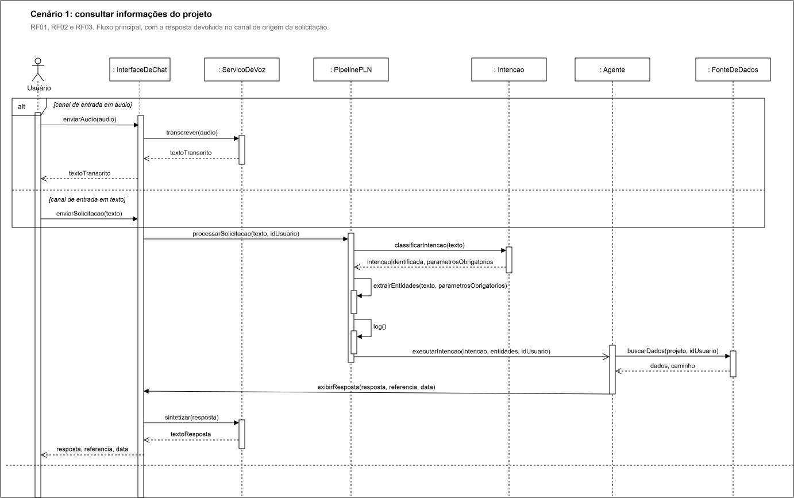

  

---

## Projeto: Azum

## Sumário

<strong>1. Entendimento de Negócio</strong>

- [1.1 Problema](#11-problema)
- [1.2 Contexto da Indústria do Parceiro](#12-contexto-da-indústria-do-parceiro)
- [1.3 Visão do Produto](#13-visão-do-produto)
- [1.4 Objetivo do Produto](#14-objetivo-do-produto)
- [1.5 Personas e Jornada do Usuário](#15-personas-e-jornada-do-usuário)
- [1.6 Fluxo do Negócio](#16-fluxo-do-negócio)
- [1.7 Brainstorming de Features](#17-brainstorming-de-features)
- [1.8 Canvas do MVP](#18-canvas-do-mvp)
- [1.9 Matriz de Risco do Projeto](#19-matriz-de-risco-do-projeto)

<strong>2. Especificação de Requisitos de Software (Sprint 1)</strong>

- [2.1 Business Drivers](#21-business-drivers)
- [2.2 Requisitos Funcionais](#22-requisitos-funcionais)
- [2.3 Requisitos Não Funcionais](#23-requisitos-não-funcionais)
- [2.4 Visão Inicial da Solução Técnica](#24-visão-inicial-da-solução-técnica)
- [2.5 Tecnologias e Ferramentas](#25-tecnologias-e-ferramentas)

- [3. Registro de Decisões](#3-registro-de-decisões)

---

# 1. Entendimento de Negócio

## 1.1 Problema

&emsp; O Metrô de São Paulo gerencia empreendimentos de elevada complexidade técnica, financeira e administrativa. Esses projetos podem durar entre oito e dez anos, envolver investimentos bilionários, mais de uma centena de contratos e produzir dezenas de milhares de documentos. Nesse cenário, o PMO Corporativo é responsável pela governança da estratégia, dos portfólios, dos programas e dos projetos da companhia, acompanhando cronogramas, marcos, riscos, problemas, indicadores, benefícios e mudanças.

&emsp; Atualmente, o Metrô já possui processos, ferramentas e práticas estabelecidas para a gestão e o armazenamento desses documentos e informações. Portanto, o desafio não está na ausência de uma estrutura de gestão documental, mas na necessidade de tornar a interação com esse grande volume de conteúdo mais simples, ágil e acessível.

&emsp; Mesmo com os documentos organizados, a localização de uma informação específica pode exigir que o profissional navegue por diferentes arquivos, listas, relatórios ou sistemas, aplique filtros e analise manualmente os resultados. Além disso, o registro de novas informações e documentos depende do acesso às ferramentas utilizadas e do preenchimento correto dos campos necessários. Essas atividades podem demandar tempo e aumentar a carga operacional das equipes, principalmente diante da quantidade e da complexidade dos projetos administrados.

&emsp; Dessa forma, o desafio consiste em oferecer uma maneira mais rápida e intuitiva de consultar e adicionar informações à estrutura de gestão já existente. Por meio de uma interação em linguagem natural, tanto por texto quanto por áudio, o usuário poderá solicitar dados sobre determinado projeto, localizar documentos, verificar riscos, marcos e pendências ou registrar novas informações sem precisar navegar manualmente por diferentes interfaces. As inclusões realizadas com o auxílio do agente, entretanto, deverão passar por validações, respeitar os campos obrigatórios e as permissões de cada usuário, além de manter a rastreabilidade das alterações.

&emsp; A dificuldade de acessar e registrar informações com agilidade pode atrasar análises, aumentar o esforço necessário para elaborar relatórios e limitar a capacidade do PMO de identificar riscos, pendências e desvios de maneira preventiva. No setor metroferroviário, em que os empreendimentos envolvem recursos públicos e afetam diretamente a mobilidade da população, a rapidez, a integridade e a confiabilidade dessas informações são fundamentais para apoiar decisões e acompanhar a entrega dos benefícios planejados.

&emsp; Portanto, o problema central que o projeto busca resolver é a necessidade de tornar mais ágil, simples e intuitiva a consulta e a adição de informações na estrutura de gestão documental já utilizada pelo Metrô. O objetivo não é substituir os processos, as ferramentas ou os profissionais responsáveis, mas reduzir o esforço manual necessário para localizar, interpretar e registrar informações relacionadas aos empreendimentos.

&emsp; Como resposta a esse desafio, o projeto considera o desenvolvimento de um agente de Inteligência Artificial capaz de compreender solicitações em linguagem natural e, por meio de integrações com o ambiente Microsoft homologado do Metrô, consultar ou registrar informações autorizadas. A solução deverá preservar os processos existentes, as regras de negócio, as permissões de acesso, a segurança e a rastreabilidade, funcionando como uma nova camada de interação com o ambiente já administrado pelo Metrô e apoiando, sem substituir, a análise e a tomada de decisão dos profissionais responsáveis.

### Matriz SWOT

&emsp; Para aprofundar a compreensão do problema e do contexto em que a solução será inserida, foi elaborada uma Matriz SWOT, ferramenta de análise estratégica que organiza os fatores internos (forças e fraquezas) e externos (oportunidades e ameaças) que influenciam o negócio. A imagem 1 apresenta a matriz elaborada para o Metrô de São Paulo, com foco na atuação do PMO Corporativo e na gestão de informações de seus empreendimentos, e os quadrantes são analisados em detalhe na sequência.

Imagem 01 - Matriz SWOT  
   
  Fonte: Material produzido pelos autores, 2026.

&emsp; A Matriz SWOT foi elaborada para analisar o contexto interno e externo do Metrô de São Paulo, com foco na atuação do PMO Corporativo e na gestão de informações relacionadas aos seus empreendimentos. As forças e fraquezas representam características internas da organização, enquanto as oportunidades e ameaças correspondem a fatores externos que podem influenciar suas atividades.

&emsp; Entre as principais forças do Metrô, destacam-se sua ampla experiência na gestão de empreendimentos de grande porte, a presença de profissionais especializados e a existência de processos consolidados de governança e gestão documental. A organização também conta com um PMO Corporativo estruturado, responsável por apoiar o acompanhamento da estratégia, dos portfólios, dos programas, dos projetos e dos indicadores. Esses elementos favorecem o controle das iniciativas e o alinhamento dos empreendimentos aos objetivos estratégicos da companhia.

&emsp; Em relação às fraquezas, a própria dimensão e complexidade das operações representam desafios internos. Os empreendimentos podem envolver longos períodos de execução, investimentos elevados, numerosos contratos e a produção de milhares de documentos. Embora o Metrô já possua ferramentas e processos para administrar essas informações, o grande volume de conteúdo pode tornar a localização, a consulta e a consolidação dos dados mais demoradas, aumentando o esforço operacional, a dependência de ações manuais de consolidação e verificação da qualidade das informações e o risco de inconsistências nos dados, o que dificulta a obtenção rápida de uma visão integrada dos projetos.

&emsp; No ambiente externo, a evolução contínua da Inteligência Artificial, do Processamento de Linguagem Natural e das tecnologias de integração de dados representa uma oportunidade relevante para o Metrô. A organização já possui iniciativas relacionadas à IA, incluindo o uso de agentes, o que demonstra abertura institucional e experiência inicial com essas tecnologias. A oportunidade, portanto, não está simplesmente em iniciar sua adoção, mas em ampliar e especializar suas aplicações de acordo com as necessidades do PMO Corporativo. Nesse contexto, essas tecnologias podem ser utilizadas para tornar a consulta às informações mais intuitiva, apoiar a identificação de prazos e pendências, comparar dados dos empreendimentos e propor conteúdos para campos que deverão ser avaliados pelos profissionais responsáveis. Essa evolução pode reduzir o esforço operacional e fortalecer a capacidade de acompanhamento e análise dos projetos, desde que seja integrada aos processos, às permissões e às regras de segurança já estabelecidos pelo Metrô.

&emsp; Entretanto, o Metrô também está exposto a ameaças externas que podem afetar a continuidade e os resultados de seus empreendimentos. Entre elas estão restrições orçamentárias, mudanças regulatórias, dependência de fornecedores, riscos relacionados à segurança da informação, atrasos em grandes obras e possíveis mudanças ou substituições na plataforma de gestão de portfólio, o que exige que novas soluções sejam flexíveis e desacopladas das ferramentas atuais. Por prestar um serviço público essencial e administrar empreendimentos financiados com recursos públicos, eventuais falhas, atrasos ou problemas de segurança podem produzir impactos financeiros, institucionais e sociais relevantes.

&emsp; A análise demonstra que o Metrô possui uma base organizacional sólida para aproveitar as oportunidades proporcionadas pela transformação digital. Sua experiência, seus profissionais especializados, seus processos consolidados e seu PMO estruturado oferecem condições favoráveis para a incorporação gradual de novas tecnologias. Ao mesmo tempo, qualquer iniciativa deve considerar a complexidade interna da organização e as ameaças existentes no ambiente externo.

&emsp;Nesse contexto, o projeto pode aproveitar as forças já existentes no Metrô para facilitar o acesso e o registro de informações, sem substituir os processos e mecanismos atuais de gestão. A implementação de uma nova camada de interação deve ocorrer de forma segura, integrada e alinhada às regras da organização, contribuindo para reduzir o esforço operacional e melhorar o apoio à tomada de decisão.

---

## 1.2 Contexto da Indústria do Parceiro

### Visão geral do setor

&emsp; O setor metroferroviário compreende o transporte público de passageiros sobre trilhos em ambientes urbanos e metropolitanos — metrôs, trens metropolitanos, monotrilhos e veículos leves sobre trilhos (VLTs). É um modal estruturante da mobilidade urbana, marcado pela alta capacidade, pela previsibilidade e pelo menor impacto ambiental por passageiro transportado. No Brasil, segundo o Balanço do Setor Metroferroviário 2024 da ANPTrilhos, a malha soma cerca de 1.137,5 km e transportou 2,57 bilhões de passageiros em 2024 (média de aproximadamente 8,6 milhões por dia), distribuídos por cerca de 49 linhas em 21 sistemas de 73 municípios — um crescimento de 3,6% em relação a 2023.

&emsp; Além do papel na mobilidade, o setor gera benefícios econômicos e ambientais expressivos: a ANPTrilhos estima, para 2024, uma economia de R$ 11,7 bilhões com a redução de congestionamentos e a emissão evitada de 2,4 milhões de toneladas de poluentes. Trata-se de uma indústria intensiva em capital, sustentada por obras de infraestrutura de longo prazo — empreendimentos plurianuais e bilionários —, que exigem forte governança de projetos e articulação entre o poder público, os operadores e a iniciativa privada.

### Tendências e desafios

&emsp; Entre as principais tendências, destaca-se a ampliação da participação privada por meio de concessões e parcerias público-privadas (PPPs) — das 16 empresas operadoras do país, 9 já são privadas —, modelo apontado pela ANPTrilhos como instrumento essencial para viabilizar a expansão da malha, a exemplo da concessão do Trem Intercidades São Paulo–Campinas, firmada em 2024. Somam-se a isso a modernização tecnológica, com sistemas de sinalização CBTC e operação automatizada (sem condutor), a adoção de monotrilhos e VLTs e a digitalização da experiência do usuário, com bilhetagem eletrônica e pagamento por aproximação e QR Code.

&emsp; Do lado dos desafios, a própria ANPTrilhos aponta a necessidade de mais incentivos regulatórios e de maior priorização de investimentos para sustentar a expansão e a modernização do setor. A esses fatores somam-se o financiamento de obras de grande porte com recursos públicos, a recuperação da demanda após a pandemia (ainda pressionada pelo teletrabalho), a complexidade de coordenar múltiplos operadores em uma mesma rede, o envelhecimento de ativos nas linhas mais antigas e a gestão de empreendimentos longos — com milhares de contratos e documentos —, que demanda controle rigoroso de prazos, custos e riscos.

### Posicionamento do parceiro no mercado

&emsp; A Companhia do Metropolitano de São Paulo (Metrô/SP), fundada em 1968, é uma sociedade de economia mista controlada pelo Governo do Estado de São Paulo e vinculada à Secretaria dos Transportes Metropolitanos. Seu papel vai além da operação: a companhia é responsável pelo planejamento, projeto, construção e operação do sistema metroviário da Região Metropolitana de São Paulo, atuando como principal articuladora da expansão da rede sobre trilhos da capital.

&emsp; Em termos de participação, o Metrô opera diretamente as Linhas 1-Azul, 2-Verde, 3-Vermelha e 15-Prata (além da 17-Ouro), que juntas transportaram mais de 821 milhões de passageiros em 2025, dentro de um sistema metroviário de cerca de 116 km e mais de 100 estações. Historicamente a espinha dorsal do transporte de alta capacidade da cidade, o Metrô hoje divide a operação da rede com concessionárias privadas — como a Linha 4-Amarela (primeira PPP metroviária do país, operada pela ViaQuatro) e as Linhas 5-Lilás, 8 e 9 (ViaMobilidade) —, mantendo, porém, o papel central de planejador e executor dos grandes empreendimentos de expansão do sistema.

**Fontes:** ANPTrilhos — [Balanço do Setor Metroferroviário 2024](https://anptrilhos.org.br/balanco-metroferroviario-2024-transporte-sobre-trilhos-cresce-e-transporta-257-bilhoes-de-passageiros/); Companhia do Metropolitano de São Paulo — [Metropolitano de São Paulo (Wikipédia)](https://pt.wikipedia.org/wiki/Metropolitano_de_S%C3%A3o_Paulo); Metrô/CPTM — [Guia do Metrô de São Paulo em 2026](https://www.metrocptm.com.br/guia-do-metro-de-sao-paulo-em-2026-linhas-operacao-e-como-usar-o-sistema/). Acesso em ago. 2026.

---

## 1.3 Visão do Produto

### Descrição geral

&emsp; O produto consiste em um agente inteligente de apoio à gestão do portfólio de projetos, desenvolvido para auxiliar os profissionais do Metrô de São Paulo no acompanhamento dos empreendimentos administrados pelo PMO Corporativo. Sua finalidade é facilitar a consulta, a interpretação e o acompanhamento das informações dos projetos, proporcionando uma interação mais simples e intuitiva por meio de linguagem natural.
&emsp; No MVP, o agente utilizará um pipeline de Processamento de Linguagem Natural desenvolvido e avaliado pela equipe. Esse pipeline será responsável por interpretar as solicitações dos usuários, identificar suas intenções e classificá-las de acordo com os tipos de interação definidos, como consultas, transações ou alertas. As intenções serão controladas por um catálogo aceitável de interações sobre os projetos da empresa: solicitações genéricas ou sem relação com o contexto do portfólio deverão ser detectadas, e o usuário será orientado sobre as interações possíveis, evitando respostas fora do escopo do agente.
 &emsp; Por meio de uma interface conversacional, o profissional poderá fazer perguntas relacionadas aos projetos, incluindo dúvidas sobre documentos, prazos, marcos, riscos, pendências, avanço e situação dos empreendimentos, além de dúvidas sobre conceitos e normativos relativos à gestão de portfólio, programas e projetos. O agente consultará as fontes integradas e apresentará respostas estruturadas com base nas informações disponíveis. Também poderá comparar projetos, apoiar análises relacionadas ao acompanhamento do portfólio e à aderência aos normativos aplicáveis e gerar prévias de relatórios de status e de apresentações para a diretoria a partir dos dados disponíveis.
&emsp; A interação com o agente ocorrerá primariamente por linguagem natural escrita, e a solicitação por voz também integra o escopo do produto: por meio da conversão de áudio em texto, as mensagens faladas serão encaminhadas ao mesmo pipeline de PLN, permitindo que o profissional interaja com o agente da forma que lhe for mais conveniente.
 &emsp; Além de responder às solicitações, o agente poderá oferecer apoio proativo aos profissionais. A partir dos dados disponíveis, poderá identificar e comunicar situações que mereçam atenção, como a proximidade ou o vencimento de prazos, a ausência de documentos esperados, a existência de campos incompletos e outras pendências relacionadas aos projetos. Esses alertas terão caráter informativo e servirão como apoio ao acompanhamento realizado pelo PMO.
 &emsp; O agente também poderá apoiar a entrada de dados. Ao identificar uma solicitação de transação, como o registro de uma nova informação ou a criação de um projeto, o agente analisará os dados disponíveis e apresentará, na própria conversa, uma sugestão estruturada de preenchimento dos campos correspondentes. No MVP, entretanto, essas propostas terão caráter exclusivamente sugestivo: o agente não preencherá, alterará ou salvará informações em nenhuma base, cabendo ao profissional avaliar a sugestão e, se desejar, efetuar o registro por meio das ferramentas oficiais. Dessa forma, a categoria de transação é contemplada na identificação de intenções e no apoio ao preenchimento, preservando integralmente a responsabilidade humana sobre as informações registradas.
 &emsp; Para desenvolver e validar o MVP de maneira segura, serão utilizados dados sintéticos que representem situações e informações do contexto do PMO. Portanto, o produto não será integrado ao portfólio real do Metrô nesta etapa, não utilizará dados corporativos sensíveis e não será implantado em ambiente de produção. A integração com os sistemas reais poderá ser considerada como uma evolução posterior do projeto.
&emsp; A solução deverá considerar o ecossistema tecnológico da Microsoft, especialmente ferramentas como o Microsoft Copilot Studio e a Power Platform, que atuarão como camada de orquestração e integração do agente, assegurando aderência ao ambiente homologado pelo Metrô e a possibilidade de sustentação e evolução da solução pela própria equipe interna.
&emsp; O produto funcionará como uma camada inteligente de consulta, orientação e apoio ao acompanhamento dos projetos. Ele não substituirá os sistemas corporativos, os processos de governança nem a avaliação dos profissionais do Metrô. Seu papel será auxiliar o profissional a encontrar, compreender e analisar informações, preservando as regras de acesso, a confidencialidade e a rastreabilidade das interações.

### O que o produto FAZ (escopo)

| # | Funcionalidade | Descrição |
|---|---|---|
| 1 | Interação em linguagem natural por texto | Recebe solicitações escritas em linguagem natural por meio de uma interface conversacional. |
| 2 | Interação por voz | Aceita solicitações faladas, convertendo o áudio em texto e encaminhando-o ao mesmo pipeline de processamento. |
| 3 | Interpretação e classificação de intenções | Interpreta as solicitações por meio de um pipeline de PLN desenvolvido pela equipe, identifica a intenção do usuário e a classifica como consulta, transação ou alerta. |
| 4 | Controle do catálogo de intenções | Detecta solicitações genéricas ou fora do contexto do portfólio e orienta o usuário sobre o catálogo de interações aceitáveis, recusando interações fora de escopo. |
| 5 | Consulta a informações dos projetos | Responde a dúvidas sobre documentos, prazos, marcos, riscos, pendências, avanço e situação dos projetos, utilizando dados sintéticos. |
| 6 | Esclarecimento de conceitos e normativos | Responde a dúvidas sobre conceitos e normativos relativos à gestão de portfólio, programas e projetos. |
| 7 | Análises e comparações | Compara informações entre projetos do portfólio e apoia análises sobre status e aderência a normativos. |
| 8 | Prévias de relatórios | Gera prévias de relatórios de status e de apresentações para a diretoria a partir dos dados disponíveis. |
| 9 | Respostas estruturadas com referências | Apresenta respostas claras e estruturadas, indicando as fontes ou referências utilizadas quando disponíveis, e informa quando não existem dados suficientes para uma resposta confiável. |
| 10 | Alertas e apoio proativo | Alerta sobre prazos próximos ou vencidos, sinaliza documentos esperados ausentes, identifica campos incompletos e demais pendências, e oferece ajuda proativa conforme o contexto identificado. |
| 11 | Sugestões de preenchimento | Identifica solicitações de transação e apresenta, no chat, sugestões estruturadas de preenchimento de campos e registros, permitindo que o profissional as avalie antes de qualquer registro. |
| 12 | Segurança e governança das interações | Respeita as permissões de cada perfil, a confidencialidade das informações e a rastreabilidade das interações. |

### O que o produto NÃO FAZ (fora de escopo)

| # | Item fora do escopo | Justificativa |
|---|---|---|
| 1 | Utilizar dados reais ou sensíveis do Metrô | Restrição de confidencialidade do parceiro: nenhum dado sensível pode ser processado fora de ambientes homologados; o MVP é validado exclusivamente sobre dados sintéticos. |
| 2 | Integrar-se ao portfólio real ou ser implantado em produção | O TAPI delimita a integração com o portfólio real como evolução posterior ("Ir Além"); o MVP é uma prova de conceito em ambiente controlado. |
| 3 | Preencher, alterar, salvar ou excluir informações automaticamente em qualquer base ou sistema | Decisão de projeto para preservar a responsabilidade humana: as transações geram apenas sugestões no chat, e o registro é efetuado pelo profissional nas ferramentas oficiais. |
| 4 | Executar automaticamente as sugestões apresentadas | O profissional deve avaliar e decidir sobre cada sugestão, mantendo-se como responsável final pelas informações registradas. |
| 5 | Tomar decisões técnicas, administrativas ou estratégicas, ou aprovar documentos, riscos, prazos e ações de governança | O agente tem caráter de apoio: decisões e aprovações permanecem sob responsabilidade dos profissionais e dos processos de governança do Metrô. |
| 6 | Substituir os sistemas, processos ou profissionais do Metrô | O produto é uma camada adicional de interação sobre a estrutura existente, e não um substituto dela. |
| 7 | Permitir acesso a informações incompatíveis com as permissões do usuário | Exigência de confidencialidade e controle de acesso por perfil definida pelo parceiro. |
| 8 | Responder a solicitações fora do catálogo de intenções | O TAPI determina que interações genéricas ou sem contexto sejam detectadas, orientadas e descartadas. |
| 9 | Garantir respostas conclusivas com dados ausentes, incompletos ou desatualizados, ou prever com certeza resultados futuros | Limitação inerente à natureza da solução: as respostas dependem da qualidade dos dados disponíveis, e o agente sinaliza incertezas em vez de ocultá-las. |
| 10 | Contemplar todos os documentos, processos e possibilidades do ambiente corporativo | Delimitação necessária de escopo para um MVP acadêmico com prazo definido; a cobertura completa é evolução futura. |

#### Delimitação do MVP
 &emsp;  O MVP será destinado à validação do pipeline de PLN e das principais formas de interação do agente em um ambiente controlado, utilizando dados sintéticos. O foco estará na capacidade de compreender solicitações por texto e por voz, responder a consultas, apoiar comparações, emitir alertas e sugerir o preenchimento de campos, sempre mantendo o profissional como responsável pela avaliação, pelo registro das informações e pela decisão final.
&emsp; Em síntese: no MVP, o agente consulta, interpreta, compara, responde, alerta e sugere preenchimentos utilizando dados sintéticos. O profissional analisa, registra e decide. A integração com o portfólio real, o preenchimento automático de qualquer base, o uso de dados sensíveis e a implantação em produção ficam fora do escopo.

## 1.4 Objetivo do Produto

&emsp; O objetivo geral do produto é reduzir o esforço manual necessário para consultar, interpretar e registrar informações dos projetos administrados pelo PMO Corporativo do Metrô de São Paulo, por meio de um agente de Inteligência Artificial capaz de compreender solicitações em linguagem natural, escrita e por voz, e de responder com informações estruturadas, alertas e sugestões de preenchimento, preservando os processos, as permissões e a rastreabilidade já estabelecidos pela companhia.

&emsp; Esse objetivo foi formulado a partir da conclusão central da análise do problema: o desafio do Metrô não está na ausência de uma estrutura de gestão, mas no custo operacional de interagir com ela. Por essa razão, o objetivo não propõe a substituição de sistemas, processos ou profissionais, e sim a redução do atrito entre o profissional e a informação, atuando exatamente sobre os pontos em que a análise identificou esforço manual: a localização de informações dispersas em diferentes arquivos, listas e sistemas, a consolidação de análises e o registro de novos dados. O objetivo geral desdobra-se nas seguintes metas específicas, alinhadas ao problema identificado e às necessidades do negócio:

* **Agilizar o acesso à informação:** permitir que o profissional obtenha dados sobre documentos, prazos, marcos, riscos, pendências e avanço dos projetos por meio de uma única interface conversacional, reduzindo o tempo gasto na navegação manual por diferentes arquivos, listas, relatórios e sistemas;
* **Compreender corretamente as solicitações dos usuários:** desenvolver e avaliar um pipeline de Processamento de Linguagem Natural capaz de identificar as intenções dos usuários e classificá-las como consultas, transações ou alertas, com desempenho acompanhado por métricas de classificação a cada iteração, detectando e orientando solicitações genéricas ou fora do catálogo de interações aceitáveis;
* **Apoiar a análise dos projetos:** oferecer respostas estruturadas sobre os projetos do portfólio e prévias de relatórios de status e apresentações, apoiando decisões mais ágeis e fundamentadas em evidências;
* **Fortalecer o acompanhamento preventivo do portfólio:** identificar e comunicar proativamente prazos próximos ou vencidos, documentos ausentes, campos incompletos e demais pendências, ampliando a capacidade do PMO de antecipar riscos e desvios;
* **Apoiar a qualidade da entrada de dados:** apresentar sugestões estruturadas de preenchimento de campos e registros a partir das solicitações de transação, contribuindo para a redução de erros e inconsistências, mantendo o profissional como responsável pelo registro e pela decisão final;
* **Garantir conformidade com as restrições do parceiro:** validar a solução exclusivamente sobre dados sintéticos, respeitando as permissões de acesso por perfil, a confidencialidade das informações e a rastreabilidade das interações, sem trânsito de dados por serviços externos não homologados;
* **Assegurar aderência e sustentabilidade tecnológica:** conceber a solução sobre o ecossistema Microsoft (Copilot Studio / Power Platform), de forma que possa ser operada, mantida e evoluída pela própria equipe do Metrô, com flexibilidade para permanecer funcional diante de eventuais mudanças na plataforma de portfólio.

&emsp; Para evidenciar o alinhamento entre as metas, o problema identificado e as necessidades do negócio, a tabela a seguir apresenta a rastreabilidade de cada meta em relação ao aspecto do problema que a origina e ao benefício esperado pelo parceiro que ela atende, conforme registrado no TAPI:

Tabela x - Rastreabilidade entre metas, problema e benefícios esperados pelo parceiro

| Meta | Origem no problema | Benefício esperado pelo parceiro |
|---|---|---|
| Agilizar o acesso à informação | Navegação manual por diferentes arquivos, listas, relatórios e sistemas | Eficiência; Transparência |
| Compreender as solicitações dos usuários | Viabilizador técnico da interação em linguagem natural (núcleo do MVP) | Precisão |
| Apoiar a análise dos projetos | Consolidação manual de documentos e análises | Capacidade analítica e suporte à decisão; Relatórios automatizados |
| Fortalecer o acompanhamento preventivo | Limitação da capacidade do PMO de identificar riscos e desvios preventivamente | Proatividade |
| Apoiar a qualidade da entrada de dados | Registro de informações trabalhoso e suscetível a erros e inconsistências | Precisão |
| Garantir conformidade com as restrições | Exigências de confidencialidade, permissões por perfil e rastreabilidade | Confidencialidade; Rastreabilidade |
| Assegurar aderência e sustentabilidade tecnológica | Premissa de possível troca da plataforma de portfólio | Interoperabilidade e integração; Sustentação e autonomia da equipe interna |

Fonte: Material produzido pelos autores, 2026.

&emsp; Em conjunto, essas metas respondem diretamente ao problema central identificado: tornar mais ágil, simples e intuitiva a interação com a estrutura de gestão de portfólio já existente. Ao permitir que a informação seja consultada, analisada e sugerida por meio de linguagem natural, o produto atua sobre o esforço manual que hoje consome o tempo das equipes, gerando eficiência, precisão e apoio à tomada de decisão, ao mesmo tempo em que preserva as permissões, a confidencialidade e a rastreabilidade exigidas pela companhia. Alcançar esse objetivo significa, portanto, entregar ao PMO Corporativo não um substituto de seus sistemas, processos ou profissionais, mas uma camada de interação que amplia a capacidade da estrutura já existente, liberando as equipes para as atividades analíticas e estratégicas que efetivamente dependem do julgamento humano.

## 1.5 Personas e Jornada do Usuário

### Persona 1: Robson Oliveira — Diretor

Imagem 1.5 - Persona 1: Robson Oliveira — Diretor 
   
  Fonte: Material produzido pelos autores, 2026.

### Caracterização

Robson Oliveira é diretor e acompanha projetos estratégicos do Metrô, tendo como uma de suas principais responsabilidades tomar decisões relacionadas ao andamento e aos resultados das iniciativas sob sua gestão. Para isso, precisa ter uma visão ampla dos projetos, acompanhando informações como status, indicadores, riscos, prazos e marcos.

Sua rotina envolve lidar com informações provenientes de diferentes projetos, documentos e sistemas. Nesse contexto, o acesso rápido e confiável aos dados é importante para que consiga compreender a situação dos projetos e identificar possíveis impactos para a organização.

### Dores

Uma das principais dificuldades de Robson é encontrar informações distribuídas entre diferentes documentos e sistemas. A necessidade de consultar diferentes fontes pode tornar a busca por informações atualizadas mais demorada, principalmente quando é necessário obter uma visão geral do portfólio.

Outra dificuldade está na comparação entre projetos. Sem uma forma centralizada de consultar e relacionar as informações, pode ser mais difícil identificar semelhanças, diferenças, riscos e situações que mereçam atenção.

### Interesses no Sistema

Robson tem interesse em consultar rapidamente o status e os indicadores dos projetos, obtendo uma visão geral do andamento das iniciativas. Também busca acompanhar riscos, prazos e marcos, de forma a identificar possíveis impactos para a organização com antecedência.

Além disso, tem interesse em comparar diferentes projetos do portfólio, utilizando essas informações como apoio para suas decisões estratégicas. Por ocupar uma posição de nível executivo, seu foco está menos nos detalhes operacionais de cada projeto e mais em uma visão consolidada e confiável que oriente suas decisões.

### Expectativas em relação à solução

Robson espera conseguir consultar as informações dos projetos de maneira simples e rápida, sem precisar realizar buscas manuais em diferentes documentos e sistemas. Também espera que as informações apresentadas sejam organizadas e contextualizadas de acordo com o projeto consultado.

A possibilidade de realizar consultas utilizando linguagem natural, por texto ou voz, facilita a interação com a solução e permite que o usuário formule perguntas de acordo com a necessidade do momento.

### Relação da persona com o produto

A persona de Robson representa o **Diretor**, que utiliza o agente para obter uma visão estratégica e consolidada do portfólio de projetos. Seu papel é acompanhar o desempenho geral das iniciativas, identificar riscos, avanços e possíveis impactos para a organização, utilizando essas informações como apoio à tomada de decisões. O Diretor utiliza a solução principalmente para **obter uma visão estratégica do conjunto de projetos e apoiar decisões de nível executivo**.

### Jornada do Usuário 1.5.1 — [Robson Oliveira - Diretor]

Imagem 1.5.1 - Jornada do Usuário — Robson Oliveira - Diretor 
   
  Fonte: Material produzido pelos autores, 2026.

### Cenário

Robson precisa acompanhar o andamento de projetos estratégicos do Metrô, mas as informações estão espalhadas entre diferentes documentos e sistemas, dificultando uma visão rápida e confiável para suas decisões.

### Necessidade

A jornada de Robson começa com a identificação da necessidade de se atualizar sobre um ou mais projetos, geralmente motivada por reuniões de diretoria, cobranças de stakeholders ou pela própria rotina de acompanhamento. Nesse momento, sua principal dificuldade é lidar com informações espalhadas entre documentos e sistemas, o que representa uma oportunidade para a solução centralizar essas informações em um único ponto de consulta.

### Consulta

Em seguida, Robson formula uma pergunta em linguagem natural, por texto ou voz, sobre o projeto de seu interesse. Nessa etapa, a principal dor está na demora para acessar informações atualizadas dos projetos, o que a solução busca resolver ao permitir consultas rápidas e diretas por meio do agente.

### Análise

Com a resposta em mãos, Robson avalia as informações recebidas, como status, riscos e prazos dos projetos. Nessa etapa, sua principal necessidade é compreender as informações de forma clara e organizada, facilitando a identificação de pontos que possam exigir sua atenção ou influenciar suas decisões.

### Comparação

Quando necessário, Robson compara diferentes projetos do portfólio para identificar riscos e prioridades. Essa etapa representa o ponto de maior satisfação na jornada, já que a possibilidade de comparação direta entre projetos supera uma das principais dores relatadas por Robson: a dificuldade em comparar projetos e visualizar o portfólio como um todo.

### Decisão

Por fim, com base nos dados consolidados, Robson toma sua decisão estratégica, geralmente no contexto de uma reunião de diretoria ou na definição de próximos passos. Ao contar com dados confiáveis e atualizados, a insegurança de decidir com base em informações incompletas é reduzida, tornando o processo mais ágil e permitindo que Robson utilize o agente como apoio, mantendo a decisão sob sua responsabilidade.

### Experiência do cliente ao longo da jornada

A experiência de Robson evolui de forma crescente ao longo da jornada: parte de um sentimento mais neutro/insatisfeito nas etapas iniciais, quando ainda lida com a dispersão das informações, e cresce progressivamente até atingir o pico de satisfação nas etapas de Comparação e Decisão, momento em que consegue consolidar as informações e tomar decisões estratégicas com mais confiança e agilidade.

---

### Persona 2: Maria Eduarda Santos — Analista de PMO

Imagem 1.5.2 - Persona 2: Maria Eduarda Santos — Analista de PMO 
   
  Fonte: Material produzido pelos autores, 2026.

### Caracterização

Maria Eduarda Santos é analista do PMO Corporativo do Metrô e atua diretamente na gestão do portfólio de projetos, sendo responsável por manter os dados atualizados, cobrar os responsáveis por pendências de preenchimento e consolidar informações para relatórios e apresentações destinadas à diretoria. Diferentemente de uma visão puramente estratégica, seu trabalho está concentrado na operação diária da governança do portfólio, servindo como elo entre os líderes de projeto e os níveis mais altos da organização.

Sua rotina envolve acompanhar o cumprimento dos prazos mensais de atualização de status, verificar a qualidade dos dados registrados pelas equipes de projeto e apoiar a elaboração de relatórios consolidados. Nesse contexto, ter acesso rápido a informações atualizadas e confiáveis é essencial para que consiga cumprir suas próprias entregas sem depender inteiramente da boa vontade e da disponibilidade dos responsáveis por cada projeto.

### Dores

Uma das principais dificuldades de Maria Eduarda é a necessidade de cobrar manualmente, um a um, os responsáveis por atualizações pendentes, especialmente próximo ao prazo mensal de registro de status. Essa cobrança repetitiva consome tempo que poderia ser dedicado a atividades de maior valor analítico.

Outra dificuldade está na consolidação de dados espalhados entre diferentes sistemas e documentos, como listas do SharePoint, planilhas de Excel e arquivos de Word, processo necessário para a elaboração de relatórios de status e apresentações mensais. A ausência de um mecanismo proativo que sinalize riscos, marcos e pendências antes que se tornem problemas também obriga Maria Eduarda a atuar de forma reativa, identificando falhas apenas quando já se tornaram visíveis.

### Interesses no Sistema

Maria Eduarda tem interesse em consultar e comparar projetos do portfólio sem precisar navegar manualmente pelas listas do SharePoint, obtendo respostas rápidas e organizadas conforme sua necessidade do momento.

Além disso, busca receber alertas proativos sobre marcos, riscos e pendências de preenchimento, de modo a agir antes do prazo, em vez de depender inteiramente da própria iniciativa para lembrar cada responsável. Também tem interesse em contar com apoio na elaboração de relatórios de status e de apresentações mensais para a diretoria, a partir de templates já utilizados pela equipe, e em receber sugestões de conteúdo para campos pendentes, mantendo o controle final sobre o que é efetivamente registrado.

### Expectativas em relação à solução

Maria Eduarda espera que a solução reduza o esforço manual envolvido na cobrança de atualizações e na consolidação de dados, permitindo que ela dedique mais tempo à análise da qualidade das informações e menos à busca e à repetição de tarefas operacionais.

A possibilidade de interagir por linguagem natural, por texto ou voz, aliada a alertas proativos e sugestões de preenchimento, é vista como um fator que aumenta sua produtividade e reduz o risco de pendências passarem despercebidas até próximo do prazo.

### Relação da persona com o produto

A persona de Maria Eduarda representa o **Analista de PMO**, responsável pela operação diária da governança do portfólio. Ela utiliza o agente tanto para **consultar e comparar o andamento dos projetos** quanto para **cobrar, apoiar o preenchimento e consolidar informações** que alimentam os relatórios e as apresentações destinadas à diretoria. O Analista de PMO utiliza a solução principalmente para **reduzir o esforço manual de acompanhamento e cobrança, ganhando tempo para atividades de maior valor analítico dentro do portfólio**.

### Jornada do Usuário 1.5.2 — Maria Eduarda Santos - Analista de PMO

Imagem 1.5.2.1 - Jornada do Usuário — Maria Eduarda Santos - Analista de PMO 
   
  Fonte: Material produzido pelos autores, 2026.

### Cenário

Maria Eduarda precisa manter os dados dos projetos atualizados e cobrar os responsáveis antes dos prazos mensais, mas hoje isso depende de acompanhamento manual e de navegação por diferentes sistemas e documentos, consumindo tempo que faltaria à análise e à consolidação das informações.

### Identificação

A jornada de Maria Eduarda começa com a identificação de quais projetos estão com pendência de atualização, geralmente próximo ao prazo mensal de registro de status, fixado até o dia 10 de cada mês. Nessa etapa, sua principal dificuldade está na falta de alertas automáticos que sinalizem pendências antes do prazo, o que representa uma oportunidade para a solução notificar proativamente Maria Eduarda sobre o que precisa ser atualizado.

### Cobrança

Em seguida, Maria Eduarda cobra manualmente cada responsável pelo preenchimento das informações pendentes, geralmente por e-mail ou mensagem. Nessa etapa, a principal dor está na cobrança repetitiva, feita um a um, o que a solução busca resolver ao automatizar lembretes e cobranças por meio do agente.

### Preenchimento

Com os responsáveis notificados, Maria Eduarda acompanha o preenchimento dos campos pendentes nas listas do SharePoint e nos documentos de projeto, muitas vezes precisando orientar os responsáveis sobre o que e como preencher. Nessa etapa, sua principal dificuldade é a ausência de apoio para preencher campos de forma padronizada, o que a solução busca resolver ao sugerir conteúdo para os campos pendentes a partir da interação com o usuário responsável.

### Consolidação

Na sequência, Maria Eduarda consolida os dados atualizados em relatórios de status e apresentações mensais para a diretoria. Sua principal dificuldade é o tempo gasto reunindo informações espalhadas entre diferentes sistemas e documentos. Nessa etapa, a solução pode consolidar automaticamente os dados com rastreabilidade de fonte, reduzindo o esforço manual de montagem dos relatórios.

### Entrega

Por fim, Maria Eduarda entrega o material consolidado ao PMO e à diretoria, respondendo a questionamentos sobre o andamento do portfólio. Essa etapa representa o ponto de maior satisfação na jornada, pois, ao contar com dados atualizados e rastreáveis, reduz-se o risco de entregar informação desatualizada ou incompleta, tornando a entrega mais segura e ágil.

### Experiência do cliente ao longo da jornada

A experiência de Maria Eduarda evolui de forma crescente ao longo da jornada: parte de um sentimento mais neutro/insatisfeito nas etapas iniciais, quando ainda lida com a falta de alertas e a cobrança manual e repetitiva, e cresce progressivamente até atingir o pico de satisfação na etapa de Entrega, momento em que consegue reportar o andamento do portfólio com mais confiança, agilidade e rastreabilidade.

---

### Persona 3: Rafael Antunes — Líder de Projeto

Imagem 1.5.3 - Persona 3: Rafael Antunes — Líder de Projeto 
   
  Fonte: Material produzido pelos autores, 2026.

### Caracterização

Rafael Antunes é líder de um empreendimento específico do Metrô e responde pela sua condução no dia a dia, sendo responsável por acompanhar o cronograma, os marcos, os contratos, os riscos e as entregas do projeto sob sua gestão. Diferentemente de uma visão ampla de portfólio, seu foco está na profundidade de um único empreendimento, do qual é a principal fonte de informações.

Sua rotina envolve manter as informações do projeto atualizadas nos sistemas do PMO, responder a demandas da diretoria e do próprio PMO e fazer a ponte entre as equipes de execução — como obra e fornecedores — e a governança da companhia. Nesse contexto, registrar e localizar rapidamente as informações do empreendimento é essencial para acompanhar o andamento e responder com agilidade às demandas.

### Dores

Uma das principais dificuldades de Rafael é o tempo gasto atualizando manualmente status, marcos e riscos em diferentes listas e sistemas. Essa atividade operacional, somada ao retrabalho necessário para consolidar as informações do projeto em relatórios e apresentações, reduz o tempo disponível para a gestão do empreendimento.

Além disso, Rafael lida frequentemente com cobranças do PMO por atualizações pendentes e com a dificuldade de localizar documentos e contratos específicos do seu projeto em meio ao grande volume de informações.

### Interesses no Sistema

Rafael tem interesse em registrar e atualizar status, marcos, riscos e pendências do seu projeto por meio de linguagem natural, por texto ou voz, contando com validação dos campos e rastreabilidade das alterações. Também busca consultar rapidamente documentos, contratos e o histórico do empreendimento sob sua responsabilidade.

Ademais, tem interesse em gerar o status do projeto com menos esforço e em não perder prazos de atualização, mantendo as informações sempre consistentes e disponíveis para o PMO e a diretoria.

### Expectativas em relação à solução

Rafael espera conseguir registrar e consultar as informações do seu empreendimento de maneira simples e rápida, sem precisar navegar manualmente por diversos sistemas e documentos. Também espera que o preenchimento das informações seja apoiado pela solução, com sugestões de conteúdo que ele possa validar, respeitando as permissões de acesso e os campos obrigatórios.

A possibilidade de interagir por linguagem natural, aliada à manutenção da rastreabilidade das alterações, é vista como um fator que reduz o esforço operacional e aumenta a confiabilidade das informações registradas.

### Relação da persona com o produto

A persona de Rafael representa o **Líder de Projeto**, responsável por um empreendimento específico do Metrô. Ele utiliza o agente tanto para **registrar e manter atualizadas as informações do seu projeto** quanto para consultá-las rapidamente, sendo a principal fonte dos dados que alimentam a governança do PMO e as decisões da diretoria. O Líder de Projeto utiliza a solução principalmente para **reduzir o esforço operacional de registro e consulta das informações do seu empreendimento, dedicando mais tempo à gestão e à entrega do projeto**.

### Jornada do Usuário 1.5.3 — Rafael Antunes - Líder de Projeto

Imagem 1.5.3.1 - Jornada do Usuário — Rafael Antunes - Líder de Projeto 
   
  Fonte: Material produzido pelos autores, 2026.

### Cenário

Rafael precisa manter as informações do seu empreendimento sempre atualizadas e responder a demandas do PMO e da diretoria, mas registrar e localizar esses dados exige navegar por diferentes sistemas e documentos, consumindo tempo que faltaria à gestão do projeto.

### Acompanhamento

A jornada de Rafael começa com o acompanhamento contínuo do andamento do seu empreendimento, momento em que identifica o que precisa ser registrado ou atualizado, como um avanço, um atraso, um novo risco ou uma pendência. Nessa etapa, sua principal dificuldade está nas informações do projeto dispersas entre documentos e sistemas, o que representa uma oportunidade para a solução oferecer alertas proativos sobre prazos e pendências do próprio projeto.

### Consulta

Em seguida, Rafael consulta rapidamente documentos, contratos, riscos e o status atual do seu projeto, formulando perguntas em linguagem natural, por texto ou voz. Nessa etapa, a principal dor está na necessidade de navegar por várias listas, pastas e sistemas para localizar a informação, o que a solução busca resolver ao oferecer uma consulta unificada e contextualizada do empreendimento.

### Registro

Com as informações em mãos, Rafael registra ou atualiza o status, os marcos, os riscos e as pendências do projeto em linguagem natural. Nessa etapa, sua principal dor é o preenchimento manual e demorado em diversos campos e sistemas, além do retrabalho envolvido. A solução atua nesse ponto ao oferecer um registro assistido, com sugestão de campos, validação, respeito às permissões e rastreabilidade das alterações.

### Consolidação

Na sequência, Rafael consolida as informações do projeto para gerar relatórios e apresentações de status. Sua principal dificuldade é montar o relatório manualmente, reunindo dados espalhados em diferentes fontes. Nessa etapa, a solução pode gerar prévias de relatório a partir dos dados já atualizados e rastreáveis, reduzindo o esforço de consolidação.

### Reporte

Por fim, Rafael reporta o andamento do projeto ao PMO e à diretoria, respondendo a questionamentos sobre o empreendimento. Essa etapa representa o ponto de maior satisfação da jornada, pois, ao contar com dados confiáveis, atualizados e rastreáveis, reduz-se o risco de reportar informações desatualizadas ou inconsistentes, tornando o reporte mais seguro e ágil.

### Experiência do cliente ao longo da jornada

A experiência de Rafael evolui de forma crescente ao longo da jornada: parte de um sentimento mais neutro/insatisfeito nas etapas iniciais, quando ainda lida com a dispersão das informações e o esforço manual de registro, e cresce progressivamente até atingir o pico de satisfação na etapa de Reporte, momento em que consegue reportar o andamento do projeto com mais confiança, agilidade e rastreabilidade.

---

## 1.6 Fluxo do Negócio

### Cadeia de valor

<!-- Modelagem da cadeia de valor dos processos relacionados ao contexto do projeto. -->

[Descrição da cadeia de valor...]

### Fluxo do Business Process Model and Notation (BPMN)

&emsp; Esta seção modela, em notação BPMN, o fluxo de consulta e registro de informações do portfólio de projetos do Metrô de São Paulo em dois momentos: o processo como ocorre atualmente (AS-IS) e o processo com a solução proposta incorporada (TO-BE). É a comparação entre os dois diagramas que evidencia a contribuição do produto — não pela substituição das atividades ou dos responsáveis, que permanecem os mesmos, mas pela redução do atrito na interação com a informação, preservando os processos, as permissões e a rastreabilidade já estabelecidos pela companhia.

&emsp; O primeiro diagrama representa o fluxo atual. A interação parte da necessidade de informação do usuário, que acessa o agente disponível no Microsoft Studio e formula sua demanda clicando em blocos de texto pré-definidos ou enviando uma mensagem escrita. A plataforma filtra os dados conforme a pergunta, consulta o catálogo de portfólios e exibe as informações encontradas. O ponto crítico do fluxo está no gateway "Conseguiu a resposta?": quando a demanda não é atendida, não há tratamento previsto — o usuário retorna ao início e reformula a solicitação por conta própria, repetindo o ciclo até obter o que precisa ou desistir.

  FIGURA 1.6.1 - Fluxo de gestão de portfólio de projetos (AS-IS) 
   
  Fonte: material produzido pelos autores (2026).

&emsp; O segundo diagrama representa o mesmo fluxo com a solução incorporada. A necessidade do usuário e a responsabilidade pelas decisões permanecem inalteradas; o que muda é a forma de interação, que passa a ocorrer por linguagem natural — texto ou áudio — sobre a plataforma de portfólio já administrada pelo Metrô. Uma camada de Processamento de Linguagem Natural transcreve o áudio quando necessário, pré-processa e normaliza o texto e classifica a intenção do usuário. Caso a intenção não seja compreendida, o fluxo não termina em falha silenciosa: o agente devolve perguntas de esclarecimento e só encerra a sessão se não houver resposta. Reconhecida a intenção, o fluxo se divide entre consulta e inserção de informação, e a resposta é devolvida ao usuário.

  FIGURA 1.6.2 - Fluxo de gestão de portfólio de projetos (TO-BE) 
   
  Fonte: material produzido pelos autores (2026).

**Principais diferenças entre os fluxos:**

| Aspecto | AS-IS | TO-BE |
| --- | --- | --- |
| Forma de entrada | Blocos de texto pré-definidos ou mensagem escrita | Linguagem natural, por texto ou áudio |
| Interpretação da demanda | Filtragem direta a partir da pergunta | Pré-processamento, normalização e classificação da intenção |
| Demanda não compreendida | Usuário retorna ao início e reformula por conta própria | Agente devolve perguntas de esclarecimento antes de encerrar |
| Operações suportadas | Consulta de informação | Consulta e inserção de informação |
| Encerramento | Depende de o usuário obter a resposta por tentativa e erro | Sessão encerrada explicitamente, com resposta ou por ausência de retorno |

&emsp; A leitura conjunta dos dois diagramas mostra que o ganho não está em acrescentar etapas ao processo, e sim em deslocar para o agente o esforço que hoje recai sobre o usuário: interpretar a demanda, reformular a pergunta quando o resultado não satisfaz e navegar pela estrutura até localizar a informação. As atividades de negócio e a decisão final permanecem sob responsabilidade dos profissionais do Metrô, conforme delimitado na seção 1.3.

---

## 1.7 Brainstorming de Features

&emsp; O brainstorming de features é uma técnica de levantamento de ideias na qual as funcionalidades possíveis para um produto são registradas de forma ampla, antes de qualquer filtro de escopo, para em seguida serem avaliadas e priorizadas. Essa prática permite que o grupo visualize o universo completo de possibilidades da solução, das capacidades essenciais ao MVP até os desejos de longo prazo do parceiro, e tome decisões de sequenciamento fundamentadas, em vez de definir o escopo de maneira implícita ou arbitrária. Nesta seção, são apresentados o registro das ideias levantadas, os critérios adotados para a priorização e a classificação de cada feature quanto ao seu planejamento no projeto.

&emsp; A partir da análise do TAPI (Termo de Abertura de Projeto Inteli), das discussões internas do grupo e dos desejos manifestados pelo parceiro, foi realizado um brainstorming de funcionalidades para o agente de IA. Nessa etapa, todas as ideias foram registradas, incluindo aquelas que extrapolam o escopo do MVP, como as funcionalidades que dependem da integração com o portfólio real do Metrô ou de aprovações de compliance da companhia. O objetivo desse registro é duplo: sequenciar o desenvolvimento das features viáveis dentro do módulo e preservar, para o parceiro, as ideias que podem orientar evoluções futuras da solução, ainda que não sejam satisfeitas nesta etapa.

&emsp; Cada feature foi avaliada qualitativamente em dois critérios. A importância expressa o valor da funcionalidade para o problema identificado e para os benefícios esperados pelo parceiro, e a viabilidade expressa a capacidade de entrega dentro do módulo, considerando o esforço técnico, as dependências externas e as restrições de confidencialidade. A ordem de prioridade foi definida pela importância, com a viabilidade como critério de desempate, e ajustada pelas dependências técnicas entre as features: as funcionalidades do pipeline de Processamento de Linguagem Natural antecedem todas as demais por constituírem pré-requisito delas. Por fim, a coluna de planejamento classifica o destino de cada feature em quatro categorias: MVP, para as funcionalidades desenvolvidas e validadas dentro do módulo; simulação no MVP, para aquelas cujos mecanismos serão demonstrados sobre a base sintética por dependerem da infraestrutura corporativa real; evolução futura, para as candidatas a incorporação caso haja capacidade adicional nas sprints; e registro para o futuro, para os desejos preservados para a continuidade da solução pelo parceiro.

Tabela X - Brainstorming e priorização de features

| Prioridade | Feature | Importância | Viabilidade | Planejamento |
|:---:|---|:---:|:---:|---|
| 1 | Consulta em linguagem natural por voz e texto | Alta | Alta | MVP |
| 2 | Identificação e classificação de intenções | Alta | Alta | MVP |
| 3 | Detecção de solicitações fora do catálogo de intenções | Alta | Alta | MVP |
| 4 | Consulta a informações estruturadas dos projetos (prazos, marcos, riscos, avanço) | Alta | Alta | MVP |
| 5 | Respostas estruturadas | Alta | Alta | MVP |
| 6 | Aviso de dados insuficientes para resposta confiável | Alta | Alta | MVP |
| 7 | Localização e consulta de documentos dos projetos | Alta | Média | MVP |
| 8 | Indicação das fontes | Alta | Média | MVP |
| 9 | Alertas de prazos e documentos faltantes | Alta | Média | MVP |
| 10 | Identificação de campos incompletos | Alta | Média | MVP |
| 11 | Sugestão de conteúdo para campos | Alta | Média | MVP |
| 12 | Esclarecimento de dúvidas sobre conceitos e normativos de gestão de portfólio | Média/Alta | Média | MVP |
| 13 | Sugestões proativas de consultas e perguntas sugeridas | Média | Média | MVP |
| 14 | Registro de feedback do usuário sobre as respostas | Média | Média | MVP |
| 15 | Controle de acesso por perfil | Alta | Média/Baixa | Simulação no MVP |
| 16 | Rastreabilidade das interações | Alta | Média | Simulação no MVP |
| 17 | Análises comparativas entre projetos | Alta | Média/Baixa | Evolução futura |
| 18 | Prévia de relatório de status | Média/Alta | Média | Evolução futura |
| 19 | Fluxo guiado de criação de projetos (sugestões por etapas) | Média | Baixa | Evolução futura |
| 20 | Painel de alertas e pendências | Média | Média | Evolução futura |
| 21 | Notificações automáticas | Média | Baixa | Evolução futura |
| 22 | Integração com o portfólio real do Metrô (SharePoint, Listas, Power BI) | Alta | Baixa | Registro para o futuro (Ir Além) |
| 23 | Execução efetiva de transações com confirmação do usuário | Alta | Baixa | Registro para o futuro (Ir Além) |
| 24 | Prévia de apresentação mensal para a diretoria | Média | Baixa | Registro para o futuro (desejo do parceiro) |
| 25 | Prévia do relatório de fechamento do portfólio e dos projetos | Média | Baixa | Registro para o futuro (desejo do parceiro) |
| 26 | Identificação de conexões com estratégia e indicadores | Média | Baixa | Registro para o futuro (desejo do parceiro) |
| 27 | Consultas sobre faturas e pagamentos dos projetos | Média | Baixa | Registro para o futuro (desejo do parceiro) |
| 28 | Adoção de serviços de IA generativa homologados | Média | Baixa | Registro para o futuro (evolução tecnológica) |

Fonte: Material produzido pelos autores, 2026.

&emsp; O MVP reúne as funcionalidades que serão efetivamente desenvolvidas e validadas ao longo do módulo, sobre a base de dados sintéticos, e representa a resposta mínima e completa ao problema identificado. As primeiras posições da priorização foram ocupadas pelas capacidades de interpretação em linguagem natural, de classificação de intenções e de controle do catálogo de interações, porque nenhuma outra funcionalidade do agente existe sem elas: o pipeline de Processamento de Linguagem Natural é o fundamento técnico sobre o qual toda a solução se apoia. A entrada por voz foi incluída nesse mesmo núcleo por ser um requisito central do módulo e por reutilizar integralmente o processamento de texto, uma vez que o áudio é convertido em texto antes de seguir para o pipeline. Na sequência, foram priorizadas as consultas, as respostas estruturadas e o aviso de dados insuficientes, que juntas entregam o valor mais imediato ao usuário: obter informação confiável de forma rápida. Por fim, os alertas, o apoio ao preenchimento de campos, o esclarecimento de dúvidas e o registro de feedback completam o escopo, agregando a dimensão proativa da solução e gerando insumos para a melhoria contínua do próprio pipeline. Essa ordenação também funciona como instrumento de gestão do risco de prazo registrado na matriz de riscos: caso o cronograma exija replanejamento, o corte de escopo ocorre das últimas para as primeiras posições, preservando sempre as funcionalidades das quais as demais dependem.

&emsp; A categoria de simulação no MVP foi criada para as funcionalidades que o parceiro considera indispensáveis, mas que só podem ser implementadas de forma plena na infraestrutura corporativa real do Metrô, à qual o grupo não terá acesso nesta etapa. É o caso do controle de acesso por perfil e da rastreabilidade das interações, exigências diretas das restrições de confidencialidade do TAPI. Em vez de simplesmente adiá-las, o grupo optou por demonstrar seus mecanismos sobre a base sintética, com perfis de permissão fictícios e registro das interações realizadas. Essa escolha permite validar o comportamento da solução diante dessas exigências e facilita a futura implantação no ambiente da companhia, já que a lógica estará construída e documentada.

&emsp; A evolução futura reúne as funcionalidades que agregariam valor ao produto, mas que dependem da maturidade consolidada do núcleo para serem bem executadas, razão pela qual não integram o compromisso inicial do MVP. As análises comparativas entre projetos e a prévia de relatório de status, embora presentes no escopo macro do TAPI, exigem uma base sintética com múltiplos projetos suficientemente ricos e um mecanismo de consulta já estável, condições que só se confirmam ao longo das sprints. Por isso, essa faixa funciona como um backlog complementar, alinhado à estratégia de aproveitamento da oportunidade de expansão registrada na matriz de riscos: ao final de cada sprint, o grupo avalia se há capacidade de incorporar algum desses itens, priorizando os de maior importância. As funcionalidades que não forem desenvolvidas não se perdem, pois serão registradas nas orientações de evolução entregues ao parceiro.

&emsp; O registro para o futuro, por fim, preserva os desejos do parceiro e as possibilidades de evolução que não serão satisfeitos nesta etapa, atendendo ao propósito do brainstorming de não descartar nenhuma ideia relevante. A integração com o portfólio real do Metrô e a execução efetiva de transações correspondem ao caminho de evolução que o próprio TAPI denomina "Ir Além", e dependem do acesso ao ambiente corporativo e de aprovações das áreas de TI e compliance da companhia, fatores fora do controle do grupo. As prévias de apresentações e relatórios de fechamento, as conexões com estratégia e indicadores e as consultas financeiras são desejos manifestados pelo parceiro que pressupõem essa integração para gerar valor efetivo. Já a adoção de serviços de IA generativa aguarda homologação pela companhia e está prevista nos entregáveis do projeto como estudo inicial. Vale destacar que a importância de várias dessas funcionalidades é alta, e sua posição na priorização decorre exclusivamente da viabilidade no contexto do módulo. O registro formal dessas ideias integra os entregáveis do projeto e oferece à equipe do Metrô um backlog priorizado para dar continuidade à solução após o encerramento do módulo.

## 1.8 Canvas do MVP

### Visão geral

&emsp;O Business Model Canvas (BMC) foi utilizado para estruturar os principais elementos relacionados à proposta de valor, aos usuários, aos recursos e às atividades necessárias para o desenvolvimento do agente de Inteligência Artificial voltado à gestão de projetos do Metrô de São Paulo. Diferentemente de um produto comercial tradicional, a solução proposta possui caráter interno e tem como principal objetivo gerar ganhos de eficiência operacional, facilitar o acesso às informações dos projetos e apoiar os diferentes perfis envolvidos na gestão e no acompanhamento do portfólio de projetos do Metrô. O Canvas considera o agente de IA como uma interface conversacional capaz de consultar informações organizacionais, auxiliar usuários durante atividades relacionadas à documentação dos projetos e facilitar o acesso ao conhecimento existente nos sistemas internos da organização.

### Parceiros-chave

&emsp;Os parceiros-chave representam os atores necessários para o desenvolvimento, validação e evolução da solução.

**Escritório de Projetos do Metrô**

&emsp;O Escritório de Projetos possui conhecimento sobre os processos, documentos e regras de gestão utilizados dentro da organização. Sua participação é fundamental para fornecer contexto de negócio, validar os comportamentos esperados do agente e verificar se as respostas e funcionalidades desenvolvidas estão alinhadas às necessidades reais dos usuários.

**Inteli / equipe acadêmica**

&emsp;O Inteli participa do desenvolvimento do projeto por meio da equipe de estudantes e professores responsáveis pelo acompanhamento técnico e metodológico da solução.

### Atividades-chave

&emsp;As atividades-chave correspondem às ações necessárias para construir, manter e melhorar continuamente o agente.

**Desenvolvimento e aprimoramento do agente de IA**

&emsp;Implementar as funcionalidades do agente e realizar melhorias com base nos resultados obtidos durante testes e validações com os stakeholders.

**Integração com as fontes de informação do Metrô**

&emsp;Permitir que o agente consulte as fontes de dados relevantes para responder às solicitações dos usuários e fornecer informações relacionadas aos projetos.

**Manutenção da base de conhecimento**

&emsp;Garantir que documentos, informações e demais fontes utilizadas pelo agente estejam organizados e atualizados, reduzindo a possibilidade de respostas baseadas em informações desatualizadas ou inconsistentes.

**Interpretação das intenções dos usuários**

&emsp;Estruturar os fluxos necessários para que o agente consiga compreender diferentes tipos de solicitação realizados em linguagem natural e identificar corretamente as ações ou informações esperadas pelo usuário.

**Monitoramento da qualidade das respostas**

&emsp;Avaliar continuamente as respostas produzidas pelo agente, identificando erros, limitações e oportunidades de melhoria.

### Recursos-chave

&emsp;Os recursos-chave representam os elementos necessários para que a solução consiga operar adequadamente.

**Estrutura e dados do SharePoint**

&emsp;O SharePoint constitui uma das principais fontes de informação consideradas para a solução, concentrando documentos e dados relacionados à gestão dos projetos.

**Tecnologias de Processamento de Linguagem Natural**

&emsp;Permitem que os usuários interajam com o sistema utilizando linguagem natural, sem a necessidade de conhecer estruturas específicas de consulta ou navegar manualmente pelas diferentes fontes de informação.

**Modelo de Inteligência Artificial**

&emsp;O modelo de IA é responsável pela interpretação das solicitações, geração das respostas e apoio às interações realizadas pelo agente.

**Infraestrutura tecnológica da aplicação**

&emsp;A solução depende da infraestrutura necessária para disponibilizar a interface desenvolvida pela equipe, executar o agente e realizar o processamento e a consulta das informações utilizadas durante as interações.

**Conhecimento sobre os processos de gestão de projetos**

&emsp;Além da tecnologia, a solução depende do conhecimento das regras, documentos e processos utilizados pelo Metrô para que as respostas estejam alinhadas ao contexto real da organização.

### Propostas de valor

&emsp;A principal proposta de valor da solução consiste em facilitar a interação dos usuários com as informações relacionadas aos projetos do Metrô.

**Acesso rápido às informações por linguagem natural**

&emsp;O agente reduz a necessidade de navegação manual por diferentes documentos e estruturas de dados, permitindo que os usuários façam perguntas diretamente em linguagem natural.

**Redução do trabalho manual**

&emsp;A solução busca diminuir o tempo empregado na busca, interpretação e consolidação manual de informações relacionadas aos projetos.

**Apoio ao acompanhamento e à tomada de decisão**

&emsp;Ao facilitar o acesso às informações relevantes, o agente pode apoiar líderes, Escritório de Projetos e diretoria durante o acompanhamento dos projetos e a tomada de decisões.

**Maior qualidade e padronização das informações**

&emsp;O agente pode auxiliar os usuários durante o preenchimento e consulta de documentos, contribuindo para uma maior consistência das informações registradas.

**Assistência no cumprimento da documentação de projetos**

&emsp;A solução também busca auxiliar os responsáveis pelos projetos no acompanhamento e preenchimento dos documentos necessários ao longo de seu ciclo de vida.

### Relacionamento com os usuários

&emsp;A relação entre o agente e seus usuários ocorre predominantemente por meio de autoatendimento assistido.

**Assistência personalizada**

&emsp;As respostas e informações apresentadas podem variar de acordo com o perfil, a solicitação e o contexto do usuário.

**Interação sob demanda**

&emsp;Os usuários podem consultar o agente sempre que necessitarem localizar informações, esclarecer dúvidas ou obter suporte relacionado aos processos de gestão.

**Uso recorrente**

&emsp;Por estar relacionado às atividades de acompanhamento e atualização dos projetos, espera-se que o agente seja utilizado de maneira recorrente durante o ciclo de vida dos projetos.

### Segmentos de usuários

&emsp;A solução atende diferentes perfis envolvidos na gestão de projetos do Metrô.

**Diretoria Executiva**

&emsp;Necessita principalmente de informações consolidadas que permitam acompanhar a situação dos projetos e apoiar processos de tomada de decisão.

**Líderes de Projeto**

&emsp;São responsáveis pelo acompanhamento e atualização dos projetos e podem utilizar o agente tanto para consultar informações quanto para receber assistência durante atividades relacionadas à documentação.

**Escritório de Projetos**

&emsp;Possui uma visão mais ampla do portfólio e dos processos de gestão, utilizando a solução para acessar informações e acompanhar o cumprimento das práticas estabelecidas pela organização.

### 8. Canais

&emsp;O principal canal de interação previsto para o MVP é uma **interface própria desenvolvida pela equipe**, por meio da qual os usuários poderão se comunicar diretamente com o agente conversacional. Essa abordagem permite que as funcionalidades centrais da solução sejam desenvolvidas e validadas sem depender, durante o projeto, de uma implantação direta no ambiente corporativo da Microsoft utilizado pelo Metrô. Como possibilidade de evolução após a conclusão do MVP, a solução poderá ser integrada às ferramentas já utilizadas pela organização, de forma a aproximar o agente do fluxo de trabalho cotidiano dos usuários.

**Interface própria do agente**

&emsp;Representa o canal efetivamente implementado durante o desenvolvimento do MVP e será responsável por disponibilizar a interação entre os usuários e o agente de IA.

**Microsoft Teams — integração futura**

&emsp;O Microsoft Teams é considerado um possível canal futuro para disponibilização do agente dentro do ambiente corporativo do Metrô. Essa integração não faz parte da implementação atual e exigirá adequações técnicas e de infraestrutura para implantação no ambiente da organização.

**Microsoft Copilot Studio — integração futura**

&emsp;O Microsoft Copilot Studio também é considerado como uma possibilidade de integração e disponibilização futura da solução dentro do ecossistema Microsoft. Sua utilização não faz parte do escopo de implementação do MVP, mas poderá ser indicada ao parceiro como uma alternativa para continuidade e integração da solução após a entrega do projeto.

**SharePoint / Microsoft 365**

&emsp;O SharePoint possui papel relevante principalmente como fonte de informações e documentos utilizados pelo agente. Em uma implantação futura no ambiente do Metrô, a integração com o ecossistema Microsoft 365 poderá ampliar a disponibilidade e o acesso à solução.

### 9. Estrutura de custos

&emsp;Como a solução depende de infraestrutura tecnológica e de manutenção contínua, os principais custos considerados são:

* licenciamento de ferramentas e serviços de Inteligência Artificial;
* infraestrutura computacional e processamento;
* desenvolvimento e manutenção do agente;
* integração e manutenção das fontes de dados;
* atividades de governança, segurança e monitoramento da solução.

&emsp;Em uma futura implantação dentro do ecossistema Microsoft do Metrô, também poderão existir custos associados ao licenciamento e à utilização de ferramentas necessárias para integrar o agente a serviços como Microsoft Teams, SharePoint, Microsoft 365 e Copilot Studio.

&emsp;Os custos podem variar de acordo com a arquitetura adotada, o número de usuários, o volume de consultas e os serviços utilizados durante a operação.

### 10. Retorno gerado

&emsp;Por se tratar de uma solução interna desenvolvida para o Metrô de São Paulo, **não existe uma fonte de receita direta associada ao agente**.

&emsp;O retorno esperado ocorre principalmente por meio de ganhos operacionais e redução de custos indiretos, incluindo:

* redução das horas dedicadas a atividades manuais;
* aumento da produtividade dos profissionais;
* redução de inconsistências nas informações dos projetos;
* melhoria do acompanhamento dos projetos;
* redução potencial de retrabalho e de riscos decorrentes de informações incompletas ou de difícil acesso.

&emsp;Dessa forma, o valor econômico da solução está associado principalmente à eficiência obtida com a utilização do agente e à melhoria da qualidade dos processos de gestão.

---

## 1.9 Matriz de Risco do Projeto

A matriz de riscos é uma ferramenta amplamente utilizada na gestão de projetos para identificar e monitorar os riscos de um projeto. Nesse contexto, os riscos podem representar tanto ameaças, associadas a possíveis efeitos negativos sobre o projeto, quanto oportunidades, relacionadas a eventos que podem gerar impactos positivos.

No contexto deste projeto, foram identificados e analisados 10 riscos, sendo 7 ameaças e 3 oportunidades. Cada risco foi avaliado considerando dois fatores principais, probabilidade de ocorrência e impacto, os quais constituem os dois eixos da matriz de riscos apresentada a seguir. Para facilitar sua identificação, as ameaças foram representadas pela nomenclatura AMnº, enquanto as oportunidades foram identificadas como OPnº. Cada risco é detalhado individualmente nas subseções seguintes, e o conjunto é consolidado ao final em um quadro resumo acompanhado da representação visual da matriz.

### 1.9.1. Critério de severidade

Além da classificação por probabilidade e impacto, foi atribuída a cada risco uma pontuação de severidade, com o objetivo de representar numericamente a combinação desses dois fatores e facilitar a priorização dos riscos. A severidade é calculada por meio da seguinte expressão:

$$
S = 10 \times \frac{P \times I - 0{,}1}{4{,}4}
$$

Em que:

- **S** representa a severidade do risco, em uma escala de 0 a 10;
- **P** representa a probabilidade de ocorrência, expressa em formato decimal;
- **I** representa o impacto, convertido para uma escala numérica de 1 a 5.

Para a quantificação do impacto, foi adotada a seguinte escala:

| Impacto | Valor |
| --- | :---: |
| Muito Baixo | 1 |
| Baixo | 2 |
| Moderado | 3 |
| Alto | 4 |
| Muito Alto | 5 |

A utilização dessa escala permite converter as classificações qualitativas de impacto em valores numéricos, possibilitando sua combinação com a probabilidade no cálculo da severidade.

A fórmula foi normalizada em relação às faixas efetivamente adotadas neste registro, nas quais a probabilidade varia de 10% a 90% e o impacto assume valores de 1 a 5. Dentro desses limites, a menor combinação possível, correspondente a uma probabilidade de 10% associada a impacto Muito Baixo, resulta em severidade 0, enquanto a maior combinação, correspondente a uma probabilidade de 90% associada a impacto Muito Alto, resulta em severidade 10. Dessa forma, quanto maior o valor de severidade, maior é a prioridade atribuída ao risco em relação aos demais riscos identificados.

As faixas de criticidade adotadas são apresentadas a seguir:

| Severidade | Criticidade |
| ---: | --- |
| 0,0 a 2,0 | Muito Baixa |
| 2,01 a 4,0 | Baixa |
| 4,01 a 6,0 | Moderada |
| 6,01 a 8,0 | Alta |
| 8,01 a 10,0 | Muito Alta |

### 1.9.2. Ameaças

#### AM1. Comunicação interna do grupo

- **Categoria:** Comunicação
- **Probabilidade:** 30%
- **Impacto:** Alto
- **Severidade:** 2,50 (Baixa)
- **Responsável nominal:** Tobias Viana
- **Status:** Em Monitoramento
- **Descrição:** Este risco se refere à possibilidade de falhas na comunicação interna entre os integrantes do grupo, como ruídos no repasse de informações, ausência de clareza sobre a responsabilidade de cada tarefa ou decisões técnicas tomadas sem o conhecimento de todos. A probabilidade foi estimada em 30%, valor considerado baixo, uma vez que o grupo formalizou ainda na primeira semana de desenvolvimento um documento de boas práticas de comunicação, que têm funcionado até o momento e que reduz de forma significativa a chance de ocorrências recorrentes. Ainda assim, a probabilidade não é nula, pois o projeto envolve a interação com um parceiro externo e entre os membros do grupo. O impacto foi classificado como Alto porque uma falha de comunicação não permaneceria restrita ao ambiente interno do grupo, podendo gerar retrabalho em componentes já desenvolvidos do pipeline de PLN, decisões técnicas desalinhadas entre os integrantes e o repasse de informações inconsistentes a equipe do Metrô, situações que atrapalham o desenvolvimento do projeto.
- **Mitigação:** Manter e revisar periodicamente o documento de boas práticas de comunicação, ajustando os acordos da equipe conforme os aprendizados ao longo das sprints.
- **Contingência:** Em caso de conflito ou desalinhamento, o responsável nominal deve realizar uma reunião com os membros envolvidos no conflito para resolver a situação antes que ela comprometa a sprint em andamento e sugerir formas de evitar conflitos futuros.

#### AM2. Baixa acurácia na identificação de intenções

- **Categoria:** Técnico
- **Probabilidade:** 30%
- **Impacto:** Muito Alto
- **Severidade:** 3,18 (Baixa)
- **Responsável nominal:** Ana Cristina, desenvolvedora técnica da pipeline
- **Status:** Aberto
- **Descrição:** Este risco se refere à possibilidade de o pipeline de PLN desenvolvido pela equipe não atingir um nível satisfatório de acurácia na classificação das intenções do usuário, confundindo solicitações de naturezas distintas, como consulta, transação e alerta, ou deixando de rejeitar interações genéricas e fora do contexto do portfólio. A probabilidade foi estimada em 30%, valor considerado baixo, porque a classificação opera sobre um catálogo fechado de intenções, definido e validado junto ao parceiro antes do desenvolvimento, e porque se trata de uma tarefa consolidada no campo do processamento de linguagem natural, com técnicas maduras e amplamente documentadas. O acompanhamento das métricas desde a primeira versão do pipeline também permite corrigir o rumo a cada iteração, o que reduz a chance de o problema ser percebido apenas ao final. Ainda assim, a probabilidade não é desprezível, pois a avaliação ocorre exclusivamente sobre dados sintéticos construídos pela própria equipe, a entrada por voz agrega ruído ao texto processado e o catálogo abrange o ciclo de vida completo do projeto dentro do portfólio, o que amplia a variedade de formulações que o modelo precisa distinguir. O impacto foi classificado como Muito Alto porque a identificação de intenções constitui o núcleo do MVP, de modo que uma acurácia insuficiente comprometeria todas as capacidades construídas sobre ela, incluindo o roteamento das solicitações, a geração de respostas estruturadas e o atendimento aos requisitos não funcionais de precisão acordados com o parceiro.
- **Mitigação:** Definir o catálogo de intenções aceitáveis logo nas primeiras sprints, tomando como base os exemplos de interação em linguagem natural apresentados pelo parceiro, e submeter esse catálogo à validação do Metrô antes do início do desenvolvimento. Em paralelo, estabelecer desde a primeira versão do pipeline um conjunto de métricas de avaliação, como acurácia, F1 por classe e matriz de confusão, acompanhadas a cada iteração para identificar precocemente as intenções com pior desempenho.
- **Contingência:** Caso a acurácia permaneça abaixo do patamar acordado, reduzir o escopo do catálogo para o subconjunto de intenções com melhor desempenho comprovado e introduzir um mecanismo de confirmação explícita da intenção junto ao usuário sempre que a confiança da classificação ficar abaixo de um limiar definido, de forma que a solicitação seja esclarecida antes de qualquer execução. As limitações observadas devem ser registradas na documentação do pipeline e incorporadas às orientações de evolução futura previstas nos entregáveis do projeto.

#### AM3. Atraso na liberação de acesso ao ambiente Microsoft pelo parceiro

- **Categoria:** Stakeholders
- **Probabilidade:** 70%
- **Impacto:** Moderado
- **Severidade:** 4,55 (Moderada)
- **Responsável nominal:** Rui Facó
- **Status:** Aberto
- **Descrição:** Este risco se refere à possibilidade de a equipe não obter acesso ao ambiente Microsoft do parceiro, composto por Copilot Studio e demais serviços da Power Platform, ou de esse acesso ser concedido tardiamente. A probabilidade foi estimada em 70%, valor considerado alto, porque a liberação depende da aprovação das áreas de TI e de compliance do Metrô e implica conceder credenciais de um ambiente corporativo a integrantes externos à companhia, situação que costuma exigir análise formal e etapas de autorização cujo prazo o grupo não controla nem consegue antecipar. As restrições de confidencialidade que orientam o projeto tornam esse tipo de concessão ainda mais criteriosa, o que reforça a expectativa de demora. O impacto foi classificado como Moderado porque a arquitetura da solução não depende do ecossistema Microsoft, já que o grupo tem liberdade para desenvolver o pipeline de PLN na tecnologia que considerar mais adequada. A consequência recai sobre o material de correspondência entre a solução construída e sua equivalente no ecossistema Microsoft, entregável solicitado pelo parceiro, que ficaria restrito a um mapeamento conceitual sem verificação prática na plataforma.
- **Mitigação:** Solicitar o acesso de forma antecipada e formal com apoio dos professores orientadores, registrando o pedido e acordando um prazo de retorno. Enquanto a liberação não ocorre, estruturar a correspondência entre as duas soluções a partir da documentação oficial do Copilot Studio e da Power Platform e avaliar o uso de um ambiente gratuito de desenvolvimento da própria Microsoft, que permite experimentação sem qualquer exposição de dados do parceiro.
- **Contingência:** Caso o acesso não seja concedido, elaborar o material de correspondência exclusivamente com base na documentação oficial e em experimentação realizada em ambiente próprio, explicitando na documentação que o mapeamento não foi verificado no ambiente do Metrô. Como complemento, submeter o material à revisão da equipe de TI e do PMO do parceiro, de modo que a validação conceitual seja obtida mesmo sem o acesso técnico.

#### AM4. Atraso no fornecimento de informações pelo Metrô

- **Categoria:** Dados e Stakeholders
- **Probabilidade:** 50%
- **Impacto:** Alto
- **Severidade:** 4,32 (Moderada)
- **Responsável nominal:** Karol Barbosa
- **Status:** Aberto
- **Descrição:** Este risco se refere à possibilidade de o Metrô demorar a fornecer as informações e os artefatos de referência necessários ao desenvolvimento da solução. Como o MVP é validado sobre dados sintéticos, o grupo depende do envio de arquivos de exemplo pelo parceiro, tais como termo de abertura de projeto, mapa de benefícios, relatório de status, cronograma e normativos de gestão, para que o conjunto sintético reproduza a estrutura, a terminologia e o nível de detalhe dos documentos realmente utilizados pelo parceiro. A probabilidade foi estimada em 50% porque, embora exista um canal formal de comunicação com o parceiro, o material precisa passar por anonimização ou adaptação antes de ser compartilhado, em razão das restrições de confidencialidade, o que representa esforço adicional para uma equipe que possui suas próprias prioridades operacionais. O impacto foi classificado como Alto porque a ausência desses exemplos obrigaria o grupo a construir o conjunto sintético a partir de suposições sobre o formato dos documentos, reduzindo a representatividade do dataset e, por consequência, a confiabilidade de toda a avaliação do pipeline de PLN.
- **Mitigação:** Encaminhar, logo na primeira sprint, uma solicitação objetiva com a relação exata dos artefatos desejados e a finalidade de cada um. Para reduzir o esforço do parceiro, a solicitação deve deixar claro que os arquivos podem ser fictícios ou anonimizados e que interessa ao grupo a estrutura dos documentos, e não o conteúdo real dos projetos. O acompanhamento do pedido deve ocorrer nos encontros periódicos com o parceiro, de modo que eventuais atrasos sejam percebidos com antecedência.
- **Contingência:** Caso os arquivos não sejam disponibilizados no prazo acordado, iniciar a construção do conjunto sintético a partir dos exemplos de interação em linguagem natural presentes no apêndice do TAPI e de modelos públicos de artefatos de gestão de projetos, mantendo o desenvolvimento em andamento. Quando o material oficial for recebido, o conjunto deve ser revisado e ajustado para incorporar a estrutura real dos documentos, e a limitação enfrentada precisa ser registrada na documentação do pipeline.

#### AM5. Não conclusão do projeto dentro do prazo

- **Categoria:** Cronograma
- **Probabilidade:** 10%
- **Impacto:** Muito Alto
- **Severidade:** 0,91 (Muito Baixa)
- **Responsável nominal:** Felipe Simão
- **Status:** Aberto
- **Descrição:** Este risco se refere à possibilidade de o grupo não concluir o escopo acordado do MVP até a data de encerramento do projeto, entregando uma solução incompleta ou sem o nível de maturidade necessário para demonstração ao parceiro. A probabilidade foi estimada em 10%, valor considerado muito baixo, uma vez que o projeto é conduzido dentro de uma estrutura formal de sprints, com cerimônias definidas, entregas incrementais avaliadas ao longo do módulo e acompanhamento contínuo dos professores orientadores. Esse formato obriga o grupo a produzir resultado demonstrável em cada ciclo e permite identificar desvios de ritmo enquanto ainda há tempo de correção, o que torna improvável um atraso capaz de comprometer a entrega final. A probabilidade não é nula porque o escopo abrange desde a construção do pipeline de PLN até a interação por voz e o material de correspondência com o ecossistema Microsoft, e parte do trabalho depende de insumos fornecidos pelo parceiro. O impacto foi classificado como Muito Alto porque a data de encerramento é definida pelo calendário acadêmico e não admite prorrogação, de modo que um atraso não pode ser compensado com tempo adicional e resultaria na entrega de uma solução parcial ao Metrô, comprometendo tanto a avaliação do módulo quanto o valor percebido pelo parceiro.
- **Mitigação:** Manter o escopo priorizado de forma explícita, distinguindo as funcionalidades essenciais ao MVP daquelas classificadas como desejáveis, e planejar cada sprint de modo que produza um incremento funcional demonstrável, e não apenas trabalho parcial acumulado. O ritmo de execução deve ser acompanhado durante as cerimônias, com comparação entre o previsto e o realizado a cada sprint, de forma que qualquer desvio seja tratado no ciclo seguinte. Sempre que possível, as funcionalidades que constituem o núcleo da solução devem ser concluídas antes das que representam diferenciais.
- **Contingência:** Caso o atraso se materialize, replanejar o escopo restante em conjunto com o Product Owner e os professores orientadores, concentrando o esforço da equipe no núcleo do MVP e reclassificando as funcionalidades desejáveis como evolução futura, devidamente registradas nas orientações de continuidade entregues ao parceiro. Em paralelo, redistribuir as tarefas entre os integrantes de modo a reforçar as frentes críticas para a entrega final.

#### AM6. Dados insuficientes ou inadequados para validação do agente

- **Categoria:** Dados
- **Probabilidade:** 70%
- **Impacto:** Alto
- **Severidade:** 6,14 (Alta)
- **Responsável nominal:** Matheus Ferreira, responsável pela avaliação do pipeline
- **Status:** Aberto
- **Descrição:** Este risco se refere à possibilidade de o conjunto de dados sintéticos construído pelo grupo não possuir volume, diversidade ou aderência suficientes para validar o agente de forma confiável. Diferentemente do risco associado ao atraso no fornecimento de insumos pelo parceiro, o problema aqui recai sobre a qualidade do próprio conjunto, ainda que ele seja produzido dentro do prazo. A probabilidade foi estimada em 70%, valor considerado alto, porque o dataset é elaborado pelos mesmos integrantes que desenvolvem o pipeline, o que favorece a criação de exemplos alinhados às soluções já implementadas e tende a produzir uma avaliação otimista. Além disso, a cobertura de situações críticas, como solicitações ambíguas, pedidos fora do contexto do portfólio que devem ser rejeitados e transcrições imperfeitas provenientes da entrada por voz, exige construção deliberada de casos e dificilmente ocorre de forma espontânea. O impacto foi classificado como Alto porque uma base de validação inadequada compromete a credibilidade das métricas apresentadas, podendo levar o grupo a concluir que o agente atende aos requisitos quando, na prática, apenas reproduz bem os poucos padrões que conhece, o que afeta diretamente a avaliação de desempenho prevista entre os entregáveis do projeto.
- **Mitigação:** Definir previamente os critérios de composição do conjunto de dados, estabelecendo cobertura mínima de exemplos por intenção e a inclusão obrigatória de casos ambíguos, fora de contexto e com ruído de transcrição. Como medida adicional, o conjunto reservado para teste deve ser elaborado por integrantes que não participaram da construção do conjunto de treinamento, de modo a reduzir a circularidade entre quem cria os dados e quem desenvolve o modelo. Sempre que possível, uma amostra do conjunto deve ser apresentada ao PMO do Metrô para confirmação de que as formulações refletem a linguagem efetivamente usada na gestão do portfólio.
- **Contingência:** Caso a avaliação evidencie que o conjunto é insuficiente, ampliar a base com novos casos concentrados nas classes de pior desempenho e nas situações de rejeição, repetindo a avaliação em seguida. Se não houver condição de ampliar o conjunto de forma adequada, delimitar formalmente o alcance das conclusões na documentação, explicitando sobre quais tipos de solicitação as métricas obtidas são válidas e quais aspectos permanecem sem verificação.

#### AM7. Indisponibilidade ou sobrecarga de um integrante da equipe

- **Categoria:** Equipe
- **Probabilidade:** 50%
- **Impacto:** Moderado
- **Severidade:** 3,18 (Baixa)
- **Responsável nominal:** Paulo Henrique
- **Status:** Em Monitoramento
- **Descrição:** Este risco se refere à possibilidade de um integrante ficar temporariamente indisponível ou sobrecarregado durante o projeto, seja por demandas simultâneas de outras disciplinas, seja por imprevistos pessoais ou de saúde. A probabilidade foi estimada em 50% porque a equipe conduz o projeto em paralelo às demais atividades acadêmicas, cujos períodos de avaliação se concentram em momentos específicos e afetam todos os integrantes ao mesmo tempo, o que torna a ocorrência plausível ao longo das sprints. O impacto foi classificado como Moderado porque o grupo consegue redistribuir tarefas entre os demais integrantes, de forma que a entrega não fica bloqueada, ainda que o ritmo de execução seja reduzido. O efeito se agrava quando a ausência atinge a pessoa responsável por uma frente técnica específica do pipeline, situação em que o conhecimento concentrado em um único integrante retarda a retomada do trabalho.
- **Mitigação:** Distribuir o conhecimento das frentes críticas entre mais de um integrante, evitando que qualquer componente da solução dependa exclusivamente de uma pessoa, e manter a documentação técnica atualizada a cada entrega, de modo que outro integrante consiga assumir a frente sem retrabalho. O planejamento das sprints deve considerar os períodos de maior carga acadêmica, distribuindo as tarefas mais exigentes fora desses intervalos.
- **Contingência:** Caso a indisponibilidade ocorra, redistribuir as tarefas do integrante afetado entre os demais na daily seguinte, priorizando as frentes essenciais ao MVP, de modo que nenhuma atividade fique parada à espera do próximo ciclo de planejamento. Se a ausência se prolongar por mais de uma sprint e comprometer o escopo acordado, o replanejamento deve ser conduzido na planning seguinte, em conjunto com o Product Owner, e comunicado aos professores orientadores.

### 1.9.3. Oportunidades

#### OP1. Reutilização e evolução da solução

- **Categoria:** Arquitetura
- **Probabilidade:** 70%
- **Impacto:** Alto
- **Severidade:** 6,14 (Alta)
- **Responsável nominal:** Felipe Simão, responsável pela arquitetura da solução
- **Status:** Em Monitoramento
- **Descrição:** Esta oportunidade se refere ao ganho obtido ao desenvolver o núcleo do agente de forma desacoplada das camadas de interface, de orquestração e de acesso aos dados, de modo que o pipeline de PLN não dependa de nenhuma plataforma específica para funcionar. A probabilidade foi estimada em 70%, valor considerado alto, porque a concretização desse cenário depende essencialmente de decisões de projeto que estão sob o controle do grupo, ainda que exija disciplina para preservar as fronteiras entre as camadas ao longo de todas as sprints. O impacto foi classificado como Alto porque essa característica atende diretamente a uma premissa segundo a qual a plataforma de gestão de portfólio do Metrô pode ser modificada ou substituída no futuro por outras soluções, cabendo à solução de inteligência artificial permanecer funcional mesmo diante dessa troca. Um núcleo desacoplado também viabiliza a construção do material de correspondência com o ecossistema Microsoft, torna mais simples a evolução prevista para a integração com o portfólio real e reduz o custo de sustentação da solução pela equipe interna do parceiro.
- **Estratégia de aproveitamento:** Estabelecer desde o início do desenvolvimento uma separação explícita entre o núcleo de processamento de linguagem natural e as demais camadas da solução, expondo esse núcleo por meio de uma interface de comunicação bem definida e independente de tecnologia, de forma que qualquer plataforma de orquestração possa consumir suas funcionalidades sem alteração da lógica interna. As decisões de arquitetura que sustentam esse desacoplamento devem ser registradas na documentação técnica do projeto, incluindo a justificativa de cada escolha, e utilizadas como base tanto para o material de correspondência com o ecossistema Microsoft quanto para as orientações de evolução futura entregues ao Metrô.

#### OP2. Expansão do agente para novas funcionalidades de gestão de portfólio

- **Categoria:** Escopo
- **Probabilidade:** 50%
- **Impacto:** Moderado
- **Severidade:** 3,18 (Baixa)
- **Responsável nominal:** Paulo Henrique
- **Status:** Aberto
- **Descrição:** Esta oportunidade se refere à possibilidade de o agente incorporar, ao longo do projeto, funcionalidades de gestão de portfólio que não integram o recorte inicial do MVP, ampliando o valor entregue ao parceiro. O escopo macro descrito no TAPI reúne um conjunto extenso de capacidades, como o apoio ao preenchimento de dados de projeto, o esclarecimento de dúvidas sobre normativos, a geração de prévias de relatórios e apresentações e o alerta proativo de pendências, das quais o MVP contempla apenas uma parte. A probabilidade foi estimada em 50% porque a concretização desse cenário depende de o núcleo do pipeline atingir maturidade antes do previsto e de haver folga real de esforço nas sprints finais, condições plausíveis, mas não asseguradas. O impacto foi classificado como Moderado porque a incorporação de novas funcionalidades amplia o alcance da demonstração e aproxima a entrega da visão de produto desejada pelo Metrô, sem, contudo, alterar a natureza do resultado central do projeto, que permanece sendo o pipeline de processamento de linguagem natural validado sobre dados sintéticos.
- **Estratégia de aproveitamento:** Manter um backlog complementar com as funcionalidades do escopo macro que não integram o MVP, já priorizado segundo o valor percebido pelo parceiro e o esforço estimado pelo grupo, de modo que exista uma decisão previamente tomada sobre o que incorporar caso surja capacidade adicional de trabalho. Para viabilizar essa expansão sem retrabalho, o catálogo de intenções e a estrutura do pipeline devem ser projetados de forma extensível, permitindo a inclusão de novas intenções sem alteração da arquitetura. Ao final de cada sprint, o grupo deve avaliar se há condição de puxar um item desse backlog, e as funcionalidades que permanecerem fora do escopo precisam ser registradas nas orientações de evolução futura entregues ao Metrô.

#### OP3. Validação com dados e cenários mais próximos da realidade

- **Categoria:** Dados
- **Probabilidade:** 50%
- **Impacto:** Alto
- **Severidade:** 4,32 (Moderada)
- **Responsável nominal:** Matheus Ferreira, responsável pela avaliação do pipeline
- **Status:** Em Monitoramento
- **Descrição:** Esta oportunidade consiste na possibilidade de a base sintética utilizada na validação do MVP se tornar progressivamente mais representativa dos projetos do Metrô, incorporando a estrutura, a terminologia e as situações efetivamente encontradas na rotina do PMO. A probabilidade foi estimada em 50% porque a concretização desse cenário depende de dois fatores de peso semelhante, o envio de artefatos de exemplo pelo parceiro, que permitem calibrar o conjunto conforme os documentos reais, e o esforço contínuo do próprio grupo em enriquecer a base ao longo das sprints, ambos plausíveis, mas nenhum deles assegurado. O impacto foi classificado como Alto porque a representatividade do conjunto sintético determina diretamente a credibilidade das métricas obtidas na avaliação do pipeline de PLN, que constitui um dos entregáveis formais do projeto. Uma base mais próxima da realidade também qualifica a demonstração da solução ao parceiro, que passa a reconhecer nos exemplos apresentados o vocabulário e os cenários do seu próprio portfólio, o que fortalece a percepção de valor da entrega.
- **Estratégia de aproveitamento:** Ampliar de forma progressiva os cenários e exemplos presentes na base sintética, contemplando diferentes tipos de consulta, projetos, riscos, marcos e demais situações previstas no escopo do agente, e priorizar aquelas que correspondem às atividades mais frequentes na gestão do portfólio. Sempre que o parceiro disponibilizar artefatos de exemplo, esses materiais devem ser utilizados para ajustar a estrutura e a terminologia do conjunto já construído. A base deve ser versionada, de modo que as métricas obtidas em cada versão sejam comparáveis entre si e evidenciem o ganho de qualidade da avaliação ao longo do projeto, e uma amostra dos cenários deve ser apresentada ao PMO do Metrô para confirmação de aderência.

### 1.9.4. Representação visual

O quadro a seguir consolida os dez itens registrados, reunindo a avaliação atribuída a cada um, o responsável pelo acompanhamento e o status atual:

| ID | Risco | Categoria | Probabilidade | Impacto | Severidade | Criticidade | Responsável | Status |
| --- | --- | --- | ---: | --- | ---: | --- | --- | --- |
| AM1 | Comunicação interna do grupo | Comunicação | 30% | Alto | 2,50 | Baixa | Tobias Viana | Em Monitoramento |
| AM2 | Baixa acurácia na identificação de intenções | Técnico | 30% | Muito Alto | 3,18 | Baixa | Ana Cristina | Aberto |
| AM3 | Atraso na liberação de acesso ao ambiente Microsoft pelo parceiro | Stakeholders | 70% | Moderado | 4,55 | Moderada | Rui Facó | Aberto |
| AM4 | Atraso no fornecimento de informações pelo Metrô | Dados e Stakeholders | 50% | Alto | 4,32 | Moderada | Karol Barbosa | Aberto |
| AM5 | Não conclusão do projeto dentro do prazo | Cronograma | 10% | Muito Alto | 0,91 | Muito Baixa | Felipe Simão | Aberto |
| AM6 | Dados insuficientes ou inadequados para validação do agente | Dados | 70% | Alto | 6,14 | Alta | Matheus Ferreira | Aberto |
| AM7 | Indisponibilidade ou sobrecarga de um integrante da equipe | Equipe | 50% | Moderado | 3,18 | Baixa | Paulo Henrique | Em Monitoramento |
| OP1 | Reutilização e evolução da solução | Arquitetura | 70% | Alto | 6,14 | Alta | Felipe Simão | Em Monitoramento |
| OP2 | Expansão do agente para novas funcionalidades de gestão de portfólio | Escopo | 50% | Moderado | 3,18 | Baixa | Paulo Henrique | Aberto |
| OP3 | Validação com dados e cenários mais próximos da realidade | Dados | 50% | Alto | 4,32 | Moderada | Matheus Ferreira | Em Monitoramento |

A figura a seguir posiciona esses itens na matriz de probabilidade e impacto, com as ameaças representadas à esquerda e as oportunidades à direita:

  FIGURA 1.9 - Matriz de probabilidade e impacto 
   
  Fonte: material produzido pelos autores (2026).

### 1.9.5. Análise dos itens mais críticos

A seleção dos itens mais críticos tomou como critério a severidade calculada, e não a leitura isolada da probabilidade ou do impacto. A escolha se deve ao fato de que a severidade é a única medida do registro que expressa os dois fatores simultaneamente em uma escala comum, o que permite comparar itens de naturezas muito distintas, como uma ameaça provável de consequência moderada e outra improvável de consequência severa, sob o mesmo parâmetro. Ordenar por probabilidade privilegiaria eventos frequentes ainda que inofensivos, enquanto ordenar por impacto destacaria cenários graves porém remotos, e nenhum dos dois recortes indicaria corretamente onde a equipe deve concentrar esforço.

O uso da severidade também torna a priorização verificável, uma vez que a regra de cálculo é explícita e qualquer leitor pode reproduzir o resultado a partir dos valores declarados para cada item, o que afasta a seleção arbitrária dos riscos que o grupo considera mais relevantes. Como a mesma regra se aplica a ameaças e a oportunidades, os dez itens compõem uma ordenação única, na qual uma oportunidade bem posicionada indica prioridade de aproveitamento, e não de correção. A partir desse critério, três itens se destacam dos demais:

| Item | Descrição resumida | Severidade | Criticidade |
| --- | --- | ---: | --- |
| AM6 | Dados insuficientes ou inadequados para validação do agente | 6,14 | Alta |
| OP1 | Reutilização e evolução da solução | 6,14 | Alta |
| AM3 | Atraso na liberação de acesso ao ambiente Microsoft pelo parceiro | 4,55 | Moderada |

A **AM6** ocupa o topo da priorização por combinar a maior probabilidade atribuída entre as ameaças com um impacto que atinge a própria evidência de qualidade do projeto. Como o agente é validado exclusivamente sobre dados sintéticos, o conjunto de validação é o único instrumento capaz de demonstrar que a solução funciona, de modo que sua inadequação não degrada apenas uma métrica isolada, mas retira a sustentação de todas as conclusões apresentadas ao parceiro. Trata se, além disso, de um risco cuja causa está inteiramente sob controle do grupo, o que torna o esforço preventivo especialmente eficaz.

A **OP1** alcança a mesma severidade da AM6, porém com sentido oposto, uma vez que a pontuação elevada em um risco positivo indica prioridade de aproveitamento, e não de correção. Sua posição se justifica porque o desacoplamento do núcleo do agente responde diretamente a uma premissa registrada pelo parceiro, segundo a qual a plataforma de gestão de portfólio pode ser substituída no futuro, e porque se trata de uma decisão de arquitetura tomada logo no início do desenvolvimento, cujo custo cresce de forma significativa caso o grupo opte por adiá-la.

A **AM3** completa a priorização por ser a ameaça de maior probabilidade cuja causa está fora do alcance do grupo, já que a liberação de acesso depende de aprovação das áreas de TI e de compliance do Metrô. Ainda que seu impacto seja moderado, por não comprometer a arquitetura da solução, a mitigação só produz efeito se iniciada com antecedência, o que a coloca entre os itens que exigem ação imediata mesmo sem figurar na faixa de criticidade mais elevada.

Observa se que os dois itens de maior severidade decorrem de decisões internas do grupo, enquanto o terceiro depende de terceiros, o que orienta tratamentos distintos: nos dois primeiros, a prioridade recai sobre a disciplina de execução da equipe, e no terceiro, sobre a antecipação da solicitação e a preparação de um caminho alternativo.

---

# 2. Especificação de Requisitos de Software (Sprint 1)

## 2.1 Business Drivers

### Contexto da aplicação

Conforme detalhado na seção 1.1, a gestão do portfólio do Metrô depende hoje de ações manuais para a obtenção de status, a consolidação de documentos e o acompanhamento de pendências. Do ponto de vista computacional, a aplicação de Processamento de Linguagem Natural transforma esse cenário ao substituir a navegação manual por listas e documentos por uma interação direta em linguagem natural, na qual o usuário formula sua solicitação por texto ou por voz e recebe uma resposta já estruturada, rastreável até sua fonte original e adequada ao seu nível de permissão.

Essa transformação depende de duas capacidades transversais, exigidas por ambos os fluxos descritos a seguir: um canal de entrada que processe texto e áudio de forma equivalente, exibindo a transcrição para conferência quando a entrada ocorrer por voz e um mecanismo de classificação capaz de reconhecer toda solicitação dentro de um catálogo de intenções definido com o parceiro, recusando pedidos fora do escopo do portfólio antes mesmo de consultar as fontes de dados.

### Fluxo de negócio 1: Consulta e análise comparativa de projetos

- **Situação atual (AS-IS):** conforme mapeado no fluxo de negócio (seção 1.6), a consulta e a comparação entre projetos hoje dependem de navegação manual pelas listas do SharePoint e de consolidação visual dos dados, processo sujeito a erros de interpretação e que se torna mais custoso quando envolve cruzar informações de portfólio com indicadores estratégicos.

- **Situação proposta (TO-BE):** o usuário formula sua solicitação diretamente em linguagem natural, como por exemplo: "qual o status do projeto X?" ou "compare os projetos X e Y em relação a prazo e riscos", e o sistema retorna os indicadores solicitados já filtrados conforme seu nível de permissão, acompanhados da fonte e da data de apuração de cada dado. Quando a solicitação for ambígua, o sistema solicita esclarecimento apenas sobre o dado faltante, preservando o que já foi informado.

- **Indicadores computacionais:**
  - ***Precisão da classificação de intenção:*** razão entre o número de solicitações corretamente classificadas dentro do catálogo de intenções e o número total de solicitações recebidas no conjunto de teste.
  - ***Taxa de acerto na extração de entidades:*** razão entre o número de entidades corretamente extraídas (nome do projeto, período de referência, indicador solicitado) e o número total de entidades presentes nas solicitações do conjunto de teste.
  - ***Taxa de correspondência entre entidade extraída e registro correto:*** razão entre o número de consultas em que a entidade extraída foi corretamente associada ao registro correspondente no portfólio (ex.: nome do projeto vinculado ao item correto da lista) e o número total de consultas do conjunto de teste, avaliando o desempenho do PLN na etapa de recuperação do dado, e não apenas na extração textual da entidade.

### Fluxo de negócio 2: Apoio proativo ao preenchimento e acompanhamento de pendências

- **Situação atual (AS-IS):** conforme mapeado no fluxo de negócio (seção 1.6), o acompanhamento de pendências depende hoje da cobrança manual do PMO junto a cada responsável antes do prazo mensal, sem qualquer apoio automatizado ao preenchimento de documentos como termo de abertura, cronograma e mapa de benefícios.

- **Situação proposta (TO-BE):** o sistema sugere textos para os campos pendentes a partir da interação com o usuário, mantendo o controle humano sobre o que é efetivamente registrado, e notifica proativamente o PMO sobre marcos, riscos e pendências conforme filtros configurados, sem repetir alertas já enviados.

- **Indicadores computacionais:**
  - ***Taxa de acerto na extração de entidades:*** razão entre o número de entidades corretamente extraídas da fala ou do texto do usuário (campo a ser atualizado, valor sugerido) e o número total de entidades presentes nas interações do conjunto de teste.
  - ***Precisão na detecção de alertas:*** razão entre o número de marcos, riscos e pendências corretamente identificados como elegíveis para alerta, conforme os filtros configurados, e o número total de alertas gerados pelo sistema no período avaliado.
  - ***Taxa de erro na conversão de áudio em texto (WER - Word Error Rate):*** razão entre a soma das substituições, inserções e exclusões de palavras identificadas na transcrição e o número total de palavras do áudio de referência.

---

## 2.2 Requisitos Funcionais

### Visão geral dos requisitos funcionais

| ID e título | User story | Critério de aceitação | Prioridade |
|---|---|---|---|
| RF01: Receber solicitações por áudio e responder no canal de origem | Como usuário do portfólio, quero enviar minhas solicitações por áudio e receber a resposta pelo mesmo canal, para consultar o portfólio quando não posso digitar ou ler a tela, como em deslocamento ou em vistoria de campo. | Ao receber uma solicitação em áudio, o sistema deve convertê-la em texto, apresentar a transcrição ao usuário e devolver a resposta em áudio. Ao receber uma solicitação em texto, deve devolver a resposta em texto. O canal da resposta deve sempre corresponder ao canal da solicitação. | Alta |
| RF02: Consultar dados de projetos | Como PMO, quero consultar dados de um projeto, para obter informações sobre seu status e acompanhamento sem precisar consultar manualmente os documentos do portfólio. | Ao receber uma solicitação, o sistema deve identificar a que projeto e a que dado ela se refere, consultar as fontes disponíveis e retornar os dados solicitados. Quando a solicitação não corresponder a nenhuma consulta prevista sobre o portfólio, deve informar a limitação ao usuário sem consultar as fontes. | Alta |
| RF03: Apresentar a fonte da informação | Como diretor, quero saber de qual documento e de qual data veio cada resposta, para confiar na informação antes de tomar uma decisão. | Ao apresentar qualquer dado de negócio, o sistema deve exibir o documento de origem, a referência que permite localizá-lo no repositório e a data da sua última atualização, listando todas as fontes quando a resposta combinar mais de uma. | Alta |
| RF04: Sugerir o preenchimento de documentos | Como líder de projeto, quero receber sugestões de texto para os campos pendentes dos meus documentos, para preencher o portfólio mais rápido mantendo o controle sobre o que é efetivamente gravado. | Ao solicitar apoio no preenchimento de um documento, o sistema deve apresentar no chat uma sugestão de texto para cada campo pendente, permitindo a cópia individual das sugestões e sem alterar o documento de origem. | Média |
| RF05: Notificar proativamente o usuário de pendências | Como usuário do portfólio, quero ser notificado quando tiver pendências relacionadas aos projetos que acompanho, para tomar as providências necessárias dentro do prazo. | Ao identificar uma nova pendência relacionada a um projeto acompanhado pelo usuário, o sistema deve notificá-lo automaticamente, informando o projeto e a pendência, sem exigir uma solicitação prévia do usuário. | Média |
| RF06: Atualizar o cadastro de projetos a partir de instruções do usuário | Como líder de projeto, quero atualizar os dados de um projeto ditando ou escrevendo a alteração no chat, para manter o cadastro em dia sem abrir as planilhas e os documentos do portfólio. | Ao receber uma instrução de atualização, o sistema deve identificar o projeto e os campos afetados, apresentar ao usuário os valores que serão gravados e efetivar a alteração apenas após confirmação explícita, registrando o autor e a data da alteração. | Baixa |

### 2.2.1. Modelagem estática: classes e atributos do domínio

&emsp; A modelagem estática representa as entidades do domínio de gestão de portfólio do Metrô de São Paulo sobre as quais o agente atua. O modelo parte do Portfólio, que agrupa os projetos de um exercício, e desdobra cada projeto em três eixos: os artefatos que o documentam, as pendências que dele se originam e os usuários que o acompanham.

&emsp; O quarto eixo é a hierarquia de usuários. As três personas que aparecem nas histórias da seção anterior, o diretor do RF03, o PMO do RF02 e o líder de projeto do RF04 e do RF06, correspondem a três especializações da classe Usuário. Essa correspondência de um para um entre as personas das histórias e as classes do modelo é o que amarra a modelagem estática aos requisitos funcionais.

  FIGURA 2.1: modelagem estática (classes e atributos do domínio) 
   
  Fonte: material produzido pelos autores (2026).

**Descrição das classes:**

| Classe | Responsabilidade | RFs atendidos |
|---|---|---|
| Portfólio | Agrupa os projetos administrados pelo PMO Corporativo em um determinado exercício, delimitando tanto o conjunto percorrido na verificação periódica de pendências quanto o alcance de acesso dos perfis de âmbito consolidado | RF02, RF05 |
| Projeto | Representa o empreendimento acompanhado pelo PMO, concentrando os dados de identificação, situação e avanço consultados pelo agente | RF02, RF03, RF04, RF05, RF06 |
| Usuário | Superclasse que reúne os atributos comuns a todos os perfis e as relações que independem do papel exercido, como o acompanhamento de projetos e o recebimento de notificações | RF01, RF05 |
| Diretor | Especialização de Usuário com alcance de supervisão sobre o portfólio consolidado, perfil da história do RF03 | RF03 |
| PMO | Especialização de Usuário que administra o portfólio, com alcance sobre todos os projetos, perfil da história do RF02 | RF02 |
| LiderProjeto | Especialização de Usuário responsável por um subconjunto de projetos, único perfil com relação de responsabilidade formal e, por consequência, com permissão de alteração | RF04, RF06 |
| Pendência | Representa um item em aberto originado por um projeto, com prazo e situação, que fundamenta a notificação proativa | RF05 |
| Artefato | Representa o documento que integra a documentação do projeto, cujos metadados sustentam a indicação de fonte das respostas | RF03, RF04, RF05 |
| CampoArtefato | Representa um campo individual de um artefato, com o valor registrado e as marcações que identificam se ele está pendente de preenchimento | RF04, RF05 |

**Atributos por classe:**

| Classe | Atributo | Tipo | Finalidade no domínio |
|---|---|---|---|
| Portfólio | `id` | int | Identificador único do portfólio |
| Portfólio | `nome` | string | Denominação do portfólio |
| Portfólio | `anoExercicio` | int | Exercício ao qual o conjunto de projetos se refere |
| Projeto | `codigo` | string | Código institucional que identifica o empreendimento |
| Projeto | `nome` | string | Denominação do empreendimento |
| Projeto | `status` | string | Situação corrente do projeto, consultada no RF03 |
| Projeto | `dataInicio` | date | Data de início da execução |
| Projeto | `dataTerminoPrevista` | date | Data prevista de conclusão, base para a apuração de prazos |
| Projeto | `percentualAvanco` | float | Grau de execução física do projeto |
| Usuário | `id` | int | Identificador único do usuário |
| Usuário | `nome` | string | Nome do profissional |
| Usuário | `email` | string | Endereço corporativo utilizado no envio das notificações |
| Pendência | `id` | int | Identificador único da pendência |
| Pendência | `tipo` | string | Natureza da pendência, como prazo, documento ou aprovação |
| Pendência | `descricao` | string | Detalhamento do item em aberto |
| Pendência | `prazo` | date | Data limite para tratamento, base da notificação do RF05 |
| Pendência | `situacao` | string | Estado corrente da pendência |
| Artefato | `id` | int | Identificador único do artefato |
| Artefato | `tipo` | string | Natureza do documento, como ata, relatório ou contrato |
| Artefato | `referencia` | string | Localizador que permite recuperar o documento no repositório em que ele estiver hospedado, exibido como fonte da informação no RF03 |
| Artefato | `data` | datetime | Data da última atualização do documento, exibida junto à fonte no RF03 |
| Artefato | `versao` | string | Versão vigente do documento |
| CampoArtefato | `id` | int | Identificador único do campo |
| CampoArtefato | `nome` | string | Rótulo do campo dentro do artefato |
| CampoArtefato | `valor` | string | Conteúdo atualmente registrado no campo |
| CampoArtefato | `obrigatorio` | boolean | Indica se o preenchimento do campo é exigido |
| CampoArtefato | `preenchido` | boolean | Indica se o campo já possui conteúdo |

&emsp; A combinação dos atributos `obrigatorio` e `preenchido` da classe CampoArtefato é o que permite determinar quais campos de um artefato estão pendentes, insumo direto da sugestão de preenchimento prevista no RF04. Da mesma forma, os atributos `referencia` e `data` da classe Artefato são os que sustentam a exigência do RF03 de apresentar a origem e a data de cada informação devolvida pelo agente. Os dois recebem esses nomes para corresponder aos parâmetros homônimos que trafegam nas mensagens do cenário 1, de modo que o dado armazenado e o dado exibido sejam identificáveis como o mesmo ao longo das duas modelagens.

&emsp; As três especializações de Usuário não declaram atributos próprios. A diferença entre elas não é de dado armazenado, e sim de alcance de acesso, que é uma característica relacional e por isso está expressa nas associações descritas a seguir.

**Relacionamentos:**

| Origem | Relacionamento | Destino | Cardinalidade | Tipo |
|---|---|---|---|---|
| Portfólio | contém | Projeto | 1 para 1..* | Agregação |
| Projeto | compõe | Artefato | 1 para 0..* | Composição |
| Artefato | compõe | CampoArtefato | 1 para 1..* | Composição |
| Projeto | origina | Pendência | 1 para 0..* | Composição |
| Usuário | acompanha | Projeto | 0..* para 0..* | Associação |
| Pendência | notifica | Usuário | 0..* para 0..* | Associação |
| Diretor | supervisiona | Portfólio | 0..* para 1 | Associação |
| PMO | administra | Portfólio | 0..* para 1 | Associação |
| LiderProjeto | lidera | Projeto | 1 para 1..* | Associação |
| Diretor, PMO e LiderProjeto | especializa | Usuário | Não se aplica | Generalização |

&emsp; A distinção entre agregação e composição é intencional. O Portfólio agrega Projetos porque um projeto mantém identidade própria e pode ser reagrupado em outro exercício sem deixar de existir. Já o Artefato compõe o Projeto, o CampoArtefato compõe o Artefato e a Pendência é composta pelo Projeto, porque nenhum dos três faz sentido isoladamente: excluído o projeto, seus artefatos perdem o objeto que documentam e suas pendências perdem o objeto a que se referem.

&emsp; Os papéis do usuário são modelados por herança e não por um atributo de tipo. A razão é que cada perfil possui alcance de acesso distinto, e alcance de acesso é uma relação, não uma propriedade. É por isso que a distinção entre os três aparece nas associações e não em atributos: `Diretor` e `PMO` se ligam ao `Portfólio`, o que expressa alcance sobre o conjunto consolidado, enquanto `LiderProjeto` se liga diretamente a `Projeto`, o que restringe seu alcance aos empreendimentos sob sua responsabilidade. A granularidade da associação é a granularidade do acesso.

&emsp; A cardinalidade de `lidera`, de 1 para 1..*, reforça essa leitura. O `1` do lado do líder estabelece que cada projeto possui um único responsável, e é essa unicidade que delimita o conjunto ao qual o perfil tem acesso privilegiado e permissão de alteração, prevista no RF06.

&emsp; A associação `acompanha`, com cardinalidade de muitos para muitos entre Usuário e Projeto, é o que viabiliza a personalização da notificação prevista no RF05. Ela é deliberadamente distinta de `lidera`: acompanhar exprime interesse e define quem recebe notificação, ao passo que liderar exprime responsabilidade formal e define quem pode alterar. Um líder normalmente acompanha os projetos que lidera, mas as duas relações respondem a perguntas diferentes e por isso coexistem no modelo.

&emsp; A modelagem declara apenas classes e atributos, sem operações, por representar a estrutura de dados do domínio de portfólio. O comportamento do agente está representado na modelagem dinâmica desta seção e nos componentes da solução técnica descritos na seção 2.4.

### 2.2.2. Modelagem dinâmica: cenários e diagramas de sequência

&emsp; A modelagem dinâmica descreve como as classes declaradas na modelagem estática são percorridas durante a execução das solicitações previstas nos requisitos funcionais. Foram definidos três cenários. Os dois primeiros são iniciados pelo usuário em linguagem natural e compartilham a mesma cadeia de tratamento da entrada, enquanto o terceiro é iniciado pelo próprio sistema, sem interação conversacional.

| Cenário | Descrição | Iniciador | RFs cobertos |
|---|---|---|---|
| Cenário 1 | Consultar informações do projeto | Usuário | RF01, RF02, RF03 |
| Cenário 2 | Sugerir preenchimento de documento | Usuário | RF04 |
| Cenário 3 | Notificar pendências | Agendador (sistema) | RF05 |

&emsp; Os três cenários representam o fluxo principal de cada requisito, sem o tratamento de exceções, que fica previsto para a sprint seguinte. O RF06, de prioridade baixa e viabilidade ainda em avaliação, não recebeu cenário nesta sprint, conforme registrado na seção 2.2.3.

#### Linhas de vida adotadas

&emsp; Os três diagramas utilizam um conjunto comum de linhas de vida, de modo que a leitura de um cenário se aproveite do vocabulário do anterior. A tabela a seguir relaciona cada linha de vida ao seu papel e à sua correspondência na modelagem estática.

| Linha de vida | Papel nos cenários | Correspondência no modelo estático |
|---|---|---|
| Usuário | Ator que inicia a interação nos cenários 1 e 2 e recebe a notificação no cenário 3 | Classe `Usuário` e suas especializações |
| `: InterfaceDeChat` | Canal de entrada e saída das solicitações em linguagem natural | Componente de interface (seção 2.4) |
| `: ServicoDeVoz` | Converte áudio em texto na entrada e texto em áudio na saída (exclusivo do cenário 1) | Componente de serviços (seção 2.4) |
| `: PipelinePLN` | Conduz o tratamento da solicitação, extrai as entidades do texto e aciona os demais componentes | Componente de lógica de negócio (seção 2.4) |
| `: Intencao` | Detém o catálogo de intenções e classifica o texto contra ele, devolvendo a intenção reconhecida e os parâmetros que ela exige | Componente de lógica de negócio (seção 2.4) |
| `: Agente` | Orquestra a execução da intenção, consulta as fontes e compõe a resposta | Componente de lógica de negócio (seção 2.4) |
| `: FonteDeDados` | Encapsula o acesso às entidades persistidas do domínio | `Portfólio`, `Projeto`, `Artefato`, `CampoArtefato`, `Pendência`, `Usuário` |
| `: ServicoDeNotificacao` | Entrega a notificação ao usuário pelo canal corporativo (exclusivo do cenário 3) | Componente de serviços (seção 2.4) |
| `: Agendador` | Dispara a verificação periódica de pendências (exclusivo do cenário 3) | Componente de lógica de negócio (seção 2.4) |

&emsp; As linhas de vida de componente adotam a sintaxe UML de instância anônima, no formato `: Classe`, enquanto o Usuário é identificado pelo nome do papel, por ser um ator e não uma instância de componente.

**Nota:** apenas a linha de vida Usuário e a linha de vida `: FonteDeDados` possuem contrapartida direta na modelagem estática. As demais representam componentes da solução técnica, e não entidades do domínio. Isso vale inclusive para o `: Intencao`: intenção é conceito da camada de processamento de linguagem natural, que existiria de forma diferente se a interface não fosse conversacional, ao contrário de Projeto ou Artefato, que existem na gestão de portfólio independentemente da solução adotada. A separação entre os dois planos é deliberada e está detalhada na seção 2.4.

#### Convenções de notação adotadas

&emsp; Os três diagramas empregam três tipos de mensagem, distinguidos graficamente e aplicados de forma uniforme. A tabela a seguir registra a convenção, necessária para a leitura correta dos fluxos apresentados adiante.

| Tipo de mensagem | Traço | Ponta da seta | Rótulo | Quando é usada |
|---|---|---|---|---|
| Síncrona | Linha contínua | Cheia | Assinatura com parênteses | Chamada em que o remetente aguarda a conclusão, como `buscarDados(projeto, idUsuario)` |
| Assíncrona | Linha contínua | Vazada | Assinatura com parênteses | Envio em que o remetente não aguarda retorno, como `executarIntencao(intencao, entidades, idUsuario)` e a entrega da notificação no cenário 3 |
| Retorno | Linha tracejada | Vazada | Dados devolvidos, sem parênteses | Resposta a uma chamada anterior, como `camposPendentes, contextoDoProjeto` |

&emsp; A distinção importa para a leitura das mensagens dirigidas ao ator. Nos cenários 1 e 2, o que chega ao Usuário é sempre um retorno da solicitação que ele mesmo iniciou, representado por linha tracejada com os dados devolvidos. No cenário 3, em que o Usuário nunca formula uma solicitação, a notificação é um envio assíncrono genuíno e por isso aparece como linha contínua com ponta vazada.

&emsp; A passagem do `: PipelinePLN` ao `: Agente` é assíncrona nos cenários 1 e 2 porque o pipeline entrega a intenção reconhecida e não permanece bloqueado à espera do resultado. Quem devolve a resposta ao usuário é o `: Agente`, por meio da `: InterfaceDeChat`, e não o pipeline que originou a chamada. Já as consultas à `: FonteDeDados` são síncronas, porque o `: Agente` depende do dado retornado para compor a resposta.

#### Cenário 1: consultar informações do projeto

&emsp; O cenário representa o fluxo mais frequente do agente, no qual o usuário formula uma pergunta sobre um projeto e recebe a resposta acompanhada da indicação de origem. É o cenário de maior alcance, por percorrer a cadeia completa de consulta, do recebimento da solicitação em linguagem natural (RF01) à devolução da resposta fundamentada (RF04), e por representar os dois desvios previstos: a recusa de pedidos fora do catálogo de intenções (RF02) e o ciclo de esclarecimento diante de parâmetros faltantes (RF05).

  FIGURA 2.2: diagrama de sequência do cenário 1 (consultar informações do projeto) 
   
  Fonte: material produzido pelos autores (2026).

**Fluxo do cenário:**

| # | Mensagem | Tipo | Origem | Destino | Requisito |
|---|---|---|---|---|---|
| 1 | `enviarAudio(audio)` | Síncrona | Usuário | `: InterfaceDeChat` | RF01 |
| 2 | `transcrever(audio)` | Síncrona | `: InterfaceDeChat` | `: ServicoDeVoz` | RF01 |
| 3 | `textoTranscrito` | Retorno | `: ServicoDeVoz` | `: InterfaceDeChat` | RF01 |
| 4 | `textoTranscrito` | Retorno | `: InterfaceDeChat` | Usuário | RF01 |
| 5 | `enviarSolicitacao(texto)` | Síncrona | Usuário | `: InterfaceDeChat` | RF01 |
| 6 | `processarSolicitacao(texto, idUsuario)` | Síncrona | `: InterfaceDeChat` | `: PipelinePLN` | RF02 |
| 7 | `classificarIntencao(texto)` | Síncrona | `: PipelinePLN` | `: Intencao` | RF02 |
| 8 | `intencaoIdentificada, parametrosObrigatorios` | Retorno | `: Intencao` | `: PipelinePLN` | RF02 |
| 9 | `extrairEntidades(texto, parametrosObrigatorios)` | Síncrona | `: PipelinePLN` | `: PipelinePLN` | RF02 |
| 10 | `log()` | Síncrona | `: PipelinePLN` | `: PipelinePLN` | Rastreabilidade |
| 11 | `executarIntencao(intencao, entidades, idUsuario)` | Assíncrona | `: PipelinePLN` | `: Agente` | RF02 |
| 12 | `buscarDados(projeto, idUsuario)` | Síncrona | `: Agente` | `: FonteDeDados` | RF02 |
| 13 | `dados, caminho` | Retorno | `: FonteDeDados` | `: Agente` | RF02, RF03 |
| 14 | `exibirResposta(resposta, referencia, data)` | Síncrona | `: Agente` | `: InterfaceDeChat` | RF03 |
| 15 | `sintetizar(resposta)` | Síncrona | `: InterfaceDeChat` | `: ServicoDeVoz` | RF01 |
| 16 | `audioResposta` | Retorno | `: ServicoDeVoz` | `: InterfaceDeChat` | RF01 |
| 17 | `audioResposta, referencia, data` | Retorno | `: InterfaceDeChat` | Usuário | RF01, RF03 |
| 18 | `resposta, referencia, data` | Retorno | `: InterfaceDeChat` | Usuário | RF01, RF03 |

**Fragmentos de interação:**

| Fragmento | Condição de guarda | Comportamento | Requisito |
|---|---|---|---|
| `alt` de entrada | `[canal de entrada em áudio]` | Passos 1 a 4: a solicitação chega em áudio, o `: ServicoDeVoz` a transcreve e a transcrição é devolvida ao usuário para conferência | RF01 |
| `alt` de entrada | `[canal de entrada em texto]` | Passo 5: a solicitação já chega em texto e segue direto para o tratamento | RF01 |
| `alt` de saída | `[canal de entrada em áudio]` | Passos 15 a 17: a resposta é sintetizada em áudio antes de ser devolvida | RF01, RF03 |
| `alt` de saída | `[canal de entrada em texto]` | Passo 18: a resposta é devolvida em texto | RF01, RF03 |

&emsp; Os dois fragmentos `alt` usam deliberadamente a mesma condição de guarda. Não se trata de repetição acidental: é essa coincidência que expressa graficamente a exigência do RF01 de que o canal da resposta corresponda ao canal da solicitação. Se o fragmento de saída tivesse guarda própria, como uma preferência declarada pelo usuário, o critério de aceitação estaria violado, porque a resposta poderia divergir do canal de entrada.

&emsp; O passo 4 devolve a transcrição ao próprio usuário antes de a solicitação seguir para o tratamento. Esse retorno atende à cláusula de conferência do RF01 e é o que permite ao usuário perceber um erro de transcrição antes de receber uma resposta construída sobre a interpretação errada.

&emsp; A classificação da intenção não é uma operação interna do `: PipelinePLN`, e sim uma chamada ao `: Intencao`, que detém o catálogo. A escolha segue o princípio de atribuir a responsabilidade a quem possui a informação necessária para cumpri-la: só quem conhece as intenções catalogadas consegue dizer a qual delas o texto corresponde. O retorno do passo 8 traz duas informações, a intenção reconhecida e os parâmetros que ela exige, e é o segundo deles que orienta a extração de entidades do passo 9.

&emsp; O passo 13 devolve, além dos dados do projeto, o caminho do artefato de origem. Esse retorno conjunto é o que permite aos passos 17 e 18 entregarem conteúdo, referência e data em uma única exibição, atendendo ao RF03 sem uma consulta adicional às fontes.

#### Cenário 2: sugerir preenchimento de documento

&emsp; O cenário representa o apoio à documentação do portfólio, no qual o usuário solicita ajuda para preencher um artefato e recebe uma sugestão de texto para cada campo pendente. Reaproveita integralmente a cadeia de tratamento da entrada do cenário 1 (RF01 e RF02) e diverge a partir da execução da intenção, quando o agente passa a operar sobre os campos do artefato em vez dos dados de acompanhamento do projeto.

  FIGURA 2.3: diagrama de sequência do cenário 2 (sugerir preenchimento de documento) 
   
  Fonte: material produzido pelos autores (2026).

**Fluxo do cenário:**

| # | Mensagem | Tipo | Origem | Destino | Requisito |
|---|---|---|---|---|---|
| 1 | `enviarSolicitacao(texto)` | Síncrona | Usuário | `: InterfaceDeChat` | RF04 |
| 2 | `processarSolicitacao(texto, idUsuario)` | Síncrona | `: InterfaceDeChat` | `: PipelinePLN` | RF04 |
| 3 | `classificarIntencao(texto)` | Síncrona | `: PipelinePLN` | `: Intencao` | RF04 |
| 4 | `intencaoIdentificada, parametrosObrigatorios` | Retorno | `: Intencao` | `: PipelinePLN` | RF04 |
| 5 | `extrairEntidades(texto, parametrosObrigatorios)` | Síncrona | `: PipelinePLN` | `: PipelinePLN` | RF04 |
| 6 | `executarIntencao(intencao, entidades, idUsuario)` | Assíncrona | `: PipelinePLN` | `: Agente` | RF04 |
| 7 | `obterCamposPendentes(artefato, projeto, idUsuario)` | Síncrona | `: Agente` | `: FonteDeDados` | RF04 |
| 8 | `camposPendentes, contextoDoProjeto` | Retorno | `: FonteDeDados` | `: Agente` | RF04 |
| 9 | `gerarSugestao(campo, contextoDoProjeto)` | Síncrona | `: Agente` | `: Agente` | RF04 |
| 10 | `enviarSugestoes(sugestoesPorCampo)` | Síncrona | `: Agente` | `: InterfaceDeChat` | RF04 |
| 11 | `sugestoes` | Retorno | `: InterfaceDeChat` | Usuário | RF04 |
| 12 | `informarArtefatoCompleto()` | Síncrona | `: Agente` | `: InterfaceDeChat` | RF04 |
| 13 | `artefatoCompleto` | Retorno | `: InterfaceDeChat` | Usuário | RF04 |

**Fragmentos de interação:**

| Fragmento | Condição de guarda | Comportamento | Requisito |
|---|---|---|---|
| `alt` | `[há campos pendentes]` | Passos 9 a 11: o `: Agente` gera as sugestões e a `: InterfaceDeChat` as devolve ao usuário | RF04 |
| `alt` | `[nenhum campo pendente]` | Passos 12 e 13: o `: Agente` emite `informarArtefatoCompleto()` e a `: InterfaceDeChat` devolve `artefatoCompleto`, sem gerar sugestões | RF04 |
| `loop` | `[para cada campo pendente]` | Passo 9: a sugestão é gerada campo a campo, o que garante a granularidade exigida pelo critério de aceitação do RF04 | RF04 |

&emsp; Os passos 1 a 6 reproduzem literalmente a cadeia de tratamento de entrada do cenário 1, incluindo a consulta ao catálogo de intenções e a extração de entidades orientada pelos parâmetros obrigatórios. Essa repetição é intencional e demonstra que o mesmo mecanismo de interpretação serve a requisitos distintos: o que muda é apenas a intenção reconhecida e, por consequência, a ação executada pelo `: Agente` a partir do passo 7.

&emsp; O `loop` envolve somente a geração da sugestão, e não o envio. A distinção importa: as sugestões são produzidas campo a campo, atendendo à granularidade exigida pelo RF04, mas entregues em uma única mensagem ao final, o que evita fragmentar a conversa em uma mensagem por campo.

&emsp; A mensagem `obterCamposPendentes` do passo 7 é a tradução direta da combinação dos atributos `obrigatorio` e `preenchido` da classe `CampoArtefato`, descrita na modelagem estática. É essa combinação que define o conjunto sobre o qual o fragmento `loop` itera.

&emsp; O `: Agente` devolve as sugestões ao usuário pela `: InterfaceDeChat` e não emite qualquer mensagem de escrita à `: FonteDeDados`. Essa ausência é deliberada e representa graficamente a restrição do RF04 de não alterar o documento de origem, mantendo com o usuário a decisão sobre o que é efetivamente gravado. É também o que distingue este cenário do RF06, em que a escrita é o objetivo e por isso exige confirmação explícita.

#### Cenário 3: notificar pendências

&emsp; O cenário representa o único comportamento proativo da solução. Diferentemente dos anteriores, não é iniciado por uma solicitação em linguagem natural, mas por um agendador que dispara a verificação periódica do portfólio. O usuário aparece apenas ao final da sequência, como destinatário da notificação.

  FIGURA 2.4: diagrama de sequência do cenário 3 (notificar pendências) 
   
  Fonte: material produzido pelos autores (2026).

**Fluxo do cenário:**

| # | Mensagem | Tipo | Origem | Destino | Requisito |
|---|---|---|---|---|---|
| 1 | `executarVerificacaoPeriodica()` | Assíncrona | `: Agendador` | `: Agente` | RF05 |
| 2 | `consultarProjetos(prazos, campos, situacoes)` | Síncrona | `: Agente` | `: FonteDeDados` | RF05 |
| 3 | `projetos, artefatos` | Retorno | `: FonteDeDados` | `: Agente` | RF05 |
| 4 | `identificarPendencias(projetos)` | Síncrona | `: Agente` | `: Agente` | RF05 |
| 5 | `obterUsuariosQueAcompanham(projeto)` | Síncrona | `: Agente` | `: FonteDeDados` | RF05 |
| 6 | `usuariosDestino` | Retorno | `: FonteDeDados` | `: Agente` | RF05 |
| 7 | `enviarNotificacao(pendencia, usuariosDestino)` | Síncrona | `: Agente` | `: ServicoDeNotificacao` | RF05 |
| 8 | `notificar(projeto, pendencia)` | Assíncrona | `: ServicoDeNotificacao` | Usuário | RF05 |

**Fragmentos de interação:**

| Fragmento | Condição de guarda | Comportamento | Requisito |
|---|---|---|---|
| `opt` | `[há pendências identificadas]` | Quando a verificação não encontra pendências, a sequência se encerra sem notificação, o que evita comunicação desnecessária ao usuário | RF05 |
| `loop` | `[para cada pendência identificada]` | O destinatário é resolvido por pendência, de modo que cada usuário receba apenas o que se refere aos projetos que acompanha | RF05 |

&emsp; A mensagem `obterUsuariosQueAcompanham` do passo 5 percorre a associação `acompanha` entre `Usuário` e `Projeto`, de cardinalidade muitos para muitos. É esse relacionamento que dispensa uma configuração paralela de assinatura de notificações, conforme observado na modelagem estática.

&emsp; A ausência da `: InterfaceDeChat` e do `: PipelinePLN` entre as linhas de vida é o traço que distingue este cenário dos demais. Ela expressa graficamente o critério de aceitação do RF05, segundo o qual a notificação ocorre sem exigir uma solicitação prévia do usuário.

&emsp; É também o único cenário em que uma mensagem assíncrona chega ao ator. O disparo do `: Agendador` e a entrega pelo `: ServicoDeNotificacao` não bloqueiam o remetente à espera de resposta, ao contrário das consultas à `: FonteDeDados`, que são síncronas porque o `: Agente` depende do resultado para prosseguir. A notação evita a leitura equivocada de que a notificação seria o retorno de alguma solicitação do usuário, que neste cenário não existe.

### 2.2.3. Rastreabilidade entre requisitos, cenários e classes

&emsp; A rastreabilidade a seguir demonstra que cada requisito funcional está representado em ao menos um cenário e que cada cenário opera sobre classes efetivamente declaradas na modelagem estática. A verificação percorre os três eixos do artefato, ou seja, as histórias de usuário da seção 2.2, os diagramas de sequência e o diagrama de classes.

**Requisitos, cenários e classes:**

| RF | Persona da história | Cenário | Classes envolvidas | Atributos e relacionamentos determinantes | Mensagem que evidencia o atendimento |
|---|---|---|---|---|---|
| RF01: Receber solicitações por áudio e responder no canal de origem | Usuário do portfólio | Cenário 1 | `Usuário` | `id` | `enviarAudio(audio)`, `transcrever(audio)`, retorno `textoTranscrito`, `sintetizar(resposta)` e retorno `audioResposta`, nos dois fragmentos `alt` de canal |
| RF02: Consultar dados de projetos | PMO | Cenário 1 | `PMO`, `Portfólio`, `Projeto` | `codigo`, `status`, `percentualAvanco`, `dataTerminoPrevista`, relacionamento `administra` | `classificarIntencao(texto)`, `extrairEntidades(texto, parametrosObrigatorios)`, `executarIntencao(intencao, entidades, idUsuario)` e `buscarDados(projeto, idUsuario)` |
| RF03: Apresentar a fonte da informação | Diretor | Cenário 1 | `Diretor`, `Artefato`, `Projeto` | `referencia`, `data`, relacionamentos `compõe` e `supervisiona` | Retorno `dados, caminho`, chamada `exibirResposta(resposta, referencia, data)` e retornos `audioResposta, referencia, data` e `resposta, referencia, data` |
| RF04: Sugerir o preenchimento de documentos | Líder de projeto | Cenário 2 | `LiderProjeto`, `Artefato`, `CampoArtefato`, `Projeto` | `obrigatorio`, `preenchido`, `nome`, `valor`, relacionamentos `compõe` e `lidera` | `obterCamposPendentes(artefato, projeto, idUsuario)`, `gerarSugestao(campo, contextoDoProjeto)` e `enviarSugestoes(sugestoesPorCampo)` |
| RF05: Notificar proativamente o usuário de pendências | Usuário do portfólio | Cenário 3 | `Portfólio`, `Projeto`, `Artefato`, `CampoArtefato`, `Pendência`, `Usuário` | `prazo`, `situacao`, `preenchido`, `email`, relacionamentos `contém`, `origina`, `acompanha` e `notifica` | `consultarProjetos(prazos, campos, situacoes)`, `identificarPendencias(projetos)`, `obterUsuariosQueAcompanham(projeto)` e `enviarNotificacao(pendencia, usuariosDestino)` |
| RF06: Atualizar o cadastro de projetos a partir de instruções do usuário | Líder de projeto | Não modelado nesta sprint | `LiderProjeto`, `Projeto` | Relacionamento `lidera`, que delimita os projetos passíveis de alteração | Sem cenário, conforme justificado adiante |

&emsp; A coluna de persona evidencia a amarração direta entre as histórias de usuário e a modelagem estática. As três personas que aparecem nas histórias correspondem às três especializações de `Usuário`, de modo que cada requisito escrito na voz de um papel específico tem, no modelo, a classe correspondente entre as classes envolvidas.

**Cobertura das classes pelos cenários:**

| Classe | Cenário 1 | Cenário 2 | Cenário 3 | RFs atendidos |
|---|---|---|---|---|
| `Portfólio` | Sim | Não | Sim | RF02, RF05 |
| `Projeto` | Sim | Sim | Sim | RF02, RF03, RF04, RF05, RF06 |
| `Usuário` | Sim | Sim | Sim | RF01, RF05 |
| `Diretor` | Sim | Não | Não | RF03 |
| `PMO` | Sim | Não | Não | RF02 |
| `LiderProjeto` | Não | Sim | Não | RF04, RF06 |
| `Pendência` | Não | Não | Sim | RF05 |
| `Artefato` | Sim | Sim | Sim | RF03, RF04, RF05 |
| `CampoArtefato` | Não | Sim | Sim | RF04, RF05 |

&emsp; A verificação de cobertura confirma a coerência entre as três representações. Cinco dos seis requisitos funcionais aparecem em ao menos um cenário, e todas as nove classes do modelo estático são exercitadas por ao menos um cenário, o que indica que não há classe declarada sem uso previsto.

&emsp; A classe `Projeto` figura nos três cenários e concentra o maior número de requisitos, o que a confirma como entidade central do domínio, conforme antecipado na modelagem estática. Nas extremidades, `Pendência` se restringe ao cenário 3, por ser a entidade produzida pela verificação periódica, e `CampoArtefato` só aparece a partir do cenário 2, por ser a granularidade exigida exclusivamente pela sugestão de preenchimento.

&emsp; As especializações de `Usuário` distribuem-se conforme o perfil de cada história. `Diretor` e `PMO` aparecem no cenário 1 porque as histórias do RF02 e do RF03 são escritas nas suas vozes, e `LiderProjeto` aparece no cenário 2 pelo mesmo motivo em relação ao RF04. A superclasse `Usuário` figura nos três cenários por concentrar os atributos e as relações que independem de papel.

&emsp; As classes `Artefato` e `CampoArtefato` participam de mais de um cenário por cumprirem papéis distintos em cada um. No cenário 1, o `Artefato` fornece os metadados de origem exigidos pelo RF03. No cenário 2, a dupla sustenta a identificação dos campos pendentes exigida pelo RF04. No cenário 3, ambas são percorridas pelo critério `campos` da mensagem `consultarProjetos`, que permite classificar como pendência um artefato com campos obrigatórios ainda não preenchidos.

**Delimitações desta sprint:**

&emsp; Duas lacunas são registradas de forma explícita, por decisão do grupo e não por omissão.

&emsp; O **RF06 não recebeu diagrama de sequência**. Ele é o único requisito de prioridade baixa e o único cuja viabilidade técnica ainda está em avaliação, além de ser o único que grava dados nas fontes, enquanto os três cenários modelados são de leitura. Modelá-lo exigiria representar um fluxo de escrita com confirmação explícita, o que se optou por postergar para quando a viabilidade estiver confirmada. As classes que ele exercitaria já estão declaradas, de modo que o modelo estático o comporta sem alteração.

&emsp; Os **cenários representam apenas o fluxo principal**. A cláusula do RF02 que determina informar a limitação ao usuário quando a solicitação não corresponder a nenhuma consulta prevista não está representada graficamente, assim como não estão os tratamentos de falha de transcrição ou de indisponibilidade das fontes. A opção por diagramas de caminho feliz privilegia a legibilidade nesta primeira especificação, e os desvios entram na sprint seguinte.

&emsp; Registra-se ainda que a automensagem `log()` do cenário 1 não decorre de nenhum requisito funcional. Ela sustenta a rastreabilidade das interpretações feitas pelo agente, que é atributo de qualidade e será formalizada como requisito não funcional de auditabilidade na seção 2.3.

---

## 2.3 Requisitos Não Funcionais

### Visão geral dos requisitos não funcionais

| ID e título                                        | História de usuário                                                                                                                                               | Business Driver relacionado                           | Critérios de aceitação                                                                                                                                                                                                                                                                      | Prioridade |
| -------------------------------------------------- | ----------------------------------------------------------------------------------------------------------------------------------------------------------------- | ----------------------------------------------------- | ------------------------------------------------------------------------------------------------------------------------------------------------------------------------------------------------------------------------------------------------------------------------------------------- | ---------- |
| **RNF01 — Desempenho das consultas**               | Como usuário do agente, quero receber rapidamente as respostas das minhas consultas para obter informações dos projetos sem comprometer minha tomada de decisão.  | Eficiência e agilidade no acesso às informações       | Pelo menos 80% das consultas deverão ser respondidas em até 20 segundos. Caso esse tempo seja ultrapassado, o sistema deverá informar ao usuário que a solicitação continua em processamento. | Alta       |
| **RNF02 — Controle de acesso às informações**      | Como gestor, quero que o acesso às informações seja limitado de acordo com o perfil de cada usuário para preservar a confidencialidade dos projetos.              | Confidencialidade e segurança da informação           | O sistema deve autenticar o usuário e validar suas permissões antes de responder às consultas. Nos testes de autorização, 100% das tentativas de acesso a informações não permitidas devem ser bloqueadas.                                                                                  | Alta       |
| **RNF03 — Precisão na identificação de intenções** | Como usuário do agente, quero que minhas perguntas sejam interpretadas corretamente para receber respostas coerentes com as informações solicitadas.              | Precisão e confiabilidade das consultas               | O componente de processamento de linguagem natural deve atingir precisão mínima de 85% na classificação das intenções em um conjunto de testes previamente validado pela equipe e pelo parceiro. Quando a intenção não for identificada com confiança suficiente, o agente deverá solicitar esclarecimento ao usuário, evitando apresentar respostas incertas como corretas. | Alta       |
| **RNF04 — Rastreabilidade das consultas**          | Como responsável pela gestão dos projetos, quero que as consultas e respostas sejam registradas para permitir a auditoria das informações fornecidas pelo agente. | Rastreabilidade e transparência                       | O sistema deve registrar o identificador do usuário, a data e hora, o canal utilizado, a intenção identificada, as fontes consultadas e o resultado da solicitação. Os registros devem ser protegidos contra alterações por usuários comuns e mantidos pelo período a ser definido com o parceiro, respeitando os princípios de finalidade, necessidade e minimização da LGPD. | Alta       |
| **RNF05 — Interoperabilidade entre canais**        | Como usuário, quero acessar o agente por diferentes interfaces para consultar os projetos pelo canal mais adequado à minha rotina.                                | Interoperabilidade e acessibilidade                   | O núcleo do agente deve disponibilizar suas funcionalidades por meio de interfaces padronizadas, permitindo a integração com pelo menos dois canais previstos no projeto sem duplicação das regras de negócio.                                                                              | Média      |
| **RNF06 — Qualidade da transcrição de áudio**      | Como usuário, quero realizar consultas por voz e ter minha fala convertida corretamente em texto para interagir com o agente de maneira natural.                  | Acessibilidade, eficiência e uso de linguagem natural | O componente de conversão de áudio em texto deve alcançar uma taxa mínima de 85% de palavras reconhecidas corretamente em um conjunto de áudios representativo do contexto do projeto. Quando a transcrição apresentar baixa confiança, o agente deverá solicitar a confirmação do usuário. | Média      |
| **RNF07 — Disponibilidade da solução**             | Como usuário, quero que o agente esteja disponível durante o período de trabalho para realizar consultas sempre que necessário.                                   | Continuidade operacional e eficiência                 | A solução deve apresentar disponibilidade mínima de 99% durante o horário de operação definido pelo parceiro, desconsiderando manutenções previamente comunicadas. Em caso de indisponibilidade de alguma fonte de dados integrada, o sistema deverá informar o usuário de forma clara, sem falhar silenciosamente. | Média      |
| **RNF08 — Usabilidade das respostas**              | Como usuário, quero receber respostas claras e organizadas para compreender rapidamente a situação dos projetos, independentemente do meu conhecimento técnico.   | Transparência e apoio à tomada de decisão             | Em testes com representantes das personas, pelo menos 80% dos participantes devem compreender a resposta e identificar a informação solicitada sem auxílio externo, em até 50 segundos de leitura. | Média      |
| **RNF09 — Proteção e privacidade de dados**        | Como responsável pela governança de dados, quero que as informações pessoais e sensíveis tratadas pelo agente estejam protegidas para garantir conformidade legal e a confiança dos usuários. | Confidencialidade e segurança da informação | O sistema deverá aplicar anonimização ou pseudonimização de dados pessoais em logs quando aplicável, controlar o acesso a esses dados e observar o período de retenção definido com o parceiro. Antes da homologação, testes deverão verificar a ausência de dados pessoais desnecessários nos logs e o bloqueio de acessos não autorizados. | Alta       |

---

### Relação dos requisitos não funcionais com os Business Drivers

Os requisitos não funcionais foram definidos a partir dos Business Drivers do projeto, considerando as características necessárias para que o agente de IA ofereça informações confiáveis, seguras e acessíveis aos usuários do Metrô de São Paulo.

Os requisitos de desempenho e disponibilidade contribuem para a eficiência das consultas e para a continuidade do uso da solução. O controle de acesso e a proteção de dados pessoais preservam a confidencialidade das informações de acordo com o perfil de cada usuário e com as exigências legais aplicáveis, enquanto a rastreabilidade permite auditar as consultas, as respostas e as fontes utilizadas pelo agente.

A precisão na identificação de intenções e a qualidade da transcrição de áudio buscam garantir que as solicitações em linguagem natural sejam interpretadas corretamente. Já a interoperabilidade possibilita que o agente seja integrado a diferentes canais, como PLM, Telegram e Microsoft Teams, mantendo centralizadas as regras de negócio. Por fim, os requisitos de usabilidade e de proteção de dados buscam garantir que as respostas sejam claras, que apoiem o acompanhamento dos projetos e a tomada de decisão, e que o tratamento das informações pessoais esteja em conformidade com a LGPD.

Os critérios de aceitação estabelecidos permitem avaliar os requisitos de maneira objetiva durante os testes da solução. As metas apresentadas são iniciais e poderão ser revisadas nas próximas sprints, de acordo com os resultados dos testes técnicos e as validações realizadas com o parceiro.

### Coerência com os requisitos funcionais e a modelagem

Os requisitos não funcionais complementam as funcionalidades previstas para o agente, definindo as condições de qualidade sob as quais elas deverão operar. Dessa forma, toda funcionalidade de consulta deverá respeitar o controle de acesso e a proteção de dados pessoais, apresentar desempenho adequado, registrar informações para rastreabilidade e produzir respostas compreensíveis.

A modelagem e a visão técnica da solução deverão considerar componentes responsáveis pela autenticação e autorização, processamento de linguagem natural, transcrição de áudio, registro e proteção de logs, integração com diferentes canais e acesso às fontes de dados. Essa relação mantém a coerência entre os Business Drivers, os requisitos funcionais, os requisitos não funcionais e a arquitetura inicial do sistema.

## 2.4 Visão Inicial da Solução Técnica

<!-- OBRIGATÓRIO: diagrama UML de componentes ou de pacotes.
     Esboço em blocos conectados cobrindo as 3 camadas:
     interface humano-computador, lógica de negócio, acesso a dados/serviços. -->

### Diagrama de componentes (UML)

### Descrição das camadas

| Camada | Componentes | Responsabilidade |
|---|---|---|
| **Interface (IHC)** | [ex.: Web App, Chat UI] | [...] |
| **Lógica de negócio** | [ex.: API, Serviço de PLN, Orquestrador] | [...] |
| **Dados e serviços** | [ex.: Banco de dados, APIs externas, storage] | [...] |

### Conexões entre componentes

- **[Componente A] → [Componente B]:** [protocolo/motivo da conexão, ex.: REST/JSON]
- **[Componente B] → [Componente C]:** [...]

---

## 2.5 Tecnologias e Ferramentas

<!-- Estimativa inicial, pode ser revisada nas próximas sprints. -->

| Categoria | Tecnologia/Ferramenta | Justificativa |
|---|---|---|
| Linguagem (backend) | [ex.: Python 3.12] | [...] |
| Framework (backend) | [ex.: FastAPI] | [...] |
| Frontend | [ex.: React] | [...] |
| PLN / IA | [ex.: spaCy, Hugging Face, API de LLM] | [...] |
| Banco de dados | [ex.: PostgreSQL] | [...] |
| Infraestrutura | [ex.: Docker, AWS] | [...] |
| Versionamento | [ex.: Git + GitHub] | [...] |
| Gestão do projeto | [ex.: GitHub Projects] | [...] |
| Modelagem | [ex.: draw.io, Mermaid, Bizagi] | [...] |

---

# 3. Registro de Decisões

<!-- Registre as decisões mais relevantes tomadas pelo grupo. -->

| # | Data | Decisão | Alternativas consideradas | Justificativa |
|---|---|---|---|---|
| D01 | [DD/MM] | [...] | [...] | [...] |
| D02 | [DD/MM] | [...] | [...] | [...] |
