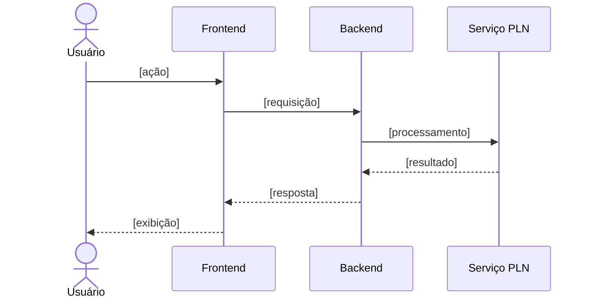

<p align='center'>
  <a href='https://www.inteli.edu.br/'>
    
  </a>
</p>

---

## Projeto: Azum


## Sumário

<details>
<summary><strong>1. Entendimento de Negócio</strong></summary>

- [1.1 Problema](#11-problema)
- [1.2 Contexto da Indústria do Parceiro](#12-contexto-da-indústria-do-parceiro)
- [1.3 Visão do Produto](#13-visão-do-produto)
- [1.4 Objetivo do Produto](#14-objetivo-do-produto)
- [1.5 Personas e Jornada do Usuário](#15-personas-e-jornada-do-usuário)
- [1.6 Fluxo do Negócio](#16-fluxo-do-negócio)
- [1.7 Brainstorming de Features](#17-brainstorming-de-features)
- [1.8 Canvas do MVP](#18-canvas-do-mvp)
- [1.9 Matriz de Risco do Projeto](#19-matriz-de-risco-do-projeto)

</details>

<details>
<summary><strong>2. Especificação de Requisitos de Software (Sprint 1)</strong></summary>

- [2.1 Business Drivers](#21-business-drivers)
- [2.2 Requisitos Funcionais](#22-requisitos-funcionais)
- [2.3 Requisitos Não Funcionais](#23-requisitos-não-funcionais)
- [2.4 Visão Inicial da Solução Técnica](#24-visão-inicial-da-solução-técnica)
- [2.5 Tecnologias e Ferramentas](#25-tecnologias-e-ferramentas)

</details>

- [3. Registro de Decisões](#3-registro-de-decisões)

---

# 1. Entendimento de Negócio

## 1.1 Problema

&emsp; O Metrô de São Paulo gerencia empreendimentos de elevada complexidade técnica, financeira e administrativa. Esses projetos podem durar entre oito e dez anos, envolver investimentos bilionários, mais de uma centena de contratos e produzir dezenas de milhares de documentos. Nesse cenário, o PMO Corporativo é responsável pela governança da estratégia, dos portfólios, dos programas e dos projetos da companhia, acompanhando cronogramas, marcos, riscos, problemas, indicadores, benefícios e mudanças.

&emsp; Atualmente, o Metrô já possui processos, ferramentas e práticas estabelecidas para a gestão e o armazenamento desses documentos e informações. Portanto, o desafio não está na ausência de uma estrutura de gestão documental, mas na necessidade de tornar a interação com esse grande volume de conteúdo mais simples, ágil e acessível.

&emsp; Mesmo com os documentos organizados, a localização de uma informação específica pode exigir que o profissional navegue por diferentes arquivos, listas, relatórios ou sistemas, aplique filtros e analise manualmente os resultados. Além disso, o registro de novas informações e documentos depende do acesso às ferramentas utilizadas e do preenchimento correto dos campos necessários. Essas atividades podem demandar tempo e aumentar a carga operacional das equipes, principalmente diante da quantidade e da complexidade dos projetos administrados.

&emsp; Dessa forma, o desafio consiste em oferecer uma maneira mais rápida e intuitiva de consultar e adicionar informações à estrutura de gestão já existente. Por meio de uma interação em linguagem natural, tanto por texto quanto por áudio, o usuário poderá solicitar dados sobre determinado projeto, localizar documentos, verificar riscos, marcos e pendências ou registrar novas informações sem precisar navegar manualmente por diferentes interfaces. As inclusões realizadas com o auxílio do agente, entretanto, deverão passar por validações, respeitar os campos obrigatórios e as permissões de cada usuário, além de manter a rastreabilidade das alterações.

&emsp; A dificuldade de acessar e registrar informações com agilidade pode atrasar análises, aumentar o esforço necessário para elaborar relatórios e limitar a capacidade do PMO de identificar riscos, pendências e desvios de maneira preventiva. No setor metroferroviário, em que os empreendimentos envolvem recursos públicos e afetam diretamente a mobilidade da população, a rapidez, a integridade e a confiabilidade dessas informações são fundamentais para apoiar decisões e acompanhar a entrega dos benefícios planejados.

&emsp; Portanto, o problema central que o projeto busca resolver é a necessidade de tornar mais ágil, simples e intuitiva a consulta e a adição de informações na estrutura de gestão documental já utilizada pelo Metrô. O objetivo não é substituir os processos, as ferramentas ou os profissionais responsáveis, mas reduzir o esforço manual necessário para localizar, interpretar e registrar informações relacionadas aos empreendimentos.

&emsp; Como resposta a esse desafio, o projeto considera o desenvolvimento de um agente de Inteligência Artificial capaz de compreender solicitações em linguagem natural e, por meio de integrações com o ambiente Microsoft homologado do Metrô, consultar ou registrar informações autorizadas. A solução deverá preservar os processos existentes, as regras de negócio, as permissões de acesso, a segurança e a rastreabilidade, funcionando como uma nova camada de interação com o ambiente já administrado pelo Metrô e apoiando, sem substituir, a análise e a tomada de decisão dos profissionais responsáveis.


### Matriz SWOT

&emsp; Para aprofundar a compreensão do problema e do contexto em que a solução será inserida, foi elaborada uma Matriz SWOT, ferramenta de análise estratégica que organiza os fatores internos (forças e fraquezas) e externos (oportunidades e ameaças) que influenciam o negócio. A imagem 1 apresenta a matriz elaborada para o Metrô de São Paulo, com foco na atuação do PMO Corporativo e na gestão de informações de seus empreendimentos, e os quadrantes são analisados em detalhe na sequência.

<div align="center">
<sub>Imagem 01 - Matriz SWOT </sub><br>
  <br>
  <sup>Fonte: Material produzido pelos autores, 2026.</sup>
</div>


&emsp; A Matriz SWOT foi elaborada para analisar o contexto interno e externo do Metrô de São Paulo, com foco na atuação do PMO Corporativo e na gestão de informações relacionadas aos seus empreendimentos. As forças e fraquezas representam características internas da organização, enquanto as oportunidades e ameaças correspondem a fatores externos que podem influenciar suas atividades.

&emsp; Entre as principais forças do Metrô, destacam-se sua ampla experiência na gestão de empreendimentos de grande porte, a presença de profissionais especializados e a existência de processos consolidados de governança e gestão documental. A organização também conta com um PMO Corporativo estruturado, responsável por apoiar o acompanhamento da estratégia, dos portfólios, dos programas, dos projetos e dos indicadores. Esses elementos favorecem o controle das iniciativas e o alinhamento dos empreendimentos aos objetivos estratégicos da companhia.

&emsp; Em relação às fraquezas, a própria dimensão e complexidade das operações representam desafios internos. Os empreendimentos podem envolver longos períodos de execução, investimentos elevados, numerosos contratos e a produção de milhares de documentos. Embora o Metrô já possua ferramentas e processos para administrar essas informações, o grande volume de conteúdo pode tornar a localização, a consulta e a consolidação dos dados mais demoradas, aumentando o esforço operacional, a dependência de ações manuais de consolidação e verificação da qualidade das informações e o risco de inconsistências nos dados, o que dificulta a obtenção rápida de uma visão integrada dos projetos.
&emsp; No ambiente externo, a transformação digital representa uma oportunidade importante. O avanço da inteligência artificial, do Processamento de Linguagem Natural e das tecnologias de integração de dados possibilita aperfeiçoar a maneira como as informações são consultadas, registradas e analisadas. A adoção dessas tecnologias pode reduzir atividades manuais, aumentar a eficiência dos processos, fortalecer a transparência e apoiar decisões mais rápidas e fundamentadas em evidências. Destaca-se, ainda, que parte dessas tecnologias já está disponível no ecossistema Microsoft homologado pelo Metrô, como o Copilot Studio e a Power Platform, o que permite incorporá-las de forma gradual e sem violar as restrições de confidencialidade estabelecidas pela companhia.
&emsp; Entretanto, o Metrô também está exposto a ameaças externas que podem afetar a continuidade e os resultados de seus empreendimentos. Entre elas estão restrições orçamentárias, mudanças regulatórias, dependência de fornecedores, riscos relacionados à segurança da informação, atrasos em grandes obras e possíveis mudanças ou substituições na plataforma de gestão de portfólio, o que exige que novas soluções sejam flexíveis e desacopladas das ferramentas atuais. Por prestar um serviço público essencial e administrar empreendimentos financiados com recursos públicos, eventuais falhas, atrasos ou problemas de segurança podem produzir impactos financeiros, institucionais e sociais relevantes.
&emsp; A análise demonstra que o Metrô possui uma base organizacional sólida para aproveitar as oportunidades proporcionadas pela transformação digital. Sua experiência, seus profissionais especializados, seus processos consolidados e seu PMO estruturado oferecem condições favoráveis para a incorporação gradual de novas tecnologias. Ao mesmo tempo, qualquer iniciativa deve considerar a complexidade interna da organização e as ameaças existentes no ambiente externo.
&emsp;Nesse contexto, o projeto pode aproveitar as forças já existentes no Metrô para facilitar o acesso e o registro de informações, sem substituir os processos e mecanismos atuais de gestão. A implementação de uma nova camada de interação deve ocorrer de forma segura, integrada e alinhada às regras da organização, contribuindo para reduzir o esforço operacional e melhorar o apoio à tomada de decisão.

---

## 1.2 Contexto da Indústria do Parceiro

### Visão geral do setor


### Tendências e desafios

- **Tendência 1:** [...]
- **Tendência 2:** [...]
- **Desafio 1:** [...]
- **Desafio 2:** [...]

### Posicionamento do parceiro no mercado


---

## 1.3 Visão do Produto

### Descrição geral


### O que o produto FAZ (escopo)

| # | Funcionalidade | Descrição |
|---|---|---|
| 1 | [Funcionalidade] | [Descrição breve] |
| 2 | [Funcionalidade] | [Descrição breve] |
| 3 | [Funcionalidade] | [Descrição breve] |

### O que o produto NÃO FAZ (fora de escopo)

| # | Item fora do escopo | Justificativa |
|---|---|---|
| 1 | [Limitação] | [Por que está fora do escopo] |
| 2 | [Limitação] | [Por que está fora do escopo] |

---

## 1.4 Objetivo do Produto


**Objetivo geral:** 

**Objetivos específicos:**

1. [Objetivo mensurável 1]


---

## 1.5 Personas e Jornada do Usuário

### Persona 1: [Nome fictício]


### Jornada do Usuário — [Persona X]


---

## 1.6 Fluxo do Negócio

### Cadeia de valor

<!-- Modelagem da cadeia de valor dos processos relacionados ao contexto do projeto. -->


[Descrição da cadeia de valor...]

### Fluxo principal (BPMN)

<!-- Diagrama BPMN do fluxo principal. Ferramentas sugeridas: Bizagi, draw.io, Camunda Modeler. -->


**Descrição do processo:**

1. **[Atividade 1]:** [descrição]
2. **[Atividade 2]:** [descrição]
3. **[Gateway/decisão]:** [condições e caminhos]
4. **[Atividade final]:** [descrição]

---

## 1.7 Brainstorming de Features

### Ideias levantadas


| # | Feature | Origem (grupo/parceiro) | Descrição |
|---|---|---|---|
| F01 | [Feature] | [Grupo] | [...] |
| F02 | [Feature] | [Parceiro] | [...] |
| F03 | [Feature] | [Grupo] | [...] |

### Priorização


**Critério de priorização:** [ex.: Importância (1-5) × Viabilidade (1-5)]

| Prioridade | Feature | Importância | Viabilidade | Score | Entra no MVP? |
|---|---|---|---|---|---|
| 1º | [F0X] | 5 | 5 | 25 | ✅ Sim |
| 2º | [F0X] | 4 | 5 | 20 | ✅ Sim |
| 3º | [F0X] | 5 | 2 | 10 | ❌ Futuro |

---

## 1.8 Canvas do MVP

<!-- Preencha o MVP Canvas (Paulo Caroli) ou estrutura equivalente. -->


| Bloco | Conteúdo |
|---|---|
| **Proposta do MVP** | [O que é a versão mínima e viável] |
| **Segmento de personas** | [Para quem é este MVP] |
| **Jornadas atendidas** | [Quais jornadas o MVP cobre] |
| **Funcionalidades** | [Features incluídas no recorte] |
| **Resultado esperado** | [Aprendizado/valor que se espera obter] |
| **Métricas para validar** | [Como saber se o MVP funcionou] |
| **Custo e cronograma** | [Estimativa de esforço e prazo] |

**Justificativa do recorte:** [Por que essas features e não outras.]

---

## 1.9 Matriz de Risco do Projeto

### Critérios de avaliação

- **Escala de probabilidade:** 1 (muito baixa) a 5 (muito alta)
- **Escala de impacto:** 1 (muito baixo) a 5 (muito alto)
- **Severidade:** Probabilidade × Impacto
- **Faixas de criticidade:**
  - 🟢 Baixa: 1–6
  - 🟡 Média: 8–12
  - 🔴 Alta: 15–25

### Registro de riscos


### Matriz Probabilidade × Impacto


# 2. Especificação de Requisitos de Software (Sprint 1)

## 2.1 Business Drivers


### Contexto da aplicação

[Como o processamento de linguagem natural transforma o negócio do parceiro...]

### Fluxo de negócio 1: [Nome do fluxo]

- **Situação atual (AS-IS):** [como funciona hoje]
- **Situação proposta (TO-BE):** [como funcionará com a solução]
- **Indicadores computacionais:** [ex.: precisão da classificação por tags ≥ X%, taxa de acerto de intenção, WER na conversão áudio→texto, latência de resposta...]

### Fluxo de negócio 2: [Nome do fluxo]

- **Situação atual (AS-IS):** [...]
- **Situação proposta (TO-BE):** [...]
- **Indicadores computacionais:** [...]

---

## 2.2 Requisitos Funcionais

### Histórias de usuário

<!-- Formato: Como [persona], quero [ação] para [benefício].
     Inclua critérios de aceitação testáveis. -->

#### RF01 — [Título da história]

> **Como** [persona], **quero** [ação/funcionalidade], **para** [benefício/valor].

**Critérios de aceitação:**
- [ ] [Critério 1]
- [ ] [Critério 2]

**Prioridade:** [Alta/Média/Baixa] · **Persona relacionada:** [Persona X]

#### RF02 — [Título da história]

> **Como** [persona], **quero** [ação], **para** [benefício].

**Critérios de aceitação:**
- [ ] [Critério 1]
- [ ] [Critério 2]

<!-- Repita para cada requisito funcional. -->

### Modelagem estática — Diagrama de classes do domínio

<!-- Classes e atributos do domínio, coerentes com as histórias acima. -->


```mermaid
classDiagram
    class Usuario {
        +id: UUID
        +nome: String
        +email: String
    }
    class [EntidadeDominio] {
        +atributo1: Tipo
        +atributo2: Tipo
    }
    Usuario "1" --> "*" [EntidadeDominio] : possui
```

**Descrição das classes:**

| Classe | Responsabilidade | Relacionamentos |
|---|---|---|
| Usuario | [...] | [...] |
| [Entidade] | [...] | [...] |

### Modelagem dinâmica — Cenários e diagramas de sequência

#### Cenário 1: [Nome do cenário — relacionado ao RF0X]

**Descrição:** [Fluxo passo a passo do cenário.]




<!-- Repita para os demais cenários. Garanta coerência: cada diagrama
     deve corresponder a uma história de usuário e usar as classes do domínio. -->

---

## 2.3 Requisitos Não Funcionais

<!-- Mínimo de 2 RNFs, derivados dos business drivers,
     descritos como histórias de usuário e coerentes com os RFs. -->

#### RNF01 — [Categoria: ex. Desempenho]

> **Como** [persona], **quero** [qualidade do sistema, ex.: receber a resposta em até X segundos], **para** [benefício].

- **Business driver relacionado:** [Fluxo 1/2]
- **Métrica de verificação:** [como será medido]
- **Critério de aceitação:** [valor-alvo]

#### RNF02 — [Categoria: ex. Acurácia do modelo]

> **Como** [persona], **quero** [ex.: que a classificação por tags tenha precisão ≥ X%], **para** [benefício].

- **Business driver relacionado:** [...]
- **Métrica de verificação:** [...]
- **Critério de aceitação:** [...]

---

## 2.4 Visão Inicial da Solução Técnica

<!-- OBRIGATÓRIO: diagrama UML de componentes ou de pacotes.
     Esboço em blocos conectados cobrindo as 3 camadas:
     interface humano-computador, lógica de negócio, acesso a dados/serviços. -->

### Diagrama de componentes (UML)


### Descrição das camadas

| Camada | Componentes | Responsabilidade |
|---|---|---|
| **Interface (IHC)** | [ex.: Web App, Chat UI] | [...] |
| **Lógica de negócio** | [ex.: API, Serviço de PLN, Orquestrador] | [...] |
| **Dados e serviços** | [ex.: Banco de dados, APIs externas, storage] | [...] |

### Conexões entre componentes

- **[Componente A] → [Componente B]:** [protocolo/motivo da conexão, ex.: REST/JSON]
- **[Componente B] → [Componente C]:** [...]

---

## 2.5 Tecnologias e Ferramentas

<!-- Estimativa inicial — pode ser revisada nas próximas sprints. -->

| Categoria | Tecnologia/Ferramenta | Justificativa |
|---|---|---|
| Linguagem (backend) | [ex.: Python 3.12] | [...] |
| Framework (backend) | [ex.: FastAPI] | [...] |
| Frontend | [ex.: React] | [...] |
| PLN / IA | [ex.: spaCy, Hugging Face, API de LLM] | [...] |
| Banco de dados | [ex.: PostgreSQL] | [...] |
| Infraestrutura | [ex.: Docker, AWS] | [...] |
| Versionamento | [ex.: Git + GitHub] | [...] |
| Gestão do projeto | [ex.: GitHub Projects] | [...] |
| Modelagem | [ex.: draw.io, Mermaid, Bizagi] | [...] |

---

# 3. Registro de Decisões

<!-- Registre as decisões mais relevantes tomadas pelo grupo. -->

| # | Data | Decisão | Alternativas consideradas | Justificativa |
|---|---|---|---|---|
| D01 | [DD/MM] | [...] | [...] | [...] |
| D02 | [DD/MM] | [...] | [...] | [...] |
