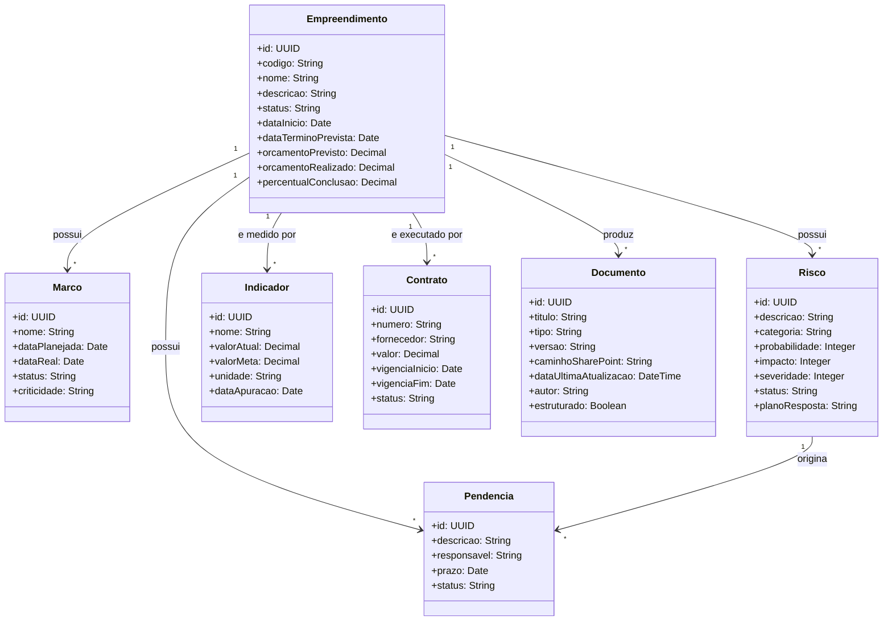
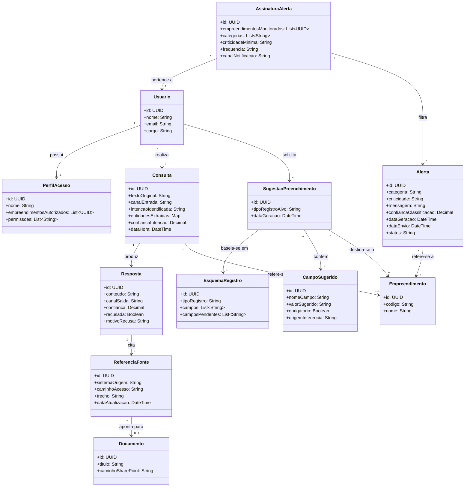
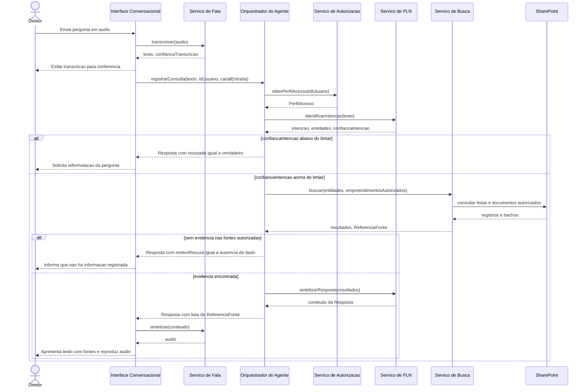
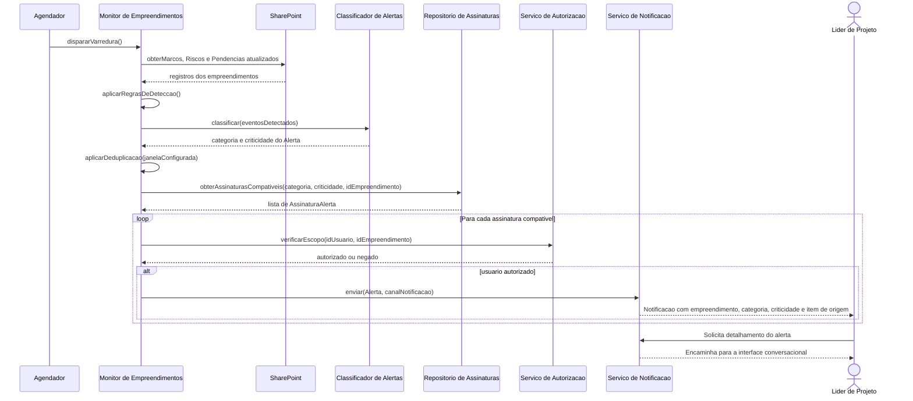
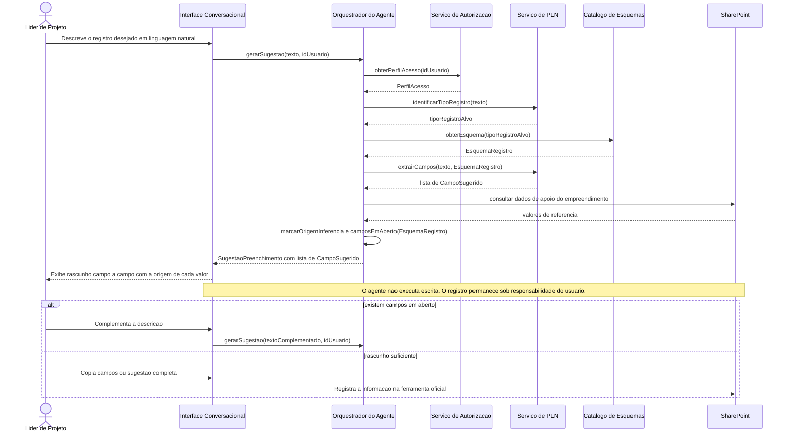

  

---

## Projeto: Azum

## Sumário

<strong>1. Entendimento de Negócio</strong>

- [1.1 Problema](#11-problema)
- [1.2 Contexto da Indústria do Parceiro](#12-contexto-da-indústria-do-parceiro)
- [1.3 Visão do Produto](#13-visão-do-produto)
- [1.4 Objetivo do Produto](#14-objetivo-do-produto)
- [1.5 Personas e Jornada do Usuário](#15-personas-e-jornada-do-usuário)
- [1.6 Fluxo do Negócio](#16-fluxo-do-negócio)
- [1.7 Brainstorming de Features](#17-brainstorming-de-features)
- [1.8 Canvas do MVP](#18-canvas-do-mvp)
- [1.9 Matriz de Risco do Projeto](#19-matriz-de-risco-do-projeto)

<strong>2. Especificação de Requisitos de Software (Sprint 1)</strong>

- [2.1 Business Drivers](#21-business-drivers)
- [2.2 Requisitos Funcionais](#22-requisitos-funcionais)
- [2.3 Requisitos Não Funcionais](#23-requisitos-não-funcionais)
- [2.4 Visão Inicial da Solução Técnica](#24-visão-inicial-da-solução-técnica)
- [2.5 Tecnologias e Ferramentas](#25-tecnologias-e-ferramentas)

- [3. Registro de Decisões](#3-registro-de-decisões)

---

# 1. Entendimento de Negócio

## 1.1 Problema

**Impacto sobre o parceiro:** [...]

**Impacto sobre o setor:** [...]

### Matriz SWOT

---

## 1.2 Contexto da Indústria do Parceiro

### Visão geral do setor

### Tendências e desafios

- **Tendência 1:** [...]
- **Tendência 2:** [...]
- **Desafio 1:** [...]
- **Desafio 2:** [...]

### Posicionamento do parceiro no mercado

---

## 1.3 Visão do Produto

### Descrição geral

### O que o produto FAZ (escopo)

| # | Funcionalidade | Descrição |
|---|---|---|
| 1 | [Funcionalidade] | [Descrição breve] |
| 2 | [Funcionalidade] | [Descrição breve] |
| 3 | [Funcionalidade] | [Descrição breve] |

### O que o produto NÃO FAZ (fora de escopo)

| # | Item fora do escopo | Justificativa |
|---|---|---|
| 1 | [Limitação] | [Por que está fora do escopo] |
| 2 | [Limitação] | [Por que está fora do escopo] |

---

## 1.4 Objetivo do Produto

**Objetivo geral:** 

**Objetivos específicos:**

1. [Objetivo mensurável 1]

---

## 1.5 Personas e Jornada do Usuário

### Persona 1: [Nome fictício]

### Jornada do Usuário — [Persona X]

---

## 1.6 Fluxo do Negócio

### Cadeia de valor

<!-- Modelagem da cadeia de valor dos processos relacionados ao contexto do projeto. -->

[Descrição da cadeia de valor...]

### Fluxo principal (BPMN)

<!-- Diagrama BPMN do fluxo principal. Ferramentas sugeridas: Bizagi, draw.io, Camunda Modeler. -->

**Descrição do processo:**

1. **[Atividade 1]:** [descrição]
2. **[Atividade 2]:** [descrição]
3. **[Gateway/decisão]:** [condições e caminhos]
4. **[Atividade final]:** [descrição]

---

## 1.7 Brainstorming de Features

### Ideias levantadas

| # | Feature | Origem (grupo/parceiro) | Descrição |
|---|---|---|---|
| F01 | [Feature] | [Grupo] | [...] |
| F02 | [Feature] | [Parceiro] | [...] |
| F03 | [Feature] | [Grupo] | [...] |

### Priorização

**Critério de priorização:** [ex.: Importância (1-5) × Viabilidade (1-5)]

| Prioridade | Feature | Importância | Viabilidade | Score | Entra no MVP? |
|---|---|---|---|---|---|
| 1º | [F0X] | 5 | 5 | 25 | ✅ Sim |
| 2º | [F0X] | 4 | 5 | 20 | ✅ Sim |
| 3º | [F0X] | 5 | 2 | 10 | ❌ Futuro |

---

## 1.8 Canvas do MVP

<!-- Preencha o MVP Canvas (Paulo Caroli) ou estrutura equivalente. -->

| Bloco | Conteúdo |
|---|---|
| **Proposta do MVP** | [O que é a versão mínima e viável] |
| **Segmento de personas** | [Para quem é este MVP] |
| **Jornadas atendidas** | [Quais jornadas o MVP cobre] |
| **Funcionalidades** | [Features incluídas no recorte] |
| **Resultado esperado** | [Aprendizado/valor que se espera obter] |
| **Métricas para validar** | [Como saber se o MVP funcionou] |
| **Custo e cronograma** | [Estimativa de esforço e prazo] |

**Justificativa do recorte:** [Por que essas features e não outras.]

---

## 1.9 Matriz de Risco do Projeto

### Critérios de avaliação

- **Escala de probabilidade:** 1 (muito baixa) a 5 (muito alta)
- **Escala de impacto:** 1 (muito baixo) a 5 (muito alto)
- **Severidade:** Probabilidade × Impacto
- **Faixas de criticidade:**
  - 🟢 Baixa: 1–6
  - 🟡 Média: 8–12
  - 🔴 Alta: 15–25

### Registro de riscos

### Matriz Probabilidade × Impacto

# 2. Especificação de Requisitos de Software (Sprint 1)

## 2.1 Business Drivers

### Contexto da aplicação

[Como o processamento de linguagem natural transforma o negócio do parceiro...]

### Fluxo de negócio 1: [Nome do fluxo]

- **Situação atual (AS-IS):** [como funciona hoje]
- **Situação proposta (TO-BE):** [como funcionará com a solução]
- **Indicadores computacionais:** [ex.: precisão da classificação por tags ≥ X%, taxa de acerto de intenção, WER na conversão áudio→texto, latência de resposta...]

### Fluxo de negócio 2: [Nome do fluxo]

- **Situação atual (AS-IS):** [...]
- **Situação proposta (TO-BE):** [...]
- **Indicadores computacionais:** [...]

---

## 2.2 Requisitos Funcionais

### Visão geral dos requisitos funcionais

| ID e título | User story | Critério de aceitação | Prioridade |
|---|---|---|---|
| RF01 – Interação em linguagem natural por texto e voz | Como usuário do portfólio, quero enviar minhas solicitações por texto ou áudio, para obter informações sem precisar navegar por planilhas e documentos. | Ao receber uma solicitação por texto ou por áudio, o sistema deve processá-la no mesmo canal e responder no formato de entrada, exibindo a transcrição para conferência quando a entrada for em áudio. | Alta |
| RF02 – Identificação e classificação de intenções | Como usuário do portfólio, quero que o agente entenda o que estou pedindo e recuse pedidos fora do contexto do portfólio, para que minhas solicitações sejam atendidas corretamente e o uso permaneça dentro do escopo da empresa. | Ao receber uma solicitação, o sistema deve classificá-la em uma das intenções catalogadas com o parceiro e, quando ela estiver fora do contexto do portfólio, responder informando a limitação sem consultar as fontes. | Alta |
| RF03 – Consulta e análise comparativa de projetos | Como PMO, quero consultar dados de um projeto e comparar projetos do portfólio, para avaliar status e desempenho sem consolidar documentos manualmente. | Ao consultar um ou mais projetos, o sistema deve retornar os indicadores solicitados limitados ao escopo de permissão do usuário, apresentando as comparações em formato tabular com a data de apuração de cada valor. | Alta |
| RF04 – Apresentação da fonte da informação | Como diretor, quero saber de qual documento e de qual data veio cada resposta, para confiar na informação antes de tomar uma decisão. | Ao apresentar qualquer dado de negócio, o sistema deve exibir o documento de origem, o caminho de acesso no SharePoint e a data da última atualização, listando todas as fontes quando a resposta combinar mais de uma. | Alta |
| RF05 – Solicitação de esclarecimento em casos ambíguos | Como líder de projeto, quero que o agente me pergunte o que faltou quando meu pedido estiver incompleto ou ambíguo, para receber a resposta certa sem ter que reformular a solicitação inteira. | Ao receber uma solicitação incompleta ou ambígua, o sistema deve perguntar apenas o dado faltante e preservar o que já foi informado, em vez de responder com conteúdo não fundamentado. | Alta |
| RF06 – Sugestão de preenchimento de documentos | Como líder de projeto, quero receber sugestões de texto para os campos pendentes dos meus documentos, para preencher o portfólio mais rápido mantendo o controle sobre o que é efetivamente gravado. | Ao solicitar apoio no preenchimento de um documento, o sistema deve sugerir no chat um texto para cada campo pendente, permitindo a cópia campo a campo e sem gravar nada no sistema de origem. | Média |
| RF07 – Alertas proativos personalizados | Como PMO, quero ser notificado sobre marcos, riscos e pendências dos projetos que acompanho, para agir antes que virem problema. | Ao detectar marcos, riscos ou pendências que atendam aos filtros configurados pelo usuário, o sistema deve notificá-lo informando o projeto, a categoria e a criticidade, sem repetir alertas já enviados. | Média |

### Modelagem estática — Diagrama de classes do domínio

&emsp; O domínio foi representado em dois diagramas complementares. O primeiro descreve as entidades de negócio dos empreendimentos administrados pelo PMO Corporativo, que constituem o conteúdo consultado pelo agente. O segundo descreve as entidades da camada de interação, responsáveis por representar consultas, respostas, alertas e sugestões de preenchimento. As classes `Empreendimento` e `Documento` funcionam como elo entre os dois diagramas.

Imagem 2.2.1 - Diagrama de classes do domínio de empreendimentos

Fonte: Material produzido pelos autores, 2026.

Imagem 2.2.2 - Diagrama de classes da camada de interação do agente

Fonte: Material produzido pelos autores, 2026.

**Descrição das classes:**

| Classe | Responsabilidade | Relacionamentos | RFs atendidos |
|---|---|---|---|
| Empreendimento | Representa o projeto administrado pelo PMO, com dados de cronograma, execução física e financeira | Agrega Marco, Risco, Pendencia, Indicador, Contrato e Documento | RF03 |
| Marco | Representa um ponto de controle do cronograma, com data planejada e data real | Pertence a Empreendimento | RF03, RF07 |
| Risco | Representa um risco identificado, com probabilidade, impacto e severidade calculada | Pertence a Empreendimento e pode originar Pendencia | RF03, RF07 |
| Pendencia | Representa um item em aberto com responsável e prazo | Pertence a Empreendimento | RF03, RF07 |
| Indicador | Representa uma medida de desempenho apurada em determinada data | Pertence a Empreendimento | RF03 |
| Contrato | Representa um instrumento contratual vinculado ao empreendimento | Pertence a Empreendimento | RF03 |
| Documento | Representa conteúdo estruturado ou não estruturado hospedado no SharePoint | Produzido por Empreendimento e referenciado por ReferenciaFonte | RF03, RF04, RF06 |
| Usuario | Representa o profissional que interage com o agente | Possui PerfilAcesso, realiza Consulta e solicita SugestaoPreenchimento | RF03, RF07 |
| PerfilAcesso | Representa o escopo de permissão obtido do provedor de identidade corporativo | Pertence a Usuario e delimita consultas, sugestões e alertas | RF03, RF05, RF07 |
| Consulta | Representa uma solicitação em linguagem natural, com intenção e entidades identificadas | Produz Resposta e pode referenciar Empreendimento | RF01, RF02, RF03, RF05 |
| Resposta | Representa o retorno do agente, incluindo os casos de esclarecimento e de ausência de dado | Cita ReferenciaFonte | RF01, RF04, RF05 |
| ReferenciaFonte | Representa a origem verificável de um dado apresentado na resposta | Aponta para Documento ou registro de origem | RF04 |
| Alerta | Representa um evento detectado na varredura, já classificado por categoria e criticidade | Refere-se a Empreendimento e é filtrado por AssinaturaAlerta | RF07 |
| AssinaturaAlerta | Representa a configuração de acompanhamento definida pelo usuário, com empreendimentos, categorias e criticidade mínima | Pertence a Usuario e filtra Alerta | RF07 |
| EsquemaRegistro | Representa a definição dos campos do documento alvo e de quais permanecem pendentes | Base de SugestaoPreenchimento | RF06 |
| SugestaoPreenchimento | Representa o rascunho gerado pelo agente, sem efeito de escrita nos sistemas | Contém CampoSugerido e baseia-se em EsquemaRegistro | RF06 |
| CampoSugerido | Representa um campo do rascunho, com valor e origem da inferência | Pertence a SugestaoPreenchimento | RF06 |

**Nota:** Os diagramas estão versionados em Mermaid para permitir revisão por meio de pull request. Caso a apresentação exija arquivo de imagem, os diagramas devem ser exportados para a pasta `assets` mantendo a numeração das figuras.

### Modelagem dinâmica — Cenários e diagramas de sequência

&emsp; Foram modelados três cenários, um para cada bloco funcional, de modo a cobrir os requisitos de maior criticidade e demonstrar a articulação entre os componentes da solução. As mensagens trocadas utilizam as classes definidas na modelagem estática.

#### Cenário 1: Consulta consolidada de portfólio por voz

**Requisitos exercitados:** RF01, RF02, RF03, RF04, RF05

**Descrição:** O Diretor formula por áudio uma pergunta sobre o andamento de um empreendimento. A interface transcreve o áudio e encaminha o texto ao orquestrador, que recupera o escopo de permissão do usuário no provedor de identidade corporativo. O serviço de PLN identifica a intenção e as entidades. Caso a confiança fique abaixo do limiar, o agente aplica a recusa segura prevista no RF05. Caso contrário, o serviço de busca consulta o SharePoint dentro do escopo autorizado, o orquestrador sintetiza a resposta com as referências de fonte e a interface apresenta o resultado em texto e em áudio.

Imagem 2.2.3 - Diagrama de sequência do Cenário 1

Fonte: Material produzido pelos autores, 2026.

#### Cenário 2: Geração e envio de alerta proativo classificado

**Requisitos exercitados:** RF07

**Descrição:** O agendador dispara a varredura periódica na frequência configurada. O monitor obtém do SharePoint os marcos, riscos e pendências atualizados e aplica as regras de detecção, considerando a janela de antecedência dos marcos, o limiar de severidade dos riscos e o vencimento das pendências. Os eventos detectados são submetidos ao classificador, que atribui categoria e criticidade, informações exigidas pelo RF07 no conteúdo da notificação. Após a deduplicação, o monitor recupera as assinaturas compatíveis com o alerta, o que garante a personalização prevista no requisito, e confirma o escopo de permissão de cada destinatário antes do envio. O PMO pode solicitar detalhamento, o que reencaminha a interação para o fluxo do Cenário 1.

Imagem 2.2.4 - Diagrama de sequência do Cenário 2

Fonte: Material produzido pelos autores, 2026.

#### Cenário 3: Proposição assistida de preenchimento de registro

**Requisitos exercitados:** RF02, RF06

**Descrição:** O Líder de Projeto descreve em linguagem natural a informação que precisa registrar. O orquestrador identifica o tipo de registro pretendido e recupera o esquema correspondente no catálogo. O serviço de PLN extrai os pares de campo e valor a partir da descrição, complementados por dados de apoio consultados no SharePoint dentro do escopo autorizado. O orquestrador confronta os campos preenchidos com o esquema para marcar os que permanecem em aberto, e a interface apresenta o rascunho campo a campo indicando a origem de cada valor. O agente não realiza escrita nos sistemas do Metrô, cabendo ao usuário efetivar o registro na ferramenta oficial.

Imagem 2.2.5 - Diagrama de sequência do Cenário 3

Fonte: Material produzido pelos autores, 2026.

### Rastreabilidade entre requisitos, cenários e classes

| ID | Cenário | Classes principais |
|---|---|---|
| RF01 | Cenário 1 | Consulta, Resposta |
| RF02 | Cenários 1 e 3 | Consulta, SugestaoPreenchimento, EsquemaRegistro |
| RF03 | Cenário 1 | Consulta, Resposta, Empreendimento, Indicador, Marco, Risco, PerfilAcesso |
| RF04 | Cenário 1 | Resposta, ReferenciaFonte, Documento |
| RF05 | Cenário 1 | Consulta, Resposta |
| RF06 | Cenário 3 | SugestaoPreenchimento, CampoSugerido, EsquemaRegistro, Documento |
| RF07 | Cenário 2 | Alerta, AssinaturaAlerta, Marco, Risco, Pendencia, PerfilAcesso |

---

## 2.3 Requisitos Não Funcionais

<!-- Mínimo de 2 RNFs, derivados dos business drivers,
     descritos como histórias de usuário e coerentes com os RFs. -->

#### RNF01 — [Categoria: ex. Desempenho]

> **Como** [persona], **quero** [qualidade do sistema, ex.: receber a resposta em até X segundos], **para** [benefício].

- **Business driver relacionado:** [Fluxo 1/2]
- **Métrica de verificação:** [como será medido]
- **Critério de aceitação:** [valor-alvo]

#### RNF02 — [Categoria: ex. Acurácia do modelo]

> **Como** [persona], **quero** [ex.: que a classificação por tags tenha precisão ≥ X%], **para** [benefício].

- **Business driver relacionado:** [...]
- **Métrica de verificação:** [...]
- **Critério de aceitação:** [...]

---

## 2.4 Visão Inicial da Solução Técnica

<!-- OBRIGATÓRIO: diagrama UML de componentes ou de pacotes.
     Esboço em blocos conectados cobrindo as 3 camadas:
     interface humano-computador, lógica de negócio, acesso a dados/serviços. -->

### Diagrama de componentes (UML)

### Descrição das camadas

| Camada | Componentes | Responsabilidade |
|---|---|---|
| **Interface (IHC)** | [ex.: Web App, Chat UI] | [...] |
| **Lógica de negócio** | [ex.: API, Serviço de PLN, Orquestrador] | [...] |
| **Dados e serviços** | [ex.: Banco de dados, APIs externas, storage] | [...] |

### Conexões entre componentes

- **[Componente A] → [Componente B]:** [protocolo/motivo da conexão, ex.: REST/JSON]
- **[Componente B] → [Componente C]:** [...]

---

## 2.5 Tecnologias e Ferramentas

<!-- Estimativa inicial — pode ser revisada nas próximas sprints. -->

| Categoria | Tecnologia/Ferramenta | Justificativa |
|---|---|---|
| Linguagem (backend) | [ex.: Python 3.12] | [...] |
| Framework (backend) | [ex.: FastAPI] | [...] |
| Frontend | [ex.: React] | [...] |
| PLN / IA | [ex.: spaCy, Hugging Face, API de LLM] | [...] |
| Banco de dados | [ex.: PostgreSQL] | [...] |
| Infraestrutura | [ex.: Docker, AWS] | [...] |
| Versionamento | [ex.: Git + GitHub] | [...] |
| Gestão do projeto | [ex.: GitHub Projects] | [...] |
| Modelagem | [ex.: draw.io, Mermaid, Bizagi] | [...] |

---

# 3. Registro de Decisões

<!-- Registre as decisões mais relevantes tomadas pelo grupo. -->

| # | Data | Decisão | Alternativas consideradas | Justificativa |
|---|---|---|---|---|
| D01 | [DD/MM] | [...] | [...] | [...] |
| D02 | [DD/MM] | [...] | [...] | [...] |
